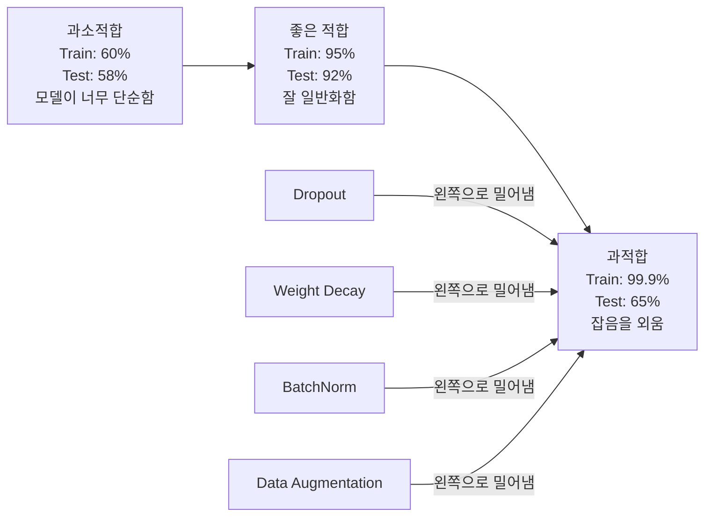
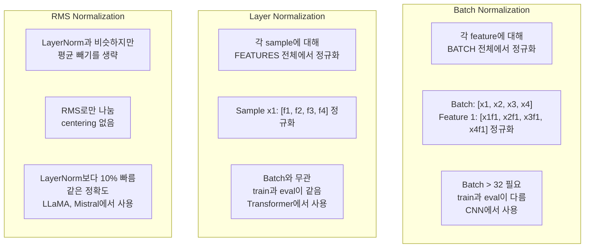
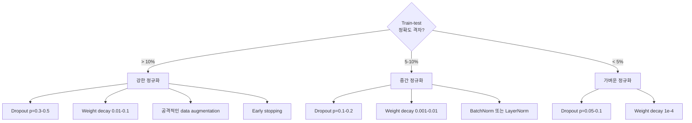

# 정규화

> 모델이 훈련 데이터에서는 99%, 테스트 데이터에서는 60%를 기록한다면, 학습한 것이 아니라 외운 것입니다. 정규화는 일반화를 강제하기 위해 복잡도에 부과하는 비용입니다.

**Type:** Build
**Languages:** Python
**Prerequisites:** Lesson 03.06 (옵티마이저)
**Time:** ~75 minutes

## 학습 목표

- inverted scaling을 적용한 dropout, L2 weight decay, batch normalization, layer normalization, RMSNorm을 처음부터 구현합니다
- 훈련-테스트 정확도 격차를 측정하고 정규화 실험으로 과적합을 진단합니다
- transformer가 BatchNorm 대신 LayerNorm을 쓰는 이유와 최신 LLM이 RMSNorm을 선호하는 이유를 설명합니다
- 과적합의 심각도에 따라 올바른 정규화 기법 조합을 적용합니다

## 문제

파라미터가 충분한 신경망은 어떤 데이터셋이든 외울 수 있습니다. 이는 가설이 아닙니다. Zhang et al. (2017)은 표준 네트워크를 무작위 레이블이 붙은 ImageNet으로 훈련해 이를 증명했습니다. 네트워크는 완전히 무작위인 레이블 할당에서도 훈련 손실을 거의 0까지 낮췄습니다. 학습할 패턴이 전혀 없는 백만 개의 무작위 입출력 쌍을 외운 것입니다. 훈련 손실은 완벽했습니다. 테스트 정확도는 0이었습니다.

이것이 과적합 문제이며, 모델이 커질수록 더 심해집니다. GPT-3에는 1,750억 개의 파라미터가 있습니다. 훈련 세트에는 약 5,000억 개의 토큰이 있습니다. 이 정도 파라미터라면 모델은 훈련 데이터의 상당 부분을 그대로 외울 충분한 용량을 가집니다. 정규화가 없다면 일반화 가능한 패턴을 배우는 대신 훈련 예제를 그대로 토해낼 뿐입니다.

훈련 성능과 테스트 성능의 차이가 과적합 격차입니다. 이 수업의 모든 기법은 서로 다른 각도에서 그 격차를 공격합니다. Dropout은 네트워크가 특정 뉴런 하나에 의존하지 못하게 합니다. Weight decay는 어떤 단일 가중치도 지나치게 커지지 못하게 합니다. Batch normalization은 손실 지형을 매끄럽게 만들어 옵티마이저가 더 평평하고 일반화가 잘 되는 최소점을 찾게 합니다. Layer normalization은 같은 일을 하지만 batch normalization이 실패하는 곳, 즉 작은 배치와 가변 길이 시퀀스에서 작동합니다. RMSNorm은 평균 계산을 제거해 같은 일을 10% 더 빠르게 합니다. 각각의 기법은 단순합니다. 하지만 함께 쓰면 외우는 모델과 일반화하는 모델의 차이를 만듭니다.

## 개념

### 과적합 스펙트럼

모든 모델은 과소적합(패턴을 포착하기에는 너무 단순함)에서 과적합(너무 복잡해 잡음까지 포착함)까지의 스펙트럼 어딘가에 있습니다. 적절한 지점은 그 중간이며, 정규화는 과적합 쪽에 있는 모델을 그 지점으로 밀어냅니다.



### Dropout

가장 단순하면서도 가장 우아한 해석을 가진 정규화 기법입니다. 훈련 중 각 뉴런의 출력을 확률 p로 무작위로 0으로 만듭니다.

```text
output = activation(z) * mask    where mask[i] ~ Bernoulli(1 - p)
```

p = 0.5이면 매 forward pass마다 뉴런의 절반이 0이 됩니다. 네트워크는 어떤 뉴런을 사용할 수 있을지 예측할 수 없으므로 중복된 표현을 배워야 합니다. 이는 특정 다른 뉴런이 존재한다고 가정하고 뉴런들이 서로 의존하는 co-adaptation을 막습니다.

앙상블 해석은 이렇습니다. N개의 뉴런이 있는 네트워크에 dropout을 적용하면 가능한 subnetwork가 2^N개 생깁니다(각 뉴런이 켜지거나 꺼지는 모든 조합). Dropout으로 훈련하는 것은 서로 다른 mini-batch에서 2^N개의 subnetwork를 동시에 대략적으로 훈련하는 것과 같습니다. 테스트 시점에는 모든 뉴런을 사용하고(dropout 없음), 훈련 중 기대값과 맞추기 위해 출력을 (1 - p)로 스케일합니다. 이는 2^N개 subnetwork의 예측을 평균내는 것과 같습니다. 단일 모델에서 얻는 거대한 앙상블입니다.

실제로는 테스트 대신 훈련 중에 스케일링을 적용합니다(inverted dropout).

```text
During training:  output = activation(z) * mask / (1 - p)
During testing:   output = activation(z)   (no change needed)
```

이 방식이 더 깔끔합니다. 테스트 코드는 dropout에 대해 전혀 알 필요가 없습니다.

기본 비율은 transformer에서는 p = 0.1, MLP에서는 p = 0.5, CNN에서는 p = 0.2-0.3입니다. Dropout이 높을수록 정규화가 강해지고, 과소적합 위험도 커집니다.

### Weight Decay (L2 정규화)

모든 가중치 크기의 제곱합을 손실에 더합니다.

```text
total_loss = task_loss + (lambda / 2) * sum(w_i^2)
```

정규화 항의 gradient는 lambda * w입니다. 즉 매 단계에서 각 가중치는 그 크기에 비례하는 비율만큼 0을 향해 줄어듭니다. 큰 가중치일수록 더 크게 벌점을 받습니다. 모델은 어떤 단일 가중치도 지배적이지 않은 해로 밀려납니다.

이것이 일반화에 도움이 되는 이유는 과적합 모델이 훈련 데이터의 잡음을 증폭하는 큰 가중치를 갖는 경향이 있기 때문입니다. Weight decay는 가중치를 작게 유지해 모델의 유효 용량을 제한하고, 외운 특이점이 아니라 견고하고 일반화 가능한 특징에 의존하게 합니다.

lambda 하이퍼파라미터가 강도를 제어합니다. 일반적인 값은 다음과 같습니다.

- transformer에서 AdamW를 사용할 때 0.01
- CNN에서 SGD를 사용할 때 1e-4
- 심하게 과적합된 모델에서 0.1

Lesson 06에서 다룬 것처럼 weight decay와 L2 regularization은 SGD에서는 동등하지만 Adam에서는 그렇지 않습니다. Adam으로 훈련할 때는 항상 AdamW(decoupled weight decay)를 사용하세요.

### Batch Normalization

각 레이어의 출력을 다음 레이어로 넘기기 전에 mini-batch 전체에서 정규화합니다.

어떤 레이어의 activation mini-batch에 대해:

```text
mu = (1/B) * sum(x_i)           (batch mean)
sigma^2 = (1/B) * sum((x_i - mu)^2)   (batch variance)
x_hat = (x_i - mu) / sqrt(sigma^2 + eps)   (normalize)
y = gamma * x_hat + beta        (scale and shift)
```

Gamma와 beta는 학습 가능한 파라미터이며, 정규화를 되돌리는 것이 최적일 경우 네트워크가 그렇게 할 수 있게 합니다. 이것들이 없다면 모든 레이어의 출력을 평균 0, 분산 1로 강제하게 되는데, 네트워크가 원하는 형태가 아닐 수 있습니다.

**훈련과 추론의 분리:** 훈련 중에는 mu와 sigma가 현재 mini-batch에서 나옵니다. 추론 중에는 훈련 중 누적한 running average를 사용합니다(momentum = 0.1인 지수 이동 평균, 즉 기존 값 90% + 새 값 10%).

BatchNorm이 왜 작동하는지는 아직도 논쟁적입니다. 원 논문은 이것이 "internal covariate shift"(이전 레이어가 업데이트되면서 레이어 입력 분포가 바뀌는 현상)를 줄인다고 주장했습니다. Santurkar et al. (2018)은 이 설명이 틀렸음을 보였습니다. 실제 이유는 BatchNorm이 손실 지형을 더 매끄럽게 만들기 때문입니다. Gradient가 더 예측 가능해지고, Lipschitz 상수가 작아지며, 옵티마이저가 더 큰 step을 안전하게 취할 수 있습니다. 이것이 BatchNorm이 더 높은 learning rate를 허용하고 더 빠르게 수렴하게 하는 이유입니다.

BatchNorm에는 근본적인 한계가 있습니다. 배치 통계에 의존한다는 점입니다. 배치 크기가 1이면 평균과 분산은 의미가 없습니다. 작은 배치(< 32)에서는 통계가 noisy해서 성능을 해칩니다. 이는 메모리 제한으로 배치 크기가 작아지는 object detection이나 시퀀스 길이가 달라지는 language modeling 같은 작업에서 중요합니다.

### Layer Normalization

배치가 아니라 feature 전체에서 정규화합니다. 단일 sample에 대해:

```text
mu = (1/D) * sum(x_j)           (feature mean)
sigma^2 = (1/D) * sum((x_j - mu)^2)   (feature variance)
x_hat = (x_j - mu) / sqrt(sigma^2 + eps)
y = gamma * x_hat + beta
```

D는 feature dimension입니다. 각 sample은 독립적으로 정규화됩니다. 배치 크기에 의존하지 않습니다. 이것이 transformer가 BatchNorm 대신 LayerNorm을 쓰는 이유입니다. 시퀀스는 길이가 가변적이고, 배치 크기는 종종 작으며(생성 중에는 1인 경우도 있음), 계산은 훈련과 추론에서 동일합니다.

Transformer의 LayerNorm은 각 self-attention block과 feed-forward block 뒤(Post-LN), 또는 그 앞(Pre-LN, 훈련 안정성이 더 좋음)에 적용됩니다.

### RMSNorm

평균 빼기가 없는 LayerNorm입니다. Zhang & Sennrich (2019)가 제안했습니다.

```text
rms = sqrt((1/D) * sum(x_j^2))
y = gamma * x / rms
```

이게 전부입니다. 평균 계산도 없고 beta 파라미터도 없습니다. 관찰은 이렇습니다. LayerNorm의 re-centering(평균 빼기)은 모델 성능에는 거의 기여하지 않지만 계산 비용은 듭니다. 이를 제거하면 약 10% 적은 오버헤드로 같은 정확도를 얻습니다.

LLaMA, LLaMA 2, LLaMA 3, Mistral, 그리고 대부분의 최신 LLM은 LayerNorm 대신 RMSNorm을 사용합니다. 수십억 개의 파라미터와 수조 개의 토큰 규모에서는 그 10% 절감이 중요합니다.

### 정규화 비교



### 정규화로서의 데이터 증강

모델 수정이 아니라 데이터 수정입니다. 레이블을 보존하면서 훈련 입력을 변환합니다.

- 이미지: random crop, flip, rotation, color jitter, cutout
- 텍스트: synonym replacement, back-translation, random deletion
- 오디오: time stretch, pitch shift, noise addition

효과는 정규화와 같습니다. 훈련 세트의 유효 크기를 늘려 모델이 특정 예제를 외우기 어렵게 만듭니다. 각 이미지를 원래 형태로 한 번만 보는 모델은 그것을 외울 수 있습니다. 각 이미지의 증강 버전 50개를 보는 모델은 불변 구조를 배울 수밖에 없습니다.

### Early Stopping

가장 단순한 regularizer입니다. validation loss가 증가하기 시작하면 훈련을 멈춥니다. 그 시점에는 모델이 아직 과적합되지 않았습니다. 실제로는 매 epoch마다 validation loss를 추적하고, 가장 좋은 모델을 저장한 뒤 "patience" window(보통 5-20 epochs) 동안 훈련을 계속합니다. patience window 안에서 validation loss가 개선되지 않으면 중단하고 저장된 최선의 모델을 불러옵니다.

### 무엇을 언제 적용할까



```figure
l2-regularization
```

## 직접 만들기

### Step 1: Dropout (Train and Eval Mode)

```python
import random
import math


class Dropout:
    def __init__(self, p=0.5):
        self.p = p
        self.training = True
        self.mask = None

    def forward(self, x):
        if not self.training:
            return list(x)
        self.mask = []
        output = []
        for val in x:
            if random.random() < self.p:
                self.mask.append(0)
                output.append(0.0)
            else:
                self.mask.append(1)
                output.append(val / (1 - self.p))
        return output

    def backward(self, grad_output):
        grads = []
        for g, m in zip(grad_output, self.mask):
            if m == 0:
                grads.append(0.0)
            else:
                grads.append(g / (1 - self.p))
        return grads
```

### Step 2: L2 Weight Decay

```python
def l2_regularization(weights, lambda_reg):
    penalty = 0.0
    for w in weights:
        penalty += w * w
    return lambda_reg * 0.5 * penalty


def l2_gradient(weights, lambda_reg):
    return [lambda_reg * w for w in weights]
```

### Step 3: Batch Normalization

```python
class BatchNorm:
    def __init__(self, num_features, momentum=0.1, eps=1e-5):
        self.gamma = [1.0] * num_features
        self.beta = [0.0] * num_features
        self.eps = eps
        self.momentum = momentum
        self.running_mean = [0.0] * num_features
        self.running_var = [1.0] * num_features
        self.training = True
        self.num_features = num_features

    def forward(self, batch):
        batch_size = len(batch)
        if self.training:
            mean = [0.0] * self.num_features
            for sample in batch:
                for j in range(self.num_features):
                    mean[j] += sample[j]
            mean = [m / batch_size for m in mean]

            var = [0.0] * self.num_features
            for sample in batch:
                for j in range(self.num_features):
                    var[j] += (sample[j] - mean[j]) ** 2
            var = [v / batch_size for v in var]

            for j in range(self.num_features):
                self.running_mean[j] = (1 - self.momentum) * self.running_mean[j] + self.momentum * mean[j]
                self.running_var[j] = (1 - self.momentum) * self.running_var[j] + self.momentum * var[j]
        else:
            mean = list(self.running_mean)
            var = list(self.running_var)

        self.x_hat = []
        output = []
        for sample in batch:
            normalized = []
            out_sample = []
            for j in range(self.num_features):
                x_h = (sample[j] - mean[j]) / math.sqrt(var[j] + self.eps)
                normalized.append(x_h)
                out_sample.append(self.gamma[j] * x_h + self.beta[j])
            self.x_hat.append(normalized)
            output.append(out_sample)
        return output
```

### Step 4: Layer Normalization

```python
class LayerNorm:
    def __init__(self, num_features, eps=1e-5):
        self.gamma = [1.0] * num_features
        self.beta = [0.0] * num_features
        self.eps = eps
        self.num_features = num_features

    def forward(self, x):
        mean = sum(x) / len(x)
        var = sum((xi - mean) ** 2 for xi in x) / len(x)

        self.x_hat = []
        output = []
        for j in range(self.num_features):
            x_h = (x[j] - mean) / math.sqrt(var + self.eps)
            self.x_hat.append(x_h)
            output.append(self.gamma[j] * x_h + self.beta[j])
        return output
```

### Step 5: RMSNorm

```python
class RMSNorm:
    def __init__(self, num_features, eps=1e-6):
        self.gamma = [1.0] * num_features
        self.eps = eps
        self.num_features = num_features

    def forward(self, x):
        rms = math.sqrt(sum(xi * xi for xi in x) / len(x) + self.eps)
        output = []
        for j in range(self.num_features):
            output.append(self.gamma[j] * x[j] / rms)
        return output
```

### Step 6: 정규화를 적용한 훈련과 적용하지 않은 훈련

```python
def sigmoid(x):
    x = max(-500, min(500, x))
    return 1.0 / (1.0 + math.exp(-x))


def make_circle_data(n=200, seed=42):
    random.seed(seed)
    data = []
    for _ in range(n):
        x = random.uniform(-2, 2)
        y = random.uniform(-2, 2)
        label = 1.0 if x * x + y * y < 1.5 else 0.0
        data.append(([x, y], label))
    return data


class RegularizedNetwork:
    def __init__(self, hidden_size=16, lr=0.05, dropout_p=0.0, weight_decay=0.0):
        random.seed(0)
        self.hidden_size = hidden_size
        self.lr = lr
        self.dropout_p = dropout_p
        self.weight_decay = weight_decay
        self.dropout = Dropout(p=dropout_p) if dropout_p > 0 else None

        self.w1 = [[random.gauss(0, 0.5) for _ in range(2)] for _ in range(hidden_size)]
        self.b1 = [0.0] * hidden_size
        self.w2 = [random.gauss(0, 0.5) for _ in range(hidden_size)]
        self.b2 = 0.0

    def forward(self, x, training=True):
        self.x = x
        self.z1 = []
        self.h = []
        for i in range(self.hidden_size):
            z = self.w1[i][0] * x[0] + self.w1[i][1] * x[1] + self.b1[i]
            self.z1.append(z)
            self.h.append(max(0.0, z))

        if self.dropout and training:
            self.dropout.training = True
            self.h = self.dropout.forward(self.h)
        elif self.dropout:
            self.dropout.training = False
            self.h = self.dropout.forward(self.h)

        self.z2 = sum(self.w2[i] * self.h[i] for i in range(self.hidden_size)) + self.b2
        self.out = sigmoid(self.z2)
        return self.out

    def backward(self, target):
        eps = 1e-15
        p = max(eps, min(1 - eps, self.out))
        d_loss = -(target / p) + (1 - target) / (1 - p)
        d_sigmoid = self.out * (1 - self.out)
        d_out = d_loss * d_sigmoid

        for i in range(self.hidden_size):
            d_relu = 1.0 if self.z1[i] > 0 else 0.0
            d_h = d_out * self.w2[i] * d_relu
            self.w2[i] -= self.lr * (d_out * self.h[i] + self.weight_decay * self.w2[i])
            for j in range(2):
                self.w1[i][j] -= self.lr * (d_h * self.x[j] + self.weight_decay * self.w1[i][j])
            self.b1[i] -= self.lr * d_h
        self.b2 -= self.lr * d_out

    def evaluate(self, data):
        correct = 0
        total_loss = 0.0
        for x, y in data:
            pred = self.forward(x, training=False)
            eps = 1e-15
            p = max(eps, min(1 - eps, pred))
            total_loss += -(y * math.log(p) + (1 - y) * math.log(1 - p))
            if (pred >= 0.5) == (y >= 0.5):
                correct += 1
        return total_loss / len(data), correct / len(data) * 100

    def train_model(self, train_data, test_data, epochs=300):
        history = []
        for epoch in range(epochs):
            total_loss = 0.0
            correct = 0
            for x, y in train_data:
                pred = self.forward(x, training=True)
                self.backward(y)
                eps = 1e-15
                p = max(eps, min(1 - eps, pred))
                total_loss += -(y * math.log(p) + (1 - y) * math.log(1 - p))
                if (pred >= 0.5) == (y >= 0.5):
                    correct += 1
            train_loss = total_loss / len(train_data)
            train_acc = correct / len(train_data) * 100
            test_loss, test_acc = self.evaluate(test_data)
            history.append((train_loss, train_acc, test_loss, test_acc))
            if epoch % 75 == 0 or epoch == epochs - 1:
                gap = train_acc - test_acc
                print(f"    Epoch {epoch:3d}: train_acc={train_acc:.1f}%, test_acc={test_acc:.1f}%, gap={gap:.1f}%")
        return history
```

## 사용하기

PyTorch는 모든 normalization과 regularization을 module로 제공합니다.

```python
import torch
import torch.nn as nn

model = nn.Sequential(
    nn.Linear(784, 256),
    nn.BatchNorm1d(256),
    nn.ReLU(),
    nn.Dropout(0.3),
    nn.Linear(256, 128),
    nn.BatchNorm1d(128),
    nn.ReLU(),
    nn.Dropout(0.3),
    nn.Linear(128, 10),
)

model.train()
out_train = model(torch.randn(32, 784))

model.eval()
out_test = model(torch.randn(1, 784))
```

`model.train()` / `model.eval()` 토글은 매우 중요합니다. Dropout을 켜고 끄며, BatchNorm이 배치 통계와 running statistics 중 무엇을 사용할지 알려줍니다. 추론 전에 `model.eval()`을 잊는 것은 딥러닝에서 가장 흔한 버그 중 하나입니다. Dropout이 여전히 활성화되어 있고 BatchNorm이 mini-batch statistics를 사용하기 때문에 테스트 정확도가 무작위로 흔들립니다.

Transformer에서는 패턴이 다릅니다.

```python
class TransformerBlock(nn.Module):
    def __init__(self, d_model=512, nhead=8, dropout=0.1):
        super().__init__()
        self.attention = nn.MultiheadAttention(d_model, nhead, dropout=dropout)
        self.norm1 = nn.LayerNorm(d_model)
        self.ff = nn.Sequential(
            nn.Linear(d_model, d_model * 4),
            nn.GELU(),
            nn.Linear(d_model * 4, d_model),
            nn.Dropout(dropout),
        )
        self.norm2 = nn.LayerNorm(d_model)
        self.dropout = nn.Dropout(dropout)

    def forward(self, x):
        attended, _ = self.attention(x, x, x)
        x = self.norm1(x + self.dropout(attended))
        x = self.norm2(x + self.ff(x))
        return x
```

BatchNorm이 아니라 LayerNorm입니다. Dropout은 p=0.5가 아니라 p=0.1입니다. 이것이 transformer의 기본값입니다.

## 결과물

이 수업은 다음을 만듭니다.
- `outputs/prompt-regularization-advisor.md` -- 과적합을 진단하고 올바른 정규화 전략을 추천하는 prompt

## 연습 문제

1. 2D 데이터용 spatial dropout을 구현하세요. 개별 뉴런을 drop하는 대신 전체 feature channel을 drop합니다. 연속된 feature 그룹을 channel로 취급하고 그룹 전체를 drop하는 방식으로 시뮬레이션하세요. hidden_size=32인 circle dataset에서 표준 dropout과 train-test gap을 비교하세요.

2. Lesson 05의 label smoothing을 이 수업의 dropout과 결합해 구현하세요. 네 가지 설정으로 훈련하세요: 둘 다 없음, dropout만, label smoothing만, 둘 다. 각 설정의 최종 train-test accuracy gap을 측정하세요. 어떤 조합이 가장 작은 gap을 만드나요?

3. circle-dataset 네트워크에서 hidden layer와 activation 사이에 BatchNorm layer를 추가하세요. Learning rate 0.01, 0.05, 0.1에서 BatchNorm이 있는 경우와 없는 경우를 훈련하세요. BatchNorm은 vanilla network가 발산하는 더 높은 learning rate에서도 안정적인 훈련을 가능하게 해야 합니다.

4. Early stopping을 구현하세요. 매 epoch마다 test loss를 추적하고, 가장 좋은 weights를 저장하며, test loss가 20 epochs 동안 개선되지 않으면 중단하세요. Regularized network를 1000 epochs 동안 실행하세요. 최고의 test accuracy가 나온 epoch와 절약한 계산 epoch 수를 보고하세요.

5. 4-layer network에서 LayerNorm과 RMSNorm을 비교하세요(2-layer만 하지 마세요). 둘을 같은 weights로 초기화하세요. 200 epochs 동안 훈련한 뒤 최종 정확도, 훈련 속도(time per epoch), 첫 번째 layer의 gradient magnitude를 비교하세요. RMSNorm이 같은 정확도에서 더 빠른지 확인하세요.

## 핵심 용어

| 용어 | 사람들이 흔히 말하는 것 | 실제 의미 |
|------|----------------|----------------------|
| Overfitting | "모델이 데이터를 외웠다" | 모델의 훈련 성능이 테스트 성능보다 크게 높아, 신호가 아니라 잡음을 배웠음을 나타내는 상태 |
| Regularization | "과적합 방지" | 일반화를 개선하기 위해 모델 복잡도를 제한하는 모든 기법: dropout, weight decay, normalization, augmentation |
| Dropout | "무작위 뉴런 삭제" | 훈련 중 확률 p로 무작위 뉴런을 0으로 만들어 중복 표현을 강제하는 것; 앙상블 훈련과 동등하게 해석됨 |
| Weight decay | "L2 penalty" | 각 단계에서 lambda * w를 빼 모든 가중치를 0 쪽으로 줄이는 것; 가중치 크기로 복잡도에 벌점을 줌 |
| Batch normalization | "배치별 정규화" | 훈련 중 batch statistics, 추론 중 running averages를 사용해 batch dimension 전체에서 layer output을 정규화하는 것 |
| Layer normalization | "샘플별 정규화" | 각 sample 내부의 feature 전체에서 정규화하는 것; batch와 무관하며 batch size가 달라지는 transformer에서 사용됨 |
| RMSNorm | "평균 없는 LayerNorm" | root mean square normalization; LayerNorm에서 평균 빼기를 제거해 같은 정확도에서 10% 속도 향상을 얻음 |
| Early stopping | "과적합 전에 멈추기" | validation loss가 개선을 멈출 때 훈련을 중단하는 것; 가장 단순한 regularizer이며 다른 기법과 함께 자주 사용됨 |
| Data augmentation | "적은 데이터로 더 많은 데이터 만들기" | 입력을 변환해(flip, crop, noise) 유효 데이터셋 크기를 늘리고 불변성 학습을 강제하는 것 |
| Generalization gap | "Train-test split" | 훈련 성능과 테스트 성능의 차이; 정규화는 이 격차를 최소화하는 것을 목표로 함 |

## 더 읽을거리

- Srivastava et al., "Dropout: A Simple Way to Prevent Neural Networks from Overfitting" (2014) -- 앙상블 해석과 광범위한 실험을 담은 원래 dropout 논문
- Ioffe & Szegedy, "Batch Normalization: Accelerating Deep Network Training by Reducing Internal Covariate Shift" (2015) -- BatchNorm과 그 훈련 절차를 소개한, 가장 많이 인용되는 딥러닝 논문 중 하나
- Zhang & Sennrich, "Root Mean Square Layer Normalization" (2019) -- RMSNorm이 더 적은 계산으로 LayerNorm과 같은 정확도를 낸다는 것을 보였고, LLaMA와 Mistral에 채택됨
- Zhang et al., "Understanding Deep Learning Requires Rethinking Generalization" (2017) -- 신경망이 무작위 레이블을 외울 수 있음을 보여 전통적 일반화 관점을 흔든 landmark 논문
