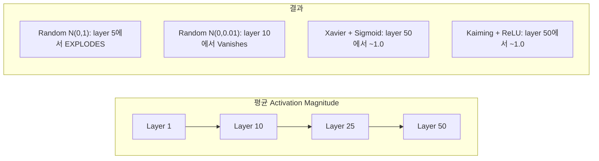
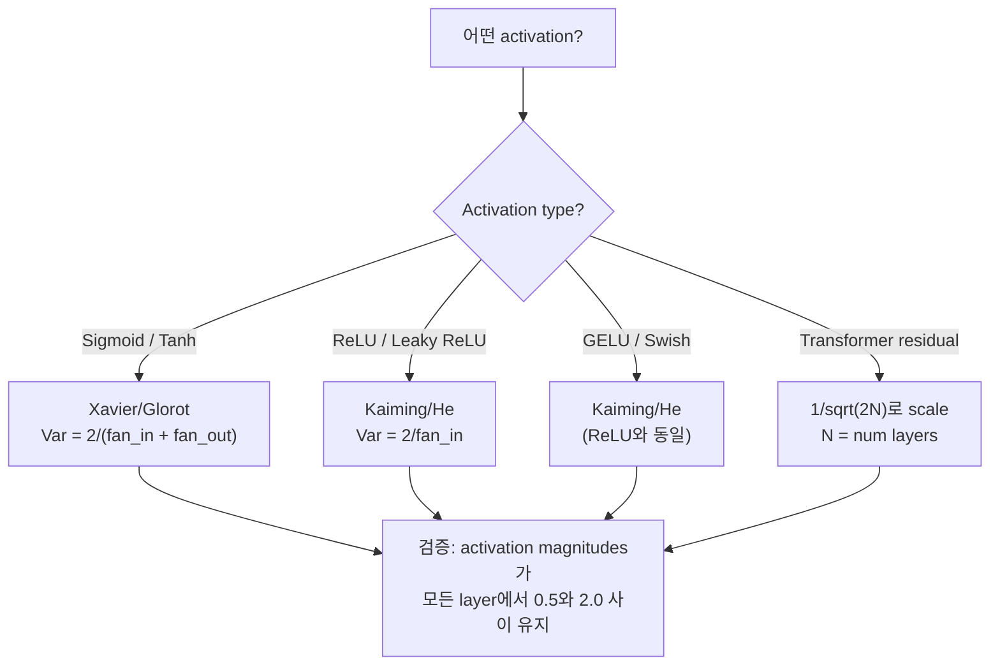

# 가중치 초기화와 훈련 안정성

> 잘못 초기화하면 훈련은 시작도 못 합니다. 올바르게 초기화하면 50개 layer도 3개 layer처럼 매끄럽게 훈련됩니다.

**Type:** Build
**Languages:** Python
**Prerequisites:** Lesson 03.04 (활성화 함수), Lesson 03.07 (정규화)
**Time:** ~90 minutes

## 학습 목표

- zero, random, Xavier/Glorot, Kaiming/He 초기화 전략을 구현하고, 50개 layer를 지나는 동안 activation magnitude에 미치는 영향을 측정합니다
- Xavier init이 Var(w) = 2/(fan_in + fan_out)을 사용하고 Kaiming이 Var(w) = 2/fan_in을 사용하는 이유를 유도합니다
- zero initialization의 symmetry problem을 시연하고, random scale만으로는 왜 충분하지 않은지 설명합니다
- activation function에 맞는 올바른 초기화 전략을 연결합니다: sigmoid/tanh에는 Xavier, ReLU/GELU에는 Kaiming

## 문제

모든 가중치를 0으로 초기화해 보세요. 아무것도 학습되지 않습니다. 모든 뉴런이 같은 함수를 계산하고, 같은 gradient를 받으며, 동일하게 업데이트됩니다. 10,000 epochs가 지난 뒤에도 512-neuron hidden layer는 여전히 같은 뉴런의 복사본 512개입니다. 512개의 파라미터 비용을 냈지만 실제로 얻은 것은 1개입니다.

너무 크게 초기화해 보세요. Activation이 네트워크를 지나며 폭발합니다. Layer 10에서는 값이 1e15에 도달합니다. Layer 20에서는 infinity로 overflow됩니다. Gradient도 역방향으로 같은 궤적을 따릅니다.

표준 정규분포에서 무작위로 초기화해 보세요. 3개 layer에서는 작동합니다. 50개 layer에서는 random scale이 조금만 작으면 signal이 0으로 붕괴하고, 조금만 크면 infinity로 폭발합니다. "작동함"과 "망가짐"의 경계는 면도날처럼 얇습니다.

Weight initialization은 딥러닝에서 가장 과소평가되는 결정입니다. Architecture는 논문을 얻고, optimizer는 블로그 글을 얻습니다. Initialization은 각주로 밀립니다. 하지만 이것을 잘못하면 다른 모든 것은 의미가 없습니다. 네트워크는 훈련이 시작되기도 전에 죽어 있습니다.

## 개념

### Symmetry Problem

한 layer의 모든 뉴런은 같은 구조를 가집니다. 입력에 가중치를 곱하고, bias를 더하고, activation을 적용합니다. 모든 가중치가 같은 값에서 시작하면(0은 극단적인 경우), 모든 뉴런은 같은 출력을 계산합니다. Backpropagation 중 모든 뉴런은 같은 gradient를 받습니다. Update step에서 모든 뉴런은 같은 양만큼 변합니다.

움직일 수 없습니다. 네트워크에는 수백 개의 파라미터가 있지만, 모두 lockstep으로 움직입니다. 이것을 symmetry라고 하며, random initialization은 이를 깨는 brute-force 방식입니다. 각 뉴런이 weight space의 서로 다른 지점에서 시작하므로 각자 다른 feature를 배웁니다.

하지만 "random"만으로는 충분하지 않습니다. 무작위성의 *scale*이 네트워크가 훈련되는지를 결정합니다.

### Layer를 지나는 분산 전파

fan_in개의 입력을 가진 단일 layer를 생각해 봅시다.

```text
z = w1*x1 + w2*x2 + ... + w_n*x_n
```

각 weight wi가 분산 Var(w)를 가진 분포에서 뽑히고 각 input xi가 분산 Var(x)를 가진다면, 출력 분산은 다음과 같습니다.

```text
Var(z) = fan_in * Var(w) * Var(x)
```

Var(w) = 1이고 fan_in = 512이면 출력 분산은 입력 분산의 512배입니다. 10개 layer 뒤에는 512^10 = 1.2e27입니다. Signal이 폭발한 것입니다.

Var(w) = 0.001이면 출력 분산은 layer마다 0.001 * 512 = 0.512배로 줄어듭니다. 10개 layer 뒤에는 0.512^10 = 0.00013입니다. Signal이 사라진 것입니다.

목표는 Var(z) = Var(x)가 되도록 Var(w)를 선택하는 것입니다. Signal magnitude가 layer 전체에서 일정하게 유지됩니다.

### Xavier/Glorot Initialization

Glorot and Bengio (2010)는 sigmoid와 tanh activation을 위한 해법을 유도했습니다. Forward pass와 backward pass 모두에서 분산을 일정하게 유지하려면:

```text
Var(w) = 2 / (fan_in + fan_out)
```

실제로 weights는 다음에서 뽑습니다.

```text
w ~ Uniform(-limit, limit)  where limit = sqrt(6 / (fan_in + fan_out))
```

또는:

```text
w ~ Normal(0, sqrt(2 / (fan_in + fan_out)))
```

이것이 작동하는 이유는 sigmoid와 tanh가 올바르게 초기화된 activation이 머무는 0 근처에서 대략 선형이기 때문입니다. 분산은 수십 개 layer를 지나도 안정적으로 유지됩니다.

### Kaiming/He Initialization

ReLU는 출력의 절반을 죽입니다(음수는 모두 0이 됩니다). 평균적으로 입력의 절반이 0이 되므로 유효 fan_in이 절반이 됩니다. Xavier init은 이를 고려하지 않습니다. 필요한 분산을 과소평가합니다.

He et al. (2015)은 공식을 조정했습니다.

```text
Var(w) = 2 / fan_in
```

Weights는 다음에서 뽑습니다.

```text
w ~ Normal(0, sqrt(2 / fan_in))
```

2라는 factor는 ReLU가 activation의 절반을 0으로 만드는 것을 보상합니다. 이것이 없으면 signal은 layer마다 약 0.5배로 줄어듭니다. 50개 layer에서는 0.5^50 = 8.8e-16입니다. Kaiming init은 이를 막습니다.

### Transformer Initialization

GPT-2는 다른 패턴을 도입했습니다. Residual connection은 각 sub-layer의 출력을 입력에 더합니다.

```text
x = x + sublayer(x)
```

각 addition은 분산을 증가시킵니다. N개의 residual layer가 있으면 분산은 N에 비례해 커집니다. GPT-2는 residual layer의 weights를 1/sqrt(2N)로 스케일합니다. 여기서 N은 layer 수입니다. 이렇게 하면 누적 signal magnitude가 안정적으로 유지됩니다.

Llama 3(405B parameters, 126 layers)도 비슷한 방식을 사용합니다. 이 scaling이 없다면 residual stream은 126개 attention 및 feedforward block을 지나며 제한 없이 커질 것입니다.

```mermaid
flowchart TD
    subgraph "Zero Init"
        Z1["Layer 1<br/>모든 weights = 0"] --> Z2["Layer 2<br/>모든 뉴런이 동일"]
        Z2 --> Z3["Layer 3<br/>여전히 동일"]
        Z3 --> ZR["결과: width와 무관하게<br/>유효 뉴런 1개"]
    end

    subgraph "Xavier Init"
        X1["Layer 1<br/>Var = 2/(fan_in+fan_out)"] --> X2["Layer 2<br/>Signal 안정"]
        X2 --> X3["Layer 50<br/>Signal 안정"]
        X3 --> XR["결과: sigmoid/tanh로<br/>훈련 가능"]
    end

    subgraph "Kaiming Init"
        K1["Layer 1<br/>Var = 2/fan_in"] --> K2["Layer 2<br/>Signal 안정"]
        K2 --> K3["Layer 50<br/>Signal 안정"]
        K3 --> KR["결과: ReLU/GELU로<br/>훈련 가능"]
    end
```



### 50개 Layer를 지나는 Activation Magnitude



### 올바른 Init 선택하기



```figure
weight-init-variance
```

## 직접 만들기

### Step 1: 초기화 전략

Weight matrix를 초기화하는 네 가지 방법입니다. 각 함수는 fan_in개의 column과 fan_out개의 row를 가진 list of lists(2D matrix)를 반환합니다.

```python
import math
import random


def zero_init(fan_in, fan_out):
    return [[0.0 for _ in range(fan_in)] for _ in range(fan_out)]


def random_init(fan_in, fan_out, scale=1.0):
    return [[random.gauss(0, scale) for _ in range(fan_in)] for _ in range(fan_out)]


def xavier_init(fan_in, fan_out):
    std = math.sqrt(2.0 / (fan_in + fan_out))
    return [[random.gauss(0, std) for _ in range(fan_in)] for _ in range(fan_out)]


def kaiming_init(fan_in, fan_out):
    std = math.sqrt(2.0 / fan_in)
    return [[random.gauss(0, std) for _ in range(fan_in)] for _ in range(fan_out)]
```

### Step 2: Activation Functions

각 init strategy를 의도된 activation과 함께 테스트하려면 sigmoid, tanh, ReLU가 필요합니다.

```python
def sigmoid(x):
    x = max(-500, min(500, x))
    return 1.0 / (1.0 + math.exp(-x))


def tanh_act(x):
    return math.tanh(x)


def relu(x):
    return max(0.0, x)
```

### Step 3: 50개 Layer를 지나는 Forward Pass

무작위 데이터를 deep network에 통과시키고 각 layer의 평균 activation magnitude를 측정합니다.

```python
def forward_deep(init_fn, activation_fn, n_layers=50, width=64, n_samples=100):
    random.seed(42)
    layer_magnitudes = []

    inputs = [[random.gauss(0, 1) for _ in range(width)] for _ in range(n_samples)]

    for layer_idx in range(n_layers):
        weights = init_fn(width, width)
        biases = [0.0] * width

        new_inputs = []
        for sample in inputs:
            output = []
            for neuron_idx in range(width):
                z = sum(weights[neuron_idx][j] * sample[j] for j in range(width)) + biases[neuron_idx]
                output.append(activation_fn(z))
            new_inputs.append(output)
        inputs = new_inputs

        magnitudes = []
        for sample in inputs:
            magnitudes.append(sum(abs(v) for v in sample) / width)
        mean_mag = sum(magnitudes) / len(magnitudes)
        layer_magnitudes.append(mean_mag)

    return layer_magnitudes
```

### Step 4: 실험

모든 조합을 실행합니다: zero init, random N(0,1), random N(0,0.01), Xavier with sigmoid, Xavier with tanh, Kaiming with ReLU. 주요 layer에서 magnitude를 출력합니다.

```python
def run_experiment():
    configs = [
        ("Zero init + Sigmoid", lambda fi, fo: zero_init(fi, fo), sigmoid),
        ("Random N(0,1) + ReLU", lambda fi, fo: random_init(fi, fo, 1.0), relu),
        ("Random N(0,0.01) + ReLU", lambda fi, fo: random_init(fi, fo, 0.01), relu),
        ("Xavier + Sigmoid", xavier_init, sigmoid),
        ("Xavier + Tanh", xavier_init, tanh_act),
        ("Kaiming + ReLU", kaiming_init, relu),
    ]

    print(f"{'Strategy':<30} {'L1':>10} {'L5':>10} {'L10':>10} {'L25':>10} {'L50':>10}")
    print("-" * 80)

    for name, init_fn, act_fn in configs:
        mags = forward_deep(init_fn, act_fn)
        row = f"{name:<30}"
        for idx in [0, 4, 9, 24, 49]:
            val = mags[idx]
            if val > 1e6:
                row += f" {'EXPLODED':>10}"
            elif val < 1e-6:
                row += f" {'VANISHED':>10}"
            else:
                row += f" {val:>10.4f}"
        print(row)
```

### Step 5: Symmetry Demonstration

Zero init이 동일한 뉴런을 만든다는 것을 보여줍니다.

```python
def symmetry_demo():
    random.seed(42)
    weights = zero_init(2, 4)
    biases = [0.0] * 4

    inputs = [0.5, -0.3]
    outputs = []
    for neuron_idx in range(4):
        z = sum(weights[neuron_idx][j] * inputs[j] for j in range(2)) + biases[neuron_idx]
        outputs.append(sigmoid(z))

    print("\nSymmetry Demo (4 neurons, zero init):")
    for i, out in enumerate(outputs):
        print(f"  Neuron {i}: output = {out:.6f}")
    all_same = all(abs(outputs[i] - outputs[0]) < 1e-10 for i in range(len(outputs)))
    print(f"  All identical: {all_same}")
    print(f"  Effective parameters: 1 (not {len(weights) * len(weights[0])})")
```

### Step 6: Layer-by-Layer Magnitude Report

50개 layer를 지나는 activation magnitude의 시각적 bar chart를 출력합니다.

```python
def magnitude_report(name, magnitudes):
    print(f"\n{name}:")
    for i, mag in enumerate(magnitudes):
        if i % 5 == 0 or i == len(magnitudes) - 1:
            if mag > 1e6:
                bar = "X" * 50 + " EXPLODED"
            elif mag < 1e-6:
                bar = "." + " VANISHED"
            else:
                bar_len = min(50, max(1, int(mag * 10)))
                bar = "#" * bar_len
            print(f"  Layer {i+1:3d}: {bar} ({mag:.6f})")
```

## 사용하기

PyTorch는 이것들을 built-in function으로 제공합니다.

```python
import torch
import torch.nn as nn

layer = nn.Linear(512, 256)

nn.init.xavier_uniform_(layer.weight)
nn.init.xavier_normal_(layer.weight)

nn.init.kaiming_uniform_(layer.weight, nonlinearity='relu')
nn.init.kaiming_normal_(layer.weight, nonlinearity='relu')

nn.init.zeros_(layer.bias)
```

`nn.Linear(512, 256)`을 호출하면 PyTorch는 기본적으로 Kaiming uniform initialization을 사용합니다. 그래서 대부분의 단순한 네트워크가 "그냥 작동"합니다. PyTorch가 이미 올바른 선택을 한 것입니다. 하지만 custom architecture를 만들거나 20개 layer보다 깊게 갈 때는 무슨 일이 일어나는지 이해하고 필요하면 기본값을 override해야 합니다.

Transformer의 경우 HuggingFace 모델은 보통 `_init_weights` method에서 initialization을 처리합니다. GPT-2 구현은 residual projection을 1/sqrt(N)로 scale합니다. Transformer를 처음부터 만든다면 이것을 직접 추가해야 합니다.

## 결과물

이 수업은 다음을 만듭니다.
- `outputs/prompt-init-strategy.md` -- weight initialization 문제를 진단하고 올바른 전략을 추천하는 prompt

## 연습 문제

1. LeCun initialization(Var = 1/fan_in, SELU activation용으로 설계됨)을 추가하세요. LeCun init + tanh로 50-layer experiment를 실행하고 Xavier + tanh와 비교하세요.

2. GPT-2 residual scaling을 구현하세요. 각 layer의 출력을 residual stream에 더하기 전에 1/sqrt(2*N)으로 곱합니다. Scaling이 있는 경우와 없는 경우로 50개 layer를 실행하고 residual magnitude가 얼마나 빠르게 커지는지 측정하세요.

3. 네트워크의 layer dimensions와 activation type을 입력받아 올바른 initialization을 추천하고, 현재 init이 문제를 일으킬 경우 경고하는 "init health check" 함수를 만드세요.

4. fan_in = 16과 fan_in = 1024로 실험을 실행하세요. Xavier와 Kaiming은 fan_in에 적응하지만 random init은 그렇지 않습니다. Layer가 커질수록 "작동함"과 "망가짐" 사이의 격차가 어떻게 넓어지는지 보이세요.

5. Orthogonal initialization을 구현하세요(random matrix를 만들고 SVD를 계산한 뒤 orthogonal matrix U를 사용). 50개 layer의 ReLU network에서 Kaiming과 비교하세요.

## 핵심 용어

| 용어 | 사람들이 흔히 말하는 것 | 실제 의미 |
|------|----------------|----------------------|
| Weight initialization | "시작 weights를 무작위로 설정" | 네트워크가 훈련될 수 있는지를 결정하는 초기 weight 값 선택 전략 |
| Symmetry breaking | "뉴런을 다르게 만들기" | 뉴런이 동일한 함수를 계산하지 않고 서로 다른 feature를 배우도록 random initialization을 사용하는 것 |
| Fan-in | "뉴런으로 들어오는 입력 수" | 들어오는 connection의 수이며, weighted sum에서 input variance가 어떻게 누적되는지 결정함 |
| Fan-out | "뉴런에서 나가는 출력 수" | 나가는 connection의 수이며, backpropagation 중 gradient variance를 유지하는 데 관련됨 |
| Xavier/Glorot init | "sigmoid initialization" | Var(w) = 2/(fan_in + fan_out), sigmoid와 tanh activation을 지나며 variance를 보존하도록 설계됨 |
| Kaiming/He init | "ReLU initialization" | Var(w) = 2/fan_in, ReLU가 activation의 절반을 0으로 만드는 것을 고려함 |
| Variance propagation | "Signal이 layer를 지나며 커지거나 작아지는 방식" | Weight scale에 따라 activation variance가 layer별로 어떻게 변하는지에 대한 수학적 분석 |
| Residual scaling | "GPT-2의 init trick" | N개 transformer layer를 지나며 variance가 커지는 것을 막기 위해 residual connection weights를 1/sqrt(2N)으로 scaling하는 것 |
| Dead network | "아무것도 훈련되지 않음" | 나쁜 initialization 때문에 모든 gradient가 0이 되거나 모든 activation이 saturated되는 네트워크 |
| Exploding activations | "값이 infinity로 감" | Weight variance가 너무 커 activation magnitude가 layer를 지나며 지수적으로 커지는 현상 |

## 더 읽을거리

- Glorot & Bengio, "Understanding the difficulty of training deep feedforward neural networks" (2010) -- variance analysis를 담은 원래 Xavier initialization 논문
- He et al., "Delving Deep into Rectifiers" (2015) -- ReLU network를 위한 Kaiming initialization을 소개한 논문
- Radford et al., "Language Models are Unsupervised Multitask Learners" (2019) -- residual scaling initialization을 담은 GPT-2 논문
- Mishkin & Matas, "All You Need is a Good Init" (2016) -- analytical formula의 경험적 대안인 layer-sequential unit-variance initialization
