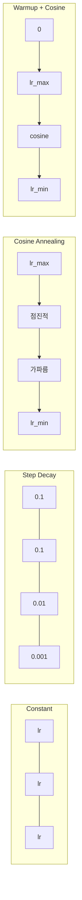
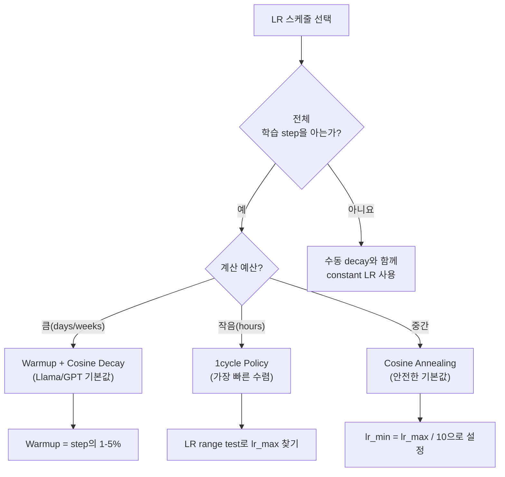
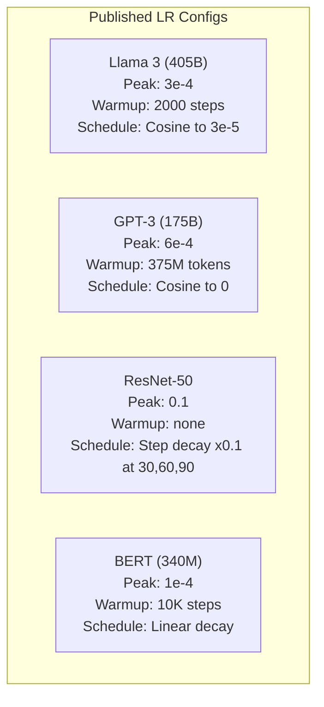

# 학습률 스케줄과 워밍업

> 학습률은 단 하나의 가장 중요한 하이퍼파라미터입니다. 아키텍처도 아닙니다. 데이터셋 크기도 아닙니다. 활성화 함수도 아닙니다. 학습률입니다. 다른 것을 아무것도 튜닝하지 않는다면, 이것만은 튜닝하세요.

**Type:** Build
**Languages:** Python
**Prerequisites:** Lesson 03.06 (Optimizers), Lesson 03.08 (Weight Initialization)
**Time:** ~90 minutes

## 학습 목표

- constant, step decay, cosine annealing, warmup + cosine, 1cycle 학습률 스케줄을 처음부터 구현합니다
- 학습률 선택의 세 가지 실패 모드인 발산(너무 높음), 정체(너무 낮음), 진동(decay 없음)을 시연합니다
- Adam 기반 옵티마이저에 warmup이 필요한 이유와 초기 학습을 안정화하는 방식을 설명합니다
- 같은 과제에서 다섯 가지 스케줄의 수렴 속도를 비교하고, 주어진 학습 예산에 적절한 스케줄을 선택합니다

## 문제

학습률을 0.1로 설정합니다. 학습이 발산합니다. 손실이 3 step 만에 infinity로 튑니다. 0.0001로 설정합니다. 학습이 기어갑니다. 100 epoch 뒤에도 모델은 무작위 초기값에서 거의 움직이지 않았습니다. 0.01로 설정합니다. 50 epoch 동안은 학습이 되지만, 이후 step이 너무 커서 도달할 수 없는 최솟값 주변에서 손실이 진동합니다.

최적의 학습률은 상수가 아닙니다. 학습 중에 변합니다. 초반에는 큰 step으로 빠르게 영역을 이동하고 싶습니다. 후반에는 작은 step으로 날카로운 최솟값에 안착하고 싶습니다. 정확도 90% 모델과 95% 모델의 차이는 종종 스케줄 하나입니다.

지난 3년 동안 발표된 거의 모든 주요 모델은 학습률 스케줄을 사용했습니다. Llama 3는 peak lr=3e-4, 2000 warmup steps, 3e-5까지의 cosine decay를 사용했습니다. GPT-3는 lr=6e-4와 375 million tokens 동안의 warmup을 사용했습니다. 이것들은 임의의 선택이 아닙니다. 수백만 달러가 드는 광범위한 하이퍼파라미터 sweep의 결과입니다.

스케줄을 이해해야 하는 이유는 기본값이 여러분의 문제에서 작동하지 않을 수 있기 때문입니다. 사전 학습된 모델을 fine-tune할 때의 올바른 스케줄은 처음부터 학습할 때와 다릅니다. batch size를 늘리면 warmup 기간도 바뀌어야 합니다. step 10,000에서 학습이 깨질 때, 그것이 스케줄 문제인지 다른 문제인지 알아야 합니다.

## 개념

### Constant Learning Rate

가장 단순한 접근입니다. 숫자 하나를 고르고 모든 step에서 사용합니다.

```text
lr(t) = lr_0
```

거의 최적이 아닙니다. 학습 후반에는 너무 높거나(최솟값 주변 진동), 초반에는 너무 낮습니다(작은 step으로 계산 낭비). 작은 모델과 디버깅에는 괜찮습니다. 1시간 넘게 학습하는 거의 모든 것에는 끔찍한 선택입니다.

### Step Decay

ResNet 시대의 오래된 접근입니다. 고정 epoch마다 학습률을 일정 비율(보통 10x)로 줄입니다.

```text
lr(t) = lr_0 * gamma^(floor(epoch / step_size))
```

gamma = 0.1, step_size = 30이라는 뜻은 lr이 30 epoch마다 10x씩 줄어든다는 뜻입니다. ResNet-50은 이것을 사용했습니다. lr=0.1에서 시작해 epoch 30, 60, 90에서 10x씩 낮췄습니다.

문제는 최적의 decay 지점이 데이터셋과 아키텍처에 의존한다는 것입니다. 다른 문제로 옮기면 언제 낮출지 다시 튜닝해야 합니다. 전환도 갑작스럽습니다. 학습률이 갑자기 바뀔 때 손실이 튈 수 있습니다.

### Cosine Annealing

cosine 곡선을 따라 최대 학습률에서 최소 학습률까지 부드럽게 감소합니다.

```text
lr(t) = lr_min + 0.5 * (lr_max - lr_min) * (1 + cos(pi * t / T))
```

여기서 t는 현재 step이고 T는 전체 step 수입니다.

t=0이면 cosine 항이 1이므로 lr = lr_max입니다. t=T이면 cosine 항이 -1이므로 lr = lr_min입니다. decay는 처음에는 완만하고, 중간에서 빨라지고, 끝에 가까워지면 다시 완만해집니다.

이것은 대부분의 현대 학습 run에서 기본값입니다. lr_max와 lr_min 외에 튜닝할 하이퍼파라미터가 없습니다. cosine 형태는 대부분의 학습이 중간 구간에서 일어난다는 경험적 관찰과 잘 맞습니다. 그 중요한 기간에는 적절한 step size가 필요합니다.

### Warmup: 작게 시작하는 이유

Adam과 다른 adaptive optimizer는 gradient mean과 variance의 running estimate를 유지합니다. step 0에서 이 estimate들은 0으로 초기화됩니다. 처음 몇 번의 gradient update는 쓰레기 통계에 기반합니다. 이 기간에 학습률이 크면 모델은 방향이 나쁜 거대한 step을 밟습니다.

Warmup은 이것을 고칩니다. 아주 작은 학습률(종종 lr_max / warmup_steps 또는 0)로 시작해 처음 N step 동안 lr_max까지 선형으로 올립니다. 전체 학습률에 도달할 때쯤 Adam의 통계는 안정화되어 있습니다.

```text
lr(t) = lr_max * (t / warmup_steps)     for t < warmup_steps
```

일반적인 warmup은 전체 학습 step의 1-5%입니다. Llama 3는 약 1.8 trillion tokens로 학습했고 2000 step 동안 warmup했습니다. GPT-3는 375 million tokens 동안 warmup했습니다.

### Linear Warmup + Cosine Decay

현대적인 기본값입니다. 선형으로 올린 다음 cosine으로 감소시킵니다.

```text
if t < warmup_steps:
    lr(t) = lr_max * (t / warmup_steps)
else:
    progress = (t - warmup_steps) / (total_steps - warmup_steps)
    lr(t) = lr_min + 0.5 * (lr_max - lr_min) * (1 + cos(pi * progress))
```

Llama, GPT, PaLM, 그리고 대부분의 현대 transformer가 이것을 사용합니다. warmup은 초기 불안정을 막습니다. cosine decay는 모델이 좋은 최솟값에 안착하도록 합니다.

### 1cycle Policy

Leslie Smith의 발견(2018): 학습 초반 절반에는 학습률을 낮은 값에서 높은 값으로 올리고, 후반 절반에는 다시 낮춥니다. 직관에 어긋납니다. 왜 학습 중간에 학습률을 *올릴까요*?

이론은 이렇습니다. 높은 학습률은 최적화 궤적에 노이즈를 더해 regularization처럼 작동합니다. ramp-up 단계에서 모델은 loss landscape를 더 넓게 탐색하고 더 좋은 basin을 찾습니다. ramp-down 단계는 찾은 가장 좋은 basin 안에서 정교하게 조정합니다.

```text
Phase 1 (0 to T/2):    lr ramps from lr_max/25 to lr_max
Phase 2 (T/2 to T):    lr ramps from lr_max to lr_max/10000
```

1cycle은 고정된 계산 예산에서 cosine annealing보다 더 빠르게 학습하는 경우가 많습니다. tradeoff는 전체 step 수를 미리 알아야 한다는 것입니다.

### 스케줄 형태



### 결정 흐름도



### 발표된 모델의 실제 숫자



```figure
lr-schedule
```

## 직접 만들기

### 1단계: 스케줄 함수

각 함수는 현재 step을 받아 그 step의 학습률을 반환합니다.

```python
import math


def constant_schedule(step, lr=0.01, **kwargs):
    return lr


def step_decay_schedule(step, lr=0.1, step_size=100, gamma=0.1, **kwargs):
    return lr * (gamma ** (step // step_size))


def cosine_schedule(step, lr=0.01, total_steps=1000, lr_min=1e-5, **kwargs):
    if step >= total_steps:
        return lr_min
    return lr_min + 0.5 * (lr - lr_min) * (1 + math.cos(math.pi * step / total_steps))


def warmup_cosine_schedule(step, lr=0.01, total_steps=1000, warmup_steps=100, lr_min=1e-5, **kwargs):
    if total_steps <= warmup_steps:
        return lr * (step / max(warmup_steps, 1))
    if step < warmup_steps:
        return lr * step / warmup_steps
    progress = (step - warmup_steps) / (total_steps - warmup_steps)
    return lr_min + 0.5 * (lr - lr_min) * (1 + math.cos(math.pi * progress))


def one_cycle_schedule(step, lr=0.01, total_steps=1000, **kwargs):
    mid = max(total_steps // 2, 1)
    if step < mid:
        return (lr / 25) + (lr - lr / 25) * step / mid
    else:
        progress = (step - mid) / max(total_steps - mid, 1)
        return lr * (1 - progress) + (lr / 10000) * progress
```

### 2단계: 모든 스케줄 시각화

각 스케줄이 학습 중 어떻게 변하는지 보여주는 텍스트 기반 plot을 출력합니다.

```python
def visualize_schedule(name, schedule_fn, total_steps=500, **kwargs):
    steps = list(range(0, total_steps, total_steps // 20))
    if total_steps - 1 not in steps:
        steps.append(total_steps - 1)

    lrs = [schedule_fn(s, total_steps=total_steps, **kwargs) for s in steps]
    max_lr = max(lrs) if max(lrs) > 0 else 1.0

    print(f"\n{name}:")
    for s, lr_val in zip(steps, lrs):
        bar_len = int(lr_val / max_lr * 40)
        bar = "#" * bar_len
        print(f"  Step {s:4d}: lr={lr_val:.6f} {bar}")
```

### 3단계: 네트워크 학습

이전 lesson과 같은 circle dataset의 간단한 2층 네트워크입니다. 이번에는 스케줄을 바꿔 봅니다.

```python
import random


def sigmoid(x):
    x = max(-500, min(500, x))
    return 1.0 / (1.0 + math.exp(-x))


def relu(x):
    return max(0.0, x)


def relu_deriv(x):
    return 1.0 if x > 0 else 0.0


def make_circle_data(n=200, seed=42):
    random.seed(seed)
    data = []
    for _ in range(n):
        x = random.uniform(-2, 2)
        y = random.uniform(-2, 2)
        label = 1.0 if x * x + y * y < 1.5 else 0.0
        data.append(([x, y], label))
    return data


def train_with_schedule(schedule_fn, schedule_name, data, epochs=300, base_lr=0.05, **kwargs):
    random.seed(0)
    hidden_size = 8
    total_steps = epochs * len(data)

    std = math.sqrt(2.0 / 2)
    w1 = [[random.gauss(0, std) for _ in range(2)] for _ in range(hidden_size)]
    b1 = [0.0] * hidden_size
    w2 = [random.gauss(0, std) for _ in range(hidden_size)]
    b2 = 0.0

    step = 0
    epoch_losses = []

    for epoch in range(epochs):
        total_loss = 0
        correct = 0

        for x, target in data:
            lr = schedule_fn(step, lr=base_lr, total_steps=total_steps, **kwargs)

            z1 = []
            h = []
            for i in range(hidden_size):
                z = w1[i][0] * x[0] + w1[i][1] * x[1] + b1[i]
                z1.append(z)
                h.append(relu(z))

            z2 = sum(w2[i] * h[i] for i in range(hidden_size)) + b2
            out = sigmoid(z2)

            error = out - target
            d_out = error * out * (1 - out)

            for i in range(hidden_size):
                d_h = d_out * w2[i] * relu_deriv(z1[i])
                w2[i] -= lr * d_out * h[i]
                for j in range(2):
                    w1[i][j] -= lr * d_h * x[j]
                b1[i] -= lr * d_h
            b2 -= lr * d_out

            total_loss += (out - target) ** 2
            if (out >= 0.5) == (target >= 0.5):
                correct += 1
            step += 1

        avg_loss = total_loss / len(data)
        accuracy = correct / len(data) * 100
        epoch_losses.append(avg_loss)

    return epoch_losses
```

### 4단계: 모든 스케줄 비교

같은 네트워크를 각 스케줄로 학습하고 최종 손실과 수렴 동작을 비교합니다.

```python
def compare_schedules(data):
    configs = [
        ("Constant", constant_schedule, {}),
        ("Step Decay", step_decay_schedule, {"step_size": 15000, "gamma": 0.1}),
        ("Cosine", cosine_schedule, {"lr_min": 1e-5}),
        ("Warmup+Cosine", warmup_cosine_schedule, {"warmup_steps": 3000, "lr_min": 1e-5}),
        ("1cycle", one_cycle_schedule, {}),
    ]

    print(f"\n{'Schedule':<20} {'Start Loss':>12} {'Mid Loss':>12} {'End Loss':>12} {'Best Loss':>12}")
    print("-" * 70)

    for name, schedule_fn, extra_kwargs in configs:
        losses = train_with_schedule(schedule_fn, name, data, epochs=300, base_lr=0.05, **extra_kwargs)
        mid_idx = len(losses) // 2
        best = min(losses)
        print(f"{name:<20} {losses[0]:>12.6f} {losses[mid_idx]:>12.6f} {losses[-1]:>12.6f} {best:>12.6f}")
```

### 5단계: 너무 높은 LR vs 너무 낮은 LR

세 가지 실패 모드인 너무 높음(발산), 너무 낮음(느린 이동), 적절함을 시연합니다.

```python
def lr_sensitivity(data):
    learning_rates = [1.0, 0.1, 0.01, 0.001, 0.0001]

    print("\nLR Sensitivity (constant schedule, 100 epochs):")
    print(f"  {'LR':>10} {'Start Loss':>12} {'End Loss':>12} {'Status':>15}")
    print("  " + "-" * 52)

    for lr in learning_rates:
        losses = train_with_schedule(constant_schedule, f"lr={lr}", data, epochs=100, base_lr=lr)
        start = losses[0]
        end = losses[-1]

        if end > start or math.isnan(end) or end > 1.0:
            status = "DIVERGED"
        elif end > start * 0.9:
            status = "BARELY MOVED"
        elif end < 0.15:
            status = "CONVERGED"
        else:
            status = "LEARNING"

        end_str = f"{end:.6f}" if not math.isnan(end) else "NaN"
        print(f"  {lr:>10.4f} {start:>12.6f} {end_str:>12} {status:>15}")
```

## 사용하기

PyTorch는 `torch.optim.lr_scheduler`에서 scheduler를 제공합니다.

```python
import torch
import torch.optim as optim
from torch.optim.lr_scheduler import CosineAnnealingLR, OneCycleLR, StepLR

model = nn.Sequential(nn.Linear(10, 64), nn.ReLU(), nn.Linear(64, 1))
optimizer = optim.Adam(model.parameters(), lr=3e-4)

scheduler = CosineAnnealingLR(optimizer, T_max=1000, eta_min=1e-5)

for step in range(1000):
    loss = train_step(model, optimizer)
    scheduler.step()
```

warmup + cosine에는 lambda scheduler를 쓰거나 HuggingFace의 `get_cosine_schedule_with_warmup`을 사용합니다.

```python
from transformers import get_cosine_schedule_with_warmup

scheduler = get_cosine_schedule_with_warmup(
    optimizer,
    num_warmup_steps=2000,
    num_training_steps=100000,
)
```

HuggingFace 함수는 대부분의 Llama 및 GPT fine-tuning script가 사용하는 것입니다. 확신이 없으면 warmup = 전체 step의 3-5%인 warmup + cosine을 사용하세요. 거의 모든 것에 작동합니다.

## 산출물

이 lesson은 다음을 만듭니다.
- `outputs/prompt-lr-schedule-advisor.md` -- 학습 설정에 맞는 올바른 학습률 스케줄과 하이퍼파라미터를 추천하는 prompt

## 연습 문제

1. exponential decay를 구현하세요: gamma = 0.999일 때 lr(t) = lr_0 * gamma^t입니다. circle dataset에서 cosine annealing과 비교하세요.

2. learning rate range test(Leslie Smith)를 구현하세요. LR을 1e-7에서 1까지 지수적으로 올리면서 몇백 step 동안 학습합니다. loss vs LR을 plot하세요. 최적의 max LR은 손실이 증가하기 시작하기 직전입니다.

3. warmup + cosine으로 학습하되 warmup 길이를 전체 step의 0%, 1%, 5%, 10%, 20%로 바꿔 보세요. 학습이 가장 안정적인 sweet spot을 찾으세요.

4. warm restarts가 있는 cosine annealing(SGDR)을 구현하세요. T step마다 학습률을 lr_max로 reset하고 다시 decay합니다. 더 긴 학습 run에서 표준 cosine과 비교하세요.

5. 학습 손실을 모니터링하고 손실이 안정화되면 warmup에서 cosine으로 자동 전환하며, 손실이 너무 오래 plateau에 머물면 lr을 줄이는 "schedule surgeon"을 만드세요.

## 핵심 용어

| 용어 | 사람들이 말하는 것 | 실제 의미 |
|------|----------------|----------------------|
| Learning rate | "모델이 얼마나 빨리 학습하는가" | parameter update 크기를 결정하기 위해 gradient에 곱하는 scalar |
| Schedule | "시간에 따라 LR을 바꾸기" | 수렴을 최적화하도록 설계된, 학습 step을 학습률에 매핑하는 함수 |
| Warmup | "작은 LR로 시작하기" | optimizer 통계를 안정화하기 위해 처음 N step 동안 LR을 거의 0에서 목표값까지 선형으로 올리는 것 |
| Cosine annealing | "부드러운 LR decay" | 학습 동안 cosine 곡선을 따라 lr_max에서 lr_min까지 LR을 낮추는 것 |
| Step decay | "milestone에서 LR 낮추기" | 고정 epoch 간격마다 LR에 factor(보통 0.1)를 곱하는 것 |
| 1cycle policy | "올렸다가 내리기" | 더 빠른 수렴을 위해 단일 cycle에서 LR을 올린 뒤 내리는 Leslie Smith의 방법 |
| LR range test | "최적 학습률 찾기" | loss가 발산하기 시작하는 값을 찾기 위해 LR을 증가시키며 짧게 학습하는 것 |
| Cosine with warm restarts | "reset하고 반복하기" | 주기적으로 LR을 lr_max로 reset하고 다시 decay하는 것(SGDR) |
| Eta min | "LR의 바닥값" | schedule이 decay하는 최소 학습률 |
| Peak learning rate | "최대 LR" | 일반적으로 warmup 이후 도달하는, 학습 중 가장 높은 LR |

## 더 읽을거리

- Loshchilov & Hutter, "SGDR: Stochastic Gradient Descent with Warm Restarts" (2017) -- cosine annealing과 warm restarts를 소개한 논문
- Smith, "Super-Convergence: Very Fast Training of Neural Networks Using Large Learning Rates" (2018) -- 1cycle policy 논문
- Touvron et al., "Llama 2: Open Foundation and Fine-Tuned Chat Models" (2023) -- scale에서 사용한 warmup + cosine schedule을 문서화합니다
- Goyal et al., "Accurate, Large Minibatch SGD: Training ImageNet in 1 Hour" (2017) -- large batch training을 위한 linear scaling rule과 warmup
