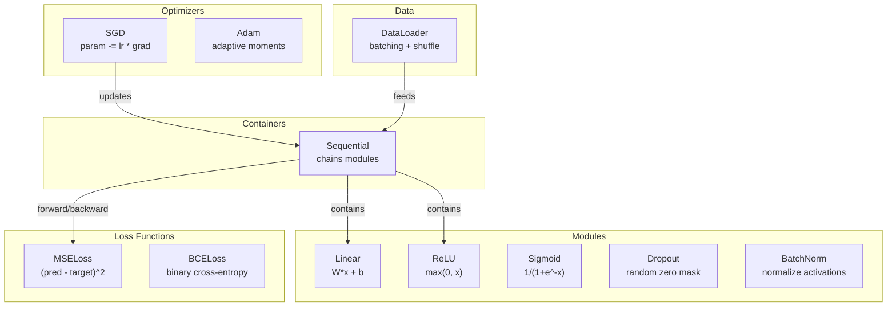
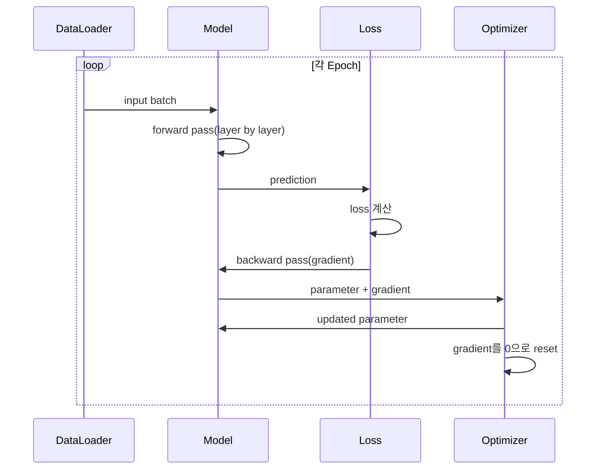
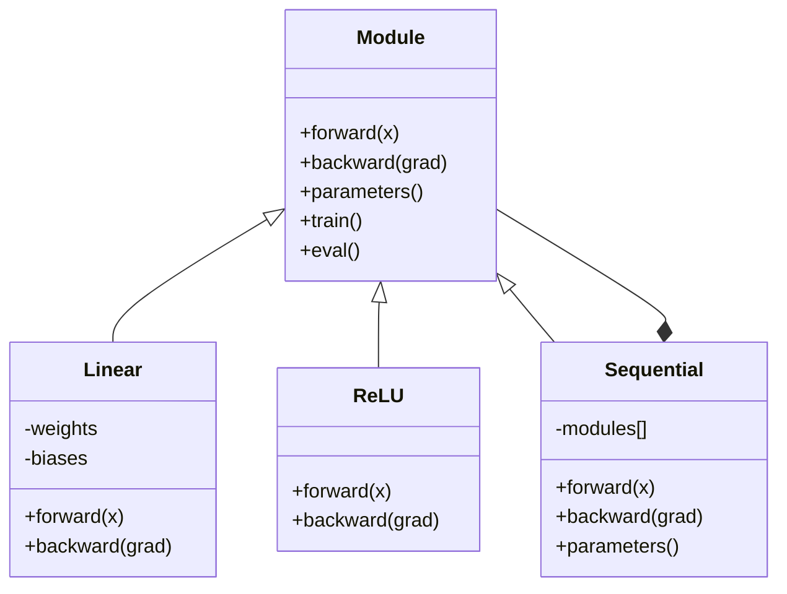

# 나만의 미니 프레임워크 만들기

> 여러분은 뉴런, 층, 네트워크, 역전파, 활성화 함수, 손실 함수, 옵티마이저, regularization, initialization, LR schedule을 만들었습니다. 모두 별개의 조각이었습니다. 이제 그것들을 하나의 framework로 연결합니다. PyTorch도 아니고 TensorFlow도 아닙니다. 여러분의 것입니다.

**Type:** Build
**Languages:** Python
**Prerequisites:** All of Phase 03 (Lessons 01-09)
**Time:** ~120 minutes

## 학습 목표

- Module, Linear, ReLU, Sigmoid, Dropout, BatchNorm, Sequential, loss function, optimizer, DataLoader를 포함하는 완전한 deep learning framework(~500 lines)를 만듭니다
- Module 추상화(forward, backward, parameters)와 train/eval mode 전환이 필요한 이유를 설명합니다
- 모든 component를 작동하는 training loop로 연결해 circle classification에서 4-layer network를 학습합니다
- framework의 각 component를 PyTorch 대응물(nn.Module, nn.Sequential, optim.Adam, DataLoader)에 매핑합니다

## 문제

여러분에게는 별도 파일에 흩어진 10개 lesson의 building block이 있습니다. 여기에는 `Value` class, 저기에는 training loop, 다른 파일에는 weight initialization, 또 다른 파일에는 learning rate schedule이 있습니다. 네트워크를 학습하려면 다섯 개 lesson에서 copy-paste하고 손으로 연결해야 합니다.

framework가 해결하는 것이 바로 이것입니다. PyTorch는 `nn.Module`, `nn.Sequential`, `optim.Adam`, `DataLoader`, 그리고 그것들을 하나로 묶는 training loop pattern을 제공합니다. TensorFlow는 `keras.Layer`, `keras.Sequential`, `keras.optimizers.Adam`을 제공합니다. 이것들은 마법이 아닙니다. 매번 배관을 다시 만들지 않고도 네트워크를 정의하고, 학습하고, 평가할 수 있게 해 주는 조직화 pattern입니다.

여러분은 같은 것을 Python 약 500 lines로 만들 것입니다. numpy도 없고 외부 의존성도 없습니다. 어떤 feedforward network든 정의하고, SGD나 Adam으로 학습하고, data를 batch로 나누고, dropout과 batch normalization을 적용하고, 어떤 activation이든 사용하고, learning rate를 schedule할 수 있는 framework입니다.

끝내고 나면 PyTorch에서 `model = nn.Sequential(...)`을 작성할 때 정확히 무슨 일이 일어나는지 이해하게 됩니다. 왜 `model.train()`과 `model.eval()`이 존재하는지도 이해합니다. 왜 `optimizer.zero_grad()`가 별도 호출인지도 이해합니다. 모든 것을 이해하게 됩니다. 여러분이 전부 만들었기 때문입니다.

## 개념

### Module 추상화

PyTorch의 모든 layer는 `nn.Module`을 상속합니다. Module에는 세 가지 책임이 있습니다.

1. **forward()** -- input이 주어졌을 때 output을 계산합니다
2. **parameters()** -- 모든 trainable weight를 반환합니다
3. **backward()** -- gradient를 계산합니다(PyTorch에서는 autograd가 처리하고, 여기서는 명시적으로 구현합니다)

Linear layer는 Module입니다. ReLU activation도 Module입니다. dropout layer도 Module입니다. batch normalization layer도 Module입니다. 모두 같은 interface를 갖습니다.

### Sequential Container

`nn.Sequential`은 Module을 chain으로 연결합니다. forward pass는 data를 Module 1, Module 2, Module 3 순서로 통과시킵니다. backward pass는 chain을 거꾸로 갑니다. container 자체도 Module입니다. forward(), parameters(), backward()를 갖습니다. 이것은 composite pattern입니다. Module의 sequence 자체도 Module입니다.

### Training vs Evaluation Mode

Dropout은 학습 중에는 neuron을 무작위로 0으로 만들지만 평가 중에는 모든 것을 그대로 통과시킵니다. Batch normalization은 학습 중에는 batch statistic을 사용하지만 평가 중에는 running average를 사용합니다. `train()`과 `eval()` method는 이 동작을 전환합니다. 모든 Module에는 `training` flag가 있습니다.

### Optimizer

optimizer는 gradient를 사용해 parameter를 update합니다. SGD는 `param -= lr * grad`입니다. Adam은 momentum과 variance estimate를 유지한 뒤 update합니다. optimizer는 network architecture를 알지 못합니다. parameter와 gradient의 flat list만 봅니다.

### DataLoader

batching은 두 가지 이유로 중요합니다. 첫째, 큰 문제에서는 전체 dataset을 memory에 올릴 수 없습니다. 둘째, mini-batch gradient descent는 local minima에서 벗어나는 데 도움이 되는 noise를 제공합니다. DataLoader는 data를 batch로 나누고 epoch 사이에 선택적으로 shuffle합니다.

### Framework Architecture



### Training Loop



### Module Hierarchy



```figure
gradient-clipping
```

## 직접 만들기

### 1단계: Module Base Class

모든 layer가 구현하는 추상 interface입니다.

```python
class Module:
    def __init__(self):
        self.training = True

    def forward(self, x):
        raise NotImplementedError

    def backward(self, grad):
        raise NotImplementedError

    def parameters(self):
        return []

    def train(self):
        self.training = True

    def eval(self):
        self.training = False
```

### 2단계: Linear Layer

기본 building block입니다. weight와 bias를 저장하고, forward에서 Wx + b를 계산하며, backward에서 weight/input gradient를 계산합니다.

```python
import math
import random


class Linear(Module):
    def __init__(self, fan_in, fan_out):
        super().__init__()
        std = math.sqrt(2.0 / fan_in)
        self.weights = [[random.gauss(0, std) for _ in range(fan_in)] for _ in range(fan_out)]
        self.biases = [0.0] * fan_out
        self.weight_grads = [[0.0] * fan_in for _ in range(fan_out)]
        self.bias_grads = [0.0] * fan_out
        self.fan_in = fan_in
        self.fan_out = fan_out
        self.input = None

    def forward(self, x):
        self.input = x
        output = []
        for i in range(self.fan_out):
            val = self.biases[i]
            for j in range(self.fan_in):
                val += self.weights[i][j] * x[j]
            output.append(val)
        return output

    def backward(self, grad):
        input_grad = [0.0] * self.fan_in
        for i in range(self.fan_out):
            self.bias_grads[i] += grad[i]
            for j in range(self.fan_in):
                self.weight_grads[i][j] += grad[i] * self.input[j]
                input_grad[j] += grad[i] * self.weights[i][j]
        return input_grad

    def parameters(self):
        params = []
        for i in range(self.fan_out):
            for j in range(self.fan_in):
                params.append((self.weights, i, j, self.weight_grads))
            params.append((self.biases, i, None, self.bias_grads))
        return params
```

### 3단계: Activation Module

ReLU, Sigmoid, Tanh를 Module로 만듭니다. 각각 backward pass에 필요한 값을 cache합니다.

```python
class ReLU(Module):
    def __init__(self):
        super().__init__()
        self.mask = None

    def forward(self, x):
        self.mask = [1.0 if v > 0 else 0.0 for v in x]
        return [max(0.0, v) for v in x]

    def backward(self, grad):
        return [g * m for g, m in zip(grad, self.mask)]


class Sigmoid(Module):
    def __init__(self):
        super().__init__()
        self.output = None

    def forward(self, x):
        self.output = []
        for v in x:
            v = max(-500, min(500, v))
            self.output.append(1.0 / (1.0 + math.exp(-v)))
        return self.output

    def backward(self, grad):
        return [g * o * (1 - o) for g, o in zip(grad, self.output)]


class Tanh(Module):
    def __init__(self):
        super().__init__()
        self.output = None

    def forward(self, x):
        self.output = [math.tanh(v) for v in x]
        return self.output

    def backward(self, grad):
        return [g * (1 - o * o) for g, o in zip(grad, self.output)]
```

### 4단계: Dropout Module

학습 중 element를 무작위로 0으로 만듭니다. 남은 element를 1/(1-p)로 scale해 expected value가 같게 유지되도록 합니다. eval 중에는 아무것도 하지 않습니다.

```python
class Dropout(Module):
    def __init__(self, p=0.5):
        super().__init__()
        self.p = p
        self.mask = None

    def forward(self, x):
        if not self.training:
            return x
        self.mask = [0.0 if random.random() < self.p else 1.0 / (1 - self.p) for _ in x]
        return [v * m for v, m in zip(x, self.mask)]

    def backward(self, grad):
        if self.mask is None:
            return grad
        return [g * m for g, m in zip(grad, self.mask)]
```

### 5단계: BatchNorm Module

batch 전체에서 feature별 activation을 평균 0, 분산 1로 normalize합니다. eval mode를 위해 running statistic을 유지합니다.

```python
class BatchNorm(Module):
    def __init__(self, size, momentum=0.1, eps=1e-5):
        super().__init__()
        self.size = size
        self.gamma = [1.0] * size
        self.beta = [0.0] * size
        self.gamma_grads = [0.0] * size
        self.beta_grads = [0.0] * size
        self.running_mean = [0.0] * size
        self.running_var = [1.0] * size
        self.momentum = momentum
        self.eps = eps
        self.x_norm = None
        self.std_inv = None
        self.batch_input = None

    def forward_batch(self, batch):
        batch_size = len(batch)
        output_batch = []

        if self.training:
            mean = [0.0] * self.size
            for sample in batch:
                for j in range(self.size):
                    mean[j] += sample[j]
            mean = [m / batch_size for m in mean]

            var = [0.0] * self.size
            for sample in batch:
                for j in range(self.size):
                    var[j] += (sample[j] - mean[j]) ** 2
            var = [v / batch_size for v in var]

            self.std_inv = [1.0 / math.sqrt(v + self.eps) for v in var]

            self.x_norm = []
            self.batch_input = batch
            for sample in batch:
                normed = [(sample[j] - mean[j]) * self.std_inv[j] for j in range(self.size)]
                self.x_norm.append(normed)
                output = [self.gamma[j] * normed[j] + self.beta[j] for j in range(self.size)]
                output_batch.append(output)

            for j in range(self.size):
                self.running_mean[j] = (1 - self.momentum) * self.running_mean[j] + self.momentum * mean[j]
                self.running_var[j] = (1 - self.momentum) * self.running_var[j] + self.momentum * var[j]
        else:
            std_inv = [1.0 / math.sqrt(v + self.eps) for v in self.running_var]
            for sample in batch:
                normed = [(sample[j] - self.running_mean[j]) * std_inv[j] for j in range(self.size)]
                output = [self.gamma[j] * normed[j] + self.beta[j] for j in range(self.size)]
                output_batch.append(output)

        return output_batch

    def forward(self, x):
        result = self.forward_batch([x])
        return result[0]

    def backward(self, grad):
        if self.x_norm is None:
            return grad
        for j in range(self.size):
            self.gamma_grads[j] += self.x_norm[0][j] * grad[j]
            self.beta_grads[j] += grad[j]
        return [grad[j] * self.gamma[j] * self.std_inv[j] for j in range(self.size)]

    def parameters(self):
        params = []
        for j in range(self.size):
            params.append((self.gamma, j, None, self.gamma_grads))
            params.append((self.beta, j, None, self.beta_grads))
        return params
```

### 6단계: Sequential Container

module을 chain으로 연결합니다. forward는 왼쪽에서 오른쪽으로, backward는 오른쪽에서 왼쪽으로 진행합니다.

```python
class Sequential(Module):
    def __init__(self, *modules):
        super().__init__()
        self.modules = list(modules)

    def forward(self, x):
        for module in self.modules:
            x = module.forward(x)
        return x

    def backward(self, grad):
        for module in reversed(self.modules):
            grad = module.backward(grad)
        return grad

    def parameters(self):
        params = []
        for module in self.modules:
            params.extend(module.parameters())
        return params

    def train(self):
        self.training = True
        for module in self.modules:
            module.train()

    def eval(self):
        self.training = False
        for module in self.modules:
            module.eval()
```

### 7단계: Loss Function

MSE와 Binary Cross-Entropy입니다. 각각 loss value를 반환하고 gradient를 반환하는 backward()를 제공합니다.

```python
class MSELoss:
    def __call__(self, predicted, target):
        self.predicted = predicted
        self.target = target
        n = len(predicted)
        self.loss = sum((p - t) ** 2 for p, t in zip(predicted, target)) / n
        return self.loss

    def backward(self):
        n = len(self.predicted)
        return [2 * (p - t) / n for p, t in zip(self.predicted, self.target)]


class BCELoss:
    def __call__(self, predicted, target):
        self.predicted = predicted
        self.target = target
        eps = 1e-7
        n = len(predicted)
        self.loss = 0
        for p, t in zip(predicted, target):
            p = max(eps, min(1 - eps, p))
            self.loss += -(t * math.log(p) + (1 - t) * math.log(1 - p))
        self.loss /= n
        return self.loss

    def backward(self):
        eps = 1e-7
        n = len(self.predicted)
        grads = []
        for p, t in zip(self.predicted, self.target):
            p = max(eps, min(1 - eps, p))
            grads.append((-t / p + (1 - t) / (1 - p)) / n)
        return grads
```

### 8단계: SGD와 Adam Optimizer

둘 다 parameter list를 받아 gradient로 weight를 update합니다.

```python
class SGD:
    def __init__(self, parameters, lr=0.01):
        self.params = parameters
        self.lr = lr

    def step(self):
        for container, i, j, grad_container in self.params:
            if j is not None:
                container[i][j] -= self.lr * grad_container[i][j]
            else:
                container[i] -= self.lr * grad_container[i]

    def zero_grad(self):
        for container, i, j, grad_container in self.params:
            if j is not None:
                grad_container[i][j] = 0.0
            else:
                grad_container[i] = 0.0


class Adam:
    def __init__(self, parameters, lr=0.001, beta1=0.9, beta2=0.999, eps=1e-8):
        self.params = parameters
        self.lr = lr
        self.beta1 = beta1
        self.beta2 = beta2
        self.eps = eps
        self.t = 0
        self.m = [0.0] * len(parameters)
        self.v = [0.0] * len(parameters)

    def step(self):
        self.t += 1
        for idx, (container, i, j, grad_container) in enumerate(self.params):
            if j is not None:
                g = grad_container[i][j]
            else:
                g = grad_container[i]

            self.m[idx] = self.beta1 * self.m[idx] + (1 - self.beta1) * g
            self.v[idx] = self.beta2 * self.v[idx] + (1 - self.beta2) * g * g

            m_hat = self.m[idx] / (1 - self.beta1 ** self.t)
            v_hat = self.v[idx] / (1 - self.beta2 ** self.t)

            update = self.lr * m_hat / (math.sqrt(v_hat) + self.eps)

            if j is not None:
                container[i][j] -= update
            else:
                container[i] -= update

    def zero_grad(self):
        for container, i, j, grad_container in self.params:
            if j is not None:
                grad_container[i][j] = 0.0
            else:
                grad_container[i] = 0.0
```

### 9단계: DataLoader

data를 batch로 나누고 각 epoch에서 선택적으로 shuffle합니다.

```python
class DataLoader:
    def __init__(self, data, batch_size=32, shuffle=True):
        self.data = data
        self.batch_size = batch_size
        self.shuffle = shuffle

    def __iter__(self):
        indices = list(range(len(self.data)))
        if self.shuffle:
            random.shuffle(indices)
        for start in range(0, len(indices), self.batch_size):
            batch_indices = indices[start:start + self.batch_size]
            batch = [self.data[i] for i in batch_indices]
            inputs = [item[0] for item in batch]
            targets = [item[1] for item in batch]
            yield inputs, targets

    def __len__(self):
        return (len(self.data) + self.batch_size - 1) // self.batch_size
```

### 10단계: Circle Classification에서 4-Layer Network 학습하기

모든 것을 연결합니다. model을 정의하고, loss를 고르고, optimizer를 고른 뒤 training loop를 실행합니다.

```python
def make_circle_data(n=500, seed=42):
    random.seed(seed)
    data = []
    for _ in range(n):
        x = random.uniform(-2, 2)
        y = random.uniform(-2, 2)
        label = 1.0 if x * x + y * y < 1.5 else 0.0
        data.append(([x, y], [label]))
    return data


def train():
    random.seed(42)

    model = Sequential(
        Linear(2, 16),
        ReLU(),
        Linear(16, 16),
        ReLU(),
        Linear(16, 8),
        ReLU(),
        Linear(8, 1),
        Sigmoid(),
    )

    criterion = BCELoss()
    optimizer = Adam(model.parameters(), lr=0.01)

    data = make_circle_data(500)
    split = int(len(data) * 0.8)
    train_data = data[:split]
    test_data = data[split:]

    loader = DataLoader(train_data, batch_size=16, shuffle=True)

    model.train()

    for epoch in range(100):
        total_loss = 0
        total_correct = 0
        total_samples = 0

        for batch_inputs, batch_targets in loader:
            batch_loss = 0
            for x, t in zip(batch_inputs, batch_targets):
                pred = model.forward(x)
                loss = criterion(pred, t)
                batch_loss += loss

                optimizer.zero_grad()
                grad = criterion.backward()
                model.backward(grad)
                optimizer.step()

                predicted_class = 1.0 if pred[0] >= 0.5 else 0.0
                if predicted_class == t[0]:
                    total_correct += 1
                total_samples += 1

            total_loss += batch_loss

        avg_loss = total_loss / total_samples
        accuracy = total_correct / total_samples * 100

        if epoch % 10 == 0 or epoch == 99:
            print(f"Epoch {epoch:3d} | Loss: {avg_loss:.6f} | Train Accuracy: {accuracy:.1f}%")

    model.eval()
    correct = 0
    for x, t in test_data:
        pred = model.forward(x)
        predicted_class = 1.0 if pred[0] >= 0.5 else 0.0
        if predicted_class == t[0]:
            correct += 1
    test_accuracy = correct / len(test_data) * 100
    print(f"\nTest Accuracy: {test_accuracy:.1f}% ({correct}/{len(test_data)})")

    return model, test_accuracy
```

## 사용하기

방금 만든 것의 PyTorch 대응 코드는 다음과 같습니다.

```python
import torch
import torch.nn as nn
from torch.utils.data import DataLoader, TensorDataset

model = nn.Sequential(
    nn.Linear(2, 16),
    nn.ReLU(),
    nn.Linear(16, 16),
    nn.ReLU(),
    nn.Linear(16, 8),
    nn.ReLU(),
    nn.Linear(8, 1),
    nn.Sigmoid(),
)

criterion = nn.BCELoss()
optimizer = torch.optim.Adam(model.parameters(), lr=0.01)

for epoch in range(100):
    model.train()
    for inputs, targets in dataloader:
        optimizer.zero_grad()
        predictions = model(inputs)
        loss = criterion(predictions, targets)
        loss.backward()
        optimizer.step()

    model.eval()
    with torch.no_grad():
        test_predictions = model(test_inputs)
```

구조는 동일합니다. `Sequential`, `Linear`, `ReLU`, `Sigmoid`, `BCELoss`, `Adam`, `zero_grad`, `backward`, `step`, `train`, `eval`. 모든 개념이 일대일로 대응됩니다. 차이는 PyTorch가 autograd를 자동으로 처리하고(각 module에 backward()를 구현할 필요가 없습니다), GPU에서 실행되며, 수년간 최적화되었다는 것입니다. 하지만 뼈대는 같습니다.

이제 PyTorch code를 보면 모든 line에서 정확히 무슨 일이 일어나는지 알 수 있습니다. 그 이해가 이 과정의 핵심입니다.

## 산출물

이 lesson은 다음을 만듭니다.
- `outputs/prompt-framework-architect.md` -- framework abstraction을 사용해 neural network architecture를 설계하는 prompt

## 연습 문제

1. multi-class classification을 위한 `SoftmaxCrossEntropyLoss` class를 추가하세요. prediction에 softmax를 적용하고, cross-entropy loss를 계산하고, 결합된 backward pass를 처리하세요. 3-class spiral dataset에서 test하세요.

2. optimizer에 learning rate scheduling을 구현하세요. `set_lr()` method를 추가하고 Lesson 09의 cosine schedule을 연결하세요. warmup + cosine으로 circle classifier를 학습하고 constant LR과 비교하세요.

3. 모든 weight를 JSON file로 serialize하고 다시 load하는 `save()`와 `load()` method를 Sequential에 추가하세요. load된 model이 original과 같은 prediction을 만드는지 검증하세요.

4. Adam optimizer에 weight decay(L2 regularization)를 구현하세요. 각 step에서 weight를 0쪽으로 줄이는 `weight_decay` parameter를 추가하세요. decay=0과 decay=0.01의 학습을 비교하세요.

5. sample별 training loop를 올바른 mini-batch gradient accumulation으로 바꾸세요. batch의 모든 sample에 대해 gradient를 accumulate한 뒤 batch size로 나누고 optimizer step을 한 번 수행하세요. 이것이 수렴 속도를 바꾸는지 측정하세요.

## 핵심 용어

| 용어 | 사람들이 말하는 것 | 실제 의미 |
|------|----------------|----------------------|
| Module | "하나의 layer" | framework의 기본 추상화. forward(), backward(), parameters()를 가진 모든 것 |
| Sequential | "layer를 순서대로 쌓기" | module을 chain으로 연결해 forward에는 순서대로, backward에는 역순으로 적용하는 container |
| Forward pass | "네트워크 실행" | input을 각 module에 순서대로 통과시켜 output을 계산하는 것 |
| Backward pass | "gradient 계산" | loss gradient를 각 module에 역순으로 전파해 parameter gradient를 계산하는 것 |
| Parameters | "학습 가능한 weight" | optimizer가 update할 수 있는 network의 모든 값. weight와 bias |
| Optimizer | "weight를 update하는 것" | gradient를 사용해 parameter를 update하는 algorithm. SGD, Adam 또는 다른 규칙을 구현합니다 |
| DataLoader | "data를 공급하는 것" | dataset을 batch로 나누고 epoch 사이에 선택적으로 shuffle하는 iterator |
| Training mode | "model.train()" | dropout과 batch statistic을 사용하는 batch normalization 같은 stochastic behavior를 켜는 flag |
| Evaluation mode | "model.eval()" | dropout을 끄고 batch normalization에 running statistic을 사용하게 하는 flag |
| Zero grad | "gradient 지우기" | 다음 batch의 gradient를 계산하기 전에 모든 parameter gradient를 0으로 reset하는 것 |

## 더 읽을거리

- Paszke et al., "PyTorch: An Imperative Style, High-Performance Deep Learning Library" (2019) -- PyTorch의 design decision을 설명하는 논문
- Chollet, "Deep Learning with Python, Second Edition" (2021) -- Chapter 3은 같은 module/layer abstraction으로 Keras internals를 다룹니다
- Johnson, "Tiny-DNN" (https://github.com/tiny-dnn/tiny-dnn) -- framework internals를 이해하기 위한 header-only C++ deep learning framework
