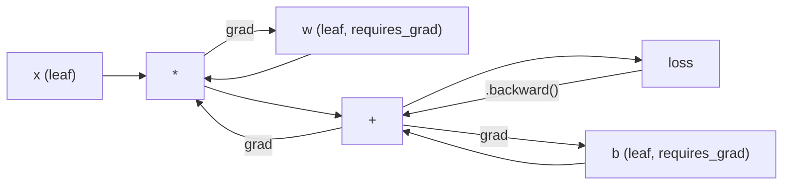
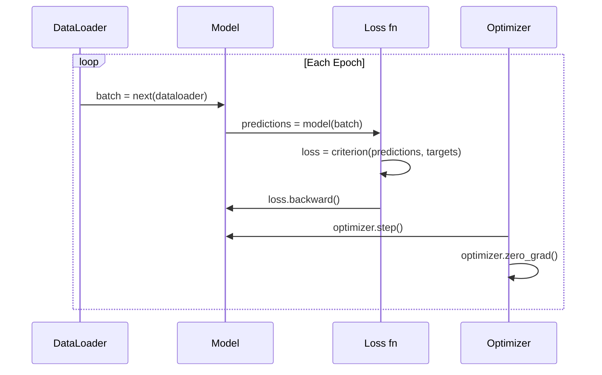

# PyTorch 소개

> 피스톤과 크랭크축부터 엔진을 만들었습니다. 이제 모두가 실제로 운전하는 엔진을 배웁니다.

**Type:** Build
**Languages:** Python
**Prerequisites:** Lesson 03.10 (나만의 미니 프레임워크 만들기)
**Time:** ~75 minutes

## 학습 목표

- PyTorch의 nn.Module, nn.Sequential, autograd를 사용해 신경망을 만들고 학습합니다
- PyTorch 텐서, GPU 가속, 표준 학습 루프(zero_grad, forward, loss, backward, step)를 사용합니다
- 직접 만든 미니 프레임워크 구성 요소를 PyTorch 대응 요소로 변환합니다
- 같은 작업에서 순수 Python 프레임워크와 PyTorch의 학습 속도를 프로파일링하고 비교합니다

## 문제

작동하는 미니 프레임워크가 있습니다. 선형 레이어, ReLU, dropout, batch norm, Adam, DataLoader, 학습 루프까지 갖추었습니다. 순수 Python으로 원형 분류 문제에서 4층 네트워크를 학습합니다.

하지만 같은 문제에서 PyTorch보다 500배 느립니다.

미니 프레임워크는 중첩된 Python 루프로 샘플을 하나씩 처리합니다. PyTorch는 같은 연산을 GPU에서 실행되는 최적화된 C++/CUDA 커널로 보냅니다. 단일 NVIDIA A100에서 PyTorch는 ImageNet(128만 이미지)으로 ResNet-50(2,560만 파라미터)을 약 6시간 만에 학습합니다. 같은 작업을 여러분의 프레임워크로 수행하면 먼저 메모리가 부족해지지 않는다는 가정하에 대략 3,000시간이 걸립니다.

속도만 차이나는 것이 아닙니다. 여러분의 프레임워크에는 GPU 지원이 없습니다. 자동 미분도 없습니다. 모든 모듈의 backward()를 직접 작성했습니다. 직렬화도, 분산 학습도, mixed precision도 없습니다. print 문 없이는 그래디언트 흐름을 디버깅할 방법도 없습니다.

PyTorch는 이 모든 빈틈을 채웁니다. 동시에 여러분이 이미 만든 mental model을 그대로 유지합니다: Module, forward(), parameters(), backward(), optimizer.step(). 개념은 일대일로 이어집니다. 문법도 거의 같습니다. 차이는 PyTorch가 여러분이 처음부터 설계한 것과 같은 인터페이스 뒤에 10년치 시스템 엔지니어링을 감싼다는 점입니다.

## 개념

### PyTorch가 승리한 이유

2015년의 TensorFlow는 무엇이든 실행하기 전에 정적 computation graph를 정의해야 했습니다. 그래프를 만들고, 컴파일한 다음, 그 안으로 데이터를 흘려보냈습니다. 디버깅은 그래프 시각화를 들여다보는 일이었습니다. 아키텍처를 바꾸려면 그래프를 처음부터 다시 만들어야 했습니다.

PyTorch는 2017년에 다른 철학으로 출시되었습니다: eager execution입니다. Python을 작성하면 즉시 실행됩니다. `y = model(x)`는 "나중에 y를 계산할 그래프에 노드를 추가"하는 것이 아니라 바로 지금 실제로 y를 계산합니다. 그래서 표준 Python 디버깅 도구가 그대로 동작했습니다. print()도, pdb도, forward pass 안의 if/else도 동작했습니다.

2020년이 되자 시장의 선택은 분명해졌습니다. ML 연구 논문에서 PyTorch의 점유율은 7%(2017년)에서 75% 이상(2022년)으로 올랐습니다. Meta, Google DeepMind, OpenAI, Anthropic, Hugging Face는 모두 PyTorch를 주요 프레임워크로 사용합니다. TensorFlow 2.x도 이에 대응해 eager execution을 채택했습니다. PyTorch의 설계가 옳았다는 암묵적 인정입니다.

교훈은 이렇습니다. 개발자 경험은 복리로 쌓입니다. 10% 느리더라도 디버깅이 50% 빠른 프레임워크가 항상 이깁니다.

### 텐서

텐서는 shape, dtype, device라는 세 가지 핵심 속성을 가진 다차원 배열입니다.

```python
import torch

x = torch.zeros(3, 4)           # shape: (3, 4), dtype: float32, device: cpu
x = torch.randn(2, 3, 224, 224) # batch of 2 RGB images, 224x224
x = torch.tensor([1, 2, 3])     # from a Python list
```

**Shape**는 차원성입니다. 스칼라는 shape (), 벡터는 (n,), 행렬은 (m, n), 이미지 배치는 (batch, channels, height, width)입니다.

**Dtype**은 정밀도와 메모리를 제어합니다.

| dtype | 비트 | 범위 | 사용 사례 |
|-------|------|-------|----------|
| float32 | 32 | 약 7자리 십진 정밀도 | 기본 학습 |
| float16 | 16 | 약 3.3자리 십진 정밀도 | Mixed precision |
| bfloat16 | 16 | float32와 같은 범위, 더 낮은 정밀도 | LLM 학습 |
| int8 | 8 | -128부터 127까지 | 양자화 추론 |

**Device**는 계산이 어디에서 일어나는지 결정합니다.

```python
device = torch.device("cuda" if torch.cuda.is_available() else "cpu")
x = torch.randn(3, 4, device=device)
x = x.to("cuda")
x = x.cpu()
```

모든 연산은 관련된 텐서가 모두 같은 device에 있어야 합니다. 초보자가 가장 자주 만나는 PyTorch 오류가 바로 `RuntimeError: Expected all tensors to be on the same device`입니다. 계산 전에 모든 것을 같은 device로 옮기면 해결됩니다.

**Reshaping**은 상수 시간 연산입니다. 데이터를 바꾸는 것이 아니라 메타데이터만 바꿉니다.

```python
x = torch.randn(2, 3, 4)
x.view(2, 12)      # reshape to (2, 12) -- must be contiguous
x.reshape(6, 4)    # reshape to (6, 4) -- works always
x.permute(2, 0, 1) # reorder dimensions
x.unsqueeze(0)     # add dimension: (1, 2, 3, 4)
x.squeeze()        # remove size-1 dimensions
```

### Autograd

여러분의 미니 프레임워크에서는 모든 모듈의 backward()를 직접 구현해야 했습니다. PyTorch는 그렇지 않습니다. 텐서에 대한 모든 연산을 방향 비순환 그래프(computational graph)에 기록한 뒤, 그 그래프를 역방향으로 순회해 그래디언트를 자동으로 계산합니다.



여러분의 프레임워크와의 핵심 차이는 PyTorch가 tape-based autodiff를 사용한다는 점입니다. forward pass 동안 모든 연산이 "tape"에 추가됩니다. `.backward()`를 호출하면 tape를 역방향으로 재생합니다.

```python
x = torch.randn(3, requires_grad=True)
y = x ** 2 + 3 * x
z = y.sum()
z.backward()
print(x.grad)  # dz/dx = 2x + 3
```

autograd의 세 가지 규칙:

1. `requires_grad=True`인 leaf tensor만 그래디언트를 누적합니다
2. 그래디언트는 기본적으로 누적됩니다. 각 backward pass 전에 `optimizer.zero_grad()`를 호출합니다
3. `torch.no_grad()`는 그래디언트 추적을 비활성화합니다(평가 중 사용)

### nn.Module

`nn.Module`은 PyTorch의 모든 신경망 구성 요소가 상속하는 기본 클래스입니다. Lesson 10에서 이미 이 추상화를 만들었습니다. PyTorch 버전은 자동 파라미터 등록, 재귀적 모듈 탐색, device 관리, state dict 직렬화를 추가합니다.

```python
import torch.nn as nn

class MLP(nn.Module):
    def __init__(self, input_dim, hidden_dim, output_dim):
        super().__init__()
        self.layer1 = nn.Linear(input_dim, hidden_dim)
        self.relu = nn.ReLU()
        self.layer2 = nn.Linear(hidden_dim, output_dim)

    def forward(self, x):
        x = self.layer1(x)
        x = self.relu(x)
        x = self.layer2(x)
        return x
```

`__init__`에서 `nn.Module`이나 `nn.Parameter`를 속성으로 할당하면 PyTorch가 자동으로 등록합니다. `model.parameters()`는 등록된 모든 파라미터를 재귀적으로 수집합니다. 그래서 미니 프레임워크에서 했던 것처럼 weight를 수동으로 모을 필요가 없습니다.

핵심 building block:

| Module | 하는 일 | 파라미터 |
|--------|-------------|------------|
| nn.Linear(in, out) | Wx + b | in*out + out |
| nn.Conv2d(in_ch, out_ch, k) | 2D convolution | in_ch*out_ch*k*k + out_ch |
| nn.BatchNorm1d(features) | activation 정규화 | 2 * features |
| nn.Dropout(p) | 무작위 0 처리 | 0 |
| nn.ReLU() | max(0, x) | 0 |
| nn.GELU() | Gaussian error linear | 0 |
| nn.Embedding(vocab, dim) | lookup table | vocab * dim |
| nn.LayerNorm(dim) | 샘플별 정규화 | 2 * dim |

### 손실 함수와 옵티마이저

PyTorch는 여러분이 만든 모든 것의 production-ready 버전을 제공합니다.

**손실 함수**(`torch.nn`에서 제공):

| Loss | 작업 | 입력 |
|------|------|-------|
| nn.MSELoss() | 회귀 | 임의 shape |
| nn.CrossEntropyLoss() | 다중 클래스 분류 | Logits(softmax 아님) |
| nn.BCEWithLogitsLoss() | 이진 분류 | Logits(sigmoid 아님) |
| nn.L1Loss() | 회귀(robust) | 임의 shape |
| nn.CTCLoss() | 시퀀스 정렬 | 로그 확률 |

주의: `CrossEntropyLoss`는 내부적으로 `LogSoftmax` + `NLLLoss`를 결합합니다. softmax 출력이 아니라 raw logits를 전달해야 합니다. 이것은 잘못된 그래디언트를 조용히 만들어내는 흔한 실수입니다.

**옵티마이저**(`torch.optim`에서 제공):

| Optimizer | 사용할 때 | 일반적인 LR |
|-----------|-------------|-----------|
| SGD(params, lr, momentum) | CNN, 잘 튜닝된 파이프라인 | 0.01--0.1 |
| Adam(params, lr) | 기본 시작점 | 1e-3 |
| AdamW(params, lr, weight_decay) | Transformer, fine-tuning | 1e-4--1e-3 |
| LBFGS(params) | 소규모, second-order | 1.0 |

### 학습 루프

모든 PyTorch 학습 루프는 같은 5단계 패턴을 따릅니다. Lesson 10에서 이미 알고 있는 패턴입니다.



표준 패턴:

```python
for epoch in range(num_epochs):
    model.train()
    for inputs, targets in train_loader:
        inputs, targets = inputs.to(device), targets.to(device)
        optimizer.zero_grad()
        outputs = model(inputs)
        loss = criterion(outputs, targets)
        loss.backward()
        optimizer.step()
```

배치 루프 안의 다섯 줄입니다. GPT-4, Stable Diffusion, LLaMA를 학습한 다섯 줄이기도 합니다. 아키텍처는 바뀝니다. 데이터도 바뀝니다. 이 다섯 줄은 바뀌지 않습니다.

### Dataset과 DataLoader

PyTorch의 `Dataset`은 `__len__`과 `__getitem__` 두 메서드를 가진 추상 클래스입니다. `DataLoader`는 여기에 배치화, 셔플링, 멀티프로세스 데이터 로딩을 덧씌웁니다.

```python
from torch.utils.data import Dataset, DataLoader

class MNISTDataset(Dataset):
    def __init__(self, images, labels):
        self.images = images
        self.labels = labels

    def __len__(self):
        return len(self.labels)

    def __getitem__(self, idx):
        return self.images[idx], self.labels[idx]

loader = DataLoader(dataset, batch_size=64, shuffle=True, num_workers=4)
```

`num_workers=4`는 GPU가 현재 배치를 학습하는 동안 데이터를 병렬로 로드하는 프로세스 4개를 생성합니다. 디스크 병목이 있는 워크로드(큰 이미지, 오디오)에서는 이것만으로도 학습 속도가 두 배가 될 수 있습니다.

### GPU 학습

모델을 GPU로 옮기기:

```python
device = torch.device("cuda" if torch.cuda.is_available() else "cpu")
model = model.to(device)
```

이 코드는 모든 파라미터와 버퍼를 재귀적으로 GPU로 옮깁니다. 그런 다음 학습 중 각 배치를 옮깁니다:

```python
inputs, targets = inputs.to(device), targets.to(device)
```

**Mixed precision**은 master weights를 float32로 유지하면서 forward/backward를 float16으로 실행해 최신 GPU(A100, H100, RTX 4090)에서 메모리 사용량을 절반으로 줄이고 처리량을 두 배로 높입니다:

```python
from torch.amp import autocast, GradScaler

scaler = GradScaler()
for inputs, targets in loader:
    with autocast(device_type="cuda"):
        outputs = model(inputs)
        loss = criterion(outputs, targets)
    scaler.scale(loss).backward()
    scaler.step(optimizer)
    scaler.update()
    optimizer.zero_grad()
```

### 비교: 미니 프레임워크 vs PyTorch vs JAX

| 기능 | 미니 프레임워크(L10) | PyTorch | JAX |
|---------|---------------------|---------|-----|
| Autodiff | 수동 backward() | Tape-based autograd | Functional transforms |
| 실행 | Eager(Python 루프) | Eager(C++ 커널) | Traced + JIT compiled |
| GPU 지원 | 없음 | 있음(CUDA, ROCm, MPS) | 있음(CUDA, TPU) |
| 속도(MNIST MLP) | 약 300s/epoch | 약 0.5s/epoch | 약 0.3s/epoch |
| 모듈 시스템 | Custom Module 클래스 | nn.Module | Stateless functions(Flax/Equinox) |
| 디버깅 | print() | print(), pdb, breakpoint() | 더 어려움(JIT tracing이 print를 깨뜨림) |
| 생태계 | 없음 | Hugging Face, Lightning, timm | Flax, Optax, Orbax |
| 학습 곡선 | 직접 만들었음 | 보통 | 가파름(functional paradigm) |
| 프로덕션 사용 | 장난감 문제 | Meta, OpenAI, Anthropic, HF | Google DeepMind, Midjourney |

```figure
dropout-mask
```

## 만들어 보기

PyTorch primitive만 사용해 MNIST에서 학습하는 3층 MLP입니다. 고수준 wrapper는 쓰지 않습니다. `torchvision.datasets`도 쓰지 않습니다. raw data를 직접 다운로드하고 파싱합니다.

### 1단계: raw file에서 MNIST 로드하기

MNIST는 gzip으로 압축된 4개 파일로 제공됩니다: 학습 이미지(60,000 x 28 x 28), 학습 라벨, 테스트 이미지(10,000 x 28 x 28), 테스트 라벨입니다. 이 파일들을 다운로드하고 바이너리 형식을 파싱합니다.

```python
import torch
import torch.nn as nn
import struct
import gzip
import urllib.request
import os

def download_mnist(path="./mnist_data"):
    base_url = "https://storage.googleapis.com/cvdf-datasets/mnist/"
    files = [
        "train-images-idx3-ubyte.gz",
        "train-labels-idx1-ubyte.gz",
        "t10k-images-idx3-ubyte.gz",
        "t10k-labels-idx1-ubyte.gz",
    ]
    os.makedirs(path, exist_ok=True)
    for f in files:
        filepath = os.path.join(path, f)
        if not os.path.exists(filepath):
            urllib.request.urlretrieve(base_url + f, filepath)

def load_images(filepath):
    with gzip.open(filepath, "rb") as f:
        magic, num, rows, cols = struct.unpack(">IIII", f.read(16))
        data = f.read()
        images = torch.frombuffer(bytearray(data), dtype=torch.uint8)
        images = images.reshape(num, rows * cols).float() / 255.0
    return images

def load_labels(filepath):
    with gzip.open(filepath, "rb") as f:
        magic, num = struct.unpack(">II", f.read(8))
        data = f.read()
        labels = torch.frombuffer(bytearray(data), dtype=torch.uint8).long()
    return labels
```

### 2단계: 모델 정의하기

3층 MLP입니다: 784 -> 256 -> 128 -> 10. ReLU activation을 사용합니다. 정규화를 위해 dropout을 사용합니다. 단순하게 유지하기 위해 batch norm은 사용하지 않습니다.

```python
class MNISTModel(nn.Module):
    def __init__(self):
        super().__init__()
        self.net = nn.Sequential(
            nn.Linear(784, 256),
            nn.ReLU(),
            nn.Dropout(0.2),
            nn.Linear(256, 128),
            nn.ReLU(),
            nn.Dropout(0.2),
            nn.Linear(128, 10),
        )

    def forward(self, x):
        return self.net(x)
```

출력 레이어는 10개의 raw logits를 생성합니다(숫자 하나당 하나). softmax는 없습니다. `CrossEntropyLoss`가 내부에서 처리합니다.

파라미터 수: 784*256 + 256 + 256*128 + 128 + 128*10 + 10 = 235,146입니다. 현대 기준으로는 아주 작습니다. GPT-2 small은 1억 2,400만 개입니다. 이 모델은 몇 초 만에 학습됩니다.

### 3단계: 학습 루프

표준 forward-loss-backward-step 패턴입니다.

```python
def train_one_epoch(model, loader, criterion, optimizer, device):
    model.train()
    total_loss = 0
    correct = 0
    total = 0
    for images, labels in loader:
        images, labels = images.to(device), labels.to(device)
        optimizer.zero_grad()
        outputs = model(images)
        loss = criterion(outputs, labels)
        loss.backward()
        optimizer.step()
        total_loss += loss.item() * images.size(0)
        _, predicted = outputs.max(1)
        correct += predicted.eq(labels).sum().item()
        total += labels.size(0)
    return total_loss / total, correct / total


def evaluate(model, loader, criterion, device):
    model.eval()
    total_loss = 0
    correct = 0
    total = 0
    with torch.no_grad():
        for images, labels in loader:
            images, labels = images.to(device), labels.to(device)
            outputs = model(images)
            loss = criterion(outputs, labels)
            total_loss += loss.item() * images.size(0)
            _, predicted = outputs.max(1)
            correct += predicted.eq(labels).sum().item()
            total += labels.size(0)
    return total_loss / total, correct / total
```

평가 중 `torch.no_grad()`에 주목하세요. 이것은 autograd를 비활성화해 메모리 사용량을 줄이고 추론 속도를 높입니다. 이것이 없으면 PyTorch는 절대 사용하지 않을 computational graph를 만듭니다.

### 4단계: 모두 연결하기

```python
def main():
    device = torch.device("cuda" if torch.cuda.is_available() else "cpu")

    download_mnist()
    train_images = load_images("./mnist_data/train-images-idx3-ubyte.gz")
    train_labels = load_labels("./mnist_data/train-labels-idx1-ubyte.gz")
    test_images = load_images("./mnist_data/t10k-images-idx3-ubyte.gz")
    test_labels = load_labels("./mnist_data/t10k-labels-idx1-ubyte.gz")

    train_dataset = torch.utils.data.TensorDataset(train_images, train_labels)
    test_dataset = torch.utils.data.TensorDataset(test_images, test_labels)
    train_loader = torch.utils.data.DataLoader(
        train_dataset, batch_size=64, shuffle=True
    )
    test_loader = torch.utils.data.DataLoader(
        test_dataset, batch_size=256, shuffle=False
    )

    model = MNISTModel().to(device)
    criterion = nn.CrossEntropyLoss()
    optimizer = torch.optim.Adam(model.parameters(), lr=1e-3)

    num_params = sum(p.numel() for p in model.parameters())
    print(f"Device: {device}")
    print(f"Parameters: {num_params:,}")
    print(f"Train samples: {len(train_dataset):,}")
    print(f"Test samples: {len(test_dataset):,}")
    print()

    for epoch in range(10):
        train_loss, train_acc = train_one_epoch(
            model, train_loader, criterion, optimizer, device
        )
        test_loss, test_acc = evaluate(
            model, test_loader, criterion, device
        )
        print(
            f"Epoch {epoch+1:2d} | "
            f"Train Loss: {train_loss:.4f} | Train Acc: {train_acc:.4f} | "
            f"Test Loss: {test_loss:.4f} | Test Acc: {test_acc:.4f}"
        )

    torch.save(model.state_dict(), "mnist_mlp.pt")
    print(f"\nModel saved to mnist_mlp.pt")
    print(f"Final test accuracy: {test_acc:.4f}")
```

10 epoch 후 예상 출력은 약 97.8% 테스트 정확도입니다. CPU 학습 시간은 약 30초입니다. GPU에서는 약 5초입니다. 같은 아키텍처를 여러분의 미니 프레임워크에서 학습하면 약 45분이 걸립니다.

## 사용하기

### 빠른 비교: 미니 프레임워크 vs PyTorch

| 미니 프레임워크(Lesson 10) | PyTorch |
|---------------------------|---------|
| `model = Sequential(Linear(784, 256), ReLU(), ...)` | `model = nn.Sequential(nn.Linear(784, 256), nn.ReLU(), ...)` |
| `pred = model.forward(x)` | `pred = model(x)` |
| `optimizer.zero_grad()` | `optimizer.zero_grad()` |
| `grad = criterion.backward()` 다음 `model.backward(grad)` | `loss.backward()` |
| `optimizer.step()` | `optimizer.step()` |
| GPU 없음 | `model.to("cuda")` |
| 모든 모듈의 backward 수동 작성 | Autograd가 모두 처리 |

인터페이스는 거의 같습니다. 차이는 내부에서 일어나는 모든 것입니다.

### 모델 저장과 로드

```python
torch.save(model.state_dict(), "model.pt")

model = MNISTModel()
model.load_state_dict(torch.load("model.pt", weights_only=True))
model.eval()
```

모델 객체가 아니라 항상 `state_dict()`(파라미터 딕셔너리)를 저장하세요. 모델 객체 저장은 pickle을 사용하므로 코드를 리팩터링하면 깨집니다. State dict는 이식 가능합니다.

### 학습률 스케줄링

```python
scheduler = torch.optim.lr_scheduler.CosineAnnealingLR(
    optimizer, T_max=10
)
for epoch in range(10):
    train_one_epoch(model, train_loader, criterion, optimizer, device)
    scheduler.step()
```

PyTorch는 StepLR, ExponentialLR, CosineAnnealingLR, OneCycleLR, ReduceLROnPlateau 등 15개 이상의 scheduler를 제공합니다. 모두 같은 optimizer 인터페이스에 연결됩니다.

## 내보내기

이 레슨은 두 가지 artifact를 만듭니다:

- `outputs/prompt-pytorch-debugger.md` -- 흔한 PyTorch 학습 실패를 진단하는 prompt
- `outputs/skill-pytorch-patterns.md` -- PyTorch 학습 패턴을 위한 skill reference

## 연습 문제

1. **Batch normalization을 추가하세요.** 각 linear layer 뒤(activation 전)에 `nn.BatchNorm1d`를 삽입하세요. 테스트 정확도와 학습 속도를 dropout-only 버전과 비교하세요. Batch norm은 더 적은 epoch 안에 98%+에 도달해야 합니다.

2. **Learning rate finder를 구현하세요.** learning rate를 지수적으로 증가시키며(1e-7부터 1.0까지) 한 epoch 동안 학습하세요. loss vs LR을 그리세요. 최적 LR은 loss가 상승하기 직전입니다. 이것을 사용해 MNIST 모델에 더 나은 LR을 선택하세요.

3. **Mixed precision으로 GPU에 포팅하세요.** 학습 루프에 `torch.amp.autocast`와 `GradScaler`를 추가하세요. GPU에서 mixed precision 사용 여부에 따른 처리량(samples/second)을 측정하세요. A100에서는 약 2배 속도 향상을 기대할 수 있습니다.

4. **Custom Dataset을 만드세요.** Fashion-MNIST(MNIST와 같은 형식이지만 의류 항목)를 다운로드하세요. `__getitem__`과 `__len__`을 가진 `FashionMNISTDataset(Dataset)` 클래스를 구현하세요. 같은 MLP를 학습하고 정확도를 비교하세요. Fashion-MNIST는 더 어렵습니다. 약 88% vs 약 98%를 예상하세요.

5. **Adam을 SGD + momentum으로 바꾸세요.** `SGD(params, lr=0.01, momentum=0.9)`로 학습하세요. 수렴 곡선을 비교하세요. 그런 다음 `CosineAnnealingLR` scheduler를 추가하고 epoch 10까지 SGD가 Adam을 따라잡는지 확인하세요.

## 핵심 용어

| 용어 | 사람들이 말하는 것 | 실제 의미 |
|------|----------------|----------------------|
| Tensor | "다차원 배열" | 모든 연산에 자동 미분 지원이 내장된 typed, device-aware 배열 |
| Autograd | "자동 backprop" | forward pass 동안 연산을 기록한 뒤 역방향으로 재생해 정확한 그래디언트를 계산하는 tape-based 시스템 |
| nn.Module | "레이어" | 모든 미분 가능 computation block의 기본 클래스. 파라미터를 등록하고, 중첩을 지원하며, train/eval 모드를 처리합니다 |
| state_dict | "모델 weight" | 파라미터 이름을 텐서에 매핑하는 OrderedDict. 학습된 모델의 이식 가능하고 직렬화 가능한 표현 |
| .backward() | "그래디언트 계산" | computational graph를 역방향으로 순회하며 requires_grad=True인 모든 leaf tensor의 그래디언트를 계산하고 누적합니다 |
| .to(device) | "GPU로 옮기기" | 모든 파라미터와 버퍼를 지정한 device(CPU, CUDA, MPS)로 재귀적으로 전송합니다 |
| DataLoader | "데이터 파이프라인" | Dataset에서 데이터를 배치화하고 셔플하며 선택적으로 병렬 로딩하는 iterator |
| Mixed precision | "float16 사용" | 수치 안정성을 위해 float32 master weights를 유지하면서 속도를 위해 float16 forward/backward로 학습합니다 |
| Eager execution | "지금 실행" | 연산이 나중의 컴파일 단계로 지연되지 않고 호출 즉시 실행됩니다. PyTorch를 TF 1.x와 구분하는 핵심 설계 선택입니다 |
| zero_grad | "그래디언트 초기화" | PyTorch는 기본적으로 그래디언트를 누적하므로 다음 backward pass 전에 모든 파라미터 그래디언트를 0으로 설정합니다 |

## 더 읽을거리

- Paszke et al., "PyTorch: An Imperative Style, High-Performance Deep Learning Library" (2019) -- PyTorch의 설계 tradeoff를 설명하는 원 논문
- PyTorch Tutorials: "Learning PyTorch with Examples" (https://pytorch.org/tutorials/beginner/pytorch_with_examples.html) -- 텐서에서 nn.Module까지 이어지는 공식 경로
- PyTorch Performance Tuning Guide (https://pytorch.org/tutorials/recipes/recipes/tuning_guide.html) -- mixed precision, DataLoader worker, pinned memory 및 기타 production 최적화
- Horace He, "Making Deep Learning Go Brrrr" (https://horace.io/brrr_intro.html) -- PyTorch별 최적화 전략과 함께 GPU 학습이 빠른 이유를 설명합니다
