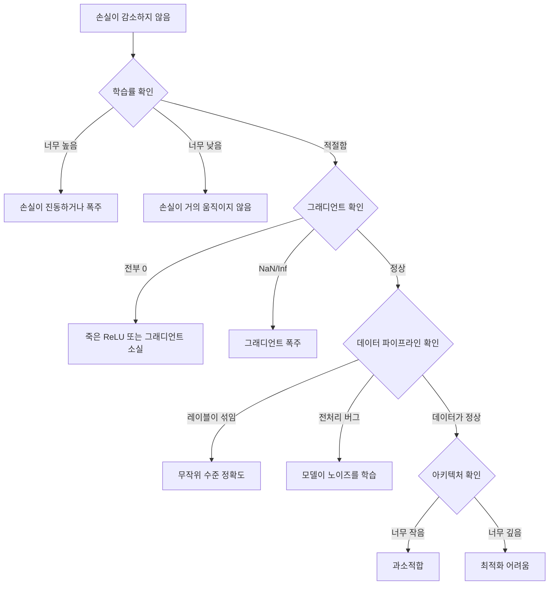
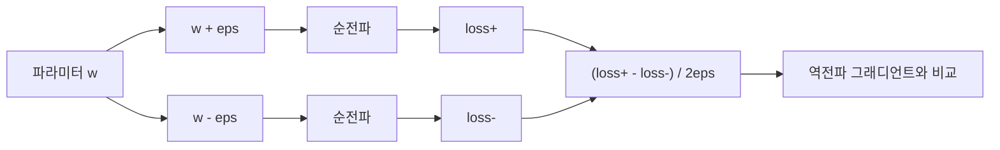
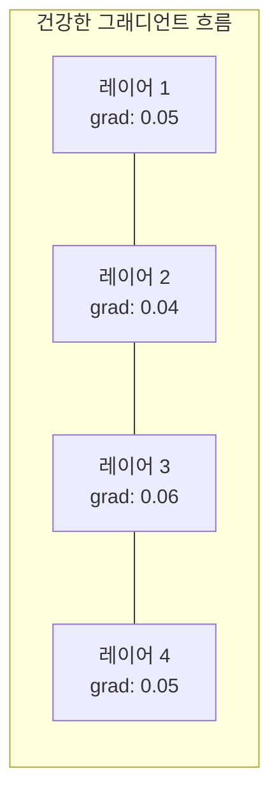
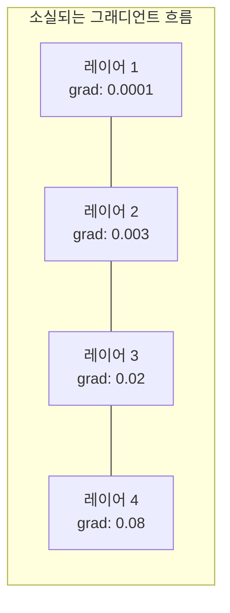
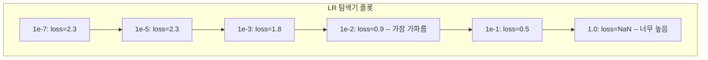

# 신경망 디버깅

> 네트워크가 컴파일되었습니다. 실행도 되었습니다. 숫자도 나왔습니다. 그런데 그 숫자가 틀렸고, 아무것도 크래시되지 않았습니다. 오류 메시지가 없는 가장 어려운 종류의 디버깅에 오신 것을 환영합니다.

**Type:** Build
**Languages:** Python, PyTorch
**Prerequisites:** Phase 03 Lessons 01-10 (특히 역전파, 손실 함수, 옵티마이저)
**Time:** ~90 minutes

## 학습 목표

- 체계적인 디버깅 전략으로 흔한 신경망 실패(NaN 손실, 평평한 손실 곡선, 과적합, 진동)를 진단합니다
- 모델 아키텍처와 학습 루프가 올바른지 확인하기 위해 "한 배치 과적합" 기법을 적용합니다
- 그래디언트 크기, 활성화 분포, 가중치 노름을 검사하여 그래디언트 소실/폭주 문제를 식별합니다
- 데이터 파이프라인, 모델 아키텍처, 손실 함수, 옵티마이저, 학습률 문제를 포괄하는 디버깅 체크리스트를 만듭니다

## 문제

전통적인 소프트웨어는 망가지면 크래시됩니다. 널 포인터는 예외를 던집니다. 타입 불일치는 컴파일 시간에 실패합니다. 오프바이원 오류는 명백히 잘못된 출력을 냅니다.

신경망은 그런 친절함을 제공하지 않습니다.

망가진 신경망도 끝까지 실행되고, 손실 값을 출력하고, 예측을 내놓습니다. 손실이 줄어들 수도 있습니다. 예측이 그럴듯해 보일 수도 있습니다. 하지만 모델은 조용히 틀렸습니다. 지름길을 학습하거나, 노이즈를 외우거나, 쓸모없는 지역 최솟값으로 수렴합니다. Google 연구자들은 ML 디버깅 시간의 60-70%가 오류는 만들지 않지만 모델 품질을 떨어뜨리는 "조용한" 버그에 쓰인다고 추정했습니다.

작동하는 모델과 망가진 모델의 차이는 종종 잘못 놓인 한 줄입니다. 빠진 `zero_grad()`, 전치된 차원, 10배 빗나간 학습률 같은 것들입니다. 표준적인 글인 "Recipe for Training Neural Networks" (2019)는 이렇게 시작합니다. "가장 흔한 신경망 실수는 크래시를 일으키지 않는 버그다."

이 레슨은 그런 버그를 찾는 법을 가르칩니다.

## 개념

### 디버깅 사고방식

찍어 보고 기도하는 식의 디버깅은 잊으세요. 신경망 디버깅에는 체계적인 접근이 필요합니다. 피드백 루프가 느리고(학습 실행 한 번에 몇 분에서 몇 시간), 증상이 모호하기 때문입니다(나쁜 손실은 20가지 다른 의미일 수 있습니다).

황금률은 이것입니다. **단순하게 시작하고, 복잡성을 한 조각씩 더하며, 각 조각을 독립적으로 검증하세요.**



### 증상 1: 손실이 감소하지 않음

가장 흔한 불만입니다. 학습 루프는 돌아가고 에폭은 지나가지만, 손실은 평평하게 머물거나 심하게 진동합니다.

**잘못된 학습률.** 너무 높으면 손실이 진동하거나 NaN으로 튑니다. 너무 낮으면 손실이 너무 천천히 감소해서 평평해 보입니다. Adam은 1e-3에서 시작하세요. SGD는 1e-1 또는 1e-2에서 시작하세요. 다른 문제가 있다고 결론 내리기 전에 항상 10배 간격의 학습률 3개(예: 1e-2, 1e-3, 1e-4)를 시도하세요.

**죽은 ReLU.** ReLU 뉴런이 큰 음수 입력을 받으면 0을 출력하고 그래디언트도 0이 됩니다. 다시는 활성화되지 않습니다. 충분히 많은 뉴런이 죽으면 네트워크는 학습할 수 없습니다. 확인 방법: 각 ReLU 레이어 뒤에서 정확히 0인 활성화의 비율을 출력하세요. 50%를 넘으면 LeakyReLU로 바꾸거나 학습률을 낮추세요.

**그래디언트 소실.** sigmoid 또는 tanh 활성화를 쓰는 깊은 네트워크에서는 그래디언트가 뒤로 전파되면서 지수적으로 작아집니다. 첫 번째 레이어에 도달할 때쯤에는 거의 0입니다. 앞쪽 레이어가 학습을 멈춥니다. 해결: ReLU/GELU를 쓰고, 잔차 연결을 추가하거나, 배치 정규화를 사용하세요.

**그래디언트 폭주.** 반대 문제입니다. 그래디언트가 지수적으로 커집니다. RNN과 매우 깊은 네트워크에서 흔합니다. 손실이 NaN으로 튑니다. 해결: 그래디언트 클리핑(`torch.nn.utils.clip_grad_norm_`), 더 낮은 학습률, 또는 정규화를 추가하세요.

### 증상 2: 손실은 감소하지만 모델이 나쁨

손실은 내려갑니다. 학습 정확도는 99%에 도달합니다. 하지만 테스트 정확도는 55%입니다. 또는 모델이 실제 데이터에서 말이 안 되는 출력을 만듭니다.

**과적합.** 모델이 패턴을 배우는 대신 학습 데이터를 외웁니다. 시간이 지날수록 학습 손실과 검증 손실의 차이가 커집니다. 해결: 더 많은 데이터, 드롭아웃, 가중치 감쇠, 조기 종료, 데이터 증강.

**데이터 누수.** 테스트 데이터가 학습에 새어 들어갔습니다. 정확도가 의심스러울 만큼 높습니다. 흔한 원인: 분할 전에 셔플하기, 전체 데이터셋 통계로 전처리하기, 분할 사이에 중복 샘플이 있음. 해결: 먼저 분할하고, 그다음 전처리하고, 중복을 확인하세요.

**레이블 오류.** 대부분의 실제 데이터셋에서는 레이블의 5-10%가 잘못되어 있습니다(Northcutt et al., 2021 -- "Pervasive Label Errors in Test Sets"). 모델은 그 노이즈를 학습합니다. 해결: confident learning으로 잘못 레이블링된 예제를 찾아 고치거나, 손실 절단으로 손실이 큰 샘플을 무시하세요.

### 증상 3: 손실의 NaN 또는 Inf

손실 값이 `nan` 또는 `inf`가 됩니다. 학습은 멈춘 것입니다.

**학습률이 너무 높음.** 그래디언트 업데이트가 너무 크게 빗나가 가중치가 폭주합니다. 해결: 10배 낮추세요.

**log(0) 또는 log(음수).** 크로스 엔트로피 손실은 `log(p)`를 계산합니다. 모델이 정확히 0 또는 음수 확률을 출력하면 로그가 폭주합니다. 해결: 예측을 `[eps, 1-eps]`로 클램프하세요. 여기서 `eps=1e-7`입니다.

**0으로 나누기.** 배치 정규화는 표준편차로 나눕니다. 값이 모두 같은 배치는 std=0입니다. 해결: 분모에 epsilon을 더하세요(PyTorch는 기본으로 이렇게 하지만, 직접 구현한 코드는 아닐 수 있습니다).

**수치 오버플로.** 큰 활성화가 `exp()`에 들어가면 Inf가 만들어집니다. Softmax가 특히 취약합니다. 해결: 지수화를 하기 전에 최댓값을 빼세요(log-sum-exp 트릭).

### 기법 1: 그래디언트 검사

해석적 그래디언트(역전파에서 나온 값)를 수치 그래디언트(유한 차분에서 나온 값)와 비교하세요. 둘이 맞지 않으면 backward pass에 버그가 있습니다.

파라미터 `w`에 대한 수치 그래디언트:

```text
grad_numerical = (loss(w + eps) - loss(w - eps)) / (2 * eps)
```

일치도 지표(상대 차이):

```text
rel_diff = |grad_analytical - grad_numerical| / max(|grad_analytical|, |grad_numerical|, 1e-8)
```

`rel_diff < 1e-5`이면 올바릅니다. `rel_diff > 1e-3`이면 거의 확실히 버그입니다.



### 기법 2: 활성화 통계

학습 중 각 레이어 뒤의 활성화 평균과 표준편차를 모니터링하세요. 건강한 네트워크는 평균이 0 근처이고 표준편차가 1 근처인 활성화(정규화 이후)를 유지하거나, 적어도 값이 제한되어 있습니다.

| 건강 지표 | 평균 | 표준편차 | 진단 |
|-----------------|------|-----|-----------|
| 건강함 | ~0 | ~1 | 네트워크가 정상적으로 학습 중 |
| 포화됨 | >>0 또는 <<0 | ~0 | 활성화가 극단값에 고정됨 |
| 죽음 | 0 | 0 | 뉴런이 죽음(전부 0) |
| 폭주 | >>10 | >>10 | 활성화가 제한 없이 커짐 |

### 기법 3: 그래디언트 흐름 시각화

각 레이어의 평균 그래디언트 크기를 그리세요. 건강한 네트워크에서는 레이어 전반의 그래디언트 크기가 대체로 비슷해야 합니다. 앞쪽 레이어의 그래디언트가 뒤쪽 레이어보다 1000배 작다면 그래디언트 소실이 있는 것입니다.





### 기법 4: 한 배치 과적합 테스트

딥러닝에서 가장 중요한 단일 디버깅 기법입니다.

작은 배치 하나(8-32개 샘플)를 가져오세요. 그 배치로 100회 이상 반복 학습합니다. 손실은 거의 0으로 가야 하고 학습 정확도는 100%에 도달해야 합니다. 그렇지 않다면 모델 또는 학습 루프에 근본적인 버그가 있습니다. 전체 학습으로 진행하지 마세요.

이 테스트는 다음을 잡아냅니다.
- 망가진 손실 함수
- 망가진 backward pass
- 데이터를 표현하기에 너무 작은 아키텍처
- 모델 파라미터에 연결되지 않은 옵티마이저
- 어긋난 데이터와 레이블

실행에는 30초가 걸리지만, 전체 학습 실행을 디버깅하는 몇 시간을 절약해 줍니다.

### 기법 5: 학습률 탐색기

Leslie Smith (2017)는 한 에폭 동안 학습률을 매우 작은 값(1e-7)에서 매우 큰 값(10)까지 훑으면서 손실을 기록하는 방법을 제안했습니다. 손실 대 학습률을 그리세요. 최적 학습률은 손실이 가장 빠르게 감소하기 시작하는 지점보다 대략 10배 작은 값입니다.



이 예시의 최적 LR: ~1e-3(가장 가파른 지점보다 한 자릿수 작은 값).

### 흔한 PyTorch 버그

PyTorch 커뮤니티 전체에서 가장 많은 시간을 낭비하게 만드는 버그들입니다.

| 버그 | 증상 | 해결 |
|-----|---------|-----|
| `optimizer.zero_grad()`를 잊음 | 그래디언트가 배치 사이에 누적되고 손실이 진동함 | `loss.backward()` 전에 `optimizer.zero_grad()` 추가 |
| 테스트 시점에 `model.eval()`을 잊음 | 드롭아웃과 배치 정규화가 다르게 동작하고, 실행마다 테스트 정확도가 달라짐 | `model.eval()`과 `torch.no_grad()` 추가 |
| 잘못된 텐서 shape | 조용한 브로드캐스팅이 오류 없이 잘못된 결과를 만듦 | 디버깅 중 모든 연산 뒤에서 shape 출력 |
| CPU/GPU 불일치 | `RuntimeError: expected CUDA tensor` | 모델과 데이터 모두에 `.to(device)` 사용 |
| 텐서를 detach하지 않음 | 계산 그래프가 끝없이 커져 OOM 발생 | `.detach()` 또는 `with torch.no_grad()` 사용 |
| 인플레이스 연산이 autograd를 깨뜨림 | `RuntimeError: modified by in-place operation` | `x += 1`을 `x = x + 1`로 교체 |
| 데이터가 정규화되지 않음 | 손실이 무작위 수준에 고정됨 | 입력을 mean=0, std=1로 정규화 |
| 레이블 dtype이 잘못됨 | Cross-entropy는 `Long`을 기대하지만 `Float`를 받음 | 레이블 캐스팅: `labels.long()` |

### 마스터 디버깅 표

| 증상 | 가능성 높은 원인 | 먼저 시도할 것 |
|---------|-------------|-------------------|
| 손실이 -log(1/num_classes)에 고정 | 모델이 균등 분포를 예측함 | 데이터 파이프라인 확인, 레이블이 입력과 맞는지 검증 |
| 몇 스텝 뒤 손실 NaN | 학습률이 너무 높음 | LR을 10배 낮춤 |
| 즉시 손실 NaN | log(0) 또는 0으로 나누기 | log/나누기 연산에 epsilon 추가 |
| 손실이 심하게 진동 | LR이 너무 높거나 배치 크기가 너무 작음 | LR 낮추기, 배치 크기 늘리기 |
| 손실이 감소하다가 정체 | 파인튜닝 단계에 LR이 너무 높음 | LR 스케줄 추가(cosine 또는 step decay) |
| 학습 acc 높음, 테스트 acc 낮음 | 과적합 | 드롭아웃, 가중치 감쇠, 더 많은 데이터 추가 |
| 학습 acc = 테스트 acc = chance | 모델이 아무것도 학습하지 않음 | 한 배치 과적합 테스트 실행 |
| 학습 acc = 테스트 acc이지만 둘 다 낮음 | 과소적합 | 더 큰 모델, 더 많은 레이어, 더 많은 특징 |
| 그래디언트가 전부 0 | 죽은 ReLU 또는 detach된 계산 그래프 | LeakyReLU로 전환, `.requires_grad` 확인 |
| 학습 중 메모리 부족 | 배치가 너무 크거나 그래프가 해제되지 않음 | 배치 크기 줄이기, eval에 `torch.no_grad()` 사용 |

```figure
learning-curves
```

## 직접 만들기

활성화, 그래디언트, 손실 곡선을 모니터링하는 진단 도구 모음입니다. 의도적으로 네트워크를 망가뜨린 뒤 이 도구 모음으로 각 문제를 진단합니다.

### 단계 1: NetworkDebugger 클래스

PyTorch 모델에 hook을 걸어 레이어별 활성화와 그래디언트 통계를 기록합니다.

```python
import torch
import torch.nn as nn
import math


class NetworkDebugger:
    def __init__(self, model):
        self.model = model
        self.activation_stats = {}
        self.gradient_stats = {}
        self.loss_history = []
        self.lr_losses = []
        self.hooks = []
        self._register_hooks()

    def _register_hooks(self):
        for name, module in self.model.named_modules():
            if isinstance(module, (nn.Linear, nn.Conv2d, nn.ReLU, nn.LeakyReLU)):
                hook = module.register_forward_hook(self._make_activation_hook(name))
                self.hooks.append(hook)
                hook = module.register_full_backward_hook(self._make_gradient_hook(name))
                self.hooks.append(hook)

    def _make_activation_hook(self, name):
        def hook(module, input, output):
            with torch.no_grad():
                out = output.detach().float()
                self.activation_stats[name] = {
                    "mean": out.mean().item(),
                    "std": out.std().item(),
                    "fraction_zero": (out == 0).float().mean().item(),
                    "min": out.min().item(),
                    "max": out.max().item(),
                }
        return hook

    def _make_gradient_hook(self, name):
        def hook(module, grad_input, grad_output):
            if grad_output[0] is not None:
                with torch.no_grad():
                    grad = grad_output[0].detach().float()
                    self.gradient_stats[name] = {
                        "mean": grad.mean().item(),
                        "std": grad.std().item(),
                        "abs_mean": grad.abs().mean().item(),
                        "max": grad.abs().max().item(),
                    }
        return hook

    def record_loss(self, loss_value):
        self.loss_history.append(loss_value)

    def check_loss_health(self):
        if len(self.loss_history) < 2:
            return "NOT_ENOUGH_DATA"
        recent = self.loss_history[-10:]
        if any(math.isnan(v) or math.isinf(v) for v in recent):
            return "NAN_OR_INF"
        if len(self.loss_history) >= 20:
            first_half = sum(self.loss_history[:10]) / 10
            second_half = sum(self.loss_history[-10:]) / 10
            if second_half >= first_half * 0.99:
                return "NOT_DECREASING"
        if len(recent) >= 5:
            diffs = [recent[i+1] - recent[i] for i in range(len(recent)-1)]
            if max(diffs) - min(diffs) > 2 * abs(sum(diffs) / len(diffs)):
                return "OSCILLATING"
        return "HEALTHY"

    def check_activations(self):
        issues = []
        for name, stats in self.activation_stats.items():
            if stats["fraction_zero"] > 0.5:
                issues.append(f"DEAD_NEURONS: {name} has {stats['fraction_zero']:.0%} zero activations")
            if abs(stats["mean"]) > 10:
                issues.append(f"EXPLODING_ACTIVATIONS: {name} mean={stats['mean']:.2f}")
            if stats["std"] < 1e-6:
                issues.append(f"COLLAPSED_ACTIVATIONS: {name} std={stats['std']:.2e}")
        return issues if issues else ["HEALTHY"]

    def check_gradients(self):
        issues = []
        grad_magnitudes = []
        for name, stats in self.gradient_stats.items():
            grad_magnitudes.append((name, stats["abs_mean"]))
            if stats["abs_mean"] < 1e-7:
                issues.append(f"VANISHING_GRADIENT: {name} abs_mean={stats['abs_mean']:.2e}")
            if stats["abs_mean"] > 100:
                issues.append(f"EXPLODING_GRADIENT: {name} abs_mean={stats['abs_mean']:.2e}")
        if len(grad_magnitudes) >= 2:
            first_mag = grad_magnitudes[0][1]
            last_mag = grad_magnitudes[-1][1]
            if last_mag > 0 and first_mag / last_mag > 100:
                issues.append(f"GRADIENT_RATIO: first/last = {first_mag/last_mag:.0f}x (vanishing)")
        return issues if issues else ["HEALTHY"]

    def print_report(self):
        print("\n=== NETWORK DEBUGGER REPORT ===")
        print(f"\nLoss health: {self.check_loss_health()}")
        if self.loss_history:
            print(f"  Last 5 losses: {[f'{v:.4f}' for v in self.loss_history[-5:]]}")
        print("\nActivation diagnostics:")
        for item in self.check_activations():
            print(f"  {item}")
        print("\nGradient diagnostics:")
        for item in self.check_gradients():
            print(f"  {item}")
        print("\nPer-layer activation stats:")
        for name, stats in self.activation_stats.items():
            print(f"  {name}: mean={stats['mean']:.4f} std={stats['std']:.4f} zero={stats['fraction_zero']:.1%}")
        print("\nPer-layer gradient stats:")
        for name, stats in self.gradient_stats.items():
            print(f"  {name}: abs_mean={stats['abs_mean']:.2e} max={stats['max']:.2e}")

    def remove_hooks(self):
        for hook in self.hooks:
            hook.remove()
        self.hooks.clear()
```

### 단계 2: 한 배치 과적합 테스트

```python
def overfit_one_batch(model, x_batch, y_batch, criterion, lr=0.01, steps=200):
    optimizer = torch.optim.Adam(model.parameters(), lr=lr)
    model.train()
    print("\n=== OVERFIT ONE BATCH TEST ===")
    print(f"Batch size: {x_batch.shape[0]}, Steps: {steps}")

    for step in range(steps):
        optimizer.zero_grad()
        output = model(x_batch)
        loss = criterion(output, y_batch)
        loss.backward()
        optimizer.step()

        if step % 50 == 0 or step == steps - 1:
            with torch.no_grad():
                preds = (output > 0).float() if output.shape[-1] == 1 else output.argmax(dim=1)
                targets = y_batch if y_batch.dim() == 1 else y_batch.squeeze()
                acc = (preds.squeeze() == targets).float().mean().item()
            print(f"  Step {step:3d} | Loss: {loss.item():.6f} | Accuracy: {acc:.1%}")

    final_loss = loss.item()
    if final_loss > 0.1:
        print(f"\n  FAIL: Loss did not converge ({final_loss:.4f}). Model or training loop is broken.")
        return False
    print(f"\n  PASS: Loss converged to {final_loss:.6f}")
    return True
```

### 단계 3: 학습률 탐색기

```python
def find_learning_rate(model, x_data, y_data, criterion, start_lr=1e-7, end_lr=10, steps=100):
    import copy
    original_state = copy.deepcopy(model.state_dict())
    optimizer = torch.optim.SGD(model.parameters(), lr=start_lr)
    lr_mult = (end_lr / start_lr) ** (1 / steps)

    model.train()
    results = []
    best_loss = float("inf")
    current_lr = start_lr

    print("\n=== LEARNING RATE FINDER ===")

    for step in range(steps):
        optimizer.zero_grad()
        output = model(x_data)
        loss = criterion(output, y_data)

        if math.isnan(loss.item()) or loss.item() > best_loss * 10:
            break

        best_loss = min(best_loss, loss.item())
        results.append((current_lr, loss.item()))

        loss.backward()
        optimizer.step()

        current_lr *= lr_mult
        for param_group in optimizer.param_groups:
            param_group["lr"] = current_lr

    model.load_state_dict(original_state)

    if len(results) < 10:
        print("  Could not complete LR sweep -- loss diverged too quickly")
        return results

    min_loss_idx = min(range(len(results)), key=lambda i: results[i][1])
    suggested_lr = results[max(0, min_loss_idx - 10)][0]

    print(f"  Swept {len(results)} steps from {start_lr:.0e} to {results[-1][0]:.0e}")
    print(f"  Minimum loss {results[min_loss_idx][1]:.4f} at lr={results[min_loss_idx][0]:.2e}")
    print(f"  Suggested learning rate: {suggested_lr:.2e}")

    return results
```

### 단계 4: 그래디언트 검사기

```python
def _flat_to_multi_index(flat_idx, shape):
    multi_idx = []
    remaining = flat_idx
    for dim in reversed(shape):
        multi_idx.insert(0, remaining % dim)
        remaining //= dim
    return tuple(multi_idx)


def gradient_check(model, x, y, criterion, eps=1e-4):
    model.train()
    x_double = x.double()
    y_double = y.double()
    model_double = model.double()

    print("\n=== GRADIENT CHECK ===")
    overall_max_diff = 0
    checked = 0

    for name, param in model_double.named_parameters():
        if not param.requires_grad:
            continue

        layer_max_diff = 0

        model_double.zero_grad()
        output = model_double(x_double)
        loss = criterion(output, y_double)
        loss.backward()
        analytical_grad = param.grad.clone()

        num_checks = min(5, param.numel())
        for i in range(num_checks):
            idx = _flat_to_multi_index(i, param.shape)
            original = param.data[idx].item()

            param.data[idx] = original + eps
            with torch.no_grad():
                loss_plus = criterion(model_double(x_double), y_double).item()

            param.data[idx] = original - eps
            with torch.no_grad():
                loss_minus = criterion(model_double(x_double), y_double).item()

            param.data[idx] = original

            numerical = (loss_plus - loss_minus) / (2 * eps)
            analytical = analytical_grad[idx].item()

            denom = max(abs(numerical), abs(analytical), 1e-8)
            rel_diff = abs(numerical - analytical) / denom

            layer_max_diff = max(layer_max_diff, rel_diff)
            checked += 1

        overall_max_diff = max(overall_max_diff, layer_max_diff)
        status = "OK" if layer_max_diff < 1e-5 else "MISMATCH"
        print(f"  {name}: max_rel_diff={layer_max_diff:.2e} [{status}]")

    model.float()

    print(f"\n  Checked {checked} parameters")
    if overall_max_diff < 1e-5:
        print("  PASS: Gradients match (rel_diff < 1e-5)")
    elif overall_max_diff < 1e-3:
        print("  WARN: Small differences (1e-5 < rel_diff < 1e-3)")
    else:
        print("  FAIL: Gradient mismatch detected (rel_diff > 1e-3)")
    return overall_max_diff
```

### 단계 5: 의도적으로 망가뜨린 네트워크

이제 망가진 네트워크에 도구 모음을 적용하고 각각을 진단합니다.

```python
def demo_broken_networks():
    torch.manual_seed(42)
    x = torch.randn(64, 10)
    y = (x[:, 0] > 0).long()

    print("\n" + "=" * 60)
    print("BUG 1: Learning rate too high (lr=10)")
    print("=" * 60)
    model1 = nn.Sequential(nn.Linear(10, 32), nn.ReLU(), nn.Linear(32, 2))
    debugger1 = NetworkDebugger(model1)
    optimizer1 = torch.optim.SGD(model1.parameters(), lr=10.0)
    criterion = nn.CrossEntropyLoss()
    for step in range(20):
        optimizer1.zero_grad()
        out = model1(x)
        loss = criterion(out, y)
        debugger1.record_loss(loss.item())
        loss.backward()
        optimizer1.step()
    debugger1.print_report()
    debugger1.remove_hooks()

    print("\n" + "=" * 60)
    print("BUG 2: Dead ReLUs from bad initialization")
    print("=" * 60)
    model2 = nn.Sequential(nn.Linear(10, 32), nn.ReLU(), nn.Linear(32, 32), nn.ReLU(), nn.Linear(32, 2))
    with torch.no_grad():
        for m in model2.modules():
            if isinstance(m, nn.Linear):
                m.weight.fill_(-1.0)
                m.bias.fill_(-5.0)
    debugger2 = NetworkDebugger(model2)
    optimizer2 = torch.optim.Adam(model2.parameters(), lr=1e-3)
    for step in range(50):
        optimizer2.zero_grad()
        out = model2(x)
        loss = criterion(out, y)
        debugger2.record_loss(loss.item())
        loss.backward()
        optimizer2.step()
    debugger2.print_report()
    debugger2.remove_hooks()

    print("\n" + "=" * 60)
    print("BUG 3: Missing zero_grad (gradients accumulate)")
    print("=" * 60)
    model3 = nn.Sequential(nn.Linear(10, 32), nn.ReLU(), nn.Linear(32, 2))
    debugger3 = NetworkDebugger(model3)
    optimizer3 = torch.optim.SGD(model3.parameters(), lr=0.01)
    for step in range(50):
        out = model3(x)
        loss = criterion(out, y)
        debugger3.record_loss(loss.item())
        loss.backward()
        optimizer3.step()
    debugger3.print_report()
    debugger3.remove_hooks()

    print("\n" + "=" * 60)
    print("HEALTHY NETWORK: Correct setup for comparison")
    print("=" * 60)
    model_good = nn.Sequential(nn.Linear(10, 32), nn.ReLU(), nn.Linear(32, 2))
    debugger_good = NetworkDebugger(model_good)
    optimizer_good = torch.optim.Adam(model_good.parameters(), lr=1e-3)
    for step in range(50):
        optimizer_good.zero_grad()
        out = model_good(x)
        loss = criterion(out, y)
        debugger_good.record_loss(loss.item())
        loss.backward()
        optimizer_good.step()
    debugger_good.print_report()
    debugger_good.remove_hooks()

    print("\n" + "=" * 60)
    print("OVERFIT-ONE-BATCH TEST (healthy model)")
    print("=" * 60)
    model_test = nn.Sequential(nn.Linear(10, 32), nn.ReLU(), nn.Linear(32, 2))
    overfit_one_batch(model_test, x[:8], y[:8], criterion)

    print("\n" + "=" * 60)
    print("LEARNING RATE FINDER")
    print("=" * 60)
    model_lr = nn.Sequential(nn.Linear(10, 32), nn.ReLU(), nn.Linear(32, 2))
    find_learning_rate(model_lr, x, y, criterion)

    print("\n" + "=" * 60)
    print("GRADIENT CHECK")
    print("=" * 60)
    model_grad = nn.Sequential(nn.Linear(10, 8), nn.ReLU(), nn.Linear(8, 2))
    gradient_check(model_grad, x[:4], y[:4], criterion)
```

## 활용하기

### PyTorch 내장 도구

```python
import torch
import torch.nn as nn

model = nn.Sequential(
    nn.Linear(768, 256),
    nn.ReLU(),
    nn.Linear(256, 10),
)

with torch.autograd.detect_anomaly():
    output = model(input_tensor)
    loss = criterion(output, target)
    loss.backward()

for name, param in model.named_parameters():
    if param.grad is not None:
        print(f"{name}: grad_mean={param.grad.abs().mean():.2e}")
```

### Weights & Biases 통합

```python
import wandb

wandb.init(project="debug-training")

for epoch in range(100):
    loss = train_one_epoch()
    wandb.log({
        "loss": loss,
        "lr": optimizer.param_groups[0]["lr"],
        "grad_norm": torch.nn.utils.clip_grad_norm_(model.parameters(), float("inf")),
    })

    for name, param in model.named_parameters():
        if param.grad is not None:
            wandb.log({f"grad/{name}": wandb.Histogram(param.grad.cpu().numpy())})
```

### TensorBoard

```python
from torch.utils.tensorboard import SummaryWriter

writer = SummaryWriter("runs/debug_experiment")

for epoch in range(100):
    loss = train_one_epoch()
    writer.add_scalar("Loss/train", loss, epoch)

    for name, param in model.named_parameters():
        writer.add_histogram(f"weights/{name}", param, epoch)
        if param.grad is not None:
            writer.add_histogram(f"gradients/{name}", param.grad, epoch)
```

### 디버그 체크리스트(전체 학습 전)

1. 한 배치 과적합 테스트를 실행합니다. 실패하면 멈춥니다.
2. 모델 요약을 출력합니다. 파라미터 수가 합리적인지 확인합니다.
3. 무작위 데이터로 순전파를 한 번 실행합니다. 출력 shape를 확인합니다.
4. 5 에폭 동안 학습합니다. 손실이 감소하는지 확인합니다.
5. 활성화 통계를 확인합니다. 죽은 레이어도, 폭주도 없어야 합니다.
6. 그래디언트 흐름을 확인합니다. 소실도, 폭주도 없어야 합니다.
7. 데이터 파이프라인을 검증합니다. 레이블과 함께 무작위 샘플 5개를 출력합니다.

## 배포하기

이 레슨은 다음을 만듭니다.
- `outputs/prompt-nn-debugger.md` -- 신경망 학습 실패를 진단하기 위한 프롬프트
- `outputs/skill-debug-checklist.md` -- 학습 문제 디버깅을 위한 결정 트리 체크리스트

디버깅을 위한 핵심 배포 패턴:
- 프로덕션 학습 스크립트에 모니터링 hook 추가
- N 스텝마다 활성화와 그래디언트 통계를 W&B 또는 TensorBoard에 기록
- NaN 손실, 죽은 뉴런(0이 80% 초과), 그래디언트 폭주에 대한 자동 알림 구현
- 아키텍처나 데이터 파이프라인을 바꿀 때는 항상 한 배치 과적합 테스트 실행

## 연습 문제

1. **그래디언트 폭주 감지기를 추가하세요.** 그래디언트가 임계값을 넘을 때 감지하고 그래디언트 클리핑 값을 자동으로 제안하도록 `NetworkDebugger`를 수정하세요. 정규화가 없는 20레이어 네트워크에서 테스트하세요.

2. **죽은 뉴런 복구기를 만드세요.** 죽은 ReLU 뉴런(항상 0을 출력)을 식별하고 들어오는 가중치를 Kaiming 초기화로 다시 초기화하는 함수를 작성하세요. 뉴런의 70% 초과가 죽은 네트워크가 복구됨을 보이세요.

3. **플로팅이 포함된 학습률 탐색기를 구현하세요.** 결과를 CSV로 저장하도록 `find_learning_rate`를 확장하고, CSV를 읽어 matplotlib으로 LR 대 손실 곡선을 표시하는 별도 스크립트를 작성하세요. CIFAR-10의 ResNet-18에 대한 최적 LR을 식별하세요.

4. **데이터 파이프라인 검증기를 만드세요.** train/test 분할 사이의 중복 샘플, 레이블 분포 불균형(10:1 초과 비율), 입력 정규화(평균 0 근처, 표준편차 1 근처), 데이터의 NaN/Inf 값을 확인하는 함수를 작성하세요. 의도적으로 손상한 데이터셋에서 실행하세요.

5. **실제 실패를 디버깅하세요.** Lesson 10의 미니 프레임워크를 가져와 미묘한 버그(예: backward에서 가중치 행렬 전치)를 넣고, 그래디언트 검사를 사용해 어떤 파라미터의 그래디언트가 잘못되었는지 정확히 찾아내세요. 디버깅 과정을 문서화하세요.

## 핵심 용어

| 용어 | 사람들이 하는 말 | 실제 의미 |
|------|----------------|----------------------|
| 조용한 버그 | "실행은 되지만 나쁜 결과가 나온다" | 오류는 만들지 않지만 모델 품질을 떨어뜨리는 버그. ML의 지배적인 실패 모드 |
| 죽은 ReLU | "뉴런이 죽었다" | 입력이 항상 음수라서 0을 출력하고 영구적으로 0 그래디언트를 받는 ReLU 뉴런 |
| 그래디언트 소실 | "앞쪽 레이어가 학습을 멈춘다" | 그래디언트가 레이어를 지나며 지수적으로 작아져 앞쪽 레이어의 가중치가 사실상 고정됨 |
| 그래디언트 폭주 | "손실이 NaN이 되었다" | 그래디언트가 레이어를 지나며 지수적으로 커져 가중치 업데이트가 너무 커지고 오버플로가 발생함 |
| 그래디언트 검사 | "역전파가 올바른지 검증한다" | 역전파의 해석적 그래디언트를 유한 차분의 수치 그래디언트와 비교하는 것 |
| 한 배치 과적합 | "가장 중요한 디버그 테스트" | 모델이 학습할 수 있는지 확인하기 위해 작은 배치 하나로 학습하는 것. 할 수 없다면 근본적으로 망가진 부분이 있음 |
| LR 탐색기 | "올바른 학습률을 찾기 위해 훑는다" | 한 에폭 동안 학습률을 지수적으로 키우고 손실이 발산하기 직전의 학습률을 고르는 것 |
| 데이터 누수 | "테스트 데이터가 학습에 새어 들어갔다" | 테스트 세트의 정보가 학습을 오염시켜 인위적으로 높은 정확도를 만드는 상황 |
| 활성화 통계 | "레이어 건강 상태를 모니터링한다" | 죽은 뉴런, 포화된 뉴런, 폭주하는 뉴런을 감지하기 위해 각 레이어 출력의 평균, 표준편차, 0 비율을 추적하는 것 |
| 그래디언트 클리핑 | "그래디언트 크기를 제한한다" | 그래디언트 노름이 임계값을 넘을 때 아래로 스케일링하여 그래디언트 폭주 업데이트를 막는 것 |

## 더 읽을거리

- Smith, "Cyclical Learning Rates for Training Neural Networks" (2017) -- 학습률 범위 테스트(LR 탐색기)를 소개한 논문
- Northcutt et al., "Pervasive Label Errors in Test Sets Destabilize Machine Learning Benchmarks" (2021) -- ImageNet, CIFAR-10 및 다른 주요 벤치마크의 레이블 중 3-6%가 잘못되어 있음을 보임
- Zhang et al., "Understanding Deep Learning Requires Rethinking Generalization" (2017) -- 신경망이 무작위 레이블을 외울 수 있음을 보여 주는 논문이며, 이것이 한 배치 과적합 테스트가 작동하는 이유임
- 내장 NaN/Inf 감지를 위한 `torch.autograd.detect_anomaly`와 `torch.autograd.set_detect_anomaly`에 관한 PyTorch 문서
