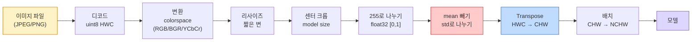
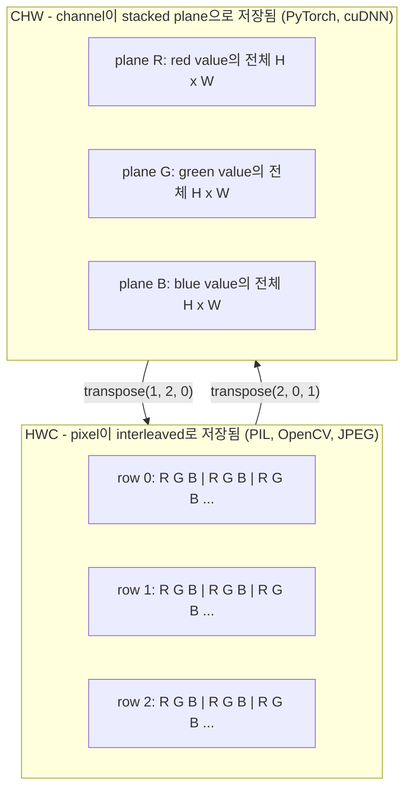

# 이미지 기초 - 픽셀, 채널, 색 공간

> 이미지는 빛 샘플의 텐서입니다. 앞으로 사용할 모든 비전 모델은 이 한 가지 사실에서 시작합니다.

**Type:** Build
**Languages:** Python
**Prerequisites:** Phase 1 Lesson 12 (Tensor Operations), Phase 3 Lesson 11 (Intro to PyTorch)
**Time:** ~45분

## 학습 목표

- 연속적인 장면이 픽셀로 이산화되는 과정을 설명하고, sampling/quantization 결정이 모든 downstream model의 상한을 정하는 이유를 설명합니다
- 이미지를 NumPy 배열로 읽고, slice하고, 검사하며 HWC와 CHW layout 사이를 능숙하게 전환합니다
- RGB, grayscale, HSV, YCbCr 사이를 변환하고 각 color space가 존재하는 이유를 정당화합니다
- torchvision이 기대하는 방식 그대로 pixel-level preprocessing(normalize, standardize, resize, channel-first)을 적용합니다

## 문제

앞으로 읽을 모든 논문, 내려받을 모든 pretrained weight, 호출할 모든 vision API는 입력의 특정 encoding을 가정합니다. 모델이 `float32`를 원하는 곳에 `uint8` 이미지를 넣어도 실행은 됩니다. 그리고 조용히 쓰레기 결과를 냅니다. RGB로 학습된 network에 BGR을 넣으면 정확도는 10포인트씩 무너집니다. channels-first를 기대하는 모델에 channels-last 입력을 주면 첫 conv layer가 height를 feature channel로 취급합니다. 이 중 어느 것도 오류를 던지지 않습니다. metric만 망가지고, 결국 파일을 불러온 방식에 숨어 있던 버그를 찾느라 일주일을 씁니다.

convolution은 무엇 위를 미끄러지는지 알면 복잡하지 않습니다. 어려운 부분은 "이미지"라는 말이 camera, JPEG decoder, PIL, OpenCV, torchvision, CUDA kernel에서 각각 다른 뜻을 가진다는 점입니다. 각 stack은 자기만의 axis order, byte range, channel convention을 갖습니다. 이것을 구분하지 못하는 vision engineer는 깨진 pipeline을 배포합니다.

이 lesson은 phase의 나머지가 그 위에 올라설 수 있도록 기초를 바로잡습니다. 끝까지 마치면 pixel이 무엇인지, 왜 pixel마다 숫자 하나가 아니라 세 개가 있는지, "ImageNet stats로 normalize"가 실제로 무엇을 하는지, 그리고 이 phase의 다른 lesson들이 가정할 두세 가지 layout 사이를 어떻게 오가는지 알게 됩니다.

## 개념

### 전체 preprocessing pipeline 한눈에 보기

모든 production vision system은 같은 reversible transform 순서입니다. 한 단계만 틀려도 모델은 학습 때 본 것과 다른 입력을 보게 됩니다.



빨간색과 파란색 두 box가 silent failure의 80%가 사는 곳입니다. missing standardization과 wrong layout입니다.

### 픽셀은 사각형이 아니라 샘플입니다

camera sensor는 작은 detector 격자에 떨어지는 photon을 셉니다. 각 detector는 짧은 시간 동안 빛을 적분하고, 부딪힌 photon 수에 비례하는 전압을 냅니다. sensor는 그 전압을 정수로 이산화합니다. detector 하나가 pixel 하나가 됩니다.

```text
연속 장면                         센서 격자                        디지털 이미지
(무한한 세부 정보)                (H x W detectors)               (H x W integers)

    ~~~~~                        +--+--+--+--+--+                 210 198 180 155 120
   ~   ~   ~                     |  |  |  |  |  |                 205 195 178 152 118
  ~ light ~      ---->           +--+--+--+--+--+     ---->       200 190 175 150 115
   ~~~~~                         |  |  |  |  |  |                 195 185 170 148 112
                                 +--+--+--+--+--+                 188 180 165 145 108
```

이 단계에서 두 가지 선택이 일어나며, 이 선택이 downstream의 모든 것에 대한 상한을 고정합니다.

- **Spatial sampling**은 장면의 각도당 detector를 몇 개 둘지 결정합니다. 너무 적으면 edge가 톱니처럼 됩니다(aliasing). 너무 많으면 storage와 compute가 폭발합니다.
- **Intensity quantization**은 전압을 얼마나 잘게 bucket으로 나눌지 결정합니다. 8 bits는 256 level을 제공하며 display 표준입니다. 10, 12, 16 bits는 더 부드러운 gradient를 제공하고 medical imaging, HDR, raw sensor pipeline에서 중요합니다.

pixel은 면적을 가진 색칠된 사각형이 아닙니다. 단일 측정값입니다. resize하거나 rotate할 때는 그 measurement grid를 resampling하는 것입니다.

### 왜 세 채널인가

detector 하나는 전체 가시광 spectrum에 걸친 photon을 셉니다. 이것이 grayscale입니다. 색을 얻기 위해 sensor는 격자를 red, green, blue filter의 mosaic으로 덮습니다. demosaicing 뒤에는 모든 spatial location마다 세 정수가 있습니다. 근처의 red-filtered detector, green-filtered detector, blue-filtered detector의 response입니다. 이 세 정수가 pixel의 RGB triplet입니다.

```text
메모리 안의 pixel 하나:

    (R, G, B) = (210, 140, 30)   <- reddish-orange

H x W RGB 이미지:

    shape (H, W, 3)     저장 방식   H rows of W pixels of 3 values
                                    uint8에서는 각각 [0, 255]
```

3이라는 숫자는 마법이 아닙니다. depth camera는 Z channel을 추가합니다. satellite는 infrared와 ultraviolet band를 추가합니다. medical scan은 보통 channel이 하나이거나(X-ray, CT) 많습니다(hyperspectral). channel 수는 마지막 axis입니다. conv layer는 그 축을 섞는 법을 배웁니다.

### 두 가지 layout convention: HWC와 CHW

같은 tensor지만 ordering은 두 가지입니다. 모든 library가 둘 중 하나를 고릅니다.

```text
HWC (height, width, channels)           CHW (channels, height, width)

   W ->                                    H ->
  +-----+-----+-----+                     +-----+-----+
H |R G B|R G B|R G B|                   C |R R R R R R|
| +-----+-----+-----+                   | +-----+-----+
v |R G B|R G B|R G B|                   v |G G G G G G|
  +-----+-----+-----+                     +-----+-----+
                                          |B B B B B B|
                                          +-----+-----+

   PIL, OpenCV, matplotlib,              PyTorch, 대부분의 deep learning
   디스크의 거의 모든 이미지 파일         framework, cuDNN kernel
```

CHW가 존재하는 이유는 convolution kernel이 H와 W 위를 미끄러지기 때문입니다. channel axis를 앞에 두면 각 kernel은 channel마다 contiguous 2D plane을 보게 되고, 이는 깔끔하게 vectorize됩니다. disk format은 sensor에서 scanline이 나오는 방식과 맞기 때문에 HWC를 유지합니다.

앞으로 천 번 입력하게 될 한 줄 변환입니다.

```text
img_chw = img_hwc.transpose(2, 0, 1)      # NumPy
img_chw = img_hwc.permute(2, 0, 1)        # PyTorch tensor
```

memory layout을 시각화하면 다음과 같습니다.



### Byte range와 dtype

세 가지 convention이 지배적입니다.

| Convention | dtype | Range | Where you see it |
|------------|-------|-------|------------------|
| Raw | `uint8` | [0, 255] | 디스크의 파일, PIL, OpenCV output |
| Normalized | `float32` | [0.0, 1.0] | `img.astype('float32') / 255` 이후 |
| Standardized | `float32` | 대략 [-2, +2] | mean을 빼고 std로 나눈 이후 |

convolutional network는 standardized input으로 학습되었습니다. ImageNet stats `mean=[0.485, 0.456, 0.406]`, `std=[0.229, 0.224, 0.225]`는 전체 ImageNet training set의 세 channel에 대한 산술 평균과 표준편차이며, [0, 1]로 normalized된 pixel에서 계산되었습니다. standardized float를 기대하는 모델에 raw `uint8`을 넣는 것은 applied vision에서 가장 흔한 silent failure입니다.

### Color space와 존재 이유

RGB는 capture format이지만 모델에 언제나 가장 유용한 representation은 아닙니다.

```text
 RGB               HSV                       YCbCr / YUV

 R red             H hue (angle 0-360)       Y luminance (brightness)
 G green           S saturation (0-1)        Cb chroma blue-yellow
 B blue            V value/brightness (0-1)  Cr chroma red-green

 sensor output에    color를 brightness와      brightness를 color와
 선형                분리합니다. color          분리합니다. JPEG와 대부분의
                    thresholding, UI slider,  video codec은 인간 눈이
                    simple filter에 유용       chroma detail보다 Y에 더
                                              민감하기 때문에 chroma channel을
                                              더 강하게 압축합니다.
```

대부분의 현대 CNN에는 RGB를 넣습니다. 다른 space는 다음 상황에서 만납니다.

- **HSV** - classical CV code, color-based segmentation, white-balancing.
- **YCbCr** - JPEG internals 읽기, video pipeline, Y에서만 동작하는 super-resolution model.
- **Grayscale** - OCR, document model, color가 signal이 아니라 nuisance variable인 모든 경우.

RGB에서 grayscale로 바꾸는 것은 평균이 아니라 weighted sum입니다. 인간 눈이 red나 blue보다 green에 더 민감하기 때문입니다.

```text
Y = 0.299 R + 0.587 G + 0.114 B       (ITU-R BT.601, the classic weights)
```

### Aspect ratio, resizing, interpolation

모든 모델에는 고정 input size가 있습니다(대부분의 ImageNet classifier는 224x224, 현대 detector는 384x384 또는 512x512). 실제 이미지는 거의 맞지 않습니다. 중요한 resize 선택지는 세 가지입니다.

- **Resize shorter side, then center crop** - 표준 ImageNet recipe입니다. aspect ratio를 보존하지만 edge pixel strip을 버립니다.
- **Resize and pad** - aspect ratio와 모든 pixel을 보존하고 black bar를 추가합니다. detection과 OCR의 표준입니다.
- **Resize directly to target** - 이미지를 늘립니다. 싸지만 geometry를 왜곡하며, 많은 classification task에는 괜찮습니다.

interpolation method는 새 grid가 기존 grid와 맞지 않을 때 중간 pixel을 어떻게 계산할지 결정합니다.

```text
Nearest neighbour     가장 빠름, blocky함, mask/label에는 유일한 선택
Bilinear              빠르고 부드러움, 대부분 image resizing의 기본값
Bicubic               더 느리지만 upscaling에서 더 선명함
Lanczos               가장 느리고 품질이 가장 좋음, final display에 사용
```

경험칙: training에는 bilinear, 직접 볼 asset에는 bicubic이나 lanczos, integer class ID를 포함하는 모든 것에는 nearest를 사용합니다.

```figure
conv-output-size
```

## 직접 만들기

### Step 1: 이미지를 불러와 shape 검사하기

Pillow로 임의의 JPEG 또는 PNG를 불러오고, NumPy로 변환한 뒤, 무엇을 얻었는지 출력합니다. offline에서 deterministic하게 실행되는 예제로는 이미지를 합성합니다.

```python
import numpy as np
from PIL import Image

def synthetic_rgb(h=128, w=192, seed=0):
    rng = np.random.default_rng(seed)
    yy, xx = np.meshgrid(np.linspace(0, 1, h), np.linspace(0, 1, w), indexing="ij")
    r = (np.sin(xx * 6) * 0.5 + 0.5) * 255
    g = yy * 255
    b = (1 - yy) * xx * 255
    rgb = np.stack([r, g, b], axis=-1) + rng.normal(0, 6, (h, w, 3))
    return np.clip(rgb, 0, 255).astype(np.uint8)

arr = synthetic_rgb()
# Or load from disk:
# arr = np.asarray(Image.open("your_image.jpg").convert("RGB"))

print(f"type:   {type(arr).__name__}")
print(f"dtype:  {arr.dtype}")
print(f"shape:  {arr.shape}     # (H, W, C)")
print(f"min:    {arr.min()}")
print(f"max:    {arr.max()}")
print(f"pixel at (0, 0): {arr[0, 0]}")
```

예상 output은 `shape: (H, W, 3)`, `dtype: uint8`, range `[0, 255]`입니다. byte가 camera, JPEG decoder, synthetic generator 중 어디에서 왔든 이것이 canonical on-disk representation입니다.

### Step 2: channel을 나누고 layout 재정렬하기

R, G, B를 따로 꺼낸 뒤 PyTorch를 위해 HWC에서 CHW로 변환합니다.

```python
R = arr[:, :, 0]
G = arr[:, :, 1]
B = arr[:, :, 2]
print(f"R shape: {R.shape}, mean: {R.mean():.1f}")
print(f"G shape: {G.shape}, mean: {G.mean():.1f}")
print(f"B shape: {B.shape}, mean: {B.mean():.1f}")

arr_chw = arr.transpose(2, 0, 1)
print(f"\nHWC shape: {arr.shape}")
print(f"CHW shape: {arr_chw.shape}")
```

channel마다 하나씩, 세 개의 grayscale plane입니다. CHW는 axis만 재정렬합니다. memory layout이 허용한다면 엄밀히는 data copy가 필요하지 않습니다.

### Step 3: Grayscale과 HSV 변환

weighted-sum grayscale을 만든 다음, RGB-to-HSV를 직접 구현합니다.

```python
def rgb_to_grayscale(rgb):
    weights = np.array([0.299, 0.587, 0.114], dtype=np.float32)
    return (rgb.astype(np.float32) @ weights).astype(np.uint8)

def rgb_to_hsv(rgb):
    rgb_f = rgb.astype(np.float32) / 255.0
    r, g, b = rgb_f[..., 0], rgb_f[..., 1], rgb_f[..., 2]
    cmax = np.max(rgb_f, axis=-1)
    cmin = np.min(rgb_f, axis=-1)
    delta = cmax - cmin

    h = np.zeros_like(cmax)
    mask = delta > 0
    rmax = mask & (cmax == r)
    gmax = mask & (cmax == g)
    bmax = mask & (cmax == b)
    h[rmax] = ((g[rmax] - b[rmax]) / delta[rmax]) % 6
    h[gmax] = ((b[gmax] - r[gmax]) / delta[gmax]) + 2
    h[bmax] = ((r[bmax] - g[bmax]) / delta[bmax]) + 4
    h = h * 60.0

    s = np.where(cmax > 0, delta / cmax, 0)
    v = cmax
    return np.stack([h, s, v], axis=-1)

gray = rgb_to_grayscale(arr)
hsv = rgb_to_hsv(arr)
print(f"gray shape: {gray.shape}, range: [{gray.min()}, {gray.max()}]")
print(f"hsv   shape: {hsv.shape}")
print(f"hue range: [{hsv[..., 0].min():.1f}, {hsv[..., 0].max():.1f}] degrees")
print(f"sat range: [{hsv[..., 1].min():.2f}, {hsv[..., 1].max():.2f}]")
print(f"val range: [{hsv[..., 2].min():.2f}, {hsv[..., 2].max():.2f}]")
```

Hue는 degree로 나오고, saturation과 value는 [0, 1] 범위입니다. 이는 OpenCV `hsv_full` convention과 일치합니다.

### Step 4: Normalize, standardize, 그리고 되돌리기

raw byte에서 pretrained ImageNet model이 기대하는 정확한 tensor로 갔다가 다시 되돌립니다.

```python
mean = np.array([0.485, 0.456, 0.406], dtype=np.float32)
std = np.array([0.229, 0.224, 0.225], dtype=np.float32)

def preprocess_imagenet(rgb_uint8):
    x = rgb_uint8.astype(np.float32) / 255.0
    x = (x - mean) / std
    x = x.transpose(2, 0, 1)
    return x

def deprocess_imagenet(chw_float32):
    x = chw_float32.transpose(1, 2, 0)
    x = x * std + mean
    x = np.clip(x * 255.0, 0, 255).astype(np.uint8)
    return x

x = preprocess_imagenet(arr)
print(f"preprocessed shape: {x.shape}     # (C, H, W)")
print(f"preprocessed dtype: {x.dtype}")
print(f"preprocessed mean per channel:  {x.mean(axis=(1, 2)).round(3)}")
print(f"preprocessed std  per channel:  {x.std(axis=(1, 2)).round(3)}")

roundtrip = deprocess_imagenet(x)
max_diff = np.abs(roundtrip.astype(int) - arr.astype(int)).max()
print(f"roundtrip max pixel diff: {max_diff}    # should be 0 or 1")
```

채널별 mean은 0에 가깝고 std는 1에 가까워야 합니다. preprocess/deprocess 쌍은 모든 torchvision `transforms.Normalize` 호출이 내부에서 정확히 수행하는 일입니다.

### Step 5: 세 가지 interpolation method로 resize하기

차이가 보이도록 upscale에서 nearest, bilinear, bicubic을 비교합니다.

```python
target = (arr.shape[0] * 3, arr.shape[1] * 3)

nearest = np.asarray(Image.fromarray(arr).resize(target[::-1], Image.NEAREST))
bilinear = np.asarray(Image.fromarray(arr).resize(target[::-1], Image.BILINEAR))
bicubic = np.asarray(Image.fromarray(arr).resize(target[::-1], Image.BICUBIC))

def local_roughness(x):
    gy = np.diff(x.astype(float), axis=0)
    gx = np.diff(x.astype(float), axis=1)
    return float(np.abs(gy).mean() + np.abs(gx).mean())

for name, out in [("nearest", nearest), ("bilinear", bilinear), ("bicubic", bicubic)]:
    print(f"{name:>8}  shape={out.shape}  roughness={local_roughness(out):6.2f}")
```

nearest는 hard edge를 유지하기 때문에 roughness 점수가 가장 높습니다. bilinear가 가장 부드럽습니다. bicubic은 그 사이에 있으며, stair-step artifact 없이 지각되는 선명도를 보존합니다.

## 사용하기

`torchvision.transforms`는 위의 모든 것을 하나의 composable pipeline으로 묶습니다. 아래 코드는 resize와 crop을 더해 `preprocess_imagenet`이 하는 일을 정확히 재현합니다.

```python
import torch
from torchvision import transforms
from PIL import Image

img = Image.fromarray(synthetic_rgb(256, 256))

pipeline = transforms.Compose([
    transforms.Resize(256),
    transforms.CenterCrop(224),
    transforms.ToTensor(),
    transforms.Normalize(mean=[0.485, 0.456, 0.406], std=[0.229, 0.224, 0.225]),
])

x = pipeline(img)
print(f"tensor type:  {type(x).__name__}")
print(f"tensor dtype: {x.dtype}")
print(f"tensor shape: {tuple(x.shape)}      # (C, H, W)")
print(f"per-channel mean: {x.mean(dim=(1, 2)).tolist()}")
print(f"per-channel std:  {x.std(dim=(1, 2)).tolist()}")

batch = x.unsqueeze(0)
print(f"\nbatched shape: {tuple(batch.shape)}   # (N, C, H, W) — ready for a model")
```

정확히 이 순서의 네 단계입니다. `Resize(256)`은 짧은 변을 256으로 scale합니다. `CenterCrop(224)`는 가운데에서 224x224 patch를 가져옵니다. `ToTensor()`는 255로 나누고 HWC를 CHW로 바꿉니다. `Normalize`는 ImageNet mean을 빼고 std로 나눕니다. 이 순서를 바꾸면 모델에 도달하는 것이 조용히 달라집니다.

## 결과물

이 lesson은 다음을 만듭니다.

- `outputs/prompt-vision-preprocessing-audit.md` - model card나 dataset card를 팀이 지켜야 할 정확한 preprocessing invariant checklist로 바꾸는 prompt입니다.
- `outputs/skill-image-tensor-inspector.md` - 이미지 형태의 tensor나 array가 주어지면 dtype, layout, range, raw/normalized/standardized처럼 보이는지 보고하는 skill입니다.

## 연습문제

1. **(Easy)** OpenCV(`cv2.imread`)와 Pillow로 JPEG를 불러오세요. 두 shape와 `(0, 0)`의 pixel을 출력하세요. channel-order 차이를 설명한 다음, OpenCV 배열을 Pillow 배열과 동일하게 만드는 한 줄 변환을 작성하세요.
2. **(Medium)** 임의의 uint8 image에서 함께 `roundtrip_max_diff <= 1` test를 통과하는 `standardize(img, mean, std)`와 그 inverse를 작성하세요. 함수는 같은 호출로 HWC의 단일 image와 NCHW의 batch 모두에서 동작해야 합니다.
3. **(Hard)** 3-channel ImageNet-standardized tensor를 가져와 RGB의 weighted mixture를 단일 grayscale channel로 학습하는 1x1 conv에 통과시키세요. weight를 `[0.299, 0.587, 0.114]`로 초기화하고 freeze한 뒤, output이 직접 만든 `rgb_to_grayscale`과 floating-point error 이내로 일치하는지 검증하세요. 다른 어떤 classical color-space transform을 1x1 convolution으로 쓸 수 있을까요?

## 핵심 용어

| 용어 | 사람들이 하는 말 | 실제 의미 |
|------|----------------|----------------------|
| Pixel | "색칠된 사각형" | 한 grid location에서의 빛 세기 sample 하나. color는 숫자 세 개, grayscale은 하나 |
| Channel | "색" | image tensor에 쌓인 parallel spatial grid 중 하나. HWC에서는 마지막 axis, CHW에서는 첫 axis |
| HWC / CHW | "shape" | image tensor의 axis ordering. disk와 PIL은 HWC를 쓰고, PyTorch와 cuDNN은 CHW를 씁니다 |
| Normalize | "이미지 scale 조정" | pixel이 [0, 1]에 있도록 255로 나누는 것. 필요하지만 충분하지는 않습니다 |
| Standardize | "zero-center" | input distribution이 모델이 학습한 것과 맞도록 channel마다 mean을 빼고 std로 나누는 것 |
| Grayscale conversion | "channel 평균" | 인간의 luminance perception과 맞는 계수 0.299/0.587/0.114를 쓰는 weighted sum |
| Interpolation | "resize가 pixel을 고르는 방식" | 새 grid가 기존 grid와 맞지 않을 때 output value를 결정하는 규칙. label에는 nearest, training에는 bilinear, display에는 bicubic |
| Aspect ratio | "width over height" | "resize and pad"와 "resize and stretch"를 구분하는 비율 |

## 더 읽을거리

- [Charles Poynton - A Guided Tour of Color Space](https://poynton.ca/PDFs/Guided_tour.pdf) - color space가 왜 그렇게 많고 각각이 언제 중요한지에 대한 가장 명확한 기술적 설명입니다
- [PyTorch Vision Transforms Docs](https://pytorch.org/vision/stable/transforms.html) - production에서 실제로 compose하게 될 transform의 전체 pipeline입니다
- [How JPEG Works (Colt McAnlis)](https://www.youtube.com/watch?v=F1kYBnY6mwg) - chroma subsampling, DCT, 그리고 JPEG가 RGB가 아니라 YCbCr을 encoding하는 이유를 보여 주는 날카로운 visual tour입니다
- [ImageNet Preprocessing Conventions (torchvision models)](https://pytorch.org/vision/stable/models.html) - `mean=[0.485, 0.456, 0.406]`의 source of truth이며, model zoo의 모든 모델이 왜 이를 기대하는지 설명합니다
