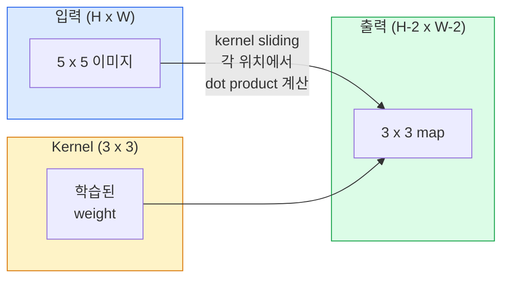
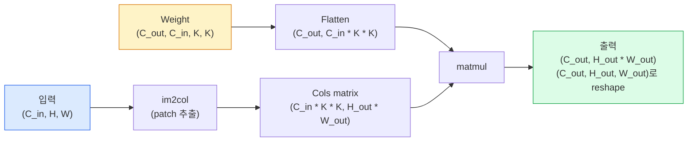

# 합성곱 처음부터 만들기

> convolution은 같은 weight를 모든 위치에서 공유하며 이미지 위를 미끄러지는 작은 dense layer입니다.

**Type:** Build
**Languages:** Python
**Prerequisites:** Phase 3 (Deep Learning Core), Phase 4 Lesson 01 (Image Fundamentals)
**Time:** ~75분

## 학습 목표

- nested-loop version과 vectorised `im2col` version을 포함해 NumPy만으로 2D convolution을 처음부터 구현합니다
- input size, kernel size, padding, stride의 어떤 조합에서도 output spatial size를 계산하고 `(H - K + 2P) / S + 1` 공식을 정당화합니다
- kernel(edge, blur, sharpen, Sobel)을 직접 설계하고 각 kernel이 왜 그런 activation pattern을 만드는지 설명합니다
- convolution을 feature extractor로 쌓고 stack depth를 receptive field 크기와 연결합니다

## 문제

224x224 RGB 이미지에 fully connected layer를 적용하면 neuron 하나마다 224 * 224 * 3 = 150,528개의 input weight가 필요합니다. unit이 1,000개인 hidden layer 하나만으로도 유용한 것을 배우기 전에 이미 1억 5천만 parameter가 됩니다. 더 나쁜 점은 그 layer가 왼쪽 위의 개와 오른쪽 아래의 개가 같은 pattern이라는 개념을 갖지 못한다는 것입니다. 모든 pixel position을 독립적인 것으로 취급하는데, 이는 이미지에는 정확히 틀린 가정입니다. 고양이를 세 pixel 옮겼다고 해서 network가 그 개념을 다시 배워야 해서는 안 됩니다.

image model에 필요한 두 속성은 **translation equivariance**(입력이 shift되면 출력도 shift됨)와 **parameter sharing**(같은 feature detector가 모든 곳에서 실행됨)입니다. dense layer는 둘 다 제공하지 않습니다. convolution은 둘 다 공짜로 제공합니다.

convolution은 deep learning을 위해 발명된 것이 아닙니다. JPEG compression, Photoshop의 Gaussian blur, industrial vision의 edge detection, 지금까지 배포된 모든 audio filter를 움직이는 것과 같은 operation입니다. CNN이 2012년부터 2020년까지 ImageNet을 지배한 이유는 convolution이 가까운 값들이 관련되어 있고 같은 pattern이 어디든 나타날 수 있는 data에 맞는 올바른 prior이기 때문입니다.

## 개념

### 하나의 kernel, sliding

2D convolution은 kernel(또는 filter)이라는 작은 weight matrix를 입력 위로 sliding하며, 각 위치에서 element-wise product의 합을 계산합니다. 그 합이 output pixel 하나가 됩니다.



5x5 input에 대한 구체적인 3x3 예시입니다(padding 없음, stride 1).

```text
Input X (5 x 5):                Kernel W (3 x 3):

  1  2  0  1  2                   1  0 -1
  0  1  3  1  0                   2  0 -2
  2  1  0  2  1                   1  0 -1
  1  0  2  1  3
  2  1  1  0  1

kernel은 모든 valid 3 x 3 window 위를 sliding합니다. Output Y는 3 x 3입니다.

 Y[0,0] = sum( W * X[0:3, 0:3] )
 Y[0,1] = sum( W * X[0:3, 1:4] )
 Y[0,2] = sum( W * X[0:3, 2:5] )
 Y[1,0] = sum( W * X[1:4, 0:3] )
 ... 이런 식입니다
```

그 하나의 공식, 즉 **shared weights, locality, sliding window**가 전체 아이디어입니다. 나머지는 bookkeeping입니다.

### Output size 공식

input spatial size `H`, kernel size `K`, padding `P`, stride `S`가 주어지면:

```text
H_out = floor( (H - K + 2P) / S ) + 1
```

이것을 외우세요. architecture 하나마다 수십 번 계산하게 됩니다.

| Scenario | H | K | P | S | H_out |
|----------|---|---|---|---|-------|
| Valid conv, padding 없음 | 32 | 3 | 0 | 1 | 30 |
| Same conv(size 보존) | 32 | 3 | 1 | 1 | 32 |
| 2배 downsample | 32 | 3 | 1 | 2 | 16 |
| Pool 2x2 | 32 | 2 | 0 | 2 | 16 |
| 큰 receptive field | 32 | 7 | 3 | 2 | 16 |

"Same padding"은 S == 1일 때 H_out == H가 되도록 P를 고르는 것을 뜻합니다. 홀수 K에서는 P = (K - 1) / 2입니다. 그래서 3x3 kernel이 지배적입니다. center를 가지는 가장 작은 홀수 kernel이기 때문입니다.

### Padding

padding이 없으면 모든 convolution이 feature map을 줄입니다. 20개를 쌓으면 224x224 image가 184x184가 되고, border의 compute를 낭비하며 matching shape가 필요한 residual connection을 복잡하게 만듭니다.

```text
5 x 5 input의 zero padding (P = 1):

  0  0  0  0  0  0  0
  0  1  2  0  1  2  0
  0  0  1  3  1  0  0
  0  2  1  0  2  1  0       이제 kernel은 pixel (0, 0)에
  0  1  0  2  1  3  0       center를 둘 수 있고, 그래도 곱할
  0  2  1  1  0  1  0       세 row와 세 column의 value를 가집니다.
  0  0  0  0  0  0  0
```

실무에서 만나는 mode는 `zero`(가장 흔함), `reflect`(edge를 mirror해 generative model에서 hard border를 피함), `replicate`(edge를 copy), `circular`(wrap around, toroidal problem에서 사용)입니다.

### Stride

stride는 slide의 step size입니다. `stride=1`이 기본값입니다. `stride=2`는 spatial dimension을 절반으로 줄이며, 별도 pooling layer 없이 CNN 내부에서 downsample하는 고전적인 방법입니다. 모든 현대 architecture(ResNet, ConvNeXt, MobileNet)는 어딘가에서 max-pool 대신 strided conv를 사용합니다.

```text
Stride 1 on a 5 x 5 input, 3 x 3 kernel:

  starts: (0,0) (0,1) (0,2)        -> output row 0
          (1,0) (1,1) (1,2)        -> output row 1
          (2,0) (2,1) (2,2)        -> output row 2

  Output: 3 x 3

Stride 2 on the same input:

  starts: (0,0) (0,2)              -> output row 0
          (2,0) (2,2)              -> output row 1

  Output: 2 x 2
```

### 여러 input channel

실제 이미지는 channel이 세 개입니다. RGB input에 대한 3x3 convolution은 실제로는 3x3x3 volume입니다. input channel마다 3x3 slice가 하나씩 있습니다. 각 spatial position에서 세 slice 전체에 대해 곱하고 더한 뒤 bias를 더합니다.

```text
Input:   (C_in,  H,  W)        3 x 5 x 5
Kernel:  (C_in,  K,  K)        3 x 3 x 3 (one kernel)
Output:  (1,     H', W')       2D map

For a layer that produces C_out output channels, you stack C_out kernels:

Weight:  (C_out, C_in, K, K)   e.g. 64 x 3 x 3 x 3
Output:  (C_out, H', W')       64 x 3 x 3

Parameter count: C_out * C_in * K * K + C_out   (+ C_out은 bias)
```

마지막 줄은 모델을 계획할 때 계산하게 될 식입니다. 3-channel input에 대한 64-channel 3x3 conv는 `64 * 3 * 3 * 3 + 64 = 1,792` parameter를 가집니다. 저렴합니다.

### im2col trick

nested loop는 읽기 쉽지만 느립니다. GPU는 큰 matrix multiply를 원합니다. trick은 input의 모든 receptive-field window를 큰 matrix의 column 하나로 flatten하고, kernel을 row로 flatten하는 것입니다. 그러면 전체 convolution이 단일 matmul이 됩니다.



모든 production conv 구현은 여기에 cache-tiling trick을 더한 어떤 변형입니다(direct conv, Winograd, 큰 kernel용 FFT conv). im2col을 이해하면 핵심을 이해한 것입니다.

### Receptive field

단일 3x3 conv는 input pixel 9개를 봅니다. 3x3 conv 두 개를 쌓으면 두 번째 layer의 neuron은 5x5 input pixel을 봅니다. 3x3 conv 세 개는 7x7을 줍니다. 일반적으로:

```text
RF after L stacked K x K convs (stride 1) = 1 + L * (K - 1)

With strides:   RF grows multiplicatively with stride along each layer.
```

"3x3 all the way down"이 동작하는 전체 이유(VGG, ResNet, ConvNeXt)는 3x3 conv 두 개가 5x5 conv 하나와 같은 input area를 보면서도 parameter가 더 적고, 사이에 추가 non-linearity가 있기 때문입니다.

```figure
convolution-kernel
```

## 직접 만들기

### Step 1: 배열 padding하기

가장 작은 primitive부터 시작합니다. H x W 배열 주변을 zero로 padding하는 함수입니다.

```python
import numpy as np

def pad2d(x, p):
    if p == 0:
        return x
    h, w = x.shape[-2:]
    out = np.zeros(x.shape[:-2] + (h + 2 * p, w + 2 * p), dtype=x.dtype)
    out[..., p:p + h, p:p + w] = x
    return out

x = np.arange(9).reshape(3, 3)
print(x)
print()
print(pad2d(x, 1))
```

trailing-axes trick인 `x.shape[:-2]` 덕분에 같은 함수가 수정 없이 `(H, W)`, `(C, H, W)`, `(N, C, H, W)`에서 동작합니다.

### Step 2: nested loop로 2D convolution 구현하기

reference implementation입니다. 느리지만 모호하지 않습니다. 원리적으로 `torch.nn.functional.conv2d`가 하는 일입니다.

```python
def conv2d_naive(x, w, b=None, stride=1, padding=0):
    c_in, h, w_in = x.shape
    c_out, c_in_w, kh, kw = w.shape
    assert c_in == c_in_w

    x_pad = pad2d(x, padding)
    h_out = (h + 2 * padding - kh) // stride + 1
    w_out = (w_in + 2 * padding - kw) // stride + 1

    out = np.zeros((c_out, h_out, w_out), dtype=np.float32)
    for oc in range(c_out):
        for i in range(h_out):
            for j in range(w_out):
                hs = i * stride
                ws = j * stride
                patch = x_pad[:, hs:hs + kh, ws:ws + kw]
                out[oc, i, j] = np.sum(patch * w[oc])
        if b is not None:
            out[oc] += b[oc]
    return out
```

네 겹 nested loop입니다(output channel, row, column, 그리고 C_in, kh, kw에 대한 implicit sum). 이것은 모든 더 빠른 구현을 검증할 ground truth입니다.

### Step 3: 직접 설계한 kernel로 검증하기

vertical Sobel kernel을 만들고 synthetic step image에 적용한 뒤 vertical edge가 밝아지는지 확인합니다.

```python
def synthetic_step_image():
    img = np.zeros((1, 16, 16), dtype=np.float32)
    img[:, :, 8:] = 1.0
    return img

sobel_x = np.array([
    [[-1, 0, 1],
     [-2, 0, 2],
     [-1, 0, 1]]
], dtype=np.float32)[None]

x = synthetic_step_image()
y = conv2d_naive(x, sobel_x, padding=1)
print(y[0].round(1))
```

column 7에서 큰 양수 값이 나오고(left-to-right brightness increase), 나머지는 모두 0이 나와야 합니다. 이 단일 출력이 수학이 맞는지 확인하는 sanity check입니다.

### Step 4: im2col

input의 모든 kernel-sized window를 matrix의 column 하나로 변환합니다. `C_in=3, K=3`이면 각 column은 숫자 27개입니다.

```python
def im2col(x, kh, kw, stride=1, padding=0):
    c_in, h, w = x.shape
    x_pad = pad2d(x, padding)
    h_out = (h + 2 * padding - kh) // stride + 1
    w_out = (w + 2 * padding - kw) // stride + 1

    cols = np.zeros((c_in * kh * kw, h_out * w_out), dtype=x.dtype)
    col = 0
    for i in range(h_out):
        for j in range(w_out):
            hs = i * stride
            ws = j * stride
            patch = x_pad[:, hs:hs + kh, ws:ws + kw]
            cols[:, col] = patch.reshape(-1)
            col += 1
    return cols, h_out, w_out
```

여전히 Python loop이지만, 이제 무거운 작업은 단일 vectorised matmul이 됩니다.

### Step 5: im2col + matmul로 빠른 conv 만들기

네 겹 loop를 하나의 matrix multiplication으로 대체합니다.

```python
def conv2d_im2col(x, w, b=None, stride=1, padding=0):
    c_out, c_in, kh, kw = w.shape
    cols, h_out, w_out = im2col(x, kh, kw, stride, padding)
    w_flat = w.reshape(c_out, -1)
    out = w_flat @ cols
    if b is not None:
        out += b[:, None]
    return out.reshape(c_out, h_out, w_out)
```

correctness check입니다. 두 구현을 모두 실행하고 비교합니다.

```python
rng = np.random.default_rng(0)
x = rng.normal(0, 1, (3, 16, 16)).astype(np.float32)
w = rng.normal(0, 1, (8, 3, 3, 3)).astype(np.float32)
b = rng.normal(0, 1, (8,)).astype(np.float32)

y_naive = conv2d_naive(x, w, b, padding=1)
y_im2col = conv2d_im2col(x, w, b, padding=1)

print(f"max abs diff: {np.max(np.abs(y_naive - y_im2col)):.2e}")
```

`max abs diff`는 `1e-5` 근처여야 합니다. 차이는 bug가 아니라 floating-point accumulation order 때문입니다.

### Step 6: 직접 설계한 kernel bank

training 전에도 단일 conv layer가 무엇을 표현할 수 있는지 보여 주는 다섯 filter입니다.

```python
KERNELS = {
    "identity": np.array([[0, 0, 0], [0, 1, 0], [0, 0, 0]], dtype=np.float32),
    "blur_3x3": np.ones((3, 3), dtype=np.float32) / 9.0,
    "sharpen": np.array([[0, -1, 0], [-1, 5, -1], [0, -1, 0]], dtype=np.float32),
    "sobel_x": np.array([[-1, 0, 1], [-2, 0, 2], [-1, 0, 1]], dtype=np.float32),
    "sobel_y": np.array([[-1, -2, -1], [0, 0, 0], [1, 2, 1]], dtype=np.float32),
}

def apply_kernel(img2d, kernel):
    x = img2d[None].astype(np.float32)
    w = kernel[None, None]
    return conv2d_im2col(x, w, padding=1)[0]
```

임의의 grayscale image에 적용하면 blur는 부드럽게 만들고, sharpen은 edge를 또렷하게 만들고, Sobel-x는 vertical edge를 밝히고, Sobel-y는 horizontal edge를 밝힙니다. 이것들은 AlexNet과 VGG의 *첫 번째* 학습된 conv layer가 결국 배운 pattern과 정확히 같습니다. 좋은 image model은 이후 task가 무엇이든 edge detector와 blob detector가 필요하기 때문입니다.

## 사용하기

PyTorch의 `nn.Conv2d`는 같은 operation을 autograd, CUDA kernel, cuDNN optimization으로 감쌉니다. shape semantics는 동일합니다.

```python
import torch
import torch.nn as nn

conv = nn.Conv2d(in_channels=3, out_channels=64, kernel_size=3, stride=1, padding=1)
print(conv)
print(f"weight shape: {tuple(conv.weight.shape)}   # (C_out, C_in, K, K)")
print(f"bias shape:   {tuple(conv.bias.shape)}")
print(f"param count:  {sum(p.numel() for p in conv.parameters())}")

x = torch.randn(8, 3, 224, 224)
y = conv(x)
print(f"\ninput  shape: {tuple(x.shape)}")
print(f"output shape: {tuple(y.shape)}")
```

`padding=1`을 `padding=0`으로 바꾸면 output은 222x222로 줄어듭니다. `stride=1`을 `stride=2`로 바꾸면 112x112로 줄어듭니다. 위에서 외운 것과 같은 공식입니다.

## 결과물

이 lesson은 다음을 만듭니다.

- `outputs/prompt-cnn-architect.md` - input size, parameter budget, target receptive field가 주어지면 모든 step에서 올바른 K/S/P를 갖는 `Conv2d` layer stack을 설계하는 prompt입니다.
- `outputs/skill-conv-shape-calculator.md` - network spec을 layer별로 따라가며 모든 block의 output shape, receptive field, parameter count를 반환하는 skill입니다.

## 연습문제

1. **(Easy)** 128x128 grayscale input과 `[Conv3x3(s=1,p=1), Conv3x3(s=2,p=1), Conv3x3(s=1,p=1), Conv3x3(s=2,p=1)]` stack이 주어졌을 때 각 layer의 output spatial size와 receptive field를 손으로 계산하세요. dummy conv로 만든 PyTorch `nn.Sequential`로 검증하세요.
2. **(Medium)** `conv2d_naive`와 `conv2d_im2col`이 `groups` argument를 받도록 확장하세요. `groups=C_in=C_out`이 depthwise convolution을 재현하고, parameter count가 `C * C * K * K`가 아니라 `C * K * K`임을 보이세요.
3. **(Hard)** `conv2d_im2col`의 backward pass를 직접 구현하세요. output의 gradient가 주어졌을 때 `x`와 `w`의 gradient를 계산합니다. 같은 input과 weight에서 `torch.autograd.grad`와 비교해 검증하세요. trick은 im2col의 gradient가 `col2im`이며, overlapping window를 누적해야 한다는 점입니다.

## 핵심 용어

| 용어 | 사람들이 하는 말 | 실제 의미 |
|------|----------------|----------------------|
| Convolution | "filter를 sliding" | shared weight를 사용해 모든 spatial location에 적용되는 learnable dot product. 수학적으로는 cross-correlation이지만 모두 convolution이라고 부릅니다 |
| Kernel / filter | "feature detector" | shape (C_in, K, K)의 작은 weight tensor. input window와의 dot product가 output pixel 하나를 만듭니다 |
| Stride | "얼마나 멀리 jump하는가" | 연속적인 kernel placement 사이의 step size. stride 2는 각 spatial dimension을 절반으로 줄입니다 |
| Padding | "edge의 zero" | kernel이 border pixel에 center를 둘 수 있도록 input 주변에 추가하는 값. `same` padding은 output size를 input size와 같게 유지합니다 |
| Receptive field | "neuron이 얼마나 보는가" | 특정 output activation이 의존하는 original input의 patch. depth와 stride에 따라 커집니다 |
| im2col | "GEMM trick" | convolution이 하나의 큰 matrix multiply가 되도록 모든 receptive window를 column으로 재배열하는 것. 모든 빠른 conv kernel의 핵심입니다 |
| Depthwise conv | "channel당 kernel 하나" | `groups == C_in`인 conv. 각 output channel을 matching input channel 하나에서만 계산합니다. MobileNet과 ConvNeXt의 backbone입니다 |
| Translation equivariance | "shift in, shift out" | input을 k pixel shift하면 output도 k pixel shift되는 성질. shared weight 덕분에 공짜로 얻습니다 |

## 더 읽을거리

- [A guide to convolution arithmetic for deep learning (Dumoulin & Visin, 2016)](https://arxiv.org/abs/1603.07285) - 모든 course가 조용히 베끼는 padding/stride/dilation의 결정적 diagram입니다
- [CS231n: Convolutional Neural Networks for Visual Recognition](https://cs231n.github.io/convolutional-networks/) - 원래의 im2col 설명을 포함한 canonical lecture notes입니다
- [The Annotated ConvNet (fast.ai)](https://nbviewer.org/github/fastai/fastbook/blob/master/13_convolutions.ipynb) - manual convolution에서 학습된 digit classifier까지 따라가는 notebook입니다
- [Receptive Field Arithmetic for CNNs (Dang Ha The Hien)](https://distill.pub/2019/computing-receptive-fields/) - receptive field 계산에 대한 paper-quality interactive explainer입니다
