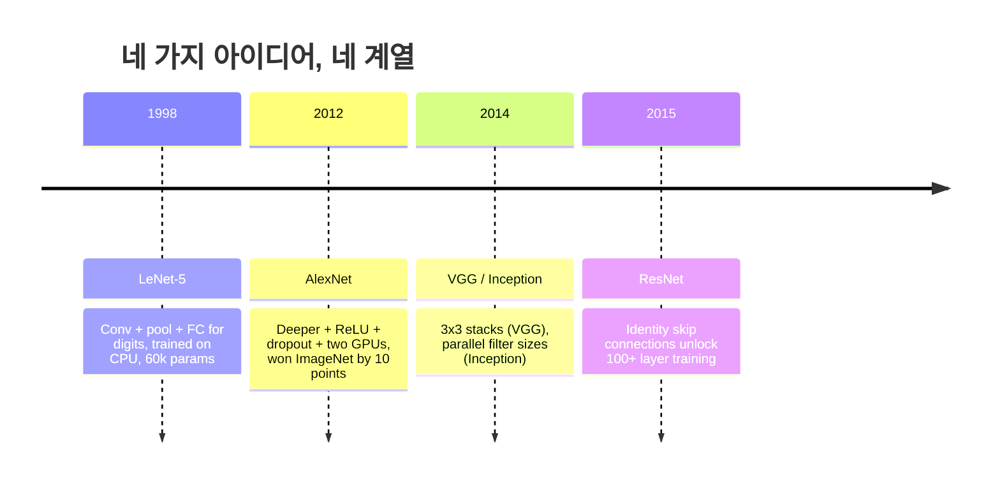
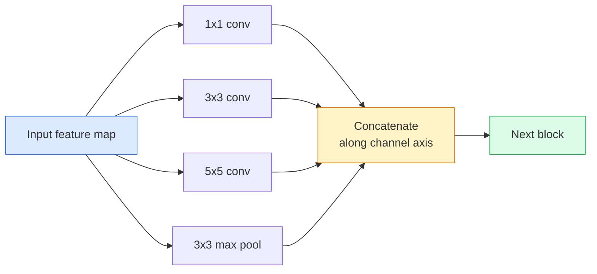
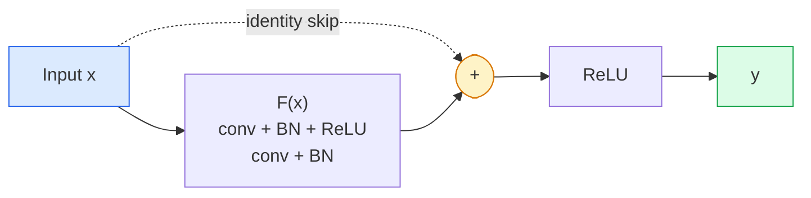

# CNN — LeNet에서 ResNet까지

> 지난 30년의 주요 CNN은 모두 conv-nonlinearity-downsample 레시피에 새로운 아이디어 하나를 붙인 형태입니다. 그 아이디어들을 순서대로 배웁니다.

**Type:** Learn + Build
**Languages:** Python
**Prerequisites:** Phase 3 Lesson 11 (PyTorch), Phase 4 Lesson 01 (Image Fundamentals), Phase 4 Lesson 02 (Convolutions from Scratch)
**Time:** ~75 minutes

## 학습 목표

- LeNet-5 -> AlexNet -> VGG -> Inception -> ResNet의 아키텍처 계보를 추적하고 각 계열이 기여한 단일 새 아이디어를 말한다
- PyTorch로 LeNet-5, VGG-style block, ResNet BasicBlock을 각각 40줄 미만으로 구현한다
- 잔차 연결이 1,000층 네트워크를 학습 불가능한 모델에서 state-of-the-art로 바꾸는 이유를 설명한다
- 최신 backbone(ResNet-18, ResNet-50)을 읽고 source를 보기 전에 output shape, receptive field, parameter count를 예측한다

## 문제

2011년 최고의 ImageNet classifier는 top-5 accuracy가 약 74%였습니다. 2012년 AlexNet은 85%를 기록했습니다. 2015년 ResNet은 96%를 기록했습니다. 새 데이터도 없었고, 새 GPU 세대도 없었습니다. 향상은 아키텍처 아이디어에서 나왔습니다. 실무 비전 엔지니어는 어떤 아이디어가 어떤 논문에서 왔는지 알아야 합니다. 2026년에 production에 배포하는 모든 backbone은 같은 조각들의 재조합이기 때문이며, 그 아이디어들이 계속 다른 곳으로 옮겨가기 때문입니다. grouped convs는 CNN에서 transformer로 갔고, residual connections는 ResNet에서 존재하는 모든 LLM으로 갔으며, batch normalisation은 diffusion model 안에 살아 있습니다.

이 네트워크들을 순서대로 공부하면 흔한 실수도 피할 수 있습니다. LeNet 크기의 네트워크로도 해결될 문제에 가장 큰 가용 모델을 집어 드는 실수입니다. 각 계열의 scaling curve를 알면 그 곡선의 어디에 앉아야 하는지 알 수 있습니다.

## 개념

### 비전을 바꾼 네 가지 아이디어



고전 비전에서 이 네 번의 도약만큼 중요했던 것은 없습니다.

### LeNet-5 (1998)

Yann LeCun의 digit recogniser입니다. 60,000개 파라미터. 두 개의 conv-pool block, 두 개의 fully connected layer, tanh activation. 모든 CNN이 물려받는 template을 정의했습니다.

```text
input (1, 32, 32)
  conv 5x5 -> (6, 28, 28)
  avg pool 2x2 -> (6, 14, 14)
  conv 5x5 -> (16, 10, 10)
  avg pool 2x2 -> (16, 5, 5)
  flatten -> 400
  dense -> 120
  dense -> 84
  dense -> 10
```

현대 세계가 CNN이라고 부르는 모든 것, 즉 convolution과 downsampling을 번갈아 적용해 작은 classifier head로 넘기는 구조는 layer가 더 많고 channel이 더 크고 activation이 더 나은 LeNet입니다.

### AlexNet (2012)

세 가지 변화가 합쳐져 ImageNet을 깼습니다.

1. tanh 대신 **ReLU**. 그래디언트가 사라지는 일이 줄었습니다. 학습이 여섯 배 빨라졌습니다.
2. fully connected head의 **Dropout**. 정규화가 trick이 아니라 layer가 되었습니다.
3. **Depth와 width**. 다섯 conv layer, 세 dense layer, 60M 파라미터를 두 GPU에 model을 나눠 학습했습니다.

논문의 Figure 2는 여전히 GPU split을 두 개의 parallel stream으로 보여줍니다. 그 병렬성은 하드웨어 workaround였지 아키텍처 통찰은 아니었습니다. 하지만 위의 세 아이디어는 여전히 당신이 쓰는 모든 모델 안에 있습니다.

### VGG (2014)

VGG는 이렇게 물었습니다. 3x3 convolution만 쓰고 깊게 가면 어떻게 될까?

```text
stack:   conv 3x3 -> conv 3x3 -> pool 2x2
repeat:  16 or 19 conv layers
```

두 개의 3x3 conv는 하나의 5x5 conv와 같은 5x5 입력 영역을 보지만 파라미터는 더 적고(2*9*C^2 = 18C^2 vs 25*C^2), 중간에 ReLU가 하나 더 있습니다. VGG는 이 관찰을 전체 아키텍처로 바꾸었습니다. 하나의 block type을 반복하는 단순함 덕분에 이후 모든 것의 기준점이 되었습니다.

비용: 138M 파라미터, 느린 학습, 비싼 inference.

### Inception (2014, 같은 해)

"어떤 kernel size를 써야 하지?"에 대한 Google의 답은 "전부, 병렬로"였습니다.



각 branch는 특화됩니다. 1x1은 channel mixing, 3x3은 local texture, 5x5는 더 큰 pattern, pooling은 shift-invariant features를 맡습니다. concat은 다음 layer가 유용한 branch를 고르게 합니다. Inception v1은 parameter count를 정상 범위로 유지하기 위해 각 branch 안에 bottleneck으로 1x1 convolution을 사용했습니다.

### 열화 문제

2015년에는 VGG-19는 작동했지만 VGG-32는 작동하지 않았습니다. 깊이는 도움이 되어야 했지만, ~20층을 넘으면 training loss와 test loss가 모두 나빠졌습니다. 이것은 overfitting이 아닙니다. 그래디언트가 모든 layer를 지나며 곱셈으로 줄어들기 때문에 optimizer가 유용한 weight를 찾지 못하는 것입니다.

```text
Plain deep network:
  y = f_L( f_{L-1}( ... f_1(x) ... ) )

Gradient wrt early layer:
  dL/dW_1 = dL/dy * df_L/df_{L-1} * ... * df_2/df_1 * df_1/dW_1

Each multiplicative term has magnitude roughly (weight magnitude) * (activation gain).
Stack 100 of them with gains < 1 and the gradient is effectively zero.
```

VGG가 19층에서 작동한 이유는 동시에 발표된 batch norm이 activation을 잘 scale된 상태로 유지했기 때문입니다. 하지만 batch norm조차도 30층 남짓을 넘어서는 깊이는 구하지 못했습니다.

### ResNet (2015)

He, Zhang, Ren, Sun은 모든 것을 고친 하나의 변화를 제안했습니다.

```text
standard block:   y = F(x)
residual block:   y = F(x) + x
```

`+ x`는 layer가 `F(x)`를 0으로 몰아 언제든 아무것도 하지 않도록 선택할 수 있음을 뜻합니다. 이제 1,000층 ResNet도 최악의 경우 1층 네트워크만큼만 나쁩니다. 모든 추가 block에 사소한 탈출구가 있기 때문입니다. 이 보장이 있으면 optimizer는 모든 block을 *조금씩* 유용하게 만들려 합니다. 그리고 조금씩 유용한 block을 100번 쌓으면 state-of-the-art가 됩니다.



block의 두 변형은 어디서나 보입니다.

- **BasicBlock** (ResNet-18, ResNet-34): 두 개의 3x3 conv, 둘을 감싸는 skip.
- **Bottleneck** (ResNet-50, -101, -152): 1x1 down, 3x3 middle, 1x1 up, 세 개를 감싸는 skip. channel count가 클 때 더 저렴합니다.

skip이 downsample(stride=2)을 건너야 할 때 identity path는 shape를 맞추기 위해 1x1 stride=2 conv로 대체됩니다.

### 잔차가 비전 너머에서 중요한 이유

이 아이디어는 사실 image classification에 관한 것이 아니었습니다. 깊은 네트워크를 "그래디언트가 살아남기를 바라며 손가락을 꼬는" 대상에서 신뢰할 수 있고 확장 가능한 엔지니어링 도구로 바꾸는 것이었습니다. 다음 phase에서 읽을 모든 transformer는 모든 block에 정확히 같은 skip connection을 갖고 있습니다. ResNet이 없었다면 GPT도 없습니다.

```figure
pooling
```

## 직접 만들기

### 1단계: LeNet-5

최소한의 충실한 LeNet입니다. Tanh activation, average pooling. 현대성을 위해 양보한 유일한 점은 원래 Gaussian connections 대신 downstream에서 `nn.CrossEntropyLoss`를 쓴다는 것입니다.

```python
import torch
import torch.nn as nn
import torch.nn.functional as F

class LeNet5(nn.Module):
    def __init__(self, num_classes=10):
        super().__init__()
        self.conv1 = nn.Conv2d(1, 6, kernel_size=5)
        self.conv2 = nn.Conv2d(6, 16, kernel_size=5)
        self.pool = nn.AvgPool2d(2)
        self.fc1 = nn.Linear(16 * 5 * 5, 120)
        self.fc2 = nn.Linear(120, 84)
        self.fc3 = nn.Linear(84, num_classes)

    def forward(self, x):
        x = self.pool(torch.tanh(self.conv1(x)))
        x = self.pool(torch.tanh(self.conv2(x)))
        x = torch.flatten(x, 1)
        x = torch.tanh(self.fc1(x))
        x = torch.tanh(self.fc2(x))
        return self.fc3(x)

net = LeNet5()
x = torch.randn(1, 1, 32, 32)
print(f"output: {net(x).shape}")
print(f"params: {sum(p.numel() for p in net.parameters()):,}")
```

예상 출력: `output: torch.Size([1, 10])`, `params: 61,706`. 이것이 현대 비전을 시작한 전체 digit classifier입니다.

### 2단계: VGG block

하나의 재사용 가능한 block: 두 개의 3x3 conv, ReLU, batch norm, max pool.

```python
class VGGBlock(nn.Module):
    def __init__(self, in_c, out_c):
        super().__init__()
        self.conv1 = nn.Conv2d(in_c, out_c, kernel_size=3, padding=1)
        self.bn1 = nn.BatchNorm2d(out_c)
        self.conv2 = nn.Conv2d(out_c, out_c, kernel_size=3, padding=1)
        self.bn2 = nn.BatchNorm2d(out_c)
        self.pool = nn.MaxPool2d(2)

    def forward(self, x):
        x = F.relu(self.bn1(self.conv1(x)))
        x = F.relu(self.bn2(self.conv2(x)))
        return self.pool(x)

class MiniVGG(nn.Module):
    def __init__(self, num_classes=10):
        super().__init__()
        self.stack = nn.Sequential(
            VGGBlock(3, 32),
            VGGBlock(32, 64),
            VGGBlock(64, 128),
        )
        self.head = nn.Sequential(
            nn.AdaptiveAvgPool2d(1),
            nn.Flatten(),
            nn.Linear(128, num_classes),
        )

    def forward(self, x):
        return self.head(self.stack(x))

net = MiniVGG()
x = torch.randn(1, 3, 32, 32)
print(f"output: {net(x).shape}")
print(f"params: {sum(p.numel() for p in net.parameters()):,}")
```

CIFAR 크기 입력에 VGG block 세 개, adaptive pool 하나, linear layer 하나. 약 290k 파라미터. CIFAR-10에는 충분합니다.

### 3단계: ResNet BasicBlock

ResNet-18과 ResNet-34의 핵심 building block입니다.

```python
class BasicBlock(nn.Module):
    def __init__(self, in_c, out_c, stride=1):
        super().__init__()
        self.conv1 = nn.Conv2d(in_c, out_c, kernel_size=3, stride=stride, padding=1, bias=False)
        self.bn1 = nn.BatchNorm2d(out_c)
        self.conv2 = nn.Conv2d(out_c, out_c, kernel_size=3, stride=1, padding=1, bias=False)
        self.bn2 = nn.BatchNorm2d(out_c)
        if stride != 1 or in_c != out_c:
            self.shortcut = nn.Sequential(
                nn.Conv2d(in_c, out_c, kernel_size=1, stride=stride, bias=False),
                nn.BatchNorm2d(out_c),
            )
        else:
            self.shortcut = nn.Identity()

    def forward(self, x):
        out = F.relu(self.bn1(self.conv1(x)))
        out = self.bn2(self.conv2(out))
        out = out + self.shortcut(x)
        return F.relu(out)
```

conv layer의 `bias=False`는 batch-norm convention입니다. BN의 beta parameter가 이미 bias를 처리하므로 conv bias까지 들고 있는 것은 낭비입니다. `shortcut`은 stride나 channel count가 바뀔 때만 실제 conv가 필요합니다. 그렇지 않으면 no-op identity입니다.

### 4단계: 작은 ResNet

BasicBlock group 네 개를 쌓아 CIFAR 크기 입력에서 작동하는 ResNet을 만듭니다.

```python
class TinyResNet(nn.Module):
    def __init__(self, num_classes=10):
        super().__init__()
        self.stem = nn.Sequential(
            nn.Conv2d(3, 32, kernel_size=3, stride=1, padding=1, bias=False),
            nn.BatchNorm2d(32),
            nn.ReLU(inplace=True),
        )
        self.layer1 = self._make_group(32, 32, num_blocks=2, stride=1)
        self.layer2 = self._make_group(32, 64, num_blocks=2, stride=2)
        self.layer3 = self._make_group(64, 128, num_blocks=2, stride=2)
        self.layer4 = self._make_group(128, 256, num_blocks=2, stride=2)
        self.head = nn.Sequential(
            nn.AdaptiveAvgPool2d(1),
            nn.Flatten(),
            nn.Linear(256, num_classes),
        )

    def _make_group(self, in_c, out_c, num_blocks, stride):
        blocks = [BasicBlock(in_c, out_c, stride=stride)]
        for _ in range(num_blocks - 1):
            blocks.append(BasicBlock(out_c, out_c, stride=1))
        return nn.Sequential(*blocks)

    def forward(self, x):
        x = self.stem(x)
        x = self.layer1(x)
        x = self.layer2(x)
        x = self.layer3(x)
        x = self.layer4(x)
        return self.head(x)

net = TinyResNet()
x = torch.randn(1, 3, 32, 32)
print(f"output: {net(x).shape}")
print(f"params: {sum(p.numel() for p in net.parameters()):,}")
```

각각 두 block으로 된 group 네 개입니다. group 2, 3, 4의 시작에서 stride 2를 사용합니다. downsample마다 channel count가 두 배가 됩니다. 대략 2.8M 파라미터. 이것이 ResNet-152까지 깔끔하게 확장되는 표준 recipe입니다.

### 5단계: Parameter-to-feature efficiency 비교

같은 input을 세 network에 통과시키고 parameter count를 비교합니다.

```python
def summary(name, net, x):
    y = net(x)
    params = sum(p.numel() for p in net.parameters())
    print(f"{name:12s}  input {tuple(x.shape)} -> output {tuple(y.shape)}  params {params:>10,}")

x = torch.randn(1, 3, 32, 32)
summary("LeNet5",     LeNet5(),       torch.randn(1, 1, 32, 32))
summary("MiniVGG",    MiniVGG(),      x)
summary("TinyResNet", TinyResNet(),   x)
```

세 모델, 세 시대, parameter count 세 자릿수 차이. CIFAR-10 accuracy 기준으로 몇 epoch 학습 후 대략 LeNet 60%, MiniVGG 89%, TinyResNet 93%가 필요합니다.

## 사용하기

`torchvision.models`는 위 모든 모델의 pretrained version을 제공합니다. 계열이 달라도 call signature가 동일한데, 이것이 바로 backbone abstraction의 핵심입니다.

```python
from torchvision.models import resnet18, ResNet18_Weights, vgg16, VGG16_Weights

r18 = resnet18(weights=ResNet18_Weights.IMAGENET1K_V1)
r18.eval()

print(f"ResNet-18 params: {sum(p.numel() for p in r18.parameters()):,}")
print(r18.layer1[0])
print()

v16 = vgg16(weights=VGG16_Weights.IMAGENET1K_V1)
v16.eval()
print(f"VGG-16   params: {sum(p.numel() for p in v16.parameters()):,}")
```

ResNet-18은 11.7M 파라미터를 가집니다. VGG-16은 138M입니다. ImageNet top-1 accuracy는 비슷합니다(69.8% vs 71.6%). 잔차 연결은 12배의 parameter efficiency 이득을 줍니다. 그래서 ResNet variant가 ViT가 2021년에 등장하기 전까지 2016년부터 지배했고, compute가 제약인 real-world deployment에서는 여전히 지배합니다.

Transfer learning의 recipe는 항상 같습니다. pretrained를 load하고, backbone을 freeze하고, classifier head를 교체합니다.

```python
for p in r18.parameters():
    p.requires_grad = False
r18.fc = nn.Linear(r18.fc.in_features, 10)
```

세 줄입니다. 이제 ImageNet이 값을 치른 representation을 물려받은 10-class CIFAR classifier가 생겼습니다.

## 출시하기

이 lesson은 다음을 만듭니다.

- `outputs/prompt-backbone-selector.md` — task, dataset size, compute budget이 주어졌을 때 올바른 CNN family(LeNet/VGG/ResNet/MobileNet/ConvNeXt)를 고르는 prompt.
- `outputs/skill-residual-block-reviewer.md` — PyTorch module을 읽고 skip-connection mistakes(stride change에서 shortcut 누락, shortcut activation order, addition 대비 BN placement)를 flag하는 skill.

## 연습 문제

1. **(Easy)** `TinyResNet`의 parameter를 layer별로 손으로 세어 보세요. `sum(p.numel() for p in net.parameters())`와 비교하세요. parameter budget의 대부분은 어디로 가나요? conv, BN, classifier head 중 무엇인가요?
2. **(Medium)** Bottleneck block(1x1 -> 3x3 -> 1x1 with skip)을 구현하고 CIFAR용 ResNet-50-style network를 만드는 데 사용하세요. `TinyResNet`과 params를 비교하세요.
3. **(Hard)** `BasicBlock`에서 skip connection을 제거하고, 34-block "plain" network와 34-block ResNet을 CIFAR-10에서 각각 10 epoch 학습하세요. 둘의 training loss vs epoch를 plot하세요. plain deep network가 더 얕은 twin보다 높은 loss로 수렴하는 He et al. Figure 1 결과를 재현하세요.

## 핵심 용어

| 용어 | 사람들이 하는 말 | 실제 의미 |
|------|----------------|-----------|
| Backbone | "The model" | task head에 공급되는 feature map을 만드는 convolutional block stack |
| Residual connection | "Skip connection" | `y = F(x) + x`; F를 0으로 설정해 optimizer가 identity를 학습할 수 있게 하므로 임의의 깊이를 학습 가능하게 만듦 |
| BasicBlock | "Two 3x3 convs with a skip" | ResNet-18/34 building block: conv-BN-ReLU-conv-BN-add-ReLU |
| Bottleneck | "1x1 down, 3x3, 1x1 up" | ResNet-50/101/152 block; 3x3이 줄어든 width에서 실행되므로 channel count가 높을 때 저렴함 |
| Degradation problem | "Deeper is worse" | ~20개의 plain conv layer를 넘으면 training error와 test error가 모두 증가하는 현상. 더 많은 data가 아니라 residual connections로 해결됨 |
| Stem | "The first layer" | 3-channel input을 base feature width로 바꾸는 initial conv. 보통 ImageNet은 7x7 stride 2, CIFAR는 3x3 stride 1 |
| Head | "The classifier" | final backbone block 뒤의 layers: adaptive pool, flatten, linear(s) |
| Transfer learning | "Pretrained weights" | ImageNet에서 학습된 backbone을 load하고 내 task에서는 head만 fine-tuning하는 것 |

## 더 읽을거리

- [Deep Residual Learning for Image Recognition (He et al., 2015)](https://arxiv.org/abs/1512.03385) — ResNet 논문. 모든 figure를 공부할 가치가 있습니다
- [Very Deep Convolutional Networks (Simonyan & Zisserman, 2014)](https://arxiv.org/abs/1409.1556) — VGG 논문. "why 3x3"에 대한 여전히 최고의 reference입니다
- [ImageNet Classification with Deep CNNs (Krizhevsky et al., 2012)](https://papers.nips.cc/paper_files/paper/2012/hash/c399862d3b9d6b76c8436e924a68c45b-Abstract.html) — AlexNet. hand-crafted-feature 시대를 끝낸 논문입니다
- [Going Deeper with Convolutions (Szegedy et al., 2014)](https://arxiv.org/abs/1409.4842) — Inception v1. vision transformer에도 여전히 나타나는 parallel-filter idea입니다
