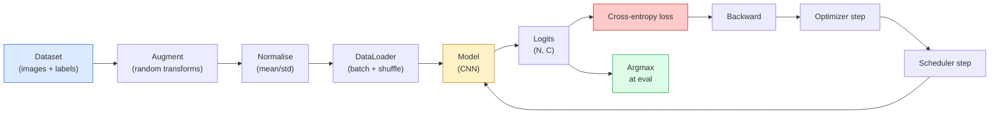

# 이미지 분류

> classifier는 pixels에서 classes 위의 probability distribution으로 가는 함수입니다. 나머지는 모두 배관입니다.

**Type:** Build
**Languages:** Python
**Prerequisites:** Phase 2 Lesson 09 (Model Evaluation), Phase 3 Lesson 10 (Mini Framework), Phase 4 Lesson 03 (CNNs)
**Time:** ~75 minutes

## 학습 목표

- CIFAR-10에서 end-to-end image classification pipeline(dataset, augmentation, model, training loop, evaluation)을 구축한다
- 각 component(dataloader, loss, optimizer, scheduler, augmentation)의 역할을 설명하고, 그중 하나가 깨졌을 때 loss curve에 어떻게 나타나는지 예측한다
- mixup, cutout, label smoothing을 scratch부터 구현하고 각각을 추가할 가치가 있는 시점을 정당화한다
- aggregate accuracy 너머의 dataset과 model failure를 진단하기 위해 confusion matrix와 per-class precision/recall table을 읽는다

## 문제

배포되는 모든 비전 작업은 어느 수준에서는 image classification으로 환원됩니다. Detection은 region을 분류합니다. Segmentation은 pixel을 분류합니다. Retrieval은 class centroid와의 similarity로 rank를 매깁니다. Classification을 제대로 하는 것, 즉 dataset loop, augmentation policy, loss, evaluation을 제대로 하는 것은 이 phase의 다른 모든 작업으로 전이되는 기술입니다.

대부분의 classification bug는 model 안에 있지 않습니다. pipeline 안에 있습니다. 깨진 normalisation, shuffle되지 않은 training set, label을 왜곡하는 augmentation, training data가 오염시킨 validation split, epoch 30 이후 조용히 diverge하는 learning rate 같은 것들입니다. 올바른 setup이면 CIFAR-10에서 93%에 도달할 CNN이 깨진 setup에서는 흔히 70-75%를 기록하며, loss curve는 내내 그럴듯해 보입니다.

이 lesson은 전체 pipeline을 손으로 연결해 모든 부분을 검사할 수 있게 합니다. bug를 숨길 수 있는 `torchvision.datasets`의 어떤 것도 사용하지 않습니다.

## 개념

### 분류 파이프라인



이 loop의 모든 line은 bug가 살 수 있는 곳입니다. Cross-entropy는 softmax output이 아니라 raw logits를 받습니다. 따라서 loss 전에 `model(x).softmax()`를 넣으면 조용히 잘못된 gradient를 계산합니다. Augmentation은 input에만 적용되고 label에는 적용되지 않습니다. 단, mixup은 둘 다 섞습니다. `optimizer.zero_grad()`는 step마다 한 번 일어나야 합니다. 건너뛰면 gradient가 누적되고 wildly unstable learning rate처럼 보입니다. 이런 bug는 error를 던지지 않고 learning curve를 평평하게 만듭니다.

### Cross-entropy, logits, softmax

classifier는 image마다 logits라고 부르는 `C`개의 숫자를 만듭니다. softmax를 적용하면 probability distribution으로 바뀝니다.

```text
softmax(z)_i = exp(z_i) / sum_j exp(z_j)
```

Cross-entropy는 correct class의 negative log probability를 측정합니다.

```text
CE(z, y) = -log( softmax(z)_y )
        = -z_y + log( sum_j exp(z_j) )
```

오른쪽 형태가 수치적으로 안정적인 형태(log-sum-exp)입니다. PyTorch의 `nn.CrossEntropyLoss`는 softmax + NLL을 하나의 op로 fuse하고 raw logits를 직접 받습니다. softmax를 직접 먼저 적용하는 것은 거의 항상 bug입니다. 의미 없는 양인 log(softmax(softmax(z)))를 계산하게 됩니다.

### Augmentation이 작동하는 이유

CNN은 weight sharing 덕분에 translation에 대한 inductive bias를 갖지만, crop, flip, colour jitter, occlusion에 대한 built-in invariance는 없습니다. 이런 invariance를 가르치는 유일한 방법은 그것을 발휘하는 pixel을 보여주는 것입니다. 학습 중 모든 random transform은 이렇게 말하는 방식입니다. "이 두 이미지는 label이 같다. 차이를 무시하는 feature를 배워라."

```text
Original crop:  "dog facing left"
Flip:           "dog facing right"       <- same label, different pixels
Rotate(+15):    "dog, slight tilt"
Colour jitter:  "dog in warmer light"
RandomErasing:  "dog with patch missing"
```

규칙: augmentation은 label을 보존해야 합니다. digit에서 cutout과 rotation은 "6"을 "9"로 바꿀 수 있습니다. 그런 dataset에서는 더 작은 rotation range를 쓰고 digit-specific invariance를 존중하는 augmentation을 고릅니다.

### Mixup과 cutmix

일반 augmentation은 pixel을 변환하지만 label은 one-hot으로 유지합니다. **Mixup**과 **cutmix**는 둘 다 보간해 이 규칙을 깹니다.

```text
Mixup:
  lambda ~ Beta(a, a)
  x = lambda * x_i + (1 - lambda) * x_j
  y = lambda * y_i + (1 - lambda) * y_j

Cutmix:
  paste a random rectangle of x_j into x_i
  y = area-weighted mix of y_i and y_j
```

도움이 되는 이유: model이 뾰족한 one-hot target을 암기하지 않고 class 사이를 interpolate하는 법을 배웁니다. Training loss는 올라가고, test accuracy도 올라갑니다. 모든 classifier에 가장 저렴하게 추가할 수 있는 robustness upgrade입니다.

### Label smoothing

mixup의 사촌입니다. `[0, 0, 1, 0, 0]`에 대해 학습하는 대신 0.1 같은 작은 `eps`에 대해 `[eps/C, eps/C, 1-eps, eps/C, eps/C]`로 학습합니다. model이 임의로 날카로운 logits를 내지 못하게 하고 거의 비용 없이 calibration을 개선합니다. PyTorch 1.10부터 `nn.CrossEntropyLoss(label_smoothing=0.1)`에 내장되어 있습니다.

### Accuracy 너머의 evaluation

Aggregate accuracy는 imbalance를 숨깁니다. 90-10 binary classifier가 항상 majority class를 예측해도 90%를 기록합니다. 실제로 무슨 일이 일어나는지 알려주는 도구는 다음과 같습니다.

- **Per-class accuracy** — class마다 하나의 숫자. 성능이 낮은 category를 즉시 드러냅니다.
- **Confusion matrix** — row i col j = true class i를 class j로 predicted한 count인 C x C grid. diagonal은 correct이고, off-diagonal은 model이 사는 곳입니다.
- **Top-1 / Top-5** — correct class가 top 1 또는 top 5 predictions 안에 있는지. ImageNet에서는 "Norwich terrier"와 "Norfolk terrier"처럼 실제로 애매한 class가 있기 때문에 Top-5가 중요합니다.
- **Calibration (ECE)** — confidence 0.8인 prediction이 실제로 80% 맞나요? 최신 network는 체계적으로 over-confident합니다. temperature scaling 또는 label smoothing으로 고칩니다.

```figure
receptive-field
```

## 직접 만들기

### 1단계: 결정적인 synthetic dataset

CIFAR-10은 disk에 있습니다. 이 lesson을 reproducible하고 빠르게 만들기 위해 CIFAR처럼 보이는 synthetic dataset을 만듭니다. 32x32 RGB image이며 model이 배워야 하는 class-specific structure가 있습니다. 정확히 같은 pipeline이 real CIFAR-10에서도 변경 없이 작동합니다.

```python
import numpy as np
import torch
from torch.utils.data import Dataset


def synthetic_cifar(num_per_class=1000, num_classes=10, seed=0):
    rng = np.random.default_rng(seed)
    X = []
    Y = []
    for c in range(num_classes):
        centre = rng.uniform(0, 1, (3,))
        freq = 2 + c
        for _ in range(num_per_class):
            yy, xx = np.meshgrid(np.linspace(0, 1, 32), np.linspace(0, 1, 32), indexing="ij")
            r = np.sin(xx * freq) * 0.5 + centre[0]
            g = np.cos(yy * freq) * 0.5 + centre[1]
            b = (xx + yy) * 0.5 * centre[2]
            img = np.stack([r, g, b], axis=-1)
            img += rng.normal(0, 0.08, img.shape)
            img = np.clip(img, 0, 1)
            X.append(img.astype(np.float32))
            Y.append(c)
    X = np.stack(X)
    Y = np.array(Y)
    idx = rng.permutation(len(X))
    return X[idx], Y[idx]


class ArrayDataset(Dataset):
    def __init__(self, X, Y, transform=None):
        self.X = X
        self.Y = Y
        self.transform = transform

    def __len__(self):
        return len(self.X)

    def __getitem__(self, i):
        img = self.X[i]
        if self.transform is not None:
            img = self.transform(img)
        img = torch.from_numpy(img).permute(2, 0, 1)
        return img, int(self.Y[i])
```

각 class는 고유한 colour palette와 frequency pattern을 받고, model이 pixel을 암기하지 않고 signal을 학습하도록 Gaussian noise가 더해집니다. 열 class, class마다 천 image, 그리고 permutation.

### 2단계: Normalisation과 augmentation

모든 vision pipeline에 있는 두 transform입니다.

```python
def standardize(mean, std):
    mean = np.array(mean, dtype=np.float32)
    std = np.array(std, dtype=np.float32)
    def _fn(img):
        return (img - mean) / std
    return _fn


def random_hflip(p=0.5):
    def _fn(img):
        if np.random.random() < p:
            return img[:, ::-1, :].copy()
        return img
    return _fn


def random_crop(pad=4):
    def _fn(img):
        h, w = img.shape[:2]
        padded = np.pad(img, ((pad, pad), (pad, pad), (0, 0)), mode="reflect")
        y = np.random.randint(0, 2 * pad)
        x = np.random.randint(0, 2 * pad)
        return padded[y:y + h, x:x + w, :]
    return _fn


def compose(*fns):
    def _fn(img):
        for fn in fns:
            img = fn(img)
        return img
    return _fn
```

crop 전에 zero-pad가 아니라 reflect-pad를 합니다. 검은 border는 model이 무의미한 방식으로 무시하도록 배울 signal이기 때문입니다.

### 3단계: Mixup

training step 안에서 두 image와 두 label을 섞습니다. batch transform으로 구현하므로 dataset 내부가 아니라 forward pass 옆에 위치합니다.

```python
def mixup_batch(x, y, num_classes, alpha=0.2):
    if alpha <= 0:
        return x, torch.nn.functional.one_hot(y, num_classes).float()
    lam = float(np.random.beta(alpha, alpha))
    idx = torch.randperm(x.size(0), device=x.device)
    x_mixed = lam * x + (1 - lam) * x[idx]
    y_onehot = torch.nn.functional.one_hot(y, num_classes).float()
    y_mixed = lam * y_onehot + (1 - lam) * y_onehot[idx]
    return x_mixed, y_mixed


def soft_cross_entropy(logits, soft_targets):
    log_probs = torch.log_softmax(logits, dim=-1)
    return -(soft_targets * log_probs).sum(dim=-1).mean()
```

`soft_cross_entropy`는 soft-label distribution에 대한 cross-entropy입니다. target이 정확히 one-hot이면 일반 one-hot case로 줄어듭니다.

### 4단계: Training loop

완전한 recipe입니다. data를 한 번 지나고, batch마다 gradients를 한 번 계산하며, scheduler는 epoch마다 한 번 step합니다.

```python
import torch
import torch.nn as nn
from torch.utils.data import DataLoader
from torch.optim import SGD
from torch.optim.lr_scheduler import CosineAnnealingLR

def train_one_epoch(model, loader, optimizer, device, num_classes, use_mixup=True):
    model.train()
    total, correct, loss_sum = 0, 0, 0.0
    for x, y in loader:
        x, y = x.to(device), y.to(device)
        if use_mixup:
            x_m, y_soft = mixup_batch(x, y, num_classes)
            logits = model(x_m)
            loss = soft_cross_entropy(logits, y_soft)
        else:
            logits = model(x)
            loss = nn.functional.cross_entropy(logits, y, label_smoothing=0.1)
        optimizer.zero_grad()
        loss.backward()
        optimizer.step()
        loss_sum += loss.item() * x.size(0)
        total += x.size(0)
        # Training accuracy vs the un-mixed labels `y` is only an approximation
        # when mixup is on (the model saw soft targets, not y). Treat it as a
        # rough progress signal; rely on val accuracy for real performance.
        with torch.no_grad():
            pred = logits.argmax(dim=-1)
            correct += (pred == y).sum().item()
    return loss_sum / total, correct / total


@torch.no_grad()
def evaluate(model, loader, device, num_classes):
    model.eval()
    total, correct = 0, 0
    loss_sum = 0.0
    cm = torch.zeros(num_classes, num_classes, dtype=torch.long)
    for x, y in loader:
        x, y = x.to(device), y.to(device)
        logits = model(x)
        loss = nn.functional.cross_entropy(logits, y)
        pred = logits.argmax(dim=-1)
        for t, p in zip(y.cpu(), pred.cpu()):
            cm[t, p] += 1
        loss_sum += loss.item() * x.size(0)
        total += x.size(0)
        correct += (pred == y).sum().item()
    return loss_sum / total, correct / total, cm
```

training loop를 작성할 때마다 확인하는 다섯 invariants:

1. training 전 `model.train()`, evaluation 전 `model.eval()` — dropout과 batchnorm behavior를 전환합니다.
2. `.backward()` 전 `.zero_grad()`.
3. metric을 누적할 때 `.item()`을 사용해 computation graph가 살아남지 않게 합니다.
4. evaluation 동안 `@torch.no_grad()` — memory와 시간을 아끼고 미묘한 사고를 막습니다.
5. softmax가 아니라 raw logits에 대해 argmax — 결과는 같고 op는 하나 적습니다.

### 5단계: 합치기

이전 lesson의 `TinyResNet`을 사용해 몇 epoch 학습하고 평가합니다.

```python
from main import synthetic_cifar, ArrayDataset
from main import standardize, random_hflip, random_crop, compose
from main import mixup_batch, soft_cross_entropy
from main import train_one_epoch, evaluate
# TinyResNet comes from the previous lesson (03-cnns-lenet-to-resnet).
# Adjust the import path to wherever you stored the previous lesson's code.
from cnns_lenet_to_resnet import TinyResNet  # example placeholder

X, Y = synthetic_cifar(num_per_class=500)
split = int(0.9 * len(X))
X_train, Y_train = X[:split], Y[:split]
X_val, Y_val = X[split:], Y[split:]

mean = [0.5, 0.5, 0.5]
std = [0.25, 0.25, 0.25]
train_tf = compose(random_hflip(), random_crop(pad=4), standardize(mean, std))
eval_tf = standardize(mean, std)

train_ds = ArrayDataset(X_train, Y_train, transform=train_tf)
val_ds = ArrayDataset(X_val, Y_val, transform=eval_tf)

train_loader = DataLoader(train_ds, batch_size=128, shuffle=True, num_workers=0)
val_loader = DataLoader(val_ds, batch_size=256, shuffle=False, num_workers=0)

device = "cuda" if torch.cuda.is_available() else "cpu"
model = TinyResNet(num_classes=10).to(device)
optimizer = SGD(model.parameters(), lr=0.1, momentum=0.9, weight_decay=5e-4, nesterov=True)
scheduler = CosineAnnealingLR(optimizer, T_max=10)

for epoch in range(10):
    tr_loss, tr_acc = train_one_epoch(model, train_loader, optimizer, device, 10, use_mixup=True)
    va_loss, va_acc, _ = evaluate(model, val_loader, device, 10)
    scheduler.step()
    print(f"epoch {epoch:2d}  lr {scheduler.get_last_lr()[0]:.4f}  "
          f"train {tr_loss:.3f}/{tr_acc:.3f}  val {va_loss:.3f}/{va_acc:.3f}")
```

synthetic dataset에서는 다섯 epoch 안에 거의 완벽한 validation accuracy에 도달합니다. 이것이 핵심입니다. pipeline이 올바르고, model은 학습 가능한 것을 배울 수 있습니다. dataset을 real CIFAR-10으로 바꾸면 같은 loop가 변경 없이 ~90%까지 학습합니다.

### 6단계: Confusion matrix 읽기

Accuracy만으로는 model이 어디서 실패하는지 절대 알 수 없습니다. Confusion matrix는 알려줍니다.

```python
def print_confusion(cm, labels=None):
    c = cm.shape[0]
    labels = labels or [str(i) for i in range(c)]
    print(f"{'':>6}" + "".join(f"{l:>5}" for l in labels))
    for i in range(c):
        row = cm[i].tolist()
        print(f"{labels[i]:>6}" + "".join(f"{v:>5}" for v in row))
    print()
    tp = cm.diag().float()
    fp = cm.sum(dim=0).float() - tp
    fn = cm.sum(dim=1).float() - tp
    prec = tp / (tp + fp).clamp_min(1)
    rec = tp / (tp + fn).clamp_min(1)
    f1 = 2 * prec * rec / (prec + rec).clamp_min(1e-9)
    for i in range(c):
        print(f"{labels[i]:>6}  prec {prec[i]:.3f}  rec {rec[i]:.3f}  f1 {f1[i]:.3f}")

_, _, cm = evaluate(model, val_loader, device, 10)
print_confusion(cm)
```

row는 true class이고 column은 prediction입니다. class 3과 5 사이의 off-diagonal count cluster는 model이 두 class를 혼동한다는 뜻이며, targeted data collection이나 class-specific augmentation을 시작할 지점을 줍니다.

## 사용하기

`torchvision`은 위 모든 것을 idiomatic component로 감쌉니다. real CIFAR-10의 전체 pipeline은 training loop를 제외하면 네 줄입니다.

```python
from torchvision.datasets import CIFAR10
from torchvision.transforms import Compose, RandomCrop, RandomHorizontalFlip, ToTensor, Normalize

mean = (0.4914, 0.4822, 0.4465)
std = (0.2470, 0.2435, 0.2616)
train_tf = Compose([
    RandomCrop(32, padding=4, padding_mode="reflect"),
    RandomHorizontalFlip(),
    ToTensor(),
    Normalize(mean, std),
])
eval_tf = Compose([ToTensor(), Normalize(mean, std)])

train_ds = CIFAR10(root="./data", train=True,  download=True, transform=train_tf)
val_ds   = CIFAR10(root="./data", train=False, download=True, transform=eval_tf)
```

주목할 두 가지: mean/std는 **dataset-specific**입니다. ImageNet이 아니라 CIFAR-10 training set에서 계산된 값입니다. 그리고 reflect pad는 community-default crop policy입니다. 여기에 ImageNet stats를 copy-paste하면 약 1% accuracy leak이 나지만, 누군가 model을 profile하기 전까지 아무도 잡지 못합니다.

## 출시하기

이 lesson은 다음을 만듭니다.

- `outputs/prompt-classifier-pipeline-auditor.md` — training script를 위 다섯 invariants 관점에서 audit하고 첫 번째 violation을 드러내는 prompt.
- `outputs/skill-classification-diagnostics.md` — confusion matrix와 class names 목록이 주어졌을 때 per-class failures를 요약하고 가장 영향력 있는 fix 하나를 제안하는 skill.

## 연습 문제

1. **(Easy)** synthetic dataset에서 같은 model을 mixup을 켠 경우와 끈 경우로 5 epoch 학습하세요. 둘의 train loss와 val loss를 plot하세요. mixup을 쓴 train loss가 더 높은데도 val accuracy가 비슷하거나 더 좋은 이유를 설명하세요.
2. **(Medium)** Cutout을 구현하세요. 각 training image에서 random 8x8 square를 zero out합니다. no augmentation, hflip+crop, hflip+crop+cutout, hflip+crop+mixup에 대한 ablation을 실행하고 각각의 val accuracy를 보고하세요.
3. **(Hard)** CIFAR-100 pipeline(100 classes, 같은 input size)을 만들고 ResNet-34 training run을 published accuracy의 1% 이내로 재현하세요. Extras: learning rate 세 개와 weight decay 두 개를 sweep하고, local CSV에 log하고, final confusion-matrix-top-confusions table을 생성하세요.

## 핵심 용어

| 용어 | 사람들이 하는 말 | 실제 의미 |
|------|----------------|-----------|
| Logits | "Raw outputs" | image마다 C개의 pre-softmax vector. cross-entropy는 softmax된 값이 아니라 이것을 기대함 |
| Cross-entropy | "The loss" | correct class의 negative log-probability. log-softmax와 NLL을 하나의 안정적인 op로 결합함 |
| DataLoader | "The batcher" | dataset을 shuffling, batching, optional multi-worker loading으로 감쌈. training bug의 절반을 뒤집어쓰는 대상 |
| Augmentation | "Random transforms" | label을 보존하는 training time의 pixel-level transform. CNN이 원래 갖고 있지 않은 invariance를 가르침 |
| Mixup / Cutmix | "Mix two images" | input과 label을 모두 blend해 classifier가 hard boundary 대신 smooth interpolation을 배우게 함 |
| Label smoothing | "Softer targets" | one-hot을 (1-eps, eps/(C-1), ...)로 대체. calibration을 개선하고 accuracy를 약간 높임 |
| Top-k accuracy | "Top-5" | correct class가 k개의 highest-probability predictions 안에 있음. 실제로 애매한 class가 있는 dataset에서 사용됨 |
| Confusion matrix | "Where errors live" | entry (i, j)가 true class i 이미지를 j로 predicted한 수를 세는 C x C table. diagonal은 맞은 것, off-diagonal은 고칠 것을 말해줌 |

## 더 읽을거리

- [CS231n: Training Neural Networks](https://cs231n.github.io/neural-networks-3/) — training pipeline을 한 페이지에서 설명하는 여전히 가장 명확한 tour입니다
- [Bag of Tricks for Image Classification (He et al., 2019)](https://arxiv.org/abs/1812.01187) — ImageNet에서 ResNet accuracy에 3-4%를 더하는 작은 trick들의 모음입니다
- [mixup: Beyond Empirical Risk Minimization (Zhang et al., 2017)](https://arxiv.org/abs/1710.09412) — original mixup paper. 세 페이지의 theory와 설득력 있는 experiments가 있습니다
- [Why temperature scaling matters (Guo et al., 2017)](https://arxiv.org/abs/1706.04599) — modern networks가 miscalibrated임을 증명하고 하나의 scalar parameter로 고친 논문입니다
