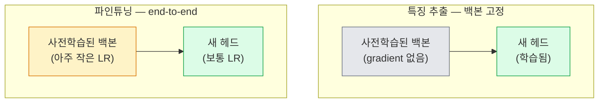

# 전이 학습과 파인튜닝

> 다른 누군가가 에지, 텍스처, 객체 부위가 어떻게 생겼는지 네트워크에 가르치려고 백만 GPU 시간을 썼습니다. 직접 학습하기 전에 그 특징을 빌려 써야 합니다.

**Type:** Build
**Languages:** Python
**Prerequisites:** Phase 4 Lesson 03 (CNNs), Phase 4 Lesson 04 (Image Classification)
**Time:** ~75분

## 학습 목표

- 데이터셋 크기, 도메인 거리, 컴퓨트 예산에 따라 특징 추출과 파인튜닝을 구분하고 적절한 방식을 고른다
- 사전학습된 백본을 불러오고, 분류기 헤드를 교체하며, 20줄 이내로 헤드만 학습해 작동하는 기준선을 만든다
- 초기의 일반 특징은 후기의 과제별 특징보다 작게 업데이트되도록 판별적 학습률로 레이어를 점진적으로 언프리즈한다
- 언프리즈된 블록에 너무 높은 LR을 적용해 생기는 특징 드리프트, 작은 데이터셋에서의 BN 통계 붕괴, 치명적 망각이라는 세 가지 흔한 실패를 진단한다

## 문제

ImageNet에서 ResNet-50을 학습하려면 약 2,000 GPU 시간이 듭니다. 매번 출시하는 과제마다 이 예산을 쓸 수 있는 팀은 거의 없습니다. 실제로 대부분의 팀이 배포하는 것은 사전학습된 백본에, 과제별 이미지 수백 장 또는 수천 장으로 새 헤드를 학습한 모델입니다.

이것은 지름길이 아닙니다. ImageNet으로 학습한 CNN의 첫 번째 conv 블록은 에지와 Gabor 비슷한 필터를 학습합니다. 다음 몇 블록은 텍스처와 단순 모티프를 학습합니다. 중간 블록은 객체 부위를 학습합니다. 마지막 블록은 1,000개의 ImageNet 범주처럼 보이기 시작하는 조합을 학습합니다. 자연에는 에지와 텍스처의 어휘가 제한되어 있기 때문에, 그 계층의 처음 90%는 의료 영상, 산업 검사, 위성 데이터, 그 밖의 거의 모든 비전 과제로 거의 그대로 전이됩니다. 실제로 학습하는 것은 마지막 10%입니다.

전이를 제대로 하려면 세 가지 버그가 기다립니다. 너무 높은 학습률로 사전학습된 특징을 망가뜨리는 것, 너무 많이 얼려 모델에 정보를 굶기는 것, BatchNorm의 running statistics가 나머지 네트워크가 학습해 본 적 없는 작은 데이터셋 쪽으로 드리프트하게 두는 것입니다. 이 수업에서는 이 셋을 일부러 하나씩 다룹니다.

## 개념

### 특징 추출 vs 파인튜닝

두 체제는 사전학습된 특징을 얼마나 신뢰하는지, 데이터가 얼마나 있는지로 고릅니다.



경험칙:

| 데이터셋 크기 | 도메인 거리 | 레시피 |
|--------------|-------------|--------|
| < 1k images | ImageNet에 가까움 | 백본을 고정하고 헤드만 학습 |
| 1k-10k | 가까움 | 처음 2-3개 stage를 고정하고 나머지를 파인튜닝 |
| 10k-100k | 무엇이든 | 판별적 LR로 end-to-end 파인튜닝 |
| 100k+ | 멂 | 전부 파인튜닝. 도메인이 충분히 멀면 scratch 학습도 고려 |

"ImageNet에 가깝다"는 것은 대략 객체 같은 내용이 담긴 자연 RGB 사진을 뜻합니다. 의료 CT 스캔, 상공 위성 이미지, 현미경 이미지는 먼 도메인입니다. 특징은 여전히 도움이 되지만, 더 많은 레이어가 적응하도록 풀어야 합니다.

### freezing이 실제로 작동하는 이유

CNN이 학습한 ImageNet 특징은 1,000개 범주에만 특화된 것이 아닙니다. 그것들은 자연 이미지의 통계, 즉 특정 방향의 에지, 텍스처, 대비 패턴, 형태 원시 요소에 특화되어 있습니다. 이 통계는 사람이 이름 붙일 수 있는 거의 모든 시각 도메인에서 안정적입니다. 그래서 ImageNet에서 학습한 모델을 백본 파인튜닝 없이 새 linear head만 붙여 CIFAR-10에 zero-shot으로 평가해도 80%+ 정확도에 도달합니다. 헤드는 이미 학습된 특징 중 이 과제에서 어떤 것에 가중치를 줄지 학습하는 것입니다.

### 판별적 학습률

언프리즈할 때는 초기 레이어가 후기 레이어보다 느리게 학습해야 합니다. 초기 레이어는 보존하고 싶은 일반 특징을 인코딩하고, 후기 레이어는 많이 움직여야 하는 과제별 구조를 인코딩합니다.

```text
Typical recipe:

  stage 0 (stem + first group): lr = base_lr / 100    (mostly fixed)
  stage 1:                       lr = base_lr / 10
  stage 2:                       lr = base_lr / 3
  stage 3 (last backbone group): lr = base_lr
  head:                          lr = base_lr  (or slightly higher)
```

PyTorch에서는 optimizer에 넘기는 parameter group 목록일 뿐입니다. 모델 하나, 학습률 다섯 개, 추가 코드는 거의 없습니다.

### BatchNorm 문제

BN 레이어는 ImageNet에서 계산된 `running_mean`과 `running_var` 버퍼를 들고 있습니다. 과제의 픽셀 분포가 다르면, 예를 들어 조명, 센서, 색 공간이 다르면 그 버퍼는 틀립니다. 선호 순서대로 세 가지 선택지가 있습니다.

1. **BN을 train mode로 두고 파인튜닝합니다.** BN이 다른 모든 것과 함께 running statistics를 업데이트하게 둡니다. 과제 데이터셋이 중간 규모(>= 5k examples)일 때 기본 선택입니다.
2. **BN을 eval mode로 고정합니다.** ImageNet 통계를 유지하고 weights만 학습합니다. 데이터셋이 너무 작아 BN의 moving average가 noisy할 때 맞습니다.
3. **BN을 GroupNorm으로 교체합니다.** moving-average 문제를 완전히 제거합니다. GPU당 batch size가 아주 작은 detection과 segmentation 백본에서 쓰입니다.

이것을 잘못 처리하면 정확도가 조용히 5-15% 떨어집니다.

### 헤드 설계

분류기 헤드는 1-3개의 linear layer와 선택적 dropout입니다. 모든 torchvision 백본에는 교체할 기본 헤드가 들어 있습니다.

```python
backbone.fc = nn.Linear(backbone.fc.in_features, num_classes)          # ResNet
backbone.classifier[1] = nn.Linear(..., num_classes)                    # EfficientNet, MobileNet
backbone.heads.head = nn.Linear(..., num_classes)                       # torchvision ViT
```

작은 데이터셋에서는 보통 single linear layer로 충분합니다. hidden layer(`Linear -> ReLU -> Dropout -> Linear`)를 추가하는 것은 과제 분포가 백본의 학습 분포에서 더 멀 때 도움이 됩니다.

### Layer-wise LR decay

현대 파인튜닝(BEiT, DINOv2, ViT-B fine-tunes)에서 쓰는 더 부드러운 형태의 판별적 LR입니다. 레이어를 stage로 묶는 대신, 모든 레이어에 바로 위 레이어보다 조금 작은 LR을 줍니다.

```text
lr_layer_k = base_lr * decay^(L - k)
```

decay = 0.75이고 L = 12 transformer blocks이면, 첫 번째 블록은 헤드 LR의 `0.75^11 ≈ 0.04x`로 학습합니다. CNN보다 transformer 파인튜닝에서 더 중요합니다. CNN은 보통 stage로 묶은 LR만으로 충분합니다.

### 무엇을 평가할 것인가

전이 학습 실행에서는 scratch 실행에서 추적하지 않을 두 숫자가 필요합니다.

- **Pretrained-only accuracy** — 백본을 고정했을 때 헤드의 정확도입니다. 이것이 바닥입니다.
- **Fine-tuned accuracy** — end-to-end 학습 후 같은 모델의 정확도입니다. 이것이 천장입니다.

fine-tuned가 pretrained-only보다 낮으면 learning-rate 또는 BN 버그가 있습니다. 항상 둘 다 출력하세요.

## 직접 만들기

### 단계 1: 사전학습된 백본을 불러오고 살펴보기

```python
import torch
import torch.nn as nn
from torchvision.models import resnet18, ResNet18_Weights

backbone = resnet18(weights=ResNet18_Weights.IMAGENET1K_V1)
print(backbone)
print()
print("classifier head:", backbone.fc)
print("feature dim:", backbone.fc.in_features)
```

`ResNet18`에는 stem과 `fc` head에 더해 네 stage(`layer1..layer4`)가 있습니다. 모든 torchvision classification backbone에는 이에 대응하는 구조가 있습니다.

### 단계 2: 특징 추출 — 전부 고정하고 헤드 교체하기

```python
def make_feature_extractor(num_classes=10):
    model = resnet18(weights=ResNet18_Weights.IMAGENET1K_V1)
    for p in model.parameters():
        p.requires_grad = False
    model.fc = nn.Linear(model.fc.in_features, num_classes)
    return model

model = make_feature_extractor(num_classes=10)
trainable = sum(p.numel() for p in model.parameters() if p.requires_grad)
frozen = sum(p.numel() for p in model.parameters() if not p.requires_grad)
print(f"trainable: {trainable:>10,}")
print(f"frozen:    {frozen:>10,}")
```

`model.fc`만 학습 가능합니다. 백본은 고정된 feature extractor입니다.

### 단계 3: 판별적 파인튜닝

stage별 학습률을 가진 parameter group을 만드는 유틸리티입니다.

```python
def discriminative_param_groups(model, base_lr=1e-3, decay=0.3):
    stages = [
        ["conv1", "bn1"],
        ["layer1"],
        ["layer2"],
        ["layer3"],
        ["layer4"],
        ["fc"],
    ]
    groups = []
    for i, names in enumerate(stages):
        lr = base_lr * (decay ** (len(stages) - 1 - i))
        params = [p for n, p in model.named_parameters()
                  if any(n.startswith(k) for k in names)]
        if params:
            groups.append({"params": params, "lr": lr, "name": "_".join(names)})
    return groups

model = resnet18(weights=ResNet18_Weights.IMAGENET1K_V1)
model.fc = nn.Linear(model.fc.in_features, 10)
for p in model.parameters():
    p.requires_grad = True

groups = discriminative_param_groups(model)
for g in groups:
    print(f"{g['name']:>10s}  lr={g['lr']:.2e}  params={sum(p.numel() for p in g['params']):>8,}")
```

`decay=0.3`은 각 stage가 다음 stage 속도의 30%로 학습한다는 뜻입니다. `fc`는 `base_lr`, `layer4`는 `0.3 * base_lr`, `conv1`은 `0.3^5 * base_lr ≈ 0.00243 * base_lr`를 받습니다. 과해 보이지만 경험적으로 작동합니다.

### 단계 4: BatchNorm 처리

BN weights는 고정하지 않고 BN running statistics만 고정하는 helper입니다.

```python
def freeze_bn_stats(model):
    for m in model.modules():
        if isinstance(m, (nn.BatchNorm1d, nn.BatchNorm2d, nn.BatchNorm3d)):
            m.eval()
            for p in m.parameters():
                p.requires_grad = False
    return model
```

매 epoch 시작에서 `model.train()`을 설정한 뒤 호출하세요. `model.train()`은 모든 것을 training mode로 바꿉니다. 이 함수는 BN 레이어에 대해서만 그것을 되돌립니다.

### 단계 5: 최소 end-to-end 파인튜닝 루프

```python
from torch.optim import SGD
from torch.utils.data import DataLoader
from torch.optim.lr_scheduler import CosineAnnealingLR
import torch.nn.functional as F

def fine_tune(model, train_loader, val_loader, device, epochs=5, base_lr=1e-3, freeze_bn=False):
    model = model.to(device)
    groups = discriminative_param_groups(model, base_lr=base_lr)
    optimizer = SGD(groups, momentum=0.9, weight_decay=1e-4, nesterov=True)
    scheduler = CosineAnnealingLR(optimizer, T_max=epochs)

    for epoch in range(epochs):
        model.train()
        if freeze_bn:
            freeze_bn_stats(model)
        tr_loss, tr_correct, tr_total = 0.0, 0, 0
        for x, y in train_loader:
            x, y = x.to(device), y.to(device)
            logits = model(x)
            loss = F.cross_entropy(logits, y, label_smoothing=0.1)
            optimizer.zero_grad()
            loss.backward()
            optimizer.step()
            tr_loss += loss.item() * x.size(0)
            tr_total += x.size(0)
            tr_correct += (logits.argmax(-1) == y).sum().item()
        scheduler.step()

        model.eval()
        va_total, va_correct = 0, 0
        with torch.no_grad():
            for x, y in val_loader:
                x, y = x.to(device), y.to(device)
                pred = model(x).argmax(-1)
                va_total += x.size(0)
                va_correct += (pred == y).sum().item()
        print(f"epoch {epoch}  train {tr_loss/tr_total:.3f}/{tr_correct/tr_total:.3f}  "
              f"val {va_correct/va_total:.3f}")
    return model
```

CIFAR-10에서 위 레시피로 5 epoch를 돌리면 `ResNet18-IMAGENET1K_V1`이 약 70% zero-shot linear-probe accuracy에서 약 93% fine-tuned accuracy로 올라갑니다. 헤드만 학습하면 백본을 전혀 건드리지 않고 약 86% 근처에서 plateau에 도달합니다.

### 단계 6: 점진적 언프리즈

끝에서 시작 쪽으로 epoch마다 한 stage씩 언프리즈하는 schedule입니다. 몇 epoch를 더 쓰는 대신 feature drift를 완화합니다.

```python
def progressive_unfreeze_schedule(model):
    stages = ["layer4", "layer3", "layer2", "layer1"]
    yielded = set()

    def start():
        for p in model.parameters():
            p.requires_grad = False
        for p in model.fc.parameters():
            p.requires_grad = True

    def unfreeze(epoch):
        if epoch < len(stages):
            name = stages[epoch]
            yielded.add(name)
            for n, p in model.named_parameters():
                if n.startswith(name):
                    p.requires_grad = True
            return name
        return None

    return start, unfreeze
```

첫 epoch 전에 `start()`를 한 번 호출합니다. 각 epoch 시작에서 `unfreeze(epoch)`를 호출합니다. 학습 가능한 parameter 집합이 바뀔 때마다 optimizer를 다시 만드세요. 그렇지 않으면 고정됐던 params가 cached moments를 계속 들고 있어 optimizer를 혼란스럽게 합니다.

## 사용하기

대부분의 실제 과제에서는 `torchvision.models`와 세 줄이면 충분합니다. 위의 무거운 장치는 library defaults가 고치지 못하는 문제를 만났을 때 중요합니다.

```python
from torchvision.models import resnet50, ResNet50_Weights

model = resnet50(weights=ResNet50_Weights.IMAGENET1K_V2)
model.fc = nn.Linear(model.fc.in_features, num_classes)
optimizer = torch.optim.AdamW(model.parameters(), lr=1e-4, weight_decay=1e-4)
```

다른 production-grade 기본값 두 가지:

- `timm`은 일관된 API로 약 800개의 사전학습된 vision backbone을 제공합니다(`timm.create_model("resnet50", pretrained=True, num_classes=10)`). torchvision zoo를 넘어서는 파인튜닝에는 표준입니다.
- transformer의 경우 `transformers.AutoModelForImageClassification.from_pretrained(name, num_labels=N)`가 text model과 같은 loading semantics로 ViT / BEiT / DeiT를 제공합니다.

## 산출물

이 수업의 산출물:

- `outputs/prompt-fine-tune-planner.md` — 데이터셋 크기, 도메인 거리, 컴퓨트 예산에 따라 feature-extraction, progressive, end-to-end fine-tuning 중 하나를 고르는 프롬프트입니다.
- `outputs/skill-freeze-inspector.md` — PyTorch 모델이 주어졌을 때 어떤 parameter가 trainable인지, 어떤 BatchNorm layer가 eval mode인지, optimizer가 실제로 trainable parameter를 받고 있는지 보고하는 skill입니다.

## 연습

1. **(쉬움)** 같은 synthetic-CIFAR dataset에서 `ResNet18`을 linear probe(backbone frozen)와 full fine-tune으로 각각 학습하세요. 두 정확도를 나란히 보고하세요. 어떤 gap이 특징이 잘 전이됨을 말해 주고, 어떤 gap이 그렇지 않음을 말해 주는지 설명하세요.
2. **(중간)** 일부러 버그를 넣으세요. 헤드가 아니라 backbone stage에 `base_lr = 1e-1`을 설정합니다. training loss가 폭발하는 것을 보인 다음, `discriminative_param_groups` helper를 적용해 회복하세요. 각 stage가 diverge하기 시작하는 LR을 기록하세요.
3. **(어려움)** 의료 영상 데이터셋(예: CheXpert-small, PatchCamelyon, HAM10000)을 골라 세 체제를 비교하세요. (a) ImageNet-pretrained frozen backbone + linear head, (b) ImageNet-pretrained end-to-end fine-tune, (c) scratch training. 각각의 accuracy와 compute cost를 보고하세요. 데이터셋 크기가 어느 정도일 때 scratch training이 경쟁력 있어지나요?

## 핵심 용어

| 용어 | 사람들이 하는 말 | 실제 의미 |
|------|------------------|-----------|
| Feature extraction | "Freeze and train head" | 백본 parameter는 고정되고, 새 classifier head만 gradient를 받음 |
| Fine-tuning | "Retrain end-to-end" | 모든 parameter가 trainable이며, 보통 scratch training보다 훨씬 작은 LR을 사용함 |
| Discriminative LR | "Smaller LR for early layers" | 초기 stage LR이 후기 stage LR의 일부가 되도록 만든 optimizer parameter groups |
| Layer-wise LR decay | "Smooth LR gradient" | 레이어별 LR에 decay^(L - k)를 곱함. transformer fine-tunes에서 흔함 |
| Catastrophic forgetting | "The model lost ImageNet" | 너무 높은 LR이 새 과제 신호를 학습하기 전에 사전학습된 특징을 덮어씀 |
| BN statistics drift | "Running mean is wrong" | BatchNorm running_mean/var가 현재 과제와 다른 분포에서 계산되어 정확도를 조용히 해침 |
| Linear probe | "Frozen backbone + linear head" | 사전학습된 특징의 평가. 고정된 representation 위의 최선 linear classifier 정확도 |
| Catastrophic collapse | "Everything predicts one class" | head의 gradient가 안정화되기 전에 특징을 망가뜨릴 만큼 높은 LR로 파인튜닝할 때 발생 |

## 더 읽을거리

- [How transferable are features in deep neural networks? (Yosinski et al., 2014)](https://arxiv.org/abs/1411.1792) — 레이어별 feature transferability를 정량화한 논문
- [Universal Language Model Fine-tuning (ULMFiT, Howard & Ruder, 2018)](https://arxiv.org/abs/1801.06146) — 원래의 discriminative LR / progressive unfreezing 레시피. 아이디어는 vision에도 그대로 전이됩니다
- [timm documentation](https://huggingface.co/docs/timm) — 현대 vision backbone과 그것들이 학습된 정확한 fine-tune defaults의 레퍼런스
- [A Simple Framework for Linear-Probe Evaluation (Kornblith et al., 2019)](https://arxiv.org/abs/1805.08974) — linear-probe accuracy가 중요한 이유와 올바른 보고 방법
