# 객체 탐지 — YOLO를 scratch로 만들기

> 탐지는 분류에 회귀를 더한 뒤 feature map의 모든 위치에서 실행하고, non-maximum suppression으로 정리하는 문제입니다.

**Type:** Build
**Languages:** Python
**Prerequisites:** Phase 4 Lesson 03 (CNNs), Phase 4 Lesson 04 (Image Classification), Phase 4 Lesson 05 (Transfer Learning)
**Time:** ~75분

## 학습 목표

- 탐지를 dense prediction 문제로 바꾸는 grid-and-anchor 설계를 설명하고, output tensor의 모든 숫자가 무엇을 뜻하는지 말한다
- box 사이의 Intersection-over-Union을 계산하고 non-maximum suppression을 scratch로 구현한다
- classification, objectness, box-regression loss를 포함해 사전학습된 백본 위에 최소 YOLO-style head를 만든다
- detection metric row(precision@0.5, recall, mAP@0.5, mAP@0.5:0.95)를 읽고 다음에 어떤 knob를 돌릴지 고른다

## 문제

분류는 "이 이미지는 개다"라고 말합니다. 탐지는 "픽셀 (112, 40, 280, 210)에 개가 있고, (400, 180, 560, 310)에 고양이가 있으며, 프레임 안에는 그 밖에 아무것도 없다"라고 말합니다. 이미지당 하나의 label 대신 가변 개수의 labelled box를 예측하는 이 구조적 변화가 모든 자율 시스템, 감시 제품, 문서 레이아웃 parser, 공장 비전 라인의 기반입니다.

탐지는 비전의 모든 engineering trade-off가 한꺼번에 드러나는 곳이기도 합니다. box가 정확해야 하고(regression head), 각 box의 class가 맞아야 하며(classification head), 탐지할 것이 없을 때 모델이 그것을 알아야 하고(objectness score), 실제 객체 하나당 정확히 하나의 prediction만 원합니다(non-maximum suppression). 이 중 하나라도 놓치면 pipeline은 객체를 놓치거나, hallucinated box를 보고하거나, 같은 객체를 약간 다른 위치로 15번 예측합니다.

YOLO(You Only Look Once, Redmon et al. 2016)는 conv net의 단일 forward pass로 이 모든 것을 실시간으로 실행하게 만든 설계입니다. 같은 구조적 결정은 여전히 현대 detector(YOLOv8, YOLOv9, YOLO-NAS, RT-DETR)의 backbone입니다. 핵심을 배우면 모든 변형은 같은 부품을 재배열한 것으로 보입니다.

## 개념

### dense prediction으로 보는 탐지

classifier는 이미지당 C개의 숫자를 출력합니다. YOLO-style detector는 이미지당 `(S x S x (5 + C))`개의 숫자를 출력합니다. 여기서 S는 spatial grid size입니다.

```mermaid
flowchart LR
    IMG["Input 416x416 RGB"] --> BB["Backbone<br/>(ResNet, DarkNet, ...)"]
    BB --> FM["Feature map<br/>(C_feat, 13, 13)"]
    FM --> HEAD["Detection head<br/>(1x1 convs)"]
    HEAD --> OUT["Output tensor<br/>(13, 13, B * (5 + C))"]
    OUT --> DEC["Decode<br/>(grid + sigmoid + exp)"]
    DEC --> NMS["Non-max suppression"]
    NMS --> RESULT["Final boxes"]

    style IMG fill:#dbeafe,stroke:#2563eb
    style HEAD fill:#fef3c7,stroke:#d97706
    style NMS fill:#fecaca,stroke:#dc2626
    style RESULT fill:#dcfce7,stroke:#16a34a
```



`S * S`개의 각 grid cell은 `B`개의 box를 예측합니다. 각 box에 대해:

- 4개 숫자는 geometry를 설명합니다: `tx, ty, tw, th`.
- 1개 숫자는 objectness score입니다: "이 cell 중심에 객체가 있는가?"
- C개 숫자는 class probabilities입니다.

cell당 총합은 `B * (5 + C)`입니다. VOC에서 `S=13, B=2, C=20`이면 cell당 50개 숫자입니다.

### grid와 anchor가 필요한 이유

단순 regression은 모든 객체에 대해 `(x, y, w, h)`를 absolute coordinate로 예측할 것입니다. conv network에는 이것이 어렵습니다. 이미지를 평행이동한다고 해서 모든 prediction이 같은 양만큼 이동해서는 안 되기 때문입니다. 각 객체는 공간적으로 anchor되어 있습니다. grid는 각 ground-truth box를 중심이 들어 있는 grid cell에 배정해 이 문제에 답합니다. 그 cell만 해당 객체를 책임집니다.

anchor는 두 번째 문제를 다룹니다. 3x3 conv는 16-pixel receptive field feature cell에서 500-pixel-wide box를 쉽게 회귀할 수 없습니다. 대신 cell마다 `B`개의 prior box shape(anchor)를 미리 정의하고, 각 anchor에서 작은 delta를 예측합니다. 모델은 아무것도 없는 상태에서 회귀하는 대신 맞는 anchor를 고르고 살짝 이동하는 법을 배웁니다.

```text
Anchor box priors (example for 416x416 input):

  small:   (30,  60)
  medium:  (75,  170)
  large:   (200, 380)

At each grid cell, every anchor emits (tx, ty, tw, th, obj, c_1, ..., c_C).
```

현대 detector는 resolution마다 다른 anchor set을 가진 FPN을 자주 씁니다. 얕은 high-resolution map에는 작은 anchor, 깊은 low-resolution map에는 큰 anchor를 둡니다. 같은 아이디어를 더 많은 scale에 적용한 것입니다.

### prediction decode

raw `tx, ty, tw, th`는 box coordinate가 아닙니다. plotting 전에 변환해야 하는 regression target입니다.

```text
centre x  = (sigmoid(tx) + cell_x) * stride
centre y  = (sigmoid(ty) + cell_y) * stride
width     = anchor_w * exp(tw)
height    = anchor_h * exp(th)
```

`sigmoid`는 center offset을 cell 안에 묶습니다. `exp`는 width가 부호 반전 없이 anchor에서 자유롭게 scale되게 합니다. `stride`는 grid coordinate를 pixel로 되돌립니다. 이 decode step은 v2 이후 모든 YOLO 버전에서 같습니다.

### IoU

탐지에서 두 box 사이의 universal similarity metric입니다.

```text
IoU(A, B) = area(A intersect B) / area(A union B)
```

IoU = 1은 동일함을 뜻하고, IoU = 0은 겹치지 않음을 뜻합니다. prediction과 ground-truth box의 IoU는 prediction이 true positive로 세어질지 결정합니다(보통 IoU >= 0.5). 두 prediction 사이의 IoU는 NMS가 중복 제거에 사용합니다.

### Non-maximum suppression

인접 anchor에서 학습된 conv network는 같은 객체에 대해 겹치는 box를 여러 개 예측하곤 합니다. NMS는 confidence가 가장 높은 prediction을 유지하고, IoU가 threshold보다 높은 다른 prediction을 삭제합니다.

```text
NMS(boxes, scores, iou_threshold):
    sort boxes by score descending
    keep = []
    while boxes not empty:
        pick the top-scoring box, add to keep
        remove every box with IoU > iou_threshold to the picked box
    return keep
```

object detection의 일반 threshold는 0.45입니다. 최근 detector는 standard NMS를 `soft-NMS`, `DIoU-NMS`로 바꾸거나 suppression을 직접 학습합니다(RT-DETR). 하지만 구조적 목적은 같습니다.

### loss

YOLO loss는 weight가 붙은 세 loss의 합입니다.

```text
L = lambda_coord * L_box(pred, target, where obj=1)
  + lambda_obj   * L_obj(pred, 1,     where obj=1)
  + lambda_noobj * L_obj(pred, 0,     where obj=0)
  + lambda_cls   * L_cls(pred, target, where obj=1)
```

객체가 있는 cell만 box-regression과 classification loss에 기여합니다. 객체가 없는 cell은 objectness loss에만 기여합니다(모델이 침묵하는 법을 배우도록). `lambda_noobj`는 보통 작습니다(~0.5). 대부분의 cell이 비어 있어 그대로 두면 total loss를 지배하기 때문입니다.

현대 변형은 MSE box loss를 CIoU / DIoU(IoU를 직접 optimize)로 바꾸고, class imbalance에 focal loss를 쓰며, quality focal loss로 objectness를 balance합니다. 세 component 구조는 바뀌지 않습니다.

### detection metric

accuracy는 탐지로 전이되지 않습니다. 전이되는 숫자 네 가지:

- **Precision@IoU=0.5** — positive로 센 prediction 중 실제로 맞은 것은 몇 개인가.
- **Recall@IoU=0.5** — 실제 객체 중 몇 개를 찾았는가.
- **AP@0.5** — IoU threshold 0.5에서 precision-recall curve area. class당 하나의 숫자입니다.
- **mAP@0.5:0.95** — IoU threshold 0.5, 0.55, ..., 0.95에서 AP 평균. COCO metric이며 가장 엄격하고 정보량이 많습니다.

네 가지를 모두 보고하세요. mAP@0.5는 강하지만 mAP@0.5:0.95가 약한 detector는 대략적인 localization은 하지만 tight하지 않습니다. 더 나은 box-regression loss로 고치세요. precision이 높고 recall이 낮은 detector는 너무 보수적입니다. confidence threshold를 낮추거나 objectness weight를 높이세요.

## 직접 만들기

### 단계 1: IoU

이 수업 전체의 workhorse입니다. `(x1, y1, x2, y2)` 형식의 box array 두 개에서 작동합니다.

```python
import numpy as np

def box_iou(boxes_a, boxes_b):
    ax1, ay1, ax2, ay2 = boxes_a[:, 0], boxes_a[:, 1], boxes_a[:, 2], boxes_a[:, 3]
    bx1, by1, bx2, by2 = boxes_b[:, 0], boxes_b[:, 1], boxes_b[:, 2], boxes_b[:, 3]

    inter_x1 = np.maximum(ax1[:, None], bx1[None, :])
    inter_y1 = np.maximum(ay1[:, None], by1[None, :])
    inter_x2 = np.minimum(ax2[:, None], bx2[None, :])
    inter_y2 = np.minimum(ay2[:, None], by2[None, :])

    inter_w = np.clip(inter_x2 - inter_x1, 0, None)
    inter_h = np.clip(inter_y2 - inter_y1, 0, None)
    inter = inter_w * inter_h

    area_a = (ax2 - ax1) * (ay2 - ay1)
    area_b = (bx2 - bx1) * (by2 - by1)
    union = area_a[:, None] + area_b[None, :] - inter
    return inter / np.clip(union, 1e-8, None)
```

pairwise IoU의 `(N_a, N_b)` matrix를 반환합니다. single ground-truth box와 비교하려면 한 array의 shape을 `(1, 4)`로 만드세요.

### 단계 2: Non-max suppression

```python
def nms(boxes, scores, iou_threshold=0.45):
    order = np.argsort(-scores)
    keep = []
    while len(order) > 0:
        i = order[0]
        keep.append(i)
        if len(order) == 1:
            break
        rest = order[1:]
        ious = box_iou(boxes[[i]], boxes[rest])[0]
        order = rest[ious <= iou_threshold]
    return np.array(keep, dtype=np.int64)
```

결정적이고, sort 때문에 `O(N log N)`이며, 동일 input에서 `torchvision.ops.nms`의 동작과 맞습니다.

### 단계 3: Box encoding과 decoding

pixel coordinate와 network가 실제로 회귀하는 `(tx, ty, tw, th)` target 사이를 변환합니다.

```python
def encode(box_xyxy, cell_x, cell_y, stride, anchor_wh):
    x1, y1, x2, y2 = box_xyxy
    cx = 0.5 * (x1 + x2)
    cy = 0.5 * (y1 + y2)
    w = x2 - x1
    h = y2 - y1
    tx = cx / stride - cell_x
    ty = cy / stride - cell_y
    tw = np.log(w / anchor_wh[0] + 1e-8)
    th = np.log(h / anchor_wh[1] + 1e-8)
    return np.array([tx, ty, tw, th])


def decode(tx_ty_tw_th, cell_x, cell_y, stride, anchor_wh):
    tx, ty, tw, th = tx_ty_tw_th
    cx = (sigmoid(tx) + cell_x) * stride
    cy = (sigmoid(ty) + cell_y) * stride
    w = anchor_wh[0] * np.exp(tw)
    h = anchor_wh[1] * np.exp(th)
    return np.array([cx - w / 2, cy - h / 2, cx + w / 2, cy + h / 2])


def sigmoid(x):
    return 1.0 / (1.0 + np.exp(-x))
```

테스트: box를 encode한 뒤 decode하세요. `tx`가 post-sigmoid range 안에 없을 때 sigmoid inverse가 완전히 invertible하지 않다는 점을 제외하면 원래 값과 매우 가까운 값을 얻어야 합니다.

### 단계 4: 최소 YOLO head

feature map 위의 1x1 conv 하나를 `(B, S, S, num_anchors, 5 + C)`로 reshape합니다.

```python
import torch
import torch.nn as nn

class YOLOHead(nn.Module):
    def __init__(self, in_c, num_anchors, num_classes):
        super().__init__()
        self.num_anchors = num_anchors
        self.num_classes = num_classes
        self.conv = nn.Conv2d(in_c, num_anchors * (5 + num_classes), kernel_size=1)

    def forward(self, x):
        n, _, h, w = x.shape
        y = self.conv(x)
        y = y.view(n, self.num_anchors, 5 + self.num_classes, h, w)
        y = y.permute(0, 3, 4, 1, 2).contiguous()
        return y
```

Output shape은 `(N, H, W, num_anchors, 5 + C)`입니다. 마지막 dimension은 `[tx, ty, tw, th, obj, cls_0, ..., cls_{C-1}]`를 담습니다.

### 단계 5: Ground-truth assignment

모든 ground-truth box에 대해 어떤 `(cell, anchor)`가 책임질지 결정합니다.

```python
def assign_targets(boxes_xyxy, classes, anchors, stride, grid_size, num_classes):
    num_anchors = len(anchors)
    target = np.zeros((grid_size, grid_size, num_anchors, 5 + num_classes), dtype=np.float32)
    has_obj = np.zeros((grid_size, grid_size, num_anchors), dtype=bool)

    for box, cls in zip(boxes_xyxy, classes):
        x1, y1, x2, y2 = box
        cx, cy = 0.5 * (x1 + x2), 0.5 * (y1 + y2)
        gx, gy = int(cx / stride), int(cy / stride)
        bw, bh = x2 - x1, y2 - y1

        ious = np.array([
            (min(bw, aw) * min(bh, ah)) / (bw * bh + aw * ah - min(bw, aw) * min(bh, ah))
            for aw, ah in anchors
        ])
        best = int(np.argmax(ious))
        aw, ah = anchors[best]

        target[gy, gx, best, 0] = cx / stride - gx
        target[gy, gx, best, 1] = cy / stride - gy
        target[gy, gx, best, 2] = np.log(bw / aw + 1e-8)
        target[gy, gx, best, 3] = np.log(bh / ah + 1e-8)
        target[gy, gx, best, 4] = 1.0
        target[gy, gx, best, 5 + cls] = 1.0
        has_obj[gy, gx, best] = True
    return target, has_obj
```

anchor selection은 "ground truth와의 best shape IoU"입니다. YOLOv2/v3 assignment와 맞는 저렴한 proxy입니다. v5 이후는 같은 아이디어를 정교화한 더 복잡한 전략(task-aligned matching, dynamic k)을 사용합니다.

### 단계 6: 세 가지 loss

```python
def yolo_loss(pred, target, has_obj, lambda_coord=5.0, lambda_obj=1.0, lambda_noobj=0.5, lambda_cls=1.0):
    has_obj_t = torch.from_numpy(has_obj).bool()
    target_t = torch.from_numpy(target).float()

    # box-regression loss: only on cells with objects
    box_pred = pred[..., :4][has_obj_t]
    box_true = target_t[..., :4][has_obj_t]
    loss_box = torch.nn.functional.mse_loss(box_pred, box_true, reduction="sum")

    # objectness loss
    obj_pred = pred[..., 4]
    obj_true = target_t[..., 4]
    loss_obj_pos = torch.nn.functional.binary_cross_entropy_with_logits(
        obj_pred[has_obj_t], obj_true[has_obj_t], reduction="sum")
    loss_obj_neg = torch.nn.functional.binary_cross_entropy_with_logits(
        obj_pred[~has_obj_t], obj_true[~has_obj_t], reduction="sum")

    # classification loss on cells with objects
    cls_pred = pred[..., 5:][has_obj_t]
    cls_true = target_t[..., 5:][has_obj_t]
    loss_cls = torch.nn.functional.binary_cross_entropy_with_logits(
        cls_pred, cls_true, reduction="sum")

    total = (lambda_coord * loss_box
             + lambda_obj * loss_obj_pos
             + lambda_noobj * loss_obj_neg
             + lambda_cls * loss_cls)
    return total, {"box": loss_box.item(), "obj_pos": loss_obj_pos.item(),
                   "obj_neg": loss_obj_neg.item(), "cls": loss_cls.item()}
```

모든 YOLO tutorial이 hardcode하거나 sweep하는 hyper-parameter 다섯 개입니다. 비율이 중요합니다. `lambda_coord=5, lambda_noobj=0.5`는 원래 YOLOv1 논문을 반영하며 지금도 합리적인 default로 작동합니다.

### 단계 7: Inference pipeline

raw head output을 decode하고, sigmoid/exp를 적용하며, objectness로 threshold를 걸고 NMS를 수행합니다.

```python
def postprocess(pred_tensor, anchors, stride, img_size, conf_threshold=0.25, iou_threshold=0.45):
    pred = pred_tensor.detach().cpu().numpy()
    grid_h, grid_w = pred.shape[1], pred.shape[2]
    num_anchors = len(anchors)

    boxes, scores, classes = [], [], []
    for gy in range(grid_h):
        for gx in range(grid_w):
            for a in range(num_anchors):
                tx, ty, tw, th, obj, *cls = pred[0, gy, gx, a]
                score = sigmoid(obj) * sigmoid(np.array(cls)).max()
                if score < conf_threshold:
                    continue
                cls_idx = int(np.argmax(cls))
                cx = (sigmoid(tx) + gx) * stride
                cy = (sigmoid(ty) + gy) * stride
                w = anchors[a][0] * np.exp(tw)
                h = anchors[a][1] * np.exp(th)
                boxes.append([cx - w / 2, cy - h / 2, cx + w / 2, cy + h / 2])
                scores.append(float(score))
                classes.append(cls_idx)

    if not boxes:
        return np.zeros((0, 4)), np.zeros((0,)), np.zeros((0,), dtype=int)
    boxes = np.array(boxes)
    scores = np.array(scores)
    classes = np.array(classes)
    keep = nms(boxes, scores, iou_threshold)
    return boxes[keep], scores[keep], classes[keep]
```

이것이 완전한 eval path입니다: head -> decode -> threshold -> NMS.

## 사용하기

`torchvision.models.detection`은 같은 개념 구조를 가진 production detector를 제공합니다. 사전학습된 모델을 불러오는 데 세 줄이면 됩니다.

```python
import torch
from torchvision.models.detection import fasterrcnn_resnet50_fpn_v2

model = fasterrcnn_resnet50_fpn_v2(weights="DEFAULT")
model.eval()
with torch.no_grad():
    predictions = model([torch.randn(3, 400, 600)])
print(predictions[0].keys())
print(f"boxes:  {predictions[0]['boxes'].shape}")
print(f"scores: {predictions[0]['scores'].shape}")
print(f"labels: {predictions[0]['labels'].shape}")
```

real-time inference pipeline에서는 `ultralytics`(YOLOv8/v9)가 표준입니다. `from ultralytics import YOLO; model = YOLO('yolov8n.pt'); model(img)`. 모델이 decoding과 NMS를 내부에서 처리하고, 위에서 만든 것과 같은 `boxes / scores / labels` triple을 반환합니다.

## 산출물

이 수업의 산출물:

- `outputs/prompt-detection-metric-reader.md` — `precision, recall, AP, mAP@0.5:0.95` row를 한 줄 diagnosis와 가장 유용한 다음 experiment 하나로 바꾸는 prompt입니다.
- `outputs/skill-anchor-designer.md` — ground-truth box dataset이 주어졌을 때 `(w, h)`에 k-means를 실행하고, FPN level별 anchor set과 적절한 anchor 수를 고르는 데 필요한 coverage statistics를 반환하는 skill입니다.

## 연습

1. **(쉬움)** `box_iou`를 구현하고 1,000개의 random box pair에서 `torchvision.ops.box_iou`와 비교하세요. max absolute difference가 `1e-6`보다 낮은지 검증하세요.
2. **(중간)** `yolo_loss`를 MSE 대신 `CIoU` box loss를 쓰는 버전으로 port하세요. 100-image synthetic dataset에서 CIoU가 같은 epoch 수 안에 MSE보다 더 나은 최종 mAP@0.5:0.95로 수렴함을 보이세요.
3. **(어려움)** multi-scale inference를 구현하세요. 같은 이미지를 세 resolution으로 모델에 넣고, box prediction을 union한 뒤 마지막에 단일 NMS를 실행합니다. held-out set에서 single-scale inference 대비 mAP lift를 측정하세요.

## 핵심 용어

| 용어 | 사람들이 하는 말 | 실제 의미 |
|------|------------------|-----------|
| Anchor | "Box prior" | 네트워크가 absolute coordinate 대신 delta를 예측하는 기준이 되는, 각 grid cell의 사전 정의된 box shape |
| IoU | "Overlap" | 두 box의 intersection-over-union. detection의 universal similarity measure |
| NMS | "Deduplicate" | score가 가장 높은 prediction을 유지하고 threshold보다 많이 겹치는 prediction을 제거하는 greedy algorithm |
| Objectness | "Is there something here" | 객체가 해당 cell 중심에 있는지 예측하는 per-anchor, per-cell scalar |
| Grid stride | "Downsample factor" | grid cell당 pixel 수. 416-px input에 13-grid head가 있으면 stride는 32 |
| mAP | "Mean average precision" | precision-recall curve 아래 면적의 평균. class와 COCO의 경우 IoU threshold에 대해서도 평균 |
| AP@0.5 | "PASCAL VOC AP" | IoU threshold 0.5의 average precision. 더 관대한 metric 버전 |
| mAP@0.5:0.95 | "COCO AP" | IoU threshold 0.5..0.95를 0.05 step으로 평균. 엄격한 버전이자 현재 community standard |

## 더 읽을거리

- [YOLOv1: You Only Look Once (Redmon et al., 2016)](https://arxiv.org/abs/1506.02640) — 창시 논문. 이후 모든 YOLO는 이 구조의 개선입니다
- [YOLOv3 (Redmon & Farhadi, 2018)](https://arxiv.org/abs/1804.02767) — multi-scale FPN-style head를 도입한 논문. 여전히 가장 명확한 diagram입니다
- [Ultralytics YOLOv8 docs](https://docs.ultralytics.com) — 현재 production reference. dataset format, augmentation, training recipe를 다룹니다
- [The Illustrated Guide to Object Detection (Jonathan Hui)](https://jonathan-hui.medium.com/object-detection-series-24d03a12f904) — 전체 detector zoo를 가장 쉽게 설명하는 plain-English tour. DETR, RetinaNet, FCOS, YOLO의 관계를 이해하는 데 매우 유용합니다
