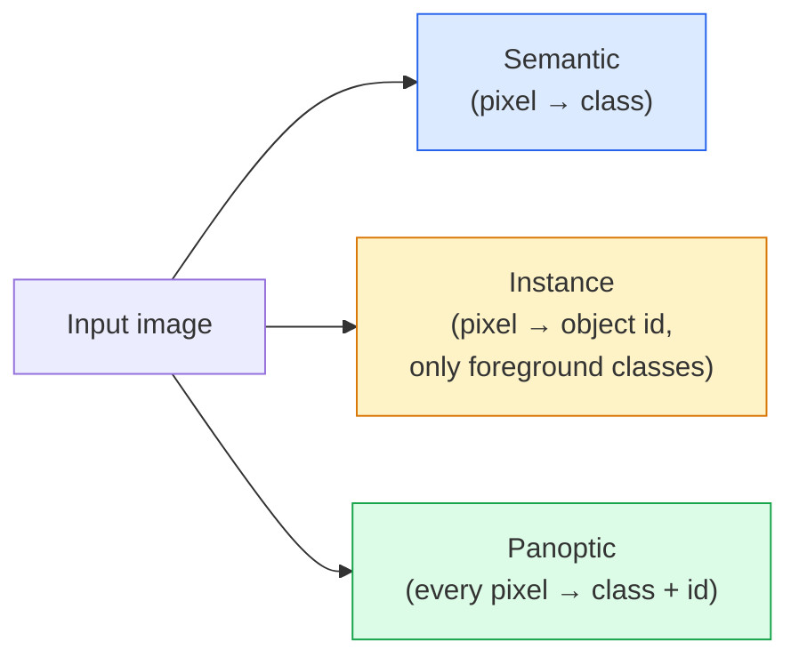
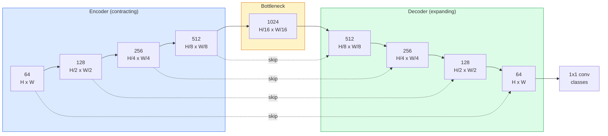

# 시맨틱 세그멘테이션 — U-Net

> 세그멘테이션은 모든 픽셀에서 수행하는 분류입니다. U-Net은 다운샘플링 인코더와 업샘플링 디코더를 짝짓고 그 사이에 스킵 연결을 배선해 이 작업을 가능하게 합니다.

**Type:** Build
**Languages:** Python
**Prerequisites:** Phase 4 Lesson 03 (CNNs), Phase 4 Lesson 04 (Image Classification)
**Time:** ~75 minutes

## 학습 목표

- 시맨틱, 인스턴스, 파놉틱 세그멘테이션을 구분하고 주어진 문제에 맞는 작업 유형을 고르기
- 인코더 블록, 병목, 전치 합성곱을 쓰는 디코더, 스킵 연결로 PyTorch에서 U-Net을 처음부터 만들기
- 픽셀 단위 크로스 엔트로피, Dice loss, 그리고 의료 및 산업 세그멘테이션의 현재 기본값인 결합 손실을 구현하기
- 클래스별 IoU와 Dice 지표를 읽고 나쁜 점수가 작은 객체 재현율, 경계 정확도, 클래스 불균형 중 어디에서 왔는지 진단하기

## 문제

분류는 이미지마다 하나의 레이블을 출력합니다. 검출은 이미지마다 몇 개의 박스를 출력합니다. 세그멘테이션은 픽셀마다 하나의 레이블을 출력합니다. 크기가 `H x W`인 입력에서 출력은 `H x W`(시맨틱) 또는 `H x W x N_instances`(인스턴스) 형태의 텐서입니다. 이미지 하나에 예측이 하나가 아니라 수백만 개입니다.

세그멘테이션의 구조 때문에 거의 모든 밀집 예측 비전 제품이 세그멘테이션에 의존합니다. 의료 영상(종양 마스크), 자율주행(도로, 차선, 장애물), 위성(건물 footprint, 작물 경계), 문서 파싱(레이아웃 영역), 로보틱스(집을 수 있는 영역)가 그렇습니다. 이런 작업은 객체 주변에 박스를 그리는 것만으로는 풀 수 없습니다. 정확한 실루엣이 필요합니다.

아키텍처 문제는 말로는 간단하지만 풀기는 쉽지 않습니다. 네트워크는 이미지의 전역 문맥(어떤 장면인가)과 로컬 픽셀 세부 정보(정확히 어느 픽셀이 도로이고 어느 픽셀이 보도인가)를 동시에 봐야 합니다. 표준 CNN은 문맥을 얻기 위해 공간적으로 압축하고, 그 과정에서 세부 정보를 버립니다. U-Net은 둘 다 얻은 설계였습니다.

## 개념

### 시맨틱 vs 인스턴스 vs 파놉틱



- **시맨틱**은 "이 픽셀은 도로, 저 픽셀은 자동차"라고 말합니다. 서로 붙어 있는 자동차 두 대는 하나의 덩어리로 합쳐집니다.
- **인스턴스**는 "이 픽셀은 자동차 #3, 저 픽셀은 자동차 #5"라고 말합니다. 배경 stuff("stuff" = 하늘, 도로, 잔디)는 무시합니다.
- **파놉틱**은 둘을 통합합니다. 모든 픽셀은 클래스 레이블을 받고, 모든 인스턴스는 고유 id를 받으며, stuff와 things가 모두 세그멘테이션됩니다.

이 수업은 시맨틱을 다룹니다. 다음 수업(Mask R-CNN)은 인스턴스를 다룹니다.

### U-Net 형태



인코더는 공간 해상도를 네 번 절반으로 줄이고 채널 수를 두 배로 늘립니다. 디코더는 이를 반대로 수행합니다. 공간 해상도를 네 번 두 배로 늘리고 채널 수를 절반으로 줄입니다. 스킵 연결은 모든 해상도에서 대응하는 인코더 특징과 디코더 특징을 이어 붙입니다. 마지막 1x1 conv는 전체 해상도에서 `64 -> num_classes`로 매핑합니다.

스킵 연결이 필요한 이유는 디코더가 픽셀 수준 예측을 출력하려는 시점에는 작은 특징 맵만 보았기 때문입니다. 스킵이 없으면 에지 정보를 인코더에서 압축해 버렸기 때문에 경계를 정확히 위치시킬 수 없습니다. 스킵 연결은 인코더가 내려가며 계산한 고해상도 특징 맵을 디코더에 넘겨줍니다.

### 전치 합성곱 vs bilinear upsample

디코더는 공간 차원을 확장해야 합니다. 선택지는 두 가지입니다.

- **전치 합성곱**(`nn.ConvTranspose2d`) — 학습 가능한 업샘플링입니다. 역사적인 U-Net 기본값입니다. stride와 kernel size가 고르게 나뉘지 않으면 체커보드 artifact가 생길 수 있습니다.
- **Bilinear upsample + 3x3 conv** — 부드럽게 업샘플한 뒤 conv를 적용합니다. artifact가 적고 파라미터도 적으며, 지금은 현대적인 기본값입니다.

둘 다 실제 현장에서 쓰입니다. 첫 U-Net에는 bilinear가 더 안전합니다.

### 픽셀 그리드 위의 크로스 엔트로피

C개 클래스의 시맨틱 세그멘테이션에서 모델 출력은 `(N, C, H, W)`입니다. 타깃은 정수 클래스 ID를 담은 `(N, H, W)`입니다. 크로스 엔트로피는 분류 사례와 동일하며, 모든 공간 위치에 적용될 뿐입니다.

```text
Loss = mean over (n, h, w) of -log( softmax(logits[n, :, h, w])[target[n, h, w]] )
```

PyTorch의 `F.cross_entropy`는 이 형태를 기본으로 처리합니다. reshape는 필요 없습니다.

### Dice loss와 필요한 이유

크로스 엔트로피는 모든 픽셀을 동등하게 취급합니다. 한 클래스가 프레임을 지배할 때는 이것이 틀립니다(의료 영상: 99% 배경, 1% 종양). 네트워크는 모든 곳을 배경으로 예측해 99% 정확도를 얻고도 아무 쓸모가 없을 수 있습니다.

Dice loss는 예측 마스크와 실제 마스크의 겹침을 직접 최적화해 이 문제를 풉니다.

```text
Dice(p, y) = 2 * sum(p * y) / (sum(p) + sum(y) + epsilon)
Dice_loss = 1 - Dice
```

여기서 `p`는 한 클래스의 sigmoid/softmax 확률 맵이고 `y`는 이진 ground-truth 마스크입니다. 손실은 겹침이 완벽할 때만 0입니다. 비율 기반이므로 클래스 불균형이 중요하지 않습니다.

실전에서는 **결합 손실**을 씁니다.

```text
L = L_cross_entropy + lambda * L_dice       (lambda ~ 1)
```

크로스 엔트로피는 훈련 초기에 안정적인 그래디언트를 주고, Dice는 훈련 후반을 실제 마스크 모양에 맞추는 데 집중시킵니다. 이 조합은 의료 영상의 기본값이며 클래스 불균형 데이터셋에서 이기기 어렵습니다.

### 평가 지표

- **픽셀 정확도** — 올바르게 예측된 픽셀의 비율입니다. 저렴합니다. 분류의 accuracy와 같은 이유로 불균형 데이터에서는 망가집니다.
- **클래스별 IoU** — 각 클래스 마스크의 intersection over union입니다. 클래스 전체 평균은 mIoU입니다.
- **Dice(픽셀 F1)** — IoU와 비슷합니다. `Dice = 2 * IoU / (1 + IoU)`입니다. 의료 영상은 Dice를 선호하고 주행 커뮤니티는 IoU를 선호합니다. 둘은 단조 관계입니다.
- **Boundary F1** — 예측 경계가 ground-truth 경계에 얼마나 가까운지 측정하며 작은 이동도 벌점으로 줍니다. 반도체 검사처럼 고정밀 작업에서 중요합니다.

mIoU만이 아니라 클래스별 IoU를 보고하세요. Mean IoU는 나머지 아홉 클래스가 85%일 때 한 클래스가 15%인 상황을 숨깁니다.

### 입력 해상도 트레이드오프

U-Net의 인코더는 해상도를 네 번 절반으로 줄이므로 입력은 16으로 나누어떨어져야 합니다. 의료 이미지는 보통 512x512 또는 1024x1024입니다. 자율주행 crop은 2048x1024입니다. U-Net의 메모리 비용은 `H * W * C_max`에 비례하고, 1024 bottleneck 채널을 가진 1024x1024에서는 forward pass만으로 이미 수 GB의 VRAM을 씁니다.

표준 우회법은 두 가지입니다.

1. 입력을 타일링합니다. 겹침이 있는 256x256 타일을 처리한 뒤 이어 붙입니다.
2. 병목을 공간 해상도는 더 높게 유지하면서 receptive field를 넓히는 dilated convolution으로 바꿉니다(DeepLab 계열).

첫 모델에는 64채널 base U-Net과 256x256 입력이 8 GB VRAM에서 편하게 훈련됩니다.

## 직접 만들기

### Step 1: 인코더 블록

Batch norm과 ReLU가 붙은 두 개의 3x3 conv입니다. 첫 conv는 채널 수를 바꾸고, 두 번째 conv는 유지합니다.

```python
import torch
import torch.nn as nn
import torch.nn.functional as F

class DoubleConv(nn.Module):
    def __init__(self, in_c, out_c):
        super().__init__()
        self.net = nn.Sequential(
            nn.Conv2d(in_c, out_c, kernel_size=3, padding=1, bias=False),
            nn.BatchNorm2d(out_c),
            nn.ReLU(inplace=True),
            nn.Conv2d(out_c, out_c, kernel_size=3, padding=1, bias=False),
            nn.BatchNorm2d(out_c),
            nn.ReLU(inplace=True),
        )

    def forward(self, x):
        return self.net(x)
```

이 블록은 전체에서 재사용됩니다. `bias=False`인 이유는 BN의 beta가 bias를 처리하기 때문입니다.

### Step 2: Down과 up 블록

```python
class Down(nn.Module):
    def __init__(self, in_c, out_c):
        super().__init__()
        self.net = nn.Sequential(
            nn.MaxPool2d(2),
            DoubleConv(in_c, out_c),
        )

    def forward(self, x):
        return self.net(x)


class Up(nn.Module):
    def __init__(self, in_c, out_c):
        super().__init__()
        self.up = nn.Upsample(scale_factor=2, mode="bilinear", align_corners=False)
        self.conv = DoubleConv(in_c, out_c)

    def forward(self, x, skip):
        x = self.up(x)
        if x.shape[-2:] != skip.shape[-2:]:
            x = F.interpolate(x, size=skip.shape[-2:], mode="bilinear", align_corners=False)
        x = torch.cat([skip, x], dim=1)
        return self.conv(x)
```

공간 차원만 확인하는 검사(`shape[-2:]`)는 입력 차원이 16으로 나누어떨어지지 않는 경우를 처리합니다. 안전한 `F.interpolate`가 concat 전에 텐서를 정렬합니다. 전체 shape를 비교하면 채널 수 차이에도 반응하는데, 채널 수 차이는 조용히 interpolate할 문제가 아니라 크게 실패해야 할 오류입니다.

### Step 3: U-Net

```python
class UNet(nn.Module):
    def __init__(self, in_channels=3, num_classes=2, base=64):
        super().__init__()
        self.inc = DoubleConv(in_channels, base)
        self.d1 = Down(base, base * 2)
        self.d2 = Down(base * 2, base * 4)
        self.d3 = Down(base * 4, base * 8)
        self.d4 = Down(base * 8, base * 16)
        self.u1 = Up(base * 16 + base * 8, base * 8)
        self.u2 = Up(base * 8 + base * 4, base * 4)
        self.u3 = Up(base * 4 + base * 2, base * 2)
        self.u4 = Up(base * 2 + base, base)
        self.outc = nn.Conv2d(base, num_classes, kernel_size=1)

    def forward(self, x):
        x1 = self.inc(x)
        x2 = self.d1(x1)
        x3 = self.d2(x2)
        x4 = self.d3(x3)
        x5 = self.d4(x4)
        x = self.u1(x5, x4)
        x = self.u2(x, x3)
        x = self.u3(x, x2)
        x = self.u4(x, x1)
        return self.outc(x)

net = UNet(in_channels=3, num_classes=2, base=32)
x = torch.randn(1, 3, 256, 256)
print(f"output: {net(x).shape}")
print(f"params: {sum(p.numel() for p in net.parameters()):,}")
```

출력 shape는 `(1, 2, 256, 256)`입니다. 입력과 같은 공간 크기이고, 채널은 `num_classes`개입니다. `base=32`에서 약 7.7M 파라미터입니다.

### Step 4: 손실

```python
def dice_loss(logits, targets, num_classes, eps=1e-6):
    probs = F.softmax(logits, dim=1)
    targets_one_hot = F.one_hot(targets, num_classes).permute(0, 3, 1, 2).float()
    dims = (0, 2, 3)
    intersection = (probs * targets_one_hot).sum(dim=dims)
    denom = probs.sum(dim=dims) + targets_one_hot.sum(dim=dims)
    dice = (2 * intersection + eps) / (denom + eps)
    return 1 - dice.mean()


def combined_loss(logits, targets, num_classes, lam=1.0):
    ce = F.cross_entropy(logits, targets)
    dc = dice_loss(logits, targets, num_classes)
    return ce + lam * dc, {"ce": ce.item(), "dice": dc.item()}
```

Dice는 클래스별로 계산한 뒤 평균합니다(macro Dice). `eps`는 배치에 없는 클래스에서 0으로 나누는 것을 막습니다.

### Step 5: IoU 지표

```python
@torch.no_grad()
def iou_per_class(logits, targets, num_classes):
    preds = logits.argmax(dim=1)
    ious = torch.zeros(num_classes)
    for c in range(num_classes):
        pred_c = (preds == c)
        true_c = (targets == c)
        inter = (pred_c & true_c).sum().float()
        union = (pred_c | true_c).sum().float()
        ious[c] = (inter / union) if union > 0 else torch.tensor(float("nan"))
    return ious
```

길이 C의 벡터를 반환합니다. `nan`은 배치에 없는 클래스를 표시합니다. mIoU를 계산할 때 그런 클래스는 평균에 넣지 마세요.

### Step 6: 엔드투엔드 검증용 합성 데이터셋

색이 있는 배경 위에 도형을 생성해 네트워크가 픽셀 색이 아니라 모양을 학습하게 합니다.

```python
import numpy as np
from torch.utils.data import Dataset, DataLoader

def synthetic_segmentation(num_samples=200, size=64, seed=0):
    rng = np.random.default_rng(seed)
    images = np.zeros((num_samples, size, size, 3), dtype=np.float32)
    masks = np.zeros((num_samples, size, size), dtype=np.int64)
    for i in range(num_samples):
        bg = rng.uniform(0, 1, (3,))
        images[i] = bg
        masks[i] = 0
        num_shapes = rng.integers(1, 4)
        for _ in range(num_shapes):
            cls = int(rng.integers(1, 3))
            color = rng.uniform(0, 1, (3,))
            cx, cy = rng.integers(10, size - 10, size=2)
            r = int(rng.integers(4, 12))
            yy, xx = np.meshgrid(np.arange(size), np.arange(size), indexing="ij")
            if cls == 1:
                mask = (xx - cx) ** 2 + (yy - cy) ** 2 < r ** 2
            else:
                mask = (np.abs(xx - cx) < r) & (np.abs(yy - cy) < r)
            images[i][mask] = color
            masks[i][mask] = cls
        images[i] += rng.normal(0, 0.02, images[i].shape)
        images[i] = np.clip(images[i], 0, 1)
    return images, masks


class SegDataset(Dataset):
    def __init__(self, images, masks):
        self.images = images
        self.masks = masks

    def __len__(self):
        return len(self.images)

    def __getitem__(self, i):
        img = torch.from_numpy(self.images[i]).permute(2, 0, 1).float()
        mask = torch.from_numpy(self.masks[i]).long()
        return img, mask
```

세 클래스는 배경(0), 원(1), 사각형(2)입니다. 네트워크는 모양을 구분하는 법을 배워야 합니다.

### Step 7: 훈련 루프

```python
def train_one_epoch(model, loader, optimizer, device, num_classes):
    model.train()
    loss_sum, total = 0.0, 0
    iou_sum = torch.zeros(num_classes)
    for x, y in loader:
        x, y = x.to(device), y.to(device)
        logits = model(x)
        loss, _ = combined_loss(logits, y, num_classes)
        optimizer.zero_grad()
        loss.backward()
        optimizer.step()
        loss_sum += loss.item() * x.size(0)
        total += x.size(0)
        iou_sum += iou_per_class(logits, y, num_classes).nan_to_num(0)
    return loss_sum / total, iou_sum / len(loader)
```

합성 데이터셋에서 10-30 epoch 동안 실행하고 shape 클래스의 mIoU가 0.9를 넘어 올라가는지 봅니다. 여기서 `nan_to_num(0)`은 배치에 없는 클래스를 0으로 취급합니다. 정확한 클래스별 IoU를 위해서는 평가 시 평균을 여기처럼 내지 말고 presence로 마스킹한 뒤 배치 전체에서 `torch.nanmean`을 사용하세요.

## 사용하기

프로덕션에서는 `segmentation_models_pytorch`("smp")가 모든 표준 세그멘테이션 아키텍처를 torchvision 또는 timm backbone과 함께 감싸 줍니다. 세 줄이면 됩니다.

```python
import segmentation_models_pytorch as smp

model = smp.Unet(
    encoder_name="resnet34",
    encoder_weights="imagenet",
    in_channels=3,
    classes=3,
)
```

실무에서 알아둘 만한 것도 있습니다.

- **DeepLabV3+**는 max-pool 기반 다운샘플링을 dilated conv로 바꿔 병목이 해상도를 유지하게 합니다. 위성 및 주행 데이터의 경계에서 더 빠릅니다.
- **SegFormer**는 conv 인코더를 계층적 transformer로 바꿉니다. 많은 벤치마크의 현재 SOTA입니다.
- **Mask2Former** / **OneFormer**는 시맨틱, 인스턴스, 파놉틱 세그멘테이션을 단일 아키텍처로 통합합니다.

세 가지 모두 `smp` 또는 `transformers`에서 같은 데이터 로더로 쓸 수 있는 drop-in replacement입니다.

## 배포하기

이 수업의 산출물은 다음과 같습니다.

- `outputs/prompt-segmentation-task-picker.md` — 주어진 작업에 대해 시맨틱, 인스턴스, 파놉틱 세그멘테이션 중 하나를 고르고 아키텍처를 지정하는 프롬프트입니다.
- `outputs/skill-segmentation-mask-inspector.md` — 클래스 분포, 예측 마스크 통계, 과소 예측되거나 경계가 흐려진 클래스를 보고하는 스킬입니다.

## 연습 문제

1. **(쉬움)** 이진 세그멘테이션 작업(foreground vs background)을 위한 `bce_dice_loss`를 구현하세요. foreground가 픽셀의 5%인 합성 2클래스 데이터셋에서 결합 손실이 BCE 단독보다 더 빠르게 수렴하는지 검증하세요.
2. **(중간)** `nn.Upsample + conv` up-block을 `nn.ConvTranspose2d` up-block으로 바꾸세요. 합성 데이터셋에서 둘 다 훈련하고 mIoU를 비교하세요. transposed-conv 버전에서 체커보드 artifact가 어디에 나타나는지 관찰하세요.
3. **(어려움)** 실제 세그멘테이션 데이터셋(Oxford-IIIT Pets, Cityscapes mini split, 또는 의료 subset)을 가져와 U-Net을 `smp.Unet` 기준 모델의 2 IoU point 이내까지 훈련하세요. 클래스별 IoU를 보고하고 손실에 Dice를 추가했을 때 어떤 클래스가 가장 이득을 보는지 식별하세요.

## 핵심 용어

| 용어 | 사람들이 하는 말 | 실제 의미 |
|------|----------------|----------------------|
| Semantic segmentation | "모든 픽셀에 레이블 붙이기" | 픽셀별로 C개 클래스 중 하나로 분류합니다. 같은 클래스의 인스턴스는 합쳐집니다 |
| Instance segmentation | "모든 객체에 레이블 붙이기" | 같은 클래스의 서로 다른 인스턴스를 분리합니다. foreground 전용입니다 |
| Panoptic segmentation | "Semantic + instance" | 모든 픽셀은 클래스를 받고, 모든 thing 인스턴스도 고유 id를 받습니다 |
| Skip connection | "U-Net bridge" | 인코더 특징을 대응 해상도의 디코더 특징에 concatenate합니다. 고주파 세부 정보를 보존합니다 |
| Transposed conv | "Deconvolution" | 학습 가능한 업샘플링입니다. 체커보드 artifact를 만들 수 있습니다 |
| Dice loss | "Overlap loss" | 1 - 2|A ∩ B| / (|A| + |B|)입니다. 마스크 겹침을 직접 최적화하며 클래스 불균형에 강합니다 |
| mIoU | "Mean intersection over union" | 클래스 전체 IoU의 평균입니다. 세그멘테이션 커뮤니티의 표준 지표입니다 |
| Boundary F1 | "Boundary accuracy" | 경계 픽셀에서만 계산한 F1 점수입니다. 정밀도가 중요한 작업에서 중요합니다 |

## 더 읽을거리

- [U-Net: Convolutional Networks for Biomedical Image Segmentation (Ronneberger et al., 2015)](https://arxiv.org/abs/1505.04597) — 원 논문입니다. 모두가 복사하는 그림은 2쪽에 있습니다
- [Fully Convolutional Networks (Long et al., 2015)](https://arxiv.org/abs/1411.4038) — 세그멘테이션을 처음으로 end-to-end conv 문제로 만든 논문입니다
- [segmentation_models_pytorch](https://github.com/qubvel/segmentation_models.pytorch) — 프로덕션 세그멘테이션의 기준입니다. 모든 표준 아키텍처와 모든 표준 손실을 제공합니다
- [Lessons learned from training SOTA segmentation (kaggle.com competitions)](https://www.kaggle.com/code/iafoss/carvana-unet-pytorch) — 실제 데이터에서 TTA, pseudo-labeling, class weights가 왜 중요한지 설명하는 walkthrough입니다
