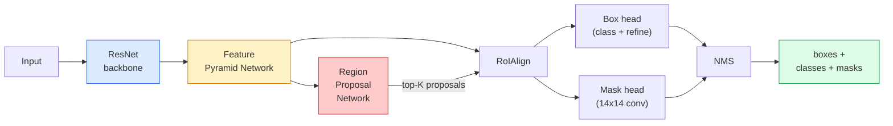

# 인스턴스 세그멘테이션 — Mask R-CNN

> Faster R-CNN 검출기에 작은 마스크 branch를 더하면 인스턴스 세그멘테이션이 됩니다. 어려운 부분은 RoIAlign이고, 보기보다 더 어렵습니다.

**Type:** Build + Learn
**Languages:** Python
**Prerequisites:** Phase 4 Lesson 06 (YOLO), Phase 4 Lesson 07 (U-Net)
**Time:** ~75 minutes

## 학습 목표

- Mask R-CNN 아키텍처를 backbone, FPN, RPN, RoIAlign, box head, mask head까지 end-to-end로 추적하기
- RoIAlign을 처음부터 구현하고 RoIPool이 더 이상 쓰이지 않는 이유를 설명하기
- 프로덕션 품질의 인스턴스 마스크에 torchvision `maskrcnn_resnet50_fpn_v2` pretrained model을 사용하고 출력 형식을 정확히 읽기
- box head와 mask head를 교체하고 backbone을 freeze해 작은 custom dataset에서 Mask R-CNN을 fine-tune하기

## 문제

Semantic segmentation은 클래스마다 하나의 마스크를 제공합니다. Instance segmentation은 두 객체가 같은 클래스를 공유하더라도 객체마다 하나의 마스크를 제공합니다. 개체 수 세기, 프레임 간 추적, 사물 측정(벽에 있는 각 벽돌의 bounding box, 현미경 이미지의 각 세포)은 모두 instance segmentation을 요구합니다.

Mask R-CNN(He et al., 2017)은 instance segmentation을 detection-plus-a-mask로 재구성해 이 문제를 풀었습니다. 설계가 워낙 깔끔해서 이후 5년 동안 거의 모든 instance segmentation 논문은 Mask R-CNN 변형이었고, torchvision 구현은 아직도 small to medium dataset의 프로덕션 기본값입니다.

어려운 엔지니어링 문제는 sampling입니다. 모서리가 픽셀 경계에 맞지 않는 proposal box에서 고정 크기 feature region을 어떻게 crop할까요? 여기서 틀리면 어디서나 mAP가 몇십 분의 1 point 떨어집니다. 답은 RoIAlign입니다.

## 개념

### 아키텍처



이해해야 할 조각은 다섯 가지입니다.

1. **Backbone** — ImageNet에서 훈련된 ResNet-50 또는 ResNet-101입니다. stride 4, 8, 16, 32의 특징 맵 계층을 만듭니다.
2. **FPN(Feature Pyramid Network)** — top-down + lateral connection으로 모든 level에 semantic이 풍부한 C채널 특징을 줍니다. 검출은 객체 크기에 맞는 FPN level을 질의합니다.
3. **RPN(Region Proposal Network)** — 모든 anchor 위치에서 "여기에 객체가 있는가?"와 "박스를 어떻게 보정할까?"를 예측하는 작은 conv head입니다. 이미지마다 약 1000개의 proposal을 만듭니다.
4. **RoIAlign** — 어떤 FPN level의 어떤 box에서도 고정 크기(예: 7x7) feature patch를 sample합니다. Bilinear sampling을 사용하며 quantisation은 없습니다.
5. **Heads** — box를 보정하고 클래스를 고르는 two-layer box head, 그리고 proposal마다 `28x28` 이진 마스크를 출력하는 작은 conv head입니다.

### RoIPool이 아니라 RoIAlign인 이유

원래 Fast R-CNN은 RoIPool을 사용했습니다. RoIPool은 proposal box를 grid로 나누고 각 cell의 최대 feature를 취하며 모든 좌표를 정수로 반올림합니다. 이 반올림 때문에 feature map이 입력 픽셀 좌표에서 feature-map 픽셀 하나까지 어긋납니다. 224x224 이미지에서는 작지만 feature map stride가 32일 때는 치명적입니다.

```text
RoIPool:
  box (34.7, 51.3, 98.2, 142.9)
  round -> (34, 51, 98, 142)
  split grid -> round each cell boundary
  misalignment accumulates at every step

RoIAlign:
  box (34.7, 51.3, 98.2, 142.9)
  sample at exact float coordinates using bilinear interpolation
  no rounding anywhere
```

RoIAlign은 공짜로 COCO의 mask AP를 3-4 point 올립니다. localization을 신경 쓰는 모든 detector는 이제 이것을 사용합니다. YOLOv7 seg, RT-DETR, Mask2Former도 마찬가지입니다.

### RPN 한 문단 설명

feature map의 모든 위치에 다양한 크기와 모양의 K개 anchor box를 놓습니다. 각 anchor에 대해 objectness score와 anchor를 더 잘 맞는 box로 바꿀 regression offset을 예측합니다. 점수 기준 상위 약 1,000개 box를 유지하고 IoU 0.7에서 NMS를 적용한 뒤 살아남은 proposal을 head로 넘깁니다. RPN은 자체 mini-loss로 훈련됩니다. 구조는 Lesson 6의 YOLO loss와 같고, 클래스만 두 개(object / no object)입니다.

### 마스크 head

각 proposal(RoIAlign 이후)에 대해 mask head는 작은 FCN입니다. 네 개의 3x3 conv, 2x deconv, 그리고 `28x28` 해상도에서 `num_classes` 출력 채널을 만드는 마지막 1x1 conv입니다. 예측 클래스에 해당하는 채널만 유지하고 나머지는 무시합니다. 이렇게 하면 mask prediction이 classification과 분리됩니다.

최종 이진 마스크를 만들기 위해 28x28 마스크를 proposal의 원래 픽셀 크기로 upsample합니다.

### 손실

Mask R-CNN에는 네 손실이 더해져 있습니다.

```text
L = L_rpn_cls + L_rpn_box + L_box_cls + L_box_reg + L_mask
```

- `L_rpn_cls`, `L_rpn_box` — RPN proposal의 objectness + box regression입니다.
- `L_box_cls` — head classifier의 (background 포함) (C+1) 클래스 cross-entropy입니다.
- `L_box_reg` — head의 box refinement에 대한 smooth L1입니다.
- `L_mask` — 28x28 mask output의 픽셀별 binary cross-entropy입니다.

각 손실은 자체 기본 weight를 가지며, torchvision 구현은 이것들을 constructor argument로 노출합니다.

### 출력 형식

`torchvision.models.detection.maskrcnn_resnet50_fpn_v2`는 이미지마다 하나씩 dict의 list를 반환합니다.

```text
{
    "boxes":  (N, 4) in (x1, y1, x2, y2) pixel coordinates,
    "labels": (N,) class IDs, 0 = background so indices are 1-based,
    "scores": (N,) confidence scores,
    "masks":  (N, 1, H, W) float masks in [0, 1] — threshold at 0.5 for binary,
}
```

마스크는 이미 전체 이미지 해상도입니다. 28x28 head 출력은 내부에서 upsample되었습니다.

## 직접 만들기

### Step 1: RoIAlign 처음부터 구현하기

이 컴포넌트는 prose보다 코드로 이해하는 편이 더 간단한 Mask R-CNN의 한 부분입니다.

```python
import torch
import torch.nn.functional as F

def roi_align_single(feature, box, output_size=7, spatial_scale=1 / 16.0):
    """
    feature: (C, H, W) single-image feature map
    box: (x1, y1, x2, y2) in original image pixel coordinates
    output_size: side of the output grid (7 for box head, 14 for mask head)
    spatial_scale: reciprocal of the feature map stride
    """
    C, H, W = feature.shape
    x1, y1, x2, y2 = [c * spatial_scale - 0.5 for c in box]
    bin_w = (x2 - x1) / output_size
    bin_h = (y2 - y1) / output_size

    grid_y = torch.linspace(y1 + bin_h / 2, y2 - bin_h / 2, output_size)
    grid_x = torch.linspace(x1 + bin_w / 2, x2 - bin_w / 2, output_size)
    yy, xx = torch.meshgrid(grid_y, grid_x, indexing="ij")

    gx = 2 * (xx + 0.5) / W - 1
    gy = 2 * (yy + 0.5) / H - 1
    grid = torch.stack([gx, gy], dim=-1).unsqueeze(0)
    sampled = F.grid_sample(feature.unsqueeze(0), grid, mode="bilinear",
                            align_corners=False)
    return sampled.squeeze(0)
```

모든 숫자는 bilinear sampling된 위치에 있습니다. 반올림도, quantisation도, 사라지는 gradient도 없습니다.

### Step 2: torchvision의 RoIAlign과 비교하기

```python
from torchvision.ops import roi_align

feature = torch.randn(1, 16, 50, 50)
boxes = torch.tensor([[0, 10, 20, 100, 90]], dtype=torch.float32)  # (batch_idx, x1, y1, x2, y2)

ours = roi_align_single(feature[0], boxes[0, 1:].tolist(), output_size=7, spatial_scale=1/4)
theirs = roi_align(feature, boxes, output_size=(7, 7), spatial_scale=1/4, sampling_ratio=1, aligned=True)[0]

print(f"shape ours:   {tuple(ours.shape)}")
print(f"shape theirs: {tuple(theirs.shape)}")
print(f"max|diff|:    {(ours - theirs).abs().max().item():.3e}")
```

`sampling_ratio=1`과 `aligned=True`를 쓰면 둘은 `1e-5` 이내로 일치합니다.

### Step 3: pretrained Mask R-CNN 불러오기

```python
import torch
from torchvision.models.detection import maskrcnn_resnet50_fpn_v2, MaskRCNN_ResNet50_FPN_V2_Weights

model = maskrcnn_resnet50_fpn_v2(weights=MaskRCNN_ResNet50_FPN_V2_Weights.DEFAULT)
model.eval()
print(f"params: {sum(p.numel() for p in model.parameters()):,}")
print(f"classes (including background): {len(model.roi_heads.box_predictor.cls_score.out_features * [0])}")
```

46M 파라미터, 91개 클래스(COCO)입니다. 첫 클래스(id 0)는 background입니다. 모델이 실제로 검출하는 모든 것은 id 1부터 시작합니다.

### Step 4: inference 실행하기

```python
with torch.no_grad():
    x = torch.randn(3, 400, 600)
    predictions = model([x])
p = predictions[0]
print(f"boxes:  {tuple(p['boxes'].shape)}")
print(f"labels: {tuple(p['labels'].shape)}")
print(f"scores: {tuple(p['scores'].shape)}")
print(f"masks:  {tuple(p['masks'].shape)}")
```

마스크 텐서는 shape `(N, 1, H, W)`입니다. 객체별 이진 마스크를 얻으려면 0.5에서 threshold합니다.

```python
binary_masks = (p['masks'] > 0.5).squeeze(1)  # (N, H, W) boolean
```

### Step 5: custom class count에 맞게 head 교체하기

흔한 fine-tuning recipe입니다. backbone, FPN, RPN은 재사용하고 두 classifier head를 교체합니다.

```python
from torchvision.models.detection.faster_rcnn import FastRCNNPredictor
from torchvision.models.detection.mask_rcnn import MaskRCNNPredictor

def build_custom_maskrcnn(num_classes):
    model = maskrcnn_resnet50_fpn_v2(weights=MaskRCNN_ResNet50_FPN_V2_Weights.DEFAULT)
    in_features = model.roi_heads.box_predictor.cls_score.in_features
    model.roi_heads.box_predictor = FastRCNNPredictor(in_features, num_classes)
    in_features_mask = model.roi_heads.mask_predictor.conv5_mask.in_channels
    hidden_layer = 256
    model.roi_heads.mask_predictor = MaskRCNNPredictor(in_features_mask, hidden_layer, num_classes)
    return model

custom = build_custom_maskrcnn(num_classes=5)
print(f"custom cls_score.out_features: {custom.roi_heads.box_predictor.cls_score.out_features}")
```

`num_classes`에는 background class가 포함되어야 하므로, 객체 클래스가 4개인 데이터셋은 `num_classes=5`를 사용합니다.

### Step 6: 훈련할 필요가 없는 부분 freeze하기

작은 데이터셋에서는 backbone과 FPN을 freeze합니다. RPN objectness + regression과 두 head만 학습합니다.

```python
def freeze_backbone_and_fpn(model):
    # torchvision Mask R-CNN packs the FPN inside `model.backbone` (as
    # `model.backbone.fpn`), so iterating `model.backbone.parameters()` covers
    # both the ResNet feature layers and the FPN lateral/output convs.
    for p in model.backbone.parameters():
        p.requires_grad = False
    return model

custom = freeze_backbone_and_fpn(custom)
trainable = sum(p.numel() for p in custom.parameters() if p.requires_grad)
print(f"trainable after freeze: {trainable:,}")
```

500-image 데이터셋에서는 이것이 수렴과 overfitting을 가르는 차이입니다.

## 사용하기

torchvision에서 Mask R-CNN의 전체 training loop는 40줄이며 작업이 바뀌어도 의미 있게 달라지지 않습니다. dataset만 바꾸고 실행하면 됩니다.

```python
def train_step(model, images, targets, optimizer):
    model.train()
    loss_dict = model(images, targets)
    losses = sum(loss for loss in loss_dict.values())
    optimizer.zero_grad()
    losses.backward()
    optimizer.step()
    return {k: v.item() for k, v in loss_dict.items()}
```

`targets` list에는 이미지별 dict가 있어야 하며, 각 dict는 `boxes`, `labels`, `masks`(`(num_instances, H, W)` 이진 텐서)를 포함해야 합니다. 모델은 훈련 중에는 네 손실의 dict를 반환하고 eval 중에는 예측 list를 반환합니다. 이는 `model.training`에 의해 결정됩니다.

`pycocotools` evaluator는 boxes와 masks 모두에 대해 mAP@IoU=0.5:0.95를 만듭니다. box head와 mask head 중 어느 쪽이 병목인지 알려면 두 숫자가 모두 필요합니다.

## 배포하기

이 수업의 산출물은 다음과 같습니다.

- `outputs/prompt-instance-vs-semantic-router.md` — 세 가지 질문을 하고 instance vs semantic vs panoptic과 시작할 정확한 모델을 고르는 프롬프트입니다.
- `outputs/skill-mask-rcnn-head-swapper.md` — 새 `num_classes`가 주어졌을 때 어떤 torchvision detection model에서든 head를 교체하는 10줄 코드를 생성하는 스킬입니다.

## 연습 문제

1. **(쉬움)** 무작위 box 100개에서 RoIAlign을 `torchvision.ops.roi_align`과 비교 검증하세요. 최대 절댓값 차이를 보고하세요. RoIPool(2017년 이전 동작)도 실행해 경계 근처 box에서 약 1-2 feature-map pixel만큼 벌어지는 것을 보이세요.
2. **(중간)** 50-image custom dataset(두 클래스 아무거나: balloons, fish, pothole, logos)에서 `maskrcnn_resnet50_fpn_v2`를 fine-tune하세요. backbone을 freeze하고 20 epoch 훈련한 뒤 mask AP@0.5를 보고하세요.
3. **(어려움)** Mask R-CNN의 mask head를 28x28 대신 56x56을 예측하는 것으로 교체하세요. 전후의 mAP@IoU=0.75를 측정하세요. 향상(또는 향상 없음)이 예상되는 boundary-precision / memory trade-off와 왜 맞는지 설명하세요.

## 핵심 용어

| 용어 | 사람들이 하는 말 | 실제 의미 |
|------|----------------|----------------------|
| Mask R-CNN | "Detection plus masks" | Faster R-CNN + proposal마다 클래스별 28x28 마스크를 예측하는 작은 FCN head |
| FPN | "Feature pyramid" | 모든 stride level에 semantic이 풍부한 C채널 특징을 주는 top-down + lateral connection |
| RPN | "Region proposer" | 이미지마다 약 1000개의 object/no-object proposal을 만드는 작은 conv head |
| RoIAlign | "No-rounding crop" | float-coordinate box에서 고정 크기 feature grid를 bilinear로 sample합니다 |
| RoIPool | "Pre-2017 crop" | RoIAlign과 목적은 같지만 box 좌표를 반올림합니다. 이제 obsolete입니다 |
| Mask AP | "Instance mAP" | box IoU 대신 mask IoU로 계산한 average precision입니다. COCO instance segmentation 지표입니다 |
| Binary mask head | "Per-class mask" | 각 proposal마다 클래스별 이진 마스크 하나를 예측합니다. 예측 클래스의 채널만 유지합니다 |
| Background class | "Class 0" | "객체 없음"을 모두 받는 클래스입니다. 실제 클래스 인덱스는 1부터 시작합니다 |

## 더 읽을거리

- [Mask R-CNN (He et al., 2017)](https://arxiv.org/abs/1703.06870) — 원 논문입니다. RoIAlign에 대한 section 3이 핵심입니다
- [FPN: Feature Pyramid Networks (Lin et al., 2017)](https://arxiv.org/abs/1612.03144) — FPN 논문입니다. 모든 현대 detector가 사용합니다
- [torchvision Mask R-CNN tutorial](https://pytorch.org/tutorials/intermediate/torchvision_tutorial.html) — fine-tuning loop의 기준입니다
- [Detectron2 model zoo](https://github.com/facebookresearch/detectron2/blob/main/MODEL_ZOO.md) — 거의 모든 detection 및 segmentation 변형의 훈련된 weight를 가진 프로덕션 구현입니다
