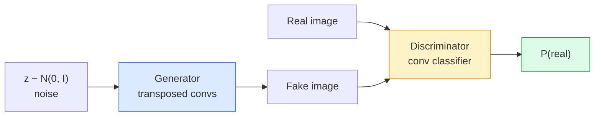
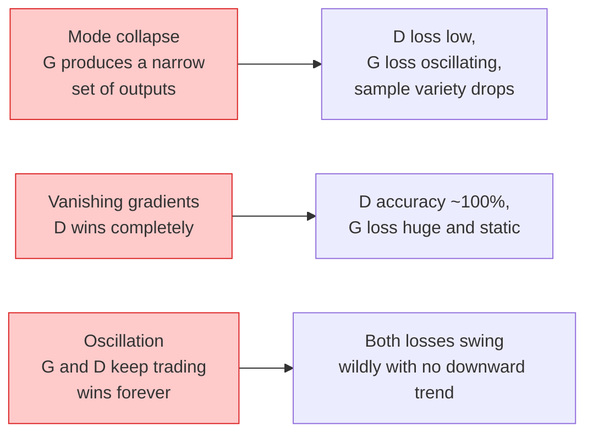

# 이미지 생성 — GAN

> GAN은 고정된 게임을 하는 두 신경망입니다. 하나는 그리고, 하나는 비평합니다. 둘은 함께 나아지다가 결국 그림이 비평가를 속입니다.

**Type:** Build
**Languages:** Python
**Prerequisites:** Phase 4 Lesson 03 (CNNs), Phase 3 Lesson 06 (Optimizers), Phase 3 Lesson 07 (Regularization)
**Time:** ~75 minutes

## 학습 목표

- generator와 discriminator 사이의 minimax game을 설명하고, equilibrium이 왜 p_model = p_data에 대응하는지 설명하기
- PyTorch로 DCGAN을 구현하고 60줄 이내로 일관된 32x32 synthetic image를 생성하게 만들기
- non-saturating loss, spectral norm, TTUR(two-timescale update rule)라는 세 가지 표준 trick으로 GAN training을 안정화하기
- healthy convergence와 mode collapse, oscillation, discriminator-wins-completely를 구분하는 training curve 읽기

## 문제

Classification은 네트워크가 이미지를 label로 매핑하도록 가르칩니다. Generation은 문제를 뒤집습니다. 같은 distribution에서 나온 것처럼 보이는 새 이미지를 sample합니다. diff할 수 있는 "정답" output은 없습니다. 모방하고 싶은 distribution만 있습니다.

표준 loss function(MSE, cross-entropy)은 "이 sample이 real distribution에서 왔는가"를 측정할 수 없습니다. Per-pixel error를 최소화하면 realistic sample이 아니라 흐릿한 평균이 나옵니다. 돌파구는 loss를 학습하는 것이었습니다. real과 fake를 구분하는 일을 하는 두 번째 network를 훈련하고, 그 판단을 사용해 generator를 밀어붙입니다.

GAN(Goodfellow et al., 2014)은 이 framework를 정의했습니다. 2018년에는 StyleGAN이 사진과 구분할 수 없는 1024x1024 얼굴을 만들고 있었습니다. 이후 diffusion model이 품질과 제어성에서 왕좌를 차지했지만, diffusion을 실용적으로 만드는 모든 trick, 즉 normalisation 선택, latent space, feature loss는 GAN에서 먼저 이해되었습니다.

## 개념

### 두 네트워크



**Generator** G는 noise vector `z`를 받아 image를 출력합니다. **Discriminator** D는 image를 받아 단일 scalar, 즉 그 image가 real일 확률을 출력합니다.

### 게임

G는 D가 틀리기를 원합니다. D는 맞히기를 원합니다. 형식적으로는 다음과 같습니다.

```text
min_G max_D  E_x[log D(x)] + E_z[log(1 - D(G(z)))]
```

오른쪽에서 왼쪽으로 읽어보면 D는 real image(`log D(real)`)와 fake image(`log (1 - D(fake))`)에 대한 accuracy를 최대화합니다. G는 fake에 대한 D의 accuracy를 최소화합니다. 즉 `D(G(z))`가 높아지기를 원합니다.

Goodfellow는 이 minimax가 `p_G = p_data`이고, D가 모든 곳에서 0.5를 출력하며, generated distribution과 real distribution 사이의 Jensen-Shannon divergence가 0인 global equilibrium을 가진다는 것을 증명했습니다. 어려운 부분은 거기에 도달하는 것입니다.

### Non-saturating loss

위 형태는 수치적으로 불안정합니다. 훈련 초기에 모든 fake에 대해 `D(G(z))`가 0에 가깝기 때문에 `log(1 - D(G(z)))`는 G에 대한 gradient가 사라집니다. 해결책은 G의 loss를 뒤집는 것입니다.

```text
L_D = -E_x[log D(x)] - E_z[log(1 - D(G(z)))]
L_G = -E_z[log D(G(z))]                          # non-saturating
```

이제 `D(G(z))`가 0에 가까우면 G의 loss가 크고 gradient가 유용합니다. 모든 현대 GAN은 이 변형으로 훈련합니다.

### DCGAN 아키텍처 규칙

Radford, Metz, Chintala(2015)는 수년간 실패한 실험을 GAN training을 안정적으로 만드는 다섯 가지 규칙으로 정리했습니다.

1. Pooling을 strided conv로 교체합니다(두 net 모두).
2. Generator와 discriminator 모두에서 batch norm을 사용하되, G의 output과 D의 input은 제외합니다.
3. 깊은 architecture에서 fully connected layer를 제거합니다.
4. G는 output을 제외한 모든 layer에 ReLU를 사용합니다(output은 [-1, 1] 범위의 tanh).
5. D는 모든 layer에 LeakyReLU(negative_slope=0.2)를 사용합니다.

모든 현대 conv-based GAN(StyleGAN, BigGAN, GigaGAN)은 여전히 이 규칙에서 시작해 조각을 하나씩 교체합니다.

### 실패 모드와 그 신호



- **Mode collapse**: G가 D를 속이는 image 하나를 찾아 그것만 생성합니다. 해결: minibatch discrimination, spectral norm, label-conditioning을 추가합니다.
- **Discriminator wins**: D가 너무 빠르게 강해져 G의 gradient가 사라집니다. 해결: 더 작은 D, 더 낮은 D learning rate, 또는 real label에 label smoothing을 적용합니다.
- **Oscillation**: 두 net이 equilibrium에 접근하지 못하고 계속 승패를 주고받습니다. 해결: TTUR(D가 G보다 2-4배 빠르게 학습), 또는 Wasserstein loss로 전환합니다.

### 평가

GAN에는 ground truth가 없습니다. 그렇다면 잘 동작하는지 어떻게 알 수 있을까요?

- **Sample inspection** — epoch가 끝날 때마다 64개 sample을 직접 봅니다. 타협할 수 없습니다.
- **FID(Fréchet Inception Distance)** — real set과 generated set의 Inception-v3 feature distribution 사이의 거리입니다. 낮을수록 좋습니다. 커뮤니티 표준입니다.
- **Inception Score** — 더 오래되고 더 취약합니다. FID를 선호하세요.
- **Precision/Recall for generative models** — quality(precision)와 coverage(recall)를 따로 측정합니다. FID만 보는 것보다 더 유익합니다.

작은 synthetic-data run에서는 sample inspection으로 충분합니다.

## 직접 만들기

### Step 1: Generator

64-dim noise를 받아 32x32 image를 만드는 작은 DCGAN generator입니다.

```python
import torch
import torch.nn as nn

class Generator(nn.Module):
    def __init__(self, z_dim=64, img_channels=3, feat=64):
        super().__init__()
        self.net = nn.Sequential(
            nn.ConvTranspose2d(z_dim, feat * 4, kernel_size=4, stride=1, padding=0, bias=False),
            nn.BatchNorm2d(feat * 4),
            nn.ReLU(inplace=True),
            nn.ConvTranspose2d(feat * 4, feat * 2, kernel_size=4, stride=2, padding=1, bias=False),
            nn.BatchNorm2d(feat * 2),
            nn.ReLU(inplace=True),
            nn.ConvTranspose2d(feat * 2, feat, kernel_size=4, stride=2, padding=1, bias=False),
            nn.BatchNorm2d(feat),
            nn.ReLU(inplace=True),
            nn.ConvTranspose2d(feat, img_channels, kernel_size=4, stride=2, padding=1, bias=False),
            nn.Tanh(),
        )

    def forward(self, z):
        return self.net(z.view(z.size(0), -1, 1, 1))
```

네 개의 transposed conv를 사용하고, 각 conv는 `kernel_size=4, stride=2, padding=1`이므로 공간 크기를 깔끔하게 두 배로 만듭니다. Output activation은 tanh를 통해 [-1, 1] 범위에 있습니다.

### Step 2: Discriminator

Generator의 mirror입니다. LeakyReLU와 strided conv를 사용하고 scalar logit으로 끝납니다.

```python
class Discriminator(nn.Module):
    def __init__(self, img_channels=3, feat=64):
        super().__init__()
        self.net = nn.Sequential(
            nn.Conv2d(img_channels, feat, kernel_size=4, stride=2, padding=1),
            nn.LeakyReLU(0.2, inplace=True),
            nn.Conv2d(feat, feat * 2, kernel_size=4, stride=2, padding=1, bias=False),
            nn.BatchNorm2d(feat * 2),
            nn.LeakyReLU(0.2, inplace=True),
            nn.Conv2d(feat * 2, feat * 4, kernel_size=4, stride=2, padding=1, bias=False),
            nn.BatchNorm2d(feat * 4),
            nn.LeakyReLU(0.2, inplace=True),
            nn.Conv2d(feat * 4, 1, kernel_size=4, stride=1, padding=0),
        )

    def forward(self, x):
        return self.net(x).view(-1)
```

마지막 conv는 `4x4` feature map을 `1x1`로 줄입니다. Output은 image마다 단일 scalar입니다. sigmoid는 loss 계산 중에만 적용합니다.

### Step 3: Training step

번갈아 진행합니다. batch마다 D를 한 번 update한 뒤 G를 한 번 update합니다.

```python
import torch.nn.functional as F

def train_step(G, D, real, z, opt_g, opt_d, device):
    real = real.to(device)
    bs = real.size(0)

    # D step
    opt_d.zero_grad()
    d_real = D(real)
    d_fake = D(G(z).detach())
    loss_d = (F.binary_cross_entropy_with_logits(d_real, torch.ones_like(d_real))
              + F.binary_cross_entropy_with_logits(d_fake, torch.zeros_like(d_fake)))
    loss_d.backward()
    opt_d.step()

    # G step
    opt_g.zero_grad()
    d_fake = D(G(z))
    loss_g = F.binary_cross_entropy_with_logits(d_fake, torch.ones_like(d_fake))
    loss_g.backward()
    opt_g.step()

    return loss_d.item(), loss_g.item()
```

D step의 `G(z).detach()`는 중요합니다. D update 중에는 gradient가 G로 흐르지 않아야 합니다. 이것을 잊는 것이 고전적인 beginner bug입니다.

### Step 4: Synthetic shape에서 전체 training loop

```python
from torch.utils.data import DataLoader, TensorDataset
import numpy as np

def synthetic_images(num=2000, size=32, seed=0):
    rng = np.random.default_rng(seed)
    imgs = np.zeros((num, 3, size, size), dtype=np.float32) - 1.0
    for i in range(num):
        r = rng.uniform(6, 12)
        cx, cy = rng.uniform(r, size - r, size=2)
        yy, xx = np.meshgrid(np.arange(size), np.arange(size), indexing="ij")
        mask = (xx - cx) ** 2 + (yy - cy) ** 2 < r ** 2
        color = rng.uniform(-0.5, 1.0, size=3)
        for c in range(3):
            imgs[i, c][mask] = color[c]
    return torch.from_numpy(imgs)

device = "cuda" if torch.cuda.is_available() else "cpu"
data = synthetic_images()
loader = DataLoader(TensorDataset(data), batch_size=64, shuffle=True)

G = Generator(z_dim=64, img_channels=3, feat=32).to(device)
D = Discriminator(img_channels=3, feat=32).to(device)
opt_g = torch.optim.Adam(G.parameters(), lr=2e-4, betas=(0.5, 0.999))
opt_d = torch.optim.Adam(D.parameters(), lr=2e-4, betas=(0.5, 0.999))

for epoch in range(10):
    for (batch,) in loader:
        z = torch.randn(batch.size(0), 64, device=device)
        ld, lg = train_step(G, D, batch, z, opt_g, opt_d, device)
    print(f"epoch {epoch}  D {ld:.3f}  G {lg:.3f}")
```

`Adam(lr=2e-4, betas=(0.5, 0.999))`는 DCGAN 기본값입니다. 낮은 beta1은 momentum term이 adversarial game을 지나치게 안정화하지 않도록 합니다.

### Step 5: Sampling

```python
@torch.no_grad()
def sample(G, n=16, z_dim=64, device="cpu"):
    G.eval()
    z = torch.randn(n, z_dim, device=device)
    imgs = G(z)
    imgs = (imgs + 1) / 2
    return imgs.clamp(0, 1)
```

Sampling 전에는 항상 eval mode로 전환합니다. DCGAN에서는 batch의 stats 대신 batch norm running stats를 사용하므로 이것이 중요합니다.

### Step 6: Spectral normalisation

Discriminator의 BN을 대체하는 drop-in 방식으로, network가 1-Lipschitz임을 보장합니다. 대부분의 "D wins too hard" 실패를 고칩니다.

```python
from torch.nn.utils import spectral_norm

def build_sn_discriminator(img_channels=3, feat=64):
    return nn.Sequential(
        spectral_norm(nn.Conv2d(img_channels, feat, 4, 2, 1)),
        nn.LeakyReLU(0.2, inplace=True),
        spectral_norm(nn.Conv2d(feat, feat * 2, 4, 2, 1)),
        nn.LeakyReLU(0.2, inplace=True),
        spectral_norm(nn.Conv2d(feat * 2, feat * 4, 4, 2, 1)),
        nn.LeakyReLU(0.2, inplace=True),
        spectral_norm(nn.Conv2d(feat * 4, 1, 4, 1, 0)),
    )
```

`Discriminator`를 `build_sn_discriminator()`로 바꾸면 TTUR trick이 필요 없는 경우가 많습니다. Spectral norm은 적용할 수 있는 가장 쉬운 단일 robustness upgrade입니다.

## 활용하기

진지한 generation에는 pretrained weight를 사용하거나 diffusion으로 전환하세요. 두 가지 표준 library가 있습니다.

- `torch_fidelity`는 custom eval code를 작성하지 않고도 generator의 FID / IS를 계산합니다.
- `pytorch-gan-zoo`(legacy)와 `StudioGAN`은 DCGAN, WGAN-GP, SN-GAN, StyleGAN, BigGAN의 검증된 구현을 제공합니다.

2026년에도 GAN은 real-time image generation(latency <10 ms), style transfer, 정밀한 제어가 필요한 image-to-image translation(Pix2Pix, CycleGAN)에 가장 좋은 선택입니다. Diffusion은 photorealism과 text conditioning에서 이깁니다.

## 출시하기

이 lesson은 다음을 만듭니다.

- `outputs/prompt-gan-training-triage.md` — training curve description을 읽고 failure mode(mode collapse, D-wins, oscillation)와 단일 권장 fix를 고르는 prompt입니다.
- `outputs/skill-dcgan-scaffold.md` — `z_dim`, target `image_size`, `num_channels`에서 training loop와 sample saver를 포함한 DCGAN scaffold를 작성하는 skill입니다.

## 연습문제

1. **(Easy)** 위 DCGAN을 synthetic circle dataset에서 훈련하고 각 epoch 끝에 16개 sample grid를 저장하세요. Generated circle이 몇 번째 epoch부터 명확히 circular해지나요?
2. **(Medium)** Discriminator의 batch norm을 spectral norm으로 교체하세요. 두 version을 나란히 훈련하세요. 어느 쪽이 더 빠르게 수렴하나요? 세 seed에서 variance가 더 낮은 쪽은 어느 쪽인가요?
3. **(Hard)** Conditional DCGAN을 구현하세요. class label을 G와 D 모두에 넣습니다(G에서는 noise에 one-hot을 concat하고, D에서는 class embedding channel을 concat). Lesson 7의 synthetic "circles vs squares" dataset에서 훈련하고 specific label로 sampling해 class conditioning이 동작함을 보이세요.

## 핵심 용어

| 용어 | 사람들이 말하는 방식 | 실제 의미 |
|------|----------------|----------------------|
| Generator (G) | "무언가를 그리는 net" | Noise를 image로 매핑합니다. discriminator를 속이도록 훈련됩니다 |
| Discriminator (D) | "비평가" | Binary classifier입니다. real image와 generated image를 구분하도록 훈련됩니다 |
| Minimax | "게임" | Adversarial loss에 대해 G는 min, D는 max를 취합니다. equilibrium은 p_G = p_data입니다 |
| Non-saturating loss | "수치적으로 정상적인 버전" | 훈련 초기에 vanishing gradient를 피하기 위해 G의 loss를 log(1 - D(G(z))) 대신 -log(D(G(z)))로 둡니다 |
| Mode collapse | "Generator가 한 가지만 만듦" | G가 data distribution의 작은 부분집합만 생성합니다. SN, minibatch discrimination, 더 큰 batch로 고칩니다 |
| TTUR | "두 learning rate" | D가 보통 2-4배 빠르게 G보다 학습합니다. training을 안정화합니다 |
| Spectral norm | "1-Lipschitz layer" | 각 layer의 Lipschitz constant를 제한하는 weight-normalisation입니다. D가 임의로 가팔라지는 것을 막습니다 |
| FID | "Fréchet Inception Distance" | real set과 generated set의 Inception-v3 feature distribution 사이의 거리입니다. 표준 evaluation metric입니다 |

## 더 읽기

- [Generative Adversarial Networks (Goodfellow et al., 2014)](https://arxiv.org/abs/1406.2661) — 이 모든 것을 시작한 논문
- [DCGAN (Radford, Metz, Chintala, 2015)](https://arxiv.org/abs/1511.06434) — GAN을 trainable하게 만든 architecture 규칙
- [Spectral Normalization for GANs (Miyato et al., 2018)](https://arxiv.org/abs/1802.05957) — 가장 유용한 단일 stabilisation trick
- [StyleGAN3 (Karras et al., 2021)](https://arxiv.org/abs/2106.12423) — SOTA GAN입니다. 지난 10년의 모든 trick을 모은 greatest-hits album처럼 읽힙니다
