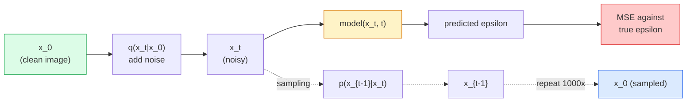

# 이미지 생성 — Diffusion Models

> Diffusion model은 denoise하는 법을 배웁니다. Noisy image에서 아주 작은 noise를 제거하도록 훈련하고, 그것을 거꾸로 천 번 반복하면 image generator가 됩니다.

**Type:** Build
**Languages:** Python
**Prerequisites:** Phase 4 Lesson 07 (U-Net), Phase 1 Lesson 06 (Probability), Phase 3 Lesson 06 (Optimizers)
**Time:** ~75 minutes

## 학습 목표

- Forward noising process `x_0 -> x_1 -> ... -> x_T`를 유도하고, closed-form `q(x_t | x_0)`가 임의의 t에서 왜 성립하는지 설명하기
- 각 step에서 추가된 noise를 회귀하는 DDPM-style training objective와 pure noise에서 image로 되돌아가는 sampler 구현하기
- 임의의 timestep에 대한 noise를 예측하는 time-conditioned U-Net을 CPU에서도 훈련할 수 있을 만큼 작게 만들기
- DDPM sampling과 DDIM sampling의 차이, 그리고 각각이 적절한 경우를 설명하기(Lesson 23에서는 flow matching과 rectified flow를 깊게 다룹니다)

## 문제

GAN은 one-shot으로 생성합니다. Noise가 들어가고, image가 나오며, forward pass는 한 번입니다. 빠르지만 훈련하기 어렵습니다. Diffusion model은 반복적으로 생성합니다. Pure noise에서 시작해 작은 step으로 denoise하면 image가 나타납니다. 느리지만 훈련하기 쉽습니다. 지난 5년 동안은 후자의 특성이 지배했습니다. 작은 팀도 diffusion model을 훈련해 합리적인 sample을 얻을 수 있지만, GAN training은 수년간 실패한 run을 통해 배우는 craft입니다.

Training stability를 넘어, diffusion의 iterative structure는 현대 image generation이 하는 모든 것을 열어줍니다. text conditioning, inpainting, image editing, super-resolution, controllable style이 모두 여기에 해당합니다. Sampling loop의 각 step은 새로운 constraint를 주입할 수 있는 지점입니다. 이 hook 때문에 Stable Diffusion, Imagen, DALL-E 3, Midjourney, 그리고 사용하게 될 모든 controllable image model은 diffusion 기반입니다.

이 lesson은 최소 DDPM을 만듭니다. forward noising, backward denoising, training loop입니다. 다음 lesson(Stable Diffusion)은 VAE, text encoder, classifier-free guidance를 붙여 production system으로 연결합니다.

## 개념

### Forward process

Image `x_0`를 가져옵니다. Gaussian noise를 아주 조금 더해 `x_1`을 만듭니다. 조금 더 더해 `x_2`를 만듭니다. `x_T`가 pure Gaussian noise와 거의 구분되지 않을 때까지 T step 동안 계속합니다.

```text
q(x_t | x_{t-1}) = N(x_t; sqrt(1 - beta_t) * x_{t-1},  beta_t * I)
```

`beta_t`는 작은 variance schedule이며, 보통 T=1000 step에 걸쳐 0.0001에서 0.02까지 linear하게 증가합니다. 각 step은 signal을 조금 줄이고 fresh noise를 주입합니다.

### Closed-form jump

한 step씩 noise를 더하는 것은 Markov chain이지만, 수학은 접힙니다. `x_0`에서 `x_t`를 한 번에 직접 sample할 수 있습니다.

```text
Define alpha_t = 1 - beta_t
Define alpha_bar_t = prod_{s=1..t} alpha_s

Then:
  q(x_t | x_0) = N(x_t; sqrt(alpha_bar_t) * x_0,  (1 - alpha_bar_t) * I)

Equivalently:
  x_t = sqrt(alpha_bar_t) * x_0 + sqrt(1 - alpha_bar_t) * epsilon
  where epsilon ~ N(0, I)
```

이 단일 equation이 diffusion을 실용적으로 만드는 전체 이유입니다. Training 중에는 random `t`를 고르고, `x_0`에서 `x_t`를 직접 sample한 뒤 한 step으로 훈련합니다. 전체 Markov chain을 simulation할 필요가 없습니다.

### Reverse process

Forward process는 고정되어 있습니다. Reverse process `p(x_{t-1} | x_t)`는 neural network가 학습하는 것입니다. Diffusion model은 `x_{t-1}`를 직접 예측하지 않습니다. step t에서 추가된 noise `epsilon`을 예측하고, 수학이 그것으로부터 `x_{t-1}`를 유도합니다.



### Training loss

모든 training step은 다음과 같습니다.

1. Real image `x_0`를 sample합니다.
2. Timestep `t`를 [1, T]에서 uniform하게 sample합니다.
3. Noise `epsilon ~ N(0, I)`를 sample합니다.
4. `x_t = sqrt(alpha_bar_t) * x_0 + sqrt(1 - alpha_bar_t) * epsilon`을 계산합니다.
5. Network로 `epsilon_theta(x_t, t)`를 예측합니다.
6. `|| epsilon - epsilon_theta(x_t, t) ||^2`를 최소화합니다.

이게 전부입니다. Neural network는 임의의 timestep에서 noise를 예측하는 법을 배웁니다. Loss는 MSE입니다. Adversarial game도, collapse도, oscillation도 없습니다.

### Sampler (DDPM)

생성하려면 `x_T ~ N(0, I)`에서 시작해 한 step씩 거꾸로 걸어갑니다.

```text
for t = T, T-1, ..., 1:
    eps = model(x_t, t)
    x_{t-1} = (1 / sqrt(alpha_t)) * (x_t - (beta_t / sqrt(1 - alpha_bar_t)) * eps) + sqrt(beta_t) * z
    where z ~ N(0, I) if t > 1, else 0
return x_0
```

핵심은 reverse conditional이 일반적으로 closed form으로 알려져 있지 않더라도, 이 특정 Gaussian forward process에서는 알려져 있다는 점입니다. 보기 흉한 coefficient는 Bayes' rule이 주는 것입니다.

### 왜 1000 step인가

Forward noise schedule은 각 step이 reverse step을 거의 Gaussian으로 만들 만큼만 noise를 추가하도록 선택됩니다. Step이 너무 적으면 reverse step이 Gaussian에서 멀어져 network가 잘 modeling할 수 없습니다. Step이 너무 많으면 sampling이 비싸지고 이득은 줄어듭니다. Linear schedule에서 T=1000은 DDPM 기본값입니다.

### DDIM: 20배 빠른 sampling

Training은 같습니다. Sampling이 바뀝니다. DDIM(Song et al., 2020)은 retraining 없이 timestep을 건너뛰는 deterministic reverse process를 정의합니다. DDIM으로 50 step sampling을 하면 1000-step DDPM에 가까운 품질이 나옵니다. 모든 production system은 DDIM 또는 더 빠른 변형(DPM-Solver, Euler ancestral)을 사용합니다.

### Time conditioning

Network `epsilon_theta(x_t, t)`는 자신이 denoise하는 timestep을 알아야 합니다. 현대 diffusion model은 sinusoidal time embedding(transformer의 positional encoding과 같은 아이디어)을 통해 `t`를 주입하고, 그것을 모든 U-Net level의 feature map에 더합니다.

```text
t_embedding = sinusoidal(t)
feature_map += MLP(t_embedding)
```

Time conditioning이 없으면 network는 image 자체에서 noise level을 추측해야 합니다. 동작은 하지만 sample-efficiency가 훨씬 낮습니다.

## 직접 만들기

### Step 1: Noise schedule

```python
import torch

def linear_beta_schedule(T=1000, beta_start=1e-4, beta_end=2e-2):
    return torch.linspace(beta_start, beta_end, T)


def precompute_schedule(betas):
    alphas = 1.0 - betas
    alphas_cumprod = torch.cumprod(alphas, dim=0)
    return {
        "betas": betas,
        "alphas": alphas,
        "alphas_cumprod": alphas_cumprod,
        "sqrt_alphas_cumprod": torch.sqrt(alphas_cumprod),
        "sqrt_one_minus_alphas_cumprod": torch.sqrt(1.0 - alphas_cumprod),
        "sqrt_recip_alphas": torch.sqrt(1.0 / alphas),
    }

schedule = precompute_schedule(linear_beta_schedule(T=1000))
```

한 번 precompute하고, training과 sampling 중에는 index로 gather합니다.

### Step 2: Forward diffusion (q_sample)

```python
def q_sample(x0, t, noise, schedule):
    sqrt_a = schedule["sqrt_alphas_cumprod"][t].view(-1, 1, 1, 1)
    sqrt_one_minus_a = schedule["sqrt_one_minus_alphas_cumprod"][t].view(-1, 1, 1, 1)
    return sqrt_a * x0 + sqrt_one_minus_a * noise
```

한 줄짜리 closed form입니다. `t`는 batch의 image마다 하나씩 있는 timestep batch입니다.

### Step 3: 작은 time-conditioned U-Net

```python
import torch.nn as nn
import torch.nn.functional as F
import math

def timestep_embedding(t, dim=64):
    half = dim // 2
    freqs = torch.exp(-math.log(10000) * torch.arange(half, device=t.device) / half)
    args = t[:, None].float() * freqs[None]
    emb = torch.cat([args.sin(), args.cos()], dim=-1)
    return emb


class TinyUNet(nn.Module):
    def __init__(self, img_channels=3, base=32, t_dim=64):
        super().__init__()
        self.t_mlp = nn.Sequential(
            nn.Linear(t_dim, base * 4),
            nn.SiLU(),
            nn.Linear(base * 4, base * 4),
        )
        self.t_dim = t_dim
        self.enc1 = nn.Conv2d(img_channels, base, 3, padding=1)
        self.enc2 = nn.Conv2d(base, base * 2, 4, stride=2, padding=1)
        self.mid = nn.Conv2d(base * 2, base * 2, 3, padding=1)
        self.dec1 = nn.ConvTranspose2d(base * 2, base, 4, stride=2, padding=1)
        self.dec2 = nn.Conv2d(base * 2, img_channels, 3, padding=1)
        self.time_proj = nn.Linear(base * 4, base * 2)

    def forward(self, x, t):
        t_emb = timestep_embedding(t, self.t_dim)
        t_emb = self.t_mlp(t_emb)
        t_proj = self.time_proj(t_emb)[:, :, None, None]

        h1 = F.silu(self.enc1(x))
        h2 = F.silu(self.enc2(h1)) + t_proj
        h3 = F.silu(self.mid(h2))
        d1 = F.silu(self.dec1(h3))
        d2 = torch.cat([d1, h1], dim=1)
        return self.dec2(d2)
```

Bottleneck에 time conditioning을 주입하는 two-level U-Net입니다. Real image에는 depth와 width를 키우세요.

### Step 4: Training loop

```python
def train_step(model, x0, schedule, optimizer, device, T=1000):
    model.train()
    x0 = x0.to(device)
    bs = x0.size(0)
    t = torch.randint(0, T, (bs,), device=device)
    noise = torch.randn_like(x0)
    x_t = q_sample(x0, t, noise, schedule)
    pred = model(x_t, t)
    loss = F.mse_loss(pred, noise)
    optimizer.zero_grad()
    loss.backward()
    optimizer.step()
    return loss.item()
```

이것이 전체 training loop입니다. GAN game도, specialised loss도 없고, MSE call 하나뿐입니다.

### Step 5: Sampler (DDPM)

```python
@torch.no_grad()
def sample(model, schedule, shape, T=1000, device="cpu"):
    model.eval()
    x = torch.randn(shape, device=device)
    betas = schedule["betas"].to(device)
    sqrt_one_minus_a = schedule["sqrt_one_minus_alphas_cumprod"].to(device)
    sqrt_recip_alphas = schedule["sqrt_recip_alphas"].to(device)

    for t in reversed(range(T)):
        t_batch = torch.full((shape[0],), t, dtype=torch.long, device=device)
        eps = model(x, t_batch)
        coef = betas[t] / sqrt_one_minus_a[t]
        mean = sqrt_recip_alphas[t] * (x - coef * eps)
        if t > 0:
            x = mean + torch.sqrt(betas[t]) * torch.randn_like(x)
        else:
            x = mean
    return x
```

한 batch의 sample을 만들려면 forward pass 1000번이 필요합니다. Real code에서는 이것을 DDIM 50-step sampler로 바꿀 것입니다.

### Step 6: DDIM sampler (deterministic, 약 20배 빠름)

```python
@torch.no_grad()
def sample_ddim(model, schedule, shape, steps=50, T=1000, device="cpu", eta=0.0):
    model.eval()
    x = torch.randn(shape, device=device)
    alphas_cumprod = schedule["alphas_cumprod"].to(device)

    ts = torch.linspace(T - 1, 0, steps + 1).long()
    for i in range(steps):
        t = ts[i]
        t_prev = ts[i + 1]
        t_batch = torch.full((shape[0],), t, dtype=torch.long, device=device)
        eps = model(x, t_batch)
        a_t = alphas_cumprod[t]
        a_prev = alphas_cumprod[t_prev] if t_prev >= 0 else torch.tensor(1.0, device=device)
        x0_pred = (x - torch.sqrt(1 - a_t) * eps) / torch.sqrt(a_t)
        sigma = eta * torch.sqrt((1 - a_prev) / (1 - a_t) * (1 - a_t / a_prev))
        dir_xt = torch.sqrt(1 - a_prev - sigma ** 2) * eps
        noise = sigma * torch.randn_like(x) if eta > 0 else 0
        x = torch.sqrt(a_prev) * x0_pred + dir_xt + noise
    return x
```

`eta=0`은 완전히 deterministic입니다(같은 noise input은 항상 같은 output을 생성합니다). `eta=1`은 DDPM을 회복합니다.

## 활용하기

Production 작업에는 `diffusers`를 사용하세요.

```python
from diffusers import DDPMScheduler, UNet2DModel

unet = UNet2DModel(sample_size=32, in_channels=3, out_channels=3, layers_per_block=2)
scheduler = DDPMScheduler(num_train_timesteps=1000)
```

이 library는 ready-made scheduler(DDPM, DDIM, DPM-Solver, Euler, Heun), configurable U-Net, text-to-image와 image-to-image pipeline, LoRA fine-tuning helper를 제공합니다.

Research에는 `k-diffusion`(Katherine Crowson)이 가장 충실한 reference implementation과 최고의 sampling variant를 갖고 있습니다.

## 출시하기

이 lesson은 다음을 만듭니다.

- `outputs/prompt-diffusion-sampler-picker.md` — quality target, latency budget, conditioning type을 바탕으로 DDPM / DDIM / DPM-Solver / Euler를 고르는 prompt입니다.
- `outputs/skill-noise-schedule-designer.md` — T와 target corruption level을 받아 linear, cosine, sigmoid beta schedule을 만들고 시간에 따른 signal-to-noise ratio diagnostic plot을 생성하는 skill입니다.

## 연습문제

1. **(Easy)** Forward process를 시각화하세요. 이미지 하나를 가져와 `t in [0, 100, 250, 500, 750, 1000]`에서 `x_t`를 plot합니다. `x_1000`이 pure Gaussian noise처럼 보이는지 확인하세요.
2. **(Medium)** Synthetic-circles dataset에서 TinyUNet을 20 epoch 동안 훈련하고 circle 16개를 sample하세요. DDPM(1000 steps)과 DDIM(50 steps) sampling을 비교하세요. 같은 noise seed에서 비슷한 image를 생성하나요?
3. **(Hard)** Cosine noise schedule(Nichol & Dhariwal, 2021)을 구현하세요. `alpha_bar_t = cos^2((t/T + s) / (1 + s) * pi / 2)`입니다. 같은 model을 linear schedule과 cosine schedule로 훈련하고, cosine이 low step count에서 더 좋은 sample을 주는지 보이세요.

## 핵심 용어

| 용어 | 사람들이 말하는 방식 | 실제 의미 |
|------|----------------|----------------------|
| Forward process | "시간에 따라 noise 추가" | Image를 T step에 걸쳐 Gaussian noise로 corrupt하는 고정 Markov chain |
| Reverse process | "한 step씩 denoise" | Noise에서 image로 되돌아가는 learned distribution |
| Epsilon prediction | "Noise 예측" | Training target입니다. `epsilon_theta(x_t, t)`는 step t에서 추가된 noise를 예측합니다 |
| Beta schedule | "Noise 양" | Step마다 얼마나 많은 noise가 들어가는지 정의하는 T개의 작은 variance sequence |
| alpha_bar_t | "누적 유지 factor" | time t까지의 (1 - beta_s) product입니다. t가 클수록 남은 signal이 적습니다 |
| DDPM sampler | "Ancestral, stochastic" | 각 x_{t-1}을 conditional Gaussian에서 sample합니다. 1000 steps입니다 |
| DDIM sampler | "Deterministic, fast" | Sampling을 deterministic ODE로 다시 씁니다. 20-100 step으로 비슷한 품질을 냅니다 |
| Time conditioning | "Model에 어떤 t인지 알려주기" | t의 sinusoidal embedding을 U-Net에 주입해 noise level을 알게 합니다 |

## 더 읽기

- [Denoising Diffusion Probabilistic Models (Ho et al., 2020)](https://arxiv.org/abs/2006.11239) — diffusion을 실용적으로 만들고 FID에서 GAN을 이긴 논문
- [Improved DDPM (Nichol & Dhariwal, 2021)](https://arxiv.org/abs/2102.09672) — cosine schedule과 v-parameterisation
- [DDIM (Song, Meng, Ermon, 2020)](https://arxiv.org/abs/2010.02502) — real-time inference를 가능하게 한 deterministic sampler
- [Elucidating the Design Space of Diffusion (Karras et al., 2022)](https://arxiv.org/abs/2206.00364) — 모든 diffusion design choice를 통합해서 보는 관점입니다. 현재 최고의 reference입니다
