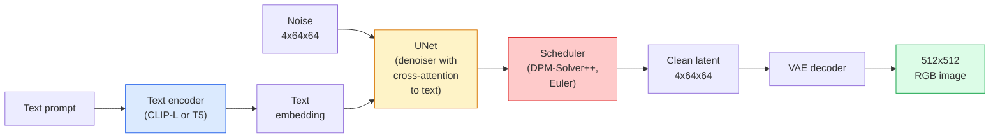

# Stable Diffusion — 아키텍처와 파인튜닝

> Stable Diffusion은 사전 학습된 VAE의 잠재 공간에서 실행되는 DDPM이다. 텍스트는 cross-attention으로 조건화하고, 빠른 결정론적 ODE 솔버로 샘플링하며, classifier-free guidance로 출력을 조향한다.

**Type:** Learn + Use
**Languages:** Python
**Prerequisites:** Phase 4 Lesson 10 (Diffusion), Phase 7 Lesson 02 (Self-Attention)
**Time:** ~75 minutes

## 학습 목표

- Stable Diffusion 파이프라인의 다섯 구성 요소인 VAE, text encoder, U-Net, scheduler, safety checker를 추적하고 각각이 실제로 하는 일을 설명한다
- 잠재 확산을 설명하고, 3x512x512 이미지 대신 4x64x64 잠재 공간에서 학습하면 품질 손실 없이 계산량이 48x 줄어드는 이유를 설명한다
- `diffusers`로 이미지 생성, image-to-image, inpainting, ControlNet 기반 생성을 실행한다
- 작은 커스텀 데이터셋에서 LoRA로 Stable Diffusion을 파인튜닝하고 추론 시 LoRA adapter를 로드한다

## 문제

512x512 RGB 이미지에 직접 DDPM을 학습시키는 것은 비싸다. 모든 학습 스텝은 3x512x512 = 786,432개의 입력값을 보는 U-Net을 통해 역전파하고, 샘플링에는 같은 U-Net의 forward pass가 50번 이상 필요하다. Stable Diffusion 1.5(2022년 공개) 수준의 품질에서는 픽셀 공간 확산에 대략 256 GPU-months의 학습과 소비자용 GPU에서 이미지당 10-30초가 필요했을 것이다.

오픈 웨이트 text-to-image를 실용적으로 만든 요령은 **latent diffusion**(Rombach et al., CVPR 2022)이었다. 3x512x512 이미지를 4x64x64 잠재 텐서로, 그리고 다시 이미지로 매핑하는 VAE를 학습한 뒤 그 잠재 공간에서 확산을 수행한다. 계산량은 `(3*512*512)/(4*64*64) = 48x`만큼 줄어든다. 샘플링도 같은 GPU에서 수십 초에서 2초 미만으로 내려간다.

거의 모든 최신 이미지 생성 모델인 SDXL, SD3, FLUX, HunyuanDiT, Wan-Video는 autoencoder, denoiser(U-Net 또는 DiT), 텍스트 조건화에 변형을 둔 잠재 확산 모델이다. Stable Diffusion을 배우면 그 템플릿을 배운 것이다.

## 개념

### 파이프라인



- **VAE** — 고정된 autoencoder다. Encoder는 이미지를 잠재로 바꾸고(img2img와 학습에 사용), decoder는 잠재를 다시 이미지로 바꾼다.
- **Text encoder** — CLIP text encoder(SD 1.x/2.x), CLIP-L + CLIP-G(SDXL), 또는 T5-XXL(SD3/FLUX)이다. 토큰 임베딩의 시퀀스를 만든다.
- **U-Net** — denoiser다. 모든 해상도 수준에서 잠재가 텍스트 임베딩을 attend하는 cross-attention layer를 가진다.
- **Scheduler** — 샘플링 알고리즘(DDIM, Euler, DPM-Solver++)이다. Sigma를 고르고 예측된 노이즈를 다시 잠재에 섞는다.
- **Safety checker** — 출력 이미지에 적용하는 선택적 NSFW / 불법 콘텐츠 필터다.

### Classifier-free guidance (CFG)

일반 텍스트 조건화는 모든 prompt `c`에 대해 `epsilon_theta(x_t, t, c)`를 학습한다. CFG는 같은 네트워크를 학습하되 10%의 시간 동안 `c`를 제거해(빈 임베딩으로 대체해) 조건부 노이즈와 무조건부 노이즈를 모두 예측하는 단일 모델을 만든다. 추론 시에는 다음을 사용한다.

```text
eps = eps_uncond + w * (eps_cond - eps_uncond)
```

`w`는 guidance scale이다. `w=0`은 무조건부, `w=1`은 일반 조건부, `w>1`은 다양성을 희생하면서 출력을 "prompt에 더 강하게 조건화된" 방향으로 밀어낸다. SD 기본값은 `w=7.5`다.

CFG는 text-to-image가 프로덕션 품질로 동작하는 이유다. CFG가 없으면 prompt는 출력을 약하게만 치우치게 하지만, CFG가 있으면 prompt가 지배한다.

### 잠재 공간의 기하

VAE의 4채널 잠재는 단순히 압축된 이미지가 아니다. 산술 연산이 대략 의미적 편집에 대응하는 manifold이며(prompt engineering과 interpolation이 모두 여기서 일어난다), 확산 U-Net이 전체 모델링 예산을 쓰도록 학습된 공간이다. 임의의 4x64x64 잠재를 decoding해도 임의처럼 보이는 이미지가 나오지 않는다. 유효한 이미지로 decoding되는 것은 잠재의 특정 submanifold뿐이므로 쓰레기 출력이 나온다.

두 가지 결과가 있다.

1. **Img2img** = 이미지를 잠재로 encode하고, 일부 노이즈를 더하고, denoiser를 실행한 뒤 decode한다. Encoding이 거의 invertible이기 때문에 이미지 구조는 유지되고, 내용은 prompt에 따라 바뀐다.
2. **Inpainting** = img2img와 같지만 denoiser가 mask된 영역만 업데이트한다. Mask되지 않은 영역은 encode된 잠재로 유지한다.

### U-Net 아키텍처

SD U-Net은 Lesson 10의 TinyUNet을 크게 만든 버전에 세 가지를 더한 것이다.

- **Transformer blocks**: 모든 공간 해상도에 있으며 self-attention과 텍스트 임베딩에 대한 cross-attention을 포함한다.
- **Time embedding**: sinusoidal encoding 위의 MLP를 통해 만든다.
- **Skip connections**: encoder와 decoder 사이의 같은 해상도끼리 연결한다.

SD 1.5의 총 파라미터 수는 약 860M이다. SDXL은 약 2.6B, FLUX는 약 12B다. 파라미터 증가의 대부분은 attention layer에서 온다.

### LoRA 파인튜닝

Stable Diffusion의 full fine-tuning은 20GB 이상의 VRAM을 필요로 하고 860M개의 파라미터를 업데이트한다. LoRA(Low-Rank Adaptation)는 base model을 고정한 채 attention layer에 작은 rank-decomposition 행렬을 주입한다. SD용 LoRA adapter는 보통 10-50MB이고, 단일 소비자용 GPU에서 10-60분 안에 학습되며, 추론 시 drop-in 수정으로 로드된다.

```text
Original: W_q : (d_in, d_out)   frozen
LoRA:     W_q + alpha * (A @ B)   where A : (d_in, r), B : (r, d_out)

r is typically 4-32.
```

LoRA는 거의 모든 커뮤니티 fine-tune이 배포되는 방식이다. CivitAI와 Hugging Face는 수백만 개의 LoRA를 호스팅한다.

### 자주 보게 될 scheduler

- **DDIM** — 결정론적이며 약 50스텝이고 단순하다.
- **Euler ancestral** — 확률적이며 30-50스텝이고 약간 더 창의적인 샘플을 만든다.
- **DPM-Solver++ 2M Karras** — 결정론적이며 20-30스텝이고 프로덕션 기본값이다.
- **LCM / TCD / Turbo** — consistency model과 distill된 변형이다. 1-4스텝으로 실행되지만 일부 품질을 희생한다.

Scheduler 교체는 `diffusers`에서 한 줄 변경이고, 재학습 없이도 샘플 문제를 해결할 때가 있다.

## 직접 만들기

이 lesson은 Stable Diffusion을 처음부터 다시 만들기보다 `diffusers`를 end-to-end로 사용한다. 직접 다시 만들어야 할 구성 요소(VAE, text encoder, U-Net, scheduler)는 각각 별도 lesson의 주제다. 여기서 목표는 프로덕션 API에 익숙해지는 것이다.

### Step 1: Text-to-image

```python
import torch
from diffusers import StableDiffusionPipeline

pipe = StableDiffusionPipeline.from_pretrained(
    "runwayml/stable-diffusion-v1-5",
    torch_dtype=torch.float16,
).to("cuda")

image = pipe(
    prompt="a dog riding a skateboard in tokyo, studio ghibli style",
    guidance_scale=7.5,
    num_inference_steps=25,
    generator=torch.Generator("cuda").manual_seed(42),
).images[0]
image.save("dog.png")
```

`float16`은 눈에 보이는 품질 손실 없이 VRAM을 절반으로 줄인다. 기본 DPM-Solver++에서 `num_inference_steps=25`는 DDIM에서 `num_inference_steps=50`과 비슷하다.

### Step 2: Scheduler 교체

```python
from diffusers import DPMSolverMultistepScheduler, EulerAncestralDiscreteScheduler

pipe.scheduler = DPMSolverMultistepScheduler.from_config(pipe.scheduler.config)
pipe.scheduler = EulerAncestralDiscreteScheduler.from_config(pipe.scheduler.config)
```

Scheduler state는 U-Net weights와 분리되어 있다. DDPM으로 학습하고 어떤 scheduler로든 샘플링할 수 있다.

### Step 3: Image-to-image

```python
from diffusers import StableDiffusionImg2ImgPipeline
from PIL import Image

img2img = StableDiffusionImg2ImgPipeline.from_pretrained(
    "runwayml/stable-diffusion-v1-5",
    torch_dtype=torch.float16,
).to("cuda")

init_image = Image.open("dog.png").convert("RGB").resize((512, 512))
out = img2img(
    prompt="a dog riding a skateboard, oil painting",
    image=init_image,
    strength=0.6,
    guidance_scale=7.5,
).images[0]
```

`strength`는 denoising 전에 더할 노이즈의 양이다(0.0 = 변경 없음, 1.0 = 완전 재생성). 스타일 변환의 표준 범위는 0.5-0.7이다.

### Step 4: Inpainting

```python
from diffusers import StableDiffusionInpaintPipeline

inpaint = StableDiffusionInpaintPipeline.from_pretrained(
    "runwayml/stable-diffusion-inpainting",
    torch_dtype=torch.float16,
).to("cuda")

image = Image.open("dog.png").convert("RGB").resize((512, 512))
mask = Image.open("dog_mask.png").convert("L").resize((512, 512))

out = inpaint(
    prompt="a cat",
    image=image,
    mask_image=mask,
    guidance_scale=7.5,
).images[0]
```

Mask의 흰 픽셀은 재생성할 영역이다. 검은 픽셀은 보존된다.

### Step 5: LoRA 로딩

```python
pipe.load_lora_weights("sayakpaul/sd-lora-ghibli")
pipe.fuse_lora(lora_scale=0.8)

image = pipe(prompt="a village square in ghibli style").images[0]
```

`lora_scale`은 강도를 제어한다. 0.0 = 효과 없음, 1.0 = 전체 효과다. `fuse_lora`는 속도를 위해 adapter를 weights에 in-place로 구워 넣지만 교체를 막는다. 다른 adapter를 로드하기 전에 `pipe.unfuse_lora()`를 호출한다.

### Step 6: LoRA 학습(스케치)

실제 LoRA 학습은 `peft` 또는 `diffusers.training`에 있다. 개요는 다음과 같다.

```python
# Pseudocode
for step, batch in enumerate(dataloader):
    images, prompts = batch
    latents = vae.encode(images).latent_dist.sample() * 0.18215

    t = torch.randint(0, num_train_timesteps, (batch_size,))
    noise = torch.randn_like(latents)
    noisy_latents = scheduler.add_noise(latents, noise, t)

    text_emb = text_encoder(tokenizer(prompts))

    pred_noise = unet(noisy_latents, t, text_emb)  # LoRA weights injected here

    loss = F.mse_loss(pred_noise, noise)
    loss.backward()
    optimizer.step()
```

Gradient는 LoRA 행렬만 받는다. Base U-Net, VAE, text encoder는 고정된다. Batch size 1과 gradient checkpointing을 쓰면 8GB VRAM에 들어간다.

## 사용하기

프로덕션에서 실제로 내리는 결정은 다음과 같다.

- **Model family**: 오픈 소스 커뮤니티 fine-tune은 SD 1.5, 더 높은 fidelity는 SDXL, state of the art와 엄격한 licensing 요구사항은 SD3 / FLUX.
- **Scheduler**: 20-30스텝에는 DPM-Solver++ 2M Karras, latency가 1초 미만이어야 하면 LCM-LoRA.
- **Precision**: 4080/4090에서는 `float16`, A100 이상에서는 `bfloat16`, VRAM이 부족하면 `bitsandbytes` 또는 `compel`을 통한 `int8`.
- **Conditioning**: 일반 텍스트도 동작한다. 더 강한 제어가 필요하면 base pipeline 위에 ControlNet(canny, depth, pose)을 추가한다.

Batch generation에는 `AUTO1111` / `ComfyUI`가 커뮤니티 도구다. Production API에는 `diffusers` + `accelerate` 또는 TensorRT compilation을 붙인 `optimum-nvidia`를 쓴다.

## 출시하기

이 lesson의 산출물은 다음과 같다.

- `outputs/prompt-sd-pipeline-planner.md` — latency budget, fidelity target, licensing constraint가 주어졌을 때 SD 1.5 / SDXL / SD3 / FLUX와 scheduler, precision을 고르는 prompt.
- `outputs/skill-lora-training-setup.md` — captions, rank, batch size, learning rate를 포함해 custom dataset용 전체 LoRA training config를 작성하는 skill.

## 연습 문제

1. **(Easy)** 같은 prompt를 `guidance_scale` 값 `[1, 3, 5, 7.5, 10, 15]`로 생성한다. 이미지가 어떻게 바뀌는지 설명한다. 어떤 guidance 값에서 artefact가 나타나는가?
2. **(Medium)** 실제 사진 하나를 골라 `StableDiffusionImg2ImgPipeline`에서 `strength` 값 `[0.2, 0.4, 0.6, 0.8, 1.0]`로 실행한다. 어떤 strength가 composition을 보존하면서 style을 바꾸는가? 왜 1.0은 입력을 완전히 무시하는가?
3. **(Hard)** 단일 subject(반려동물, logo, character 등)의 이미지 10-20장으로 LoRA를 학습하고, 그 subject가 포함된 새로운 장면을 생성한다. 입력 이미지에 overfitting하지 않으면서 identity preservation이 가장 좋았던 LoRA rank와 training steps를 보고한다.

## 핵심 용어

| Term | What people say | What it actually means |
|------|----------------|----------------------|
| Latent diffusion | "Diffuse in latents" | Pixel space(3x512x512) 대신 VAE latent space(4x64x64)에서 전체 DDPM을 실행한다. 계산량을 48x 절감한다 |
| VAE scale factor | "0.18215" | VAE의 raw latent를 대략 unit variance로 재조정하는 상수다. 모든 SD pipeline에 hardcode되어 있다 |
| Classifier-free guidance | "CFG" | Conditional noise prediction과 unconditional noise prediction을 섞는다. 가장 영향력 큰 inference knob이다 |
| Scheduler | "Sampler" | Noise + model prediction을 denoised latent trajectory로 바꾸는 알고리즘이다 |
| LoRA | "Low-rank adapter" | Base weights를 건드리지 않고 attention layer를 fine-tune하는 작은 rank-decomposition 행렬이다 |
| Cross-attention | "Text-image attention" | Latent token에서 text token으로 향하는 attention이다. 모든 U-Net 수준에서 prompt 정보를 주입한다 |
| ControlNet | "Structure conditioning" | 추가 입력(canny, depth, pose, segmentation)으로 SD를 조향하는 별도 학습 adapter다 |
| DPM-Solver++ | "The default scheduler" | 2차 결정론적 ODE solver다. 2026년 기준 낮은 step count(20-30)에서 품질이 가장 좋다 |

## 더 읽을거리

- [High-Resolution Image Synthesis with Latent Diffusion (Rombach et al., 2022)](https://arxiv.org/abs/2112.10752) — Stable Diffusion 논문이다. 설계를 정당화하는 모든 ablation이 포함되어 있다
- [Classifier-Free Diffusion Guidance (Ho & Salimans, 2022)](https://arxiv.org/abs/2207.12598) — CFG 논문
- [LoRA: Low-Rank Adaptation of Large Language Models (Hu et al., 2021)](https://arxiv.org/abs/2106.09685) — LoRA는 NLP에서 먼저 나왔다. 거의 변경 없이 SD로 옮겨졌다
- [diffusers documentation](https://huggingface.co/docs/diffusers) — 모든 SD / SDXL / SD3 / FLUX pipeline의 reference
