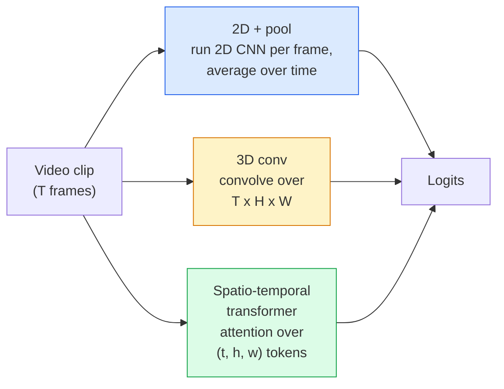

# 비디오 이해 — 시간 모델링

> Video는 이미지의 시퀀스와 그 이미지를 연결하는 physics로 이루어진다. 모든 video model은 시간을 extra axis(3D conv), attend할 sequence(transformer), 또는 한 번 추출해 pooling할 feature(2D+pool) 중 하나로 다룬다.

**Type:** Learn + Build
**Languages:** Python
**Prerequisites:** Phase 4 Lesson 03 (CNNs), Phase 4 Lesson 04 (Image Classification)
**Time:** ~45 minutes

## 학습 목표

- 세 가지 주요 video-modelling 접근법(2D+pool, 3D conv, spatio-temporal transformer)을 구분하고 cost와 accuracy trade-off를 예측한다
- PyTorch에서 frame sampling, temporal pooling, 2D+pool baseline classifier를 구현한다
- I3D의 "inflated" 3D kernel이 ImageNet weights에서 잘 transfer되는 이유와 factorised (2+1)D conv가 무엇을 다르게 하는지 설명한다
- 표준 action-recognition dataset과 metric을 읽는다: Kinetics-400/600, UCF101, Something-Something V2, clip level과 video level의 top-1 accuracy

## 문제

30fps의 30초 video는 900장의 이미지다. 순진하게 보면 video classification은 image classification을 900번 실행한 뒤 어떤 방식으로든 aggregation하는 것이다. 이 방법은 action이 거의 모든 frame에 보일 때(sports, cooking, exercise videos)는 동작하지만, action 자체가 motion으로 정의될 때는 심하게 실패한다. "pushing something from left to right"는 모든 single frame에서 두 개의 정지 object처럼 보인다.

모든 video architecture의 핵심 질문은 temporal structure가 언제, 어떻게 모델링되는가다. 그 답이 나머지 전부를 결정한다. Compute cost, pretraining strategy, ImageNet weights 재사용 가능 여부, 어떤 dataset에서 model을 학습할지가 모두 여기서 나온다.

이 lesson은 static-image lesson보다 의도적으로 짧다. 핵심 image machinery는 이미 마련되어 있고, video understanding은 대부분 sampling, modelling, aggregating이라는 temporal story에 관한 것이다.

## 개념

### 세 가지 architecture family



### 2D + pool

2D CNN(ResNet, EfficientNet, ViT)을 가져온다. Sampling된 모든 frame에서 독립적으로 실행한다. Frame별 embedding을 평균하거나(max-pool 또는 attention-pool도 가능) pooled vector를 classifier에 넣는다.

장점:
- ImageNet pretraining이 직접 transfer된다.
- 구현이 가장 단순하다.
- 저렴하다. T frames * single-image inference cost다.

단점:
- Motion을 모델링할 수 없다. Action = appearance의 aggregate다.
- Temporal pooling은 order-invariant다. "open door"와 "close door"가 같아 보인다.

사용 시점: Appearance-heavy task, 작은 video dataset의 transfer learning, 초기 baseline.

### 3D convolutions

2D (H, W) kernel을 3D (T, H, W) kernel로 바꾼다. Network는 space와 time 모두에 대해 convolution한다. 초기 family는 C3D, I3D, SlowFast다.

I3D trick: 사전 학습된 2D ImageNet model을 가져와 각 2D kernel을 새 time axis 방향으로 복사해 "inflate"한다. 3x3 2D conv는 3x3x3 3D conv가 된다. 이렇게 하면 3D model이 scratch부터 학습하는 대신 강한 pretrained weights를 얻는다.

장점:
- Motion을 직접 모델링한다.
- I3D inflation은 transfer learning을 공짜로 준다.

단점:
- 2D counterpart보다 T/8 더 많은 FLOPs가 든다(temporal kernel 3을 3번 쌓은 경우).
- Temporal kernel은 작다. Long-range motion에는 pyramid 또는 dual-stream approach가 필요하다.

사용 시점: Motion이 signal인 action recognition(Something-Something V2, motion-heavy class가 있는 Kinetics).

### Spatio-temporal transformers

Video를 space-time patch의 grid로 tokenize하고 전체에 attention을 적용한다. TimeSformer, ViViT, Video Swin, VideoMAE가 여기에 속한다.

중요한 attention pattern:
- **Joint** — (t, h, w)에 대한 하나의 큰 attention. `T*H*W`에 대해 quadratic이므로 비싸다.
- **Divided** — block마다 두 attention을 둔다. 하나는 time, 하나는 space. 거의 linear에 가까운 scaling을 가진다.
- **Factorised** — time attention과 space attention이 block 사이에서 번갈아 나온다.

장점:
- 모든 주요 benchmark에서 SOTA accuracy.
- Patch inflation을 통해 image transformer(ViT)에서 transfer된다.
- Sparse attention을 통해 long-context video를 지원한다.

단점:
- Compute를 많이 먹는다.
- Attention pattern을 신중하게 고르지 않으면 runtime이 급증한다.

사용 시점: Large dataset, high-fidelity video understanding, multi-modal video+text task.

### Frame sampling

30fps의 10초 clip은 300 frames다. 어떤 model에도 300장을 모두 넣는 것은 낭비다. 표준 전략은 다음과 같다.

- **Uniform sampling** — clip 전체에서 T frames를 균등하게 고른다. 2D+pool의 기본값이다.
- **Dense sampling** — 인접한 T-frame window를 random하게 고른다. Motion에는 neighboring frame이 필요하므로 3D conv에서 흔하다.
- **Multi-clip** — 같은 video에서 여러 T-frame window를 sample하고 각각 classify한 뒤 test time에 prediction을 평균한다.

T는 보통 8, 16, 32, 64다. T가 높을수록 더 많은 temporal signal을 얻지만 compute도 더 든다.

### 평가

두 level이 있다.
- **Clip-level accuracy** — model이 하나의 T-frame clip을 보고 top-k를 보고한다.
- **Video-level accuracy** — video당 여러 clip-level prediction을 평균한다. 더 높고 안정적이다.

항상 둘 다 보고한다. 78% clip / 82% video를 기록한 model은 test-time averaging에 크게 의존한다. 80% / 81%를 기록한 model은 per-clip 기준으로 더 robust하다.

### 만나게 될 dataset

- **Kinetics-400 / 600 / 700** — general-purpose action dataset. 400k clips와 YouTube URLs(지금은 dead link가 많다).
- **Something-Something V2** — motion-defined action("moving X from left to right"). 2D+pool로는 풀 수 없다.
- **UCF-101**, **HMDB-51** — 더 오래되고 작지만 여전히 보고된다.
- **AVA** — space와 time에서 action *localisation*을 수행한다. Classification보다 어렵다.

## 직접 만들기

### Step 1: Frame sampler

Frame list 또는 video tensor에서 동작하는 uniform sampler와 dense sampler다.

```python
import numpy as np

def sample_uniform(num_frames_total, T):
    if num_frames_total <= T:
        return list(range(num_frames_total)) + [num_frames_total - 1] * (T - num_frames_total)
    step = num_frames_total / T
    return [int(i * step) for i in range(T)]


def sample_dense(num_frames_total, T, rng=None):
    rng = rng or np.random.default_rng()
    if num_frames_total <= T:
        return list(range(num_frames_total)) + [num_frames_total - 1] * (T - num_frames_total)
    start = int(rng.integers(0, num_frames_total - T + 1))
    return list(range(start, start + T))
```

둘 다 video tensor를 slice하는 데 사용할 `T`개의 index를 반환한다.

### Step 2: 2D+pool baseline

모든 frame에 2D ResNet-18을 실행하고, feature를 average-pool한 뒤 classify한다.

```python
import torch
import torch.nn as nn
from torchvision.models import resnet18, ResNet18_Weights

class FramePool(nn.Module):
    def __init__(self, num_classes=400, pretrained=True):
        super().__init__()
        weights = ResNet18_Weights.IMAGENET1K_V1 if pretrained else None
        backbone = resnet18(weights=weights)
        self.features = nn.Sequential(*(list(backbone.children())[:-1]))  # global avg pool kept
        self.head = nn.Linear(512, num_classes)

    def forward(self, x):
        # x: (N, T, 3, H, W)
        N, T = x.shape[:2]
        x = x.view(N * T, *x.shape[2:])
        feats = self.features(x).view(N, T, -1)
        pooled = feats.mean(dim=1)
        return self.head(pooled)

model = FramePool(num_classes=10)
x = torch.randn(2, 8, 3, 224, 224)
print(f"output: {model(x).shape}")
print(f"params: {sum(p.numel() for p in model.parameters()):,}")
```

1100만 파라미터, ImageNet pretrained, per-frame 실행, 평균, classification. 이 baseline은 appearance-heavy task에서 proper 3D model보다 5-10 point 이내인 경우가 많고 때로는 더 낫다. 더 강한 ImageNet backbone을 재사용하기 때문이다.

### Step 3: I3D-style inflated 3D conv

단일 2D conv를 새 time axis 방향으로 weight를 반복해 3D conv로 바꾼다.

```python
def inflate_2d_to_3d(conv2d, time_kernel=3):
    out_c, in_c, kh, kw = conv2d.weight.shape
    weight_3d = conv2d.weight.data.unsqueeze(2)  # (out, in, 1, kh, kw)
    weight_3d = weight_3d.repeat(1, 1, time_kernel, 1, 1) / time_kernel
    conv3d = nn.Conv3d(in_c, out_c, kernel_size=(time_kernel, kh, kw),
                        padding=(time_kernel // 2, conv2d.padding[0], conv2d.padding[1]),
                        stride=(1, conv2d.stride[0], conv2d.stride[1]),
                        bias=False)
    conv3d.weight.data = weight_3d
    return conv3d

conv2d = nn.Conv2d(3, 64, kernel_size=3, padding=1, bias=False)
conv3d = inflate_2d_to_3d(conv2d, time_kernel=3)
print(f"2D weight shape:  {tuple(conv2d.weight.shape)}")
print(f"3D weight shape:  {tuple(conv3d.weight.shape)}")
x = torch.randn(1, 3, 8, 56, 56)
print(f"3D output shape:  {tuple(conv3d(x).shape)}")
```

`time_kernel`로 나누면 activation magnitude가 대략 일정하게 유지된다. 첫 pass에서 batch-norm statistics를 깨지 않으려면 중요하다.

### Step 4: Factorised (2+1)D conv

3D conv를 2D(spatial) conv와 1D(temporal) conv로 나눈다. Receptive field는 같고, parameter는 더 적으며, 일부 benchmark에서는 accuracy가 더 좋다.

```python
class Conv2Plus1D(nn.Module):
    def __init__(self, in_c, out_c, kernel_size=3):
        super().__init__()
        mid_c = (in_c * out_c * kernel_size * kernel_size * kernel_size) \
                // (in_c * kernel_size * kernel_size + out_c * kernel_size)
        self.spatial = nn.Conv3d(in_c, mid_c, kernel_size=(1, kernel_size, kernel_size),
                                 padding=(0, kernel_size // 2, kernel_size // 2), bias=False)
        self.bn = nn.BatchNorm3d(mid_c)
        self.act = nn.ReLU(inplace=True)
        self.temporal = nn.Conv3d(mid_c, out_c, kernel_size=(kernel_size, 1, 1),
                                  padding=(kernel_size // 2, 0, 0), bias=False)

    def forward(self, x):
        return self.temporal(self.act(self.bn(self.spatial(x))))

c = Conv2Plus1D(3, 64)
x = torch.randn(1, 3, 8, 56, 56)
print(f"(2+1)D output: {tuple(c(x).shape)}")
```

Full R(2+1)D network는 모든 3x3 conv를 `Conv2Plus1D`로 바꾼 ResNet-18과 같다.

## 사용하기

두 library가 production video work를 담당한다.

- `torchvision.models.video` — Kinetics pretrained weights가 있는 R(2+1)D, MViT, Swin3D. Image model과 같은 API를 쓴다.
- `pytorchvideo`(Meta) — model zoo, Kinetics / SSv2 / AVA용 data loader, standard transform.

Vision-Language video model(video captioning, video QA)에는 `transformers`(`VideoMAE`, `VideoLLaMA`, `InternVideo`)를 사용한다.

## 출시하기

이 lesson의 산출물은 다음과 같다.

- `outputs/prompt-video-architecture-picker.md` — appearance-vs-motion, dataset size, compute budget을 바탕으로 2D+pool / I3D / (2+1)D / transformer를 고르는 prompt.
- `outputs/skill-frame-sampler-auditor.md` — video pipeline의 sampler를 검사하고 common bug를 flag하는 skill. 예: off-by-one index, `num_frames < T`일 때 uneven sampling, aspect-preserving crop 누락 등.

## 연습 문제

1. **(Easy)** T=8인 FramePool과 T=8인 I3D-style 3D ResNet의 FLOPs를 근사 계산한다. 2D+pool이 왜 3-5x 더 싼지 정당화한다.
2. **(Medium)** Synthetic video dataset을 만든다. Random ball이 random direction으로 움직이고, motion direction("left-to-right", "right-to-left", "diagonal-up")으로 label된다. FramePool을 학습한다. Appearance alone이 motion task에 부족함을 보이기 위해 near-chance accuracy를 달성함을 보여준다.
3. **(Hard)** ResNet-18의 모든 Conv2d를 `Conv2Plus1D`로 바꿔 R(2+1)D-18을 만든다. ImageNet-pretrained ResNet-18에서 첫 conv의 weights를 inflate한다. Exercise 2의 motion dataset에서 학습하고 FramePool을 이긴다.

## 핵심 용어

| Term | What people say | What it actually means |
|------|----------------|----------------------|
| 2D + pool | "Per-frame classifier" | Sampling된 모든 frame에서 2D CNN을 실행하고, feature를 time 축으로 average-pool한 뒤 classify한다 |
| 3D convolution | "Spatio-temporal kernel" | (T, H, W)에 대해 convolution하는 kernel이다. Motion을 native하게 모델링할 수 있다 |
| Inflation | "Lift 2D weights to 3D" | 2D conv의 weights를 새 time axis 방향으로 반복해 3D conv weights를 initialise하고, activation scale 보존을 위해 kernel_T로 나눈다 |
| (2+1)D | "Factorised conv" | 3D를 2D spatial + 1D temporal로 나눈다. Parameter가 더 적고 중간에 extra non-linearity가 있다 |
| Divided attention | "Time then space" | Layer마다 attention 두 개가 있는 transformer block이다. 하나는 같은 frame의 token에, 하나는 같은 position의 token에 적용한다 |
| Clip | "T-frame window" | T frames의 sampled subsequence다. Video model이 소비하는 단위다 |
| Clip vs video accuracy | "Two eval settings" | Clip = video당 sample 하나, video = 여러 sampled clip을 평균 |
| Kinetics | "The ImageNet of video" | 400-700 action class, 300k+ YouTube clips로 구성된 표준 video pretraining corpus |

## 더 읽을거리

- [I3D: Quo Vadis, Action Recognition (Carreira & Zisserman, 2017)](https://arxiv.org/abs/1705.07750) — inflation과 Kinetics dataset을 소개한다
- [R(2+1)D: A Closer Look at Spatiotemporal Convolutions (Tran et al., 2018)](https://arxiv.org/abs/1711.11248) — factorised conv. 여전히 강한 baseline이다
- [TimeSformer: Is Space-Time Attention All You Need? (Bertasius et al., 2021)](https://arxiv.org/abs/2102.05095) — 최초의 강력한 video transformer
- [VideoMAE (Tong et al., 2022)](https://arxiv.org/abs/2203.12602) — video용 masked autoencoder pretraining. 현재 지배적인 pretraining recipe다
