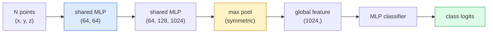

# 3D 비전 — 포인트 클라우드와 NeRF

> 3D 비전에는 두 가지 형태가 있습니다. 포인트 클라우드는 센서의 원시 출력입니다. NeRF는 학습된 체적장입니다. 둘 다 "공간의 어디에 무엇이 있는가"에 답합니다.

**Type:** Learn + Build
**Languages:** Python
**Prerequisites:** Phase 4 Lesson 03 (CNNs), Phase 1 Lesson 12 (Tensor Operations)
**Time:** ~45 minutes

## 학습 목표

- 명시적 3D 표현(포인트 클라우드, 메시, 복셀)과 암시적 3D 표현(signed distance field, NeRF)을 구분하고 각각이 언제 쓰이는지 설명합니다
- 순서 없는 점 집합에 대해 신경망을 순열 불변으로 만드는 PointNet의 대칭 함수 기법을 이해합니다
- NeRF 순전파를 따라갑니다: 광선 투사, 체적 렌더링, 위치 인코딩, MLP 밀도+색상 헤드
- 포즈가 주어진 소수의 이미지에서 사전학습된 3D 재구성을 수행하기 위해 `nerfstudio` 또는 `instant-ngp`를 사용합니다

## 문제

카메라는 2D 이미지를 생성합니다. LIDAR는 순서가 없는 3D 점 집합을 생성합니다. structure-from-motion 파이프라인은 희소한 3D 키포인트 클라우드를 생성합니다. NeRF는 포즈가 주어진 몇 장의 이미지에서 전체 3D 장면을 재구성합니다. 이 모두가 "비전"이지만, 어느 것도 CNN이 원하는 조밀한 텐서처럼 보이지 않습니다.

3D 비전이 중요한 이유는 거의 모든 고부가가치 로봇 작업이 3D에서 실행되기 때문입니다: 파지, 장애물 회피, 내비게이션, AR 오클루전, 3D 콘텐츠 캡처. 2D 이미지만 이해하는 비전 엔지니어는 이 분야에서 가장 빠르게 성장하는 영역(AR/VR 콘텐츠, 로보틱스, 자율주행 스택, 부동산이나 건설용 NeRF 기반 3D 재구성)에 접근하기 어렵습니다.

두 표현은 서로 다른 이유로 주류가 되었습니다. 포인트 클라우드는 센서가 그대로 제공하는 것입니다. NeRF와 그 후속 방식(3D Gaussian splatting, neural SDFs)은 신경망에게 장면을 학습하라고 요청했을 때 얻는 것입니다.

## 개념

### 포인트 클라우드

포인트 클라우드는 R^3의 N개 점으로 이루어진 순서 없는 집합이며, 선택적으로 각 점이 특징(색상, 강도, 법선)을 가질 수 있습니다.

```text
cloud = [
  (x1, y1, z1, r1, g1, b1),
  (x2, y2, z2, r2, g2, b2),
  ...
  (xN, yN, zN, rN, gN, bN),
]
```

격자도 없고 연결성도 없습니다. 두 가지 특성이 신경망 처리에 어려움을 만듭니다:

- **순열 불변성** — 출력은 점의 순서에 의존하면 안 됩니다.
- **가변 N** — 하나의 모델이 서로 다른 크기의 클라우드를 처리해야 합니다.

PointNet(Qi et al., 2017)은 하나의 아이디어로 두 문제를 모두 해결했습니다: 모든 점에 공유 MLP를 적용한 다음 대칭 함수(max pool)로 집계합니다. 결과는 순서에 의존하지 않는 고정 크기 벡터입니다.

```text
f(P) = max_{p in P} MLP(p)
```

이것이 PointNet의 전체 핵심입니다. 더 깊은 변형(PointNet++, Point Transformer)은 계층적 샘플링과 지역 집계를 추가하지만, 대칭 함수 기법은 바뀌지 않습니다.

### PointNet 아키텍처



"Shared MLP"는 같은 MLP가 모든 점에 독립적으로 실행된다는 뜻입니다. 효율을 위해 점 차원에 대한 1x1 conv로 구현합니다.

### Neural Radiance Fields (NeRFs)

NeRF(Mildenhall et al., 2020)는 "N장의 사진에서 3D 장면을 재구성할 수 있는가?"라는 질문에, 장면 자체가 되는 신경망으로 답했습니다. 네트워크는 `(x, y, z, viewing_direction)`을 `(density, colour)`로 매핑합니다. 새로운 시점을 렌더링하는 과정은 이 네트워크 위에서 수행되는 광선 투사 루프입니다.

```text
NeRF MLP:  (x, y, z, theta, phi) -> (sigma, r, g, b)

To render a pixel (u, v) of a new view:
  1. Cast a ray from the camera through pixel (u, v)
  2. Sample points along the ray at distances t_1, t_2, ..., t_N
  3. Query the MLP at each point
  4. Composite the colours weighted by (1 - exp(-sigma * dt))
  5. The sum is the rendered pixel colour
```

손실은 렌더링된 픽셀과 학습 사진의 정답 픽셀을 비교합니다. 렌더링 단계를 통한 역전파가 MLP를 업데이트합니다. 3D 정답도, 명시적 기하도 없습니다. 장면은 MLP 가중치에 저장됩니다.

### NeRF의 위치 인코딩

`(x, y, z)`를 그대로 받는 일반 MLP는 고주파 세부사항을 표현할 수 없습니다. MLP가 저주파에 치우친 스펙트럼 편향을 갖기 때문입니다. NeRF는 각 좌표를 MLP에 넣기 전에 Fourier feature 벡터로 인코딩해 이를 해결합니다:

```text
gamma(p) = (sin(2^0 pi p), cos(2^0 pi p), sin(2^1 pi p), cos(2^1 pi p), ...)
```

최대 L=10 주파수 레벨까지 사용합니다. 이는 트랜스포머가 위치에 사용하는 것과 같은 기법이며, 확산 시간 조건화(Lesson 10)에서도 다시 등장합니다. 이것이 없으면 NeRF는 흐릿하게 보입니다.

### 체적 렌더링

```text
C(r) = sum_i T_i * (1 - exp(-sigma_i * delta_i)) * c_i

T_i  = exp(- sum_{j<i} sigma_j * delta_j)
delta_i = t_{i+1} - t_i
```

`T_i`는 투과율입니다. 빛이 점 i까지 얼마나 살아남는지를 나타냅니다. `(1 - exp(-sigma_i * delta_i))`는 점 i에서의 불투명도입니다. `c_i`는 색상입니다. 최종 픽셀은 광선을 따라 계산한 가중합입니다.

### NeRF를 대체한 것들

순수 NeRF는 학습이 느리고(몇 시간) 렌더링도 느립니다(이미지당 몇 초). 이후 계보는 다음과 같습니다:

- **Instant-NGP** (2022) — 해시 격자 인코딩이 MLP의 위치 입력을 대체합니다. 몇 초 만에 학습됩니다.
- **Mip-NeRF 360** — 경계가 없는 장면과 안티앨리어싱을 처리합니다.
- **3D Gaussian Splatting** (2023) — 체적장을 수백만 개의 3D Gaussian으로 대체합니다. 몇 분 만에 학습하고 실시간으로 렌더링합니다. 현재 프로덕션 기본값입니다.

2026년의 거의 모든 실제 NeRF 제품은 사실상 3D Gaussian splatting입니다. 그래도 정신 모델은 여전히 NeRF입니다.

### 데이터셋과 벤치마크

- **ShapeNet** — 포인트 클라우드 형태의 3D CAD 모델 분류와 세그멘테이션.
- **ScanNet** — 세그멘테이션을 위한 실제 실내 스캔.
- **KITTI** — 자율주행을 위한 실외 LIDAR 포인트 클라우드.
- **NeRF Synthetic** / **Blended MVS** — 시점 합성을 위한 포즈 이미지 데이터셋.
- **Mip-NeRF 360** dataset — 경계가 없는 실제 장면.

## 직접 만들기

### Step 1: PointNet 분류기

```python
import torch
import torch.nn as nn

class PointNet(nn.Module):
    def __init__(self, num_classes=10):
        super().__init__()
        self.mlp1 = nn.Sequential(
            nn.Conv1d(3, 64, 1),    nn.BatchNorm1d(64),   nn.ReLU(inplace=True),
            nn.Conv1d(64, 64, 1),   nn.BatchNorm1d(64),   nn.ReLU(inplace=True),
        )
        self.mlp2 = nn.Sequential(
            nn.Conv1d(64, 128, 1),  nn.BatchNorm1d(128),  nn.ReLU(inplace=True),
            nn.Conv1d(128, 1024, 1), nn.BatchNorm1d(1024), nn.ReLU(inplace=True),
        )
        self.head = nn.Sequential(
            nn.Linear(1024, 512),   nn.BatchNorm1d(512),  nn.ReLU(inplace=True),
            nn.Dropout(0.3),
            nn.Linear(512, 256),    nn.BatchNorm1d(256),  nn.ReLU(inplace=True),
            nn.Dropout(0.3),
            nn.Linear(256, num_classes),
        )

    def forward(self, x):
        # x: (N, 3, num_points) — transposed for Conv1d
        x = self.mlp1(x)
        x = self.mlp2(x)
        x = torch.max(x, dim=-1)[0]       # (N, 1024)
        return self.head(x)

pts = torch.randn(4, 3, 1024)
net = PointNet(num_classes=10)
print(f"output: {net(pts).shape}")
print(f"params: {sum(p.numel() for p in net.parameters()):,}")
```

약 1.6M개의 파라미터입니다. 클라우드당 1,024개 점에서 실행됩니다.

### Step 2: 위치 인코딩

```python
def positional_encoding(x, L=10):
    """
    x: (..., D) -> (..., D * 2 * L)
    """
    freqs = 2.0 ** torch.arange(L, dtype=x.dtype, device=x.device)
    args = x.unsqueeze(-1) * freqs * 3.141592653589793
    sinc = torch.cat([args.sin(), args.cos()], dim=-1)
    return sinc.reshape(*x.shape[:-1], -1)

x = torch.randn(5, 3)
y = positional_encoding(x, L=10)
print(f"input:  {x.shape}")
print(f"encoded: {y.shape}     # (5, 60)")
```

`2^l * pi`를 곱하면 점점 더 높은 주파수를 얻게 됩니다.

### Step 3: 작은 NeRF MLP

```python
class TinyNeRF(nn.Module):
    def __init__(self, L_pos=10, L_dir=4, hidden=128):
        super().__init__()
        self.L_pos = L_pos
        self.L_dir = L_dir
        pos_dim = 3 * 2 * L_pos
        dir_dim = 3 * 2 * L_dir
        self.trunk = nn.Sequential(
            nn.Linear(pos_dim, hidden), nn.ReLU(inplace=True),
            nn.Linear(hidden, hidden),  nn.ReLU(inplace=True),
            nn.Linear(hidden, hidden),  nn.ReLU(inplace=True),
            nn.Linear(hidden, hidden),  nn.ReLU(inplace=True),
        )
        self.sigma = nn.Linear(hidden, 1)
        self.color = nn.Sequential(
            nn.Linear(hidden + dir_dim, hidden // 2), nn.ReLU(inplace=True),
            nn.Linear(hidden // 2, 3), nn.Sigmoid(),
        )

    def forward(self, x, d):
        x_enc = positional_encoding(x, self.L_pos)
        d_enc = positional_encoding(d, self.L_dir)
        h = self.trunk(x_enc)
        sigma = torch.relu(self.sigma(h)).squeeze(-1)
        rgb = self.color(torch.cat([h, d_enc], dim=-1))
        return sigma, rgb

nerf = TinyNeRF()
x = torch.randn(128, 3)
d = torch.randn(128, 3)
s, c = nerf(x, d)
print(f"sigma: {s.shape}   rgb: {c.shape}")
```

원래 NeRF(깊이 8의 MLP trunk 2개)에 비하면 아주 작습니다. 그래도 아키텍처를 보여주기에는 충분합니다.

### Step 4: 광선을 따라 체적 렌더링하기

```python
def volumetric_render(sigma, rgb, t_vals):
    """
    sigma: (..., N_samples)
    rgb:   (..., N_samples, 3)
    t_vals: (N_samples,) distances along the ray
    """
    delta = torch.cat([t_vals[1:] - t_vals[:-1], torch.full_like(t_vals[:1], 1e10)])
    alpha = 1.0 - torch.exp(-sigma * delta)
    trans = torch.cumprod(torch.cat([torch.ones_like(alpha[..., :1]), 1.0 - alpha + 1e-10], dim=-1), dim=-1)[..., :-1]
    weights = alpha * trans
    rendered = (weights.unsqueeze(-1) * rgb).sum(dim=-2)
    depth = (weights * t_vals).sum(dim=-1)
    return rendered, depth, weights


N = 64
t_vals = torch.linspace(2.0, 6.0, N)
sigma = torch.rand(N) * 0.5
rgb = torch.rand(N, 3)
rendered, depth, weights = volumetric_render(sigma, rgb, t_vals)
print(f"rendered colour: {rendered.tolist()}")
print(f"depth:           {depth.item():.2f}")
```

하나의 광선, 64개 샘플을 하나의 RGB 픽셀과 깊이로 합성합니다.

## 사용하기

실제 작업에서는 다음을 사용합니다:

- `nerfstudio` (Tancik et al.) — NeRF / Instant-NGP / Gaussian Splatting을 위한 현재 기준 라이브러리. 명령줄과 웹 뷰어를 함께 제공합니다.
- `pytorch3d` (Meta) — 미분 가능한 렌더링, 포인트 클라우드 유틸리티, 메시 연산.
- `open3d` — 포인트 클라우드 처리, 정합, 시각화.

배포에서는 3D Gaussian splatting이 순수 NeRF를 대부분 대체했습니다. 렌더링이 100배 더 빠르기 때문입니다. 재구성 품질은 비슷합니다.

## 산출물

이 레슨은 다음을 만듭니다:

- `outputs/prompt-3d-task-router.md` — 작업과 입력 데이터에 따라 적절한 3D 표현(포인트 클라우드, 메시, 복셀, NeRF, Gaussian splat)으로 라우팅하는 프롬프트.
- `outputs/skill-point-cloud-loader.md` — .ply / .pcd / .xyz 파일을 올바른 정규화, 중심 맞추기, 점 샘플링이 적용된 PyTorch `Dataset`으로 작성하는 스킬.

## 연습 문제

1. **(쉬움)** PointNet이 순열 불변임을 보이세요. 같은 클라우드를 두 번 통과시키되 한 번은 점 순서를 섞습니다. 출력이 부동소수점 잡음 수준까지 동일한지 확인하세요.
2. **(중간)** 카메라 내부 파라미터와 포즈가 주어졌을 때 H x W 이미지의 모든 픽셀에 대한 광선 원점과 방향을 생성하는 최소한의 광선 생성 함수를 구현하세요.
3. **(어려움)** 색이 있는 큐브의 렌더링된 뷰로 만든 합성 데이터셋에서 TinyNeRF를 학습하세요(미분 가능한 렌더링 또는 간단한 레이 트레이서로 생성). epoch 1, 10, 100에서 렌더링 손실을 보고하세요. 모델이 알아볼 수 있는 뷰를 만들어내는 시점은 몇 epoch입니까?

## 핵심 용어

| 용어 | 사람들이 말하는 것 | 실제 의미 |
|------|----------------|----------------------|
| Point cloud | "LIDAR에서 나온 3D 점" | 순서 없는 (x, y, z) 집합 + 점별 선택적 특징 |
| PointNet | "포인트 클라우드용 첫 신경망" | 점마다 공유 MLP + 대칭(max) pool; 구조적으로 순열 불변 |
| NeRF | "장면 자체인 MLP" | (x, y, z, dir)을 (density, colour)로 매핑하는 네트워크; 광선 투사로 렌더링 |
| Positional encoding | "Fourier features" | MLP의 저주파 편향을 극복하기 위해 각 좌표를 여러 주파수의 sin/cos로 인코딩 |
| Volumetric rendering | "Ray integration" | 투과율과 alpha를 사용해 광선 위의 샘플을 하나의 픽셀로 합성 |
| Instant-NGP | "Hash-grid NeRF" | NeRF의 좌표 MLP를 다중 해상도 해시 격자로 대체합니다. 100-1000배 더 빠릅니다 |
| 3D Gaussian splatting | "수백만 개의 Gaussian" | 장면 = 3D Gaussian들의 모음. 실시간으로 렌더링하고 몇 분 만에 학습합니다 |
| SDF | "Signed distance field" | 가장 가까운 표면까지의 부호 있는 거리를 반환하는 함수. 또 다른 암시적 표현입니다 |

## 더 읽기

- [PointNet (Qi et al., 2017)](https://arxiv.org/abs/1612.00593) — 순열 불변 분류기
- [NeRF (Mildenhall et al., 2020)](https://arxiv.org/abs/2003.08934) — 사진 기반 3D 재구성을 신경망 문제로 만든 논문
- [Instant-NGP (Müller et al., 2022)](https://arxiv.org/abs/2201.05989) — 해시 격자, 1000배 속도 향상
- [3D Gaussian Splatting (Kerbl et al., 2023)](https://arxiv.org/abs/2308.04079) — 프로덕션에서 NeRF를 대체한 아키텍처
