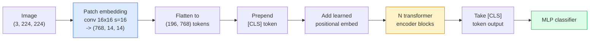

# Vision Transformers (ViT)

> 이미지를 패치로 자르고, 각 패치를 단어처럼 다룬 뒤, 표준 트랜스포머를 실행합니다. 뒤돌아보지 마세요.

**Type:** Build
**Languages:** Python
**Prerequisites:** Phase 7 Lesson 02 (Self-Attention), Phase 4 Lesson 04 (Image Classification)
**Time:** ~45 minutes

## 학습 목표

- 최소 ViT를 만들기 위해 patch embedding, learned positional embedding, class token, transformer encoder block을 처음부터 구현합니다
- DeiT와 MAE가 그렇지 않음을 입증하기 전까지 ViT가 대규모 사전학습 데이터를 필요로 한다고 여겨졌던 이유를 설명합니다
- ViT, Swin, ConvNeXt를 아키텍처 prior(없음, local window attention, conv backbone) 관점에서 비교합니다
- `timm`과 표준 linear-probe / fine-tune 레시피를 사용해 작은 데이터셋에서 사전학습된 ViT를 파인튜닝합니다

## 문제

10년 동안 합성곱은 컴퓨터 비전과 동의어였습니다. CNN에는 locality, translation equivariance라는 강한 귀납 편향이 있었고, 누구도 이를 대체할 수 있다고 생각하지 않았습니다. 그러다 Dosovitskiy et al. (2020)이 합성곱 장치 없이도 평탄화한 이미지 패치에 적용한 plain transformer가 규모가 충분하면 최고의 CNN과 맞먹거나 능가할 수 있음을 보였습니다.

문제는 "규모가 충분하면"이었습니다. ImageNet-1k에서 ViT는 ResNet에 졌습니다. ImageNet-21k 또는 JFT-300M에서 사전학습한 뒤 ImageNet-1k에서 파인튜닝한 ViT는 ResNet을 이겼습니다. 결론은 트랜스포머가 유용한 prior는 부족하지만 충분한 데이터에서 그것을 학습할 수 있다는 것이었습니다. 이후 연구(DeiT, MAE, DINO)는 강한 augmentation, self-supervised pretraining, distillation 같은 올바른 학습 레시피가 있으면 ViT도 작은 데이터에서 잘 학습됨을 보였습니다.

2026년에도 순수 CNN은 edge device에서 여전히 경쟁력 있습니다(ConvNeXt가 가장 강합니다). 하지만 그 외에는 트랜스포머가 지배합니다: segmentation(Mask2Former, SegFormer), detection(DETR, RT-DETR), multimodal(CLIP, SigLIP), video(VideoMAE, VJEPA). ViT block 구조는 반드시 알아야 할 구조입니다.

## 개념

### 파이프라인



일곱 단계입니다. Patches -> tokens -> attention -> classifier. 모든 변형(DeiT, Swin, ConvNeXt, MAE pretraining)은 일곱 단계 중 한두 개만 바꾸고 나머지는 그대로 둡니다.

### 패치 임베딩

첫 번째 conv가 비밀입니다. Kernel size 16, stride 16이므로 224x224 이미지는 16x16 패치의 14x14 격자가 되고, 각 패치는 768차원 임베딩으로 투영됩니다. 이 단일 conv가 patchify와 선형 투영을 동시에 수행합니다.

```text
Input:  (3, 224, 224)
Conv (3 -> 768, k=16, s=16, no padding):
Output: (768, 14, 14)
Flatten spatial: (196, 768)
```

196개 패치 = 196개 토큰입니다. 각 토큰의 특징 차원은 768(ViT-B), 1024(ViT-L), 1280(ViT-H)입니다.

### 클래스 토큰

시퀀스 앞에 하나의 학습된 벡터를 붙입니다:

```text
tokens = [CLS; patch_1; patch_2; ...; patch_196]   shape (197, 768)
```

N개의 트랜스포머 블록 이후 `[CLS]` 출력은 전역 이미지 표현입니다. 분류 헤드는 이 벡터 하나만 읽습니다.

### 위치 임베딩

트랜스포머에는 공간 위치에 대한 내장 개념이 없습니다. 모든 토큰에 학습된 벡터를 더합니다:

```text
tokens = tokens + learned_pos_embedding   (also shape (197, 768))
```

임베딩은 모델의 파라미터입니다. gradient-based training이 이를 2D 이미지 구조에 맞게 적응시킵니다. Sinusoidal 2D 대안도 있지만 실제로는 거의 쓰이지 않습니다.

### 트랜스포머 인코더 블록

표준 구조입니다. Multi-head self-attention, MLP, residual connection, pre-LayerNorm입니다.

```text
x = x + MSA(LN(x))
x = x + MLP(LN(x))

MLP is two-layer with GELU: Linear(d -> 4d) -> GELU -> Linear(4d -> d)
```

ViT-B/16은 이런 블록을 12개 쌓고, 각 블록에는 12개의 attention head가 있으며, 총 86M 파라미터입니다.

### Pre-LN이 필요한 이유

초기 트랜스포머는 post-LN(`x = LN(x + sublayer(x))`)을 사용했고, warmup 없이 6-8층을 넘겨 학습하기 어려웠습니다. Pre-LN(`x = x + sublayer(LN(x))`)은 더 깊은 네트워크를 warmup 없이 안정적으로 학습합니다. 모든 ViT와 모든 현대 LLM은 pre-LN을 사용합니다.

### 패치 크기의 절충

- 16x16 patches -> 196 tokens, 표준.
- 32x32 patches -> 49 tokens, 더 빠르지만 해상도가 낮습니다.
- 8x8 patches -> 784 tokens, 더 세밀하지만 O(n^2) attention cost가 나쁘게 증가합니다.

더 큰 패치 = 더 적은 토큰 = 더 빠르지만 공간 세부 정보가 줄어듭니다. SwinV2는 계층적 window에서 4x4 패치를 사용합니다.

### ImageNet-1k에서 ViT를 학습한 DeiT의 레시피

원래 ViT는 CNN을 이기기 위해 JFT-300M이 필요했습니다. DeiT(Touvron et al., 2020)는 네 가지 변경으로 ImageNet-1k만 사용해 ViT-B를 81.8% top-1까지 학습했습니다:

1. 강한 augmentation: RandAugment, Mixup, CutMix, Random Erasing.
2. Stochastic depth(학습 중 전체 블록을 무작위로 drop).
3. Repeated augmentation(같은 이미지를 배치당 3번 샘플링).
4. CNN teacher로부터의 distillation(선택 사항, 정확도를 더 올립니다).

모든 현대 ViT 학습 레시피는 DeiT에서 내려옵니다.

### Swin vs ConvNeXt

- **Swin** (Liu et al., 2021) — window 기반 attention입니다. 각 블록은 local window 안에서 attention을 수행합니다. 번갈아 나오는 블록은 window를 이동시켜 window 사이의 정보를 섞습니다. attention 연산자는 유지하면서 CNN 같은 locality prior를 되살립니다.
- **ConvNeXt** (Liu et al., 2022) — Swin의 아키텍처 선택(depthwise convs, LayerNorm, GELU, inverted bottleneck)에 맞춰 재설계한 CNN입니다. 격차가 "attention vs convolution"이 아니라 "현대 학습 레시피 + 아키텍처"임을 보였습니다.

2026년에 ConvNeXt-V2와 Swin-V2는 둘 다 프로덕션급입니다. 올바른 선택은 추론 스택(ConvNeXt는 edge에서 더 잘 컴파일됨)과 사전학습 말뭉치에 따라 달라집니다.

### MAE 사전학습

Masked Autoencoder(He et al., 2022): 패치의 75%를 무작위로 mask하고, encoder가 보이는 25%만 처리하도록 학습하며, 작은 decoder가 encoder 출력에서 mask된 패치를 재구성하도록 학습합니다. 사전학습 후 decoder를 버리고 encoder를 파인튜닝합니다.

MAE는 ViT가 ImageNet-1k만으로 학습 가능하게 만들고, SOTA에 도달하며, 현재 기본 self-supervised 레시피입니다.

## 직접 만들기

### Step 1: 패치 임베딩

```python
import torch
import torch.nn as nn

class PatchEmbedding(nn.Module):
    def __init__(self, in_channels=3, patch_size=16, dim=192, image_size=64):
        super().__init__()
        assert image_size % patch_size == 0
        self.proj = nn.Conv2d(in_channels, dim, kernel_size=patch_size, stride=patch_size)
        num_patches = (image_size // patch_size) ** 2
        self.num_patches = num_patches

    def forward(self, x):
        x = self.proj(x)
        return x.flatten(2).transpose(1, 2)
```

conv 하나, flatten 하나, transpose 하나. 이것이 전체 image-to-tokens 단계입니다.

### Step 2: 트랜스포머 블록

Pre-LN, multi-head self-attention, GELU가 있는 MLP, residual connection입니다.

```python
class Block(nn.Module):
    def __init__(self, dim, num_heads, mlp_ratio=4, dropout=0.0):
        super().__init__()
        self.ln1 = nn.LayerNorm(dim)
        self.attn = nn.MultiheadAttention(dim, num_heads, dropout=dropout, batch_first=True)
        self.ln2 = nn.LayerNorm(dim)
        self.mlp = nn.Sequential(
            nn.Linear(dim, dim * mlp_ratio),
            nn.GELU(),
            nn.Dropout(dropout),
            nn.Linear(dim * mlp_ratio, dim),
            nn.Dropout(dropout),
        )

    def forward(self, x):
        a, _ = self.attn(self.ln1(x), self.ln1(x), self.ln1(x), need_weights=False)
        x = x + a
        x = x + self.mlp(self.ln2(x))
        return x
```

`nn.MultiheadAttention`은 head 분할, scaled dot-product, output projection을 처리합니다. `batch_first=True`이므로 shape는 `(N, seq, dim)`입니다.

### Step 3: ViT

```python
class ViT(nn.Module):
    def __init__(self, image_size=64, patch_size=16, in_channels=3,
                 num_classes=10, dim=192, depth=6, num_heads=3, mlp_ratio=4):
        super().__init__()
        self.patch = PatchEmbedding(in_channels, patch_size, dim, image_size)
        num_patches = self.patch.num_patches
        self.cls_token = nn.Parameter(torch.zeros(1, 1, dim))
        self.pos_embed = nn.Parameter(torch.zeros(1, num_patches + 1, dim))
        self.blocks = nn.ModuleList([
            Block(dim, num_heads, mlp_ratio) for _ in range(depth)
        ])
        self.ln = nn.LayerNorm(dim)
        self.head = nn.Linear(dim, num_classes)
        nn.init.trunc_normal_(self.pos_embed, std=0.02)
        nn.init.trunc_normal_(self.cls_token, std=0.02)

    def forward(self, x):
        x = self.patch(x)
        cls = self.cls_token.expand(x.size(0), -1, -1)
        x = torch.cat([cls, x], dim=1)
        x = x + self.pos_embed
        for blk in self.blocks:
            x = blk(x)
        x = self.ln(x[:, 0])
        return self.head(x)

vit = ViT(image_size=64, patch_size=16, num_classes=10, dim=192, depth=6, num_heads=3)
x = torch.randn(2, 3, 64, 64)
print(f"output: {vit(x).shape}")
print(f"params: {sum(p.numel() for p in vit.parameters()):,}")
```

약 2.8M 파라미터로, CPU에서도 다룰 수 있는 작은 ViT입니다. 실제 ViT-B는 86M입니다. 같은 class definition에 `dim=768, depth=12, num_heads=12`를 사용하면 됩니다.

### Step 4: Sanity check — 단일 이미지 추론

```python
logits = vit(torch.randn(1, 3, 64, 64))
print(f"logits: {logits}")
print(f"probs:  {logits.softmax(-1)}")
```

오류 없이 실행되어야 합니다. 확률의 합은 1입니다.

## 사용하기

`timm`은 ImageNet 사전학습 가중치가 있는 모든 ViT 변형을 제공합니다. 한 줄이면 됩니다:

```python
import timm

model = timm.create_model("vit_base_patch16_224", pretrained=True, num_classes=10)
```

`timm`은 2026년 비전 트랜스포머의 프로덕션 기본값입니다. 같은 API 아래에서 ViT, DeiT, Swin, Swin-V2, ConvNeXt, ConvNeXt-V2, MaxViT, MViT, EfficientFormer 등 수십 가지 모델을 지원합니다.

멀티모달 작업(image + text)에는 `transformers`가 CLIP, SigLIP, BLIP-2, LLaVA를 제공합니다. 이 모든 모델의 이미지 인코더는 ViT 변형입니다.

## 산출물

이 레슨은 다음을 만듭니다:

- `outputs/prompt-vit-vs-cnn-picker.md` — 데이터셋 크기, compute, 추론 스택에 따라 ViT, ConvNeXt, Swin 중 하나를 고르는 프롬프트.
- `outputs/skill-vit-patch-and-pos-embed-inspector.md` — ViT의 patch embedding과 positional embedding shape가 모델의 예상 sequence length와 일치하는지 검증해 가장 흔한 포팅 버그를 잡는 스킬.

## 연습 문제

1. **(쉬움)** 위의 작은 ViT에서 forward pass 동안 모든 중간 텐서 shape를 출력하세요. 다음을 확인하세요: input `(N, 3, 64, 64)` -> patches `(N, 16, 192)` -> with CLS `(N, 17, 192)` -> classifier input `(N, 192)` -> output `(N, num_classes)`.
2. **(중간)** Lesson 4의 synthetic-CIFAR 데이터셋에서 사전학습된 `timm` ViT-S/16을 파인튜닝하세요. 같은 데이터에서 ResNet-18 파인튜닝과 비교하세요. 학습 시간과 최종 정확도를 보고하세요.
3. **(어려움)** 작은 ViT를 위한 MAE 사전학습을 구현하세요. 패치의 75%를 mask하고, encoder + 작은 decoder를 학습해 mask된 패치를 재구성합니다. 사전학습 전후 synthetic data의 linear-probe accuracy를 평가하세요.

## 핵심 용어

| 용어 | 사람들이 말하는 것 | 실제 의미 |
|------|----------------|----------------------|
| Patch embedding | "첫 번째 conv" | kernel size = stride = patch size인 conv. 이미지를 token embedding 격자로 바꿉니다 |
| Class token | "[CLS]" | 토큰 시퀀스 앞에 붙는 학습된 벡터. 최종 출력이 전역 이미지 표현입니다 |
| Positional embedding | "Learned pos" | 트랜스포머가 각 패치의 출처 위치를 알 수 있도록 모든 토큰에 더하는 학습된 벡터 |
| Pre-LN | "LayerNorm before sublayer" | 안정적인 트랜스포머 변형: `LN(x + sublayer(x))` 대신 `x + sublayer(LN(x))` |
| Multi-head attention | "Parallel attention" | 표준 트랜스포머 attention을 num_heads개의 독립 부분공간으로 나누고 나중에 연결한 것 |
| ViT-B/16 | "Base, patch 16" | 표준 크기: dim=768, depth=12, heads=12, patch_size=16, image=224; ~86M params |
| DeiT | "Data-efficient ViT" | 강한 augmentation으로 ImageNet-1k만 사용해 학습한 ViT. 대형 사전학습 데이터셋이 반드시 필요하지 않음을 입증했습니다 |
| MAE | "Masked autoencoder" | self-supervised pretraining: 패치의 75%를 mask하고 재구성합니다. 지배적인 ViT 사전학습 레시피입니다 |

## 더 읽기

- [An Image is Worth 16x16 Words (Dosovitskiy et al., 2020)](https://arxiv.org/abs/2010.11929) — ViT 논문
- [DeiT: Data-efficient Image Transformers (Touvron et al., 2020)](https://arxiv.org/abs/2012.12877) — ImageNet-1k만으로 ViT를 학습하는 방법
- [Masked Autoencoders are Scalable Vision Learners (He et al., 2022)](https://arxiv.org/abs/2111.06377) — MAE 사전학습
- [timm documentation](https://huggingface.co/docs/timm) — 프로덕션에서 사용할 모든 비전 트랜스포머의 reference
