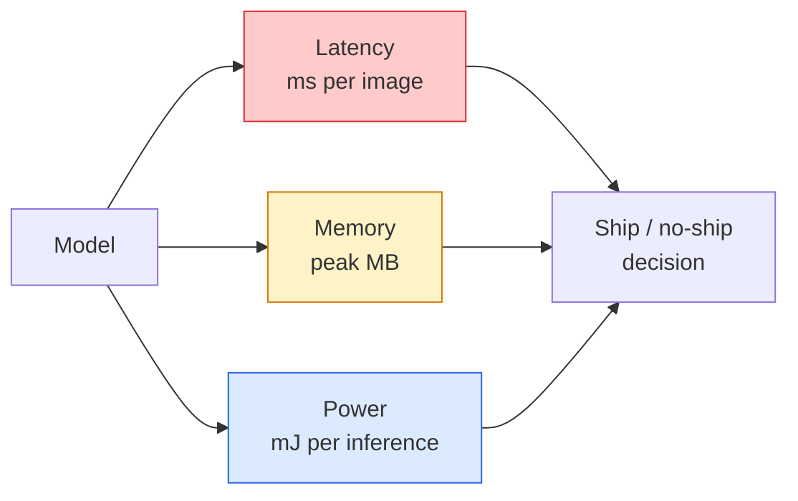

# 실시간 비전 - 엣지 배포

> 엣지 추론은 정확도 90의 모델을 RAM 2GB 장치에서 30fps로 실행하게 만드는 분야입니다. 정확도 1%포인트마다 지연 시간 몇 밀리초와 맞바꾸게 됩니다.

**Type:** Learn + Build
**Languages:** Python
**Prerequisites:** Phase 4 Lesson 04 (Image Classification), Phase 10 Lesson 11 (Quantization)
**Time:** ~75분

## 학습 목표

- 어떤 PyTorch 모델이든 추론 지연 시간, 피크 메모리, 처리량을 측정하고 FLOPs / 파라미터 / 지연 시간의 트레이드오프를 해석합니다
- PyTorch의 사후 학습 양자화를 사용해 비전 모델을 INT8로 양자화하고 정확도 손실이 1% 미만인지 검증합니다
- ONNX로 내보내고 ONNX Runtime 또는 TensorRT로 컴파일합니다. 가장 흔한 내보내기 실패 세 가지와 해결책을 말할 수 있습니다
- 엣지 제약에서 MobileNetV3, EfficientNet-Lite, ConvNeXt-Tiny, MobileViT 중 무엇을 골라야 하는지 설명합니다

## 문제

학습 시점의 비전 모델은 부동소수점 괴물입니다. 파라미터 1억 개, 순전파 한 번에 10 GFLOPs, VRAM 2GB. 휴대폰, 자동차 인포테인먼트 장치, 산업용 카메라, 드론에는 어느 것도 맞지 않습니다. 비전 시스템을 출시한다는 것은 같은 예측을 100배 더 작은 예산 안에 넣는다는 뜻입니다.

대부분의 작업은 세 가지 손잡이가 처리합니다. 모델 선택(같은 레시피를 쓰는 더 작은 아키텍처), 양자화(FP32 대신 INT8), 추론 런타임(ONNX Runtime, TensorRT, Core ML, TFLite)입니다. 이것들을 제대로 맞추느냐가 워크스테이션에서 돌아가는 데모와 30달러짜리 카메라 모듈에 실리는 제품을 가릅니다.

이 레슨은 먼저 측정 규율을 세운 뒤(측정하지 못하는 것은 최적화할 수 없습니다), 세 가지 손잡이를 차례로 다룹니다. 목표는 모든 엣지 런타임을 배우는 것이 아니라 어떤 레버가 있고 각각이 생각대로 작동하는지 검증하는 방법을 아는 것입니다.

## 개념

### 세 가지 예산



- **지연 시간**: p50, p95, p99. p50 평균만 보면 실시간 시스템에서 중요한 꼬리 동작을 숨기게 됩니다.
- **피크 메모리**: 정상 상태 평균이 아니라 장치가 한 번이라도 보게 되는 최대값입니다. 임베디드 대상에서는 OOM이 치명적이므로 중요합니다.
- **전력 / 에너지**: 배터리 구동 장치에서 추론당 밀리줄입니다. CPU/GPU 사용률 * 시간으로 대리 측정하는 경우가 많습니다.

(모델, 지연 시간, 메모리, 정확도) 표가 엣지 결정을 만드는 근거입니다. 모든 셀은 워크스테이션이 아니라 대상 장치에서 측정해야 합니다.

### 측정 규율

모든 엣지 프로파일이 따라야 하는 세 가지 규칙입니다.

1. 측정 전에 더미 순전파를 5-10회 실행해 모델을 **워밍업**합니다. 차가운 캐시와 JIT 컴파일은 대표성이 없는 첫 숫자를 만듭니다.
2. 시간 측정 블록 전후에 `torch.cuda.synchronize()`로 GPU 작업을 **동기화**합니다. 이것이 없으면 커널 실행이 아니라 커널 디스패치를 측정합니다.
3. 입력 크기를 프로덕션 해상도로 **고정**합니다. 224x224의 지연 시간은 512x512의 지연 시간이 아닙니다.

### 대리 지표로서 FLOPs

FLOPs(추론당 부동소수점 연산 수)는 저렴하고 장치 독립적인 지연 시간 대리 지표입니다. 아키텍처 비교에는 유용하지만 절대 벽시계 시간으로는 오해를 부릅니다. FLOPs가 10% 더 많은 모델이 실제로는 2배 빠를 수 있습니다. 하드웨어 친화적인 연산을 쓰기 때문입니다(depthwise conv는 잘 컴파일되지만 큰 7x7 conv는 그렇지 않습니다).

규칙: 아키텍처 탐색에는 FLOPs를 쓰고, 배포 결정에는 장치 내 지연 시간을 씁니다.

### 한 문단으로 보는 양자화

FP32 가중치와 활성값을 INT8로 바꿉니다. INT8 커널이 있는 하드웨어(모든 최신 모바일 SoC, Tensor Cores가 있는 모든 NVIDIA GPU)에서는 모델 크기가 4배 줄고, 메모리 대역폭이 4배 줄며, 계산량이 2-4배 줄어듭니다. 비전 작업에서 사후 학습 정적 양자화의 정확도 손실은 보통 0.1-1%포인트입니다.

종류:

- **Dynamic**: 가중치를 INT8로 양자화하고 활성값은 FP로 계산합니다. 쉽지만 속도 향상은 작습니다.
- **Static (post-training)**: 가중치를 양자화하고 작은 보정 세트에서 활성값 범위를 보정합니다. dynamic보다 훨씬 빠릅니다.
- **Quantisation-aware training (QAT)**: 학습 중 양자화를 시뮬레이션해 모델이 그 주변을 학습하게 합니다. 정확도가 가장 좋지만 라벨 데이터가 필요합니다.

비전에서는 사후 학습 정적 양자화가 노력 5%로 이득 95%를 줍니다. PTQ의 정확도 손실이 받아들일 수 없을 때만 QAT를 사용하세요.

### 가지치기와 증류

- **Pruning**: 중요하지 않은 가중치(크기 기반)나 채널(구조적)을 제거합니다. 과대 파라미터화된 모델에서는 잘 작동하지만 이미 작은 아키텍처에는 덜 유용합니다.
- **Distillation**: 작은 학생 모델이 큰 교사 모델의 logits를 모방하도록 학습합니다. 모델을 줄이면서 잃은 정확도의 대부분을 자주 회복합니다. 프로덕션 엣지 모델의 표준 기법입니다.

### 추론 런타임

- **PyTorch eager**: 느리며 배포용이 아닙니다. 개발에만 사용합니다.
- **TorchScript**: 레거시입니다. `torch.compile`과 ONNX 내보내기가 대체했습니다.
- **ONNX Runtime**: 중립 런타임입니다. CPU, CUDA, CoreML, TensorRT, OpenVINO 모두 ONNX provider가 있습니다. 여기서 시작하세요.
- **TensorRT**: NVIDIA의 컴파일러입니다. NVIDIA GPU(워크스테이션과 Jetson)에서 지연 시간이 가장 좋습니다. ONNX Runtime 또는 독립 실행 방식과 통합됩니다.
- **Core ML**: iOS/macOS용 Apple 런타임입니다. `.mlmodel` 또는 `.mlpackage`가 필요합니다.
- **TFLite**: Android/ARM용 Google 런타임입니다. `.tflite`가 필요합니다.
- **OpenVINO**: CPU/VPU용 Intel 런타임입니다. `.xml` + `.bin`이 필요합니다.

실무에서는 PyTorch -> ONNX로 내보낸 뒤 대상에 맞는 런타임을 고릅니다. ONNX가 공용어입니다.

### 엣지 아키텍처 선택기

| 예산 | 모델 | 이유 |
|--------|-------|-----|
| < 3M params | MobileNetV3-Small | 어디서나 컴파일되고 좋은 기준선입니다 |
| 3-10M | EfficientNet-Lite-B0 | TFLite에서 파라미터당 정확도가 가장 좋습니다 |
| 10-20M | ConvNeXt-Tiny | 파라미터당 정확도가 가장 좋고 CPU 친화적입니다 |
| 20-30M | MobileViT-S or EfficientViT | ImageNet 정확도를 내는 Transformer입니다 |
| 30-80M | Swin-V2-Tiny | 스택이 window attention을 지원할 때 선택합니다 |

명확한 이유가 없다면 이 모델들은 모두 INT8로 양자화하세요.

```figure
cnn-param-count
```

## 직접 만들기

### 1단계: 지연 시간을 올바르게 측정하기

```python
import time
import torch

def measure_latency(model, input_shape, device="cpu", warmup=10, iters=50):
    model = model.to(device).eval()
    x = torch.randn(input_shape, device=device)
    with torch.no_grad():
        for _ in range(warmup):
            model(x)
        if device == "cuda":
            torch.cuda.synchronize()
        times = []
        for _ in range(iters):
            if device == "cuda":
                torch.cuda.synchronize()
            t0 = time.perf_counter()
            model(x)
            if device == "cuda":
                torch.cuda.synchronize()
            times.append((time.perf_counter() - t0) * 1000)
    times.sort()
    return {
        "p50_ms": times[len(times) // 2],
        "p95_ms": times[int(len(times) * 0.95)],
        "p99_ms": times[int(len(times) * 0.99)],
        "mean_ms": sum(times) / len(times),
    }
```

워밍업하고, 동기화하고, `time.perf_counter()`를 사용합니다. 평균만이 아니라 백분위수를 보고하세요.

### 2단계: 파라미터와 FLOP 수

```python
def parameter_count(model):
    return sum(p.numel() for p in model.parameters())

def flops_estimate(model, input_shape):
    """
    Rough FLOP count for a conv/linear-only model. For production use `fvcore` or `ptflops`.
    """
    total = 0
    def conv_hook(m, inp, out):
        nonlocal total
        c_out, c_in, kh, kw = m.weight.shape
        h, w = out.shape[-2:]
        total += 2 * c_in * c_out * kh * kw * h * w
    def linear_hook(m, inp, out):
        nonlocal total
        total += 2 * m.in_features * m.out_features
    hooks = []
    for m in model.modules():
        if isinstance(m, torch.nn.Conv2d):
            hooks.append(m.register_forward_hook(conv_hook))
        elif isinstance(m, torch.nn.Linear):
            hooks.append(m.register_forward_hook(linear_hook))
    model.eval()
    with torch.no_grad():
        model(torch.randn(input_shape))
    for h in hooks:
        h.remove()
    return total
```

실제 프로젝트에서는 `fvcore.nn.FlopCountAnalysis` 또는 `ptflops`를 사용하세요. 모든 모듈 타입을 올바르게 처리합니다.

### 3단계: 사후 학습 정적 양자화

```python
def quantise_ptq(model, calibration_loader, backend="x86"):
    import torch.ao.quantization as tq
    model = model.eval().cpu()
    model.qconfig = tq.get_default_qconfig(backend)
    tq.prepare(model, inplace=True)
    with torch.no_grad():
        for x, _ in calibration_loader:
            model(x)
    tq.convert(model, inplace=True)
    return model
```

세 단계입니다. 설정, prepare(observer 삽입), 실제 데이터로 보정, convert(fuse + 양자화). 모델이 fuse되어 있어야 하며(`Conv -> BN -> ReLU` -> `ConvBnReLU`), `torch.ao.quantization.fuse_modules`가 이를 처리합니다.

### 4단계: ONNX로 내보내기

```python
def export_onnx(model, sample_input, path="model.onnx"):
    model = model.eval()
    torch.onnx.export(
        model,
        sample_input,
        path,
        input_names=["input"],
        output_names=["output"],
        dynamic_axes={"input": {0: "batch"}, "output": {0: "batch"}},
        opset_version=17,
    )
    return path
```

`opset_version=17`은 2026년의 안전한 기본값입니다. `dynamic_axes`를 쓰면 ONNX 모델을 임의의 배치 크기로 실행할 수 있습니다.

### 5단계: 체제별 벤치마크와 비교

```python
import torch.nn as nn
from torchvision.models import mobilenet_v3_small

def compare_regimes():
    model = mobilenet_v3_small(weights=None, num_classes=10)
    params = parameter_count(model)
    flops = flops_estimate(model, (1, 3, 224, 224))
    lat_fp32 = measure_latency(model, (1, 3, 224, 224), device="cpu")
    print(f"FP32 MobileNetV3-Small: {params:,} params  {flops/1e9:.2f} GFLOPs  "
          f"p50={lat_fp32['p50_ms']:.2f}ms  p95={lat_fp32['p95_ms']:.2f}ms")
```

같은 함수를 `resnet50`, `efficientnet_v2_s`, `convnext_tiny`에 실행하면 배포 결정에 필요한 비교 표가 생깁니다.

## 활용하기

프로덕션 스택은 세 경로 중 하나로 수렴합니다.

- **Web / serverless**: PyTorch -> ONNX -> ONNX Runtime(CPU 또는 CUDA provider). 가장 쉽고 대부분에 충분합니다.
- **NVIDIA edge (Jetson, GPU server)**: PyTorch -> ONNX -> TensorRT. 지연 시간이 가장 좋지만 엔지니어링 노력이 가장 큽니다.
- **Mobile**: PyTorch -> ONNX -> Core ML(iOS) 또는 TFLite(Android). 내보내기 전에 양자화합니다.

측정에는 `torch-tb-profiler`, `nvprof` / `nsys`, macOS의 Instruments가 계층별 분석을 제공합니다. `benchmark_app`(OpenVINO)과 `trtexec`(TensorRT)는 독립 CLI 수치를 제공합니다.

## 출시하기

이 레슨의 산출물:

- `outputs/prompt-edge-deployment-planner.md`: 대상 장치와 지연 시간 SLA가 주어졌을 때 backbone, 양자화 전략, 런타임을 고르는 프롬프트입니다.
- `outputs/skill-latency-profiler.md`: 워밍업, 동기화, 백분위수, 메모리 추적을 포함한 완전한 지연 시간 벤치마크 스크립트를 작성하는 스킬입니다.

## 연습 문제

1. **(Easy)** CPU에서 224x224 입력으로 `resnet18`, `mobilenet_v3_small`, `efficientnet_v2_s`, `convnext_tiny`의 p50 지연 시간을 측정하세요. 표를 보고하고 ms당 정확도가 가장 좋은 아키텍처를 식별하세요.
2. **(Medium)** `mobilenet_v3_small`에 사후 학습 정적 양자화를 적용하세요. CIFAR-10 또는 유사 데이터의 hold-out 부분집합에서 FP32와 INT8의 지연 시간 및 정확도 손실을 보고하세요.
3. **(Hard)** `convnext_tiny`를 ONNX로 내보내고, `CPUExecutionProvider`와 함께 `onnxruntime`으로 실행한 뒤 PyTorch eager 기준선과 지연 시간을 비교하세요. ONNX Runtime이 더 빠른 첫 계층을 식별하고 이유를 설명하세요.

## 핵심 용어

| 용어 | 흔히 하는 말 | 실제 의미 |
|------|----------------|----------------------|
| Latency | "얼마나 빠른가" | 입력부터 출력까지 걸리는 시간입니다. 평균이 아니라 p50/p95/p99 백분위수입니다 |
| FLOPs | "모델 크기" | 순전파당 부동소수점 연산 수입니다. 계산 비용의 거친 대리 지표입니다 |
| INT8 quantisation | "8비트" | FP32 가중치/활성값을 8비트 정수로 바꿉니다. 약 4배 작고 2-4배 빠릅니다 |
| PTQ | "사후 학습 양자화" | 재학습 없이 학습된 모델을 양자화합니다. 쉽고 대개 충분합니다 |
| QAT | "양자화 인지 학습" | 학습 중 양자화를 시뮬레이션합니다. 정확도가 가장 좋고 라벨 데이터가 필요합니다 |
| ONNX | "중립 형식" | 모든 주류 추론 런타임이 지원하는 모델 교환 형식입니다 |
| TensorRT | "NVIDIA 컴파일러" | ONNX를 NVIDIA GPU용 최적화 엔진으로 컴파일합니다 |
| Distillation | "교사 -> 학생" | 작은 모델이 큰 모델의 logits를 모방하도록 학습합니다. 잃은 정확도의 대부분을 회복합니다 |

## 더 읽을거리

- [EfficientNet (Tan & Le, 2019)](https://arxiv.org/abs/1905.11946): 효율적인 아키텍처를 위한 compound scaling
- [MobileNetV3 (Howard et al., 2019)](https://arxiv.org/abs/1905.02244): h-swish와 squeeze-excite를 갖춘 모바일 우선 아키텍처
- [A Practical Guide to TensorRT Optimization (NVIDIA)](https://developer.nvidia.com/blog/accelerating-model-inference-with-tensorrt-tips-and-best-practices-for-pytorch-users/): 논문 속 처리량 수치를 실제로 얻는 방법
- [ONNX Runtime docs](https://onnxruntime.ai/docs/): 양자화, 그래프 최적화, provider 선택
