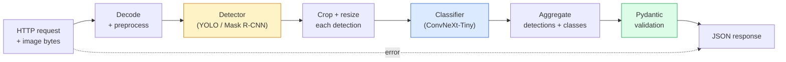

# 완전한 비전 파이프라인 만들기 - 캡스톤

> 프로덕션 비전 시스템은 데이터 계약으로 이어 붙인 모델과 규칙의 사슬입니다. 조각들은 이미 이 단계에 있습니다. 캡스톤은 그것들을 끝에서 끝까지 연결합니다.

**Type:** Build
**Languages:** Python
**Prerequisites:** Phase 4 Lessons 01-15
**Time:** ~120분

## 학습 목표

- 객체를 감지하고 분류한 뒤 구조화된 JSON을 내보내는 프로덕션 비전 파이프라인을 설계합니다. 모든 실패 경로를 처리합니다
- detector(Mask R-CNN 또는 YOLO), classifier(ConvNeXt-Tiny), 데이터 계약(Pydantic)을 하나의 서비스에 연결합니다
- 엔드투엔드 파이프라인을 벤치마크하고 첫 번째 병목(보통 전처리, 그다음 detector)을 식별합니다
- 이미지 업로드를 받아 파이프라인을 실행하고 분류가 붙은 detection을 반환하는 최소 FastAPI 서비스를 출시합니다

## 문제

개별 비전 모델은 유용하지만, 비전 제품은 모델들의 사슬입니다. 소매 진열대 감사는 detector에 제품 classifier와 가격 OCR 파이프라인을 더한 것입니다. 자율주행은 2D detector, 3D detector, segmenter, tracker, planner의 조합입니다. 의료 사전 선별은 segmenter, 영역 classifier, 임상의 UI의 조합입니다.

이 사슬을 연결하는 일이 ML 프로토타입과 제품을 가릅니다. 모델 사이의 모든 인터페이스는 새로운 버그 지점입니다. 모든 좌표 변환, 모든 정규화, 모든 mask resize는 조용한 실패 후보입니다. 파이프라인은 가장 약한 인터페이스만큼만 강합니다.

이 캡스톤은 최소 실행 가능한 파이프라인을 세웁니다. detection + classification + 구조화된 출력 + serving layer입니다. Phase 4의 다른 모든 것은 이 뼈대에 꽂을 수 있습니다. Mask R-CNN을 YOLOv8로 바꾸고, OCR head를 추가하고, segmentation branch를 추가하고, tracker를 추가하세요. 아키텍처는 안정적이고 조각들은 교체 가능합니다.

## 개념

### 파이프라인



일곱 단계입니다. 두 모델 단계는 비용이 큽니다. 나머지 다섯 단계에는 버그가 숨어 있습니다.

### Pydantic으로 만드는 데이터 계약

모든 모델 경계는 타입이 있는 객체가 됩니다. 이것은 조용한 실패를 크게 드러나는 실패로 바꿉니다.

```text
Detection(
    box: tuple[float, float, float, float],   # (x1, y1, x2, y2), absolute pixels
    score: float,                              # [0, 1]
    class_id: int,                             # from detector's label map
    mask: Optional[list[list[int]]],           # RLE-encoded if present
)

PipelineResult(
    image_id: str,
    detections: list[Detection],
    classifications: list[Classification],
    inference_ms: float,
)
```

detector가 `(x1, y1, x2, y2)` 대신 `(cx, cy, w, h)` 상자를 반환하면 Pydantic 검증이 경계에서 실패합니다. 그러면 조용히 빈 영역을 반환하는 downstream crop을 디버깅하는 대신 즉시 알 수 있습니다.

### 지연 시간이 쓰이는 곳

거의 모든 비전 파이프라인에서 세 가지 사실이 성립합니다.

1. **전처리가 가장 큰 단일 블록인 경우가 많습니다.** JPEG decoding, color space 변환, resizing은 CPU-bound이며 잊기 쉽습니다.
2. **detector가 GPU 시간을 지배합니다.** GPU 시간의 70-90%는 detection forward pass에 있습니다.
3. **후처리(NMS, RLE encode/decode)는 GPU에서는 싸고 CPU에서는 비쌉니다.** 항상 실제 대상에서 프로파일링하세요.

분포를 아는 것이 최적화를 우선순위 목록으로 바꿉니다.

### 실패 모드

- **빈 detection**: 빈 리스트를 반환하고 crash하지 않습니다. 로그를 남깁니다.
- **범위를 벗어난 box**: crop 전에 이미지 크기로 clamp합니다.
- **너무 작은 crop**: classifier의 최소 입력보다 작은 box는 classification을 건너뜁니다.
- **손상된 upload**: 500이 아니라 구체적인 error code가 있는 400 response를 반환합니다.
- **모델 load 실패**: 첫 request가 아니라 service startup에서 실패합니다.

프로덕션 파이프라인은 실패를 숨기는 일반적인 `try/except` 없이 각각을 처리합니다. 모든 실패에는 이름 있는 code와 response가 있습니다.

### 배칭

프로덕션 서비스는 여러 클라이언트를 처리합니다. request 간 detection과 classification을 배치하면 처리량이 증가합니다. 트레이드오프는 batch가 찰 때까지 기다리는 추가 지연 시간입니다. 일반적인 설정은 최대 20ms 동안 request를 모아 함께 batch 처리한 뒤 response를 분배하는 것입니다. `torchserve`와 `triton`은 이를 기본으로 지원합니다. 예측 가능한 부하의 작은 서비스는 자체 micro-batcher를 만듭니다.

## 직접 만들기

### 1단계: 데이터 계약

```python
from pydantic import BaseModel, Field
from typing import List, Optional, Tuple

class Detection(BaseModel):
    box: Tuple[float, float, float, float]
    score: float = Field(ge=0, le=1)
    class_id: int = Field(ge=0)
    mask_rle: Optional[str] = None


class Classification(BaseModel):
    detection_index: int
    class_id: int
    class_name: str
    score: float = Field(ge=0, le=1)


class PipelineResult(BaseModel):
    image_id: str
    detections: List[Detection]
    classifications: List[Classification]
    inference_ms: float
```

5초짜리 코드가 진지한 파이프라인에서 한 시간의 디버깅을 아껴 줍니다.

### 2단계: 최소 Pipeline 클래스

```python
import time
import numpy as np
import torch
from PIL import Image

class VisionPipeline:
    def __init__(self, detector, classifier, class_names,
                 device="cpu", min_crop=32):
        self.detector = detector.to(device).eval()
        self.classifier = classifier.to(device).eval()
        self.class_names = class_names
        self.device = device
        self.min_crop = min_crop

    def preprocess(self, image):
        """
        image: PIL.Image or np.ndarray (H, W, 3) uint8
        returns: CHW float tensor on device
        """
        if isinstance(image, Image.Image):
            image = np.asarray(image.convert("RGB"))
        tensor = torch.from_numpy(image).permute(2, 0, 1).float() / 255.0
        return tensor.to(self.device)

    @torch.no_grad()
    def detect(self, image_tensor):
        return self.detector([image_tensor])[0]

    @torch.no_grad()
    def classify(self, crops):
        if len(crops) == 0:
            return []
        batch = torch.stack(crops).to(self.device)
        logits = self.classifier(batch)
        probs = logits.softmax(-1)
        scores, cls = probs.max(-1)
        return list(zip(cls.tolist(), scores.tolist()))

    def run(self, image, image_id="anonymous"):
        t0 = time.perf_counter()
        tensor = self.preprocess(image)
        det = self.detect(tensor)

        crops = []
        detections = []
        valid_indices = []
        for i, (box, score, cls) in enumerate(zip(det["boxes"], det["scores"], det["labels"])):
            x1, y1, x2, y2 = [max(0, int(b)) for b in box.tolist()]
            x2 = min(x2, tensor.shape[-1])
            y2 = min(y2, tensor.shape[-2])
            detections.append(Detection(
                box=(x1, y1, x2, y2),
                score=float(score),
                class_id=int(cls),
            ))
            if (x2 - x1) < self.min_crop or (y2 - y1) < self.min_crop:
                continue
            crop = tensor[:, y1:y2, x1:x2]
            crop = torch.nn.functional.interpolate(
                crop.unsqueeze(0),
                size=(224, 224),
                mode="bilinear",
                align_corners=False,
            )[0]
            crops.append(crop)
            valid_indices.append(i)

        class_preds = self.classify(crops)

        classifications = []
        for valid_idx, (cls_id, cls_score) in zip(valid_indices, class_preds):
            classifications.append(Classification(
                detection_index=valid_idx,
                class_id=int(cls_id),
                class_name=self.class_names[cls_id],
                score=float(cls_score),
            ))

        return PipelineResult(
            image_id=image_id,
            detections=detections,
            classifications=classifications,
            inference_ms=(time.perf_counter() - t0) * 1000,
        )
```

모든 인터페이스에 타입이 있습니다. 모든 실패 경로에는 구체적인 처리 결정이 있습니다.

### 3단계: detector와 classifier 연결하기

```python
from torchvision.models.detection import maskrcnn_resnet50_fpn_v2
from torchvision.models import convnext_tiny

# Use ImageNet-pretrained weights for a realistic pipeline without training
detector = maskrcnn_resnet50_fpn_v2(weights="DEFAULT")
classifier = convnext_tiny(weights="DEFAULT")
class_names = [f"imagenet_class_{i}" for i in range(1000)]

pipe = VisionPipeline(detector, classifier, class_names)

# Smoke test with a synthetic image
test_image = (np.random.rand(400, 600, 3) * 255).astype(np.uint8)
result = pipe.run(test_image, image_id="demo")
print(result.model_dump_json(indent=2)[:500])
```

### 4단계: FastAPI 서비스

```python
from fastapi import FastAPI, UploadFile, HTTPException
from io import BytesIO

app = FastAPI()
pipe = None  # initialised on startup

@app.on_event("startup")
def load():
    global pipe
    detector = maskrcnn_resnet50_fpn_v2(weights="DEFAULT").eval()
    classifier = convnext_tiny(weights="DEFAULT").eval()
    pipe = VisionPipeline(detector, classifier, class_names=[f"c{i}" for i in range(1000)])

@app.post("/detect")
async def detect_endpoint(file: UploadFile):
    if file.content_type not in {"image/jpeg", "image/png", "image/webp"}:
        raise HTTPException(status_code=400, detail="unsupported image type")
    data = await file.read()
    try:
        img = Image.open(BytesIO(data)).convert("RGB")
    except Exception:
        raise HTTPException(status_code=400, detail="cannot decode image")
    result = pipe.run(img, image_id=file.filename or "upload")
    return result.model_dump()
```

`uvicorn main:app --host 0.0.0.0 --port 8000`로 실행합니다. `curl -F 'file=@dog.jpg' http://localhost:8000/detect`로 테스트합니다.

### 5단계: 파이프라인 벤치마크

```python
import time

def benchmark(pipe, num_runs=20, image_size=(400, 600)):
    img = (np.random.rand(*image_size, 3) * 255).astype(np.uint8)
    pipe.run(img)  # warm up

    stages = {"preprocess": [], "detect": [], "classify": [], "total": []}
    for _ in range(num_runs):
        t0 = time.perf_counter()
        tensor = pipe.preprocess(img)
        t1 = time.perf_counter()
        det = pipe.detect(tensor)
        t2 = time.perf_counter()
        crops = []
        for box in det["boxes"]:
            x1, y1, x2, y2 = [max(0, int(b)) for b in box.tolist()]
            x2 = min(x2, tensor.shape[-1])
            y2 = min(y2, tensor.shape[-2])
            if (x2 - x1) >= pipe.min_crop and (y2 - y1) >= pipe.min_crop:
                crop = tensor[:, y1:y2, x1:x2]
                crop = torch.nn.functional.interpolate(
                    crop.unsqueeze(0), size=(224, 224), mode="bilinear", align_corners=False
                )[0]
                crops.append(crop)
        pipe.classify(crops)
        t3 = time.perf_counter()
        stages["preprocess"].append((t1 - t0) * 1000)
        stages["detect"].append((t2 - t1) * 1000)
        stages["classify"].append((t3 - t2) * 1000)
        stages["total"].append((t3 - t0) * 1000)

    for stage, times in stages.items():
        times.sort()
        print(f"{stage:12s}  p50={times[len(times)//2]:7.1f} ms  p95={times[int(len(times)*0.95)]:7.1f} ms")
```

CPU의 일반적인 출력은 preprocess ~3 ms, detect 300-500 ms, classify 20-40 ms, total 350-550 ms입니다. GPU에서는 detect가 20-40 ms이고 preprocess + classify가 상대적으로 더 중요해지기 시작합니다.

## 활용하기

프로덕션 템플릿은 같은 구조에 다음을 더하는 형태로 수렴합니다.

- **모델 버전 관리**: response에 항상 모델 이름과 weights hash를 기록합니다.
- **request별 trace ID**: 느린 response를 stage와 연결할 수 있도록 모든 request의 모든 stage timing을 기록합니다.
- **fallback path**: classifier가 timeout되면 전체 request를 실패시키지 말고 classification 없는 detection을 반환합니다.
- **safety filter**: NSFW / PII filter는 classification 뒤, response가 서비스를 떠나기 전에 실행됩니다.
- **batch endpoint**: 대량 처리를 위해 이미지 URL 리스트를 받는 `/detect_batch`입니다.

프로덕션 serving에서는 `torchserve`, `Triton Inference Server`, `BentoML`이 batching, versioning, metrics, health check를 기본으로 처리합니다. `FastAPI`를 직접 실행하는 것은 prototype과 작은 규모의 제품에는 괜찮습니다.

## 출시하기

이 레슨의 산출물:

- `outputs/prompt-vision-service-shape-reviewer.md`: 비전 서비스 코드의 contract/response shape 위반을 검토하고 첫 번째 breaking bug를 이름 붙이는 프롬프트입니다.
- `outputs/skill-pipeline-budget-planner.md`: 목표 지연 시간과 처리량이 주어지면 모든 pipeline stage에 시간 예산을 배정하고 어떤 stage가 먼저 예산을 놓칠지 표시하는 스킬입니다.

## 연습 문제

1. **(Easy)** 공개 데이터셋의 이미지 10장에서 파이프라인을 실행하세요. stage별 평균 시간과 이미지별 detection 개수 분포를 보고하세요.
2. **(Medium)** `Detection`에 mask output field를 추가하고 RLE로 인코딩하세요. 객체 10개짜리 이미지에서도 JSON이 1MB 미만으로 유지되는지 검증하세요.
3. **(Hard)** classifier 앞에 micro-batcher를 추가하세요. 최대 10 ms 동안 crop을 모아 GPU call 한 번으로 모두 분류하고 request별 결과를 반환합니다. 초당 동시 request 5개에서 처리량 증가와 추가된 지연 시간을 측정하세요.

## 핵심 용어

| 용어 | 흔히 하는 말 | 실제 의미 |
|------|----------------|----------------------|
| Pipeline | "시스템" | 전처리, 추론, 후처리 단계를 순서대로 이은 사슬이며 각 쌍 사이에 타입이 있는 인터페이스가 있습니다 |
| Data contract | "스키마" | 모든 stage input과 output이 따르는 Pydantic / dataclass 정의입니다. 경계에서 통합 버그를 잡습니다 |
| Preprocessing | "모델 전" | decoding, color conversion, resizing, normalising입니다. 보통 CPU 시간의 가장 큰 소모처입니다 |
| Postprocessing | "모델 후" | NMS, mask resize, threshold, RLE encode입니다. GPU에서는 싸고 CPU에서는 비쌉니다 |
| Microbatcher | "모아서 forward" | 고정 window 동안 여러 request를 기다린 뒤 단일 batched forward pass를 실행하는 aggregator입니다 |
| Trace ID | "request id" | 느린 request를 end-to-end로 추적할 수 있도록 모든 stage에 기록되는 request별 식별자입니다 |
| Failure code | "이름 있는 error" | generic 500 대신 실패 class별 구체적인 error code입니다. client retry logic을 가능하게 합니다 |
| Health check | "readiness probe" | 서비스가 응답할 수 있는지 알려주는 저렴한 endpoint입니다. loadbalancer가 이에 의존합니다 |

## 더 읽을거리

- [Full Stack Deep Learning: Deploying Models](https://fullstackdeeplearning.com/course/2022/lecture-5-deployment/): 프로덕션 ML 배포의 표준 개요
- [BentoML docs](https://docs.bentoml.com): batching, versioning, metrics를 갖춘 serving framework
- [torchserve docs](https://pytorch.org/serve/): PyTorch의 공식 serving library
- [NVIDIA Triton Inference Server](https://developer.nvidia.com/triton-inference-server): batching과 multi-model을 지원하는 고처리량 serving
