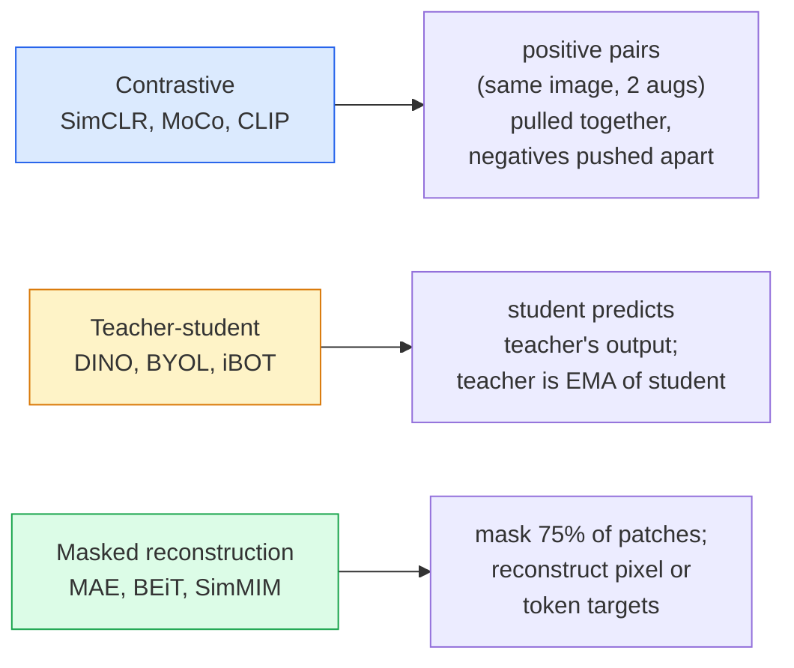

# 자기지도 비전 — SimCLR, DINO, MAE

> 라벨은 지도 비전의 병목입니다. 자기지도 사전학습은 이 병목을 없앱니다. 라벨 없는 이미지 1억 장에서 시각 특징을 학습하고, 라벨 있는 이미지 1만 장으로 파인튜닝합니다.

**Type:** Learn + Build
**Languages:** Python
**Prerequisites:** Phase 4 Lesson 04 (Image Classification), Phase 4 Lesson 14 (ViT)
**Time:** ~75 minutes

## 학습 목표

- 세 가지 주요 자기지도 계열인 contrastive(SimCLR), teacher-student(DINO), masked reconstruction(MAE)을 추적하고 각각 무엇을 최적화하는지 설명합니다
- InfoNCE 손실을 처음부터 구현하고 왜 배치 512는 동작하지만 배치 32는 실패하는지 설명합니다
- MAE의 75% 마스킹 비율이 임의로 정한 값이 아닌 이유와 텍스트용 BERT의 15%와 어떻게 다른지 설명합니다
- 선형 프로빙과 제로샷 검색에 DINOv2 또는 MAE ImageNet 체크포인트를 사용합니다

## 문제

지도 ImageNet에는 라벨이 붙은 이미지 130만 장이 있고, 주석 비용은 약 1,000만 달러로 추정됩니다. 의료 및 산업 데이터셋은 더 작고 라벨링 비용은 훨씬 더 비쌉니다. 모든 비전 팀은 묻습니다. YouTube 프레임, 웹 크롤, 웹캠 영상, 위성 스캔처럼 저렴한 라벨 없는 데이터로 사전학습한 다음, 작은 라벨 데이터셋으로 파인튜닝할 수 있을까요?

자기지도 학습이 그 답입니다. LAION 또는 JFT로 학습한 최신 자기지도 ViT는 파인튜닝하면 지도 ImageNet 정확도에 도달하거나 이를 넘어섭니다. 또한 지도 사전학습보다 다운스트림 작업(검출, 세그멘테이션, 깊이)으로 더 잘 전이됩니다. DINOv2(Meta, 2023)와 MAE(Meta, 2022)는 전이 가능한 비전 특징을 위한 현재 프로덕션 기본값입니다.

개념적 전환은 pretext task, 즉 모델이 훈련 중 수행하도록 학습되는 작업이 다운스트림 작업과 같을 필요가 없다는 점입니다. 중요한 것은 그 작업이 모델이 유용한 특징을 배우도록 강제하느냐입니다. 흑백 이미지의 색을 예측하기, 이미지를 회전하고 모델에게 회전 각도를 분류하게 하기, 패치를 마스크하고 재구성하기가 모두 효과를 냈습니다. 확장 가능한 세 가지 접근법은 contrastive learning, teacher-student distillation, masked reconstruction입니다.

## 개념

### 세 가지 계열



### 대조 학습(SimCLR)

하나의 이미지에 두 가지 무작위 증강을 적용해 두 view를 만듭니다. 둘 다 같은 인코더와 projection head에 통과시킵니다. "이 두 임베딩은 가까워야 한다"와 "이 임베딩은 배치 안의 다른 모든 이미지 임베딩과 멀어야 한다"를 표현하는 손실을 최소화합니다.

```text
Loss for positive pair (z_i, z_j) among 2N views per batch:

   L_ij = -log( exp(sim(z_i, z_j) / tau) / sum_k in batch \ {i} exp(sim(z_i, z_k) / tau) )

sim = cosine similarity
tau = temperature (0.1 standard)
```

이것이 InfoNCE 손실입니다. 각 positive마다 많은 negative가 필요하므로 배치 크기가 중요합니다. SimCLR은 512-8192가 필요합니다. MoCo는 negative 개수를 배치 크기와 분리하기 위해 과거 배치의 momentum queue를 도입했습니다.

### 교사-학생(DINO)

같은 아키텍처를 가진 두 네트워크, student와 teacher를 둡니다. teacher는 student 가중치의 지수이동평균(EMA)입니다. 둘 다 이미지의 증강 view를 봅니다. student의 출력은 teacher의 출력과 맞도록 학습됩니다. 명시적인 negative는 없습니다.

```text
loss = CE( student_output(view_1),  teacher_output(view_2) )
     + CE( student_output(view_2),  teacher_output(view_1) )

teacher_weights = m * teacher_weights + (1 - m) * student_weights   (m ≈ 0.996)
```

"상수를 예측"하는 식으로 collapse하지 않는 이유는 teacher 출력이 centering(차원별 평균 빼기)되고 sharpening(작은 temperature로 나누기)되기 때문입니다. Centering은 한 차원이 지배하는 것을 막고, sharpening은 출력이 uniform으로 collapse하는 것을 막습니다.

DINOv2는 DINO를 정제된 이미지 1억 4,200만 장으로 확장한 것입니다. 그 결과 나온 특징은 제로샷 시각 검색과 dense prediction에서 현재 SOTA입니다.

### 마스크 재구성(MAE)

ViT 입력 패치의 75%를 마스크합니다. 보이는 25%만 인코더에 통과시킵니다. 작은 디코더는 인코더 출력과 마스크된 위치의 mask token을 받아, 마스크된 패치의 픽셀을 재구성하도록 학습됩니다.

```text
Encoder:  visible 25% of patches -> features
Decoder:  features + mask tokens at masked positions -> reconstructed pixels
Loss:     MSE between reconstructed and original pixels on masked patches only
```

MAE가 동작하게 만드는 핵심 설계 선택:

- **75% mask ratio** — 높은 값입니다. 인코더가 의미론적 특징을 배우도록 강제합니다. 25%만 재구성하는 것은 거의 사소한 문제입니다. 이웃 픽셀의 상관이 너무 높아 CNN도 쉽게 맞힐 수 있기 때문입니다.
- **비대칭 encoder/decoder** — 큰 ViT 인코더는 보이는 패치만 봅니다. 작은 디코더(8-layer, 512-dim)가 재구성을 처리합니다. 순진한 BEiT보다 사전학습이 3배 빠릅니다.
- **픽셀 공간 재구성 target** — BEiT의 tokenised target보다 단순하고 ViT에서 더 잘 동작합니다.

사전학습 후에는 디코더를 버립니다. 인코더가 특징 추출기입니다.

### 왜 15%가 아니라 75%인가

BERT는 토큰의 15%를 마스크합니다. MAE는 75%를 마스크합니다. 차이는 정보 밀도입니다.

- 자연어는 토큰당 entropy가 높습니다. 각 마스크 위치에 그럴듯한 완성 후보가 많기 때문에 토큰 15%를 예측하는 것도 여전히 어렵습니다.
- 이미지 패치는 entropy가 낮습니다. 마스크되지 않은 이웃이 마스크된 패치의 픽셀을 거의 정확히 결정하는 경우가 많습니다. 예측에 의미 이해가 필요하도록 만들려면 공격적으로 마스크해야 합니다.

75%는 단순한 공간 외삽으로는 작업을 풀 수 없을 만큼 높은 값입니다. 인코더는 이미지 내용을 표현해야 합니다.

### 선형 프로브 평가

자기지도 사전학습 후 표준 평가는 **linear probe**입니다. 인코더를 고정하고 그 위에 단일 선형 분류기를 ImageNet 라벨로 학습합니다. top-1 정확도를 보고합니다.

- SimCLR ResNet-50: ~71% (2020)
- DINO ViT-S/16: ~77% (2021)
- MAE ViT-L/16: ~76% (2022)
- DINOv2 ViT-g/14: ~86% (2023)

Linear probe는 특징 품질의 순수한 척도입니다. 파인튜닝은 보통 2-5포인트를 더하지만 head 재학습의 효과도 함께 섞입니다.

## 직접 만들기

### 1단계: Two-view 증강 파이프라인

```python
import torch
import torchvision.transforms as T

two_view_train = lambda: T.Compose([
    T.RandomResizedCrop(96, scale=(0.2, 1.0)),
    T.RandomHorizontalFlip(),
    T.ColorJitter(0.4, 0.4, 0.4, 0.1),
    T.RandomGrayscale(p=0.2),
    T.ToTensor(),
])


class TwoViewDataset(torch.utils.data.Dataset):
    def __init__(self, base):
        self.base = base
        self.aug = two_view_train()

    def __len__(self):
        return len(self.base)

    def __getitem__(self, i):
        img, _ = self.base[i]
        v1 = self.aug(img)
        v2 = self.aug(img)
        return v1, v2
```

각 __getitem__은 같은 이미지의 증강 view 두 개를 반환합니다. 라벨은 필요하지 않습니다.

### 2단계: InfoNCE 손실

```python
import torch.nn.functional as F

def info_nce(z1, z2, tau=0.1):
    """
    z1, z2: (N, D) L2-normalised embeddings of paired views
    """
    N, D = z1.shape
    z = torch.cat([z1, z2], dim=0)  # (2N, D)
    sim = z @ z.T / tau              # (2N, 2N)

    mask = torch.eye(2 * N, dtype=torch.bool, device=z.device)
    sim = sim.masked_fill(mask, float("-inf"))

    targets = torch.cat([torch.arange(N, 2 * N), torch.arange(0, N)]).to(z.device)
    return F.cross_entropy(sim, targets)
```

호출하기 전에 임베딩을 L2-normalise합니다. `tau=0.1`은 SimCLR 기본값입니다. 더 낮은 값은 손실을 더 날카롭게 만들고 더 많은 negative를 요구합니다.

### 3단계: InfoNCE sanity check

```python
z1 = F.normalize(torch.randn(16, 32), dim=-1)
z2 = z1.clone()
loss_same = info_nce(z1, z2, tau=0.1).item()
z2_random = F.normalize(torch.randn(16, 32), dim=-1)
loss_random = info_nce(z1, z2_random, tau=0.1).item()
print(f"InfoNCE with identical pairs:  {loss_same:.3f}")
print(f"InfoNCE with random pairs:     {loss_random:.3f}")
```

동일한 pair는 낮은 손실을 내야 합니다(큰 배치와 낮은 temperature에서는 0에 가까움). 무작위 pair는 16-pair 배치에서 log(2N-1) = ~log(31) = ~3.4를 내야 합니다.

### 4단계: MAE 스타일 마스킹

```python
def random_mask_indices(num_patches, mask_ratio=0.75, seed=0):
    g = torch.Generator().manual_seed(seed)
    n_keep = int(num_patches * (1 - mask_ratio))
    perm = torch.randperm(num_patches, generator=g)
    visible = perm[:n_keep]
    masked = perm[n_keep:]
    return visible.sort().values, masked.sort().values


num_patches = 196
visible, masked = random_mask_indices(num_patches, mask_ratio=0.75)
print(f"visible: {len(visible)} / {num_patches}")
print(f"masked:  {len(masked)} / {num_patches}")
```

간단하고 빠르며 주어진 seed에 대해 deterministic합니다. 실제 MAE 구현은 이를 배치 처리하고 샘플별 마스크를 유지합니다.

## 사용하기

DINOv2는 2026년 프로덕션 표준입니다:

```python
import torch
from transformers import AutoImageProcessor, AutoModel

processor = AutoImageProcessor.from_pretrained("facebook/dinov2-base")
model = AutoModel.from_pretrained("facebook/dinov2-base")
model.eval()

# Per-image embeddings for zero-shot retrieval
with torch.no_grad():
    inputs = processor(images=[pil_image], return_tensors="pt")
    outputs = model(**inputs)
    embedding = outputs.last_hidden_state[:, 0]  # CLS token
```

그 결과 나오는 768차원 임베딩은 최신 이미지 검색, dense correspondence, 제로샷 전이 파이프라인의 backbone입니다. 다운스트림 작업에서의 파인튜닝은 선형 head 이상을 거의 필요로 하지 않습니다.

이미지-텍스트 임베딩에는 SigLIP 또는 OpenCLIP이 이에 해당합니다. MAE 스타일 파인튜닝에는 `timm` repo가 모든 MAE 체크포인트를 제공합니다.

## 결과물

이 레슨의 결과물:

- `outputs/prompt-ssl-pretraining-picker.md` — 데이터셋 크기, compute, 다운스트림 작업이 주어졌을 때 SimCLR / MAE / DINOv2를 고르는 프롬프트입니다.
- `outputs/skill-linear-probe-runner.md` — 임의의 고정된 인코더 + 라벨 데이터셋에 대한 linear-probe 평가를 작성하는 스킬입니다.

## 연습 문제

1. **(Easy)** 잘 정렬된 임베딩에서는 temperature를 낮추면 InfoNCE 손실이 감소하고, 무작위 임베딩에서는 temperature를 낮추면 손실이 증가하는지 확인하세요. `tau in [0.05, 0.1, 0.2, 0.5]` 대 손실 플롯을 만드세요.
2. **(Medium)** DINO 스타일 centre buffer를 구현하세요. centering이 없으면 student가 몇 epoch 안에 상수 벡터로 collapse한다는 것을 보이세요.
3. **(Hard)** Lesson 10의 TinyUNet을 backbone으로 사용해 CIFAR-100에서 MAE를 학습하세요. 10, 50, 200 epoch에서 linear-probe 정확도를 보고하세요. MAE로 사전학습한 linear probe가 같은 1,000-image subset에서 처음부터 지도 학습한 linear probe를 이긴다는 것을 보이세요.

## 핵심 용어

| 용어 | 사람들이 말하는 방식 | 실제 의미 |
|------|----------------|----------------------|
| Self-supervised | "Label-free" | 라벨 없는 데이터에서 유용한 representation을 만드는 pretext task |
| Pretext task | "가짜 작업" | SSL 중 사용하는 objective(패치 재구성, view 맞추기). 사전학습 후에는 버립니다 |
| Linear probe | "고정된 인코더 + 선형 head" | 표준 SSL 평가: 고정된 특징 위에 선형 분류기만 학습합니다 |
| InfoNCE | "Contrastive loss" | cosine similarity에 대한 softmax. positive pair가 target class이고 나머지는 모두 negative입니다 |
| EMA teacher | "Moving-average teacher" | 가중치가 student의 지수이동평균인 teacher. BYOL, MoCo, DINO에서 사용합니다 |
| Mask ratio | "숨긴 패치 비율" | MAE 중 마스크하는 패치의 비율. 비전에서는 75%, 텍스트에서는 15%입니다 |
| Representation collapse | "상수 출력" | 인코더가 모든 입력에 대해 상수 벡터를 출력하는 SSL 실패. centering, sharpening 또는 negative로 방지합니다 |
| DINOv2 | "프로덕션 SSL backbone" | Meta의 2023년 자기지도 ViT. 2026년 가장 강력한 범용 이미지 특징입니다 |

## 더 읽을거리

- [SimCLR (Chen et al., 2020)](https://arxiv.org/abs/2002.05709) — contrastive learning 참고 자료
- [DINO (Caron et al., 2021)](https://arxiv.org/abs/2104.14294) — momentum, centering, sharpening을 사용하는 teacher-student
- [MAE (He et al., 2022)](https://arxiv.org/abs/2111.06377) — ViT를 위한 masked autoencoder 사전학습
- [DINOv2 (Oquab et al., 2023)](https://arxiv.org/abs/2304.07193) — 자기지도 ViT를 프로덕션 특징으로 확장
