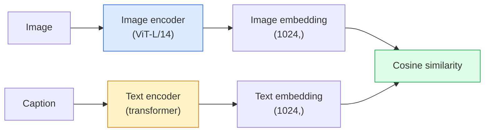

# 오픈 어휘 비전 — CLIP

> 이미지 인코더와 텍스트 인코더를 함께 학습해, 매칭되는 (image, caption) pair가 공유 공간의 같은 지점에 놓이게 합니다. 핵심은 그것이 전부입니다.

**Type:** Build + Use
**Languages:** Python
**Prerequisites:** Phase 4 Lesson 14 (ViT), Phase 4 Lesson 17 (Self-Supervised)
**Time:** ~45 minutes

## 학습 목표

- CLIP의 two-tower 아키텍처와 contrastive training objective를 설명합니다
- 작업별 학습 없이 pretrained CLIP(또는 SigLIP)을 zero-shot classification에 사용합니다
- zero-shot classification을 처음부터 구현합니다. class prompt를 인코딩하고 cosine similarity를 계산한 뒤 argmax를 취합니다
- CLIP, SigLIP, OpenCLIP, LLaVA/LLaMA-vision 모델을 구분하고 2026년에 각각 무엇에 쓰이는지 설명합니다

## 문제

전통적인 분류기는 closed-vocabulary입니다. 1000-class ImageNet 모델은 1000개 라벨만 예측할 수 있습니다. 새 카테고리가 생길 때마다 라벨 데이터와 재학습한 head가 필요합니다.

CLIP(Radford et al., OpenAI 2021)은 웹에서 수집한 4억 개의 (image, caption) pair로 학습하면, 추론 시 자연어만으로 설명된 임의의 카테고리 집합으로 분류할 수 있는 모델이 나온다는 것을 보였습니다. 문장 하나를 쓰면 새 클래스를 줄 수 있습니다.

그 능력, 즉 zero-shot transfer 때문에 모든 최신 비전 시스템은 CLIP 계열 checkpoint에서 시작합니다. Detection(Grounding DINO, OWL-ViT), segmentation(CLIPSeg, SAM), retrieval, content moderation, VLM, text-to-image generation은 모두 CLIP 스타일 joint embedding 위에 구축됩니다.

## 개념

### Two tower



두 인코더는 모두 같은 임베딩 차원(CLIP-B/32는 512, CLIP-L/14는 1024)으로 가는 선형 projection으로 끝납니다. L2-normalise한 뒤 cosine similarity를 계산합니다.

### Objective

N개의 (image, caption) pair로 이루어진 배치가 주어지면 NxN similarity matrix를 만듭니다. 대각선(matching pair)은 높은 similarity를, 대각선 밖(non-matching)은 낮은 similarity를 갖도록 두 인코더를 학습합니다.

```text
sim_matrix = image_embeddings @ text_embeddings.T / tau

loss_i2t = cross_entropy(sim_matrix,       targets=arange(N))
loss_t2i = cross_entropy(sim_matrix.T,     targets=arange(N))
loss = (loss_i2t + loss_t2i) / 2
```

image-to-text와 text-to-image retrieval이 모두 동작해야 하므로 대칭입니다. `tau`(temperature)는 보통 0.07로 초기화되는 scalar parameter로 학습됩니다.

### SigLIP: 더 나은 손실

SigLIP(Zhai et al., 2023)은 softmax를 pair별 sigmoid로 바꿨습니다:

```text
loss = mean over pairs of log(1 + exp(-y_ij * sim_ij))
y_ij = +1 if matching, -1 otherwise
```

Pair별 손실은 CLIP이 요구하는 batch-level normalisation을 제거합니다. SigLIP은 작은 배치 크기에서 더 잘 학습되고, 같은 데이터에서는 CLIP과 같거나 더 뛰어납니다.

### Zero-shot classification

학습된 CLIP이 주어졌을 때:

1. 각 클래스에 대해 prompt를 구성합니다: "a photo of a {class}".
2. 모든 class prompt를 text encoder로 인코딩합니다 -> `T` shape (C, d).
3. test image를 인코딩합니다 -> `I` shape (1, d).
4. Similarity = `I @ T.T` shape (1, C).
5. Argmax -> predicted class.

Prompt engineering은 중요합니다. OpenAI는 ImageNet용 prompt template 80개("a photo of a {}", "a blurry photo of a {}", "a sketch of a {}", ...)를 공개했습니다. 클래스마다 모든 template의 임베딩을 평균내면 top-1 정확도가 1-3% 추가로 오릅니다.

### 2026년에 CLIP 스타일 모델이 쓰이는 곳

- **Zero-shot classification** — 직접 사용합니다.
- **Image retrieval** — 모든 이미지를 한 번 인코딩하고, 추론 시 query를 임베딩합니다.
- **Text-conditioned detection** — Grounding DINO, OWL-ViT는 detector 주위에 CLIP text tower를 감쌉니다.
- **Text-conditioned segmentation** — CLIPSeg. SAM은 CLIP을 통해 text-prompt 입력을 사용합니다.
- **VLMs** — LLaVA, Qwen-VL, InternVL은 CLIP 계열 vision encoder를 LLM에 연결합니다.
- **Text-to-image gen** — Stable Diffusion, DALL-E 3는 CLIP text embedding에 condition합니다.

공유 임베딩 공간이 생기면 모든 vision+language 작업은 distance computation이 됩니다.

## 직접 만들기

### 1단계: 작은 two-tower 모델

실제 CLIP은 ViT + transformer입니다. 이 레슨에서는 CPU에서도 학습 신호가 보이도록, 미리 추출한 특징 위에 작은 MLP tower를 사용합니다.

```python
import torch
import torch.nn as nn
import torch.nn.functional as F


class TwoTower(nn.Module):
    def __init__(self, img_in=128, txt_in=64, emb=64):
        super().__init__()
        self.image_proj = nn.Sequential(nn.Linear(img_in, 128), nn.ReLU(), nn.Linear(128, emb))
        self.text_proj = nn.Sequential(nn.Linear(txt_in, 128), nn.ReLU(), nn.Linear(128, emb))
        self.logit_scale = nn.Parameter(torch.ones([]) * 2.6592)  # ln(1/0.07)

    def forward(self, img_feats, txt_feats):
        i = F.normalize(self.image_proj(img_feats), dim=-1)
        t = F.normalize(self.text_proj(txt_feats), dim=-1)
        return i, t, self.logit_scale.exp()
```

두 projection, 공유 차원 출력, 학습되는 temperature입니다. 실제 CLIP API와 같은 형태입니다.

### 2단계: Contrastive loss

```python
def clip_loss(image_emb, text_emb, logit_scale):
    N = image_emb.size(0)
    sim = logit_scale * image_emb @ text_emb.T
    targets = torch.arange(N, device=sim.device)
    l_i = F.cross_entropy(sim, targets)
    l_t = F.cross_entropy(sim.T, targets)
    return (l_i + l_t) / 2
```

대칭입니다. 더 높은 logit_scale = 더 날카로운 softmax = 더 높은 confidence이지만 instability 위험도 있습니다.

### 3단계: Zero-shot classifier

```python
@torch.no_grad()
def zero_shot_classify(model, image_feats, class_text_feats, class_names):
    """
    image_feats:      (N, img_in)
    class_text_feats: (C, txt_in)   one averaged embedding per class
    """
    i = F.normalize(model.image_proj(image_feats), dim=-1)
    t = F.normalize(model.text_proj(class_text_feats), dim=-1)
    sim = i @ t.T
    pred = sim.argmax(dim=-1)
    return [class_names[p] for p in pred.tolist()]
```

단계마다 한 줄입니다. 이것이 프로덕션 CLIP checkpoint와 함께 사용하는 정확한 zero-shot 절차입니다.

### 4단계: Sanity check

```python
torch.manual_seed(0)
model = TwoTower()

img = torch.randn(8, 128)
txt = torch.randn(8, 64)
i, t, scale = model(img, txt)
loss = clip_loss(i, t, scale)
print(f"batch size: {i.size(0)}   loss: {loss.item():.3f}")
```

무작위 초기화 모델의 손실은 `log(N) = log(8) = 2.08`에 가까워야 합니다. 아직 구조를 학습하지 않았을 때의 symmetric cross-entropy target입니다.

## 사용하기

OpenCLIP은 2026년 커뮤니티 기본값입니다:

```python
import open_clip
import torch
from PIL import Image

model, _, preprocess = open_clip.create_model_and_transforms("ViT-B-32", pretrained="laion2b_s34b_b79k")
tokenizer = open_clip.get_tokenizer("ViT-B-32")

image = preprocess(Image.open("dog.jpg")).unsqueeze(0)
text = tokenizer(["a photo of a dog", "a photo of a cat", "a photo of a car"])

with torch.no_grad():
    image_features = model.encode_image(image)
    text_features = model.encode_text(text)
    image_features = image_features / image_features.norm(dim=-1, keepdim=True)
    text_features = text_features / text_features.norm(dim=-1, keepdim=True)
    probs = (100.0 * image_features @ text_features.T).softmax(dim=-1)

print(probs)
```

SigLIP은 더 최신이고 작은 규모에서 더 잘 학습되며, 새 작업에는 `google/siglip-base-patch16-224`가 선호됩니다. Hugging Face는 둘 다 제공합니다.

## 결과물

이 레슨의 결과물:

- `outputs/prompt-zero-shot-class-picker.md` — 클래스 목록과 domain이 주어졌을 때 zero-shot CLIP용 class template를 설계하는 프롬프트입니다.
- `outputs/skill-image-text-retriever.md` — 임의의 CLIP checkpoint로 이미지 임베딩 index를 만들고 query-by-text와 query-by-image를 지원하는 스킬입니다.

## 연습 문제

1. **(Easy)** Pretrained OpenCLIP ViT-B/32를 사용하고 80-template prompt set으로 CIFAR-10에서 zero-shot classification을 수행하세요. top-1 정확도를 보고하세요. 약 85-90%여야 합니다.
2. **(Medium)** 같은 CIFAR-10 작업에서 single-template("a photo of a {}")와 80-template averaged embedding을 비교하세요. 차이를 정량화하고 template이 왜 도움이 되는지 설명하세요.
3. **(Hard)** Zero-shot image retrieval index를 만드세요. CLIP으로 이미지 1,000장을 임베딩하고, FAISS index를 만들고, 자연어 설명으로 query하세요. 직접 작성한 held-out query 20개에 대해 retrieval recall@5를 보고하세요.

## 핵심 용어

| 용어 | 사람들이 말하는 방식 | 실제 의미 |
|------|----------------|----------------------|
| Two-tower | "Dual encoder" | 공유 차원 projection head로 끝나는 별도의 image encoder와 text encoder |
| Zero-shot | "작업별 학습 없음" | 추론 시 텍스트만으로 설명된 클래스로 분류합니다. 라벨은 건드리지 않습니다 |
| Temperature / logit_scale | "tau" | softmax 전에 similarity matrix를 scale하는 학습된 scalar |
| Prompt template | "A photo of a {}" | 클래스 이름을 감싸는 자연어 wrapper. 여러 template을 평균하면 zero-shot 정확도가 올라갑니다 |
| CLIP | "Image+text model" | 2021년 OpenAI 모델. 2026년 이 분야의 공통 어휘입니다 |
| SigLIP | "Sigmoid CLIP" | softmax를 pair별 sigmoid로 바꿉니다. 작은 배치에서 더 잘 학습됩니다 |
| OpenCLIP | "Open reproduction" | LAION으로 커뮤니티가 학습한 CLIP variant. 오픈소스 파이프라인의 프로덕션 기본값입니다 |
| VLM | "Vision-language model" | CLIP 계열 인코더와 LLM을 결합해 이미지에 대한 질문에 답하도록 학습한 모델 |

## 더 읽을거리

- [CLIP: Learning Transferable Visual Models from Natural Language Supervision (Radford et al., 2021)](https://arxiv.org/abs/2103.00020)
- [SigLIP: Sigmoid Loss for Language-Image Pre-Training (Zhai et al., 2023)](https://arxiv.org/abs/2303.15343)
- [OpenCLIP](https://github.com/mlfoundations/open_clip) — 커뮤니티 코드베이스
- [DINOv2 vs CLIP vs MAE: a features comparison](https://huggingface.co/blog/dinov2) — 나란히 비교한 사용 사례가 있는 HF 가이드
