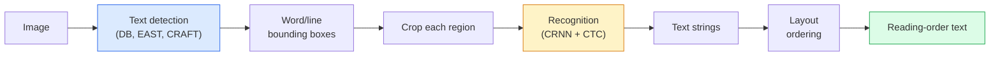

# OCR & 문서 이해

> OCR은 3단계 pipeline입니다. text box를 detect하고, character를 recognise한 다음, layout으로 배치합니다. 모든 modern OCR system은 이 단계들의 순서를 바꾸거나 합칩니다.

**Type:** Learn + Use
**Languages:** Python
**Prerequisites:** Phase 4 Lesson 06 (Detection), Phase 7 Lesson 02 (Self-Attention)
**Time:** ~45분

## 학습 목표

- 고전적인 OCR pipeline(detect -> recognise -> layout)과 modern end-to-end 대안(Donut, Qwen-VL-OCR)을 추적합니다
- sequence-to-sequence OCR training을 위한 CTC(Connectionist Temporal Classification) loss를 구현합니다
- training 없이 production document parsing에 PaddleOCR 또는 EasyOCR을 사용합니다
- OCR, layout parsing, document understanding을 구분하고 task별로 알맞은 tool을 선택합니다

## 문제

text가 가득한 이미지는 어디에나 있습니다. receipts, invoices, IDs, scanned books, forms, whiteboards, signs, screenshots가 그렇습니다. 여기서 structured data를 추출하는 일, 즉 character만이 아니라 "this is the total amount"까지 알아내는 일은 applied vision에서 가치가 가장 높은 문제 중 하나입니다.

이 분야는 세 skill layer로 나뉩니다.

1. **OCR proper**: pixel을 text로 바꿉니다.
2. **Layout parsing**: OCR output을 region(title, body, table, header)으로 묶습니다.
3. **Document understanding**: layout에서 structured field("invoice_total = $42.50")를 추출합니다.

각 layer에는 classical approach와 modern approach가 있으며, "이미지에서 text를 얻고 싶다"와 "이 receipt의 total amount가 필요하다" 사이의 간극은 대부분의 team이 생각하는 것보다 큽니다.

## 개념

### 고전적인 pipeline



- **Text detection**은 line별 또는 word별 quadrilateral을 만듭니다.
- **Recognition**은 각 region을 fixed height로 crop하고, CNN + BiLSTM + CTC를 실행해 character sequence를 만듭니다.
- **Layout**은 reading order를 다시 구성합니다(Latin은 top-to-bottom, left-to-right; Arabic, Japanese는 다릅니다).

### CTC 한 문단 설명

OCR recognition은 fixed-length feature map에서 variable-length sequence를 만듭니다. CTC(Graves et al., 2006)는 character-level alignment 없이도 이를 train할 수 있게 합니다. model은 매 time step마다 (vocab + blank)에 대한 distribution을 출력합니다. CTC loss는 repeat을 merge하고 blank를 제거한 뒤 target text로 줄어드는 모든 alignment에 대해 marginalize합니다.

```text
raw output: "h h h _ _ e e l l _ l l o _ _"
after merge repeats and remove blanks: "hello"
```

CTC는 CRNN이 2015년에 작동할 수 있었던 이유이며, 2026년에도 대부분의 production OCR model을 train하는 핵심입니다.

### Modern end-to-end model

- **Donut** (Kim et al., 2022) - ViT encoder + text decoder입니다. image를 읽고 JSON을 직접 냅니다. text detector도 layout module도 없습니다.
- **TrOCR** - line-level OCR을 위한 ViT + transformer decoder입니다.
- **Qwen-VL-OCR / InternVL** - OCR task에 fine-tune된 full vision-language model입니다. 2026년 complex document에서 최고 accuracy를 냅니다.
- **PaddleOCR** - mature production package 안의 고전적인 DB + CRNN pipeline입니다. 여전히 open-source workhorse입니다.

End-to-end model은 더 많은 data와 compute가 필요하지만 multi-stage pipeline의 error accumulation을 건너뜁니다.

### Layout parsing

structured document에서는 각 region을 Title, Paragraph, Figure, Table, Footnote로 label하는 layout detector(LayoutLMv3, DocLayNet)를 실행합니다. 그러면 reading order는 "layout order로 region을 iterate하고 concatenate"가 됩니다.

form에는 **Key-Value extraction** model을 사용합니다(visually-rich document에는 Donut, plain scan에는 LayoutLMv3). 이 model들은 image + detected text + position을 받아 structured key-value pair를 예측합니다.

### Evaluation metric

- **Character Error Rate (CER)** - Levenshtein distance / reference length입니다. 낮을수록 좋습니다. production target: clean scan에서 < 2%.
- **Word Error Rate (WER)** - word level에서 같은 방식입니다.
- **structured field의 F1** - key-value task용입니다. `{invoice_total: 42.50}`가 올바르게 나타나는지 측정합니다.
- **JSON의 edit distance** - end-to-end document parsing용입니다. Donut paper는 normalised tree edit distance를 도입했습니다.

## 직접 만들기

### Step 1: CTC loss + greedy decoder

```python
import torch
import torch.nn as nn
import torch.nn.functional as F


def ctc_loss(log_probs, targets, input_lengths, target_lengths, blank=0):
    """
    log_probs:      (T, N, C) log-softmax over vocab including blank at index 0
    targets:        (N, S) int targets (no blanks)
    input_lengths:  (N,) per-sample time steps used
    target_lengths: (N,) per-sample target length
    """
    return F.ctc_loss(log_probs, targets, input_lengths, target_lengths,
                      blank=blank, reduction="mean", zero_infinity=True)


def greedy_ctc_decode(log_probs, blank=0):
    """
    log_probs: (T, N, C) log-softmax
    returns: list of index sequences (blanks removed, repeats merged)
    """
    preds = log_probs.argmax(dim=-1).transpose(0, 1).cpu().tolist()
    out = []
    for seq in preds:
        decoded = []
        prev = None
        for idx in seq:
            if idx != prev and idx != blank:
                decoded.append(idx)
            prev = idx
        out.append(decoded)
    return out
```

`F.ctc_loss`는 가능할 때 efficient CuDNN implementation을 사용합니다. greedy decoder는 beam search보다 단순하며 보통 CER 차이가 1% 이내입니다.

### Step 2: Tiny CRNN recogniser

line OCR을 위한 최소 CNN + BiLSTM입니다.

```python
class TinyCRNN(nn.Module):
    def __init__(self, vocab_size=40, hidden=128, feat=32):
        super().__init__()
        self.cnn = nn.Sequential(
            nn.Conv2d(1, feat, 3, 1, 1), nn.BatchNorm2d(feat), nn.ReLU(inplace=True),
            nn.MaxPool2d(2),
            nn.Conv2d(feat, feat * 2, 3, 1, 1), nn.BatchNorm2d(feat * 2), nn.ReLU(inplace=True),
            nn.MaxPool2d(2),
            nn.Conv2d(feat * 2, feat * 4, 3, 1, 1), nn.BatchNorm2d(feat * 4), nn.ReLU(inplace=True),
            nn.MaxPool2d((2, 1)),
            nn.Conv2d(feat * 4, feat * 4, 3, 1, 1), nn.BatchNorm2d(feat * 4), nn.ReLU(inplace=True),
            nn.MaxPool2d((2, 1)),
        )
        self.rnn = nn.LSTM(feat * 4, hidden, bidirectional=True, batch_first=True)
        self.head = nn.Linear(hidden * 2, vocab_size)

    def forward(self, x):
        # x: (N, 1, H, W)
        f = self.cnn(x)                # (N, C, H', W')
        f = f.mean(dim=2).transpose(1, 2)  # (N, W', C)
        h, _ = self.rnn(f)
        return F.log_softmax(self.head(h).transpose(0, 1), dim=-1)  # (W', N, vocab)
```

fixed-height input을 사용합니다(CNN max-pool이 height를 1로 줄입니다). width가 CTC의 time dimension입니다.

### Step 3: Synthetic OCR

end-to-end smoke test용 black-on-white digit string을 생성합니다.

```python
import numpy as np

def synthetic_line(text, height=32, char_width=16):
    W = char_width * len(text)
    img = np.ones((height, W), dtype=np.float32)
    for i, c in enumerate(text):
        x = i * char_width
        shade = 0.0 if c.isalnum() else 0.5
        img[6:height - 6, x + 2:x + char_width - 2] = shade
    return img


def build_batch(strings, vocab):
    H = 32
    W = 16 * max(len(s) for s in strings)
    imgs = np.ones((len(strings), 1, H, W), dtype=np.float32)
    target_lengths = []
    targets = []
    for i, s in enumerate(strings):
        imgs[i, 0, :, :16 * len(s)] = synthetic_line(s)
        ids = [vocab.index(c) for c in s]
        targets.extend(ids)
        target_lengths.append(len(ids))
    return torch.from_numpy(imgs), torch.tensor(targets), torch.tensor(target_lengths)


vocab = ["_"] + list("0123456789abcdefghijklmnopqrstuvwxyz")
imgs, targets, lengths = build_batch(["hello", "world"], vocab)
print(f"images: {imgs.shape}   targets: {targets.shape}   lengths: {lengths.tolist()}")
```

real OCR dataset은 font, noise, rotation, blur, colour를 추가합니다. 위 pipeline은 동일합니다.

### Step 4: Training sketch

```python
model = TinyCRNN(vocab_size=len(vocab))
opt = torch.optim.Adam(model.parameters(), lr=1e-3)

for step in range(200):
    strings = ["abc" + str(step % 10)] * 4 + ["xyz" + str((step + 1) % 10)] * 4
    imgs, targets, target_lens = build_batch(strings, vocab)
    log_probs = model(imgs)  # (W', 8, vocab)
    input_lens = torch.full((8,), log_probs.size(0), dtype=torch.long)
    loss = ctc_loss(log_probs, targets, input_lens, target_lens, blank=0)
    opt.zero_grad(); loss.backward(); opt.step()
```

이 trivial synthetic data에서는 loss가 200 step 동안 ~3에서 ~0.2로 내려가야 합니다.

## 사용하기

production path는 세 가지입니다.

- **PaddleOCR** - mature, fast, multilingual입니다. 한 줄 사용법: `paddleocr.PaddleOCR(lang="en").ocr(image_path)`.
- **EasyOCR** - Python-native, multilingual, PyTorch backbone입니다.
- **Tesseract** - classical입니다. model이 어려워하는 오래된 scanned document에는 여전히 유용합니다.

end-to-end document parsing에는 Donut 또는 VLM을 사용합니다.

```python
from transformers import DonutProcessor, VisionEncoderDecoderModel

processor = DonutProcessor.from_pretrained("naver-clova-ix/donut-base-finetuned-cord-v2")
model = VisionEncoderDecoderModel.from_pretrained("naver-clova-ix/donut-base-finetuned-cord-v2")
```

반복 가능한 구조의 receipt, invoice, form에는 Donut을 fine-tune합니다. arbitrary document나 reasoning이 필요한 OCR에는 Qwen-VL-OCR 같은 VLM이 현재 default입니다.

## 산출물로 만들기

이 lesson은 다음을 만듭니다.

- `outputs/prompt-ocr-stack-picker.md` - document type, language, structure가 주어졌을 때 Tesseract / PaddleOCR / Donut / VLM-OCR을 선택하는 prompt입니다.
- `outputs/skill-ctc-decoder.md` - length normalisation을 포함해 greedy 및 beam-search CTC decoder를 처음부터 작성하는 skill입니다.

## 연습 문제

1. **(Easy)** TinyCRNN을 5-digit random numeric string에 대해 500 step train합니다. held-out set에서 CER을 report합니다.
2. **(Medium)** greedy decoding을 beam search(beam_width=5)로 교체합니다. CER delta를 report합니다. 어떤 input에서 beam search가 이기나요?
3. **(Hard)** 20개 receipt set에 PaddleOCR을 사용해 line item을 추출하고, {item_name, price} pair에 대해 hand-labelled ground truth 대비 F1을 계산합니다.

## 핵심 용어

| Term | 사람들이 하는 말 | 실제 의미 |
|------|----------------|----------------------|
| OCR | "Text from pixels" | image region을 character sequence로 바꾸는 것 |
| CTC | "Alignment-free loss" | per-timestep label 없이 sequence model을 train하는 loss; alignment에 대해 marginalize합니다 |
| CRNN | "Classic OCR model" | Conv feature extractor + BiLSTM + CTC; production에서 아직 쓰이는 2015 baseline |
| Donut | "End-to-end OCR" | ViT encoder + text decoder; image에서 JSON을 직접 냅니다 |
| Layout parsing | "Find regions" | document 안의 Title/Table/Figure/Paragraph region을 detect하고 label합니다 |
| Reading order | "Text sequence" | recognised region을 문장으로 ordering하는 것; Latin은 단순하지만 mixed layout은 그렇지 않습니다 |
| CER / WER | "Error rates" | character 또는 word granularity에서 Levenshtein distance / reference length |
| VLM-OCR | "LLM that reads" | OCR task에 train되거나 prompt된 vision-language model; complex document의 current SOTA |

## 더 읽을거리

- [CRNN (Shi et al., 2015)](https://arxiv.org/abs/1507.05717) - original CNN+RNN+CTC architecture
- [CTC (Graves et al., 2006)](https://www.cs.toronto.edu/~graves/icml_2006.pdf) - original CTC paper; algorithmic idea가 밀도 높게 담겨 있습니다
- [Donut (Kim et al., 2022)](https://arxiv.org/abs/2111.15664) - OCR-free document understanding transformer
- [PaddleOCR](https://github.com/PaddlePaddle/PaddleOCR) - open-source production OCR stack
