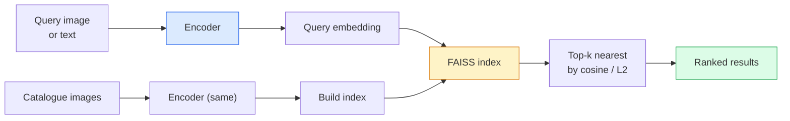

# 이미지 검색 & Metric Learning

> retrieval system은 embedding space의 distance로 candidate를 rank합니다. Metric learning은 distance가 당신이 원하는 의미를 갖도록 그 space를 shaping하는 discipline입니다.

**Type:** Build
**Languages:** Python
**Prerequisites:** Phase 4 Lesson 14 (ViT), Phase 4 Lesson 18 (CLIP)
**Time:** ~45분

## 학습 목표

- triplet, contrastive, proxy-based metric learning loss를 설명하고 dataset에 맞는 loss를 선택합니다
- L2-normalisation과 cosine similarity를 올바르게 구현하고 "same item" retrieval과 "same class" retrieval의 차이를 audit합니다
- FAISS index를 만들고 text 및 image로 query하며 held-out query set에 대해 recall@K를 report합니다
- DINOv2, CLIP, SigLIP을 off-the-shelf embedding backbone으로 사용하고 각각 언제 이기는지 압니다

## 문제

retrieval은 production vision 곳곳에 있습니다. duplicate detection, reverse image search, visual search("find similar products"), face re-identification, surveillance용 person re-ID, e-commerce의 instance-level matching이 그렇습니다. product question은 항상 같습니다. "이 query image가 주어졌을 때 내 catalogue를 rank하라."

두 design decision이 전체 system을 만듭니다. embedding, 즉 vector를 만드는 model입니다. index, 즉 scale에서 nearest neighbour를 찾는 방법입니다. 2026년에는 둘 다 commodity입니다(embedding은 DINOv2, index는 FAISS). 그래서 기준이 올라갑니다. 어려운 부분은 application에서 *무엇이 similar로 count되는지* 정의한 다음, distance가 그 정의와 맞도록 embedding space를 shaping하는 것입니다.

그 shaping이 metric learning입니다. 작지만 leverage가 큰 discipline입니다.

## 개념

### Retrieval 한눈에 보기



### 네 가지 loss family

| Loss | Requires | 장점 | 단점 |
|------|----------|------|------|
| **Contrastive** | (anchor, positive) + negatives | 단순하고 어떤 pair label에도 작동합니다 | negative가 많지 않으면 converge가 느립니다 |
| **Triplet** | (anchor, positive, negative) | 직관적이며 margin을 직접 control합니다 | hard-triplet mining이 비쌉니다 |
| **NT-Xent / InfoNCE** | Pairs + batch-mined negatives | large batch로 scale합니다 | big batch 또는 momentum queue가 필요합니다 |
| **Proxy-based (ProxyNCA)** | Class labels only | 빠르고 안정적이며 mining이 없습니다 | small dataset에서는 proxy에 overfit될 수 있습니다 |

대부분의 production use case에서는 pretrained backbone으로 시작하고, off-the-shelf embedding이 test set에서 underperform할 때만 metric-learning fine-tune을 추가합니다.

### Triplet loss formally

```text
L = max(0, ||f(a) - f(p)||^2 - ||f(a) - f(n)||^2 + margin)
```

anchor `a`를 positive `p`에 가깝게 당기고 negative `n`에서 밀어내며, `margin`으로 gap을 보장합니다. 이 three-image structure는 어떤 similarity ordering에도 generalize됩니다.

mining이 중요합니다. easy triplet(`n`이 이미 `a`에서 멀리 있음)은 zero loss를 냅니다. hard triplet만 network를 가르칩니다. Semi-hard mining(`n`이 `p`보다 멀지만 margin 안에 있음)은 2016 FaceNet recipe이며 여전히 dominant합니다.

### Cosine similarity vs L2

두 metric, 두 convention입니다.

- **Cosine**: vector 사이의 angle입니다. L2-normalised embedding이 필요합니다.
- **L2**: Euclidean distance입니다. raw 또는 normalised embedding에서 작동하지만 보통 L2-normalised + squared L2와 함께 씁니다.

대부분의 modern net에서는 둘이 equivalent입니다. `||a - b||^2 = 2 - 2 cos(a, b)` when `||a|| = ||b|| = 1`. embedding training과 맞는 convention을 선택하세요. 섞으면 "nearest"의 의미가 조용히 바뀝니다.

### Recall@K

표준 retrieval metric입니다.

```text
recall@K = fraction of queries where at least one correct match is in the top K results
```

recall@1, @5, @10을 나란히 report합니다. recall@10이 0.95보다 높고 recall@1이 0.5보다 낮으면 embedding space는 올바른 structure를 가졌지만 ranking이 noisy하다는 뜻입니다. 더 긴 fine-tune 또는 re-ranking step을 시도하세요.

duplicate detection에서는 false positive 하나가 user-visible mistake이므로 precision@K가 더 중요합니다. visual search에서는 recall@K가 product signal입니다.

### FAISS 한 문단 설명

Facebook AI Similarity Search입니다. nearest-neighbour search의 de-facto library입니다. 세 가지 index choice가 있습니다.

- `IndexFlatIP` / `IndexFlatL2` - brute force, exact, no training입니다. ~1M vector까지 사용합니다.
- `IndexIVFFlat` - K개 cell로 partition하고 가장 가까운 몇 개 cell만 search합니다. approximate하고 빠르며 training data가 필요합니다.
- `IndexHNSW` - graph-based이며 많은 query에서 가장 빠르고 index size가 큽니다.

100k vector에는 cosine similarity 위의 `IndexFlatIP`가 적합할 가능성이 큽니다. 10M에는 `IndexIVFFlat`가 필요합니다. 100M+에는 product quantisation(`IndexIVFPQ`)과 함께 씁니다.

### Instance-level vs category-level retrieval

같은 이름을 가진 전혀 다른 두 문제입니다.

- **Category-level** - "내 catalogue에서 cat을 찾아라." Class-conditional similarity입니다. off-the-shelf CLIP / DINOv2 embedding이 잘 작동합니다.
- **Instance-level** - "내 catalogue에서 *이 정확한 product*를 찾아라." 같은 class 안에서 visually similar object를 fine-grained하게 구분해야 합니다. off-the-shelf embedding은 under-perform하며 metric learning fine-tuning이 중요합니다.

model을 고르기 전에 어느 문제를 풀고 있는지 항상 먼저 물어보세요.

## 직접 만들기

### Step 1: Triplet loss

```python
import torch
import torch.nn.functional as F

def triplet_loss(anchor, positive, negative, margin=0.2):
    d_ap = F.pairwise_distance(anchor, positive, p=2)
    d_an = F.pairwise_distance(anchor, negative, p=2)
    return F.relu(d_ap - d_an + margin).mean()
```

한 줄입니다. L2-normalised embedding과 raw embedding 모두에서 작동합니다.

### Step 2: Semi-hard mining

embedding과 label batch가 주어졌을 때 각 anchor에 대해 가장 어려운 semi-hard negative를 찾습니다.

```python
def semi_hard_negatives(emb, labels, margin=0.2):
    dist = torch.cdist(emb, emb)
    same_class = labels[:, None] == labels[None, :]
    diff_class = ~same_class
    N = emb.size(0)

    positives = dist.clone()
    positives[~same_class] = float("-inf")
    positives.fill_diagonal_(float("-inf"))
    pos_idx = positives.argmax(dim=1)

    semi_hard = dist.clone()
    semi_hard[same_class] = float("inf")
    d_ap = dist[torch.arange(N), pos_idx].unsqueeze(1)
    semi_hard[dist <= d_ap] = float("inf")
    neg_idx = semi_hard.argmin(dim=1)

    fallback_mask = semi_hard[torch.arange(N), neg_idx] == float("inf")
    if fallback_mask.any():
        hardest = dist.clone()
        hardest[same_class] = float("inf")
        neg_idx = torch.where(fallback_mask, hardest.argmin(dim=1), neg_idx)
    return pos_idx, neg_idx
```

각 anchor는 in-class hardest positive와, positive보다 멀지만 margin 안에 있는 semi-hard negative를 얻습니다.

### Step 3: Recall@K

```python
def recall_at_k(query_emb, gallery_emb, query_labels, gallery_labels, k=1):
    sim = query_emb @ gallery_emb.T
    _, top_k = sim.topk(k, dim=-1)
    matches = (gallery_labels[top_k] == query_labels[:, None]).any(dim=-1)
    return matches.float().mean().item()
```

L2-normalised embedding에서 inner product 기준 top-k는 cosine 기준 top-k와 같습니다. 적어도 하나의 correct neighbour가 있는 query의 mean proportion을 report합니다.

### Step 4: Putting it together

```python
import torch
import torch.nn as nn
from torch.optim import Adam

class Encoder(nn.Module):
    def __init__(self, in_dim=128, emb_dim=64):
        super().__init__()
        self.net = nn.Sequential(
            nn.Linear(in_dim, 128), nn.ReLU(),
            nn.Linear(128, emb_dim),
        )

    def forward(self, x):
        return F.normalize(self.net(x), dim=-1)

torch.manual_seed(0)
num_classes = 6
protos = F.normalize(torch.randn(num_classes, 128), dim=-1)

def sample_batch(bs=32):
    labels = torch.randint(0, num_classes, (bs,))
    x = protos[labels] + 0.15 * torch.randn(bs, 128)
    return x, labels

enc = Encoder()
opt = Adam(enc.parameters(), lr=3e-3)

for step in range(200):
    x, y = sample_batch(32)
    emb = enc(x)
    pos_idx, neg_idx = semi_hard_negatives(emb, y)
    loss = triplet_loss(emb, emb[pos_idx], emb[neg_idx])
    opt.zero_grad(); loss.backward(); opt.step()
```

몇 hundred step 뒤에는 embedding cluster가 class당 하나씩 형성됩니다.

## 사용하기

2026년 production stack:

- **DINOv2 + FAISS** - general-purpose visual retrieval입니다. off-the-shelf로 작동합니다.
- **CLIP + FAISS** - query가 text일 때 사용합니다.
- **Fine-tuned DINOv2 + FAISS** - instance-level retrieval, face re-ID, fashion, e-commerce에 사용합니다.
- **Milvus / Weaviate / Qdrant** - FAISS 또는 HNSW를 감싼 managed vector DB wrapper입니다.

SOTA instance retrieval recipe는 DINOv2 backbone, embedding head 추가, instance-labelled pair에서 triplet 또는 InfoNCE loss로 fine-tune, FAISS에 index입니다.

## 산출물로 만들기

이 lesson은 다음을 만듭니다.

- `outputs/prompt-retrieval-loss-picker.md` - 주어진 retrieval problem에 대해 triplet / InfoNCE / ProxyNCA를 선택하는 prompt입니다.
- `outputs/skill-recall-at-k-runner.md` - train/val/gallery split과 proper data contract를 갖춘 recall@K clean evaluation harness를 작성하는 skill입니다.

## 연습 문제

1. **(Easy)** 위 toy example을 실행합니다. training 전후의 embedding을 PCA로 plot해 여섯 cluster가 형성되는 것을 확인합니다.
2. **(Medium)** ProxyNCA loss implementation을 추가합니다. class마다 learned "proxy" 하나를 두고 cosine similarity에 standard cross-entropy를 적용합니다. toy data에서 triplet loss 대비 convergence speed를 비교합니다.
3. **(Hard)** 1,000개 ImageNet validation image를 가져와 HuggingFace를 통해 DINOv2로 embed하고, FAISS flat index를 만든 뒤, 같은 image를 query로 썼을 때(1.0이어야 함)와 ImageNet label을 ground truth로 쓰는 held-out split에 대해 recall@{1, 5, 10}을 report합니다.

## 핵심 용어

| Term | 사람들이 하는 말 | 실제 의미 |
|------|----------------|----------------------|
| Metric learning | "Shape the space" | output space의 distance가 target similarity를 반영하도록 encoder를 train하는 것 |
| Triplet loss | "Pull and push" | L = max(0, d(a, p) - d(a, n) + margin); canonical metric-learning loss |
| Semi-hard mining | "Useful negatives" | anchor보다 positive에서 더 멀지만 margin 안에 있는 negative; empirically 가장 informative합니다 |
| Proxy-based loss | "Class prototypes" | class마다 learned proxy 하나; similarity-to-proxy에 대한 cross-entropy; pair mining이 없습니다 |
| Recall@K | "Top-K hit rate" | top K 안에 correct result가 적어도 하나 있는 query의 fraction |
| Instance retrieval | "Find this exact thing" | fine-grained matching입니다. off-the-shelf feature는 보통 underperform합니다 |
| FAISS | "The NN library" | Facebook의 nearest-neighbour library입니다. exact 및 approximate index를 지원합니다 |
| HNSW | "Graph index" | Hierarchical navigable small world입니다. 작은 memory overhead로 빠른 approximate NN을 제공합니다 |

## 더 읽을거리

- [FaceNet: A Unified Embedding for Face Recognition (Schroff et al., 2015)](https://arxiv.org/abs/1503.03832) - triplet loss / semi-hard mining paper
- [In Defense of the Triplet Loss for Person Re-Identification (Hermans et al., 2017)](https://arxiv.org/abs/1703.07737) - triplet fine-tuning practical guide
- [FAISS documentation](https://github.com/facebookresearch/faiss/wiki) - 모든 index와 모든 trade-off
- [SMoT: Metric Learning Taxonomy (Kim et al., 2021)](https://arxiv.org/abs/2010.06927) - modern loss와 그 connection에 대한 survey
