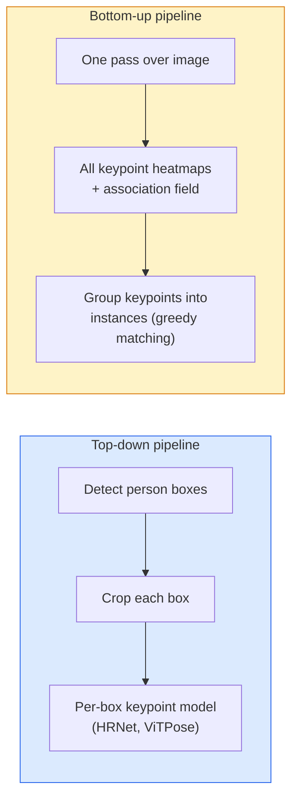

# 키포인트 탐지와 포즈 추정

> 포즈는 순서가 있는 키포인트 집합이다. 키포인트 탐지기는 heatmap 회귀기다. 나머지는 전부 bookkeeping이다.

**Type:** Build
**Languages:** Python
**Prerequisites:** Phase 4 Lesson 06 (Detection), Phase 4 Lesson 07 (U-Net)
**Time:** ~45 minutes

## 학습 목표

- top-down 포즈 추정과 bottom-up 포즈 추정을 구분하고, 각각이 언제 쓰이는지 말한다
- 키포인트마다 하나의 Gaussian target을 둔 K개 keypoint heatmap을 회귀하고, 추론 시 키포인트 좌표를 추출한다
- Part Affinity Fields(PAFs)를 설명하고 bottom-up pipeline이 키포인트를 instance로 연결하는 방식을 이해한다
- MediaPipe Pose 또는 MMPose로 production keypoint estimation을 수행하고 출력 형식을 이해한다

## 문제

키포인트 작업은 여러 이름 뒤에 숨어 있다. human pose(몸 관절 17개), face landmarks(68개 또는 478개 점), hand(21개 점), animal pose, robotic object pose, medical anatomy landmarks가 모두 여기에 속한다. 모두 같은 구조를 공유한다. 객체 위의 K개 이산 점을 탐지하고 그 `(x, y)` 좌표를 출력한다.

포즈 추정은 motion capture, fitness app, sports analytics, gesture control, animation, AR try-on, robotic grasping의 기반이다. 2D 사례는 성숙해 있다. 3D pose, 즉 단일 카메라에서 world coordinates의 관절 위치를 추정하는 문제는 현재 연구의 최전선이다.

엔지니어링 질문은 scale이다. 단일 이미지의 단일 사람 포즈는 20ms 문제다. 30 fps의 군중 속 multi-person pose는 다른 architecture가 필요한 완전히 다른 문제다.

## 개념

### Top-down vs bottom-up



- **Top-down** — 먼저 사람을 탐지한 뒤, 각 crop에 대해 사람별 키포인트 모델을 실행한다. 정확도가 가장 높지만 사람 수에 선형으로 비례해 scale된다.
- **Bottom-up** — 한 번의 forward pass로 모든 키포인트와 association field를 예측한 뒤 grouping한다. 군중 크기와 무관하게 시간이 일정하다.

Top-down(HRNet, ViTPose)은 정확도 선두이고, bottom-up(OpenPose, HigherHRNet)은 crowded scene에서 throughput 선두다.

### Heatmap regression

`(x, y)`를 직접 회귀하는 대신, 각 키포인트마다 실제 위치를 중심으로 하는 Gaussian blob이 있는 `H x W` heatmap을 예측한다.

```text
target[k, y, x] = exp(-((x - cx_k)^2 + (y - cy_k)^2) / (2 sigma^2))
```

추론 시 각 heatmap의 argmax가 예측 키포인트 위치다.

heatmap이 direct regression보다 잘 작동하는 이유는 network의 spatial structure(conv feature map)가 spatial output과 자연스럽게 맞기 때문이다. Gaussian target도 regularise한다. 작은 localisation error는 loss가 작아질 뿐 0이 되지 않는다.

### Sub-pixel localisation

Argmax는 정수 좌표를 준다. sub-pixel precision을 얻으려면 argmax와 이웃 값에 parabola를 fitting해 보정하거나, 잘 알려진 offset `(dx, dy) = 0.25 * (heatmap[y, x+1] - heatmap[y, x-1], ...)` 방향을 사용한다.

### Part Affinity Fields (PAFs)

OpenPose가 bottom-up association에 쓰는 핵심 아이디어다. 연결된 키포인트 쌍마다(예: 왼쪽 어깨에서 왼쪽 팔꿈치) 한 점에서 다른 점으로 향하는 unit vector를 인코딩하는 2-channel field를 예측한다. 어깨와 팔꿈치를 연결하려면 candidate pair를 잇는 선을 따라 PAF를 적분한다. 적분값이 가장 높은 쌍이 matching된다.

```text
For each connection (limb):
  PAF channels: 2 (unit vector x, y)
  Line integral: sum over sample points of (PAF . line_direction)
  Higher integral = stronger match
```

우아하고, per-person crop 없이 임의의 군중 크기로 scale된다.

### COCO keypoints

표준 body-pose dataset이다. 사람마다 17개 키포인트가 있고, metric은 PCK(Percentage of Correct Keypoints)와 OKS(Object Keypoint Similarity)를 쓴다. OKS는 keypoint판 IoU이며 COCO mAP@OKS가 보고하는 값이다.

### 2D vs 3D

- **2D pose** — image coordinates다. production 품질로 해결되어 있다(MediaPipe, HRNet, ViTPose).
- **3D pose** — world / camera coordinates다. 여전히 활발한 연구 주제다. 흔한 접근:
  - 작은 MLP(VideoPose3D)로 2D prediction을 3D로 lift한다.
  - 이미지에서 직접 3D regression을 수행한다(PyMAF, MHFormer).
  - ground truth를 위해 multi-view setup(CMU Panoptic)을 사용한다.

## 직접 만들기

### Step 1: Gaussian heatmap target

```python
import numpy as np
import torch

def gaussian_heatmap(size, cx, cy, sigma=2.0):
    yy, xx = np.meshgrid(np.arange(size), np.arange(size), indexing="ij")
    return np.exp(-((xx - cx) ** 2 + (yy - cy) ** 2) / (2 * sigma ** 2)).astype(np.float32)

hm = gaussian_heatmap(64, 32, 32, sigma=2.0)
print(f"peak: {hm.max():.3f} at ({hm.argmax() % 64}, {hm.argmax() // 64})")
```

키포인트별 heatmap을 channel axis를 따라 stack하면 전체 target tensor가 된다.

### Step 2: Tiny keypoint head

K개 heatmap channel을 출력하는 U-Net-style model이다.

```python
import torch.nn as nn
import torch.nn.functional as F

class TinyKeypointNet(nn.Module):
    def __init__(self, num_keypoints=4, base=16):
        super().__init__()
        self.down1 = nn.Sequential(nn.Conv2d(3, base, 3, 2, 1), nn.ReLU(inplace=True))
        self.down2 = nn.Sequential(nn.Conv2d(base, base * 2, 3, 2, 1), nn.ReLU(inplace=True))
        self.mid = nn.Sequential(nn.Conv2d(base * 2, base * 2, 3, 1, 1), nn.ReLU(inplace=True))
        self.up1 = nn.ConvTranspose2d(base * 2, base, 2, 2)
        self.up2 = nn.ConvTranspose2d(base, num_keypoints, 2, 2)

    def forward(self, x):
        h1 = self.down1(x)
        h2 = self.down2(h1)
        h3 = self.mid(h2)
        u1 = self.up1(h3)
        return self.up2(u1)
```

입력은 `(N, 3, H, W)`, 출력은 `(N, K, H, W)`다. Loss는 Gaussian target에 대한 per-pixel MSE다.

### Step 3: Inference — keypoint coordinates 추출

```python
def heatmap_to_coords(heatmaps):
    """
    heatmaps: (N, K, H, W)
    returns:  (N, K, 2) float coordinates in image pixels
    """
    N, K, H, W = heatmaps.shape
    hm = heatmaps.reshape(N, K, -1)
    idx = hm.argmax(dim=-1)
    ys = (idx // W).float()
    xs = (idx % W).float()
    return torch.stack([xs, ys], dim=-1)

coords = heatmap_to_coords(torch.randn(2, 4, 32, 32))
print(f"coords: {coords.shape}")  # (2, 4, 2)
```

추론에서는 한 줄이다. sub-pixel refinement가 필요하면 argmax 주변을 interpolate한다.

### Step 4: Synthetic keypoint dataset

간단하다. 흰 canvas 위에 네 점을 그리고 그것을 예측하도록 학습한다.

```python
def make_synthetic_sample(size=64):
    img = np.ones((3, size, size), dtype=np.float32)
    rng = np.random.default_rng()
    kps = rng.integers(8, size - 8, size=(4, 2))
    for cx, cy in kps:
        img[:, cy - 2:cy + 2, cx - 2:cx + 2] = 0.0
    hms = np.stack([gaussian_heatmap(size, cx, cy) for cx, cy in kps])
    return img, hms, kps
```

tiny model이 1분 안에 배울 만큼 쉽다.

### Step 5: Training

```python
model = TinyKeypointNet(num_keypoints=4)
opt = torch.optim.Adam(model.parameters(), lr=3e-3)

for step in range(200):
    batch = [make_synthetic_sample() for _ in range(16)]
    imgs = torch.from_numpy(np.stack([b[0] for b in batch]))
    hms = torch.from_numpy(np.stack([b[1] for b in batch]))
    pred = model(imgs)
    # Upsample pred to full resolution
    pred = F.interpolate(pred, size=hms.shape[-2:], mode="bilinear", align_corners=False)
    loss = F.mse_loss(pred, hms)
    opt.zero_grad(); loss.backward(); opt.step()
```

## 가져다 쓰기

- **MediaPipe Pose** — Google의 production pose estimator다. WebGL + mobile runtime을 제공하며 sub-10ms latency를 낸다.
- **MMPose** (OpenMMLab) — 포괄적인 research codebase다. pretrained weights가 있는 모든 SOTA architecture를 담고 있다.
- **YOLOv8-pose** — 단일 forward pass로 가장 빠른 real-time multi-person pose를 수행한다.
- **transformers HumanDPT / PoseAnything** — open-vocabulary pose(any object, any keypoint set)를 위한 최신 vision-language 접근이다.

## 결과물

이 lesson은 다음을 만든다.

- `outputs/prompt-pose-stack-picker.md` — latency, crowd size, 2D vs 3D 필요조건을 받아 MediaPipe / YOLOv8-pose / HRNet / ViTPose를 고르는 prompt.
- `outputs/skill-heatmap-to-coords.md` — 모든 production pose model이 쓰는 sub-pixel heatmap-to-coordinate routine을 작성하는 skill.

## 연습문제

1. **(Easy)** synthetic 4-point dataset에서 tiny keypoint model을 학습하라. 200 step 뒤 예측 키포인트와 실제 키포인트 사이의 mean L2 error를 보고하라.
2. **(Medium)** sub-pixel refinement를 추가하라. argmax position이 주어졌을 때 이웃 pixel에서 x와 y 방향의 1D parabola를 fitting한다. integer argmax 대비 accuracy gain을 보고하라.
3. **(Hard)** 각 이미지가 4-keypoint pattern의 두 instance를 보여 주는 2-person synthetic dataset을 만들어라. 어느 키포인트가 어느 instance에 속하는지 예측하는 PAF 기반 bottom-up pipeline을 학습하고 OKS로 평가하라.

## 핵심 용어

| Term | 사람들이 하는 말 | 실제 의미 |
|------|----------------|----------------------|
| Keypoint | "A landmark" | 객체 위의 특정한 순서 있는 점(joint, corner, feature) |
| Pose | "The skeleton" | 하나의 instance에 속하는 순서 있는 keypoint set |
| Top-down | "Detect then pose" | 2-stage pipeline: person detector + per-crop keypoint model; 가장 높은 정확도 |
| Bottom-up | "Pose first, group later" | single-pass all-keypoint prediction + grouping; crowd size에 대해 constant time |
| Heatmap | "Gaussian target" | 실제 위치에 peak가 있는 키포인트별 H x W tensor; 선호되는 regression target |
| PAF | "Part Affinity Field" | limb direction을 인코딩하는 2-channel unit vector field; keypoint를 instance로 group하는 데 사용 |
| OKS | "Keypoint IoU" | Object Keypoint Similarity; pose를 위한 COCO metric |
| HRNet | "High-Resolution Net" | 지배적인 top-down keypoint architecture; 전체 과정에서 high-res feature를 보존 |

## 더 읽을거리

- [OpenPose (Cao et al., 2017)](https://arxiv.org/abs/1812.08008) — PAF를 쓰는 bottom-up 방식. 이 접근을 설명하는 여전히 가장 좋은 글
- [HRNet (Sun et al., 2019)](https://arxiv.org/abs/1902.09212) — top-down reference architecture
- [ViTPose (Xu et al., 2022)](https://arxiv.org/abs/2204.12484) — pose backbone으로 plain ViT를 사용. 많은 benchmark의 현재 SOTA
- [MediaPipe Pose](https://developers.google.com/mediapipe/solutions/vision/pose_landmarker) — production real-time pose. 2026년에 배포된 stack 중 가장 빠른 축
