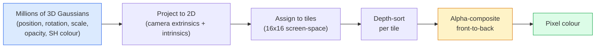

# 처음부터 만드는 3D Gaussian Splatting

> Scene은 수백만 개의 3D Gaussian으로 된 cloud다. 각 Gaussian은 position, orientation, scale, opacity, 그리고 viewing direction에 따라 달라지는 colour를 가진다. 이것들을 rasterise하고, rasterisation을 통해 backprop하면 끝이다.

**Type:** Build
**Languages:** Python
**Prerequisites:** Phase 4 Lesson 13 (3D Vision & NeRF), Phase 1 Lesson 12 (Tensor Operations), Phase 4 Lesson 10 (Diffusion basics optional)
**Time:** ~90 minutes

## 학습 목표

- 2026년에 production photorealistic 3D reconstruction의 default로 3D Gaussian Splatting이 NeRF를 대체한 이유를 설명한다
- Gaussian마다 가지는 여섯 parameter(position, rotation quaternion, scale, opacity, spherical harmonics colour, optional feature)와 각각이 차지하는 float 수를 말한다
- `alpha` compositing을 사용해 2D Gaussian splatting rasterizer를 처음부터 구현한 뒤, 3D case가 같은 loop로 project되는 방식을 보인다
- `nerfstudio`, `gsplat`, 또는 `SuperSplat`을 사용해 20-50장의 photo에서 scene을 reconstruct하고 `KHR_gaussian_splatting` glTF extension 또는 OpenUSD 26.03 `UsdVolParticleField3DGaussianSplat` schema로 export한다

## 문제

NeRF는 scene을 MLP의 weight로 저장한다. rendering되는 모든 pixel은 ray를 따라 수백 번의 MLP query를 수행한다. Training에는 시간이 걸리고, rendering에는 초 단위 시간이 걸리며, weight는 편집할 수 없다. scene 안의 의자를 옮기고 싶다면 다시 train해야 한다.

3D Gaussian Splatting(Kerbl, Kopanas, Leimkühler, Drettakis, SIGGRAPH 2023)은 이 모든 것을 대체했다. Scene은 explicit 3D Gaussian set이다. Rendering은 GPU rasterisation으로 100+ fps를 낸다. Training은 몇 분이면 된다. Editing은 직접적이다. Gaussian subset을 translate하면 의자를 옮긴 것이다. 2026년까지 Khronos Group은 Gaussian splat을 위한 glTF extension을 ratify했고, OpenUSD 26.03은 Gaussian splat schema를 제공하며, Zillow와 Apartments.com은 부동산을 이것으로 render하고, 3D reconstruction에 관한 대부분의 새 연구 논문은 핵심 3DGS idea의 변형이 되었다.

Mental model은 단순하지만, 수학에는 움직이는 부분이 충분히 많아서 대부분의 introduction은 rasterisation에서 시작해 projection과 spherical harmonics를 건너뛴다. 이 lesson은 2D version을 먼저 만들고, 그다음 3D extension으로 전체를 만든다.

## 개념

### Gaussian 하나가 담는 것

하나의 3D Gaussian은 space 안의 parametric blob이며 다음 attribute를 가진다.

```text
position         mu         (3,)    centre in world coordinates
rotation         q          (4,)    unit quaternion encoding orientation
scale            s          (3,)    log-scales per axis (exponentiated at render time)
opacity          alpha      (1,)    post-sigmoid opacity [0, 1]
SH coefficients  c_lm       (3 * (L+1)^2,)   view-dependent colour
```

Rotation + scale은 3x3 covariance `Sigma = R S S^T R^T`를 만든다. 이것이 3D에서 Gaussian의 shape이다. Spherical harmonics는 viewing direction에 따라 colour가 바뀌게 한다. specular highlights, subtle sheen, view-dependent glow를 per-view texture 없이 표현한다. SH degree 3이면 colour channel마다 16개 coefficient, 즉 colour만 Gaussian마다 48 floats가 필요하다.

Scene은 보통 1-5 million Gaussians를 가진다. 각 Gaussian은 대략 60 floats(3 + 4 + 3 + 1 + 48 + misc)를 저장한다. five-million-Gaussian scene이면 240 MB다. per-point texture가 있는 동등한 point cloud보다 훨씬 작고, high resolution에서 다시 render되는 NeRF의 MLP weight보다 한 자릿수 이상 작다.

### Ray marching이 아니라 rasterisation



다섯 단계이며 모두 GPU-friendly하다. pixel마다 MLP query가 없다. RTX 3080 Ti 한 장이 6 million splats를 147 fps로 render한다.

### Projection step

world position `mu`와 3D covariance `Sigma`를 가진 3D Gaussian은 screen position `mu'`와 2D covariance `Sigma'`를 가진 2D Gaussian으로 project된다.

```text
mu' = project(mu)
Sigma' = J W Sigma W^T J^T          (2 x 2)

W = viewing transform (rotation + translation of camera)
J = Jacobian of the perspective projection at mu'
```

2D Gaussian의 footprint는 `Sigma'`의 eigenvector를 축으로 하는 ellipse다. 그 ellipse 안의 모든 pixel은 `exp(-0.5 * (p - mu')^T Sigma'^-1 (p - mu'))`로 weight된 Gaussian contribution을 받는다.

### Alpha-compositing rule

한 pixel에 대해 그것을 덮는 Gaussian들은 back-to-front로 sort된다. 또는 inverted formula를 쓰면 front-to-back도 동등하다. Colour는 1980년대 이후 모든 semi-transparent rasteriser와 같은 equation으로 composite된다.

```text
C_pixel = sum_i alpha_i * T_i * c_i

T_i = prod_{j < i} (1 - alpha_j)       transmittance up to i
alpha_i = opacity_i * exp(-0.5 * d^T Sigma'^-1 d)   local contribution
c_i = eval_SH(SH_i, view_direction)    view-dependent colour
```

이것은 NeRF의 volumetric render와 **같은 equation**이다. ray를 따라 dense sample을 쓰는 대신 explicit sparse Gaussian set 위에서 계산할 뿐이다. 이 동일성이 rendered quality가 NeRF와 맞먹는 이유다. 둘 다 같은 radiance-field equation을 integrate한다.

### 왜 differentiable한가

projection, tile assignment, alpha compositing, SH evaluation의 모든 step은 Gaussian parameter에 대해 differentiable하다. ground-truth image가 주어지면 rendered pixel loss를 계산하고, rasteriser를 통해 backprop하며, gradient descent로 모든 `(mu, q, s, alpha, c_lm)`를 update한다. 약 30,000 iteration 동안 Gaussian은 올바른 position, scale, colour를 찾는다.

### Densification and pruning

고정된 Gaussian set은 complex scene을 덮을 수 없다. Training에는 두 가지 adaptive mechanism이 포함된다.

- **Clone** 현재 position에서 gradient magnitude가 높지만 scale이 작을 때 Gaussian을 복제한다. reconstruction이 이 부분에서 더 많은 detail을 필요로 한다.
- **Split** gradient가 높은 large-scale Gaussian을 두 개의 작은 Gaussian으로 나눈다. Gaussian 하나가 너무 smooth해서 region에 맞지 않는다.
- **Prune** opacity가 threshold 아래로 떨어진 Gaussian을 제거한다. contribution이 없기 때문이다.

Densification은 N iteration마다 실행된다. Scene은 보통 SfM point에서 seed된 ~100k initial Gaussians에서 training 끝에는 1-5M까지 자란다.

### Spherical harmonics in one paragraph

View-dependent colour는 unit sphere 위의 function `c(direction)`이다. Spherical harmonics는 sphere의 Fourier basis다. degree `L`에서 truncate하면 channel마다 `(L+1)^2` basis function을 얻는다. 새로운 view의 colour를 evaluate하는 것은 learned SH coefficient와 viewing direction에서 evaluate된 basis 사이의 dot product다. Degree 0 = one coefficient = constant colour. Degree 3 = 16 coefficients = Lambertian shading, specular, mild reflection을 포착하기에 충분하다. 3D Gaussian Splatting paper는 degree 3을 default로 사용한다.

### 2026 production stack

```text
1. Capture         smartphone / DJI drone / handheld scanner
2. SfM / MVS       COLMAP or GLOMAP derives camera poses + sparse points
3. Train 3DGS      nerfstudio / gsplat / inria official / PostShot (~10-30 min on RTX 4090)
4. Edit            SuperSplat / SplatForge (clean floaters, segment)
5. Export          .ply -> glTF KHR_gaussian_splatting or .usd (OpenUSD 26.03)
6. View            Cesium / Unreal / Babylon.js / Three.js / Vision Pro
```

### 4D and generative variants

- **4D Gaussian Splatting** — Gaussian이 time의 function이다. volumetric video에 사용된다(Superman 2026, A$AP Rocky의 "Helicopter").
- **Generative splats** — scene 전체를 hallucinate하는 text-to-splat model(World Labs의 Marble).
- **3D Gaussian Unscented Transform** — autonomous driving simulation을 위한 NVIDIA NuRec variant.

## 직접 만들기

### Step 1: A 2D Gaussian

먼저 2D rasteriser를 만든다. 3D case는 projection 뒤에 이것으로 reduce된다.

```python
import torch
import torch.nn as nn
import torch.nn.functional as F


def eval_2d_gaussian(means, covs, points):
    """
    means:  (G, 2)      centres
    covs:   (G, 2, 2)   covariance matrices
    points: (H, W, 2)   pixel coordinates
    returns: (G, H, W)  density at every pixel for every Gaussian
    """
    G = means.size(0)
    H, W, _ = points.shape
    flat = points.view(-1, 2)
    inv = torch.linalg.inv(covs)
    diff = flat[None, :, :] - means[:, None, :]
    d = torch.einsum("gpi,gij,gpj->gp", diff, inv, diff)
    density = torch.exp(-0.5 * d)
    return density.view(G, H, W)
```

`einsum`은 모든 (Gaussian, pixel) pair에 대해 quadratic form `diff^T Sigma^-1 diff`를 계산한다.

### Step 2: 2D splatting rasteriser

Front-to-back alpha-compositing이다. 2D에서 depth는 의미가 없으므로 order에는 Gaussian별 learned scalar를 사용한다.

```python
def rasterise_2d(means, covs, colours, opacities, depths, image_size):
    """
    means:     (G, 2)
    covs:      (G, 2, 2)
    colours:   (G, 3)
    opacities: (G,)     in [0, 1]
    depths:    (G,)     per-Gaussian scalar used for ordering
    image_size: (H, W)
    returns:   (H, W, 3) rendered image
    """
    H, W = image_size
    yy, xx = torch.meshgrid(
        torch.arange(H, dtype=torch.float32, device=means.device),
        torch.arange(W, dtype=torch.float32, device=means.device),
        indexing="ij",
    )
    points = torch.stack([xx, yy], dim=-1)

    densities = eval_2d_gaussian(means, covs, points)
    alphas = opacities[:, None, None] * densities
    alphas = alphas.clamp(0.0, 0.99)

    order = torch.argsort(depths)
    alphas = alphas[order]
    colours_sorted = colours[order]

    T = torch.ones(H, W, device=means.device)
    out = torch.zeros(H, W, 3, device=means.device)
    for i in range(means.size(0)):
        a = alphas[i]
        out += (T * a)[..., None] * colours_sorted[i][None, None, :]
        T = T * (1.0 - a)
    return out
```

빠르지는 않다. 실제 implementation은 tile-based CUDA kernel을 사용한다. 하지만 정확히 같은 수학이고 fully differentiable하다.

### Step 3: Trainable 2D splat scene

```python
class Splats2D(nn.Module):
    def __init__(self, num_splats=128, image_size=64, seed=0):
        super().__init__()
        g = torch.Generator().manual_seed(seed)
        H, W = image_size, image_size
        self.means = nn.Parameter(torch.rand(num_splats, 2, generator=g) * torch.tensor([W, H]))
        self.log_scale = nn.Parameter(torch.ones(num_splats, 2) * math.log(2.0))
        self.rot = nn.Parameter(torch.zeros(num_splats))  # single angle in 2D
        self.colour_logits = nn.Parameter(torch.randn(num_splats, 3, generator=g) * 0.5)
        self.opacity_logit = nn.Parameter(torch.zeros(num_splats))
        self.depth = nn.Parameter(torch.rand(num_splats, generator=g))

    def covs(self):
        s = torch.exp(self.log_scale)
        c, si = torch.cos(self.rot), torch.sin(self.rot)
        R = torch.stack([
            torch.stack([c, -si], dim=-1),
            torch.stack([si, c], dim=-1),
        ], dim=-2)
        S = torch.diag_embed(s ** 2)
        return R @ S @ R.transpose(-1, -2)

    def forward(self, image_size):
        covs = self.covs()
        colours = torch.sigmoid(self.colour_logits)
        opacities = torch.sigmoid(self.opacity_logit)
        return rasterise_2d(self.means, covs, colours, opacities, self.depth, image_size)
```

`log_scale`, `opacity_logit`, `colour_logits`는 모두 unconstrained parameter이며 render time에 적절한 activation을 거친다. 이것은 모든 3DGS implementation의 standard pattern이다.

### Step 4: Target image에 2D Gaussian fit하기

```python
import math
import numpy as np

def make_target(size=64):
    yy, xx = np.meshgrid(np.arange(size), np.arange(size), indexing="ij")
    img = np.zeros((size, size, 3), dtype=np.float32)
    # Red circle
    mask = (xx - 20) ** 2 + (yy - 20) ** 2 < 10 ** 2
    img[mask] = [1.0, 0.2, 0.2]
    # Blue square
    mask = (np.abs(xx - 45) < 8) & (np.abs(yy - 40) < 8)
    img[mask] = [0.2, 0.3, 1.0]
    return torch.from_numpy(img)


target = make_target(64)
model = Splats2D(num_splats=64, image_size=64)
opt = torch.optim.Adam(model.parameters(), lr=0.05)

for step in range(200):
    pred = model((64, 64))
    loss = F.mse_loss(pred, target)
    opt.zero_grad(); loss.backward(); opt.step()
    if step % 40 == 0:
        print(f"step {step:3d}  mse {loss.item():.4f}")
```

200 step 동안 64개 Gaussian은 두 shape에 자리 잡는다. 이것이 전체 idea다. explicit geometric primitive에 대한 gradient-descent다.

### Step 5: 2D에서 3D로

3D extension은 같은 loop를 유지한다. 추가되는 것은 다음이다.

1. Gaussian별 rotation이 single angle 대신 quaternion이다.
2. Covariance는 quaternion에서 만든 `R`과 `S = diag(exp(log_scale))`로 `R S S^T R^T`가 된다.
3. Projection `(mu, Sigma) -> (mu', Sigma')`는 camera extrinsics와 `mu`에서 perspective projection의 Jacobian을 사용한다.
4. Colour는 spherical-harmonics expansion이 된다. viewing direction에서 evaluate한다.
5. Depth-sort는 learned scalar가 아니라 실제 camera-space z에서 나온다.

모든 production implementation(`gsplat`, `inria/gaussian-splatting`, `nerfstudio`)은 tile-based CUDA kernel로 GPU에서 정확히 이것을 수행한다.

### Step 6: Spherical harmonics evaluation

degree 3까지의 SH basis는 channel마다 16개 term을 가진다. Evaluation:

```python
def eval_sh_degree_3(sh_coeffs, dirs):
    """
    sh_coeffs: (..., 16, 3)   last dim is RGB channels
    dirs:      (..., 3)       unit vectors
    returns:   (..., 3)
    """
    C0 = 0.282094791773878
    C1 = 0.488602511902920
    C2 = [1.092548430592079, 1.092548430592079,
          0.315391565252520, 1.092548430592079,
          0.546274215296039]
    x, y, z = dirs[..., 0], dirs[..., 1], dirs[..., 2]
    x2, y2, z2 = x * x, y * y, z * z
    xy, yz, xz = x * y, y * z, x * z

    result = C0 * sh_coeffs[..., 0, :]
    result = result - C1 * y[..., None] * sh_coeffs[..., 1, :]
    result = result + C1 * z[..., None] * sh_coeffs[..., 2, :]
    result = result - C1 * x[..., None] * sh_coeffs[..., 3, :]

    result = result + C2[0] * xy[..., None] * sh_coeffs[..., 4, :]
    result = result + C2[1] * yz[..., None] * sh_coeffs[..., 5, :]
    result = result + C2[2] * (2.0 * z2 - x2 - y2)[..., None] * sh_coeffs[..., 6, :]
    result = result + C2[3] * xz[..., None] * sh_coeffs[..., 7, :]
    result = result + C2[4] * (x2 - y2)[..., None] * sh_coeffs[..., 8, :]

    # degree 3 terms omitted here for brevity; full 16-coefficient version in the code file
    return result
```

Learned `sh_coeffs`는 해당 Gaussian의 "모든 방향에서의 colour"를 저장한다. Render time에는 현재 view direction에 대해 evaluate하고 RGB 3-vector를 얻는다.

## 가져다 쓰기

실제 3DGS 작업에는 `gsplat`(Meta) 또는 `nerfstudio`를 사용한다.

```bash
pip install nerfstudio gsplat
ns-download-data example
ns-train splatfacto --data path/to/data
```

`splatfacto`는 nerfstudio의 3DGS trainer다. 일반적인 scene에서 RTX 4090 기준 10-30분 걸린다.

2026년에 중요한 export option:

- `.ply` — raw Gaussian cloud(휴대 가능하지만 가장 큰 file).
- `.splat` — PlayCanvas / SuperSplat quantised format.
- glTF `KHR_gaussian_splatting` — Khronos standard, viewer 간 portable(Feb 2026 RC).
- OpenUSD `UsdVolParticleField3DGaussianSplat` — USD-native, NVIDIA Omniverse와 Vision Pro pipeline용.

4D / dynamic scene의 경우 `4DGS`와 `Deformable-3DGS`는 time-varying means와 opacity로 같은 machinery를 확장한다.

## 결과물

이 lesson은 다음을 만든다.

- `outputs/prompt-3dgs-capture-planner.md` — 주어진 scene type에 대해 capture session(number of photos, camera path, lighting)을 계획하는 prompt.
- `outputs/skill-3dgs-export-router.md` — downstream viewer 또는 engine에 따라 올바른 export format(`.ply` / `.splat` / glTF / USD)을 고르는 skill.

## 연습문제

1. **(Easy)** 위 2D splat trainer를 다른 synthetic image에서 실행하라. `num_splats`를 `[16, 64, 256]`으로 바꾸고 각각의 MSE vs step을 plot하라. diminishing returns가 시작되는 지점을 식별하라.
2. **(Medium)** 2D rasteriser를 확장해 Gaussian별 RGB colour가 degree-2 harmonic을 통해 scalar "view angle"에 의존하도록 하라. target image pair에서 학습하고 model이 둘 다 reconstruct하는지 확인하라.
3. **(Hard)** `nerfstudio`를 clone하고, 직접 가진 어떤 scene(desk, plant, face, room)의 20-photo capture에서 `splatfacto`를 train하라. glTF `KHR_gaussian_splatting`으로 export하고 viewer(Three.js `GaussianSplats3D`, SuperSplat, Babylon.js V9)에서 열어라. Training time, number of Gaussians, rendered fps를 보고하라.

## 핵심 용어

| Term | 사람들이 하는 말 | 실제 의미 |
|------|----------------|----------------------|
| 3DGS | "Gaussian splats" | Gaussian별 position, rotation, scale, opacity, SH colour를 가진 수백만 개의 3D Gaussian으로 이루어진 explicit scene representation |
| Covariance | "Shape of the Gaussian" | `Sigma = R S S^T R^T`; 하나의 Gaussian의 orientation과 anisotropic scale |
| Alpha compositing | "Back-to-front blend" | NeRF의 volumetric render와 같은 equation을 explicit sparse set 위에서 수행 |
| Densification | "Clone and split" | reconstruction이 under-fit된 곳에 새 Gaussian을 adaptive하게 추가 |
| Pruning | "Delete low-opacity" | training 중 near-zero opacity로 collapse된 Gaussian 제거 |
| Spherical harmonics | "View-dependent colour" | sphere 위의 Fourier basis; viewing direction의 function으로 colour를 저장 |
| Splatfacto | "nerfstudio's 3DGS" | 2026년에 3DGS를 train하는 가장 쉬운 경로 |
| `KHR_gaussian_splatting` | "glTF standard" | 3DGS를 viewer와 engine 사이에서 portable하게 만드는 Khronos 2026 extension |

## 더 읽을거리

- [3D Gaussian Splatting for Real-Time Radiance Field Rendering (Kerbl et al., SIGGRAPH 2023)](https://repo-sam.inria.fr/fungraph/3d-gaussian-splatting/) — original paper
- [gsplat (Meta/nerfstudio)](https://github.com/nerfstudio-project/gsplat) — production-quality CUDA rasteriser
- [nerfstudio Splatfacto](https://docs.nerf.studio/nerfology/methods/splat.html) — reference training recipe
- [Khronos KHR_gaussian_splatting extension](https://github.com/KhronosGroup/glTF/blob/main/extensions/2.0/Khronos/KHR_gaussian_splatting/README.md) — 2026 portable format
- [OpenUSD 26.03 release notes](https://openusd.org/release/) — `UsdVolParticleField3DGaussianSplat` schema
- [THE FUTURE 3D State of Gaussian Splatting 2026](https://www.thefuture3d.com/blog-0/2026/4/4/state-of-gaussian-splatting-2026) — industry overview
