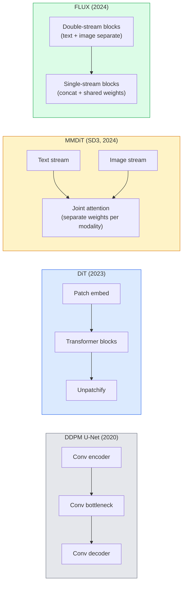

# 디퓨전 트랜스포머와 Rectified Flow

> U-Net이 디퓨전의 비밀은 아닙니다. 그것을 트랜스포머로 바꾸고, 노이즈 스케줄을 직선 흐름으로 교체하면 SD3, FLUX, 그리고 2026년의 모든 텍스트-이미지 모델이 보이기 시작합니다.

**Type:** Learn + Build
**Languages:** Python
**Prerequisites:** Phase 4 Lesson 10 (Diffusion DDPM), Phase 4 Lesson 14 (ViT), Phase 7 Lesson 02 (Self-Attention)
**Time:** ~75 minutes

## 학습 목표

- U-Net DDPM(레슨 10)에서 Diffusion Transformer(DiT), MMDiT(SD3), single+double-stream DiT(FLUX)로 이어지는 진화를 추적한다
- Rectified flow를 설명한다: 노이즈와 데이터 사이의 직선 궤적이 왜 모델이 1000단계 대신 20단계로 샘플링하게 해 주는지 이해한다
- 100줄 미만의 작은 DiT 블록과 rectified-flow 학습 루프를 구현한다
- 모델 변형(SD3, FLUX.1-dev, FLUX.1-schnell, Z-Image, Qwen-Image)을 아키텍처, 파라미터 수, 라이선스로 구분한다

## 문제

레슨 10에서는 U-Net 디노이저로 DDPM을 만들었습니다. 이 조합은 2020-2023년에 지배적이었습니다. U-Net + beta schedule + noise-prediction loss입니다. 이것이 Stable Diffusion 1.5와 2.1, DALL-E 2를 만들었습니다.

2026년의 모든 최첨단 텍스트-이미지 모델은 그 지점을 지나왔습니다. Stable Diffusion 3, FLUX, SD4, Z-Image, Qwen-Image, Hunyuan-Image는 U-Net을 쓰지 않습니다. Diffusion Transformers(DiT)를 씁니다. SD3와 FLUX는 DDPM 노이즈 스케줄도 rectified flow로 바꿉니다. 이 방식은 노이즈에서 데이터로 가는 경로를 곧게 펴고, consistency나 distilled 변형에서는 1-4단계 추론을 가능하게 합니다.

이 변화가 중요한 이유는 디퓨전 기반 이미지 생성이 제어 가능하고, 프롬프트에 정확하며(SD3/SD4가 텍스트 렌더링을 해결했습니다), 프로덕션에서 빠르게 된 이유이기 때문입니다. DiT + rectified flow를 이해하는 것은 2026년 생성 이미지 스택을 이해하는 일입니다.

## 개념

### U-Net에서 트랜스포머로



- **DiT** (Peebles & Xie, 2023) — U-Net을 latent patch 위에서 동작하는 ViT 형태의 트랜스포머로 대체합니다. 조건부 정보는 adaptive layer norm(AdaLN)으로 넣습니다.
- **MMDiT** (SD3, Esser et al., 2024) — text token과 image token을 위한 두 스트림이 있고, 모달리티별 별도 가중치가 joint attention을 공유합니다.
- **FLUX** (Black Forest Labs, 2024) — 앞의 N개 블록은 SD3처럼 double-stream이고, 뒤쪽 블록은 더 깊은 네트워크에서 효율을 얻기 위해 concatenate 후 가중치를 공유하는 single-stream입니다.
- **Z-Image** (2025) — 6B 파라미터의 효율적인 single-stream DiT로, "어떤 비용을 치르더라도 스케일을 키운다"는 접근에 도전합니다.

### Rectified flow 한 문단 설명

DDPM은 forward process를 `x_t`가 점점 더 손상되는 noisy SDE로 정의합니다. 학습된 reverse는 두 번째 SDE이며, 1000개의 작은 단계로 풉니다.

Rectified flow는 깨끗한 데이터와 순수 노이즈 사이의 **직선** 보간을 정의합니다.

```text
x_t = (1 - t) * x_0 + t * epsilon,     t in [0, 1]
```

네트워크는 velocity `v_theta(x_t, t) = epsilon - x_0`를 예측하도록 학습됩니다. 이것은 깨끗한 데이터에서 노이즈로 가는 직선 경로의 forward 방향(`dx_t/dt`)입니다. 샘플링 중에는 이 velocity를 거꾸로 적분하여 노이즈에서 데이터 쪽으로 이동합니다. 결과 ODE는 훨씬 직선에 가까우므로, 샘플을 만들 때 필요한 적분 단계가 훨씬 적습니다.

SD3는 이것을 **Rectified Flow Matching**이라고 부릅니다. FLUX, Z-Image, 그리고 2026년 대부분의 모델이 같은 objective를 씁니다. 일반적인 추론은 20-30 Euler steps(결정론적)이며, 예전 DDPM 체제의 50+ DDIM steps와 대비됩니다. Distilled / turbo / schnell / LCM 변형은 이를 1-4단계까지 줄입니다.

### AdaLN 조건화

DiT는 timestep과 class/text를 **adaptive layer norm**으로 조건화합니다. 조건 벡터에서 `scale`과 `shift`를 예측하고, LayerNorm 뒤에 적용합니다. U-Net의 FiLM 스타일 modulation보다 훨씬 깔끔하며 모든 현대 DiT의 기본 방식입니다.

```text
cond -> MLP -> (scale, shift, gate)
norm(x) * (1 + scale) + shift, then residual add * gate
```

### SD3와 FLUX의 텍스트 인코더

- **SD3**는 세 개의 텍스트 인코더를 씁니다. 두 개의 CLIP 모델 + T5-XXL입니다. 임베딩을 이어 붙인 뒤 텍스트 조건으로 image stream에 넣습니다.
- **FLUX**는 하나의 CLIP-L + T5-XXL을 씁니다.
- **Qwen-Image / Z-Image** 변형은 각자의 base LLM에 맞춘 자체 텍스트 인코더를 씁니다.

텍스트 인코더는 SD3/FLUX가 SD1.5보다 프롬프트를 훨씬 잘 추론하는 큰 이유입니다. T5-XXL만 해도 4.7B 파라미터입니다.

### Classifier-free guidance는 여전히 유효하다

Rectified flow는 sampler를 바꾸지만 조건화 자체를 바꾸지는 않습니다. Classifier-free guidance(학습 중 10% 확률로 텍스트를 drop하고, 추론 시 conditional과 unconditional prediction을 섞는 방식)는 rectified flow에서도 동일하게 작동합니다. 2026년 대부분의 모델은 guidance scale 3.5-5를 씁니다. SD1.5의 7.5보다 낮은데, rectified-flow 모델이 기본적으로 프롬프트를 더 밀착해 따르기 때문입니다.

### Consistency, Turbo, Schnell, LCM

같은 아이디어를 부르는 네 가지 이름입니다. 느린 many-step 모델을 빠른 few-step 모델로 증류합니다.

- **LCM (Latent Consistency Model)** — 어떤 중간 `x_t`에서든 최종 `x_0`를 한 단계로 예측하는 student를 학습합니다.
- **SDXL Turbo / FLUX schnell** — adversarial diffusion distillation으로 학습한 1-4단계 모델입니다.
- **SD Turbo** — latent diffusion에 맞게 조정한 OpenAI 스타일 Consistency Models입니다.

새 모델의 프로덕션 서빙은 보통 "full quality" 체크포인트와 "turbo / schnell" 변형을 함께 제공합니다. Schnell(독일어로 "빠름", Black Forest Labs의 관례)은 1-4단계로 실행되며 실시간 파이프라인에 들어갑니다.

### 2026년 모델 지형

| 모델 | 크기 | 아키텍처 | 라이선스 |
|------|------|------------|----------|
| Stable Diffusion 3 Medium | 2B | MMDiT | SAI Community |
| Stable Diffusion 3.5 Large | 8B | MMDiT | SAI Community |
| FLUX.1-dev | 12B | Double + Single Stream DiT | 비상업용 |
| FLUX.1-schnell | 12B | 동일 구조, distilled | Apache 2.0 |
| FLUX.2 | — | 반복 개선된 FLUX.1 | 혼합 |
| Z-Image | 6B | S3-DiT (Scalable Single-Stream) | 허용적 |
| Qwen-Image | ~20B | DiT + Qwen text tower | Apache 2.0 |
| Hunyuan-Image-3.0 | ~80B | DiT | 연구용 |
| SD4 Turbo | 3B | DiT + distillation | SAI Commercial |

FLUX.1-schnell은 2026년 오픈 소스 기본 선택지입니다. Z-Image는 효율 선두입니다. FLUX.2와 SD4는 현재 품질 최상위권입니다.

### 이 phase shift가 중요한 이유

DDPM + U-Net은 작동했습니다. DiT + rectified flow는 **더 잘, 더 빠르게, 더 깔끔하게 스케일**합니다. 이 전환은 NLP에서 RNN에서 트랜스포머로 넘어간 변화와 평행합니다. 두 아키텍처 모두 같은 문제를 풀었지만, 트랜스포머가 스케일했고 이제 지배합니다. 이미지, 비디오, 3D 생성에 관한 2026년의 모든 논문은 DiT 형태의 디노이저를 쓰며, 보통 rectified flow objective도 씁니다. U-Net DDPM은 이제 주로 교육용입니다(레슨 10).

## 직접 만들기

### 1단계: AdaLN을 쓰는 DiT 블록

```python
import torch
import torch.nn as nn


class AdaLNZero(nn.Module):
    """
    Adaptive LayerNorm with a gate. Predicts (scale, shift, gate) from the conditioning.
    Init such that the whole block starts as identity ("zero init").
    """

    def __init__(self, dim, cond_dim):
        super().__init__()
        self.norm = nn.LayerNorm(dim, elementwise_affine=False)
        self.mlp = nn.Linear(cond_dim, dim * 3)
        nn.init.zeros_(self.mlp.weight)
        nn.init.zeros_(self.mlp.bias)

    def forward(self, x, cond):
        scale, shift, gate = self.mlp(cond).chunk(3, dim=-1)
        h = self.norm(x) * (1 + scale.unsqueeze(1)) + shift.unsqueeze(1)
        return h, gate.unsqueeze(1)


class DiTBlock(nn.Module):
    def __init__(self, dim=192, heads=3, mlp_ratio=4, cond_dim=192):
        super().__init__()
        self.adaln1 = AdaLNZero(dim, cond_dim)
        self.attn = nn.MultiheadAttention(dim, heads, batch_first=True)
        self.adaln2 = AdaLNZero(dim, cond_dim)
        self.mlp = nn.Sequential(
            nn.Linear(dim, dim * mlp_ratio),
            nn.GELU(),
            nn.Linear(dim * mlp_ratio, dim),
        )

    def forward(self, x, cond):
        h, gate1 = self.adaln1(x, cond)
        a, _ = self.attn(h, h, h, need_weights=False)
        x = x + gate1 * a
        h, gate2 = self.adaln2(x, cond)
        x = x + gate2 * self.mlp(h)
        return x
```

`AdaLNZero`는 MLP 가중치가 0으로 초기화되기 때문에 identity mapping으로 시작합니다. 학습은 블록을 identity에서 서서히 벗어나게 합니다. 이 방식은 깊은 트랜스포머 디퓨전 모델을 극적으로 안정화합니다.

### 2단계: 작은 DiT

```python
def timestep_embedding(t, dim):
    import math
    half = dim // 2
    freqs = torch.exp(-math.log(10000) * torch.arange(half, device=t.device) / half)
    args = t[:, None].float() * freqs[None]
    return torch.cat([args.sin(), args.cos()], dim=-1)


class TinyDiT(nn.Module):
    def __init__(self, image_size=16, patch_size=2, in_channels=3, dim=96, depth=4, heads=3):
        super().__init__()
        self.patch_size = patch_size
        self.num_patches = (image_size // patch_size) ** 2
        self.patch = nn.Conv2d(in_channels, dim, kernel_size=patch_size, stride=patch_size)
        self.pos = nn.Parameter(torch.zeros(1, self.num_patches, dim))
        self.time_mlp = nn.Sequential(
            nn.Linear(dim, dim * 2),
            nn.SiLU(),
            nn.Linear(dim * 2, dim),
        )
        self.blocks = nn.ModuleList([DiTBlock(dim, heads, cond_dim=dim) for _ in range(depth)])
        self.norm_out = nn.LayerNorm(dim, elementwise_affine=False)
        self.head = nn.Linear(dim, patch_size * patch_size * in_channels)

    def forward(self, x, t):
        n = x.size(0)
        x = self.patch(x)
        x = x.flatten(2).transpose(1, 2) + self.pos
        t_emb = self.time_mlp(timestep_embedding(t, self.pos.size(-1)))
        for blk in self.blocks:
            x = blk(x, t_emb)
        x = self.norm_out(x)
        x = self.head(x)
        return self._unpatchify(x, n)

    def _unpatchify(self, x, n):
        p = self.patch_size
        h = w = int(self.num_patches ** 0.5)
        x = x.view(n, h, w, p, p, -1).permute(0, 5, 1, 3, 2, 4).reshape(n, -1, h * p, w * p)
        return x
```

### 3단계: Rectified flow 학습

```python
import torch.nn.functional as F

def rectified_flow_train_step(model, x0, optimizer, device):
    model.train()
    x0 = x0.to(device)
    n = x0.size(0)
    t = torch.rand(n, device=device)
    epsilon = torch.randn_like(x0)
    x_t = (1 - t[:, None, None, None]) * x0 + t[:, None, None, None] * epsilon

    target_velocity = epsilon - x0
    pred_velocity = model(x_t, t)

    loss = F.mse_loss(pred_velocity, target_velocity)
    optimizer.zero_grad()
    loss.backward()
    optimizer.step()
    return loss.item()
```

DDPM의 noise-prediction loss(레슨 10)와 비교해 보세요. 구조는 같고 target만 다릅니다. 노이즈 `epsilon`을 예측하는 대신, 직선 보간을 따라 데이터에서 노이즈를 가리키는 **velocity** `epsilon - x_0`를 예측합니다.

### 4단계: Euler sampler

Rectified flow는 ODE입니다. Euler 방법은 가장 단순하며, 잘 학습된 rectified-flow 모델에서는 20+ 단계에서 고차 solver와 거의 비슷하게 정확합니다.

```python
@torch.no_grad()
def rectified_flow_sample(model, shape, steps=20, device="cpu"):
    model.eval()
    x = torch.randn(shape, device=device)
    dt = 1.0 / steps
    t = torch.ones(shape[0], device=device)
    for _ in range(steps):
        v = model(x, t)
        x = x - dt * v
        t = t - dt
    return x
```

20단계입니다. 학습된 모델에서는 1000단계 DDPM에 견줄 만한 샘플을 만듭니다.

### 5단계: 엔드투엔드 smoke test

```python
import numpy as np

def synthetic_blobs(num=200, size=16, seed=0):
    rng = np.random.default_rng(seed)
    out = np.zeros((num, 3, size, size), dtype=np.float32)
    yy, xx = np.meshgrid(np.arange(size), np.arange(size), indexing="ij")
    for i in range(num):
        cx, cy = rng.uniform(4, size - 4, size=2)
        r = rng.uniform(2, 4)
        mask = (xx - cx) ** 2 + (yy - cy) ** 2 < r ** 2
        colour = rng.uniform(-1, 1, size=3)
        for c in range(3):
            out[i, c][mask] = colour[c]
    return torch.from_numpy(out)
```

이 데이터로 `TinyDiT`를 rectified flow 방식으로 학습하세요. 500단계 뒤에는 샘플 출력이 희미한 색 덩어리처럼 보여야 합니다.

## 사용하기

FLUX / SD3 / Z-Image로 실제 이미지 생성을 할 때는 `diffusers`가 모두를 통합 API로 제공합니다.

```python
from diffusers import FluxPipeline, StableDiffusion3Pipeline
import torch

pipe = FluxPipeline.from_pretrained(
    "black-forest-labs/FLUX.1-schnell",
    torch_dtype=torch.bfloat16,
).to("cuda")

out = pipe(
    prompt="a golden retriever surfing a tsunami, hyperrealistic, studio lighting",
    guidance_scale=0.0,           # schnell was trained without CFG
    num_inference_steps=4,
    max_sequence_length=256,
).images[0]
out.save("surf.png")
```

세 줄입니다. `FLUX.1-schnell`을 네 단계로 실행합니다. 20-30단계와 CFG로 더 높은 품질을 원한다면 model id를 `black-forest-labs/FLUX.1-dev`로 바꾸면 됩니다.

SD3의 경우:

```python
pipe = StableDiffusion3Pipeline.from_pretrained(
    "stabilityai/stable-diffusion-3.5-large",
    torch_dtype=torch.bfloat16,
).to("cuda")
out = pipe(prompt, guidance_scale=3.5, num_inference_steps=28).images[0]
```

## 출시하기

이 레슨은 다음을 산출합니다.

- `outputs/prompt-dit-model-picker.md` — 품질, 지연 시간, 라이선스 제약에 따라 SD3, FLUX.1-dev, FLUX.1-schnell, Z-Image, SD4 Turbo 중에서 선택합니다.
- `outputs/skill-rectified-flow-trainer.md` — AdaLN DiT와 Euler sampling으로 rectified flow를 위한 완전한 학습 루프를 작성합니다.

## 연습 문제

1. **(쉬움)** 위의 TinyDiT를 synthetic blob dataset에서 500단계 학습하세요. 10, 20, 50 Euler steps로 만든 샘플을 비교하세요.
2. **(중간)** 학습된 class embedding을 time embedding에 이어 붙여 텍스트 조건화를 추가하세요(색상별 10개 blob "classes"). class 0, 5, 9로 샘플링하고 색상이 맞는지 확인하세요.
3. **(어려움)** 같은 크기의 네트워크를 같은 데이터에서 같은 단계 수만큼 학습한 rectified-flow 버전과 DDPM 버전의 생성 샘플 사이 Fréchet distance(FID proxy)를 계산하세요. 어느 쪽이 더 빨리 수렴하는지 보고하세요.

## 핵심 용어

| 용어 | 사람들이 말하는 표현 | 실제 의미 |
|------|----------------------|-----------|
| DiT | "Diffusion transformer" | U-Net을 diffusion denoiser로 대체하는 트랜스포머이며, patchified latent에서 동작합니다 |
| AdaLN | "Adaptive layer norm" | LayerNorm 뒤에 적용되는 학습된 scale, shift, gate를 통한 timestep/text 조건화이며, 모든 현대 DiT의 표준입니다 |
| MMDiT | "Multi-modal DiT (SD3)" | joint self-attention을 공유하는 text token과 image token용 별도 weight stream입니다 |
| Single-stream / double-stream | "FLUX trick" | 효율을 위해 앞의 N개 블록은 double-stream(모달리티별 별도 가중치), 뒤쪽 블록은 single-stream(concat + shared weights)입니다 |
| Rectified flow | "직선 noise-to-data" | 데이터와 노이즈 사이의 선형 보간이며, 네트워크가 velocity를 예측합니다. 추론 시 필요한 ODE 단계가 적습니다 |
| Velocity target | "epsilon - x_0" | Rectified flow의 회귀 target이며, 깨끗한 데이터에서 노이즈를 가리킵니다 |
| CFG guidance | "classifier-free guidance" | conditional prediction과 unconditional prediction을 섞는 방식이며, rectified-flow 모델에서도 여전히 사용됩니다 |
| Schnell / turbo / LCM | "1-4단계 distillation" | full-quality 모델에서 증류한 small-step 변형이며, 프로덕션 실시간용입니다 |

## 더 읽을거리

- [Scalable Diffusion Models with Transformers (Peebles & Xie, 2023)](https://arxiv.org/abs/2212.09748) — DiT 논문
- [Scaling Rectified Flow Transformers (Esser et al., SD3 paper)](https://arxiv.org/abs/2403.03206) — 대규모 MMDiT와 rectified-flow
- [FLUX.1 model card and technical report (Black Forest Labs)](https://huggingface.co/black-forest-labs/FLUX.1-dev) — double + single-stream 세부 사항
- [Z-Image: Efficient Image Generation Foundation Model (2025)](https://arxiv.org/html/2511.22699v1) — 6B single-stream DiT
- [Elucidating the Design Space of Diffusion (Karras et al., 2022)](https://arxiv.org/abs/2206.00364) — 모든 diffusion 설계 trade-off의 기준점
- [Latent Consistency Models (Luo et al., 2023)](https://arxiv.org/abs/2310.04378) — LCM-LoRA가 4단계 추론을 가능하게 하는 방식
