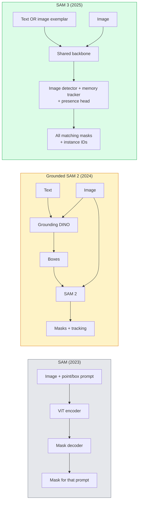

# SAM 3와 Open-Vocabulary Segmentation

> 모델에 텍스트 프롬프트와 이미지를 주면 일치하는 모든 객체의 마스크를 얻습니다. SAM 3는 이것을 단일 forward pass로 만들었습니다.

**Type:** Use + Build
**Languages:** Python
**Prerequisites:** Phase 4 Lesson 07 (U-Net), Phase 4 Lesson 08 (Mask R-CNN), Phase 4 Lesson 18 (CLIP)
**Time:** ~60 minutes

## 학습 목표

- SAM(visual prompts only), Grounded SAM / SAM 2(detector + SAM), SAM 3(Promptable Concept Segmentation을 통한 native text prompts)를 구분한다
- SAM 3 아키텍처를 설명한다: shared backbone + image detector + memory-based video tracker + presence head + decoupled detector-tracker design
- Hugging Face `transformers` SAM 3 통합을 사용해 text-prompted detection, segmentation, video tracking을 수행한다
- 지연 시간, concept complexity, deployment target에 따라 SAM 3, Grounded SAM 2, YOLO-World, SAM-MI 중에서 선택한다

## 문제

2023년의 SAM은 visual-prompt-only 모델이었습니다. 점을 클릭하거나 박스를 그리면 마스크를 반환했습니다. "이 사진의 모든 오렌지를 찾아 줘"에는 detector(Grounding DINO)가 먼저 boxes를 만들고, 그다음 SAM이 각각을 segment해야 했습니다. Grounded SAM은 이것을 파이프라인으로 만들었지만, 두 개의 frozen model을 이어 붙인 cascade였고 오류 누적은 피할 수 없었습니다.

SAM 3(Meta, 2025년 11월, ICLR 2026)는 이 cascade를 접어 넣었습니다. 짧은 noun phrase나 image exemplar를 prompt로 받아, 일치하는 모든 masks와 instance IDs를 단일 forward pass에서 반환합니다. 이것이 **Promptable Concept Segmentation (PCS)**입니다. 2026년 3월 Object Multiplex update(SAM 3.1)와 결합하면, 같은 concept의 여러 instance를 비디오에서 효율적으로 추적합니다.

이 레슨은 이 변화가 나타내는 구조적 전환을 다룹니다. 2D segmentation, detection, text-image grounding이 하나의 모델로 합쳐졌습니다. 프로덕션 질문은 더 이상 "어떤 파이프라인을 이어 붙일까"가 아니라 "어떤 promptable model이 내 use case를 end-to-end로 처리할까"입니다.

## 개념

### 세 세대



### Promptable Concept Segmentation

"concept prompt"는 짧은 noun phrase(`"yellow school bus"`, `"striped red umbrella"`, `"hand holding a mug"`) 또는 image exemplar입니다. 모델은 concept과 일치하는 이미지 속 모든 instance의 segmentation masks와, match별 unique instance ID를 반환합니다.

이것은 고전적인 visual-prompt SAM과 세 가지 점에서 다릅니다.

1. instance별 prompting이 필요 없습니다. 하나의 text prompt가 모든 match를 반환합니다.
2. open-vocabulary입니다. concept은 자연어로 설명할 수 있는 무엇이든 될 수 있습니다.
3. prompt마다 하나의 mask가 아니라, 여러 instance를 한 번에 반환합니다.

### 핵심 아키텍처 구성 요소

- **Shared backbone** — 하나의 ViT가 이미지를 처리합니다. detector head와 memory-based tracker가 모두 여기서 읽습니다.
- **Presence head** — concept이 이미지에 존재하는지 예측합니다. "여기에 있는가?"와 "어디에 있는가?"를 분리합니다. 존재하지 않는 concept에 대한 false positive를 줄입니다.
- **Decoupled detector-tracker** — image-level detection과 video-level tracking이 서로 방해하지 않도록 별도 head를 가집니다.
- **Memory bank** — video tracking을 위해 frame 전체에서 instance별 feature를 저장합니다(SAM 2가 쓴 것과 같은 메커니즘).

### 대규모 학습

SAM 3는 AI + human review로 반복적으로 annotation을 만들고 교정하는 data engine이 생성한 **4 million unique concepts**로 학습되었습니다. 새로운 **SA-CO benchmark**는 270K unique concepts를 포함하며, 이전 benchmark보다 50배 큽니다. SAM 3는 SA-CO에서 human performance의 75-80%에 도달하고, image + video PCS에서 기존 system의 성능을 두 배로 끌어올립니다.

### SAM 3.1 Object Multiplex

2026년 3월 업데이트: **Object Multiplex**는 같은 concept의 많은 instance를 함께 추적하기 위한 shared-memory mechanism을 도입했습니다. 이전에는 N개 instance를 추적하려면 N개의 별도 memory bank가 필요했습니다. Multiplex는 이를 하나의 shared memory와 per-instance queries로 접습니다. 결과적으로 정확도를 희생하지 않으면서 multi-object tracking이 훨씬 빨라집니다.

### 2026년에도 Grounded SAM이 중요한 곳

- 특정 open-vocabulary detector를 교체해 넣어야 할 때(DINO-X, Florence-2).
- SAM 3 license(HF gated)가 blocker일 때.
- SAM 3가 노출하는 것보다 detector threshold를 더 세밀하게 제어해야 할 때.
- detector component에 대한 research / ablation work를 할 때.

모듈형 파이프라인은 여전히 자리가 있습니다. 대부분의 프로덕션 작업에서는 SAM 3가 더 단순한 답입니다.

### YOLO-World vs SAM 3

- **YOLO-World** — open-vocabulary detector only(마스크 없음). 실시간입니다. 높은 fps에서 boxes가 필요할 때 가장 좋습니다.
- **SAM 3** — full segmentation + tracking. 더 느리지만 출력이 더 풍부합니다.

프로덕션 분기: 빠른 detection-only pipeline(로보틱스 내비게이션, 빠른 dashboard)에는 YOLO-World, masks나 tracking이 필요한 모든 것에는 SAM 3입니다.

### SAM-MI 효율

SAM-MI(2025-2026)는 SAM의 decoder bottleneck을 다룹니다. 핵심 아이디어:

- **Sparse point prompting** — dense prompts 대신 잘 고른 몇 개의 point를 사용합니다. decoder calls를 96% 줄입니다.
- **Shallow mask aggregation** — 거친 mask prediction들을 하나의 더 선명한 mask로 병합합니다.
- **Decoupled mask injection** — decoder를 다시 실행하는 대신 pre-computed mask features를 받습니다.

결과: open-vocabulary benchmark에서 Grounded-SAM 대비 약 1.6× speedup입니다.

### 세 모델의 출력 형식

모두 같은 일반 구조(boxes + labels + scores + masks + IDs)를 반환합니다. 이것은 유용합니다. downstream pipeline이 어떤 모델이 실행되었는지에 따라 분기할 필요가 없습니다.

## 직접 만들기

### 1단계: Prompt construction 구성

사용자 문장을 SAM 3 concept prompt 목록으로 바꾸는 helper를 만드세요. 이것은 "사용자가 입력한 것"과 "모델이 소비하는 것"이 만나는 경계입니다.

```python
def split_concepts(sentence):
    """
    Heuristic splitter for multi-concept prompts.
    Returns list of short noun phrases.
    """
    for sep in [",", ";", "and", "or", "&"]:
        if sep in sentence:
            parts = [p.strip() for p in sentence.replace("and ", ",").split(",")]
            return [p for p in parts if p]
    return [sentence.strip()]

print(split_concepts("cats, dogs and balloons"))
```

SAM 3는 forward pass 하나당 concept 하나를 받습니다. multi-concept query에서는 loop하거나 batch 처리하세요.

### 2단계: 후처리 helper

SAM 3의 raw outputs를 Phase 4 Lesson 16 pipeline contract에 맞는 깔끔한 detection 목록으로 바꾸세요.

```python
from dataclasses import dataclass
from typing import List

@dataclass
class ConceptDetection:
    concept: str
    instance_id: int
    box: tuple          # (x1, y1, x2, y2)
    score: float
    mask_rle: str       # run-length encoded


def rle_encode(binary_mask):
    flat = binary_mask.flatten().astype("uint8")
    runs = []
    prev, count = flat[0], 0
    for v in flat:
        if v == prev:
            count += 1
        else:
            runs.append((int(prev), count))
            prev, count = v, 1
    runs.append((int(prev), count))
    return ";".join(f"{v}x{c}" for v, c in runs)
```

RLE는 high-resolution mask가 많아도 response payload를 작게 유지합니다. 같은 형식이 SAM 2, SAM 3, Grounded SAM 2 전반에서 동작합니다.

### 3단계: 통합 open-vocab segmentation interface

어떤 backend(SAM 3, Grounded SAM 2, YOLO-World + SAM 2)를 쓰든 하나의 method 뒤로 감싸세요. backend가 바뀌어도 downstream code는 바뀌지 않습니다.

```python
from abc import ABC, abstractmethod
import numpy as np

class OpenVocabSeg(ABC):
    @abstractmethod
    def detect(self, image: np.ndarray, concept: str) -> List[ConceptDetection]:
        ...


class StubOpenVocabSeg(OpenVocabSeg):
    """
    Deterministic stub used for pipeline testing when real models are not loaded.
    """
    def detect(self, image, concept):
        h, w = image.shape[:2]
        return [
            ConceptDetection(
                concept=concept,
                instance_id=0,
                box=(w * 0.2, h * 0.3, w * 0.5, h * 0.8),
                score=0.89,
                mask_rle="0x100;1x50;0x200",
            ),
            ConceptDetection(
                concept=concept,
                instance_id=1,
                box=(w * 0.55, h * 0.25, w * 0.85, h * 0.75),
                score=0.74,
                mask_rle="0x80;1x40;0x220",
            ),
        ]
```

실제 `SAM3OpenVocabSeg` subclass는 `transformers.Sam3Model`과 `Sam3Processor`를 감쌉니다.

### 4단계: Hugging Face SAM 3 사용(참고)

실제 모델에서는 `transformers` integration을 사용합니다.

```python
from transformers import Sam3Processor, Sam3Model
import torch

processor = Sam3Processor.from_pretrained("facebook/sam3")
model = Sam3Model.from_pretrained("facebook/sam3").eval()

inputs = processor(images=pil_image, return_tensors="pt")
inputs = processor.set_text_prompt(inputs, "yellow school bus")

with torch.no_grad():
    outputs = model(**inputs)

masks = processor.post_process_masks(
    outputs.masks, inputs.original_sizes, inputs.reshaped_input_sizes
)
boxes = outputs.boxes
scores = outputs.scores
```

하나의 prompt로 모든 match가 단일 call에서 반환됩니다.

### 5단계: Grounded SAM 2가 공짜로 주던 것을 측정하기

정직한 benchmark입니다. 실제 pipeline에서 Grounded SAM 2를 SAM 3로 바꾸면 어떤 일이 일어날까요?

- Latency: SAM 3는 별도 detector가 없어 forward pass 하나를 아끼지만 모델 자체는 더 무겁습니다. 보통 net-neutral이거나 약간 빨라집니다.
- Accuracy: SAM 3는 rare 또는 compositional concepts("striped red umbrella")에서 훨씬 좋습니다. 흔한 single-word concepts에서는 비슷합니다.
- Flexibility: Grounded SAM 2는 detector(DINO-X, Florence-2, Grounding DINO 1.5)를 교체할 수 있습니다. SAM 3는 monolithic입니다.

결론: SAM 3는 2026년 open-vocab seg의 기본값입니다. detector flexibility나 다른 license terms가 필요할 때는 Grounded SAM 2가 여전히 올바른 답입니다.

## 사용하기

프로덕션 배포 패턴:

- **Real-time annotation** — SAM 3 + CVAT의 label-as-text-prompt 기능. annotator가 label name을 선택하면 SAM 3가 일치하는 모든 instance를 pre-label합니다. 검토하고 수정합니다.
- **Video analytics** — multi-object tracking에는 SAM 3.1 Object Multiplex를 사용합니다. frame을 memory-based tracker에 넣습니다.
- **Robotics** — open-vocab manipulation("pick up the red cup")에 SAM 3를 사용합니다. planning primitive로 실행됩니다.
- **Medical imaging** — medical concepts에 fine-tuned한 SAM 3입니다. HF에서 access request가 필요합니다.

Ultralytics는 Python package에서 SAM 3를 감쌉니다.

```python
from ultralytics import SAM

model = SAM("sam3.pt")
results = model(image_path, prompts="yellow school bus")
```

YOLO와 SAM 2와 같은 interface입니다.

## 출시하기

이 레슨은 다음을 산출합니다.

- `outputs/prompt-open-vocab-stack-picker.md` — 지연 시간, concept complexity, licensing에 따라 SAM 3 / Grounded SAM 2 / YOLO-World / SAM-MI를 선택하는 prompt.
- `outputs/skill-concept-prompt-designer.md` — 사용자 발화를 잘 구성된 SAM 3 concept prompts로 바꾸는 skill(splitting, disambiguation, fallbacks).

## 연습 문제

1. **(쉬움)** 직접 고른 concept prompts로 10개 이미지에서 SAM 3를 실행하세요. 같은 이미지에서 SAM 2 + Grounding DINO 1.5와 비교하세요. 각 모델이 놓친 concept을 보고하세요.
2. **(중간)** SAM 3 위에 "click-to-include / click-to-exclude" UI를 만드세요. text prompt가 candidate instances를 반환하고, 사용자는 어떤 것이 positive로 count되는지 클릭해 유지합니다. 최종 concept set을 JSON으로 출력하세요.
3. **(어려움)** custom concept set(예: 전자 부품 5종)을 각 20개 labelled images로 SAM 3에 fine-tune하세요. 같은 test set에서 zero-shot SAM 3와 비교하고 mask IoU improvement를 측정하세요.

## 핵심 용어

| 용어 | 사람들이 말하는 표현 | 실제 의미 |
|------|----------------------|-----------|
| Open-vocabulary segmentation | "텍스트로 segment" | 고정 label set이 아니라 자연어로 설명한 객체의 mask를 만듭니다 |
| PCS | "Promptable Concept Segmentation" | SAM 3의 핵심 task입니다. noun-phrase나 image exemplar가 주어지면 일치하는 모든 instance를 segment합니다 |
| Concept prompt | "텍스트 입력" | 짧은 noun phrase나 image exemplar입니다. 완전한 문장이 아닙니다 |
| Presence head | "여기에 있는가?" | localisation 전에 concept이 이미지에 존재하는지 판단하는 SAM 3 module입니다 |
| SA-CO | "SAM 3 benchmark" | 270K-concept open-vocabulary segmentation benchmark이며, 이전 open-vocab benchmark보다 50배 큽니다 |
| Object Multiplex | "SAM 3.1 update" | shared-memory multi-object tracking입니다. 많은 instance를 빠르게 joint tracking합니다 |
| Grounded SAM 2 | "모듈형 pipeline" | Detector + SAM 2 cascade입니다. detector swap이 중요할 때 여전히 관련 있습니다 |
| SAM-MI | "효율적인 SAM 변형" | Grounded-SAM 대비 1.6x speedup을 위한 Mask Injection입니다 |

## 더 읽을거리

- [SAM 3: Segment Anything with Concepts (arXiv 2511.16719)](https://arxiv.org/abs/2511.16719)
- [SAM 3.1 Object Multiplex (Meta AI, March 2026)](https://ai.meta.com/blog/segment-anything-model-3/)
- [SAM 3 model page on Hugging Face](https://huggingface.co/facebook/sam3)
- [Grounded SAM 2 tutorial (PyImageSearch)](https://pyimagesearch.com/2026/01/19/grounded-sam-2-from-open-set-detection-to-segmentation-and-tracking/)
- [Ultralytics SAM 3 docs](https://docs.ultralytics.com/models/sam-3/)
- [SAM3-I: Instruction-aware SAM (arXiv 2512.04585)](https://arxiv.org/abs/2512.04585)
