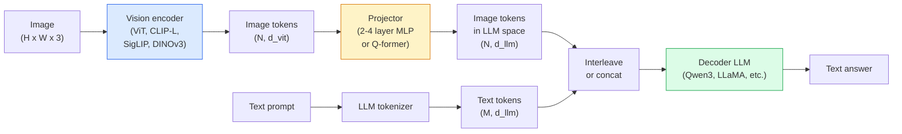

# 비전-언어 모델 - ViT-MLP-LLM 패턴

> 비전 인코더가 이미지를 토큰으로 변환합니다. MLP 프로젝터가 그 토큰을 LLM의 임베딩 공간으로 매핑합니다. 나머지는 언어 모델이 처리합니다. 이 패턴, 즉 ViT-MLP-LLM은 2026년 모든 프로덕션 VLM의 기본형입니다.

**Type:** Learn + Use
**Languages:** Python
**Prerequisites:** Phase 4 Lesson 14 (ViT), Phase 4 Lesson 18 (CLIP), Phase 7 Lesson 02 (Self-Attention)
**Time:** ~75분

## 학습 목표

- ViT-MLP-LLM 아키텍처를 설명하고 세 구성 요소가 각각 무엇을 기여하는지 설명한다
- Qwen3-VL, InternVL3.5, LLaVA-Next, GLM-4.6V를 파라미터 수, 컨텍스트 길이, 벤치마크 성능 기준으로 비교한다
- DeepStack을 설명한다: 다중 레벨 ViT 특징이 단일 마지막 레이어 특징보다 비전-언어 정렬을 더 강하게 만드는 이유
- Cross-Modal Error Rate(CMER)로 프로덕션 VLM 환각을 측정하고 그 신호에 대응한다

## 문제

CLIP(Phase 4 Lesson 18)은 이미지와 텍스트를 위한 공유 임베딩 공간을 제공합니다. 이는 제로샷 분류와 검색에는 충분합니다. 하지만 CLIP은 "이 이미지에 빨간 자동차가 몇 대 있나요?"라는 질문에 답할 수 없습니다. CLIP은 텍스트를 생성하지 않고 유사도만 점수화하기 때문입니다.

Vision-Language Models(VLMs)인 Qwen3-VL, InternVL3.5, LLaVA-Next, GLM-4.6V는 CLIP 계열 이미지 인코더를 완전한 언어 모델에 붙입니다. 모델은 이미지와 질문을 함께 보고 답을 생성합니다. 2026년 오픈 소스 VLM은 멀티모달 벤치마크(MMMU, MMBench, DocVQA, ChartQA, MathVista, OSWorld)에서 GPT-5와 Gemini-2.5-Pro에 맞먹거나 능가합니다.

세 구성 요소(ViT, projector, LLM)의 조합이 표준입니다. 모델 간 차이는 어떤 ViT, 어떤 projector, 어떤 LLM, 어떤 학습 데이터, 어떤 정렬 레시피를 쓰는지에 있습니다. 이 패턴을 이해하면 어떤 구성 요소든 기계적으로 교체할 수 있습니다.

## 개념

### ViT-MLP-LLM 아키텍처



1. **비전 인코더** - 사전 학습된 ViT(CLIP-L/14, SigLIP, DINOv3 또는 파인튜닝된 변형). 패치 토큰을 생성합니다.
2. **프로젝터** - 비전 토큰을 LLM의 임베딩 차원으로 매핑하는 작은 모듈(2-4 레이어 MLP 또는 Q-former)입니다. 파인튜닝의 대부분이 여기서 일어납니다.
3. **LLM** - 디코더 전용 언어 모델(Qwen3, Llama, Mistral, GLM, InternLM). 비전 + 텍스트 토큰을 시퀀스로 읽고 텍스트를 생성합니다.

원칙적으로 세 부분 모두 학습 가능합니다. 실제로는 비전 인코더와 LLM은 대부분 고정하고 projector만 학습합니다. 저렴하게 수십억 파라미터의 신호를 활용하는 방식입니다.

### DeepStack

기본 projection은 마지막 ViT 레이어만 사용합니다. DeepStack(Qwen3-VL)은 여러 ViT 깊이에서 특징을 샘플링해 쌓습니다. 깊은 레이어는 고수준 의미를 담고, 얕은 레이어는 세밀한 공간 정보와 질감 정보를 담습니다. 둘 다 LLM에 넣으면 "이미지에 무엇이 있는가"(의미)와 "정확히 어디에 있는가"(공간 grounding) 사이의 간극이 줄어듭니다.

### 세 가지 학습 단계

현대 VLM은 단계적으로 학습합니다.

1. **정렬** - ViT와 LLM을 고정합니다. 이미지-캡션 쌍에서 projector만 학습합니다. projector가 비전 공간을 언어 공간으로 매핑하도록 가르칩니다.
2. **사전 학습** - 모든 것을 고정 해제합니다. 대규모 interleaved image-text 데이터(5억+ 쌍)로 학습합니다. 모델의 시각 지식을 구축합니다.
3. **지시 튜닝** - 선별된 (image, question, answer) triples로 파인튜닝합니다. 대화 행동과 태스크 형식을 가르칩니다. 이것이 "비전을 아는 LM"을 사용 가능한 어시스턴트로 바꿉니다.

대부분의 LoRA 파인튜닝은 작은 라벨링 데이터셋으로 3단계를 겨냥합니다.

### 모델 계열 비교(2026년 초)

| 모델 | 파라미터 | 비전 인코더 | LLM | 컨텍스트 | 강점 |
|-------|--------|----------------|-----|---------|-----------|
| Qwen3-VL-235B-A22B (MoE) | 235B (22B active) | custom ViT + DeepStack | Qwen3 | 256K | General SOTA, GUI agent |
| Qwen3-VL-30B-A3B (MoE) | 30B (3B active) | custom ViT + DeepStack | Qwen3 | 256K | Smaller MoE alternative |
| Qwen3-VL-8B (dense) | 8B | custom ViT | Qwen3 | 128K | Production dense default |
| InternVL3.5-38B | 38B | InternViT-6B | Qwen3 + GPT-OSS | 128K | Strong MMBench / MMVet |
| InternVL3.5-241B-A28B | 241B (28B active) | InternViT-6B | Qwen3 | 128K | Competitive with GPT-4o |
| LLaVA-Next 72B | 72B | SigLIP | Llama-3 | 32K | Open, easy to fine-tune |
| GLM-4.6V | ~70B | custom | GLM | 64K | Open-source, strong OCR |
| MiniCPM-V-2.6 | 8B | SigLIP | MiniCPM | 32K | Edge-friendly |

### 시각 에이전트

Qwen3-VL-235B는 GUI(데스크톱, 모바일, 웹)를 조작하는 **시각 에이전트** 벤치마크인 OSWorld에서 전 세계 최상위 성능을 냅니다. 모델은 스크린샷을 보고 UI를 이해한 뒤 동작(클릭, 입력, 스크롤)을 내보냅니다. 도구와 결합하면 일반적인 데스크톱 작업의 루프를 닫을 수 있습니다. 이것이 2026년 대부분의 "AI PC" 데모가 내부에서 실행하는 방식입니다.

### 에이전트 능력 + RoPE 변형

VLM은 비디오에서 프레임이 **언제** 나타나는지 알아야 합니다. Qwen3-VL은 T-RoPE(temporal rotary position embeddings)에서 **텍스트 기반 시간 정렬**로 발전했습니다. 즉, 명시적 timestamp 텍스트 토큰을 비디오 프레임 사이에 끼워 넣습니다. 모델은 "`<timestamp 00:32>` frame, prompt"를 보고 시간 관계를 추론할 수 있습니다.

### 정렬 문제

크롤링된 데이터셋의 이미지-텍스트 쌍 중 12%는 이미지에 완전히 grounded되지 않은 설명을 포함합니다. 이런 데이터로 학습한 VLM은 조용히 환각을 배웁니다. 객체를 날조하고, 숫자를 잘못 읽고, 관계를 만들어냅니다. 프로덕션에서는 이것이 지배적인 실패 모드입니다.

Skywork.ai는 이를 추적하기 위해 **Cross-Modal Error Rate(CMER)** 를 도입했습니다.

```text
CMER = fraction of outputs where the text confidence is high but the image-text similarity (via a CLIP-family checker) is low
```

CMER가 높다는 것은 모델이 이미지에 grounded되지 않은 내용을 확신 있게 말한다는 뜻입니다. CMER를 모니터링하고 프로덕션 KPI로 다룬 결과, 해당 배포에서는 환각률을 약 35% 줄였습니다. 핵심은 "모델을 고친다"가 아니라 "CMER가 높은 출력을 사람 검토로 라우팅한다"입니다.

### LoRA / QLoRA로 파인튜닝

70B VLM 전체 파인튜닝은 대부분의 팀에게 현실적이지 않습니다. attention + projector 레이어에 LoRA(rank 16-64)를 적용하거나 4-bit base weights를 쓰는 QLoRA를 적용하면 단일 A100 / H100에 들어갑니다. 비용: 예제 5,000-50,000개, 컴퓨트 $100-$5,000, 학습 2-10시간.

### 공간 추론은 여전히 약하다

현재 VLM은 공간 추론 벤치마크(above-below, left-right, counting, distance)에서 50-60%를 기록합니다. 사용 사례가 "어떤 객체가 어떤 객체 위에 있는가"에 의존한다면 강하게 검증해야 합니다. 일반 VLM 성능은 사람보다 낮습니다. 순수 공간 태스크에서 VLM보다 나은 대안은 특화된 keypoint / pose estimator, depth model, 또는 box geometry를 후처리하는 detection model입니다.

## 직접 만들기

### 1단계: 프로젝터

가장 자주 학습하게 될 부분입니다. GELU가 있는 2-4 레이어 MLP입니다.

```python
import torch
import torch.nn as nn


class Projector(nn.Module):
    def __init__(self, vit_dim=768, llm_dim=4096, hidden=4096):
        super().__init__()
        self.net = nn.Sequential(
            nn.Linear(vit_dim, hidden),
            nn.GELU(),
            nn.Linear(hidden, llm_dim),
        )

    def forward(self, x):
        return self.net(x)
```

입력은 `(N_patches, d_vit)` 토큰 텐서입니다. 출력은 `(N_patches, d_llm)`입니다. LLM은 출력의 각 행을 또 하나의 토큰처럼 취급합니다.

### 2단계: ViT-MLP-LLM을 end-to-end로 조립하기

최소 VLM의 forward pass 뼈대입니다. 실제 코드는 `transformers`를 사용합니다. 여기서는 개념적 배치만 보여줍니다.

```python
class MinimalVLM(nn.Module):
    def __init__(self, vit, projector, llm, image_token_id):
        super().__init__()
        self.vit = vit
        self.projector = projector
        self.llm = llm
        self.image_token_id = image_token_id  # placeholder token in text prompt

    def forward(self, image, input_ids, attention_mask):
        # 1. vision features
        vision_tokens = self.vit(image)                     # (B, N_patches, d_vit)
        vision_embeds = self.projector(vision_tokens)       # (B, N_patches, d_llm)

        # 2. text embeddings
        text_embeds = self.llm.get_input_embeddings()(input_ids)  # (B, M, d_llm)

        # 3. replace image placeholder tokens with vision embeds
        merged = self._merge(text_embeds, vision_embeds, input_ids)

        # 4. run LLM
        return self.llm(inputs_embeds=merged, attention_mask=attention_mask)

    def _merge(self, text_embeds, vision_embeds, input_ids):
        out = text_embeds.clone()
        expected = vision_embeds.size(1)
        for b in range(input_ids.size(0)):
            positions = (input_ids[b] == self.image_token_id).nonzero(as_tuple=True)[0]
            if len(positions) != expected:
                raise ValueError(
                    f"batch item {b} has {len(positions)} image tokens but vision_embeds has {expected} patches."
                    " Every sample in the batch must be pre-padded to the same number of image placeholder tokens.")
            out[b, positions] = vision_embeds[b]
        return out
```

텍스트의 `<image>` placeholder token이 실제 이미지 임베딩으로 대체됩니다. LLaVA, Qwen-VL, InternVL이 쓰는 것과 같은 패턴입니다.

### 3단계: CMER 계산

가벼운 런타임 검사입니다.

```python
import torch.nn.functional as F


def cross_modal_error_rate(image_emb, text_emb, text_confidence, sim_threshold=0.25, conf_threshold=0.8):
    """
    image_emb, text_emb: embeddings of image and generated text (normalised internally)
    text_confidence:     mean per-token probability in [0, 1]
    Returns:             fraction of high-confidence outputs with low image-text alignment
    """
    image_emb = F.normalize(image_emb, dim=-1)
    text_emb = F.normalize(text_emb, dim=-1)
    sim = (image_emb * text_emb).sum(dim=-1)        # cosine similarity
    high_conf_low_sim = (text_confidence > conf_threshold) & (sim < sim_threshold)
    return high_conf_low_sim.float().mean().item()
```

CMER를 프로덕션 KPI로 다루세요. endpoint별, prompt type별, customer별로 모니터링합니다. CMER 상승은 모델이 어떤 입력 분포에서 환각을 시작하고 있음을 나타냅니다.

### 4단계: 장난감 VLM 분류기(실행 가능)

projector가 학습된다는 것을 보여줍니다. 가짜 "ViT features"가 들어가고, 작은 LLM 스타일 토큰이 클래스를 예측합니다.

```python
class ToyVLM(nn.Module):
    def __init__(self, vit_dim=32, llm_dim=64, num_classes=5):
        super().__init__()
        self.projector = Projector(vit_dim, llm_dim, hidden=64)
        self.head = nn.Linear(llm_dim, num_classes)

    def forward(self, vision_tokens):
        projected = self.projector(vision_tokens)
        pooled = projected.mean(dim=1)
        return self.head(pooled)
```

합성 (feature, class) 쌍에 대해 200 step 미만으로 맞출 수 있습니다. projector 패턴이 동작한다는 것을 보이기에는 충분합니다.

## 사용하기

2026년 프로덕션 팀이 VLM을 쓰는 방식은 세 가지입니다.

- **호스팅 API** - OpenAI Vision, Anthropic Claude Vision, Google Gemini Vision. 인프라가 없지만 벤더 리스크가 있습니다.
- **오픈 소스 셀프 호스팅** - `transformers`와 `vllm`으로 Qwen3-VL 또는 InternVL3.5를 실행합니다. 완전한 제어권이 있지만 초기 노력이 큽니다.
- **도메인 파인튜닝** - Qwen2.5-VL-7B 또는 LLaVA-1.6-7B를 로드하고, 커스텀 예제 5k-50k개로 LoRA를 적용한 뒤 `vllm` 또는 `TGI`로 서빙합니다.

```python
from transformers import AutoProcessor, AutoModelForVision2Seq
import torch
from PIL import Image

model_id = "Qwen/Qwen3-VL-8B-Instruct"
processor = AutoProcessor.from_pretrained(model_id)
model = AutoModelForVision2Seq.from_pretrained(model_id, torch_dtype=torch.bfloat16, device_map="auto")

messages = [{
    "role": "user",
    "content": [
        {"type": "image", "image": Image.open("plot.png")},
        {"type": "text", "text": "What does this chart show?"},
    ],
}]
inputs = processor.apply_chat_template(messages, add_generation_prompt=True, tokenize=True, return_dict=True, return_tensors="pt").to("cuda")
generated = model.generate(**inputs, max_new_tokens=256)
answer = processor.decode(generated[0][inputs["input_ids"].shape[1]:], skip_special_tokens=True)
```

`apply_chat_template`은 `<image>` placeholder tokenization을 숨깁니다. 모델이 내부에서 merge를 처리합니다.

## 배포하기

이 lesson은 다음을 만듭니다.

- `outputs/prompt-vlm-selector.md` - 정확도, 지연 시간, 컨텍스트 길이, 예산을 기준으로 Qwen3-VL / InternVL3.5 / LLaVA-Next / API를 고릅니다.
- `outputs/skill-cmer-monitor.md` - 프로덕션 VLM endpoint에 cross-modal error rate, endpoint별 dashboard, alerting threshold를 계측하는 코드를 내보냅니다.

## 연습 문제

1. **(쉬움)** 임의의 오픈 VLM에 이미지 5장을 넣고 세 가지 prompt("what is this?", "count the objects", "describe the scene")를 실행합니다. 각 답을 손으로 correct / partially correct / hallucinated로 점수화합니다. 첫 번째 CMER 유사 비율을 계산합니다.
2. **(보통)** 대상 도메인의 이미지 500장과 캡션으로 Qwen2.5-VL-3B 또는 LLaVA-1.6-7B를 LoRA(rank 16) 파인튜닝합니다. zero-shot과 fine-tuned MMBench 스타일 정확도를 비교합니다.
3. **(어려움)** VLM의 이미지 인코더를 기본 SigLIP/CLIP 대신 DINOv3로 교체합니다. projector만 다시 학습합니다(frozen LLM + frozen DINOv3). dense-prediction task(counting, spatial reasoning)가 개선되는지 측정합니다.

## 핵심 용어

| 용어 | 사람들이 말하는 표현 | 실제 의미 |
|------|----------------|----------------------|
| ViT-MLP-LLM | "VLM 패턴" | Vision encoder + projector + language model; 2026년 모든 VLM |
| Projector | "다리" | 비전 토큰을 LLM embedding space로 매핑하는 2-4 레이어 MLP(또는 Q-former) |
| DeepStack | "Qwen3-VL feature trick" | 마지막 레이어만 쓰지 않고 multi-level ViT features를 쌓는 방식 |
| Image token | "<image> placeholder" | projected vision embeddings로 대체되는 text stream 안의 special token |
| CMER | "Hallucination KPI" | Cross-Modal Error Rate; text confidence는 높지만 image-text similarity가 낮을 때 높음 |
| Visual agent | "클릭하는 VLM" | tool call로 GUI(OSWorld, mobile, web)를 조작하는 VLM |
| Q-former | "고정 개수 token bridge" | 고정된 수의 visual query tokens를 생성하는 BLIP-2 스타일 projector |
| Alignment / pre-training / instruction tuning | "세 단계" | 표준 VLM 학습 pipeline |

## 더 읽을거리

- [Qwen3-VL Technical Report (arXiv 2511.21631)](https://arxiv.org/abs/2511.21631)
- [InternVL3.5 Advancing Open-Source Multimodal Models (arXiv 2508.18265)](https://arxiv.org/html/2508.18265v1)
- [LLaVA-Next series](https://llava-vl.github.io/blog/2024-05-10-llava-next-stronger-llms/)
- [BentoML: Best Open-Source VLMs 2026](https://www.bentoml.com/blog/multimodal-ai-a-guide-to-open-source-vision-language-models)
- [MMMU: Multi-discipline Multimodal Understanding benchmark](https://mmmu-benchmark.github.io/)
- [VLMs in manufacturing (Robotics Tomorrow, March 2026)](https://www.roboticstomorrow.com/story/2026/03/when-machines-learn-to-see-like-experts-the-rise-of-vision-language-models-in-manufacturing/26335/)
