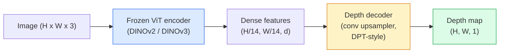

# 단안 깊이 및 기하 추정

> depth map은 각 픽셀이 카메라로부터의 거리인 single-channel image입니다. 예전에는 stereo나 LiDAR 없이 RGB frame 하나에서 이를 예측하는 것이 불가능에 가까웠습니다. 2026년에는 frozen ViT encoder와 가벼운 head만으로 ground truth에서 몇 퍼센트 이내까지 접근합니다.

**Type:** Build + Use
**Languages:** Python
**Prerequisites:** Phase 4 Lesson 14 (ViT), Phase 4 Lesson 17 (Self-Supervised Vision), Phase 4 Lesson 07 (U-Net)
**Time:** ~60분

## 학습 목표

- relative depth와 metric depth를 구분하고 각 프로덕션 모델(MiDaS, Marigold, Depth Anything V3, ZoeDepth)이 무엇을 푸는지 말한다
- Depth Anything V3(DINOv2 backbone)를 사용해 calibration 없이 임의의 단일 이미지에 대한 depth를 예측한다
- 단일 이미지에서 monocular depth가 작동하는 이유(perspective cues, texture gradients, learned priors)와 복원할 수 없는 것(absolute scale, occluded geometry)을 설명한다
- depth map과 pinhole camera intrinsics를 사용해 2D detections를 3D points로 들어 올린다

## 문제

깊이는 2D computer vision에서 빠진 축입니다. RGB가 주어지면 물체가 image plane의 어디에 나타나는지는 알 수 있지만 얼마나 멀리 있는지는 알 수 없습니다. Depth sensor(stereo rigs, LiDAR, time-of-flight)는 이를 직접 해결하지만 비싸고, 취약하며, 범위에 제한이 있습니다.

Monocular depth estimation, 즉 단일 RGB frame에서 depth를 예측하는 방식은 예전에는 흐릿하고 신뢰하기 어려운 출력을 냈습니다. 2026년에는 대규모 pretrained encoder가 이를 바꿨습니다. Depth Anything V3는 frozen DINOv2 backbone을 사용하며 indoor, outdoor, medical, satellite domain 전반에 일반화되는 depth map을 생성합니다. Marigold는 depth를 conditional diffusion 문제로 재구성합니다. ZoeDepth는 실제 metric distance를 회귀합니다.

Depth는 2D detection과 3D understanding 사이의 다리이기도 합니다. 감지된 box의 pixel에 depth를 곱하면 2D object를 3D point cloud로 들어 올릴 수 있습니다. 이것이 모든 AR occlusion system, obstacle-avoidance pipeline, 그리고 "pick up the cup" robot의 핵심입니다.

## 개념

### Relative depth와 metric depth

- **Relative depth** - 실제 단위가 없는 정렬된 `z` 값입니다. "Pixel A가 pixel B보다 가깝지만 거리 비율은 metre에 고정되어 있지 않습니다."
- **Metric depth** - 카메라로부터 metre 단위의 절대 거리입니다. 모델이 image cues와 실제 거리 사이의 통계적 관계를 학습해야 합니다.

MiDaS와 Depth Anything V3는 relative depth를 생성합니다. Marigold도 relative depth를 생성합니다. ZoeDepth, UniDepth, Metric3D는 metric depth를 생성합니다. Metric models는 camera intrinsics에 민감하고, relative models는 그렇지 않습니다.

### Encoder-decoder 패턴



Depth Anything V3는 encoder를 고정하고 DPT 스타일 decoder만 학습합니다. encoder는 풍부한 features를 제공하고, decoder는 이를 image resolution으로 다시 보간해 depth를 회귀합니다.

### 단일 이미지가 어떻게 depth를 생성할 수 있는가

2D image에는 depth와 상관관계가 있는 많은 monocular cue가 들어 있습니다.

- **Perspective** - 3D에서 평행한 선은 2D에서 수렴합니다.
- **Texture gradient** - 멀리 있는 surface는 더 작고 조밀한 texture를 가집니다.
- **Occlusion order** - 가까운 object는 먼 object를 가립니다.
- **Size constancy** - 알려진 object(car, human)는 대략적인 scale을 제공합니다.
- **Atmospheric perspective** - outdoor scene에서 먼 object는 더 흐리고 푸르게 보입니다.

수십억 장의 이미지로 학습한 ViT는 이런 cue를 내재화합니다. 충분한 데이터와 강한 backbone이 있으면 명시적인 3D supervision 없이도 monocular depth는 합리적인 정확도에 도달합니다.

### Monocular depth가 할 수 없는 것

- **intrinsics나 scene 안의 알려진 object 없는 absolute metric scale**. network는 "cup이 spoon보다 두 배 멀다"는 것은 예측할 수 있지만 cup이 1 m 떨어졌는지 10 m 떨어졌는지는 알 수 없습니다.
- **Occluded geometry** - chair의 뒷면은 보이지 않으며 신뢰성 있게 추론할 수 없습니다.
- **정말 texture가 없거나 reflective한 surface** - mirror, glass, uniform wall. network는 그럴듯하지만 틀린 depth를 보고합니다.

### 2026년 Depth Anything V3

- encoder로 vanilla DINOv2 ViT-L/14 사용(frozen).
- DPT decoder.
- 다양한 source의 posed image pairs로 학습(photometric consistency 외 명시적인 depth supervision은 필요 없음).
- **known camera poses 유무와 관계없이 임의 개수의 visual inputs**로부터 공간적으로 일관된 geometry를 예측합니다.
- monocular depth, any-view geometry, visual rendering, camera pose estimation 전반에서 SOTA입니다.

2026년에 depth가 필요할 때 호출할 drop-in model입니다.

### Marigold - depth를 위한 diffusion

Marigold(Ke et al., CVPR 2024)는 depth estimation을 conditional image-to-image diffusion으로 재구성합니다. Conditioning은 RGB이고 target은 depth map입니다. pretrained Stable Diffusion 2 U-Net을 backbone으로 사용합니다. output depth map은 object boundary에서 특히 선명합니다. trade-off는 feed-forward models보다 느린 inference입니다(denoising steps 10-50).

### Intrinsics와 pinhole camera

depth `d`를 가진 pixel `(u, v)`를 camera coordinates의 3D point `(X, Y, Z)`로 들어 올리려면:

```text
fx, fy, cx, cy = camera intrinsics
X = (u - cx) * d / fx
Y = (v - cy) * d / fy
Z = d
```

Intrinsics는 EXIF metadata, calibration pattern, 또는 monocular intrinsics estimator(Perspective Fields, UniDepth)에서 얻습니다. intrinsics가 없어도 60-70° FOV와 중간 해상도의 principal point를 가정해 point cloud를 렌더링할 수 있습니다. 이는 시각화에는 쓸 만하지만 측정에는 적합하지 않습니다.

### 평가

두 가지 표준 metric:

- **AbsRel**(absolute relative error): `mean(|d_pred - d_gt| / d_gt)`. 낮을수록 좋습니다. 프로덕션 모델은 0.05-0.1입니다.
- **delta < 1.25**(threshold accuracy): `max(d_pred/d_gt, d_gt/d_pred) < 1.25`인 pixel의 비율입니다. 높을수록 좋습니다. SOTA는 0.9+입니다.

relative depth(Depth Anything V3, MiDaS)의 경우 evaluation은 두 metric의 scale-and-shift invariant version을 사용합니다.

## 직접 만들기

### 1단계: Depth metrics

```python
import torch

def abs_rel_error(pred, target, mask=None):
    if mask is not None:
        pred = pred[mask]
        target = target[mask]
    return (torch.abs(pred - target) / target.clamp(min=1e-6)).mean().item()


def delta_accuracy(pred, target, threshold=1.25, mask=None):
    if mask is not None:
        pred = pred[mask]
        target = target[mask]
    ratio = torch.maximum(pred / target.clamp(min=1e-6), target / pred.clamp(min=1e-6))
    return (ratio < threshold).float().mean().item()
```

evaluation 전에 invalid depth pixels(zero, NaN, saturated)를 항상 mask합니다.

### 2단계: Scale-and-shift alignment

relative-depth models는 metric을 계산하기 전에 prediction을 ground truth에 맞춰 align합니다. `a * pred + b = target`의 least-squares fit입니다.

```python
def align_scale_shift(pred, target, mask=None):
    if mask is not None:
        p = pred[mask]
        t = target[mask]
    else:
        p = pred.flatten()
        t = target.flatten()
    A = torch.stack([p, torch.ones_like(p)], dim=1)
    coeffs, *_ = torch.linalg.lstsq(A, t.unsqueeze(-1))
    a, b = coeffs[:2, 0]
    return a * pred + b
```

MiDaS / Depth Anything을 평가할 때는 `abs_rel_error` 전에 `align_scale_shift`를 실행합니다.

### 3단계: depth를 point cloud로 들어 올리기

```python
import numpy as np

def depth_to_point_cloud(depth, intrinsics):
    H, W = depth.shape
    fx, fy, cx, cy = intrinsics
    v, u = np.meshgrid(np.arange(H), np.arange(W), indexing="ij")
    z = depth
    x = (u - cx) * z / fx
    y = (v - cy) * z / fy
    return np.stack([x, y, z], axis=-1)


depth = np.random.uniform(0.5, 4.0, (240, 320))
intr = (320.0, 320.0, 160.0, 120.0)
pc = depth_to_point_cloud(depth, intr)
print(f"point cloud shape: {pc.shape}  (H, W, 3)")
```

하나의 함수가 모든 3D-lifted application을 가능하게 합니다. point cloud를 `.ply`로 export하고 MeshLab 또는 CloudCompare에서 엽니다.

### 4단계: synthetic depth scene으로 smoke test

```python
def synthetic_depth(size=96):
    yy, xx = np.meshgrid(np.arange(size), np.arange(size), indexing="ij")
    # Floor: linear gradient from near (top) to far (bottom)
    depth = 1.0 + (yy / size) * 4.0
    # Box in the middle: closer
    mask = (np.abs(xx - size / 2) < size / 6) & (np.abs(yy - size * 0.6) < size / 6)
    depth[mask] = 2.0
    return depth.astype(np.float32)


gt = torch.from_numpy(synthetic_depth(96))
pred = gt + 0.3 * torch.randn_like(gt)  # simulated prediction
aligned = align_scale_shift(pred, gt)
print(f"before align  absRel = {abs_rel_error(pred, gt):.3f}")
print(f"after align   absRel = {abs_rel_error(aligned, gt):.3f}")
```

### 5단계: Depth Anything V3 사용(reference)

```python
import torch
from transformers import pipeline
from PIL import Image

pipe = pipeline(task="depth-estimation", model="LiheYoung/depth-anything-v2-large")

image = Image.open("street.jpg").convert("RGB")
out = pipe(image)
depth_np = np.array(out["depth"])
```

세 줄입니다. `out["depth"]`는 PIL grayscale입니다. 수학 계산을 위해 numpy로 변환합니다. Depth Anything V3를 구체적으로 쓰려면 release 후 model id만 바꾸면 됩니다. API는 그대로입니다.

## 사용하기

- **Depth Anything V3** (Meta AI / ByteDance, 2024-2026) - relative depth의 기본값입니다. 프로덕션에서 가장 빠른 ViT-large-backbone model입니다.
- **Marigold** (ETH, 2024) - 가장 높은 visual quality, 느린 inference.
- **UniDepth** (ETH, 2024) - camera intrinsics estimation을 포함한 metric depth.
- **ZoeDepth** (Intel, 2023) - metric depth; 더 오래되었지만 여전히 신뢰할 수 있습니다.
- **MiDaS v3.1** - legacy지만 stable합니다. comparison baseline으로 좋습니다.

일반적인 integration pattern:

1. RGB frame이 들어옵니다.
2. Depth model이 depth map을 생성합니다.
3. Detector가 boxes를 생성합니다.
4. Box centroids를 depth를 통해 3D로 들어 올립니다. 가능하면 point cloud와 merge합니다.
5. downstream: AR occlusion, path planning, object-size estimation, stereo replacement.

real-time 사용에서는 Depth Anything V2 Small(INT8 quantised)이 consumer GPU에서 518x518 기준 약 30 fps를 냅니다.

## 배포하기

이 lesson은 다음을 만듭니다.

- `outputs/prompt-depth-model-picker.md` - latency, metric-vs-relative 필요, scene type을 기준으로 Depth Anything V3, Marigold, UniDepth, MiDaS 중에서 선택합니다.
- `outputs/skill-depth-to-pointcloud.md` - 올바른 intrinsics handling과 `.ply` export로 depth map에서 point cloud를 만드는 skill입니다.

## 연습 문제

1. **(쉬움)** 책상 사진 10장에 Depth Anything V2를 실행합니다. depth를 grayscale PNG로 저장하고 살펴봅니다. predicted depth가 틀려 보이는 object 하나를 식별하고 왜 monocular cue가 실패했는지 설명합니다.
2. **(보통)** Depth Anything V2에서 얻은 RGB + depth를 point cloud로 들어 올리고 `open3d`로 렌더링합니다. 두 scene(indoor / outdoor)을 비교하고 어느 쪽이 더 그럴듯한지 기록합니다.
3. **(어려움)** 알려진 object의 위치만 다른 이미지 쌍 5개를 준비합니다(예: bottle을 30 cm 더 가깝게 이동). UniDepth로 둘 다 metric depth를 예측합니다. 예측된 distance delta와 실제 30 cm를 보고합니다.

## 핵심 용어

| 용어 | 사람들이 말하는 표현 | 실제 의미 |
|------|----------------|----------------------|
| Monocular depth | "Single-image depth" | stereo나 LiDAR 없이 RGB frame 하나에서 수행하는 depth estimation |
| Relative depth | "Ordered depth" | 실제 단위가 없는 정렬된 z-values |
| Metric depth | "Absolute distance" | metre 단위의 depth; calibration 또는 metric supervision으로 학습한 model 필요 |
| AbsRel | "Absolute relative error" | \|d_pred - d_gt\| / d_gt의 평균; 표준 depth metric |
| Delta accuracy | "delta < 1.25" | prediction이 ground truth의 25% 이내인 pixel의 비율 |
| Pinhole camera | "fx, fy, cx, cy" | (u, v, d)를 (X, Y, Z)로 들어 올릴 때 쓰는 camera model |
| DPT | "Dense Prediction Transformer" | frozen ViT encoder 위에서 depth에 사용하는 conv-based decoder |
| DINOv2 backbone | "작동하는 이유" | depth label 없이도 domain 전반에 일반화되는 self-supervised features |

## 더 읽을거리

- [Depth Anything V3 paper page](https://depth-anything.github.io/) - DINOv2 encoder를 사용하는 SOTA monocular depth
- [Marigold (Ke et al., CVPR 2024)](https://marigoldmonodepth.github.io/) - diffusion-based depth estimation
- [UniDepth (Piccinelli et al., 2024)](https://arxiv.org/abs/2403.18913) - intrinsics를 포함한 metric depth
- [MiDaS v3.1 (Intel ISL)](https://github.com/isl-org/MiDaS) - canonical relative-depth baseline
- [DINOv3 blog post (Meta)](https://ai.meta.com/blog/dinov3-self-supervised-vision-model/) - depth accuracy를 끌어올리는 encoder family
