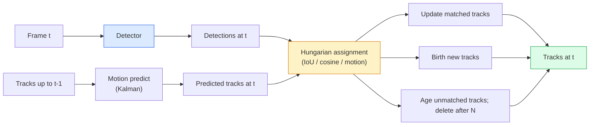

# 다중 객체 추적과 비디오 메모리

> 추적은 검출에 연결을 더한 것이다. 모든 프레임에서 검출하고, 이번 프레임의 검출 결과를 ID 기준으로 이전 프레임의 트랙과 매칭한다.

**Type:** Build
**Languages:** Python
**Prerequisites:** Phase 4 Lesson 06 (YOLO Detection), Phase 4 Lesson 08 (Mask R-CNN), Phase 4 Lesson 24 (SAM 3)
**Time:** ~60 minutes

## 학습 목표

- tracking-by-detection과 query-based tracking을 구분하고 알고리즘 계열(SORT, DeepSORT, ByteTrack, BoT-SORT, SAM 2 memory tracker, SAM 3.1 Object Multiplex)을 말할 수 있다
- 고전적인 tracking-by-detection을 위해 IoU + Hungarian assignment를 처음부터 구현한다
- SAM 2의 memory bank와 그것이 IoU 기반 association보다 occlusion을 더 잘 처리하는 이유를 설명한다
- 세 가지 추적 지표(MOTA, IDF1, HOTA)를 읽고 주어진 사용 사례에서 어떤 지표가 중요한지 고른다

## 문제

검출기는 한 프레임 안에서 객체가 어디 있는지 알려준다. 추적기는 프레임 `t`의 어떤 검출 결과가 프레임 `t-1`의 검출 결과와 같은 객체인지 알려준다. 이것이 없으면 선을 넘는 객체 수를 셀 수 없고, occlusion을 통과하는 공을 따라갈 수 없으며, "자동차 #4가 차선에 8초 동안 있었다"는 사실도 알 수 없다.

추적은 스포츠 분석, 감시, 자율주행, 의료 비디오 분석, 야생동물 모니터링, 워드마크 카운팅처럼 비디오를 다루는 모든 제품에 필수다. 핵심 구성 요소는 공유된다. 프레임별 검출기, motion model(Kalman filter 또는 더 풍부한 모델), association 단계(IoU / cosine / 학습된 feature 위의 Hungarian algorithm), track lifecycle(birth, update, death)이다.

2026년에는 두 가지 새로운 패턴이 등장했다. **SAM 2 memory-based tracking**(motion-model association 대신 feature-memory)과 **SAM 3.1 Object Multiplex**(같은 concept의 여러 instance가 공유 memory를 사용)이다. 이 수업은 고전적인 스택을 먼저 다룬 뒤 memory-based 접근으로 넘어간다.

## 개념

### Tracking-by-detection



2026년에 마주칠 거의 모든 tracker는 이 루프의 변형이다. 차이는 다음과 같다.

- **SORT** (2016): Kalman filter + IoU Hungarian. 단순하고 빠르며 appearance model이 없다.
- **DeepSORT** (2017): SORT + track마다 CNN 기반 appearance feature(ReID embedding). 교차 상황을 더 잘 처리한다.
- **ByteTrack** (2021): low-confidence detection을 두 번째 단계에서 association한다. appearance feature가 필요 없지만 MOT17에서 상위 성능을 낸다.
- **BoT-SORT** (2022): Byte + camera motion compensation + ReID.
- **StrongSORT / OC-SORT** — motion과 appearance가 개선된 ByteTrack 계열이다.

### Kalman filter를 한 문단으로

Kalman filter는 track마다 covariance와 함께 `(x, y, w, h, dx, dy, dw, dh)` 상태를 유지한다. 각 프레임에서 constant-velocity model로 상태를 **predict**한 뒤, 매칭된 detection으로 **update**한다. predict uncertainty가 높을수록 update는 detection을 더 신뢰한다. 이 방식은 부드러운 trajectory와 짧은 occlusion(1-5프레임)을 통과해 track을 이어갈 수 있는 능력을 제공한다.

모든 고전적 tracker는 motion-prediction 단계에서 Kalman filter를 사용한다.

### Hungarian algorithm

`M x N` cost matrix(tracks x detections)가 주어졌을 때, total cost를 최소화하는 일대일 assignment를 찾는다. Cost는 보통 `1 - IoU(track_bbox, detection_bbox)` 또는 appearance feature의 음의 cosine similarity다. Runtime은 O((M+N)^3)이고, M, N이 ~1000 이하라면 `scipy.optimize.linear_sum_assignment`를 통해 Python에서도 충분히 빠르다.

### ByteTrack의 핵심 아이디어

표준 tracker는 low-confidence detection(< 0.5)을 버린다. ByteTrack은 이것들을 **second-stage candidates**로 남겨 둔다. track을 high-confidence detection과 매칭한 뒤, 매칭되지 않은 track이 조금 더 느슨한 IoU threshold로 low-confidence detection과 매칭을 시도한다. 짧은 occlusion과 군중 근처의 ID switch를 회복한다.

### SAM 2 memory-based tracking

SAM 2는 instance별 spatio-temporal feature의 **memory bank**를 유지해 비디오를 처리한다. 한 프레임에서 prompt(click, box, text)가 주어지면 instance를 memory에 encode한다. 이후 프레임에서는 memory가 새 프레임의 feature와 cross-attention되고, decoder가 새 프레임에서 같은 instance의 mask를 만든다.

Kalman filter도, Hungarian assignment도 없다. Association은 memory-attention 연산 안에 암묵적으로 들어 있다.

장점:
- 긴 occlusion에 강하다(memory가 여러 프레임 동안 instance identity를 운반한다).
- SAM 3의 text prompt와 결합하면 open-vocabulary가 된다.
- 별도의 motion model 없이 작동한다.

단점:
- many-object tracking에서는 ByteTrack보다 느리다.
- Memory bank가 커지며 context window에 한계가 생긴다.

### SAM 3.1 Object Multiplex

이전의 SAM 2 / SAM 3 tracking은 instance마다 별도의 memory bank를 유지한다. 객체 50개라면 memory bank도 50개다. Object Multiplex(2026년 3월)는 이것을 **per-instance query tokens**가 있는 하나의 공유 memory로 접는다. 비용은 instance 수에 대해 sub-linear하게 증가한다.

Multiplex는 2026년 crowd tracking의 새로운 기본값이다. 콘서트 관중, 창고 작업자, 교차로 교통에 적합하다.

### 알아야 할 세 가지 지표

- **MOTA (Multi-Object Tracking Accuracy)** — 1 - (FN + FP + ID switches) / GT. 오류 유형에 가중되어 있고 detection 실패와 association 실패를 하나로 섞는 단일 지표다.
- **IDF1 (ID F1)** — ID precision과 recall의 harmonic mean. 각 ground-truth track이 시간에 걸쳐 ID를 얼마나 잘 유지하는지에 집중한다. ID switch에 민감한 작업에는 MOTA보다 낫다.
- **HOTA (Higher Order Tracking Accuracy)** — detection accuracy(DetA)와 association accuracy(AssA)로 분해한다. 2020년 이후 커뮤니티 표준이며 가장 포괄적이다.

감시(누가 누구인가)라면 IDF1을 보고한다. 스포츠 분석(패스 카운팅)이라면 HOTA다. 일반적인 학술 비교라면 HOTA다.

## 직접 만들기

### Step 1: IoU 기반 cost matrix

```python
import numpy as np


def bbox_iou(a, b):
    """
    a, b: (N, 4) arrays of [x1, y1, x2, y2].
    Returns (N_a, N_b) IoU matrix.
    """
    ax1, ay1, ax2, ay2 = a[:, 0], a[:, 1], a[:, 2], a[:, 3]
    bx1, by1, bx2, by2 = b[:, 0], b[:, 1], b[:, 2], b[:, 3]
    inter_x1 = np.maximum(ax1[:, None], bx1[None, :])
    inter_y1 = np.maximum(ay1[:, None], by1[None, :])
    inter_x2 = np.minimum(ax2[:, None], bx2[None, :])
    inter_y2 = np.minimum(ay2[:, None], by2[None, :])
    inter = np.clip(inter_x2 - inter_x1, 0, None) * np.clip(inter_y2 - inter_y1, 0, None)
    area_a = (ax2 - ax1) * (ay2 - ay1)
    area_b = (bx2 - bx1) * (by2 - by1)
    union = area_a[:, None] + area_b[None, :] - inter
    return inter / np.clip(union, 1e-8, None)
```

### Step 2: 최소 SORT 스타일 tracker

간결함을 위해 고정 constant-velocity Kalman은 생략했다. 여기서는 단순한 IoU association을 사용한다. 실제 운영 환경에서는 Kalman predict가 필수다. `sort` Python package가 완전한 버전을 제공한다.

```python
from scipy.optimize import linear_sum_assignment


class Track:
    def __init__(self, tid, bbox, frame):
        self.id = tid
        self.bbox = bbox
        self.last_frame = frame
        self.hits = 1

    def update(self, bbox, frame):
        self.bbox = bbox
        self.last_frame = frame
        self.hits += 1


class SimpleTracker:
    def __init__(self, iou_threshold=0.3, max_age=5):
        self.tracks = []
        self.next_id = 1
        self.iou_threshold = iou_threshold
        self.max_age = max_age

    def step(self, detections, frame):
        if not self.tracks:
            for d in detections:
                self.tracks.append(Track(self.next_id, d, frame))
                self.next_id += 1
            return [(t.id, t.bbox) for t in self.tracks]

        track_boxes = np.array([t.bbox for t in self.tracks])
        det_boxes = np.array(detections) if len(detections) else np.empty((0, 4))

        iou = bbox_iou(track_boxes, det_boxes) if len(det_boxes) else np.zeros((len(track_boxes), 0))
        cost = 1 - iou
        cost[iou < self.iou_threshold] = 1e6

        matched_track = set()
        matched_det = set()
        if cost.size > 0:
            row, col = linear_sum_assignment(cost)
            for r, c in zip(row, col):
                if cost[r, c] < 1.0:
                    self.tracks[r].update(det_boxes[c], frame)
                    matched_track.add(r); matched_det.add(c)

        for i, d in enumerate(det_boxes):
            if i not in matched_det:
                self.tracks.append(Track(self.next_id, d, frame))
                self.next_id += 1

        self.tracks = [t for t in self.tracks if frame - t.last_frame <= self.max_age]
        return [(t.id, t.bbox) for t in self.tracks]
```

60줄이다. 프레임별 detection을 받아 프레임별 track ID를 반환한다. 실제 시스템은 Kalman predict, ByteTrack의 second-stage re-match, appearance feature를 추가한다.

### Step 3: Synthetic trajectory test

```python
def synthetic_frames(num_frames=20, num_objects=3, H=240, W=320, seed=0):
    rng = np.random.default_rng(seed)
    starts = rng.uniform(20, 200, size=(num_objects, 2))
    velocities = rng.uniform(-5, 5, size=(num_objects, 2))
    frames = []
    for f in range(num_frames):
        dets = []
        for i in range(num_objects):
            cx, cy = starts[i] + f * velocities[i]
            dets.append([cx - 10, cy - 10, cx + 10, cy + 10])
        frames.append(dets)
    return frames


tracker = SimpleTracker()
for f, dets in enumerate(synthetic_frames()):
    tracks = tracker.step(dets, f)
```

직선으로 움직이는 세 객체는 20프레임 전체에서 ID를 유지해야 한다.

### Step 4: ID-switch metric

```python
def count_id_switches(tracks_per_frame, gt_per_frame):
    """
    tracks_per_frame:  list of list of (track_id, bbox)
    gt_per_frame:      list of list of (gt_id, bbox)
    Returns number of ID switches.
    """
    prev_assignment = {}
    switches = 0
    for tracks, gts in zip(tracks_per_frame, gt_per_frame):
        if not tracks or not gts:
            continue
        t_boxes = np.array([b for _, b in tracks])
        g_boxes = np.array([b for _, b in gts])
        iou = bbox_iou(g_boxes, t_boxes)
        for g_idx, (gt_id, _) in enumerate(gts):
            j = iou[g_idx].argmax()
            if iou[g_idx, j] > 0.5:
                t_id = tracks[j][0]
                if gt_id in prev_assignment and prev_assignment[gt_id] != t_id:
                    switches += 1
                prev_assignment[gt_id] = t_id
    return switches
```

이는 단순화된 IDF1 인접 지표다. ground-truth 객체에 할당된 predicted track ID가 몇 번 바뀌는지 센다. 실제 MOTA / IDF1 / HOTA 도구는 `py-motmetrics`와 `TrackEval`에 있다.

## 사용하기

2026년 운영 tracker:

- `ultralytics` — YOLOv8 + ByteTrack / BoT-SORT 내장. `results = model.track(source, tracker="bytetrack.yaml")`. 기본 선택지다.
- `supervision` (Roboflow) — ByteTrack wrapper와 annotation utility.
- SAM 2 / SAM 3.1 — `processor.track()`을 통한 memory-based tracking.
- Custom stack: detector(YOLOv8 / RT-DETR) + `sort-tracker` / `OC-SORT` / `StrongSORT`.

선택 기준:

- 30+ fps의 보행자 / 자동차 / 박스: **ByteTrack with ultralytics**.
- 군중 안의 한 class에 속한 많은 instance: **SAM 3.1 Object Multiplex**.
- 식별 가능한 appearance가 있는 심한 occlusion: **DeepSORT / StrongSORT**(ReID features).
- 스포츠 / 복잡한 상호작용: **BoT-SORT** 또는 learned trackers(MOTRv3).

## 출시하기

이 수업의 산출물:

- `outputs/prompt-tracker-picker.md` — scene type, occlusion pattern, latency budget이 주어졌을 때 SORT / ByteTrack / BoT-SORT / SAM 2 / SAM 3.1을 고른다.
- `outputs/skill-mot-evaluator.md` — ground-truth track에 대해 MOTA / IDF1 / HOTA를 계산하는 완전한 evaluation harness를 작성한다.

## 연습 문제

1. **(Easy)** 위 synthetic tracker를 객체 3개, 10개, 30개로 실행하라. 각 경우의 ID-switch count를 보고하라. 단순 IoU-only association이 어디서 실패하기 시작하는지 확인하라.
2. **(Medium)** Association 전에 constant-velocity Kalman predict 단계를 추가하라. 짧은(2-3프레임) occlusion이 더 이상 ID switch를 만들지 않음을 보이라.
3. **(Hard)** `transformers`를 통해 SAM 2의 memory-based tracker를 대체 tracker backend로 통합하라. SimpleTracker와 SAM 2를 모두 30초짜리 군중 clip에 실행하고, 눈에 띄는 사람 5명의 ground-truth ID를 수동 label해 ID-switch count를 비교하라.

## 핵심 용어

| Term | 사람들이 말하는 표현 | 실제 의미 |
|------|----------------|----------------------|
| Tracking-by-detection | "Detect then associate" | 프레임별 detector + IoU / appearance 위의 Hungarian assignment |
| Kalman filter | "Motion predict" | 부드러운 track prediction과 occlusion 처리를 위한 linear dynamics + covariance |
| Hungarian algorithm | "Optimal assignment" | minimum-cost bipartite matching problem을 푼다. `scipy.optimize.linear_sum_assignment` |
| ByteTrack | "Low-confidence second pass" | 짧은 occlusion을 회복하기 위해 unmatched track을 low-confidence detection과 다시 매칭한다 |
| DeepSORT | "SORT + appearance" | 프레임 간 매칭을 위한 ReID feature를 추가한다. ID preservation에 더 좋다 |
| Memory bank | "SAM 2 trick" | 프레임에 걸쳐 저장되는 instance별 spatio-temporal feature. cross-attention이 explicit association을 대체한다 |
| Object Multiplex | "SAM 3.1 shared memory" | 빠른 many-object tracking을 위한 per-instance query가 있는 단일 shared memory |
| HOTA | "Modern tracking metric" | detection accuracy와 association accuracy로 분해한다. 커뮤니티 표준 |

## 더 읽을거리

- [SORT (Bewley et al., 2016)](https://arxiv.org/abs/1602.00763) — 최소 tracking-by-detection 논문
- [DeepSORT (Wojke et al., 2017)](https://arxiv.org/abs/1703.07402) — appearance feature를 추가한다
- [ByteTrack (Zhang et al., 2022)](https://arxiv.org/abs/2110.06864) — low-confidence second pass
- [BoT-SORT (Aharon et al., 2022)](https://arxiv.org/abs/2206.14651) — camera motion compensation
- [HOTA (Luiten et al., 2020)](https://arxiv.org/abs/2009.07736) — 분해된 tracking metric
- [SAM 2 video segmentation (Meta, 2024)](https://ai.meta.com/sam2/) — memory-based tracker
- [SAM 3.1 Object Multiplex (Meta, March 2026)](https://ai.meta.com/blog/segment-anything-model-3/)
