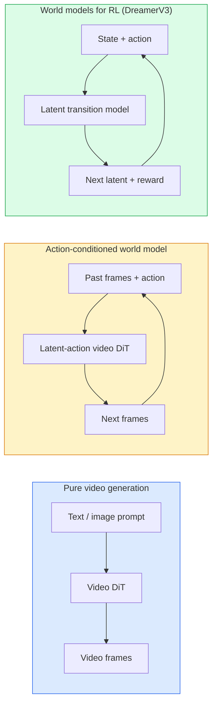

# 월드 모델과 비디오 디퓨전

> 장면의 다음 몇 초를 예측하는 video model은 world simulator다. 그 예측을 action으로 condition하면 학습된 game engine이 된다.

**Type:** Learn + Build
**Languages:** Python
**Prerequisites:** Phase 4 Lesson 10 (Diffusion), Phase 4 Lesson 12 (Video Understanding), Phase 4 Lesson 23 (DiT + Rectified Flow)
**Time:** ~75 minutes

## 학습 목표

- 순수 video generation model(Sora 2)과 action-conditioned world model(Genie 3, DreamerV3)의 차이를 설명한다
- Video DiT를 설명한다. spatio-temporal patch, 3D position encoding, `(T, H, W)` token 전체의 joint attention
- World model이 robotics에 연결되는 흐름을 추적한다. VLM plans -> video model simulates -> inverse dynamics emits actions
- 주어진 사용 사례(creative video, interactive sim, autonomous-driving synthesis)에 대해 Sora 2, Genie 3, Runway GWM-1 Worlds, Wan-Video, HunyuanVideo 중에서 선택한다

## 문제

Video generation과 world modelling은 2026년에 수렴했다. 일관된 1분 분량의 video를 생성할 수 있는 model은 어떤 의미에서는 세계가 움직이는 방식을 배운 것이다. Object permanence, gravity, causality, style이 포함된다. 그 예측을 action(walk left, open the door)으로 condition하면 video model은 game engine, driving simulator, robotics environment를 대체할 수 있는 learnable simulator가 된다.

중요성은 구체적이다. Genie 3는 단일 image에서 playable environment를 생성한다. Runway GWM-1 Worlds는 무한히 탐험 가능한 scene을 합성한다. Sora 2는 synchronised audio와 modeled physics가 있는 minute-long video를 만든다. NVIDIA Cosmos-Drive, Wayve Gaia-2, Tesla DrivingWorld는 autonomous-vehicle training data를 위한 현실적인 driving video를 생성한다. World-model paradigm은 robotics의 sim-to-real을 조용히 장악하고 있다.

이 수업은 Phase 4의 "big picture" 수업이다. Image generation, video understanding, agentic reasoning을 지배적인 연구가 향하는 architecture pattern으로 연결한다.

## 개념

### World-modelling의 세 계열



- **Sora 2**는 prompt로 condition되는 순수 video generation이다. Action interface가 없다. Rollout 중간에 "steer"할 수 없다.
- **Genie 3**, **GWM-1 Worlds**, **Mirage / Magica**는 action-conditioned world model이다. 관찰된 video에서 latent action을 추론한 다음, action으로 future frame prediction을 condition한다. Interactive하다. 사용자가 key를 누르거나 camera를 움직이면 scene이 반응한다.
- **DreamerV3**와 고전적인 RL world-model 계열은 명시적인 action conditioning이 있는 latent space에서 예측하고 reward signal로 학습된다. 시각적으로 덜 풍부하지만 sample-efficient RL에는 더 유용하다.

### Video DiT architecture

```text
Video latent:          (C, T, H, W)
Patchify (spatial):    grid of P_h x P_w patches per frame
Patchify (temporal):   group P_t frames into a temporal patch
Resulting tokens:      (T / P_t) * (H / P_h) * (W / P_w) tokens
```

Positional encoding은 3D다. `(t, h, w)` coordinate마다 rotary 또는 learned embedding이 있다. Attention은 다음 중 하나일 수 있다.

- **Full joint** — 모든 token이 모든 token에 attend한다. N개의 token에 대해 O(N^2)이다. 긴 video에는 너무 비싸다.
- **Divided** — temporal attention(같은 spatial position, 시간 방향: `(H*W) * T^2`)과 spatial attention(같은 timestep, 공간 방향: `T * (H*W)^2`)을 번갈아 수행한다. TimeSformer와 대부분의 video DiT가 사용한다.
- **Window** — `(t, h, w)`의 local window. Video Swin이 사용한다.

2026년의 모든 video diffusion model은 이 세 패턴 중 하나에 AdaLN conditioning(Lesson 23)과 rectified flow를 더해 사용한다.

### Action으로 condition하기: latent action models

Genie는 연속한 두 frame 사이의 action을 discriminatively 예측해 frame마다 **latent action**을 학습한다. 이후 model의 decoder는 명시적인 keyboard key가 아니라 추론된 latent action으로 condition된다. Inference에서 사용자는 latent action을 지정하거나 새로운 prior에서 sample할 수 있고, model은 그 action과 일관되는 next frame을 생성한다.

Sora는 action interface를 완전히 건너뛴다. Decoder는 과거 spacetime token에서 다음 spacetime token을 예측한다. Prompt가 시작을 condition하고, generation 중간에는 아무것도 조종하지 않는다.

### Physical plausibility

Sora 2의 2026 release는 **physical plausibility**를 명시적으로 내세웠다. Weight, balance, object permanence, cause-and-effect가 포함된다. Team은 hand-rated plausibility score로 측정했고, Sora 1과 비교해 dropped objects, characters colliding, failures-on-purpose(a missed jump)에서 눈에 띄게 개선되었다.

Plausibility는 여전히 지배적인 failure mode다. 2024-2025년의 사람이 spaghetti를 먹거나 glass로 마시는 video는 model에 persistent object representation이 부족함을 드러냈다. 2026년 model(Sora 2, Runway Gen-5, HunyuanVideo)은 이를 줄였지만 없애지는 못했다.

### Autonomous driving world models

Driving world model은 trajectory, bounding box, navigation map으로 condition된 현실적인 road scene을 생성한다. 사용 방식:

- **Cosmos-Drive-Dreams** (NVIDIA) — RL training용 driving video를 분 단위로 생성한다.
- **Gaia-2** (Wayve) — policy evaluation을 위한 trajectory-conditioned scene synthesis.
- **DrivingWorld** (Tesla) — 다양한 weather, time-of-day, traffic condition을 simulate한다.
- **Vista** (ByteDance) — reactive driving scene synthesis.

이들은 corner case를 위해 비싼 real-world data collection을 대체한다. 야간 무단횡단 보행자, icy intersection, unusual vehicle type처럼 원래라면 수백만 mile의 주행이 필요한 사례들이다.

### Robotics stack: VLM + video model + inverse dynamics

떠오르는 세 구성 요소 robotics loop:

1. **VLM**이 goal("pick up the red cup")을 parse하고 high-level action sequence를 계획한다.
2. **Video generation model**이 각 action을 실행하면 어떤 모습일지 simulate한다. 즉 N frame 앞의 observation을 예측한다.
3. **Inverse dynamics model**이 그 observation을 만들 concrete motor command를 추출한다.

이는 reward shaping과 sample-heavy RL을 대체한다. World model이 상상하고, inverse dynamics가 actuation의 loop를 닫는다. Genie Envisioner가 하나의 구현이고, 많은 연구 그룹이 이 구조로 수렴하고 있다.

### 평가

- **Visual quality** — FVD(Fréchet Video Distance), user study.
- **Prompt alignment** — frame별 CLIPScore, VQA-style evaluation.
- **Physical plausibility** — benchmark suite에서 hand-rated(Sora 2의 internal benchmark, VBench).
- **Controllability**(interactive world model용) — action -> observation consistency. 이전 state로 돌아갈 수 있는가?

### 2026년 model landscape

| Model | Use | Parameters | Output | License |
|-------|-----|------------|--------|---------|
| Sora 2 | text-to-video, audio | — | 1-min 1080p + audio | API only |
| Runway Gen-5 | text/image-to-video | — | 10s clips | API |
| Runway GWM-1 Worlds | interactive world | — | infinite 3D rollout | API |
| Genie 3 | interactive world from image | 11B+ | playable frames | research preview |
| Wan-Video 2.1 | open text-to-video | 14B | high-quality clips | non-commercial |
| HunyuanVideo | open text-to-video | 13B | 10s clips | permissive |
| Cosmos / Cosmos-Drive | autonomous driving sim | 7-14B | driving scenes | NVIDIA open |
| Magica / Mirage 2 | AI-native game engine | — | modifiable worlds | product |

## 직접 만들기

### Step 1: Video용 3D patchify

```python
import torch
import torch.nn as nn


class VideoPatch3D(nn.Module):
    def __init__(self, in_channels=4, dim=64, patch_t=2, patch_h=2, patch_w=2):
        super().__init__()
        self.proj = nn.Conv3d(
            in_channels, dim,
            kernel_size=(patch_t, patch_h, patch_w),
            stride=(patch_t, patch_h, patch_w),
        )
        self.patch_t = patch_t
        self.patch_h = patch_h
        self.patch_w = patch_w

    def forward(self, x):
        # x: (N, C, T, H, W)
        x = self.proj(x)
        n, c, t, h, w = x.shape
        tokens = x.reshape(n, c, t * h * w).transpose(1, 2)
        return tokens, (t, h, w)
```

Kernel과 같은 stride를 가진 3D conv는 spatio-temporal patchifier처럼 작동한다. `(T, H, W) -> (T/2, H/2, W/2)` token grid를 만든다.

### Step 2: 3D rotary position encoding

Rotary Position Embeddings(RoPE)를 `t`, `h`, `w` axis에 따로 적용한다.

```python
def rope_3d(tokens, t_dim, h_dim, w_dim, grid):
    """
    tokens: (N, T*H*W, D)
    grid: (T, H, W) sizes
    t_dim + h_dim + w_dim == D
    """
    T, H, W = grid
    n, seq, d = tokens.shape
    if t_dim + h_dim + w_dim != d:
        raise ValueError(f"t_dim+h_dim+w_dim ({t_dim}+{h_dim}+{w_dim}) must equal D={d}")
    assert seq == T * H * W
    t_idx = torch.arange(T, device=tokens.device).repeat_interleave(H * W)
    h_idx = torch.arange(H, device=tokens.device).repeat_interleave(W).repeat(T)
    w_idx = torch.arange(W, device=tokens.device).repeat(T * H)
    # Simplified: just scale channels by frequencies. Real RoPE rotates pairs.
    freqs_t = torch.exp(-torch.log(torch.tensor(10000.0)) * torch.arange(t_dim // 2, device=tokens.device) / (t_dim // 2))
    freqs_h = torch.exp(-torch.log(torch.tensor(10000.0)) * torch.arange(h_dim // 2, device=tokens.device) / (h_dim // 2))
    freqs_w = torch.exp(-torch.log(torch.tensor(10000.0)) * torch.arange(w_dim // 2, device=tokens.device) / (w_dim // 2))
    emb_t = torch.cat([torch.sin(t_idx[:, None] * freqs_t), torch.cos(t_idx[:, None] * freqs_t)], dim=-1)
    emb_h = torch.cat([torch.sin(h_idx[:, None] * freqs_h), torch.cos(h_idx[:, None] * freqs_h)], dim=-1)
    emb_w = torch.cat([torch.sin(w_idx[:, None] * freqs_w), torch.cos(w_idx[:, None] * freqs_w)], dim=-1)
    return tokens + torch.cat([emb_t, emb_h, emb_w], dim=-1)
```

단순화된 additive form이다. 실제 RoPE는 paired channel을 주파수별로 rotate한다. Positional information은 같다.

### Step 3: Divided attention block

```python
class DividedAttentionBlock(nn.Module):
    def __init__(self, dim=64, heads=2):
        super().__init__()
        self.time_attn = nn.MultiheadAttention(dim, heads, batch_first=True)
        self.space_attn = nn.MultiheadAttention(dim, heads, batch_first=True)
        self.ln1 = nn.LayerNorm(dim)
        self.ln2 = nn.LayerNorm(dim)
        self.ln3 = nn.LayerNorm(dim)
        self.mlp = nn.Sequential(nn.Linear(dim, 4 * dim), nn.GELU(), nn.Linear(4 * dim, dim))

    def forward(self, x, grid):
        T, H, W = grid
        n, seq, d = x.shape
        # time attention: same (h, w), across t
        xt = x.view(n, T, H * W, d).permute(0, 2, 1, 3).reshape(n * H * W, T, d)
        a, _ = self.time_attn(self.ln1(xt), self.ln1(xt), self.ln1(xt), need_weights=False)
        xt = (xt + a).reshape(n, H * W, T, d).permute(0, 2, 1, 3).reshape(n, seq, d)
        # space attention: same t, across (h, w)
        xs = xt.view(n, T, H * W, d).reshape(n * T, H * W, d)
        a, _ = self.space_attn(self.ln2(xs), self.ln2(xs), self.ln2(xs), need_weights=False)
        xs = (xs + a).reshape(n, T, H * W, d).reshape(n, seq, d)
        xs = xs + self.mlp(self.ln3(xs))
        return xs
```

Time attention은 각 spatial position 안에서 시간 방향으로 attend한다. Space attention은 각 frame 안에서 position 방향으로 attend한다. 하나의 O((THW)^2) 연산 대신 두 개의 O(T^2 + (HW)^2) 연산을 수행한다. 이것이 TimeSformer와 모든 현대 video DiT의 핵심이다.

### Step 4: Tiny video DiT 조립하기

```python
class TinyVideoDiT(nn.Module):
    def __init__(self, in_channels=4, dim=64, depth=2, heads=2):
        super().__init__()
        self.patch = VideoPatch3D(in_channels=in_channels, dim=dim, patch_t=2, patch_h=2, patch_w=2)
        self.blocks = nn.ModuleList([DividedAttentionBlock(dim, heads) for _ in range(depth)])
        self.out = nn.Linear(dim, in_channels * 2 * 2 * 2)

    def forward(self, x):
        tokens, grid = self.patch(x)
        for blk in self.blocks:
            tokens = blk(tokens, grid)
        return self.out(tokens), grid
```

작동하는 video generator가 아니라, 모든 조각의 shape가 맞는지 보여 주는 structural demo다.

### Step 5: Shape 확인하기

```python
vid = torch.randn(1, 4, 8, 16, 16)  # (N, C, T, H, W)
model = TinyVideoDiT()
out, grid = model(vid)
print(f"input  {tuple(vid.shape)}")
print(f"tokens grid {grid}")
print(f"output {tuple(out.shape)}")
```

Patching 후 `grid = (4, 8, 8)`, `out = (1, 256, 32)`가 예상된다. Head는 per-token spatio-temporal patch로 project하고, 이는 다시 video로 un-patchify할 준비가 된 상태다.

## 사용하기

2026년 운영 접근 패턴:

- **Sora 2 API** (OpenAI) — text-to-video, synchronized audio. Premium pricing.
- **Runway Gen-5 / GWM-1** (Runway) — image-to-video, interactive worlds.
- **Wan-Video 2.1 / HunyuanVideo** — open-source self-host.
- **Cosmos / Cosmos-Drive** (NVIDIA) — driving simulation open weights.
- **Genie 3** — research preview, access request 필요.

Interactive world-model demo를 만든다면 quality를 위해 Wan-Video로 시작하고, interactivity를 위해 latent-action adapter를 얹는다. Autonomous driving simulation이라면 Cosmos-Drive가 2026년의 open reference다.

실전 robotics stack:

1. Language goal -> VLM(Qwen3-VL) -> high-level plan.
2. Plan -> latent-action video model -> imagined rollout.
3. Rollout -> inverse dynamics model -> low-level actions.
4. Actions executed -> observation fed back into step 1.

## 출시하기

이 수업의 산출물:

- `outputs/prompt-video-model-picker.md` — task, license, latency가 주어졌을 때 Sora 2 / Runway / Wan / HunyuanVideo / Cosmos 중에서 고른다.
- `outputs/skill-physical-plausibility-checks.md` — 생성된 video를 출시하기 전에 실행할 automated check(object permanence, gravity, continuity)를 정의하는 skill.

## 연습 문제

1. **(Easy)** patch-t=2, patch-h=8, patch-w=8일 때 5초짜리 360p video의 token count를 계산하라. 이 크기에서 attention memory를 추론하라.
2. **(Medium)** 위의 divided attention block을 full joint attention block으로 바꾸고 shape와 parameter count를 측정하라. 실제 video model에 divided attention이 필요한 이유를 설명하라.
3. **(Hard)** 최소 latent-action video model을 만들어라. (frame_t, action_t, frame_{t+1}) triple dataset(간단한 2D game이면 무엇이든)을 가져와 action embedding으로 condition된 tiny video DiT를 학습하고, 서로 다른 action이 서로 다른 next frame을 만든다는 것을 보이라.

## 핵심 용어

| Term | 사람들이 말하는 표현 | 실제 의미 |
|------|----------------|----------------------|
| World model | "Learned simulator" | state와 action이 주어졌을 때 future observation을 예측하는 model |
| Video DiT | "Spacetime transformer" | 3D patchification과 divided attention을 가진 diffusion transformer |
| Latent action | "Inferred control" | frame pair에서 추론된 discrete 또는 continuous action latent. next-frame generation을 condition하는 데 사용된다 |
| Divided attention | "Time then space" | O(N^2)를 다룰 수 있게 유지하기 위해 block마다 두 attention operation을 수행한다. 먼저 시간 방향, 그다음 공간 방향 |
| Object permanence | "Things stay real" | Video model이 배워야 하는 scene property. 음식, glassware에서 나타나는 고전적 failure mode |
| FVD | "Fréchet Video Distance" | FID의 video equivalent. 주요 visual quality metric |
| Inverse dynamics model | "Observations to actions" | (state, next state)가 주어졌을 때 둘을 연결하는 action을 출력한다. Robotics loop를 닫는다 |
| Cosmos-Drive | "NVIDIA driving sim" | RL과 evaluation을 위한 open-weights autonomous-driving world model |

## 더 읽을거리

- [Sora technical report (OpenAI)](https://openai.com/index/video-generation-models-as-world-simulators/)
- [Genie: Generative Interactive Environments (Bruce et al., 2024)](https://arxiv.org/abs/2402.15391) — latent action world models
- [TimeSformer (Bertasius et al., 2021)](https://arxiv.org/abs/2102.05095) — video transformer를 위한 divided attention
- [DreamerV3 (Hafner et al., 2023)](https://arxiv.org/abs/2301.04104) — RL을 위한 world models
- [Cosmos-Drive-Dreams (NVIDIA, 2025)](https://research.nvidia.com/labs/toronto-ai/cosmos-drive-dreams/) — driving world model
- [Top 10 Video Generation Models 2026 (DataCamp)](https://www.datacamp.com/blog/top-video-generation-models)
- [From Video Generation to World Model — survey repo](https://github.com/ziqihuangg/Awesome-From-Video-Generation-to-World-Model/)
