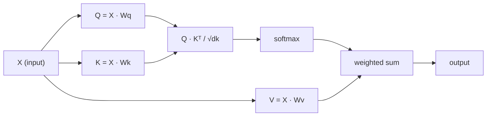

# Self-Attention 처음부터 구현하기

> Attention은 모든 단어가 "나에게 중요한 것은 누구인가?"라고 묻고 그 답을 학습하는 lookup table입니다.

**Type:** Build
**Languages:** Python
**Prerequisites:** Phase 3 (Deep Learning Core), Phase 5 Lesson 10 (Sequence-to-Sequence)
**Time:** ~90 minutes

## 학습 목표

- NumPy만 사용해 scaled dot-product self-attention을 처음부터 구현하고, query/key/value projection과 softmax-weighted sum을 포함합니다.
- Head를 나누고, parallel attention을 계산하고, 결과를 concatenate하는 multi-head attention layer를 만듭니다.
- Attention matrix가 token 관계를 포착하는 방식을 추적하고, `sqrt(d_k)`로 scaling하면 softmax saturation을 막는 이유를 설명합니다.
- Bidirectional attention을 autoregressive(decoder-style) attention으로 바꾸기 위해 causal masking을 적용합니다.

## 문제

RNN은 sequence를 한 번에 한 token씩 처리합니다. token 50에 도달할 때쯤이면 token 1의 정보는 50번의 compression step을 거쳐 눌려 있습니다. Long-range dependency는 fixed-size hidden state라는 bottleneck으로 찌그러지고, LSTM gating을 아무리 써도 완전히 해결되지 않습니다.

2014년 Bahdanau attention 논문은 해결책을 보여 주었습니다. decoder가 모든 encoder position을 다시 보고 현재 step에 중요한 position을 고르게 하자는 것이었습니다. 하지만 여전히 RNN 위에 붙어 있었습니다. 2017년 "Attention Is All You Need" 논문은 더 날카로운 질문을 던졌습니다. attention이 *유일한* mechanism이면 어떨까? Recurrence도 없고 convolution도 없습니다. 오직 attention만 있습니다.

Self-attention은 sequence의 모든 position이 다른 모든 position에 한 번의 parallel step으로 attend하게 합니다. 이것이 transformer를 빠르고, scalable하며, 지배적인 architecture로 만든 이유입니다.

## 개념

### Database lookup 비유

Attention을 soft database lookup으로 생각해 보세요.

```text
Traditional database:
  Query: "capital of France"  -->  exact match  -->  "Paris"

Attention:
  Query: "capital of France"  -->  similarity to ALL keys  -->  weighted blend of ALL values
```

모든 token은 세 vector를 만듭니다.
- **Query (Q)**: "나는 무엇을 찾고 있는가?"
- **Key (K)**: "나는 무엇을 담고 있는가?"
- **Value (V)**: "선택되면 어떤 정보를 제공하는가?"

Query와 모든 key 사이의 dot product가 attention score를 만듭니다. 높은 score는 "이 key가 내 query와 잘 맞는다"는 뜻입니다. 그 score가 value에 weight를 줍니다. 출력은 value들의 weighted sum입니다.

### Q, K, V 계산

각 token embedding은 학습되는 세 weight matrix를 통과해 projection됩니다.

```text
Input embeddings (sequence of n tokens, each d-dimensional):

  X = [x1, x2, x3, ..., xn]       shape: (n, d)

Three weight matrices:

  Wq  shape: (d, dk)
  Wk  shape: (d, dk)
  Wv  shape: (d, dv)

Projections:

  Q = X @ Wq    shape: (n, dk)      each token's query
  K = X @ Wk    shape: (n, dk)      each token's key
  V = X @ Wv    shape: (n, dv)      each token's value
```

Token 하나를 시각화하면 다음과 같습니다.

```text
             Wq
  x_i ------[*]------> q_i    "What am I looking for?"
       |
       |     Wk
       +----[*]------> k_i    "What do I contain?"
       |
       |     Wv
       +----[*]------> v_i    "What do I offer?"
```

### Attention matrix

모든 token에 대한 Q, K, V가 준비되면 attention score가 matrix를 이룹니다.

```text
Scores = Q @ K^T    shape: (n, n)

              k1    k2    k3    k4    k5
        +-----+-----+-----+-----+-----+
   q1   | 2.1 | 0.3 | 0.1 | 0.8 | 0.2 |   <- q1이 각 key에 얼마나 attend하는가
        +-----+-----+-----+-----+-----+
   q2   | 0.4 | 1.9 | 0.7 | 0.1 | 0.3 |
        +-----+-----+-----+-----+-----+
   q3   | 0.2 | 0.6 | 2.3 | 0.5 | 0.1 |
        +-----+-----+-----+-----+-----+
   q4   | 0.9 | 0.1 | 0.4 | 1.7 | 0.6 |
        +-----+-----+-----+-----+-----+
   q5   | 0.1 | 0.3 | 0.2 | 0.5 | 2.0 |
        +-----+-----+-----+-----+-----+

Each row: 전체 sequence에 대한 token 하나의 attention
```

Query 하나가 key들을 훑는 과정을 보세요. 각 row는 모든 token에 score를 매기고, softmax는 score를 weight로 바꾸며, context vector는 value들의 weighted blend가 됩니다.

```figure
attention-matrix
```

### 왜 scaling하는가?

Dot product는 dimension `dk`와 함께 커집니다. `dk = 64`라면 dot product가 수십 단위까지 커질 수 있고, softmax를 gradient가 사라지는 영역으로 밀어 넣습니다. 해결책은 `sqrt(dk)`로 나누는 것입니다.

```text
Scaled scores = (Q @ K^T) / sqrt(dk)
```

이렇게 하면 softmax가 유용한 gradient를 내는 범위 안에 값이 유지됩니다.

### Softmax는 score를 weight로 바꿉니다

Softmax는 raw score를 각 row에 대한 probability distribution으로 바꿉니다.

```text
Raw scores for q1:   [2.1, 0.3, 0.1, 0.8, 0.2]
                            |
                         softmax
                            |
Attention weights:   [0.52, 0.09, 0.07, 0.14, 0.08]   (sums to ~1.0)
```

이제 각 token은 다른 모든 token에 얼마나 attend할지 나타내는 weight set을 갖습니다.

### Value의 weighted sum

각 token의 최종 output은 모든 value vector의 weighted sum입니다.

```text
output_i = sum( attention_weight[i][j] * v_j  for all j )

For token 1:
  output_1 = 0.52 * v1 + 0.09 * v2 + 0.07 * v3 + 0.14 * v4 + 0.08 * v5
```

### 전체 pipeline



한 줄 공식은 다음과 같습니다.

```text
Attention(Q, K, V) = softmax( Q @ K^T / sqrt(dk) ) @ V
```

```figure
softmax-attention-scaling
```

## 직접 만들기

### 1단계: Softmax 처음부터 구현하기

Softmax는 raw logit을 probability로 바꿉니다. Numerical stability를 위해 max를 빼세요.

```python
import numpy as np

def softmax(x):
    shifted = x - np.max(x, axis=-1, keepdims=True)
    exp_x = np.exp(shifted)
    return exp_x / np.sum(exp_x, axis=-1, keepdims=True)

logits = np.array([2.0, 1.0, 0.1])
print(f"logits:  {logits}")
print(f"softmax: {softmax(logits)}")
print(f"sum:     {softmax(logits).sum():.4f}")
```

### 2단계: Scaled dot-product attention

핵심 function입니다. Q, K, V matrix를 받아 attention output과 weight matrix를 반환합니다.

```python
def scaled_dot_product_attention(Q, K, V):
    dk = Q.shape[-1]
    scores = Q @ K.T / np.sqrt(dk)
    weights = softmax(scores)
    output = weights @ V
    return output, weights
```

### 3단계: Learned projection이 있는 self-attention class

Xavier-like scaling으로 initialize한 Wq, Wk, Wv weight matrix를 포함한 완전한 self-attention module입니다.

```python
class SelfAttention:
    def __init__(self, d_model, dk, dv, seed=42):
        rng = np.random.default_rng(seed)
        scale = np.sqrt(2.0 / (d_model + dk))
        self.Wq = rng.normal(0, scale, (d_model, dk))
        self.Wk = rng.normal(0, scale, (d_model, dk))
        scale_v = np.sqrt(2.0 / (d_model + dv))
        self.Wv = rng.normal(0, scale_v, (d_model, dv))
        self.dk = dk

    def forward(self, X):
        Q = X @ self.Wq
        K = X @ self.Wk
        V = X @ self.Wv
        output, weights = scaled_dot_product_attention(Q, K, V)
        return output, weights
```

### 4단계: 문장에서 실행하기

문장에 대한 가짜 embedding을 만들고 attention weight를 관찰합니다.

```python
sentence = ["The", "cat", "sat", "on", "the", "mat"]
n_tokens = len(sentence)
d_model = 8
dk = 4
dv = 4

rng = np.random.default_rng(42)
X = rng.normal(0, 1, (n_tokens, d_model))

attn = SelfAttention(d_model, dk, dv, seed=42)
output, weights = attn.forward(X)

print("Attention weights (each row: where that token looks):\n")
print(f"{'':>6}", end="")
for token in sentence:
    print(f"{token:>6}", end="")
print()

for i, token in enumerate(sentence):
    print(f"{token:>6}", end="")
    for j in range(n_tokens):
        w = weights[i][j]
        print(f"{w:6.3f}", end="")
    print()
```

### 5단계: ASCII heatmap으로 attention 시각화하기

빠르게 시각화하기 위해 attention weight를 문자에 mapping합니다.

```python
def ascii_heatmap(weights, tokens, chars=" ░▒▓█"):
    n = len(tokens)
    print(f"\n{'':>6}", end="")
    for t in tokens:
        print(f"{t:>6}", end="")
    print()

    for i in range(n):
        print(f"{tokens[i]:>6}", end="")
        for j in range(n):
            level = int(weights[i][j] * (len(chars) - 1) / weights.max())
            level = min(level, len(chars) - 1)
            print(f"{'  ' + chars[level] + '   '}", end="")
        print()

ascii_heatmap(weights, sentence)
```

## 활용하기

PyTorch의 `nn.MultiheadAttention`은 우리가 만든 것과 정확히 같은 일을 하며, 여기에 multi-head splitting과 output projection을 더합니다.

```python
import torch
import torch.nn as nn

d_model = 8
n_heads = 2
seq_len = 6

mha = nn.MultiheadAttention(embed_dim=d_model, num_heads=n_heads, batch_first=True)

X_torch = torch.randn(1, seq_len, d_model)

output, attn_weights = mha(X_torch, X_torch, X_torch)

print(f"Input shape:            {X_torch.shape}")
print(f"Output shape:           {output.shape}")
print(f"Attention weight shape: {attn_weights.shape}")
print(f"\nAttn weights (averaged over heads):")
print(attn_weights[0].detach().numpy().round(3))
```

핵심 차이는 multi-head attention이 여러 attention function을 parallel하게 실행한다는 점입니다. 각 function은 `dk = d_model / n_heads` 크기의 자체 Q, K, V projection을 갖고, 결과를 concatenate합니다. 그래서 model이 서로 다른 관계 유형에 동시에 attend할 수 있습니다.

## 산출물

이 lesson이 만드는 산출물:
- `outputs/prompt-attention-explainer.md` - database lookup analogy로 attention을 설명하는 prompt

## 연습문제

1. `scaled_dot_product_attention`이 optional mask matrix를 받도록 수정하세요. 이 matrix는 softmax 전에 특정 position을 negative infinity로 설정합니다. 이것이 causal/decoder masking의 작동 방식입니다.
2. Multi-head attention을 처음부터 구현하세요. Q, K, V를 `n_heads` chunk로 나누고, 각 chunk에서 attention을 실행한 뒤 concatenate하고, 마지막 weight matrix `Wo`를 통과시키세요.
3. 길이가 같은 서로 다른 두 문장을 같은 `SelfAttention` instance에 넣고 attention pattern을 비교하세요. 무엇이 바뀌나요? 무엇이 그대로인가요?

## 핵심 용어

| 용어 | 흔히 하는 말 | 실제 의미 |
|------|----------------|----------------------|
| Query (Q) | "질문 vector" | 이 token이 찾는 정보를 나타내는 input의 learned projection. |
| Key (K) | "Label vector" | 이 token이 담고 있는 정보를 나타내며 query와 match되는 learned projection. |
| Value (V) | "Content vector" | Attention score에 따라 aggregate되는 실제 정보를 담는 learned projection. |
| Scaled dot-product attention | "Attention formula" | `softmax(QK^T / sqrt(dk)) @ V`. Scaling은 high dimension에서 softmax saturation을 막습니다. |
| Self-attention | "Token이 자기 자신과 다른 token을 본다" | Q, K, V가 모두 같은 sequence에서 나와 모든 position이 다른 모든 position에 attend하게 하는 attention. |
| Attention weights | "얼마나 focus하는가" | Scaled dot product에 softmax를 적용해 만든 position에 대한 probability distribution. |
| Multi-head attention | "Parallel attention" | 서로 다른 projection을 가진 여러 attention function을 실행한 뒤 결과를 concatenate해 더 풍부한 representation을 만드는 방식. |

## 더 읽을거리

- [Attention Is All You Need (Vaswani et al., 2017)](https://arxiv.org/abs/1706.03762) - 원래 transformer 논문.
- [The Illustrated Transformer (Jay Alammar)](https://jalammar.github.io/illustrated-transformer/) - 전체 architecture에 대한 가장 좋은 visual walkthrough.
- [The Annotated Transformer (Harvard NLP)](https://nlp.seas.harvard.edu/annotated-transformer/) - 설명이 붙은 line-by-line PyTorch implementation.
