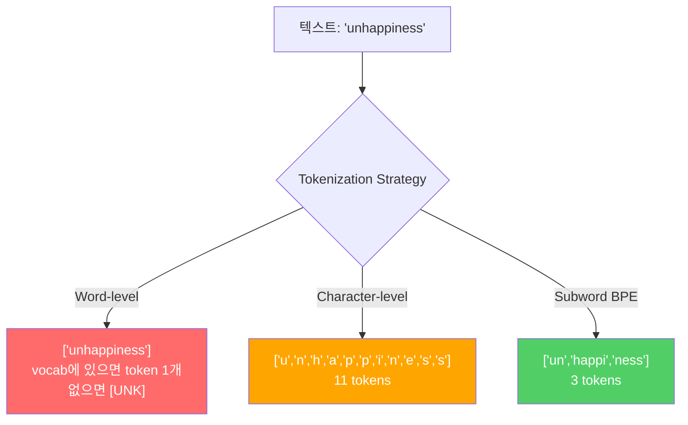
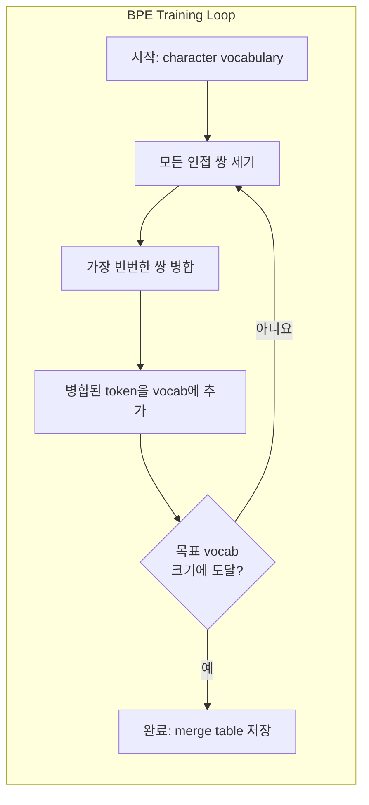
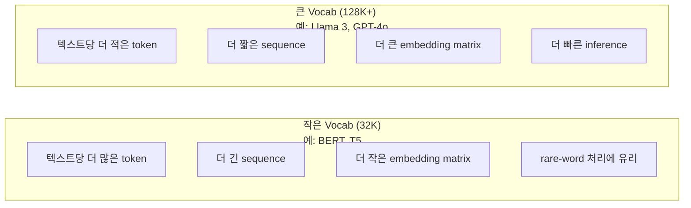

# Tokenizers: BPE, WordPiece, SentencePiece

> LLM은 영어를 읽지 않습니다. 정수를 읽습니다. tokenizer는 그 정수가 의미를 담을지, 아니면 낭비될지를 결정합니다.

**Type:** Build
**Languages:** Python
**Prerequisites:** Phase 05 (NLP Foundations)
**Time:** ~90 minutes

## 학습 목표

- BPE, WordPiece, Unigram tokenization algorithm을 처음부터 구현하고 merge strategy를 비교합니다
- vocabulary 크기가 모델 효율에 미치는 영향을 설명합니다. 너무 작으면 긴 sequence가 생기고, 너무 크면 embedding parameter가 낭비됩니다
- 언어와 코드 전반의 tokenization artifact를 분석하고 특정 tokenizer가 어디서 무너지는지 식별합니다
- tiktoken과 sentencepiece library로 텍스트를 tokenization하고 결과 token ID를 검사합니다

## 문제

LLM은 영어를 읽지 않습니다. 어떤 언어도 읽지 않습니다. 숫자를 읽습니다.

"Hello, world!"와 [15496, 11, 995, 0] 사이의 간극이 tokenizer입니다. 모델이 처리하기 전에 모든 단어, 모든 공백, 모든 구두점은 정수로 변환되어야 합니다. 이 변환은 중립적이지 않습니다. 나중에 되돌릴 수 없는 가정을 모델 안에 굳혀 넣습니다.

이 부분을 잘못하면 모델은 흔한 단어를 여러 token으로 인코딩하느라 capacity를 낭비합니다. "unfortunately"가 하나의 token이 아니라 네 개의 token이 됩니다. multi-syllable 단어가 많은 텍스트에서는 128K context window가 순식간에 75% 줄어든 셈이 됩니다. 제대로 하면 같은 context window에 두 배의 의미를 담을 수 있습니다. "이 모델은 코드를 잘 다룬다"와 "이 모델은 Python에서 막힌다"의 차이는 tokenizer가 어떻게 학습되었는지에서 오는 경우가 많습니다.

GPT-4나 Claude에 보내는 모든 API 호출은 token 단위로 과금됩니다. 모델이 생성하는 모든 token은 compute를 소모합니다. 출력을 표현하는 데 필요한 token이 적을수록 end-to-end inference는 빨라집니다. Tokenization은 preprocessing이 아닙니다. architecture입니다.

## 개념

### 실패한 세 가지 접근과 살아남은 하나

텍스트를 숫자로 바꾸는 명백한 방법은 세 가지입니다. 그중 두 가지는 scale에서 작동하지 않습니다.

**Word-level tokenization**은 공백과 구두점 기준으로 나눕니다. "The cat sat"은 ["The", "cat", "sat"]이 됩니다. 단순합니다. 하지만 "tokenization"은 어떨까요? "GPT-4o"는요? "Geschwindigkeitsbegrenzung" 같은 독일어 복합어는요? word-level은 모든 언어의 모든 단어를 다루기 위해 거대한 vocabulary가 필요합니다. 단어 하나를 놓치면 두려운 `[UNK]` token이 나옵니다. 모델이 "이게 뭔지 전혀 모르겠다"라고 말하는 방식입니다. 영어만 해도 단어형이 백만 개가 넘습니다. 코드, URL, 과학 표기법, 100개 다른 언어까지 더하면 사실상 무한 vocabulary가 필요합니다.

**Character-level tokenization**은 반대 방향으로 갑니다. "hello"는 ["h", "e", "l", "l", "o"]가 됩니다. vocabulary는 매우 작습니다(문자 몇백 개). unknown token도 없습니다. 하지만 sequence가 극도로 길어집니다. word-level token 10개짜리 문장이 character-level token 50개가 됩니다. 모델은 "t", "h", "e"가 함께 "the"를 뜻한다는 것을 배워야 합니다. 사람이 세 살에 배우는 일에 attention capacity를 태우는 셈입니다.

**Subword tokenization**은 절충점을 찾습니다. 흔한 단어는 그대로 유지됩니다. "the"는 token 하나입니다. 드문 단어는 의미 있는 조각으로 분해됩니다. "unhappiness"는 ["un", "happi", "ness"]가 됩니다. vocabulary는 관리 가능한 크기(30K-128K tokens)를 유지합니다. sequence도 짧게 유지됩니다. 어떤 단어든 subword 조각으로 만들 수 있으므로 unknown token은 사실상 사라집니다.

모든 현대 LLM은 subword tokenization을 사용합니다. GPT-2, GPT-4, BERT, Llama 3, Claude 모두 그렇습니다. 문제는 어떤 algorithm을 쓰느냐입니다.



### BPE: Byte Pair Encoding

BPE는 tokenization 용도로 재활용된 greedy compression algorithm입니다. 아이디어는 색인 카드 한 장에 들어갈 만큼 단순합니다.

개별 문자에서 시작합니다. training corpus의 모든 인접 쌍을 셉니다. 가장 빈번한 쌍을 새 token으로 병합합니다. 목표 vocabulary 크기에 도달할 때까지 반복합니다.

```figure
tokenizer-bpe
```

다음은 "lower", "lowest", "newest"라는 단어가 있는 작은 corpus에서 BPE가 실행되는 모습입니다.

```text
Corpus (with word frequencies):
  "lower"  x5
  "lowest" x2
  "newest" x6

Step 0 -- Start with characters:
  l o w e r       (x5)
  l o w e s t     (x2)
  n e w e s t     (x6)

Step 1 -- Count adjacent pairs:
  (e,s): 8    (s,t): 8    (l,o): 7    (o,w): 7
  (w,e): 13   (e,r): 5    (n,e): 6    ...

Step 2 -- Merge most frequent pair (w,e) -> "we":
  l o we r        (x5)
  l o we s t      (x2)
  n e we s t      (x6)

Step 3 -- Recount and merge (e,s) -> "es":
  l o we r        (x5)
  l o we s t      (x2)    <- 'es' only forms from 'e'+'s', not 'we'+'s'
  n e we s t      (x6)    <- wait, the 'e' before 'we' and 's' after 'we'

Actually tracking this precisely:
  After "we" merge, remaining pairs:
  (l,o): 7   (o,we): 7   (we,r): 5   (we,s): 8
  (s,t): 8   (n,e): 6    (e,we): 6

Step 3 -- Merge (we,s) -> "wes" or (s,t) -> "st" (tied at 8, pick first):
  Merge (we,s) -> "wes":
  l o we r        (x5)
  l o wes t       (x2)
  n e wes t       (x6)

Step 4 -- Merge (wes,t) -> "west":
  l o we r        (x5)
  l o west        (x2)
  n e west        (x6)

...continue until target vocab size reached.
```

merge table이 곧 tokenizer입니다. 새 텍스트를 encode하려면 학습된 순서대로 merge를 적용합니다. 어떤 merge가 존재하는지는 training corpus가 결정하며, 그 선택은 모델이 보는 것을 영구적으로 형성합니다.



### Byte-Level BPE (GPT-2, GPT-3, GPT-4)

표준 BPE는 Unicode 문자 위에서 작동합니다. Byte-level BPE는 raw byte(0-255) 위에서 작동합니다. 그래서 정확히 256개의 base vocabulary를 가지며, 어떤 언어나 encoding도 처리하고, unknown token을 만들지 않습니다.

GPT-2가 이 접근을 도입했습니다. base vocabulary는 가능한 모든 byte를 포함합니다. BPE merge는 그 위에 쌓입니다. OpenAI의 tiktoken library는 다음 vocabulary 크기로 byte-level BPE를 구현합니다.

- GPT-2: 50,257 tokens
- GPT-3.5/GPT-4: ~100,256 tokens (cl100k_base encoding)
- GPT-4o: 200,019 tokens (o200k_base encoding)

### WordPiece (BERT)

WordPiece는 BPE와 비슷해 보이지만 merge를 고르는 방식이 다릅니다. raw frequency 대신 training data의 likelihood를 최대화합니다.

```text
BPE merge criterion:      count(A, B)
WordPiece merge criterion: count(AB) / (count(A) * count(B))
```

BPE는 "어떤 쌍이 가장 자주 나타나는가?"를 묻습니다. WordPiece는 "어떤 쌍이 우연히 기대되는 것보다 더 자주 함께 나타나는가?"를 묻습니다. 이 미묘한 차이가 다른 vocabulary를 만듭니다. WordPiece는 단순히 빈번한 것이 아니라 co-occurrence가 의외인 merge를 선호합니다.

WordPiece는 continuation subword에 "##" prefix도 사용합니다.

```text
"unhappiness" -> ["un", "##happi", "##ness"]
"embedding"   -> ["em", "##bed", "##ding"]
```

"##" prefix는 이 조각이 이전 token을 이어간다는 뜻입니다. BERT는 30,522 token vocabulary의 WordPiece를 사용합니다. 모든 BERT 변형이 그런 것은 아닙니다. DistilBERT는 그렇지만, RoBERTa의 tokenizer는 실제로 BPE입니다. BERT 자체는 WordPiece입니다.

### SentencePiece (Llama, T5)

SentencePiece는 입력을 공백을 포함한 raw Unicode 문자 stream으로 다룹니다. pre-tokenization 단계가 없습니다. 단어 경계에 대한 언어별 규칙도 없습니다. 그래서 진정한 language-agnostic 방식입니다. 공백으로 단어를 구분하지 않는 중국어, 일본어, 태국어와 다른 언어에서도 작동합니다.

SentencePiece는 두 algorithm을 지원합니다.
- **BPE mode**: 표준 BPE와 같은 merge logic을 raw character sequence에 적용합니다
- **Unigram mode**: 큰 vocabulary에서 시작해 전체 likelihood에 가장 적게 영향을 주는 token을 반복적으로 제거합니다. BPE의 반대입니다. merge 대신 prune합니다.

Llama 2는 32,000 token vocabulary의 SentencePiece BPE를 사용합니다. T5는 32,000 token의 SentencePiece Unigram을 사용합니다. 참고: Llama 3는 128,256 token의 tiktoken 기반 byte-level BPE tokenizer로 전환했습니다.

### Vocabulary 크기 Tradeoff

이는 측정 가능한 결과가 있는 실제 engineering decision입니다.



구체적인 숫자로 보겠습니다. 4,096차원 embedding을 쓰는 128K vocabulary에서는 embedding matrix만 128,000 x 4,096 = 524 million parameter입니다. 32K vocabulary에서는 131 million parameter입니다. tokenizer 선택만으로 400M parameter 차이가 납니다.

하지만 큰 vocabulary는 텍스트를 더 공격적으로 압축합니다. 32K vocabulary에서 100 token이 필요한 같은 영어 문단이 128K vocabulary에서는 70 token이면 될 수 있습니다. 이는 생성 중 forward pass가 30% 줄어든다는 뜻입니다. 수백만 요청을 serving하는 모델에서는 compute cost가 직접 줄어듭니다.

추세는 분명합니다. vocabulary 크기는 커지고 있습니다. GPT-2는 50,257을 사용했습니다. GPT-4는 약 100K를 사용합니다. Llama 3는 128K를 사용합니다. GPT-4o는 200K를 사용합니다.

| Model | Vocab Size | Tokenizer Type | 영어 단어당 평균 token 수 |
|-------|-----------|----------------|---------------------------|
| BERT | 30,522 | WordPiece | ~1.4 |
| GPT-2 | 50,257 | Byte-level BPE | ~1.3 |
| Llama 2 | 32,000 | SentencePiece BPE | ~1.4 |
| GPT-4 | ~100,256 | Byte-level BPE | ~1.2 |
| Llama 3 | 128,256 | Byte-level BPE (tiktoken) | ~1.1 |
| GPT-4o | 200,019 | Byte-level BPE | ~1.0 |

### Multilingual tax

주로 영어로 학습된 tokenizer는 다른 언어에 가혹합니다. GPT-2 tokenizer에서 한국어 텍스트는 평균적으로 단어당 2-3 token을 사용합니다. 중국어는 더 나쁠 수도 있습니다. 이는 한국어 사용자가 같은 가격을 내면서도 영어 사용자보다 정보 밀도가 낮고, 실질적으로 절반 크기의 context window를 가진다는 뜻입니다.

이것이 Llama 3가 vocabulary를 32K에서 128K로 네 배 늘린 이유입니다. 비영어 문자 체계에 더 많은 token을 할당하면 언어 간 compression이 더 공정해집니다.

```figure
tokenizer-tradeoff
```

## 직접 만들기

### 1단계: Character-level tokenizer

기초부터 시작합니다. character-level tokenizer는 각 문자를 Unicode code point에 mapping합니다. 학습이 필요 없습니다. unknown token도 없습니다. 직접 mapping만 있습니다.

```python
class CharTokenizer:
    def encode(self, text):
        return [ord(c) for c in text]

    def decode(self, tokens):
        return "".join(chr(t) for t in tokens)
```

"hello"는 [104, 101, 108, 108, 111]이 됩니다. 모든 문자가 자기 자신의 token입니다. 이것이 우리가 개선할 baseline입니다.

### Step 2: 처음부터 만드는 BPE Tokenizer

실제 구현입니다. GPT-2처럼 raw byte로 학습하고, pair를 세고, 가장 빈번한 pair를 병합하고, 모든 merge를 순서대로 기록합니다. merge table이 tokenizer입니다.

```python
from collections import Counter

class BPETokenizer:
    def __init__(self):
        self.merges = {}
        self.vocab = {}

    def _get_pairs(self, tokens):
        pairs = Counter()
        for i in range(len(tokens) - 1):
            pairs[(tokens[i], tokens[i + 1])] += 1
        return pairs

    def _merge_pair(self, tokens, pair, new_token):
        merged = []
        i = 0
        while i < len(tokens):
            if i < len(tokens) - 1 and tokens[i] == pair[0] and tokens[i + 1] == pair[1]:
                merged.append(new_token)
                i += 2
            else:
                merged.append(tokens[i])
                i += 1
        return merged

    def train(self, text, num_merges):
        tokens = list(text.encode("utf-8"))
        self.vocab = {i: bytes([i]) for i in range(256)}

        for i in range(num_merges):
            pairs = self._get_pairs(tokens)
            if not pairs:
                break
            best_pair = max(pairs, key=pairs.get)
            new_token = 256 + i
            tokens = self._merge_pair(tokens, best_pair, new_token)
            self.merges[best_pair] = new_token
            self.vocab[new_token] = self.vocab[best_pair[0]] + self.vocab[best_pair[1]]

        return self

    def encode(self, text):
        tokens = list(text.encode("utf-8"))
        for pair, new_token in self.merges.items():
            tokens = self._merge_pair(tokens, pair, new_token)
        return tokens

    def decode(self, tokens):
        byte_sequence = b"".join(self.vocab[t] for t in tokens)
        return byte_sequence.decode("utf-8", errors="replace")
```

training loop가 BPE의 핵심입니다. pair를 세고, 승자를 병합하고, 반복합니다. 각 merge는 전체 token 수를 줄입니다. `num_merges` round 이후 vocabulary는 256(base byte)에서 256 + num_merges로 커집니다.

encoding은 merge를 학습된 정확한 순서로 적용합니다. 이 순서는 중요합니다. merge 1이 "th"를 만들고 merge 5가 "the"를 만들었다면, encoding은 merge 1을 먼저 적용해야 merge 5에서 "th" + "e"로 "the"가 만들어질 수 있습니다.

decoding은 그 반대입니다. vocabulary에서 각 token ID를 찾고, byte를 이어 붙인 뒤 UTF-8로 decode합니다.

### Step 3: Encode와 Decode Roundtrip

```python
corpus = (
    "The cat sat on the mat. The cat ate the rat. "
    "The dog sat on the log. The dog ate the frog. "
    "Natural language processing is the study of how computers "
    "understand and generate human language. "
    "Tokenization is the first step in any NLP pipeline."
)

tokenizer = BPETokenizer()
tokenizer.train(corpus, num_merges=40)

test_sentences = [
    "The cat sat on the mat.",
    "Natural language processing",
    "tokenization pipeline",
    "unhappiness",
]

for sentence in test_sentences:
    encoded = tokenizer.encode(sentence)
    decoded = tokenizer.decode(encoded)
    raw_bytes = len(sentence.encode("utf-8"))
    ratio = len(encoded) / raw_bytes
    print(f"'{sentence}'")
    print(f"  Tokens: {len(encoded)} (from {raw_bytes} bytes) -- ratio: {ratio:.2f}")
    print(f"  Roundtrip: {'PASS' if decoded == sentence else 'FAIL'}")
```

compression ratio는 tokenizer가 얼마나 효과적인지 알려줍니다. ratio 0.50은 tokenizer가 텍스트를 raw byte 수의 절반만큼의 token으로 압축했다는 뜻입니다. 낮을수록 좋습니다. training corpus에서는 ratio가 좋을 것입니다. corpus에 나오지 않는 "unhappiness" 같은 out-of-distribution text에서는 ratio가 나빠집니다. tokenizer가 본 적 없는 pattern에 대해 character-level encoding으로 fallback하기 때문입니다.

### Step 4: tiktoken과 비교

```python
import tiktoken

enc = tiktoken.get_encoding("cl100k_base")

texts = [
    "The cat sat on the mat.",
    "unhappiness",
    "Hello, world!",
    "def fibonacci(n): return n if n < 2 else fibonacci(n-1) + fibonacci(n-2)",
    "Geschwindigkeitsbegrenzung",
]

for text in texts:
    our_tokens = tokenizer.encode(text)
    tiktoken_tokens = enc.encode(text)
    tiktoken_pieces = [enc.decode([t]) for t in tiktoken_tokens]
    print(f"'{text}'")
    print(f"  Our BPE:   {len(our_tokens)} tokens")
    print(f"  tiktoken:  {len(tiktoken_tokens)} tokens -> {tiktoken_pieces}")
```

tiktoken은 정확히 같은 algorithm을 사용하지만 수백 GB 텍스트와 100,000번의 merge로 학습되었습니다. algorithm은 동일합니다. 차이는 training data와 merge 수입니다. 문단 하나로 40번 merge한 tokenizer는 거대한 corpus에서 100K merge를 학습한 tiktoken과 경쟁할 수 없습니다. 하지만 mechanism은 같습니다.

### 5단계: Vocabulary 분석

```python
def analyze_vocabulary(tokenizer, test_texts):
    total_tokens = 0
    total_chars = 0
    token_usage = Counter()

    for text in test_texts:
        encoded = tokenizer.encode(text)
        total_tokens += len(encoded)
        total_chars += len(text)
        for t in encoded:
            token_usage[t] += 1

    print(f"Vocabulary size: {len(tokenizer.vocab)}")
    print(f"Total tokens across all texts: {total_tokens}")
    print(f"Total characters: {total_chars}")
    print(f"Avg tokens per character: {total_tokens / total_chars:.2f}")

    print(f"\nMost used tokens:")
    for token_id, count in token_usage.most_common(10):
        token_bytes = tokenizer.vocab[token_id]
        display = token_bytes.decode("utf-8", errors="replace")
        print(f"  Token {token_id:4d}: '{display}' (used {count} times)")

    unused = [t for t in tokenizer.vocab if t not in token_usage]
    print(f"\nUnused tokens: {len(unused)} out of {len(tokenizer.vocab)}")
```

이는 vocabulary 안의 Zipf distribution을 보여줍니다. 소수의 token이 지배합니다(공백, "the", "e"). 대부분의 token은 드물게 사용됩니다. production tokenizer는 이 distribution에 맞게 최적화합니다. 흔한 pattern은 짧은 token ID를 얻고, 드문 pattern은 더 긴 표현을 얻습니다.

## 활용하기

직접 만든 BPE가 작동합니다. 이제 production tool이 어떤 모습인지 봅니다.

### tiktoken (OpenAI)

```python
import tiktoken

enc = tiktoken.get_encoding("cl100k_base")

text = "Tokenizers convert text to integers"
tokens = enc.encode(text)
print(f"Tokens: {tokens}")
print(f"Pieces: {[enc.decode([t]) for t in tokens]}")
print(f"Roundtrip: {enc.decode(tokens)}")
```

tiktoken은 Rust로 작성되었고 Python binding을 제공합니다. 초당 수백만 token을 encode합니다. 같은 BPE algorithm이지만 industrial-strength implementation입니다.

### Hugging Face tokenizers

```python
from tokenizers import Tokenizer
from tokenizers.models import BPE
from tokenizers.trainers import BpeTrainer
from tokenizers.pre_tokenizers import ByteLevel

tokenizer = Tokenizer(BPE())
tokenizer.pre_tokenizer = ByteLevel()

trainer = BpeTrainer(vocab_size=1000, special_tokens=["<pad>", "<eos>", "<unk>"])
tokenizer.train(["corpus.txt"], trainer)

output = tokenizer.encode("The cat sat on the mat.")
print(f"Tokens: {output.tokens}")
print(f"IDs: {output.ids}")
```

Hugging Face tokenizers library도 내부는 Rust입니다. gigabyte-scale corpus에서 BPE를 몇 초 안에 학습합니다. 직접 모델을 학습할 때 사용하는 도구입니다.

### Llama Tokenizer 로드

```python
from transformers import AutoTokenizer

tokenizer = AutoTokenizer.from_pretrained("meta-llama/Llama-3.1-8B")

text = "Tokenizers are the unsung heroes of LLMs"
tokens = tokenizer.encode(text)
print(f"Token IDs: {tokens}")
print(f"Tokens: {tokenizer.convert_ids_to_tokens(tokens)}")
print(f"Vocab size: {tokenizer.vocab_size}")

multilingual = ["Hello world", "Hola mundo", "Bonjour le monde"]
for text in multilingual:
    ids = tokenizer.encode(text)
    print(f"'{text}' -> {len(ids)} tokens")
```

Llama 3의 128K vocabulary는 GPT-2의 50K vocabulary보다 비영어 텍스트를 훨씬 잘 압축합니다. 직접 확인할 수 있습니다. 같은 문장을 여러 언어로 encode하고 token 수를 세어보세요.

## 산출물

이 lesson은 `outputs/prompt-tokenizer-analyzer.md`를 산출합니다. 어떤 텍스트와 모델 조합이든 tokenization 효율을 분석하는 재사용 가능한 prompt입니다. 텍스트 샘플을 넣으면 어떤 모델의 tokenizer가 가장 잘 처리하는지 알려줍니다.

## 연습문제

1. BPE tokenizer를 수정해 각 merge step에서 vocabulary를 출력하세요. "t" + "h"가 "th"가 되고, "th" + "e"가 "the"가 되는 과정을 관찰하세요. 흔한 영어 단어가 조각별로 조립되는 방식을 추적하세요.

2. BPE tokenizer에 special token(`<pad>`, `<eos>`, `<unk>`)을 추가하세요. ID 0, 1, 2를 할당하고 다른 모든 token을 그에 맞게 shift하세요. BPE 실행 전에 공백 기준으로 나누는 pre-tokenization 단계를 구현하세요.

3. WordPiece merge criterion(frequency 대신 likelihood ratio)을 구현하세요. 같은 corpus에서 같은 merge 수로 BPE와 WordPiece를 모두 학습하세요. 결과 vocabulary를 비교하세요. 어느 쪽이 언어적으로 더 의미 있는 subword를 만드나요?

4. multilingual tokenizer 효율 benchmark를 만드세요. 영어, 스페인어, 중국어, 한국어, 아랍어 문장 10개씩을 가져옵니다. 각각을 tiktoken(cl100k_base)으로 tokenization하고 문자당 평균 token 수를 측정하세요. 각 언어의 "multilingual tax"를 정량화하세요.

5. 더 큰 corpus(Wikipedia article 다운로드)에서 BPE tokenizer를 학습하세요. 같은 텍스트에서 tiktoken의 10% 이내 compression ratio를 달성하도록 merge 수를 조정하세요. 이는 corpus 크기, merge 수, compression quality 사이의 관계를 이해하게 만듭니다.

## 핵심 용어

| 용어 | 흔히 하는 말 | 실제 의미 |
|------|----------------|----------------------|
| Token | "단어" | 모델 vocabulary의 단위입니다. 문자, subword, 단어, 또는 multi-word chunk일 수 있습니다 |
| BPE | "어떤 압축 방식" | Byte Pair Encoding입니다. 목표 vocabulary 크기에 도달할 때까지 가장 빈번한 인접 token 쌍을 반복적으로 병합합니다 |
| WordPiece | "BERT의 tokenizer" | BPE와 비슷하지만 raw frequency 대신 likelihood ratio count(AB)/(count(A)*count(B))를 최대화하는 merge를 선택합니다 |
| SentencePiece | "tokenizer library" | pre-tokenization 없이 raw Unicode에서 작동하는 language-agnostic tokenizer이며 BPE와 Unigram algorithm을 지원합니다 |
| Vocabulary size | "알고 있는 단어 수" | unique token의 총수입니다. GPT-2는 50,257, BERT는 30,522, Llama 3는 128,256을 가집니다 |
| Fertility | "tokenizer 용어가 아님" | 단어당 평균 token 수입니다. 언어 간 tokenizer 효율을 측정합니다(1.0은 완벽, 3.0은 모델이 세 배 더 일한다는 뜻) |
| Byte-level BPE | "GPT의 tokenizer" | Unicode 문자 대신 raw byte(0-255)에서 작동하는 BPE입니다. 어떤 입력에도 unknown token이 없음을 보장합니다 |
| Merge table | "tokenizer file" | 학습 중 배운 pair merge의 순서 있는 목록입니다. 이것이 tokenizer이며, 순서가 중요합니다 |
| Pre-tokenization | "공백 기준 분리" | subword tokenization 전에 적용하는 규칙입니다. 공백 분리, digit 분리, 구두점 처리가 포함됩니다 |
| Compression ratio | "tokenizer 효율" | 생성된 token 수를 입력 byte 수로 나눈 값입니다. 낮을수록 compression이 좋고 inference가 빠릅니다 |

## 더 읽을거리

- [Sennrich et al., 2016 -- "Neural Machine Translation of Rare Words with Subword Units"](https://arxiv.org/abs/1508.07909) -- NLP에 BPE를 도입해 1994년 compression algorithm을 현대 tokenization의 기반으로 바꾼 논문
- [Kudo & Richardson, 2018 -- "SentencePiece: A simple and language independent subword tokenizer"](https://arxiv.org/abs/1808.06226) -- multilingual model을 실용적으로 만든 language-agnostic tokenization
- [OpenAI tiktoken repository](https://github.com/openai/tiktoken) -- GPT-3.5/4/4o에서 사용하는, Python binding을 갖춘 Rust production BPE implementation
- [Hugging Face Tokenizers documentation](https://huggingface.co/docs/tokenizers) -- Rust 성능을 갖춘 production-grade tokenizer training
