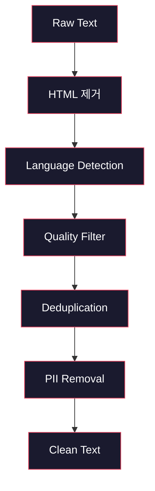
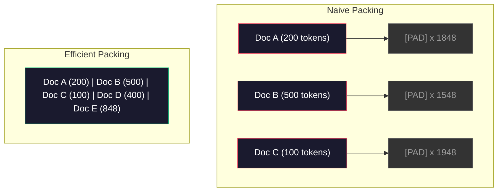

# Pre-Training을 위한 Data Pipeline

> 모델은 거울입니다. 넣어준 데이터를 그대로 비춥니다. 쓰레기를 넣으면, 완벽하게 유창한 쓰레기를 비춥니다.

**Type:** Build
**Languages:** Python
**Prerequisites:** Phase 10, Lessons 01-02 (Tokenizers, Building a Tokenizer)
**Time:** ~90 minutes

## 학습 목표

- terabyte 규모 텍스트를 전부 메모리에 올리지 않고 tokenization, chunking, shuffling, batching하는 streaming data pipeline을 만듭니다
- 실제 pre-training pipeline에서 쓰는 data quality filter(deduplication, language detection, content filtering)를 구현합니다
- 적절한 attention mask와 document boundary 처리를 갖춘 fixed-length training sequence를 만듭니다
- dataloader가 GPU training speed를 따라가는지 확인하기 위해 pipeline throughput을 profile합니다

## 문제

tokenizer가 생겼습니다. 이제 데이터가 필요합니다.

dataset 하나나 CSV 파일이 아닙니다. terabyte 규모 텍스트입니다. 정제되고, deduplicate되고, 품질 기준으로 filtering되고, fixed-length sequence로 tokenization되고, 8-GPU cluster가 다음 batch를 기다리지 않을 만큼 빠르게 randomized batch로 제공되어야 합니다.

대부분의 사람은 LLM training이 model architecture의 문제라고 생각합니다. 아닙니다. Llama 3는 15.6조 token을 사용했습니다. GPT-3는 3000억을 사용했습니다. DeepSeek-V2는 8.1조를 사용했습니다. 세 모델의 architecture는 대략 같습니다. attention과 feedforward layer를 쌓은 transformer block입니다. 출력 품질의 차이는 압도적으로 데이터에서 옵니다.

DeepMind의 Chinchilla 논문은 이를 정밀하게 만들었습니다. 주어진 compute budget에서 model parameter와 training token 사이에는 최적 비율이 있습니다. Chinchilla는 2022년의 대부분 모델이 크게 undertrained였음을 보였습니다. 본 데이터 양에 비해 parameter가 너무 많았던 것입니다. 1.4조 token으로 학습한 70B parameter 모델(Chinchilla-optimal)은 3000억 token으로 학습한 280B 모델(Gopher)을 능가했습니다.

data pipeline은 모델이 언어를 배울지 noise를 배울지를 결정합니다.

## 개념

### 데이터는 어디서 오는가

모든 대규모 언어 모델은 여러 source의 혼합으로 학습됩니다. 정확한 구성은 대부분 lab에서 엄격히 보호하는 비밀이지만, category를 이해할 만큼은 알려져 있습니다.

| Source | 크기 | 품질 | 사용한 모델 |
|--------|------|---------|---------|
| Common Crawl | ~250 TB raw | Low (needs heavy filtering) | GPT-3, Llama, most open models |
| Wikipedia | ~20 GB | High | Every major LLM |
| GitHub code | ~1 TB+ | Medium (lots of duplicates, dead code) | StarCoder, CodeLlama, DeepSeek-Coder |
| Books (BookCorpus, Pile) | ~100 GB | High | GPT-2, GPT-3, early models |
| Academic papers (arXiv, S2ORC) | ~100 GB | High for STEM | Llama, Galactica |
| StackOverflow, Reddit | ~100 GB | Medium | Llama, Falcon |
| Curated web (C4, RefinedWeb) | ~5 TB | Medium-High (pre-filtered) | T5, Falcon |

Llama 3는 data mix를 공개했습니다. 대략 web data 50%, code 25%, books and academic papers 13%, math data 8%, multilingual web data 4%입니다. 총량은 raw text 5TB를 넘는 source에서 나온 15.6조 token이었습니다.

총량만큼이나 비율도 중요합니다. web data가 너무 많으면 모델은 Reddit 반복기가 됩니다. code가 너무 적으면 programming을 못합니다. math가 너무 적으면 reasoning에 실패합니다. 이 mix를 맞추는 것은 LLM training에서 가장 어려운 부분 중 하나이며 공식은 없습니다. 실험과 평가가 필요합니다.

### Data cleaning

raw web data는 지저분합니다. 일반적인 Common Crawl dump에는 다음이 포함됩니다.

- HTML tag와 JavaScript
- boilerplate header, footer, navigation menu
- duplicate page(exact 및 near-duplicate)
- machine-generated spam
- personally identifiable information(PII)
- 저품질 텍스트(keyword list, SEO spam)
- 텍스트로 encoding된 non-text content

이를 cleaning하는 것은 선택 사항이 아닙니다. 일관된 문단을 생성하는 모델과 제품 listing이 섞인 HTML tag를 출력하는 모델의 차이입니다.



각 단계는 특정 noise category를 제거합니다.

**HTML stripping:** 모든 markup을 제거합니다. 보이는 text content만 유지합니다. `trafilatura` 또는 `readability` 같은 library는 navigation, 광고, boilerplate를 버리고 article content를 추출합니다.

**Language detection:** fastText의 language identification model(lid.176.bin)로 각 문서를 분류합니다. 목표 언어만 남깁니다. 영어로 분류되었지만 confidence가 0.8 미만인 문서는 깨끗한 영어가 아닐 가능성이 큽니다.

**Quality filtering:** 흥미로운 부분입니다. Falcon의 기반 dataset인 RefinedWeb은 perplexity-based filter를 사용합니다. Wikipedia로 작은 language model을 학습한 뒤 각 문서를 scoring합니다. perplexity가 높다는 것은 문서가 Wikipedia와 다르다는 뜻입니다. spam, keyword list, machine-generated content일 가능성이 큽니다. threshold보다 높은 perplexity의 문서는 제거됩니다.

**Deduplication:** 가장 영향력이 큰 단일 cleaning step입니다. Common Crawl에는 legal disclaimer, cookie notice, terms of service 같은 duplicated page가 엄청나게 많습니다. duplicate로 학습하면 compute를 낭비하고 모델이 특정 passage를 그대로 암기해 재생성하게 할 수 있습니다.

**PII removal:** 이름, email address, phone number, social security number를 제거합니다. structured PII에는 regex-based detection을, context 안의 이름에는 NER model을 사용합니다.

### MinHash를 이용한 Deduplication

exact deduplication은 쉽습니다. 각 문서를 hash하고 duplicate를 제거하면 됩니다. 하지만 진짜 문제는 near-duplicate입니다. 주변 광고만 조금 다른 같은 뉴스 기사 두 개는 near-duplicate입니다. 내용은 95% 동일하지만 byte-for-byte로는 다릅니다.

MinHash + Locality-Sensitive Hashing(LSH)이 이를 효율적으로 해결합니다.


아이디어는 다음과 같습니다.

1. **Shingling:** 각 문서를 n-gram set으로 변환합니다(예: 단어 또는 문자 5-gram). 3-word shingle을 쓰면 "the quick brown fox"는 {"the quick brown", "quick brown fox"}가 됩니다.

2. **MinHash:** 각 문서의 shingle set에 대해 k개의 hash 값을 계산합니다. 각 hash 값은 서로 다른 hash function 아래 모든 shingle 중 최소 hash입니다. 이렇게 두 문서 사이의 Jaccard similarity를 근사하는 fixed-size "signature"를 만듭니다.

3. **LSH:** MinHash signature의 band를 기준으로 문서를 bucket으로 묶습니다. 같은 bucket의 문서는 candidate near-duplicate입니다. 모든 pair를 비교하지 않고 candidate만 비교하게 해줍니다.

4. **Verify:** 각 candidate pair에 대해 exact Jaccard similarity를 계산합니다. similarity가 threshold(보통 0.8)를 넘으면 한 copy를 제거합니다.

Llama team은 deduplication으로 web data의 약 38%를 제거했다고 보고했습니다. 작은 숫자가 아닙니다. Common Crawl의 3분의 1 이상이 duplicate 또는 near-duplicate content입니다.

### Sequence packing

모델은 fixed-length input sequence를 기대합니다. 문서는 variable length입니다. 어떤 문서는 50 token이고, 어떤 문서는 50,000 token입니다.

naive approach는 모든 문서를 최대 sequence length까지 padding하는 것입니다. 이는 학습에 아무 기여도 하지 않는 padding token에 엄청난 compute를 낭비합니다.

더 나은 접근은 여러 문서를 하나의 sequence에 pack하고 end-of-sequence token으로 구분하는 것입니다. 2048-token sequence 하나에는 [EOS] token으로 이어 붙인 짧은 문서 세 개가 들어갈 수 있습니다.



attention mask는 올바르게 설정되어야 합니다. 같은 packed sequence 안에서도 Document A의 token이 Document B의 token에 attention하면 안 됩니다. 이를 위해 block-diagonal attention mask가 필요합니다.

긴 문서는 sequence boundary에서 truncate되거나 chunk로 나뉩니다. split point는 중요합니다. 문장 중간에서 자르면 모델은 불완전한 생각을 보게 됩니다. 일부 pipeline은 가능하면 paragraph 또는 sentence boundary에 split을 맞춥니다.

### Chinchilla scaling law

고정 compute budget C(FLOPs 단위)에서 최적 model size N과 dataset size D는 다음을 따릅니다.

```text
N_opt ~ C^0.5
D_opt ~ C^0.5
```

실제로는 model size와 dataset size를 대략 동일하게 scale해야 한다는 뜻입니다. parameter가 10배 많은 모델은 같은 loss에 도달하기 위해 대략 10배 많은 training token이 필요합니다.

| Model | Parameter | Training token | Chinchilla-optimal 여부 |
|-------|-----------|----------------|-------------------|
| GPT-3 | 175B | 300B | No (undertrained 3-4x) |
| Chinchilla | 70B | 1.4T | Yes (by design) |
| Llama 2 | 70B | 2T | Overtrained (intentionally) |
| Llama 3 | 70B | 15T | Heavily overtrained |

Llama 3는 의도적으로 Chinchilla law를 위반합니다. Meta는 compute-optimal ratio를 훨씬 넘는 더 많은 데이터로 overtraining하면 inference에 더 좋은 모델이 나온다는 것을 발견했습니다. 추가 training cost는 한 번만 지불하지만, 더 작은 모델은 계속 더 저렴하게 serving할 수 있습니다. 이를 "inference-optimal" scaling approach라고 부르기도 하며, 2024년 이후 업계 표준이 되었습니다.

## 직접 만들기

### 1단계: Text Cleaning

HTML을 제거하고, 공백을 정규화하고, non-text content를 제거합니다. 작은 corpus로 public domain text(Project Gutenberg)를 사용하겠습니다.

```python
import re

def clean_text(text):
    text = re.sub(r"<[^>]+>", "", text)
    text = re.sub(r"http\S+", "", text)
    text = re.sub(r"[^\x20-\x7E\n]", "", text)
    text = re.sub(r"\n{3,}", "\n\n", text)
    text = re.sub(r" {2,}", " ", text)
    return text.strip()

def quality_filter(text, min_words=50, max_ratio_caps=0.3, max_ratio_special=0.1):
    words = text.split()
    if len(words) < min_words:
        return False
    caps_ratio = sum(1 for w in words if w.isupper()) / len(words)
    if caps_ratio > max_ratio_caps:
        return False
    special_chars = sum(1 for c in text if not c.isalnum() and not c.isspace())
    if special_chars / max(len(text), 1) > max_ratio_special:
        return False
    return True
```

quality filter는 SEO spam(ALL CAPS), machine-generated noise(높은 특수 문자 비율), stub page(너무 짧음)를 잡아냅니다. 이 세 가지 검사만으로도 web crawl에서 놀랄 만큼 많은 쓰레기를 제거합니다.

### 2단계: MinHash Deduplication

MinHash를 처음부터 구현합니다. 외부 library는 필요 없고 `hashlib`만 있으면 됩니다.

```python
import hashlib
from collections import defaultdict

def get_shingles(text, k=5):
    words = text.lower().split()
    if len(words) < k:
        return set()
    return {" ".join(words[i:i+k]) for i in range(len(words) - k + 1)}

def minhash_signature(shingles, num_hashes=128):
    signature = []
    for i in range(num_hashes):
        min_hash = float("inf")
        for shingle in shingles:
            h = int(hashlib.sha256(f"{i}:{shingle}".encode()).hexdigest(), 16)
            min_hash = min(min_hash, h)
        signature.append(min_hash)
    return signature

def lsh_buckets(signature, bands=16):
    rows_per_band = len(signature) // bands
    buckets = []
    for b in range(bands):
        start = b * rows_per_band
        band_data = tuple(signature[start:start + rows_per_band])
        bucket_hash = hashlib.md5(str(band_data).encode()).hexdigest()
        buckets.append((b, bucket_hash))
    return buckets

def deduplicate(documents, threshold=0.8, num_hashes=128, bands=16):
    signatures = []
    shingle_sets = []
    for doc in documents:
        shingles = get_shingles(doc)
        shingle_sets.append(shingles)
        signatures.append(minhash_signature(shingles, num_hashes))

    bucket_map = defaultdict(list)
    for doc_idx, sig in enumerate(signatures):
        for band_id, bucket_hash in lsh_buckets(sig, bands):
            bucket_map[(band_id, bucket_hash)].append(doc_idx)

    duplicate_pairs = set()
    for bucket_docs in bucket_map.values():
        if len(bucket_docs) < 2:
            continue
        for i in range(len(bucket_docs)):
            for j in range(i + 1, len(bucket_docs)):
                duplicate_pairs.add((bucket_docs[i], bucket_docs[j]))

    removed = set()
    for i, j in duplicate_pairs:
        if i in removed or j in removed:
            continue
        s1, s2 = shingle_sets[i], shingle_sets[j]
        if not s1 or not s2:
            continue
        jaccard = len(s1 & s2) / len(s1 | s2)
        if jaccard >= threshold:
            removed.add(j)

    return [doc for idx, doc in enumerate(documents) if idx not in removed], len(removed)
```

`num_hashes=128`과 `bands=16` parameter는 precision-recall tradeoff를 제어합니다. hash가 많을수록 similarity 추정이 더 정확합니다. band가 많을수록 recall이 증가해 더 많은 duplicate를 잡지만 false positive도 늘어납니다. 이 값들은 일반적인 web text에 잘 맞습니다.

### 3단계: Tokenize and Pack Sequences

깨끗하고 deduplicate된 텍스트를 가져와 tokenization하고 training용 fixed-length sequence로 pack합니다.

```python
def tokenize_corpus(documents, tokenizer):
    all_tokens = []
    for doc in documents:
        tokens = tokenizer.encode(doc)
        all_tokens.extend(tokens)
        all_tokens.append(tokenizer.eos_id)
    return all_tokens

def pack_sequences(token_ids, seq_length, pad_id=0):
    sequences = []
    attention_masks = []
    for i in range(0, len(token_ids), seq_length):
        seq = token_ids[i:i + seq_length]
        mask = [1] * len(seq)
        if len(seq) < seq_length:
            pad_count = seq_length - len(seq)
            seq = seq + [pad_id] * pad_count
            mask = mask + [0] * pad_count
        sequences.append(seq)
        attention_masks.append(mask)
    return sequences, attention_masks
```

### Step 4: Training용 DataLoader

packed sequence의 randomized batch를 yield합니다. training loop가 소비하는 것이 이것입니다.

```python
import random

class PreTrainingDataLoader:
    def __init__(self, sequences, attention_masks, batch_size, shuffle=True):
        self.sequences = sequences
        self.attention_masks = attention_masks
        self.batch_size = batch_size
        self.shuffle = shuffle

    def __len__(self):
        return (len(self.sequences) + self.batch_size - 1) // self.batch_size

    def __iter__(self):
        indices = list(range(len(self.sequences)))
        if self.shuffle:
            random.shuffle(indices)
        for start in range(0, len(indices), self.batch_size):
            batch_idx = indices[start:start + self.batch_size]
            batch_seqs = [self.sequences[i] for i in batch_idx]
            batch_masks = [self.attention_masks[i] for i in batch_idx]
            yield batch_seqs, batch_masks
```

### 5단계: Dataset Statistics

중요한 숫자를 계산합니다. total tokens, unique tokens, compression ratio, document length distribution입니다.

```python
from collections import Counter

def compute_statistics(documents, token_ids, sequences, tokenizer_vocab_size):
    total_chars = sum(len(d) for d in documents)
    total_tokens = len(token_ids)
    unique_tokens = len(set(token_ids))
    compression_ratio = total_chars / total_tokens

    doc_lengths = [len(d.split()) for d in documents]
    avg_doc_length = sum(doc_lengths) / max(len(doc_lengths), 1)
    max_doc_length = max(doc_lengths) if doc_lengths else 0
    min_doc_length = min(doc_lengths) if doc_lengths else 0

    token_counts = Counter(token_ids)
    top_tokens = token_counts.most_common(10)

    non_pad_tokens = sum(sum(1 for t in seq if t != 0) for seq in sequences)
    total_positions = sum(len(seq) for seq in sequences)
    utilization = non_pad_tokens / max(total_positions, 1)

    stats = {
        "total_documents": len(documents),
        "total_characters": total_chars,
        "total_tokens": total_tokens,
        "unique_tokens": unique_tokens,
        "vocab_utilization": unique_tokens / tokenizer_vocab_size,
        "compression_ratio": compression_ratio,
        "avg_doc_length_words": avg_doc_length,
        "max_doc_length_words": max_doc_length,
        "min_doc_length_words": min_doc_length,
        "num_sequences": len(sequences),
        "sequence_utilization": utilization,
        "top_10_tokens": top_tokens,
    }
    return stats
```

compression ratio는 이 corpus에서 tokenizer가 얼마나 효율적인지 알려줍니다. 영어 텍스트는 보통 token당 3-4자로 압축됩니다. token당 1.5자가 보이면 tokenizer가 너무 공격적으로 분리하는 것입니다. 8 이상이면 매우 domain-specific한 merge를 학습한 것입니다.

sequence utilization은 packed sequence 중 실제 데이터와 padding의 비율을 알려줍니다. 90% 미만이면 packing이 비효율적이라는 뜻입니다. padding token에 compute를 낭비하고 있습니다.

## 활용하기

### HuggingFace Datasets와 비교

같은 corpus를 HuggingFace datasets library로 load하고 pipeline speed를 비교합니다.

```python
from datasets import load_dataset
from transformers import AutoTokenizer

ds = load_dataset("wikitext", "wikitext-2-raw-v1", split="train")
tokenizer = AutoTokenizer.from_pretrained("meta-llama/Meta-Llama-3-8B")

import time

start = time.time()
tokenized = ds.map(
    lambda x: tokenizer(x["text"], truncation=True, max_length=2048),
    batched=True,
    num_proc=4,
)
hf_time = time.time() - start
total_tokens = sum(len(t) for t in tokenized["input_ids"])
print(f"HuggingFace: {total_tokens:,} tokens in {hf_time:.2f}s ({total_tokens/hf_time:,.0f} tokens/sec)")
```

HuggingFace pipeline은 내부에서 Rust tokenizer를 사용하고 4개 core에 걸쳐 parallel processing을 수행합니다. 순수 Python pipeline은 10-50배 느릴 것입니다. 이 격차 때문에 production team은 compiled tokenizer를 사용합니다. algorithm은 같습니다. 구현 언어가 차이를 만듭니다.

## 산출물

이 lesson은 LLM training pipeline의 data quality를 검증하고 debug하기 위한 prompt를 산출합니다. `outputs/prompt-data-quality-checker.md`를 참고하세요.

## 연습문제

1. **Easy:** 간단한 heuristic(character set analysis)을 사용해 cleaning pipeline에 language detection을 추가하세요. 영어 문서만 남기고 몇 개 문서가 제거되는지 측정하세요.
2. **Medium:** MinHash near-deduplication과 함께 SHA-256 hash를 사용한 exact deduplication을 구현하세요. web-scraped corpus에서 각 방법이 잡은 duplicate 수를 비교하세요.
3. **Hard:** perplexity-based quality filter를 만드세요. Wikipedia text로 작은 bigram language model을 학습하고, 각 문서를 perplexity로 scoring한 뒤 하위 20%를 제거하세요. filtered data와 unfiltered data로 학습했을 때 model output quality를 비교하세요.

## 핵심 용어

| 용어 | 흔히 하는 말 | 실제 의미 |
|------|----------------|----------------------|
| Common Crawl | "인터넷" | 매월 web을 crawl하는 비영리 조직입니다. raw 약 250TB이며 대부분 LLM training data의 출발점입니다 |
| MinHash | "hashing trick" | fixed-size signature로 set 간 Jaccard similarity를 추정하는 기법입니다. scale에서 near-duplicate detection을 가능하게 합니다 |
| LSH | "Locality-Sensitive Hashing" | 유사한 item을 같은 bucket으로 묶는 방법입니다. pairwise comparison을 O(n^2)에서 near-linear로 줄입니다 |
| Sequence packing | "문서 이어 붙이기" | 여러 문서를 proper attention mask와 함께 fixed-length sequence에 맞춰 넣습니다. padding 낭비를 제거합니다 |
| Chinchilla scaling | "더 많은 데이터로 학습" | fixed compute budget에서 최적 성능에는 model size와 training token을 대략 동일하게 scale해야 합니다 |
| Fertility | "단어당 token 수" | 단어당 평균 token 수입니다. GPT-4의 영어는 1.3이며 non-Latin script는 더 높습니다 |
| Data mixing | "training data 선택" | code vs text vs math vs multilingual data 비율입니다. 공식은 없고 실험이 필요합니다 |
| Perplexity filter | "품질 scoring" | 작은 language model로 문서를 scoring합니다. 높은 perplexity는 텍스트가 깨끗한 reference data와 다르다는 뜻입니다 |
| Deduplication | "copy 제거" | exact 및 near-duplicate 문서를 제거합니다. 보통 raw web data의 30-40%를 제거합니다 |
| Attention mask | "어떤 token을 볼지" | packed sequence에서 document boundary를 가로지르는 attention을 막는 binary mask입니다 |

## 더 읽을거리

- [Hoffmann et al., 2022 -- Training Compute-Optimal Large Language Models (Chinchilla)](https://arxiv.org/abs/2203.15556) -- data scale에 대한 사고방식을 바꾼 논문
- [Penedo et al., 2023 -- The RefinedWeb Dataset for Falcon LLM](https://arxiv.org/abs/2306.01116) -- Common Crawl을 고품질로 filtering하는 방법
- [Touvron et al., 2023 -- Llama 2: Open Foundation and Fine-Tuned Chat Models](https://arxiv.org/abs/2307.09288) -- Llama 2의 data pipeline 세부사항
- [Lee et al., 2022 -- Deduplicating Training Data Makes Language Models Better](https://arxiv.org/abs/2107.06499) -- deduplication이 생각보다 더 중요한 이유
- [Broder, 1997 -- On the Resemblance and Containment of Documents](https://ieeexplore.ieee.org/document/666900) -- 원래의 MinHash 논문
- [Meta, 2024 -- Llama 3 Technical Report](https://arxiv.org/abs/2407.21783) -- 15.6T token, data mixing ratio, filtering pipeline
