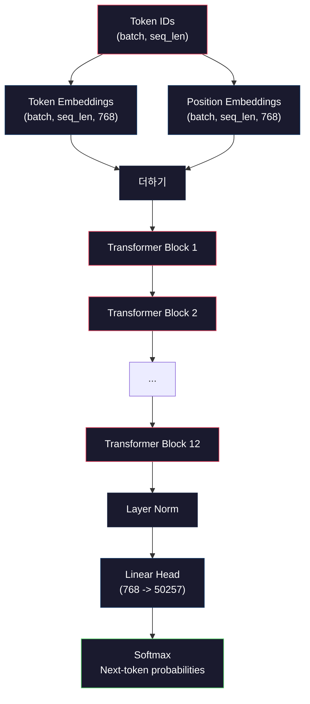
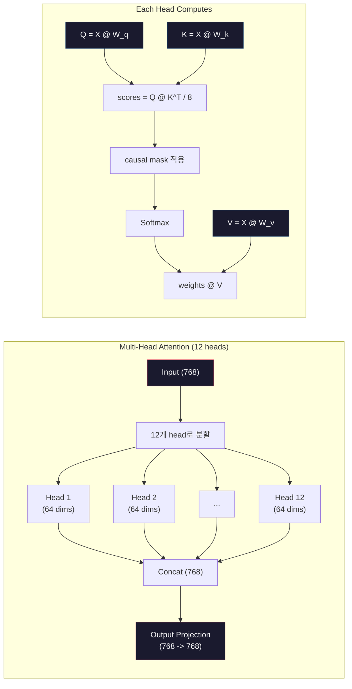
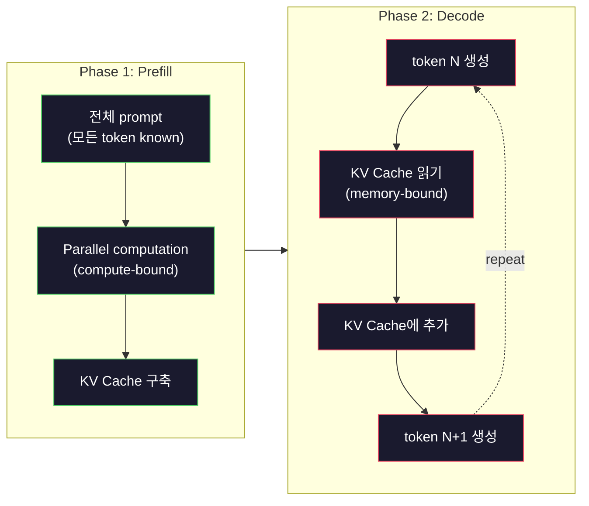

# Mini GPT 사전학습(124M 파라미터)

> GPT-2 Small은 1억 2400만 parameter를 가집니다. 12개의 transformer layer, 12개의 attention head, 768차원 embedding입니다. 단일 GPU에서 몇 시간 안에 처음부터 학습할 수 있습니다. 대부분의 사람은 이 일을 해보지 않습니다. pre-trained checkpoint를 사용합니다. 하지만 직접 하나를 학습해보지 않으면, 제품을 얹어 만드는 그 모델 내부에서 실제로 무슨 일이 일어나는지 이해하지 못합니다.

**Type:** Build
**Languages:** Python (with numpy)
**Prerequisites:** Phase 10, Lessons 01-03 (Tokenizers, Building a Tokenizer, Data Pipelines)
**Time:** ~120 minutes

## 학습 목표

- token embedding, positional embedding, transformer block, language model head를 포함한 전체 GPT-2 architecture(124M parameters)를 처음부터 구현합니다
- cross-entropy loss를 사용하는 next-token prediction으로 text corpus에서 GPT model을 학습합니다
- temperature sampling과 top-k/top-p filtering을 사용하는 autoregressive text generation을 구현합니다
- training loss curve를 monitoring하고 모델이 일관된 언어 pattern을 학습하는지 검증합니다

## 문제

transformer가 무엇인지는 알고 있습니다. diagram도 읽었습니다. "attention is all you need"를 외울 수 있고 whiteboard에 "Multi-Head Attention"이라고 적힌 box도 그릴 수 있습니다.

그 어느 것도 모델이 텍스트를 생성할 때 무슨 일이 일어나는지 이해한다는 뜻은 아닙니다.

GPT-2 Small에는 weight tying을 포함해 124,438,272개의 parameter가 있습니다. 그 모든 값은 training loop를 실행해 설정되었습니다. forward pass, loss 계산, backward pass, weight update입니다. 12개의 transformer block. block당 12개의 attention head. 768차원 embedding space. 50,257 token vocabulary. 모델이 token 하나를 생성할 때마다 1억 2400만 parameter 전체가 token ID sequence를 받아 다음 token에 대한 probability distribution을 만드는 하나의 matrix multiplication chain에 참여합니다.

직접 만들어본 적이 없다면 black box를 다루는 것입니다. API를 사용할 수는 있습니다. fine-tuning도 할 수 있습니다. 하지만 문제가 생길 때, 모델이 hallucinate하거나, 반복하거나, 지시를 따르지 않을 때, *왜* 그런지에 대한 mental model이 없습니다.

이 lesson은 GPT-2 Small을 처음부터 만듭니다. PyTorch가 아니라 numpy로 만듭니다. 모든 matrix multiplication이 보입니다. 모든 gradient가 여러분의 코드로 계산됩니다. 1억 2400만 개 숫자가 다음 단어를 예측하기 위해 어떻게 공모하는지 정확히 보게 됩니다.

## 개념

### GPT 아키텍처

GPT는 autoregressive language model입니다. "autoregressive"는 이전의 모든 token을 조건으로 한 번에 token 하나씩 생성한다는 뜻입니다. architecture는 transformer decoder block을 쌓은 구조입니다.

token ID에서 next-token probability까지의 전체 computation graph는 다음과 같습니다.

1. Token ID가 들어옵니다. Shape: (batch_size, seq_len).
2. token embedding lookup을 합니다. 각 ID는 768차원 vector에 mapping됩니다. Shape: (batch_size, seq_len, 768).
3. position embedding lookup을 합니다. 각 position(0, 1, 2, ...)은 768차원 vector에 mapping됩니다. shape는 같습니다.
4. token embedding + position embedding을 더합니다.
5. 12개의 transformer block을 통과합니다.
6. final layer normalization을 수행합니다.
7. vocabulary size로 linear projection합니다. Shape: (batch_size, seq_len, vocab_size).
8. softmax로 probability를 얻습니다.

이것이 모델 전체입니다. convolution도 없고 recurrence도 없습니다. embedding, attention, feedforward network, layer norm을 12번 쌓았을 뿐입니다.



### Transformer block

12개 block 각각은 같은 pattern을 따릅니다. pre-norm architecture입니다(GPT-2는 original transformer처럼 post-norm이 아니라 pre-norm을 사용합니다).

1. LayerNorm
2. Multi-Head Self-Attention
3. residual connection(input을 다시 더함)
4. LayerNorm
5. Feed-Forward Network(MLP)
6. residual connection(input을 다시 더함)

residual connection은 매우 중요합니다. 이것이 없으면 backpropagation 중 gradient가 block 1에 도달할 때쯤 사라집니다. residual connection이 있으면 gradient가 "skip" path를 통해 loss에서 어떤 layer로든 직접 흐를 수 있습니다. 그래서 12개, 32개, 심지어 96개 block도 쌓을 수 있습니다(GPT-4는 120개를 사용한다는 소문이 있습니다).

### Attention: 핵심 Mechanism

self-attention은 모든 token이 이전의 모든 token을 보고 각각에 얼마나 attention할지 결정하게 합니다. 수식은 다음과 같습니다.

각 token position에 대해 입력에서 세 vector를 계산합니다.
- **Query (Q)**: "나는 무엇을 찾고 있는가?"
- **Key (K)**: "나는 무엇을 담고 있는가?"
- **Value (V)**: "나는 어떤 정보를 운반하는가?"

```text
Q = input @ W_q    (768 -> 768)
K = input @ W_k    (768 -> 768)
V = input @ W_v    (768 -> 768)

attention_scores = Q @ K^T / sqrt(d_k)
attention_scores = mask(attention_scores)   # causal mask: -inf for future positions
attention_weights = softmax(attention_scores)
output = attention_weights @ V
```

causal mask가 GPT를 autoregressive하게 만듭니다. position 5는 position 0-5에는 attention할 수 있지만 6, 7, 8 등에는 attention할 수 없습니다. 이는 training 중 모델이 미래 token을 보며 "cheating"하는 것을 막습니다.

**Multi-head attention**은 768차원 space를 각각 64차원인 12개 head로 나눕니다. 각 head는 서로 다른 attention pattern을 학습합니다. 한 head는 syntactic relationship(subject-verb agreement)을 추적할 수 있습니다. 다른 head는 semantic similarity(synonym)를 추적할 수 있습니다. 또 다른 head는 positional proximity(가까운 단어)를 추적할 수 있습니다. 12개 head의 출력은 concatenate되어 다시 768차원으로 projection됩니다.



sqrt(d_k)로 나누는 것, 즉 sqrt(64) = 8은 scaling입니다. 이것이 없으면 high-dimensional vector에서 dot product가 커져 softmax가 gradient가 거의 0인 영역으로 밀려납니다. 이는 원래 "Attention Is All You Need" 논문의 핵심 통찰 중 하나였습니다.

### KV Cache: Inference가 빠른 이유

training 중에는 전체 sequence를 한 번에 처리합니다. inference 중에는 token을 하나씩 생성합니다. optimization이 없으면 token N을 생성하려면 이전 N-1개 token 전체에 대해 attention을 다시 계산해야 합니다. 생성 token 하나당 O(N^2), 길이 N sequence 전체로는 O(N^3)입니다.

KV Cache가 이를 해결합니다. 각 token의 K와 V를 계산한 뒤 저장합니다. token N+1을 생성할 때는 새 token에 대한 Q만 계산하고 이전 모든 token의 cached K와 V를 조회하면 됩니다. K와 V 계산에 대해서는 token당 비용이 O(N)에서 O(1)로 줄어듭니다. 이전 모든 position에 attention하므로 attention score 계산은 여전히 O(N)이지만, 입력에 대한 중복 matrix multiplication을 피합니다.

12 layer와 12 head를 가진 GPT-2에서 KV cache는 token당 2(K + V) x 12 layers x 12 heads x 64 dims = 18,432개 값을 저장합니다. 1024-token sequence에서는 FP32 기준 약 75MB입니다. 128 layer를 가진 Llama 3 405B에서는 단일 sequence의 KV cache가 10GB를 넘을 수 있습니다. 이것이 long-context inference가 memory-bound인 이유입니다.

### Prefill vs Decode: Inference의 두 단계

LLM에 prompt를 보내면 inference는 두 개의 뚜렷한 단계로 진행됩니다.

**Prefill**은 전체 prompt를 parallel로 처리합니다. 모든 token이 알려져 있으므로 모델은 모든 position의 attention을 동시에 계산할 수 있습니다. 이 단계는 compute-bound입니다. GPU가 full throughput으로 matrix multiplication을 수행합니다. A100에서 1000-token prompt의 prefill은 대략 20-50ms가 걸립니다.

**Decode**는 token을 하나씩 생성합니다. 각 새 token은 이전 모든 token에 의존합니다. 이 단계는 memory-bound입니다. 병목은 matrix math 자체가 아니라 GPU memory에서 model weight와 KV cache를 읽는 것입니다. GPU compute core는 대부분 memory read를 기다리며 유휴 상태가 됩니다. GPT-2에서는 memory bandwidth가 제약이기 때문에 matmul에 필요한 FLOPs 수와 관계없이 각 decode step이 비슷한 시간이 걸립니다.

이 구분은 production system에서 중요합니다. prefill throughput은 GPU compute와 함께 scale합니다(FLOPS가 많을수록 prefill이 빠름). decode throughput은 memory bandwidth와 함께 scale합니다(memory가 빠를수록 decode가 빠름). 그래서 NVIDIA H100은 A100보다 memory bandwidth 개선에 집중했습니다. token generation 속도를 직접 높이기 때문입니다.



### Training loop

LLM training은 next-token prediction입니다. token [0, 1, 2, ..., N-1]이 주어지면 token [1, 2, 3, ..., N]을 예측합니다. loss function은 모델의 예측 probability distribution과 실제 다음 token 사이의 cross-entropy입니다.

training step 하나는 다음과 같습니다.

1. **Forward pass**: batch를 12개 block 전체에 통과시킵니다. 각 position에 대한 logits(pre-softmax score)를 얻습니다.
2. **Compute loss**: logits와 target token(입력을 한 position shift한 것) 사이의 cross-entropy를 계산합니다.
3. **Backward pass**: backpropagation으로 124M parameter 전체의 gradient를 계산합니다.
4. **Optimizer step**: weight를 update합니다. GPT-2는 learning rate warmup과 cosine decay가 있는 Adam을 사용합니다.

learning rate schedule은 예상보다 중요합니다. GPT-2는 처음 2,000 step 동안 0에서 peak learning rate까지 warmup한 뒤 cosine curve를 따라 decay합니다. 높은 learning rate로 시작하면 모델이 diverge합니다. 계속 높은 rate를 유지하면 training 후반에 oscillation이 생깁니다. warmup-then-decay pattern은 모든 주요 LLM에서 사용됩니다.

### GPT-2 Small: 숫자

| Component | Shape | Parameter |
|-----------|-------|------------|
| Token embeddings | (50257, 768) | 38,597,376 |
| Position embeddings | (1024, 768) | 786,432 |
| Per-block attention (W_q, W_k, W_v, W_out) | 4 x (768, 768) | 2,359,296 |
| Per-block FFN (up + down) | (768, 3072) + (3072, 768) | 4,718,592 |
| Per-block LayerNorms (2x) | 2 x 768 x 2 | 3,072 |
| Final LayerNorm | 768 x 2 | 1,536 |
| **Total per block** | | **7,080,960** |
| **Total (12 blocks)** | | **85,054,464 + 39,383,808 = 124,438,272** |

output projection(logits head)은 token embedding matrix와 weight를 공유합니다. 이를 weight tying이라고 합니다. parameter count를 38M 줄이고, 모델이 입력과 출력에 같은 representation space를 쓰도록 강제하므로 성능도 개선합니다.

## 직접 만들기

### 1단계: Embedding Layer

token embedding은 가능한 50,257개 token 각각을 768차원 vector로 mapping합니다. position embedding은 각 token이 sequence의 어디에 있는지에 대한 정보를 더합니다. 둘은 합산됩니다.

```python
import numpy as np

class Embedding:
    def __init__(self, vocab_size, embed_dim, max_seq_len):
        self.token_embed = np.random.randn(vocab_size, embed_dim) * 0.02
        self.pos_embed = np.random.randn(max_seq_len, embed_dim) * 0.02

    def forward(self, token_ids):
        seq_len = token_ids.shape[-1]
        tok_emb = self.token_embed[token_ids]
        pos_emb = self.pos_embed[:seq_len]
        return tok_emb + pos_emb
```

initialization에 쓰는 0.02 standard deviation은 GPT-2 논문에서 왔습니다. 너무 크면 초기 forward pass가 극단적인 값을 만들어 training을 불안정하게 합니다. 너무 작으면 초기 출력이 모든 입력에서 거의 같아져 early gradient signal이 쓸모없어집니다.

### Step 2: Causal Mask가 있는 Self-Attention

먼저 single-head attention입니다. causal mask는 softmax 전에 미래 position을 negative infinity로 설정해 각 position이 자기 자신과 이전 position에만 attention할 수 있게 보장합니다.

```python
def attention(Q, K, V, mask=None):
    d_k = Q.shape[-1]
    scores = Q @ K.transpose(0, -1, -2 if Q.ndim == 4 else 1) / np.sqrt(d_k)
    if mask is not None:
        scores = scores + mask
    weights = np.exp(scores - scores.max(axis=-1, keepdims=True))
    weights = weights / weights.sum(axis=-1, keepdims=True)
    return weights @ V
```

softmax 구현은 exponentiation 전에 최댓값을 뺍니다. 이것이 없으면 exp(large_number)가 infinity로 overflow합니다. softmax(x - c) = softmax(x)가 임의의 상수 c에 대해 성립하므로 출력은 바꾸지 않는 numerical stability trick입니다.

### 3단계: Multi-Head Attention

768차원 입력을 각각 64차원인 12개 head로 나눕니다. 각 head는 독립적으로 attention을 계산합니다. 결과를 concatenate하고 다시 768차원으로 project합니다.

```python
class MultiHeadAttention:
    def __init__(self, embed_dim, num_heads):
        self.num_heads = num_heads
        self.head_dim = embed_dim // num_heads
        self.W_q = np.random.randn(embed_dim, embed_dim) * 0.02
        self.W_k = np.random.randn(embed_dim, embed_dim) * 0.02
        self.W_v = np.random.randn(embed_dim, embed_dim) * 0.02
        self.W_out = np.random.randn(embed_dim, embed_dim) * 0.02

    def forward(self, x, mask=None):
        batch, seq_len, d = x.shape
        Q = (x @ self.W_q).reshape(batch, seq_len, self.num_heads, self.head_dim).transpose(0, 2, 1, 3)
        K = (x @ self.W_k).reshape(batch, seq_len, self.num_heads, self.head_dim).transpose(0, 2, 1, 3)
        V = (x @ self.W_v).reshape(batch, seq_len, self.num_heads, self.head_dim).transpose(0, 2, 1, 3)

        scores = Q @ K.transpose(0, 1, 3, 2) / np.sqrt(self.head_dim)
        if mask is not None:
            scores = scores + mask
        weights = np.exp(scores - scores.max(axis=-1, keepdims=True))
        weights = weights / weights.sum(axis=-1, keepdims=True)
        attn_out = weights @ V

        attn_out = attn_out.transpose(0, 2, 1, 3).reshape(batch, seq_len, d)
        return attn_out @ self.W_out
```

reshape-transpose-reshape 과정은 multi-head attention에서 가장 헷갈리는 부분입니다. 일어나는 일은 이렇습니다. (batch, seq_len, 768) tensor가 (batch, seq_len, 12, 64)가 되고, 이어서 (batch, 12, seq_len, 64)가 됩니다. 이제 12개 head 각각은 attention을 수행할 자기만의 (seq_len, 64) matrix를 가집니다. attention 이후에는 과정을 되돌립니다. (batch, 12, seq_len, 64)가 (batch, seq_len, 12, 64)가 되고, 다시 (batch, seq_len, 768)이 됩니다.

### 4단계: Transformer Block

완전한 transformer block 하나입니다. LayerNorm, residual이 있는 multi-head attention, LayerNorm, residual이 있는 feedforward입니다.

```python
class LayerNorm:
    def __init__(self, dim, eps=1e-5):
        self.gamma = np.ones(dim)
        self.beta = np.zeros(dim)
        self.eps = eps

    def forward(self, x):
        mean = x.mean(axis=-1, keepdims=True)
        var = x.var(axis=-1, keepdims=True)
        return self.gamma * (x - mean) / np.sqrt(var + self.eps) + self.beta


class FeedForward:
    def __init__(self, embed_dim, ff_dim):
        self.W1 = np.random.randn(embed_dim, ff_dim) * 0.02
        self.b1 = np.zeros(ff_dim)
        self.W2 = np.random.randn(ff_dim, embed_dim) * 0.02
        self.b2 = np.zeros(embed_dim)

    def forward(self, x):
        h = x @ self.W1 + self.b1
        h = np.maximum(0, h)  # GELU approximation: ReLU for simplicity
        return h @ self.W2 + self.b2


class TransformerBlock:
    def __init__(self, embed_dim, num_heads, ff_dim):
        self.ln1 = LayerNorm(embed_dim)
        self.attn = MultiHeadAttention(embed_dim, num_heads)
        self.ln2 = LayerNorm(embed_dim)
        self.ffn = FeedForward(embed_dim, ff_dim)

    def forward(self, x, mask=None):
        x = x + self.attn.forward(self.ln1.forward(x), mask)
        x = x + self.ffn.forward(self.ln2.forward(x))
        return x
```

feedforward network는 768차원 입력을 3,072차원(4x)으로 확장하고, nonlinearity를 적용한 뒤 다시 768로 project합니다. 이 expansion-contraction pattern은 모델이 각 position에서 작업할 더 "넓은" internal representation을 제공합니다. GPT-2는 GELU activation을 사용하지만 여기서는 단순화를 위해 ReLU를 사용합니다. architecture 이해에는 차이가 작습니다.

### Step 5: 전체 GPT Model

12개의 transformer block을 쌓습니다. 앞에는 embedding layer를, 뒤에는 output projection을 추가합니다.

```python
class MiniGPT:
    def __init__(self, vocab_size=50257, embed_dim=768, num_heads=12,
                 num_layers=12, max_seq_len=1024, ff_dim=3072):
        self.embedding = Embedding(vocab_size, embed_dim, max_seq_len)
        self.blocks = [
            TransformerBlock(embed_dim, num_heads, ff_dim)
            for _ in range(num_layers)
        ]
        self.ln_f = LayerNorm(embed_dim)
        self.vocab_size = vocab_size
        self.embed_dim = embed_dim

    def forward(self, token_ids):
        seq_len = token_ids.shape[-1]
        mask = np.triu(np.full((seq_len, seq_len), -1e9), k=1)

        x = self.embedding.forward(token_ids)
        for block in self.blocks:
            x = block.forward(x, mask)
        x = self.ln_f.forward(x)

        logits = x @ self.embedding.token_embed.T
        return logits

    def count_parameters(self):
        total = 0
        total += self.embedding.token_embed.size
        total += self.embedding.pos_embed.size
        for block in self.blocks:
            total += block.attn.W_q.size + block.attn.W_k.size
            total += block.attn.W_v.size + block.attn.W_out.size
            total += block.ffn.W1.size + block.ffn.b1.size
            total += block.ffn.W2.size + block.ffn.b2.size
            total += block.ln1.gamma.size + block.ln1.beta.size
            total += block.ln2.gamma.size + block.ln2.beta.size
        total += self.ln_f.gamma.size + self.ln_f.beta.size
        return total
```

weight tying에 주목하세요. `logits = x @ self.embedding.token_embed.T`입니다. output projection은 token embedding matrix를 transpose해 재사용합니다. 이는 단순한 parameter-saving trick이 아닙니다. 모델이 token을 이해할 때(embedding)와 예측할 때(output) 같은 vector space를 사용한다는 뜻입니다.

### 6단계: Training Loop

124M parameter에 대한 실제 training run에는 GPU와 PyTorch가 필요합니다. 이 training loop는 순수 numpy로 실행되는 작은 모델에서 mechanics를 보여줍니다. 다룰 수 있게 tiny model(4 layers, 4 heads, 128 dims)을 사용합니다.

```python
def cross_entropy_loss(logits, targets):
    batch, seq_len, vocab_size = logits.shape
    logits_flat = logits.reshape(-1, vocab_size)
    targets_flat = targets.reshape(-1)

    max_logits = logits_flat.max(axis=-1, keepdims=True)
    log_softmax = logits_flat - max_logits - np.log(
        np.exp(logits_flat - max_logits).sum(axis=-1, keepdims=True)
    )

    loss = -log_softmax[np.arange(len(targets_flat)), targets_flat].mean()
    return loss


def train_mini_gpt(text, vocab_size=256, embed_dim=128, num_heads=4,
                   num_layers=4, seq_len=64, num_steps=200, lr=3e-4):
    tokens = np.array(list(text.encode("utf-8")[:2048]))
    model = MiniGPT(
        vocab_size=vocab_size, embed_dim=embed_dim, num_heads=num_heads,
        num_layers=num_layers, max_seq_len=seq_len, ff_dim=embed_dim * 4
    )

    print(f"Model parameters: {model.count_parameters():,}")
    print(f"Training tokens: {len(tokens):,}")
    print(f"Config: {num_layers} layers, {num_heads} heads, {embed_dim} dims")
    print()

    for step in range(num_steps):
        start_idx = np.random.randint(0, max(1, len(tokens) - seq_len - 1))
        batch_tokens = tokens[start_idx:start_idx + seq_len + 1]

        input_ids = batch_tokens[:-1].reshape(1, -1)
        target_ids = batch_tokens[1:].reshape(1, -1)

        logits = model.forward(input_ids)
        loss = cross_entropy_loss(logits, target_ids)

        if step % 20 == 0:
            print(f"Step {step:4d} | Loss: {loss:.4f}")

    return model
```

loss는 ln(vocab_size) 근처에서 시작합니다. 256-token byte-level vocabulary라면 ln(256) = 5.55입니다. random model은 모든 token에 같은 probability를 할당합니다. training이 진행되면 모델이 흔한 pattern, 예를 들어 "t" 다음의 "th", period 뒤의 space 등을 예측하는 법을 배우므로 loss가 내려갑니다.

production에서는 gradient accumulation, learning rate warmup, gradient clipping이 있는 Adam optimizer를 사용합니다. forward-pass-loss-backward-update loop는 동일합니다. optimizer가 더 정교할 뿐입니다.

### 7단계: Text Generation

generation은 학습된 모델로 token을 하나씩 예측합니다. 각 예측은 output distribution에서 sampling하거나 greedy하게 argmax를 취합니다.

```python
def generate(model, prompt_tokens, max_new_tokens=100, temperature=0.8):
    tokens = list(prompt_tokens)
    seq_len = model.embedding.pos_embed.shape[0]

    for _ in range(max_new_tokens):
        context = np.array(tokens[-seq_len:]).reshape(1, -1)
        logits = model.forward(context)
        next_logits = logits[0, -1, :]

        next_logits = next_logits / temperature
        probs = np.exp(next_logits - next_logits.max())
        probs = probs / probs.sum()

        next_token = np.random.choice(len(probs), p=probs)
        tokens.append(next_token)

    return tokens
```

temperature는 randomness를 제어합니다. Temperature 1.0은 raw distribution을 사용합니다. Temperature 0.5는 이를 더 날카롭게 만듭니다(더 deterministic하며 모델이 top choice를 더 자주 고름). Temperature 1.5는 분포를 평평하게 만듭니다(더 random하며 low-probability token의 기회가 커짐). Temperature 0.0은 greedy decoding입니다(항상 가장 높은 probability token 선택).

모델에는 maximum context length(GPT-2는 1024)가 있으므로 `tokens[-seq_len:]` window가 필요합니다. 이를 넘으면 가장 오래된 token을 버려야 합니다. 모두가 말하는 "context window"가 바로 이것입니다.

```figure
sampling-decoder
```

## 활용하기

### 전체 Training 및 Generation Demo

```python
corpus = """The transformer architecture has revolutionized natural language processing.
Attention mechanisms allow the model to focus on relevant parts of the input.
Self-attention computes relationships between all pairs of positions in a sequence.
Multi-head attention splits the representation into multiple subspaces.
Each attention head can learn different types of relationships.
The feedforward network provides nonlinear transformations at each position.
Residual connections enable gradient flow through deep networks.
Layer normalization stabilizes training by normalizing activations.
Position embeddings give the model information about token ordering.
The causal mask ensures autoregressive generation during training.
Pre-training on large text corpora teaches the model general language understanding.
Fine-tuning adapts the pre-trained model to specific downstream tasks."""

model = train_mini_gpt(corpus, num_steps=200)

prompt = list("The transformer".encode("utf-8"))
output_tokens = generate(model, prompt, max_new_tokens=100, temperature=0.8)
generated_text = bytes(output_tokens).decode("utf-8", errors="replace")
print(f"\nGenerated: {generated_text}")
```

작은 corpus와 작은 모델에서는 generated text가 좋아도 반쯤 coherent한 수준일 것입니다. training text에서 일부 byte-level pattern은 학습하지만, 40GB training data와 전체 124M parameter architecture를 가진 GPT-2처럼 generalize할 수는 없습니다. 핵심은 output quality가 아닙니다. 핵심은 embedding lookup, attention computation, feedforward transformation, logit projection, softmax, sampling의 모든 step을 추적할 수 있다는 점입니다. 모든 operation이 보입니다.

## 산출물

이 lesson은 `outputs/prompt-gpt-architecture-analyzer.md`를 산출합니다. 어떤 GPT-style model의 architecture choice든 분석하는 prompt입니다. model card나 technical report를 넣으면 parameter allocation, attention design, scaling decision을 분해해줍니다.

## 연습문제

1. 모델을 수정해 12/12 대신 24 layers와 16 heads를 사용하게 하세요. parameter를 세어보세요. depth를 두 배로 늘리는 것은 width(embedding dimension)를 두 배로 늘리는 것과 어떻게 다른가요?

2. GELU activation function(GELU(x) = x * 0.5 * (1 + erf(x / sqrt(2))))을 구현하고 feedforward network의 ReLU를 대체하세요. 각 activation으로 500 step training을 실행하고 final loss를 비교하세요.

3. generation function에 KV cache를 추가하세요. 첫 forward pass 이후 각 layer의 K와 V tensor를 저장하고 subsequent token에 재사용하세요. speedup을 측정하세요. cache가 있을 때와 없을 때 200 token을 생성하고 wall-clock time을 비교하세요.

4. top-k sampling(가장 probability가 높은 k개 token만 고려)과 top-p sampling(nucleus sampling: cumulative probability가 p를 넘는 가장 작은 token set 고려)을 구현하세요. temperature 0.8에서 top-k=50과 top-p=0.95의 output quality를 비교하세요.

5. training loss curve plotter를 만드세요. 모델을 1000 step 학습하고 loss vs step을 plot하세요. 세 phase를 식별하세요. 빠른 초기 하강(common byte 학습), 더 느린 중간 phase(byte pattern 학습), plateau(작은 corpus에 overfitting)입니다. 128-dim model을 학습하든 GPT-4를 학습하든 이 curve의 shape는 같습니다.

## 핵심 용어

| 용어 | 흔히 하는 말 | 실제 의미 |
|------|----------------|----------------------|
| Autoregressive | "한 번에 한 단어씩 생성" | 각 output token이 이전 모든 token을 조건으로 합니다. 모델은 P(token_n \| token_0, ..., token_{n-1})을 예측합니다 |
| Causal mask | "미래를 볼 수 없음" | training 중 미래 position에 attention하지 못하게 하는 -infinity 값의 upper-triangular matrix입니다 |
| Multi-head attention | "여러 attention pattern" | Q, K, V를 parallel head로 나누어(예: GPT-2는 64 dims head 12개) 각 head가 다른 relationship type을 학습하게 합니다 |
| KV Cache | "속도를 위한 caching" | autoregressive generation 중 redundant computation을 피하기 위해 이전 token에서 계산한 Key와 Value tensor를 저장합니다 |
| Prefill | "prompt 처리" | 모든 prompt token을 parallel로 처리하는 첫 inference phase입니다. GPU FLOPS에 compute-bound입니다 |
| Decode | "token 생성" | token을 하나씩 생성하는 두 번째 inference phase입니다. GPU bandwidth에 memory-bound입니다 |
| Weight tying | "embedding 공유" | input token embedding과 output projection head에 같은 matrix를 사용합니다. GPT-2에서 38M parameter를 절약합니다 |
| Residual connection | "skip connection" | sublayer의 output에 input을 직접 더합니다(x + sublayer(x)). deep network에서 gradient flow를 가능하게 합니다 |
| Layer normalization | "activation 정규화" | feature dimension에 걸쳐 평균 0, 분산 1로 정규화하고 learnable scale과 bias parameter를 둡니다 |
| Cross-entropy loss | "예측이 얼마나 틀렸는가" | correct next token에 할당한 probability의 -log를 모든 position에서 평균한 값입니다. 표준 LLM training objective입니다 |

## 더 읽을거리

- [Radford et al., 2019 -- "Language Models are Unsupervised Multitask Learners" (GPT-2)](https://cdn.openai.com/better-language-models/language_models_are_unsupervised_multitask_learners.pdf) -- 124M부터 1.5B parameter family를 소개한 GPT-2 논문
- [Vaswani et al., 2017 -- "Attention Is All You Need"](https://arxiv.org/abs/1706.03762) -- scaled dot-product attention과 multi-head attention을 제시한 original transformer 논문
- [Llama 3 Technical Report](https://arxiv.org/abs/2407.21783) -- Meta가 16K GPU로 GPT architecture를 405B parameter까지 scale한 방법
- [Pope et al., 2022 -- "Efficiently Scaling Transformer Inference"](https://arxiv.org/abs/2211.05102) -- prefill vs decode와 KV cache analysis를 정식화한 논문
