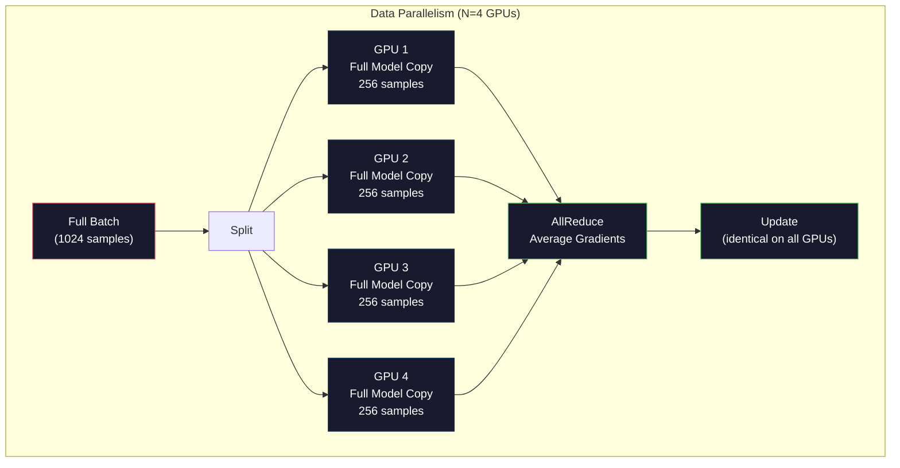
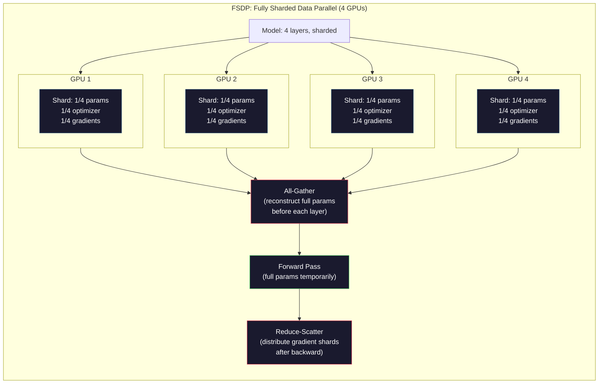
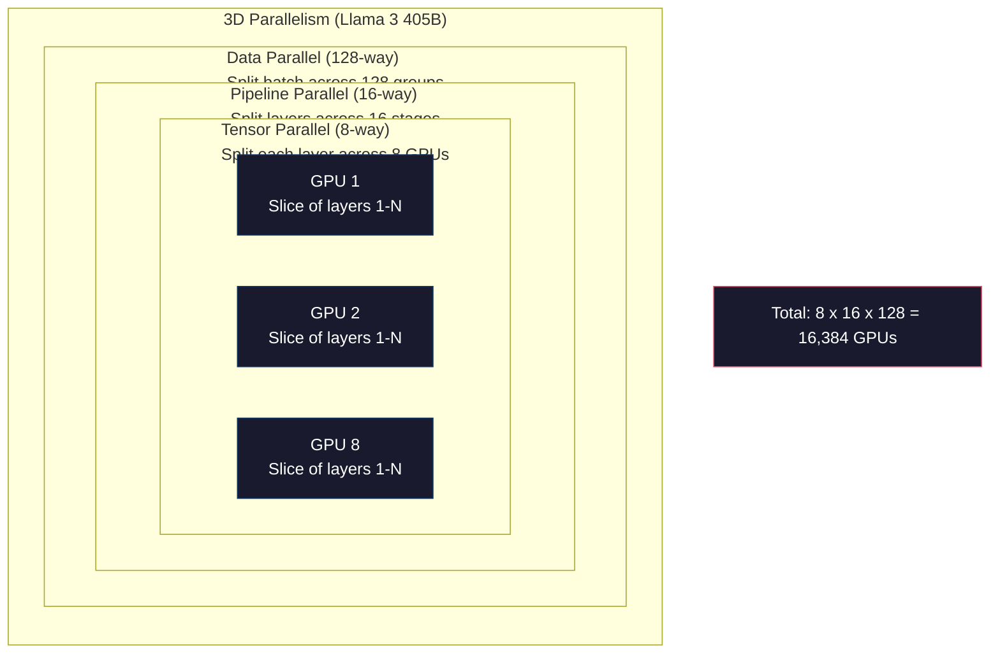

# 스케일링: 분산 학습, FSDP, DeepSpeed

> 124M 모델은 GPU 하나에서 학습되었습니다. 이제 70억 parameter를 시도해보세요. 모델은 메모리에 들어가지 않습니다. 데이터는 단일 machine에서 몇 주가 걸립니다. scale에서 distributed training은 선택 사항이 아닙니다. 유일한 길입니다.

**Type:** Build
**Languages:** Python
**Prerequisites:** Phase 10, Lesson 04 (Pre-Training a Mini GPT)
**Time:** ~120 minutes

## 학습 목표

- model과 cluster size에 따라 세 가지 parallelism(data, tensor, pipeline)이 무엇이고 언제 필요한지 설명합니다
- 여러 GPU 간 gradient synchronization이 있는 PyTorch DDP로 data-parallel training을 구현합니다
- 주어진 model size에 대한 memory budget(weights + optimizer states + gradients + activations)을 계산해 최소 hardware를 결정합니다
- FSDP 또는 DeepSpeed ZeRO stage를 구성해 model state를 GPU에 shard하고 single-GPU memory를 초과하는 모델을 맞춥니다

## 문제

FP16의 7B parameter 모델은 weight만으로 14GB가 필요합니다. Adam optimizer는 모든 parameter에 대해 두 개의 추가 copy(first and second moment estimate)를 저장합니다. 또 28GB입니다. backpropagation 중 gradient가 14GB를 더합니다. activation 하나를 저장하기 전 이미 56GB입니다.

NVIDIA A100은 80GB memory를 가집니다.

80GB 중 56GB를 소비했습니다. activation을 위해 24GB가 남습니다. activation은 forward pass 중 계산되어 backpropagation을 위해 살아 있어야 하는 intermediate value입니다. 4096차원 모델에서 2048-token sequence를 쓰면 단일 layer의 activation이 약 64MB를 사용합니다. 32 layer라면 sample당 2GB가 필요합니다. batch size 8은 16GB가 필요합니다. 남은 것은 24GB입니다. batch size 12는 터집니다.

이제 70B parameter를 시도해보세요. weight만 FP16에서 140GB입니다. GPU 하나에 들어가지 않습니다. weight만 담기 위해서도 최소 A100 2개(2 x 80GB = 160GB)가 필요합니다. optimizer state와 gradient를 더하면 훨씬 더 필요합니다. 최소 3개 이상, 현실적으로는 sharding strategy에 따라 8-16개입니다.

Llama 3 405B는 NVIDIA H100 GPU 16,384개에서 학습되었습니다. training run의 compute cost는 약 1억 달러로 추정됩니다. DeepSeek V3는 architecture(Mixture of Experts는 token당 parameter 일부만 활성화됨)와 training efficiency를 영리하게 활용해 비슷한 모델을 약 560만 달러에 학습했습니다.

이 lesson은 large-scale training을 가능하게 하는 네 가지 strategy를 다룹니다. data parallelism, tensor parallelism, pipeline parallelism, fully sharded data parallelism입니다. distributed training framework를 만지기 전에 각 strategy를 순수 Python으로 simulate해 mechanics를 이해합니다.

## 개념

### Distribution이 필요한 이유

실제 모델의 memory 계산입니다. 모든 숫자는 추정이 아니라 계산된 값입니다.

| Model | Params | Weights (FP16) | Adam States | Gradients (FP16) | Total (no activations) |
|-------|--------|----------------|-------------|------------------|----------------------|
| GPT-2 Small | 124M | 248 MB | 992 MB | 248 MB | 1.5 GB |
| Llama 3 8B | 8B | 16 GB | 64 GB | 16 GB | 96 GB |
| Llama 3 70B | 70B | 140 GB | 560 GB | 140 GB | 840 GB |
| Llama 3 405B | 405B | 810 GB | 3,240 GB | 810 GB | 4,860 GB |

"Adam States" 열이 치명적입니다. Adam은 모든 parameter에 대해 running mean(m)과 running variance(v)를 저장하며 둘 다 FP32입니다. 70B 모델에서는 70B x 4 bytes x 2 = 560GB입니다. optimizer만으로도 A100 일곱 개가 필요합니다.

H100 하나는 80GB를 가집니다. Llama 3 405B는 weight, optimizer, gradient를 담는 데만 최소 61개의 H100이 필요합니다. activation을 더하면 수는 더 늘어납니다. Meta가 16,384개 GPU를 쓴 것은 원해서가 아니라 필요했기 때문입니다.

### Data parallelism

가장 단순한 distributed strategy입니다. 전체 모델을 N개 GPU에 복사합니다. 각 training batch를 N개의 동일한 부분으로 나눕니다. 각 GPU는 자기 data shard에서 forward와 backward pass를 실행합니다. backward pass 이후 모든 GPU에 걸쳐 gradient를 평균냅니다. 모든 GPU는 같은 averaged gradient로 weight copy를 update해 모든 copy를 동기화 상태로 유지합니다.

**장점:** linear throughput scaling입니다. N개 GPU는 step당 N배 많은 데이터를 처리합니다. communication은 gradient averaging으로 제한되며 computation과 overlap됩니다.

**단점:** 모든 GPU가 모델, optimizer state, gradient의 완전한 copy를 보유합니다. 70B 모델에서는 각 GPU에 840GB가 필요합니다. data parallelism은 per-GPU memory를 줄이지 않습니다. training time만 줄입니다.

**계산:** effective batch size = per_gpu_batch_size x N입니다. N=64 GPU이고 per-GPU batch가 16이면 effective batch는 1,024입니다. Llama 3는 step당 1600만 token의 effective batch size를 사용했습니다.



### Tensor parallelism

개별 layer를 GPU에 나눕니다. 단일 matrix multiplication이 GPU들 사이에 분할되고, 각 GPU는 결과의 일부를 계산합니다.

feedforward layer의 shape (8192, 8192) weight matrix를 생각해봅시다. 4-way tensor parallelism에서는 각 GPU가 (8192, 2048) shard를 가집니다. 각 GPU는 입력에 자기 shard를 곱해 partial result를 만듭니다. partial result는 all-reduce 또는 all-gather로 결합되어 full output을 만듭니다.

**장점:** model weight의 per-GPU memory를 줄입니다. 70B 모델을 8개 GPU에 나누면 각 GPU는 약 8.75B parameter worth의 weight를 보유합니다.

**단점:** 모든 layer 뒤에 빠른 GPU 간 communication이 필요합니다. 각 matmul 뒤의 all-reduce가 latency를 더합니다. NVLink(같은 node의 GPU 간 900 GB/s)에서는 잘 작동하지만 InfiniBand(400 Gb/s, 약 50 GB/s)로 연결된 node 간에는 좋지 않습니다. tensor parallelism은 거의 항상 단일 node 내부(8 GPUs)로 제한됩니다.

**실제 사용:** Megatron-LM이 tensor parallelism을 개척했습니다. Llama 3 405B는 각 node 안에서 8-way tensor parallelism을 사용합니다.

### Pipeline parallelism

모델을 layer 기준으로 나눕니다. GPU 1은 layer 1-8을 실행합니다. GPU 2는 layer 9-16을 실행합니다. GPU 3은 layer 17-24를 실행합니다. GPU 4는 layer 25-32를 실행합니다. 데이터는 pipeline을 따라 흐릅니다. GPU 1이 자기 layer를 계산하고 activation을 GPU 2로 보내면, GPU 2가 자기 layer를 계산해 GPU 3으로 보내는 식입니다.

**장점:** GPU 간 communication이 최소입니다. layer boundary의 activation만 보내며, 이는 gradient나 weight에 비해 작습니다. bandwidth 요구사항이 낮아 node 간에도 작동합니다.

**단점:** pipeline bubble입니다. GPU 4가 micro-batch 1의 forward pass를 계산할 때 GPU 1, 2, 3은 이미 자기 부분을 forward했으므로 idle입니다. backward pass에서는 pattern이 반대로 됩니다. naive pipelining에서는 N개 pipeline stage에서 GPU utilization이 1/N에 불과합니다.

**GPipe와 PipeDream**은 batch를 micro-batch로 나눠 bubble 문제를 해결합니다. GPU 1은 micro-batch 1의 forward를 끝내자마자 micro-batch 2를 시작합니다. 이는 pipeline stage 전반의 computation을 overlap합니다. M개 micro-batch와 N개 stage가 있으면 bubble fraction은 (N-1)/M으로 내려갑니다. N=4 stage에서 M=16 micro-batch를 사용하면 bubble은 3/16 = 18.75% idle time입니다.

### FSDP: Fully Sharded Data Parallel

FSDP는 data parallelism의 scalability와 sharding의 memory efficiency를 결합합니다. 각 GPU가 모델의 완전한 copy를 보유하는 대신, 각 GPU는 parameter, gradient, optimizer state의 1/N만 보유합니다.

layer의 forward pass 전에 FSDP는 **all-gather**를 실행해 모든 GPU의 full parameter를 각 GPU memory에 모읍니다. forward pass 후 각 GPU는 non-local parameter를 버립니다. backward 중에는 gradient 계산을 위해 parameter를 재구성하도록 all-gather가 다시 실행됩니다. backward pass 후에는 **reduce-scatter**가 gradient shard를 분배해 각 GPU가 gradient의 1/N만 저장하게 합니다.

**8개 GPU에서 70B 모델 계산:**

| Component | FSDP 없음 | FSDP 사용 |
|-----------|-------------|-----------|
| Weights (FP16) | 140 GB per GPU | 17.5 GB per GPU |
| Adam States (FP32) | 560 GB per GPU | 70 GB per GPU |
| Gradients (FP16) | 140 GB per GPU | 17.5 GB per GPU |
| **Total** | **840 GB per GPU** | **105 GB per GPU** |

FSDP가 없으면 70B 모델은 단일 80GB GPU에 들어가지 않습니다. 8개 GPU에서 FSDP를 사용해도 각 GPU는 105GB를 씁니다. 아직 들어가지 않습니다. per-GPU 80GB 아래로 내려가려면 최소 16개 GPU가 필요하거나, FSDP와 activation checkpointing(activation을 저장하는 대신 backward 중 재계산)을 결합해야 합니다.

각 layer 전에 all-gather가 있으므로 communication cost는 vanilla data parallelism보다 높습니다. 하지만 memory 절감 덕분에 이전에는 불가능했던 training run이 가능해집니다.



### DeepSpeed ZeRO

DeepSpeed의 ZeRO(Zero Redundancy Optimizer)는 개념적으로 FSDP와 동일하지만 Microsoft가 독립적으로 개발했습니다. 세 stage를 정의하며, 각 stage는 더 공격적으로 sharding합니다.

| Stage | Shards | Memory Savings | Communication |
|-------|--------|---------------|---------------|
| ZeRO-1 | Optimizer states only | ~4x reduction | Same as data parallel |
| ZeRO-2 | + Gradients | ~8x reduction | Slightly more |
| ZeRO-3 | + Parameters | ~Nx reduction (N GPUs) | All-gather per layer |

ZeRO-3는 FSDP와 동등합니다. 이름은 다르지만 mechanism은 같습니다. DeepSpeed가 concept을 증명한 뒤 PyTorch는 FSDP를 native implementation으로 추가했습니다.

DeepSpeed는 ZeRO-Offload(더 싸고 큰 CPU RAM으로 optimizer state offload)와 ZeRO-Infinity(NVMe SSD로 offload)도 도입했습니다. 이는 compute speed를 memory capacity와 교환합니다. offloaded operation은 더 느리지만 GPU memory를 비웁니다.

### Mixed precision training

현대 training은 여러 floating-point format을 동시에 사용합니다.

- **Forward pass**: FP16 또는 BF16(16-bit). FP32의 절반 memory입니다. tensor core에서 matmul이 2배 빠르게 실행됩니다.
- **Master weights**: FP32(32-bit). weight update 중 numerical precision을 위해 optimizer가 유지합니다.
- **Loss scaling**: FP16 gradient가 0으로 underflow되는 것을 막기 위해 backward pass 전에 loss에 큰 상수를 곱합니다. optimizer step 전에 같은 상수로 나눕니다.

BF16(Brain Float 16)은 FP32와 같은 exponent range(8 exponent bits)를 가지지만 precision은 낮습니다(7 mantissa bits vs FP32의 23). 같은 값 범위를 표현할 수 있으므로 loss scaling이 거의 필요 없습니다. FP16은 5 exponent bits와 10 mantissa bits를 가집니다. 세밀한 값은 표현할 수 있지만 극단적인 magnitude에서는 overflow/underflow됩니다.

Google TPU는 BF16을 native로 사용합니다. NVIDIA A100과 H100은 FP16과 BF16을 모두 지원합니다. loss scaling 문제를 없애기 때문에 업계는 대체로 BF16으로 이동했습니다.

**7B 모델의 memory 비교:**

| Precision | Weights | Optimizer | Gradients | Total |
|-----------|---------|-----------|-----------|-------|
| FP32 everywhere | 28 GB | 56 GB | 28 GB | 112 GB |
| Mixed (BF16 + FP32 master) | 14 GB | 56 GB | 14 GB | 84 GB |

mixed precision은 이 모델에서 28GB를 절약합니다. optimizer state는 precision과 무관하게 FP32에 머뭅니다. memory 대부분이 여기에 들어갑니다.

### Megatron-LM과 3D Parallelism

실제 large-scale training은 세 parallelism을 모두 결합합니다.

- node group 전반의 **data parallelism**(batch size scale)
- node 내부의 **tensor parallelism**(8개 GPU에 layer 분할)
- node 전반의 **pipeline parallelism**(machine에 layer group 분할)

16,384개 H100에서의 Llama 3 405B:
- 각 node 내부 8-way tensor parallelism(node당 8 GPU)
- node 전반 16-way pipeline parallelism(16 pipeline stages)
- 남은 dimension 전반 128-way data parallelism(16,384 / 8 / 16 = 128)

이 3D decomposition(8 x 16 x 128 = 16,384)이 수천 GPU로 scale하는 방법입니다. 각 GPU는 서로 다른 data shard를 보고(data parallel), 각 layer의 한 slice를 보유하며(tensor parallel), 서로 다른 layer set을 계산합니다(pipeline parallel).

DeepSeek V3는 다른 접근을 취했습니다. Mixture of Experts architecture는 token당 671B parameter 중 37B만 활성화합니다. 이는 각 GPU가 active parameter만 계산하고 그에 대한 activation만 저장하면 된다는 뜻입니다. 이들은 2,048개 H800 GPU, 즉 Meta GPU 수의 1/8 미만으로 학습했고 비용은 Meta 추정 1억 달러 대비 560만 달러였습니다.



```figure
paged-kv-cache
```

## 직접 만들기

### 1단계: Data Parallelism Simulation

batch를 simulated GPU에 나눕니다. 각 GPU는 자기 shard에서 forward pass를 계산합니다. "gradient"를 평균냅니다(여기서는 loss value로 simulate합니다).

```python
import numpy as np

def simulate_data_parallelism(data, num_gpus, model_fn):
    batch_size = len(data)
    shard_size = batch_size // num_gpus
    remainder = batch_size % num_gpus

    gpu_losses = []
    gpu_gradients = []

    offset = 0
    for gpu_id in range(num_gpus):
        extra = 1 if gpu_id < remainder else 0
        shard = data[offset:offset + shard_size + extra]
        offset += shard_size + extra

        loss, grad = model_fn(shard)
        gpu_losses.append(loss)
        gpu_gradients.append(grad)

    avg_loss = np.mean(gpu_losses)
    avg_gradient = np.mean(gpu_gradients, axis=0)

    return avg_loss, avg_gradient
```

all-reduce operation(gradient averaging)은 data parallelism의 유일한 communication입니다. 실제로는 NVIDIA GPU에서 NCCL library를 사용하며, 이는 ring all-reduce를 구현합니다. 각 GPU는 gradient의 1/N을 이웃에게 보내고 다른 이웃에게서 1/N을 받으며, N-1 step 뒤 모든 GPU가 완전한 평균을 갖습니다. 총 communication volume은 2 x gradient_size x (N-1)/N이며, N이 커지면 gradient size의 2배에 가까워집니다.

### 2단계: Tensor Parallelism Simulation

weight matrix를 GPU에 나눕니다. 각 GPU는 partial matrix multiplication을 계산합니다. 결과를 결합합니다.

```python
def simulate_tensor_parallelism(input_data, weight_matrix, num_gpus):
    d_in, d_out = weight_matrix.shape
    assert d_out % num_gpus == 0, f"d_out {d_out} not divisible by num_gpus {num_gpus}"
    shard_size = d_out // num_gpus

    partial_results = []
    for gpu_id in range(num_gpus):
        start = gpu_id * shard_size
        end = start + shard_size
        weight_shard = weight_matrix[:, start:end]

        partial = input_data @ weight_shard
        partial_results.append(partial)

    full_output = np.concatenate(partial_results, axis=-1)

    direct_output = input_data @ weight_matrix
    error = np.abs(full_output - direct_output).max()

    return full_output, error
```

error는 정확히 0 또는 machine epsilon이어야 합니다. tensor parallelism은 수학적으로 exact합니다. 하나의 GPU에서 full matmul을 계산한 것과 같은 결과를 만듭니다. output dimension을 따라 split하므로 각 GPU는 서로 다른 column chunk를 만들고, concatenation이 full result를 재구성합니다.

column-parallel linear layer(output dimension 분할)에서는 concatenate합니다. row-parallel(input dimension 분할)에서는 sum합니다. transformer FFN에서 첫 linear(expand)는 column-parallel을, 두 번째 linear(contract)는 row-parallel을 사용합니다. 이는 두 layer 사이의 all-reduce를 피합니다.

### 3단계: Pipeline Parallelism Simulation

모델 layer를 virtual GPU에 나눕니다. later stage가 계산하는 동안 early stage가 idle인 bubble problem을 보여줍니다.

```python
def simulate_pipeline_parallelism(num_layers, num_stages, num_microbatches):
    layers_per_stage = num_layers // num_stages

    timeline = {}
    clock = 0

    for mb in range(num_microbatches):
        for stage in range(num_stages):
            start_time = max(
                timeline.get((stage, mb - 1, "fwd"), (0, 0))[1] if mb > 0 else 0,
                timeline.get((stage - 1, mb, "fwd"), (0, 0))[1] if stage > 0 else 0,
            )
            end_time = start_time + layers_per_stage
            timeline[(stage, mb, "fwd")] = (start_time, end_time)

    last_fwd_end = max(v[1] for v in timeline.values())

    for mb in range(num_microbatches - 1, -1, -1):
        for stage in range(num_stages - 1, -1, -1):
            deps = [last_fwd_end]
            if mb < num_microbatches - 1 and (stage, mb + 1, "bwd") in timeline:
                deps.append(timeline[(stage, mb + 1, "bwd")][1])
            if stage < num_stages - 1 and (stage + 1, mb, "bwd") in timeline:
                deps.append(timeline[(stage + 1, mb, "bwd")][1])
            start_time = max(deps)
            end_time = start_time + layers_per_stage
            timeline[(stage, mb, "bwd")] = (start_time, end_time)

    total_time = max(v[1] for v in timeline.values())
    compute_time = num_microbatches * num_stages * layers_per_stage * 2
    bubble_fraction = 1.0 - compute_time / (total_time * num_stages)

    return timeline, total_time, bubble_fraction
```

4개 stage와 1개 micro-batch에서는 bubble fraction이 75%입니다. 어떤 시점에도 네 GPU 중 세 개가 idle입니다. 16개 micro-batch에서는 약 19%로 내려갑니다. bubble을 제거하는 비용은 memory입니다. 동시에 진행 중인 모든 micro-batch의 activation을 저장해야 합니다.

### 4단계: Memory Calculator

어떤 model size든 training에 필요한 정확한 memory requirement를 계산합니다.

```python
def memory_calculator(
    params_billions,
    precision_bytes=2,
    optimizer="adam",
    num_gpus=1,
    sharding="none",
    sequence_length=2048,
    batch_size_per_gpu=1,
    hidden_dim=None,
    num_layers=None,
):
    params = params_billions * 1e9

    weight_memory = params * precision_bytes

    if optimizer == "adam":
        optimizer_memory = params * 4 * 2
    elif optimizer == "sgd":
        optimizer_memory = params * 4
    else:
        optimizer_memory = 0

    gradient_memory = params * precision_bytes

    total_no_activation = weight_memory + optimizer_memory + gradient_memory

    if hidden_dim and num_layers:
        activation_per_layer = (
            sequence_length * batch_size_per_gpu * hidden_dim * precision_bytes * 4
        )
        activation_memory = activation_per_layer * num_layers
    else:
        activation_memory = params * precision_bytes * 0.5

    if sharding == "fsdp" or sharding == "zero3":
        weight_memory /= num_gpus
        optimizer_memory /= num_gpus
        gradient_memory /= num_gpus
    elif sharding == "zero2":
        optimizer_memory /= num_gpus
        gradient_memory /= num_gpus
    elif sharding == "zero1":
        optimizer_memory /= num_gpus

    per_gpu_total = weight_memory + optimizer_memory + gradient_memory + activation_memory

    return {
        "params_billions": params_billions,
        "weights_gb": weight_memory / 1e9,
        "optimizer_gb": optimizer_memory / 1e9,
        "gradients_gb": gradient_memory / 1e9,
        "activations_gb": activation_memory / 1e9,
        "per_gpu_total_gb": per_gpu_total / 1e9,
        "total_across_gpus_gb": per_gpu_total * num_gpus / 1e9,
        "fits_on_80gb": per_gpu_total / 1e9 <= 80,
        "num_gpus": num_gpus,
        "sharding": sharding,
    }
```

이 calculator는 모든 ML engineer가 묻는 질문에 답합니다. "GPU가 몇 개 필요한가?" model size를 넣고 들어가는지 확인하세요. per-GPU total이 80GB 아래로 내려갈 때까지 sharding strategy를 조정합니다.

### 5단계: Mixed Precision Simulation

FP32, FP16, mixed precision training의 memory usage를 비교합니다.

```python
def mixed_precision_comparison(params_billions):
    params = params_billions * 1e9

    fp32_weights = params * 4
    fp32_optimizer = params * 4 * 2
    fp32_gradients = params * 4
    fp32_total = fp32_weights + fp32_optimizer + fp32_gradients

    fp16_weights = params * 2
    fp16_master = params * 4
    fp16_optimizer = params * 4 * 2
    fp16_gradients = params * 2
    fp16_total = fp16_weights + fp16_master + fp16_optimizer + fp16_gradients

    mixed_weights = params * 2
    mixed_optimizer = params * 4 * 2
    mixed_gradients = params * 2
    mixed_total = mixed_weights + mixed_optimizer + mixed_gradients

    return {
        "fp32_total_gb": fp32_total / 1e9,
        "fp16_with_master_gb": fp16_total / 1e9,
        "mixed_bf16_gb": mixed_total / 1e9,
        "savings_vs_fp32": 1 - mixed_total / fp32_total,
    }
```

대부분의 사람에게 가장 놀라운 점은 mixed precision이 memory를 절반으로 줄이지 않는다는 것입니다. optimizer state(Adam의 m과 v)는 precision과 무관하게 FP32에 머뭅니다. 7B 모델에서 FP32 training은 112GB를 사용합니다. mixed precision은 84GB를 사용합니다. 50%가 아니라 25% 절감입니다. optimizer가 지배합니다.

## 활용하기

### 모든 Simulation 실행

```python
def run_all_demos():
    print("=" * 70)
    print("DATA PARALLELISM SIMULATION")
    print("=" * 70)

    np.random.seed(42)
    data = np.random.randn(64, 32)
    weight = np.random.randn(32, 16)

    def model_fn(batch):
        output = batch @ weight
        loss = np.mean(output ** 2)
        grad = 2 * batch.T @ (batch @ weight) / len(batch)
        return loss, grad

    for n_gpus in [1, 2, 4, 8]:
        loss, grad = simulate_data_parallelism(data, n_gpus, model_fn)
        print(f"  {n_gpus} GPUs: loss={loss:.4f}, grad_norm={np.linalg.norm(grad):.4f}")

    print()
    print("=" * 70)
    print("TENSOR PARALLELISM SIMULATION")
    print("=" * 70)

    x = np.random.randn(4, 8192)
    W = np.random.randn(8192, 8192)

    for n_gpus in [1, 2, 4, 8]:
        output, error = simulate_tensor_parallelism(x, W, n_gpus)
        print(f"  {n_gpus} GPUs: output_shape={output.shape}, max_error={error:.2e}")

    print()
    print("=" * 70)
    print("PIPELINE PARALLELISM SIMULATION")
    print("=" * 70)

    for n_mb in [1, 4, 8, 16, 32]:
        _, total_t, bubble = simulate_pipeline_parallelism(32, 4, n_mb)
        print(f"  {n_mb:2d} micro-batches: total_time={total_t:4d}, bubble={bubble:.1%}")

    print()
    print("=" * 70)
    print("MEMORY CALCULATOR")
    print("=" * 70)

    configs = [
        (7, "none", 1),
        (7, "fsdp", 8),
        (70, "none", 1),
        (70, "fsdp", 8),
        (70, "fsdp", 16),
        (405, "fsdp", 64),
        (405, "fsdp", 128),
    ]

    print(f"  {'Model':>8} {'Sharding':>8} {'GPUs':>5} {'Per-GPU':>10} {'Fits 80GB':>10}")
    print("  " + "-" * 50)
    for params, shard, gpus in configs:
        result = memory_calculator(params, num_gpus=gpus, sharding=shard)
        fits = "Yes" if result["fits_on_80gb"] else "No"
        print(f"  {params:>6}B {shard:>8} {gpus:>5} {result['per_gpu_total_gb']:>8.1f}GB {fits:>10}")

    print()
    print("=" * 70)
    print("MIXED PRECISION COMPARISON")
    print("=" * 70)

    for params_b in [7, 13, 70, 405]:
        result = mixed_precision_comparison(params_b)
        print(f"  {params_b}B: FP32={result['fp32_total_gb']:.0f}GB, "
              f"Mixed BF16={result['mixed_bf16_gb']:.0f}GB, "
              f"Savings={result['savings_vs_fp32']:.0%}")
```

## 산출물

이 lesson은 `outputs/prompt-distributed-training-planner.md`를 산출합니다. model size와 available hardware를 받아 parallelism strategy, memory budget, communication overhead, expected throughput을 포함한 완전한 distributed training plan을 만드는 prompt입니다.

## 연습문제

1. activation checkpointing을 포함하도록 memory calculator를 수정하세요. checkpointing에서는 매 K번째 layer의 activation만 저장합니다(일반적인 K=1은 모두 재계산한다는 뜻). memory-compute tradeoff를 보여주세요. checkpointing은 memory를 얼마나 절약하고, training을 얼마나 느리게 하나요(full checkpointing은 대략 33% 더 많은 compute)?

2. pipeline parallelism simulation을 확장해 PipeDream이 사용하는 1F1B(one forward, one backward) schedule을 구현하세요. 4 stage와 8 micro-batch에서 naive schedule과 bubble fraction을 비교하세요. 1F1B schedule은 backward pass를 더 일찍 시작하므로 peak memory가 더 작아야 합니다.

3. gradient accumulation simulator를 구현하세요. 모든 micro-batch 뒤에 all-reduce하는 대신, K step 동안 local로 gradient를 accumulate한 뒤 all-reduce합니다. 이것이 communication을 K배 줄이면서도 동일한 final gradient, 따라서 동일한 training을 만드는 방식을 보여주세요.

4. cost estimator를 만드세요. model size, target token count, GPU type(A100 $2/hr, H100 $3.50/hr), parallelism strategy가 주어졌을 때 총 training cost를 달러로 추정하세요. 알려진 비용으로 검증하세요. Llama 3 405B는 약 $100M, DeepSeek V3는 약 $5.6M으로 보고되었습니다.

5. memory calculator에 ZeRO-Offload를 추가하세요. CPU RAM은 node당 512GB, NVMe는 2TB라고 가정합니다. optimizer state를 CPU로 offload하면 optimizer step이 30-50% 느려지는 대신 70B 모델을 16개가 아니라 4개 GPU에서 학습할 수 있음을 보여주세요.

## 핵심 용어

| 용어 | 흔히 하는 말 | 실제 의미 |
|------|----------------|----------------------|
| Data parallelism | "모델을 모든 GPU에 복사" | 각 GPU가 다른 data shard를 처리하고, 각 step 뒤 gradient를 all-reduce로 평균냅니다 |
| Tensor parallelism | "layer를 GPU에 나눔" | 각 GPU가 matmul의 일부를 계산하도록 weight matrix를 분할합니다. 빠른 NVLink interconnect가 필요합니다 |
| Pipeline parallelism | "layer를 GPU에 나눔" | 각 GPU가 서로 다른 layer group을 실행합니다. data는 micro-batch와 함께 pipeline을 흘러 bubble을 줄입니다 |
| FSDP | "모든 것을 shard" | Fully Sharded Data Parallel입니다. 각 GPU가 weight, gradient, optimizer state의 1/N을 보유하고 compute 전에 all-gather합니다 |
| ZeRO | "DeepSpeed의 FSDP 버전" | 3 stage의 Zero Redundancy Optimizer입니다. optimizer shard(Stage 1), + gradient(Stage 2), + parameter(Stage 3) |
| All-reduce | "GPU 간 평균" | 모든 GPU가 모든 GPU 입력의 sum 또는 average를 갖게 되는 collective operation입니다. 보통 ring all-reduce로 구현됩니다 |
| All-gather | "모든 GPU에서 수집" | 모든 GPU가 모든 GPU data의 concatenation을 갖게 되는 collective operation입니다. FSDP에서 full parameter 재구성에 사용됩니다 |
| Reduce-scatter | "합산 후 분배" | data를 reduce(sum)하고 서로 다른 chunk를 서로 다른 GPU에 scatter하는 collective operation입니다. FSDP의 gradient sharding에 사용됩니다 |
| Mixed precision | "half precision으로 학습" | forward/backward에는 FP16/BF16을, optimizer state에는 FP32를 사용합니다. optimizer가 지배하므로 50%가 아니라 약 25% memory를 절약합니다 |
| Pipeline bubble | "pipeline의 idle time" | GPU가 이전 stage의 data를 기다리며 idle인 시간 비율입니다. 더 많은 micro-batch로 줄입니다 |

## 더 읽을거리

- [Rajbhandari et al., 2020 -- "ZeRO: Memory Optimizations Toward Training Trillion Parameter Models"](https://arxiv.org/abs/1910.02054) -- 세 sharding stage를 정의한 DeepSpeed ZeRO 논문
- [Shoeybi et al., 2020 -- "Megatron-LM: Training Multi-Billion Parameter Language Models Using Model Parallelism"](https://arxiv.org/abs/1909.08053) -- transformer를 위한 NVIDIA의 tensor parallelism
- [Narayanan et al., 2021 -- "Efficient Large-Scale Language Model Training on GPU Clusters Using Megatron-LM"](https://arxiv.org/abs/2104.04473) -- data, tensor, pipeline을 결합한 3D parallelism
- [Zhao et al., 2023 -- "PyTorch FSDP: Experiences on Scaling Fully Sharded Data Parallel"](https://arxiv.org/abs/2304.11277) -- PyTorch의 native FSDP implementation
- [Llama 3 Technical Report](https://arxiv.org/abs/2407.21783) -- 3D parallelism을 사용한 16,384 GPU training 세부사항
- [DeepSeek-V3 Technical Report](https://arxiv.org/abs/2412.19437) -- MoE architecture가 training cost를 한 자릿수 규모로 줄이는 방법
