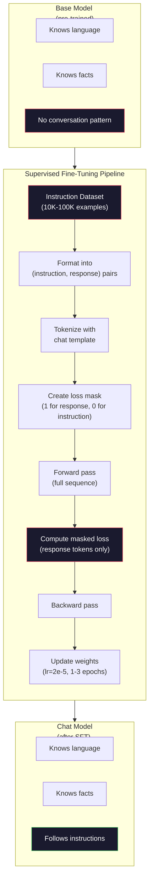

# 지시 튜닝(SFT)

> base model은 다음 token을 예측합니다. 그게 전부입니다. 지시를 따르거나, 질문에 답하거나, 유해한 요청을 거절하지 않습니다. SFT는 token predictor와 유용한 assistant 사이의 다리입니다. 여러분이 대화해본 모든 모델, Claude, GPT, Llama Chat은 이 단계를 거쳤습니다.

**Type:** Build
**Languages:** Python (with numpy)
**Prerequisites:** Phase 10, Lesson 04 (Pre-Training a Mini GPT)
**Time:** ~90 minutes

## 학습 목표

- base language model을 instruction-following assistant로 변환하는 supervised fine-tuning(SFT)을 구현합니다
- system, user, assistant role이 있는 chat template으로 training data를 format하고 non-assistant token의 loss를 mask합니다
- SFT가 필요한 이유를 설명합니다. base model은 질문에 답하기보다 텍스트를 이어 씁니다
- held-out instruction set에서 base model과 fine-tuned model response를 비교해 SFT 품질을 평가합니다

## 문제

Lesson 04에서 모델을 학습했습니다. sequence가 주어지면 다음 token을 예측할 수 있습니다. "The transformer architecture"를 넣으면 "has revolutionized natural language processing."으로 이어 쓸 수 있습니다. next-token predictor로서는 인상적입니다.

이제 이렇게 해보세요. "What is the capital of France?"를 넣습니다. base model은 "Paris"라고 답하지 않습니다. pattern을 이어 씁니다. 질문 list가 포함된 문서에서 학습했기 때문에 "What is the capital of Germany? What is the capital of Spain?"을 만들 수도 있습니다. 또는 그럴듯한 next-token continuation인 "is a question that many people ask"를 만들 수도 있습니다. 모델에는 *답하기*라는 개념이 없습니다. *이어 쓰기*만 압니다.

이것이 GPT-3(base model, 2020년 6월 공개)와 ChatGPT(instruction-tuned, 2022년 11월 공개)의 차이입니다. 같은 architecture입니다. 같은 pre-training입니다. 차이는 모델이 conversation pattern을 따르도록 가르친 20,000-100,000개의 정교하게 만든 (instruction, response) pair입니다.

Stanford Alpaca는 수백만 개 example이 필요하지 않다는 것을 증명했습니다. 2023년 3월, 이들은 GPT-3.5가 생성한 instruction-response pair 52,000개만으로 Llama 7B를 fine-tuning했습니다. 총 비용은 600달러였습니다. 결과는 지시를 따르고, 질문에 답하고, 대화할 수 있는 chatbot이었습니다. ChatGPT만큼 좋지는 않았지만 600달러와 몇 시간 training으로는 놀라울 만큼 가까웠습니다.

Meta의 Llama 2 Chat은 초기 SFT stage에 약 27,000개의 고품질 example만 사용했습니다. 핵심 통찰은 품질이 양보다 중요하다는 것입니다. 숙련된 annotator가 작성한 27,000개 example은 인터넷에서 scraping한 noisy example 100만 개를 이깁니다.

## 개념

### SFT가 실제로 하는 일

Supervised Fine-Tuning은 pre-training과 같은 training loop, 즉 forward pass, loss 계산, backward pass, weight update를 계속합니다. 다만 데이터 종류가 다릅니다. raw text 대신 structured conversation으로 학습합니다.

```json
{
  "system": "You are a helpful assistant.",
  "user": "What is the capital of France?",
  "assistant": "The capital of France is Paris."
}
```

모델은 이미 Paris가 France의 capital이라는 것을 알고 있습니다. Wikipedia, textbook, web page에서 pre-training하며 배웠습니다. SFT는 모델에게 새 fact를 가르치지 않습니다. 새 *behavior*를 가르칩니다. 질문을 보면 답을 생성하라. instruction을 보면 completion을 생성하라. harmful request를 보면 refusal을 생성하라.

이렇게 생각하면 됩니다. pre-training은 모델에게 knowledge를 줍니다. SFT는 모델에게 manners를 줍니다.

### 데이터 형식

업계에서는 세 형식이 지배적입니다. 각각은 같은 정보, 즉 누가 무엇을 말했는지를 서로 다른 delimiter로 encode합니다.

**Alpaca Format** (Stanford, 2023년 3월):

```json
{
  "instruction": "Summarize the following article in 3 sentences.",
  "input": "The European Central Bank raised interest rates...",
  "output": "The ECB increased rates by 25 basis points..."
}
```

단순하고 널리 쓰입니다. `input` field는 optional입니다. 많은 instruction에는 추가 context가 필요 없습니다. Stanford는 GPT-3.5로 600달러에 생성한 이 형식의 example 52,000개를 공개했습니다. 이것이 open-source instruction tuning movement를 촉발했습니다.

**ShareGPT Format** (community, 2023):

```json
{
  "conversations": [
    {"from": "system", "value": "You are a helpful assistant."},
    {"from": "human", "value": "What causes tides?"},
    {"from": "gpt", "value": "Tides are caused by the gravitational pull of the Moon..."},
    {"from": "human", "value": "How often do they occur?"},
    {"from": "gpt", "value": "Most coastal areas experience two high tides and two low tides per day..."}
  ]
}
```

multi-turn conversation을 지원합니다. "from" field는 실제 모델과 관계없이 convention상 "human"과 "gpt"를 사용합니다. Vicuna는 사용자가 공유한 ChatGPT transcript에서 scraping한 70,000개 ShareGPT conversation으로 학습되었습니다.

**ChatML Format** (OpenAI, 많은 open-source model이 사용):

```text
<|im_start|>system
You are a helpful assistant.<|im_end|>
<|im_start|>user
What is the capital of France?<|im_end|>
<|im_start|>assistant
The capital of France is Paris.<|im_end|>
```

special token(`<|im_start|>`, `<|im_end|>`)으로 role을 delimiter합니다. 이 token들은 fine-tuning 중 tokenizer vocabulary에 추가됩니다. Qwen, Yi, 그 밖의 많은 모델이 ChatML을 사용합니다.

세 형식은 모두 같은 일을 합니다. 모델에게 "이것이 instruction이고, 이것이 response이니, 이 pattern을 학습하라"고 알려줍니다.

### 왜 작동하는가

모델은 pre-training으로 이미 언어를 압니다. 질문 뒤에 답이 오는 예, instruction 뒤에 completion이 오는 예, 사람들 사이의 대화를 수십억 번 보았습니다. pattern은 이미 weight에 encode되어 있습니다.

SFT는 이 latent ability를 집중시킵니다. 모델이 context에서 질문에 답해야 하는지 문서를 이어 써야 하는지 알아내야 하는 대신, SFT는 conversation pattern을 명시적으로 학습합니다. 몇천 개 example 뒤 모델은 배웁니다. assistant role marker를 보면 helpful response를 생성하라.

이것이 27,000개 example이면 충분한 이유입니다. 모델에게 영어를 가르치는 것이 아닙니다. 세상에 대한 fact를 가르치는 것도 아닙니다. 단순한 behavior 하나, instruction에 response하는 법을 가르칩니다. knowledge는 이미 있었습니다.

### Masked loss

이것은 SFT에서 가장 중요한 technical detail이며, 대부분의 tutorial이 건너뜁니다.

pre-training 중에는 모든 token에서 loss를 계산합니다. 모델은 sequence의 모든 next token을 예측하도록 학습합니다. SFT 중에는 *response* token에서만 loss를 계산합니다. instruction token은 context를 위해 존재하지만, 모델이 그것들을 잘못 "predict"했다고 penalize하지 않습니다.

왜일까요? 모델이 instruction을 *생성*하는 법을 배우길 원하지 않기 때문입니다. instruction에 *응답*하는 법을 배우길 원합니다. instruction token에서 loss를 계산하면, 모델이 마치 질문하는 주체인 것처럼 "What is the capital of France?"를 예측하도록 학습하는 셈입니다. 이는 gradient signal을 낭비하고 모델의 role을 혼란스럽게 할 수 있습니다.

실제로는 loss mask를 만듭니다. response token은 1, instruction token은 0입니다. 평균을 내기 전에 per-token loss에 이 mask를 곱합니다.

```text
Tokens:    [SYS] You are helpful [USER] What is the capital? [ASST] Paris is the capital [EOS]
Loss mask:   0    0    0     0      0     0   0  0     0       1     1    1   1     1      1
```

`[ASST]` 뒤 token만 loss에 기여합니다. 모델은 forward pass 중 전체 conversation을 봅니다(올바른 response를 만들려면 instruction이 필요합니다). 하지만 weight update는 response를 얼마나 잘 예측했는지에만 기반합니다.

### Training hyperparameter

SFT는 pre-training과 완전히 다른 hyperparameter를 사용합니다. 처음부터 학습하는 것이 아닙니다. 이미 작동하는 모델을 조정하는 것입니다.

| Parameter | Pre-training(Llama 2 7B) | SFT(Llama 2 Chat) |
|-----------|---------------------------|---------------------|
| Learning rate | 3e-4 (peak) | 2e-5 |
| Epochs | 1 (single pass over data) | 2 |
| Batch size | 4M tokens | 64 examples |
| Warmup steps | 2,000 | 0-100 |
| Weight decay | 0.1 | 0.0-0.1 |
| Data size | 2T tokens | 27,000 examples |

SFT의 learning rate는 15배 낮습니다. 이는 중요합니다. fine-tuning 중 높은 learning rate는 pre-trained knowledge를 파괴합니다. 모델은 배운 것을 "잊고" 작은 fine-tuning dataset에 overfit됩니다. 이것이 catastrophic forgetting입니다.

두 epoch는 모델이 각 training example을 두 번 본다는 뜻입니다. 작은 dataset에서 3 epoch를 넘기면 memorization으로 이어집니다. 모델이 generalize하는 대신 training example을 그대로 재현하기 시작합니다.

### Catastrophic forgetting

fine-tuning은 일반 능력을 파괴할 수 있습니다. instruction-following data로 너무 오래 학습하면 모델은 code 작성, math, creative text 생성 능력을 잃습니다. training data의 특정 format에는 매우 능숙해지고 나머지에는 형편없어집니다.

세 가지 완화책이 있습니다.

1. **낮은 learning rate.** 1e-5-5e-5. update가 작을수록 pre-trained feature 파괴가 적습니다.

2. **짧은 training.** 1-3 epochs. 모델이 overfit되기 전에 멈춥니다.

3. **pre-training data 섞기.** Llama 2 Chat은 SFT dataset에 작은 비율(2-5%)의 raw pre-training data를 섞었습니다. 이는 새 instruction-following behavior를 배우는 동안 모델에게 일반 능력을 "상기"시킵니다.

### 실제 숫자

10,000개의 고품질 instruction pair로 7B 모델을 fine-tuning하는 데는 단일 NVIDIA A100 80GB GPU에서 약 1시간이 걸립니다. 계산은 다음과 같습니다.

- 10,000 examples x 평균 512 tokens = 5.12M tokens
- 2 epochs = 총 10.24M tokens
- 7B model fine-tuning의 A100 throughput: 약 3,000 tokens/second
- 10.24M / 3,000 = 약 3,400초 = 약 57분

우리의 mini GPT(4 layers, 128 dims)에서는 training이 거의 즉시 끝납니다. 핵심은 scale이 아니라 mechanics를 이해하는 것입니다.



## 직접 만들기

### 1단계: Instruction Dataset

synthetic instruction dataset을 만듭니다. production에서는 Scale AI나 Anthropic 같은 회사가 human annotator를 고용해 이를 작성합니다. 여기서는 format을 보여주기 위해 programmatically 생성합니다.

```python
import numpy as np

INSTRUCTION_DATA = [
    {
        "instruction": "What is the capital of France?",
        "response": "The capital of France is Paris."
    },
    {
        "instruction": "Explain gravity in one sentence.",
        "response": "Gravity is the force that attracts objects with mass toward each other."
    },
    {
        "instruction": "Write a haiku about the ocean.",
        "response": "Waves crash on the shore, salt and foam beneath the sun, endless blue expanse."
    },
    {
        "instruction": "What is 15 multiplied by 7?",
        "response": "15 multiplied by 7 is 105."
    },
    {
        "instruction": "Name three programming languages.",
        "response": "Three programming languages are Python, Rust, and TypeScript."
    },
    {
        "instruction": "Summarize photosynthesis.",
        "response": "Photosynthesis converts sunlight, water, and carbon dioxide into glucose and oxygen."
    },
    {
        "instruction": "What year did World War II end?",
        "response": "World War II ended in 1945."
    },
    {
        "instruction": "Define machine learning.",
        "response": "Machine learning is a field where algorithms learn patterns from data to make predictions."
    },
]
```

8개 example은 매우 작습니다. Stanford Alpaca는 52,000개를 사용했습니다. 하지만 8개든 52,000개든 mechanics는 같습니다. tokenization하고, mask를 만들고, response에서만 loss를 계산합니다.

### Step 2: Chat Template으로 Tokenize

instruction-response pair를 special role marker가 있는 token sequence로 변환합니다. marker는 instruction이 어디서 끝나고 response가 어디서 시작되는지 모델에게 알려줍니다.

```python
SPECIAL_TOKENS = {
    "INST_START": 253,
    "INST_END": 254,
    "RESP_START": 255,
}


def tokenize_instruction_pair(instruction, response, vocab_size=256):
    inst_tokens = list(instruction.encode("utf-8"))
    resp_tokens = list(response.encode("utf-8"))

    inst_tokens = [min(t, vocab_size - 4) for t in inst_tokens]
    resp_tokens = [min(t, vocab_size - 4) for t in resp_tokens]

    tokens = (
        [SPECIAL_TOKENS["INST_START"]]
        + inst_tokens
        + [SPECIAL_TOKENS["INST_END"]]
        + [SPECIAL_TOKENS["RESP_START"]]
        + resp_tokens
    )

    return tokens


def create_loss_mask(tokens):
    mask = np.zeros(len(tokens), dtype=np.float32)
    in_response = False

    for i, token in enumerate(tokens):
        if token == SPECIAL_TOKENS["RESP_START"]:
            in_response = True
            continue
        if in_response:
            mask[i] = 1.0

    return mask
```

loss mask는 instruction token에는 모두 0, response token에는 모두 1입니다. `RESP_START` token 자체는 response content가 아니라 delimiter이므로 mask 0을 받습니다.

### 3단계: Masked Cross-Entropy Loss

표준 cross-entropy이지만 loss mask를 곱합니다. response token만 gradient에 기여합니다.

```python
def masked_cross_entropy_loss(logits, targets, loss_mask):
    batch, seq_len, vocab_size = logits.shape
    logits_flat = logits.reshape(-1, vocab_size)
    targets_flat = targets.reshape(-1)
    mask_flat = loss_mask.reshape(-1)

    max_logits = logits_flat.max(axis=-1, keepdims=True)
    log_softmax = logits_flat - max_logits - np.log(
        np.exp(logits_flat - max_logits).sum(axis=-1, keepdims=True)
    )

    per_token_loss = -log_softmax[np.arange(len(targets_flat)), targets_flat]

    masked_loss = per_token_loss * mask_flat
    num_response_tokens = mask_flat.sum()
    if num_response_tokens == 0:
        return 0.0
    loss = masked_loss.sum() / num_response_tokens

    return loss
```

분모는 `seq_len`이 아니라 `num_response_tokens`입니다. 전체 sequence length로 나누면 긴 instruction이 gradient signal을 희석합니다. response token 수로 나누면 instruction 길이와 무관하게 response token당 동일한 weight를 보장합니다.

### 4단계: SFT Training Loop

Lesson 04의 MiniGPT를 재사용합니다. training loop는 pre-training과 거의 동일하지만 instruction formatting과 masked loss가 추가됩니다.

```python
import sys
import os
sys.path.insert(0, os.path.join(os.path.dirname(__file__), "..", "..", "04-pre-training-mini-gpt", "code"))
from main import MiniGPT, LayerNorm, FeedForward, MultiHeadAttention, TransformerBlock, Embedding


def sft_train(model, dataset, num_epochs=2, lr=2e-5, seq_len=64):
    formatted_data = []
    for example in dataset:
        tokens = tokenize_instruction_pair(example["instruction"], example["response"])
        mask = create_loss_mask(tokens)
        formatted_data.append((tokens, mask))

    print(f"SFT Training: {len(formatted_data)} examples, {num_epochs} epochs, lr={lr}")
    print(f"Total tokens: {sum(len(t) for t, _ in formatted_data):,}")
    print()

    losses = []

    for epoch in range(num_epochs):
        epoch_loss = 0.0
        num_batches = 0

        indices = np.random.permutation(len(formatted_data))

        for idx in indices:
            tokens, mask = formatted_data[idx]

            if len(tokens) < 3:
                continue
            if len(tokens) > seq_len:
                tokens = tokens[:seq_len]
                mask = mask[:seq_len]

            input_ids = np.array(tokens[:-1]).reshape(1, -1)
            target_ids = np.array(tokens[1:]).reshape(1, -1)
            loss_mask = np.array(mask[1:]).reshape(1, -1)

            logits = model.forward(input_ids)
            loss = masked_cross_entropy_loss(logits, target_ids, loss_mask)

            batch_size, s_len, v_size = logits.shape
            probs = np.exp(logits - logits.max(axis=-1, keepdims=True))
            probs = probs / probs.sum(axis=-1, keepdims=True)
            dlogits = probs.copy()
            dlogits[np.arange(batch_size)[:, None], np.arange(s_len), target_ids] -= 1.0

            mask_expanded = loss_mask[:, :, np.newaxis]
            num_resp = loss_mask.sum()
            if num_resp > 0:
                dlogits = dlogits * mask_expanded / num_resp

            for block in model.blocks:
                block.ffn.W1 -= lr * np.random.randn(*block.ffn.W1.shape) * 0.01
                block.ffn.W2 -= lr * np.random.randn(*block.ffn.W2.shape) * 0.01
                block.ffn.b1 -= lr * np.random.randn(*block.ffn.b1.shape) * 0.01
                block.ffn.b2 -= lr * np.random.randn(*block.ffn.b2.shape) * 0.01

            epoch_loss += loss
            num_batches += 1
            losses.append(loss)

        avg_loss = epoch_loss / max(num_batches, 1)
        print(f"Epoch {epoch + 1}/{num_epochs} | Avg Loss: {avg_loss:.4f}")

    return model, losses
```

learning rate는 2e-5로 Llama 2 Chat과 일치합니다. pre-training에서 사용한 3e-4와 비교하면 15배 작습니다. gradient는 masked됩니다. instruction token은 zero gradient를 만듭니다. response token만 weight를 밀어냅니다.

### Step 5: Base Model과 SFT Model 비교

SFT의 핵심은 behavioral change입니다. 모델이 instruction-formatted input과 raw text continuation에 어떻게 반응하는지 확인해 이를 측정합니다.

```python
def generate_response(model, prompt_tokens, max_new_tokens=50, temperature=0.8):
    tokens = list(prompt_tokens)
    seq_len = model.embedding.pos_embed.shape[0]

    for _ in range(max_new_tokens):
        context = np.array(tokens[-seq_len:]).reshape(1, -1)
        logits = model.forward(context)
        next_logits = logits[0, -1, :]

        next_logits = next_logits / max(temperature, 1e-8)
        probs = np.exp(next_logits - next_logits.max())
        probs = probs / probs.sum()
        probs = np.clip(probs, 1e-10, 1.0)
        probs = probs / probs.sum()

        next_token = np.random.choice(len(probs), p=probs)
        tokens.append(int(next_token))

    return tokens


def evaluate_instruction_following(model, instructions):
    print("Evaluating instruction following:")
    print("-" * 50)

    for instruction in instructions:
        tokens = (
            [SPECIAL_TOKENS["INST_START"]]
            + [min(t, 252) for t in list(instruction.encode("utf-8"))]
            + [SPECIAL_TOKENS["INST_END"]]
            + [SPECIAL_TOKENS["RESP_START"]]
        )

        output = generate_response(model, tokens, max_new_tokens=30, temperature=0.6)
        response_start = len(tokens)
        response_tokens = output[response_start:]
        response_bytes = bytes([t for t in response_tokens if t < 128])
        response_text = response_bytes.decode("utf-8", errors="replace")

        print(f"  Q: {instruction}")
        print(f"  A: {response_text[:80]}")
        print()
```

8개 example을 가진 tiny model에서는 response가 의미 있지 않을 것입니다. 예상된 일입니다. 중요한 것은 *structure*입니다. 모델은 더 많은 instruction을 이어 생성하는 대신 response marker 뒤에서 output을 생성하는 법을 배웁니다.

### Step 6: Catastrophic Forgetting 측정

SFT 전후 모델의 next-token prediction ability를 비교합니다. SFT가 일반 능력을 손상시키면 raw text의 loss가 증가합니다.

```python
def measure_forgetting(model, test_text, seq_len=64):
    tokens = np.array(list(test_text.encode("utf-8")[:512]))

    total_loss = 0.0
    num_windows = 0

    for start in range(0, len(tokens) - seq_len - 1, seq_len):
        input_ids = tokens[start:start + seq_len].reshape(1, -1)
        target_ids = tokens[start + 1:start + seq_len + 1].reshape(1, -1)

        logits = model.forward(input_ids)

        batch, s_len, vocab_size = logits.shape
        logits_flat = logits.reshape(-1, vocab_size)
        targets_flat = target_ids.reshape(-1)

        max_logits = logits_flat.max(axis=-1, keepdims=True)
        log_softmax = logits_flat - max_logits - np.log(
            np.exp(logits_flat - max_logits).sum(axis=-1, keepdims=True)
        )

        loss = -log_softmax[np.arange(len(targets_flat)), targets_flat].mean()
        total_loss += loss
        num_windows += 1

    return total_loss / max(num_windows, 1)
```

실제 fine-tuning에서는 training 내내 이 metric을 추적합니다. raw text loss가 10-15% 넘게 증가하면 SFT가 너무 공격적입니다. learning rate를 낮추거나 epoch 수를 줄이세요.

## 활용하기

### 전체 SFT Pipeline Demo

```python
if __name__ == "__main__":
    np.random.seed(42)

    test_text = """The transformer architecture processes sequences through self-attention.
Each layer applies multi-head attention followed by a feedforward network.
Residual connections and layer normalization stabilize deep networks.
The model learns to predict the next token given all previous tokens."""

    print("=" * 70)
    print("INSTRUCTION TUNING (SFT) DEMO")
    print("=" * 70)
    print()

    model = MiniGPT(
        vocab_size=256, embed_dim=128, num_heads=4,
        num_layers=4, max_seq_len=128, ff_dim=512
    )
    print(f"Model: {model.count_parameters():,} parameters")
    print(f"Config: 4 layers, 4 heads, 128 dims (mini GPT from Lesson 04)")
    print()

    print("PRE-SFT: Measuring base model loss on raw text")
    base_loss = measure_forgetting(model, test_text)
    print(f"  Base model loss: {base_loss:.4f}")
    print()

    print("=" * 70)
    print("SFT TRAINING")
    print("=" * 70)

    model, losses = sft_train(
        model, INSTRUCTION_DATA, num_epochs=3, lr=2e-5, seq_len=128
    )

    print()
    print("POST-SFT: Measuring fine-tuned model loss on raw text")
    sft_loss = measure_forgetting(model, test_text)
    print(f"  SFT model loss: {sft_loss:.4f}")
    print(f"  Change: {((sft_loss - base_loss) / base_loss * 100):+.1f}%")
    if abs(sft_loss - base_loss) / base_loss < 0.15:
        print("  Minimal forgetting (< 15% change)")
    else:
        print("  Significant forgetting detected")
    print()

    print("=" * 70)
    print("INSTRUCTION FOLLOWING EVALUATION")
    print("=" * 70)
    print()

    test_instructions = [
        "What is the capital of France?",
        "Name a programming language.",
        "Define gravity.",
    ]
    evaluate_instruction_following(model, test_instructions)

    print("=" * 70)
    print("DATA FORMAT EXAMPLES")
    print("=" * 70)
    print()

    for i, example in enumerate(INSTRUCTION_DATA[:3]):
        tokens = tokenize_instruction_pair(example["instruction"], example["response"])
        mask = create_loss_mask(tokens)
        resp_count = int(mask.sum())
        total_count = len(tokens)
        print(f"  Example {i + 1}: {total_count} tokens, {resp_count} response tokens ({resp_count/total_count:.0%} of sequence)")
        print(f"    Instruction: {example['instruction']}")
        print(f"    Response: {example['response']}")
        print()

    print("=" * 70)
    print("TRAINING LOSS CURVE")
    print("=" * 70)
    print()

    if losses:
        window = max(1, len(losses) // 5)
        for i in range(0, len(losses), window):
            chunk = losses[i:i + window]
            avg = sum(chunk) / len(chunk)
            print(f"  Steps {i:3d}-{i + len(chunk) - 1:3d}: avg loss = {avg:.4f}")
```

## 산출물

이 lesson은 `outputs/prompt-sft-data-curator.md`를 산출합니다. SFT용 instruction dataset을 설계하고 curate하도록 돕는 prompt입니다. target capability(code generation, math, conversation)가 주어지면 format specification, quality criteria, diversity requirement가 포함된 data collection plan을 만듭니다.

## 연습문제

1. system prompt support를 추가하세요. `tokenize_instruction_pair`가 system message를 받아 instruction 앞에 붙이도록 수정하세요. 서로 다른 system prompt("You are a poet", "You are a math tutor")를 가진 example 5개를 만들고 모델이 training 중 다른 system prompt를 보는지 검증하세요.

2. data mixing을 구현하세요. SFT dataset과 raw text corpus를 받아 example의 5%는 raw text(no masking), 95%는 instruction pair(masked)가 되는 training batch를 만드는 function을 작성하세요. 3 epoch를 실행하고 pure SFT training과 forgetting metric을 비교하세요.

3. data quality scorer를 만드세요. 각 instruction-response pair에 대해 (a) response length in tokens, (b) instruction-to-response ratio, (c) vocabulary diversity(unique tokens / total tokens)를 계산하세요. response length < 10 tokens 또는 diversity < 0.3인 example을 걸러내세요. filtering이 final loss에 어떤 영향을 주는지 보여주세요.

4. multi-turn conversation training을 구현하세요. 3-turn conversation(user-assistant-user-assistant-user-assistant)을 처리하도록 tokenization을 확장하세요. loss mask는 assistant turn 세 개를 모두 포함해야 합니다. example 하나에 대해 token-mask alignment를 출력해 mask가 올바른지 검증하세요.

5. learning rate를 비교하세요. 같은 모델을 lr=1e-4, lr=2e-5, lr=1e-6으로 세 번 학습하세요. loss curve를 plot하세요. 1e-4 run은 빠른 초기 하강을 보이지만 final loss가 더 높아야 합니다(overfitting). 1e-6 run은 거의 움직이지 않아야 합니다. 2e-5 run이 sweet spot이어야 합니다.

## 핵심 용어

| 용어 | 흔히 하는 말 | 실제 의미 |
|------|----------------|----------------------|
| SFT | "conversation으로 fine-tuning" | Supervised Fine-Tuning입니다. response token에서만 loss를 계산하며 (instruction, response) pair로 training을 계속합니다 |
| Instruction tuning | "모델에게 지시 따르기 가르치기" | base model이 새 knowledge가 아니라 conversation pattern을 배우도록 explicit instruction-response pair로 training합니다 |
| Loss masking | "prompt 무시" | instruction token의 loss를 0으로 설정해 gradient가 response token prediction에서만 흐르게 합니다 |
| ChatML | "Chat Markup Language" | conversation data에서 speaker role을 표시하기 위해 `<\|im_start\|>`와 `<\|im_end\|>` delimiter를 사용하는 token format입니다 |
| Alpaca format | "Stanford 형식" | instruction/input/output field가 있는 JSON format입니다. 600달러가 든 52K GPT-3.5-generated example에 사용되었습니다 |
| Catastrophic forgetting | "모델이 멍청해짐" | gradient update가 general knowledge를 task-specific pattern으로 덮어써 fine-tuning이 pre-trained capability를 파괴하는 현상입니다 |
| Weight tying | "shared embedding" | input token embedding과 output prediction head에 같은 matrix를 사용해 parameter를 절약하고 coherence를 개선합니다 |
| Chat template | "prompt를 format하는 방식" | 모델을 위한 conversation을 구조화하는 구체적 token sequence(role marker, delimiter)입니다 |

## 더 읽을거리

- [Ouyang et al., 2022 -- "Training language models to follow instructions with human feedback" (InstructGPT)](https://arxiv.org/abs/2203.02155) -- OpenAI에서 instruction tuning + RLHF를 도입한 논문
- [Taori et al., 2023 -- "Stanford Alpaca: An Instruction-following LLaMA Model"](https://github.com/tatsu-lab/stanford_alpaca) -- SFT가 작은 dataset에서도 작동함을 증명한, 600달러짜리 52K instruction example
- [Touvron et al., 2023 -- "Llama 2: Open Foundation and Fine-Tuned Chat Models"](https://arxiv.org/abs/2307.09288) -- 27K 고품질 example을 사용한 Meta의 SFT + RLHF pipeline
- [Chiang et al., 2023 -- "Vicuna: An Open-Source Chatbot Impressing GPT-4"](https://lmsys.org/blog/2023-03-30-vicuna/) -- 70K ShareGPT conversation으로 training
- [Zhou et al., 2023 -- "LIMA: Less Is More for Alignment"](https://arxiv.org/abs/2305.11206) -- 신중하게 curate한 1,000개 example이 훨씬 큰 dataset의 SFT와 맞먹을 수 있음을 증명
