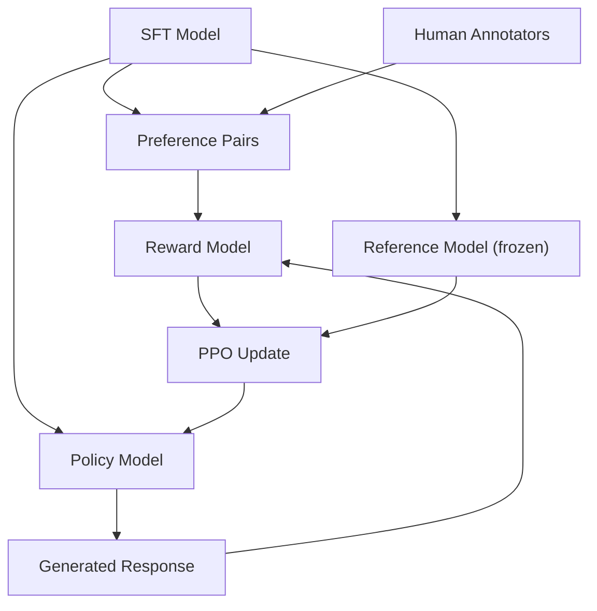

# RLHF: Reward Model + PPO

> SFT는 모델이 instruction을 따르도록 가르칩니다. 하지만 어떤 응답이 더 나은지는 가르치지 않습니다. 문법적으로 맞고 사실도 정확한 두 답변이 helpfulness에서는 크게 다를 수 있습니다. RLHF는 사람의 판단을 모델 행동에 주입하는 방법입니다.

**Type:** Build
**Languages:** Python (with numpy)
**Prerequisites:** Phase 10, Lesson 06 (Instruction Tuning / SFT)
**Time:** ~90 minutes

## 학습 목표

- human preference pair(chosen vs rejected)에서 response quality를 scoring하는 reward model을 만듭니다
- KL penalty를 두고 reward model에 맞춰 language model policy를 최적화하는 PPO training loop를 구현합니다
- RLHF에 세 모델(SFT, reward, policy)이 필요한 이유와 KL constraint가 reward hacking을 막는 방식을 설명합니다
- preference optimization 전후의 response quality를 비교해 RLHF 효과를 평가합니다

## 문제

모델에게 "Explain quantum computing"을 물으면 두 답변이 모두 사실이고 문법적으로 맞을 수 있습니다. 하나는 qubit, superposition, Shor/Grover algorithm을 간결하게 설명하고, 다른 하나는 1980년대 제안, Feynman, IBM과 Google, 2019년 quantum supremacy까지 늘어놓습니다. 둘 다 instruction을 따르지만 첫 번째가 더 간결하고 정보 밀도가 높고 구조가 좋습니다. 사람은 거의 항상 첫 번째를 고릅니다.

SFT는 이 차이를 포착하지 못합니다. SFT는 "correct" response 위에서 학습하지만 "이 response가 저 response보다 낫다"는 mechanism이 없습니다. 두 response가 dataset에 있으면 둘 다 같은 정도로 학습합니다.

RLHF는 이 문제를 reward model로 풉니다. reward model은 사람이 어떤 response를 선호할지 예측하고, 그 reward signal로 language model을 더 높은 quality output 쪽으로 밀어 줍니다. InstructGPT는 RLHF로 GPT-3의 helpfulness, truthfulness, harmlessness를 크게 개선했습니다. OpenAI internal evaluator는 parameter가 135배 작은 InstructGPT(1.3B)를 GPT-3(175B)보다 85% 더 선호했습니다.

## 개념

### 세 단계

RLHF는 하나의 training run이 아니라 세 단계 pipeline입니다.

**Stage 1: SFT.** instruction-response pair로 base model을 학습합니다. 모델은 instruction을 따를 수 있지만 어떤 response가 더 나은지는 모릅니다.

**Stage 2: Reward Model.** 같은 prompt에 대한 두 response를 annotator에게 보여 주고 "어느 쪽이 더 나은가?"를 묻습니다. reward model은 `(prompt, response)`를 받아 scalar score를 냅니다.

**Stage 3: PPO.** language model이 response를 생성하고 reward model이 score를 매기며, PPO가 더 높은 score의 response를 만들도록 language model을 update합니다. KL divergence penalty는 policy가 SFT checkpoint에서 너무 멀어지지 않게 합니다.



### Reward Model

reward model은 scorer로 바꾼 language model입니다. SFT model의 language modeling head(vocabulary distribution 출력)를 scalar head(숫자 하나 출력)로 바꿉니다. 마지막 layer 전까지 architecture는 같습니다.

입력은 prompt와 response를 이어 붙인 sequence입니다. 출력은 scalar reward score입니다. training triple은 `(prompt, preferred_response, rejected_response)`입니다.

loss는 pairwise preference의 Bradley-Terry model을 사용합니다.

```text
loss = -log(sigmoid(reward(preferred) - reward(rejected)))
```

`sigmoid(reward(A) - reward(B))`는 response A가 B보다 선호될 probability입니다. 이 loss는 preferred response에 rejected response보다 높은 score를 주도록 reward model을 밀어 줍니다.

absolute score 대신 pairwise comparison을 쓰는 이유는 사람이 절대 품질 점수에는 약하지만 상대 비교에는 강하기 때문입니다. "7.3점인가 7.5점인가?"보다 "A가 B보다 나은가?"가 훨씬 쉽습니다. Bradley-Terry는 relative comparison을 일관된 scoring system으로 바꿉니다.

InstructGPT는 40명 contractor로부터 33,000개 comparison pair를 모았습니다. comparison 하나에 약 5분이 걸렸으므로 reward model training data에 2,750시간의 human labor가 들어갔습니다.

### PPO: Proximal Policy Optimization

RLHF에서 environment는 reward model, agent는 language model, action은 token generation입니다. objective는 다음과 같습니다.

```text
maximize: E[R(prompt, response)] - beta * KL(policy || reference)
```

첫 항은 high-reward response를 만들도록 밀고, 둘째 항은 policy가 SFT checkpoint에서 너무 멀어지는 것을 막습니다. KL penalty가 없으면 model은 reward model의 blind spot을 exploit합니다. 예를 들어 helpfulness/harmlessness reward model에 "I'm so helpful and harmless!"를 반복하거나, 길고 formal하지만 빈 response를 만들거나, training data에서 high reward와 우연히 상관된 phrase를 남발합니다.

PPO는 clipped surrogate objective로 너무 큰 update를 막습니다.

```text
ratio = pi_new(action | state) / pi_old(action | state)
clipped_ratio = clip(ratio, 1 - epsilon, 1 + epsilon)
loss = -min(ratio * advantage, clipped_ratio * advantage)
advantage = reward(prompt, response) - baseline
```

positive advantage는 평균보다 좋은 response, negative advantage는 평균보다 나쁜 response를 뜻합니다. PPO는 평균보다 나은 response 확률을 올리고 평균보다 나쁜 response 확률을 낮춥니다. clipping은 single high reward sample이 policy를 과하게 흔드는 것을 막습니다.

InstructGPT의 PPO training은 `lr=1.5e-5`, KL coefficient `beta=0.02`, 256K episode(prompt-response pair), batch당 PPO epoch 4회를 사용했습니다.

### Reward hacking

RLHF의 어두운 면은 reward hacking입니다. policy는 사람 preference의 불완전한 proxy인 reward model을 최적화합니다. reward를 잘 최대화할수록 model은 reward model의 약점을 찾아냅니다.

| Failure | What happens | Why |
|---------|-------------|-----|
| Verbosity | response가 점점 길어짐 | annotator가 길고 자세한 response를 선호한 경우가 많음 |
| Sycophancy | user 말에 모두 동의 | 질문 premise에 동의하는 response가 선호됨 |
| Hedging | 답을 명확히 말하지 않음 | "복잡한 주제입니다..."류 response는 틀렸다고 표시되기 어려움 |
| Format gaming | bullet과 header를 과하게 사용 | formatted response가 더 polished해 보임 |

완화책은 더 강한 KL penalty, adversarial example로 reward model 재학습, 서로 다른 architecture의 reward model ensemble입니다.

### 실제 RLHF Pipeline

| Model | Comparison Pairs | Annotators | RM Size | PPO Steps | KL Coeff |
|-------|-----------------|------------|---------|-----------|----------|
| InstructGPT | 33K | 40 | 6B | 256K | 0.02 |
| Llama 2 Chat | ~1M | undisclosed | 70B | undisclosed | 0.01 |
| Claude | undisclosed | undisclosed | undisclosed | undisclosed | undisclosed |
| Anthropic RLHF paper | 22K | 20 | 52B | 50K | 0.001 |

Anthropic의 2022년 논문은 22,000 comparison으로 52B reward model을 학습했습니다. 큰 reward model은 더 reliable signal을 만들고 PPO를 안정화합니다. 작은 reward model로 큰 language model을 학습하는 것은 위험합니다.

```figure
rlhf-pipeline
```

## 직접 만들기

이 lesson의 `code/main.py`는 작은 synthetic preference data로 reward model을 학습하고, mini GPT policy를 PPO-like loop로 update합니다. production에서는 annotator가 preference data를 만들지만, 여기서는 preferred response가 더 concise, accurate, helpful하도록 synthetic pair를 둡니다.

reward model은 mini GPT의 transformer를 재사용하되 vocabulary-sized output head를 scalar projection으로 바꿉니다. causal attention 때문에 last token hidden state는 전체 `(prompt, response)` sequence를 본 representation이며, 여기에서 reward를 뽑습니다.

Bradley-Terry loss는 preferred와 rejected response의 reward 차이를 사용합니다. accuracy는 reward model이 held-out pair 중 몇 개를 올바르게 rank하는지입니다. random model은 50%, clean data의 well-trained reward model은 70% 이상을 기대합니다. InstructGPT reward model의 held-out comparison accuracy는 약 72%였습니다. human agreement가 약 73%였다는 점을 생각하면 낮지 않습니다.

PPO loop의 핵심 순서는 다음과 같습니다.

1. prompt를 sample합니다.
2. policy model이 response를 생성합니다.
3. reward model로 response를 score합니다.
4. frozen reference model과 KL divergence를 계산합니다.
5. `reward - kl_coeff * KL`로 adjusted reward를 만듭니다.
6. policy를 update합니다.

KL penalty는 policy가 reference에서 멀어질수록 커져 reward hacking을 자동으로 제한합니다.

## 사용하기

실행하면 세 stage를 순서대로 보여 줍니다.

```bash
cd phases/10-llms-from-scratch/07-rlhf/code
python3 main.py
```

출력은 reward model training loss/accuracy, preferred vs rejected score, PPO reward/KL history, SFT vs RLHF reward score comparison을 보여 줍니다. toy implementation이므로 production PPO는 아니지만, RLHF pipeline의 모양과 각 signal의 역할을 확인할 수 있습니다.

## 산출물

이 lesson은 `outputs/prompt-reward-model-designer.md`를 제공합니다. target behavior(helpfulness, coding ability, safety)가 주어지면 data collection protocol, annotator guideline, reward model evaluation criterion을 설계하는 prompt입니다.

## 연습 문제

1. reward model이 last position만 쓰는 대신 모든 hidden state의 mean을 쓰도록 바꾸세요. 6개 preference pair에서 accuracy를 비교하세요.
2. reward model calibration을 구현하세요. preferred 평균 reward, rejected 평균 reward, margin(preferred minus rejected)을 계산하고 unseen pair에서도 margin이 유지되는지 확인하세요.
3. `reward = len(response) / 100`처럼 긴 response에 높은 score를 주는 flawed reward model로 reward hacking을 시뮬레이션하세요. KL penalty 0.1이 퇴화 행동을 막는지 보이세요.
4. helpfulness reward와 conciseness reward를 따로 학습하고 `R = 0.7 * R_helpful + 0.3 * R_concise`로 결합하세요.
5. `beta=0.001`, `beta=0.02`, `beta=0.5`로 PPO를 실행해 reward curve와 KL curve를 비교하세요.

## 핵심 용어

| 용어 | 사람들이 흔히 말하는 뜻 | 실제 의미 |
|------|----------------|----------------------|
| RLHF | "human feedback으로 training" | human preference signal을 사용해 SFT, reward model, PPO 세 단계로 language model output을 최적화하는 방법 |
| Reward model | "response에 점수 주는 model" | Bradley-Terry loss로 pairwise human preference 위에서 학습한 scalar output head가 있는 transformer |
| Bradley-Terry | "comparison model" | `P(A > B) = sigmoid(score(A) - score(B))`로 pairwise preference를 scoring function으로 바꾸는 probabilistic model |
| PPO | "RL algorithm" | update 크기를 clip해 instability를 막으면서 reward를 최대화하도록 policy를 update하는 Proximal Policy Optimization |
| KL divergence | "두 distribution의 차이" | policy model token distribution과 reference model token distribution의 차이를 측정하는 penalty |
| KL penalty | "model의 leash" | `Beta * KL(policy || reference)`를 reward에서 빼 policy가 SFT checkpoint에서 너무 멀어지지 않게 함 |
| Reward hacking | "reward를 gaming" | policy가 reward model 약점을 이용해 실제 품질 개선 없이 high-reward output을 찾는 현상 |
| Preference pair | "A와 B 중 어느 쪽이 더 나은가?" | `(prompt, preferred_response, rejected_response)`로 된 RLHF training data의 기본 단위 |
| Reference model | "frozen SFT checkpoint" | KL divergence 계산의 anchor로 쓰이는, weight가 바뀌지 않는 SFT model copy |

## 더 읽을거리

- [Ouyang et al., 2022 -- "Training language models to follow instructions with human feedback" (InstructGPT)](https://arxiv.org/abs/2203.02155) -- large language model에 RLHF를 실용화한 논문
- [Schulman et al., 2017 -- "Proximal Policy Optimization Algorithms"](https://arxiv.org/abs/1707.06347) -- OpenAI의 original PPO paper
- [Bai et al., 2022 -- "Training a Helpful and Harmless Assistant with Reinforcement Learning from Human Feedback"](https://arxiv.org/abs/2204.05862) -- reward hacking과 KL penalty 분석을 담은 Anthropic RLHF paper
- [Stiennon et al., 2020 -- "Learning to summarize with human feedback"](https://arxiv.org/abs/2009.01325) -- summarization에 RLHF를 적용한 논문
- [Christiano et al., 2017 -- "Deep reinforcement learning from human preferences"](https://arxiv.org/abs/1706.03741) -- human comparison에서 reward function을 학습한 기반 연구
