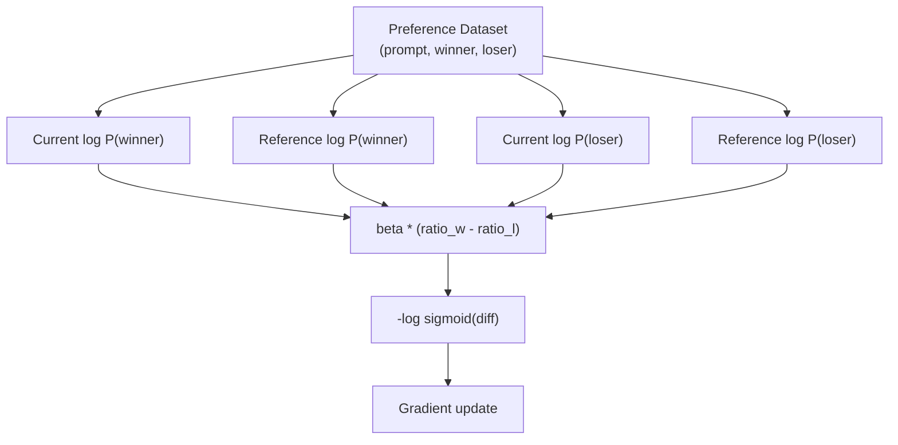

# DPO: Direct Preference Optimization

> RLHF는 작동하지만 SFT, reward model, policy 세 모델을 학습하고 PPO instability와 KL penalty tuning을 관리해야 합니다. DPO는 이 모든 것을 건너뜁니다. 별도 reward model도 PPO도 없이 preference pair 위에서 language model을 직접 최적화합니다.

**Type:** Build
**Languages:** Python (with numpy)
**Prerequisites:** Phase 10, Lesson 07 (RLHF)
**Time:** ~90 minutes

## 학습 목표

- 별도 reward model 없이 preference pair에서 language model을 직접 최적화하는 DPO training을 구현합니다
- DPO loss를 유도하고 policy log probability가 reward model을 암묵적으로 표현하는 방식을 설명합니다
- training stability, compute cost, 필요한 model 수 관점에서 DPO와 RLHF를 비교합니다
- beta parameter로 trained policy가 reference model에서 얼마나 벗어나는지 제어합니다

## 문제

Lesson 07의 RLHF pipeline은 세 stage와 세 model이 필요했습니다. reward model은 수천 개 human preference pair와 별도 training loop가 필요했고, PPO는 KL coefficient, learning rate, clip ratio, epoch 수를 조심스럽게 tuning해야 했습니다.

실무에서 PPO training은 불안정하기로 유명합니다. 작은 hyperparameter 변화도 divergence를 만들 수 있습니다. reward model은 human preference의 불완전한 proxy이므로 policy는 약점을 exploit합니다. KL penalty는 도움을 주지만 너무 낮으면 reward hacking, 너무 높으면 model이 거의 배우지 못합니다.

2023년 Rafael Rafailov, Archit Sharma 등은 "Direct Preference Optimization: Your Language Model is Secretly a Reward Model"을 발표했습니다. 핵심 insight는 별도 reward model이 필요 없다는 것입니다. optimal reward function은 language model의 token probability로 수학적으로 결정됩니다. RLHF를 단일 supervised learning step으로 줄일 수 있습니다.

## 개념

### 핵심 통찰

RLHF objective는 다음과 같습니다.

```text
maximize: E[R(x, y)] - beta * KL(pi || pi_ref)
```

여기서 `R`은 reward model, `pi`는 policy, `pi_ref`는 reference model, `beta`는 KL coefficient입니다. DPO paper는 이 objective의 closed-form optimal solution을 보였습니다.

```text
pi*(y | x) = pi_ref(y | x) * exp(R(x, y) / beta) / Z(x)
```

이를 정리하면 reward는 policy probability와 reference probability의 ratio로 표현됩니다.

```text
R(x, y) = beta * log(pi*(y | x) / pi_ref(y | x)) + beta * log Z(x)
```

같은 prompt `x`에 대한 winner와 loser를 비교하면 `Z(x)`는 cancel됩니다. 따라서 reward model을 따로 학습하지 않고도 preference probability를 current policy와 reference model의 log probability만으로 쓸 수 있습니다.

### DPO Loss

```text
L_DPO = -log(sigmoid(beta * (log pi(y_w|x)/pi_ref(y_w|x) - log pi(y_l|x)/pi_ref(y_l|x))))
```

- `y_w`: preferred(winning) response
- `y_l`: rejected(losing) response
- `x`: prompt
- `pi`: 학습 중인 current model
- `pi_ref`: frozen SFT checkpoint
- `beta`: reference에서 벗어나는 정도를 제어하는 temperature parameter(보통 0.1-0.5)

DPO loss는 preferred response의 log-probability ratio를 올리고 rejected response의 ratio를 낮춥니다. beta가 작으면 reference에서 크게 벗어날 수 있고, beta가 크면 reference 가까이에 머뭅니다.



### DPO가 더 단순한 이유

| 관점 | RLHF(PPO) | DPO |
|--------|-----------|-----|
| Models to train | 3 (SFT + reward + policy) | 1 (policy only) |
| Training loops | 3 (SFT, RM training, PPO) | 2 (SFT, DPO) |
| Hyperparameters | lr, KL coeff, clip ratio, RM lr, epochs x3 | lr, beta, epochs |
| Reward model | 별도 training 필요 | model probability에 암묵적으로 존재 |
| RL algorithm | PPO(complex, unstable) | supervised learning(stable) |
| GPU memory | PPO 중 3-4 model | current + reference 2 model |
| Training stability | hyperparameter에 민감 | SFT와 비슷하게 robust |

DPO도 memory에 current model과 frozen reference model 두 개가 필요합니다. 그래도 PPO의 reward model, value model, reference model, policy model 조합보다 훨씬 단순합니다.

### Beta Tuning

Beta는 DPO의 핵심 knob입니다.

| Beta | 동작 | 위험 |
|------|----------|------|
| 0.05 | reference에서 크게 벗어남 | reward hacking, capability loss |
| 0.1 | 공격적인 alignment | data가 깨끗하면 좋음 |
| 0.2 | 일반적인 default | 안정성과 학습의 균형 |
| 0.5 | 보수적 update | 거의 배우지 못할 수 있음 |

beta sweep은 필수입니다. 보통 `[0.05, 0.1, 0.2, 0.5]`를 실행하고 validation preference accuracy와 benchmark retention을 함께 봅니다.

### DPO 이후: KTO, ORPO, SimPO

DPO 이후 여러 variant가 나왔습니다.

- **KTO**는 pairwise comparison 없이 good/bad unpaired label로 학습합니다.
- **ORPO**는 SFT와 preference optimization을 하나의 objective로 결합해 reference model을 없앱니다.
- **SimPO**는 reference model 없이 length-normalized reward margin을 사용합니다.

모두 같은 목표를 가집니다. RLHF의 비싼 reward model과 불안정한 PPO를 줄이거나 없애는 것입니다.

## 직접 만들기

`code/main.py`는 작은 character-level mini language model에서 DPO loss를 구현합니다. 핵심 함수는 preference pair마다 winner와 loser의 sequence log probability를 current model과 reference model 아래에서 계산하고, beta-scaled difference로 logistic loss를 구합니다.

실제 model에서는 response token에 대해서만 log probability를 합산해야 합니다. prompt token은 conditioning context이지 학습 대상이 아닙니다. 긴 response가 단순히 token 수 때문에 유리해지지 않도록 average log probability 또는 length normalization을 고려합니다.

training loop의 순서는 다음과 같습니다.

1. SFT model을 current policy와 frozen reference로 copy합니다.
2. preference batch에서 `(prompt, winner, loser)`를 읽습니다.
3. current와 reference에서 winner/loser log probability를 계산합니다.
4. DPO loss와 gradient를 계산합니다.
5. current policy만 update합니다.
6. held-out preference accuracy와 reference divergence를 monitoring합니다.

## 사용하기

```bash
cd phases/10-llms-from-scratch/08-dpo/code
python3 main.py
```

demo는 DPO loss, preference accuracy, beta별 behavior를 출력합니다. toy model이므로 production-quality text를 만들지는 않지만, DPO가 reward model 없이 preference pair를 직접 학습하는 구조를 보여 줍니다.

## 산출물

이 lesson은 `outputs/prompt-alignment-method-selector.md`를 제공합니다. data type, compute budget, quality target, timeline을 넣으면 SFT, RLHF, DPO, KTO, ORPO, SimPO 중 어떤 alignment method가 맞는지 고르는 decision framework입니다.

## 연습 문제

1. beta를 `0.05`, `0.1`, `0.2`, `0.5`로 바꿔 preference accuracy와 reference divergence를 비교하세요.
2. sequence log probability를 sum 대신 average로 바꿔 response length bias가 줄어드는지 확인하세요.
3. 같은 preference data에서 RLHF-style reward model을 학습하고 DPO 결과와 비교하세요.
4. noisy preference pair를 20% 섞고 DPO가 얼마나 robust한지 측정하세요.
5. ORPO 또는 SimPO의 simplified loss를 구현해 DPO와 training curve를 비교하세요.

## 핵심 용어

| 용어 | 의미 |
|------|---------|
| DPO | Direct Preference Optimization. reward model과 PPO 없이 preference pair로 policy를 직접 최적화하는 방법 |
| Reference model | frozen SFT checkpoint. policy drift를 제한하는 anchor |
| Beta | reference에서 벗어나는 정도를 제어하는 DPO temperature |
| Implicit reward | policy/reference log probability ratio로 표현되는 reward |
| Preference pair | `(prompt, preferred_response, rejected_response)` training example |
| Offline alignment | fixed preference dataset만 사용해 alignment하는 방식 |

## 더 읽을거리

- [Rafailov et al., 2023 -- "Direct Preference Optimization: Your Language Model is Secretly a Reward Model"](https://arxiv.org/abs/2305.18290)
- [Ethayarajh et al., 2024 -- "KTO: Model Alignment as Prospect Theoretic Optimization"](https://arxiv.org/abs/2402.01306)
- [Hong et al., 2024 -- "ORPO: Monolithic Preference Optimization without Reference Model"](https://arxiv.org/abs/2403.07691)
- [Meng et al., 2024 -- "SimPO: Simple Preference Optimization with a Reference-Free Reward"](https://arxiv.org/abs/2405.14734)
