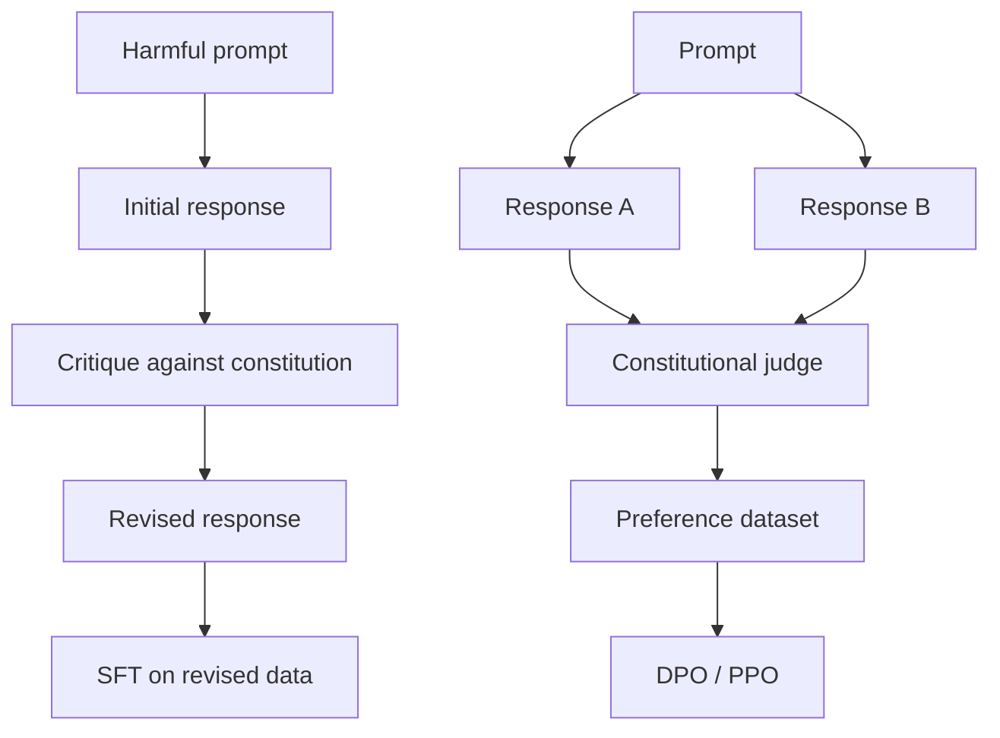
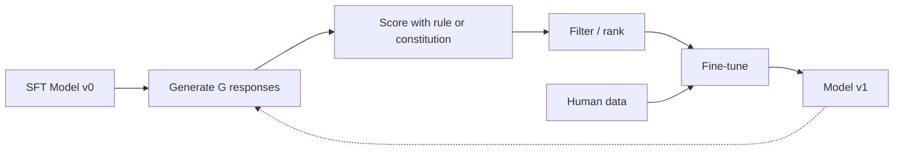

# Constitutional AI와 Self-Improvement

> RLHF는 loop 안에 사람이 필요합니다. Constitutional AI는 그 대부분을 모델 자신으로 대체합니다. 원칙 목록을 쓰고, 모델이 그 원칙에 비춰 자기 output을 critique하고, critique로 다시 학습합니다. DeepSeek-R1은 2025년에 이를 더 밀어붙였습니다. 모델이 수백만 reasoning trace를 만들게 하고, rule로 채점한 뒤, outcome 위에서 GRPO를 실행합니다.

**Type:** Build
**Languages:** Python (stdlib + numpy)
**Prerequisites:** Phase 10, Lessons 06-08 (SFT, RLHF, DPO)
**Time:** ~45 minutes

## 학습 목표

- Constitutional AI의 두 단계 loop(self-critique + self-revision, revised pair 위의 preference training)를 구현합니다
- GRPO(DeepSeek-R1의 group-relative policy optimization) objective를 유도하고 PPO의 value-function baseline과 대조합니다
- rule-based outcome reward로 verifiable reasoning trace를 생성하고 별도 reward model 없이 score합니다
- self-improvement가 human preference data보다 나은 경우와 mode seeking으로 붕괴하는 경우를 구분합니다

## 문제

Lesson 07의 RLHF와 Lesson 08의 DPO는 모두 비싼 input에 의존합니다. human preference pair입니다. InstructGPT-era pipeline은 약 33,000개 comparison을 썼고, Llama 2 Chat은 150만 개가 넘는 comparison을 썼습니다. Claude 3는 더 많이 썼습니다. 이 data는 느리고 비싸며 annotator bias를 담습니다.

Constitutional AI는 "model이 preference label을 직접 만들면 어떨까?"라고 묻습니다. written principle, 즉 constitution을 주고 model이 자기 response를 critique하게 합니다. 그 critique가 training signal이 됩니다.

DeepSeek는 2024-2025년에 verifiable outcome이 있는 task에서는 critic도 건너뛸 수 있음을 보였습니다. math는 정답이 맞는지, code는 test를 통과하는지, game은 이겼는지 졌는지 rule로 확인할 수 있습니다. candidate solution을 많이 생성하고 deterministic rule로 grade한 뒤 reward 위에서 policy-gradient algorithm을 실행합니다. DeepSeek-R1은 거의 human preference data 없이 o1-class reasoning performance에 근접했습니다.

## 개념

### Constitutional AI loop

Bai et al. (2022)의 pipeline은 두 stage입니다.

**Stage 1: Supervised Learning from AI Feedback (SL-CAI).** helpful하지만 harmful할 수 있는 SFT model에서 시작합니다. potentially harmful request에 대해 response를 생성하고, 같은 model이 constitutional principle에 비춰 critique한 뒤 revised response를 씁니다. `(prompt, revised_response)` pair로 fine-tune합니다.

**Stage 2: Reinforcement Learning from AI Feedback (RLAIF).** response pair를 sample하고 model에게 constitution을 기준으로 어느 쪽이 나은지 판단하게 합니다. 이 pairwise preference로 reward model을 학습하고 PPO 또는 DPO를 실행합니다. RLHF와의 차이는 preference가 사람에게서 오지 않고 model에게서 온다는 점입니다.



constitution은 alignment contract를 data에서 text로 옮깁니다. RLHF에서 behavior를 바꾸려면 수천 pair를 다시 label해야 하지만 CAI에서는 paragraph를 수정할 수 있습니다. 비용은 있습니다. model의 self-judgment는 시작 model의 calibration 이상으로 좋아질 수 없습니다. blind spot이 있으면 critique step도 그 blind spot을 물려받습니다. 그래서 production CAI pipeline도 보통 pure RLHF 대비 5-10% 정도의 human preference data를 계속 섞습니다.

### GRPO: Group-Relative Policy Optimization

DeepSeekMath(2024)와 DeepSeek-R1(2025)은 value function을 제거한 PPO variant인 GRPO를 사용했습니다.

PPO objective는 다음과 같습니다.

```text
L_PPO = E[min(r(theta) * A, clip(r(theta), 1-eps, 1+eps) * A)]
```

여기서 `A`는 보통 learned value network `V(s)`로 추정한 advantage입니다. value network는 policy와 같은 크기의 두 번째 model이므로 memory를 두 배로 쓰고 별도 training loop도 필요합니다.

GRPO는 value function을 버립니다. prompt마다 G개 response(보통 16 또는 64)를 sample하고 reward를 계산한 뒤 group 안에서 normalize합니다.

```text
A_i = (r_i - mean(r_1, ..., r_G)) / std(r_1, ..., r_G)
L_GRPO = E[min(r(theta) * A_group, clip(r(theta), 1-eps, 1+eps) * A_group)] - beta * KL(pi || pi_ref)
```

advantage는 같은 prompt에서 나온 sibling response 대비 reward의 z-score입니다. group 자체가 baseline입니다. KL penalty와 clip ratio는 PPO처럼 남아 있지만 separate critic은 사라집니다.

### Reasoning에서 GRPO가 중요한 이유

reasoning task의 reward는 대개 sparse하고 binary입니다. final answer가 맞거나 틀립니다. sparse binary reward 위에서 value function은 유용한 intermediate estimate를 배우기 어렵습니다. GRPO의 group normalization은 같은 problem에 대한 16개 attempt 중 어느 attempt가 상대적으로 나은지 즉시 알려 줍니다.

rule-based reward의 예:

- **Math**: sympy 또는 symbolic checker가 final answer match를 확인합니다.
- **Code**: test suite가 pass/fail을 결정합니다.
- **Formatting**: regex가 required XML tag 안에 answer가 있는지 확인합니다.
- **Multi-step proofs**: Lean, Coq 같은 proof assistant가 validity를 판정합니다.

DeepSeek-R1-Zero는 math accuracy와 format compliance(`<answer>` tag 안의 answer) 두 reward만으로 학습되었습니다. human preference도 critic model도 없었습니다. paper의 "aha moment", 즉 model이 self-check와 backtrack을 스스로 배우는 현상은 sparse rule reward 위의 GRPO에서 나왔습니다.

### Process Reward Model vs Outcome Reward Model

| 축 | ORM | PRM |
|------|-----|-----|
| Signal per trace | 1 number | N numbers(one per step) |
| Supervision source | final answer check | step-level label 또는 self-judging |
| Training cost | cheap | expensive |
| Credit assignment | sparse, noisy | dense, targeted |
| Reward hacking risk | lower | higher |
| Used by | DeepSeek-R1, R1-Zero | OpenAI o1(알려진 바), Math-Shepherd |

2024-2025년 consensus는 ORM + GRPO가 PRM보다 scale하기 쉽다는 쪽이었습니다. PRM은 token당 sample-efficient하지만 step-labeled data가 비싸고, proof를 진전시키지 않으면서 PRM이 좋아할 step을 쓰는 shortcut behavior로 무너지기 쉽습니다.

### Self-Improvement: Feedback multiplier

critique/revise loop와 rule reward 기반 group-relative RL을 연결하면 self-improvement loop가 됩니다.

1. SFT model에서 시작합니다.
2. prompt마다 candidate response를 많이 생성합니다.
3. verifiable task는 rule-based reward, subjective task는 constitutional critic으로 score합니다.
4. top candidate를 새 SFT data 또는 preference pair로 보존합니다.
5. fine-tune하고 더 나아진 model로 2단계로 돌아갑니다.

이 loop는 model 안에 이미 있는 signal을 증폭합니다. 새로운 signal을 만들지는 않습니다. model이 문제 class X를 전혀 풀 수 없다면 self-improvement만으로 그 capability가 생기지 않습니다.

위험은 mode collapse입니다. self-generated data는 training corpus보다 분포가 좁습니다. self-distillation을 3-5 round 반복하면 creative task에서 diversity를 잃고, overconfidence와 formulaic한 "AI voice"가 늘어납니다. production pipeline은 작은 비율의 fresh human data를 섞어 distribution을 유지합니다.



### 무엇을 언제 쓸까

- **Pure CAI**: tone, safety, refusal style 같은 subjective behavior. constitution이 명확하고 verifiable outcome이 없습니다.
- **GRPO + ORM**: math, code, structured extraction 같은 verifiable task. correctness를 싸게 확인할 수 있습니다.
- **DPO on self-generated pairs**: constitution으로 preference pair를 만들고 PPO/GRPO 대신 DPO를 사용합니다.
- **Full RLHF**: rule이나 짧은 constitution으로 표현하기 어려운 multi-objective tradeoff가 필요할 때 여전히 적합합니다.

2026년 frontier pipeline은 보통 네 가지를 모두 씁니다. safety layer에는 CAI, reasoning post-training에는 GRPO, preference polish에는 DPO, 남은 행동에는 작은 RLHF pass를 씁니다.

## 직접 만들기

`code/main.py`는 pure Python + numpy로 세 가지를 구현합니다.

- Constitutional AI self-critique loop
- simple arithmetic을 위한 rule-based reward checker
- Lesson 04의 tiny language model 위에서 도는 minimal GRPO trainer

constitution은 짧은 principle list입니다. real system에서는 각 principle이 더 길고 category-tagged입니다. self-critique는 실제 LLM call 대신 handwritten rubric으로 simulate해 외부 API 없이 실행됩니다. arithmetic reward는 final numeric answer가 expected value와 맞는지 regex와 `eval`로 확인합니다.

GRPO trainer는 같은 prompt에서 여러 candidate를 생성하고 reward를 group z-score로 normalize합니다. reward std가 0이면 group에는 학습 signal이 없으므로 skip하거나 downweight해야 합니다. epsilon으로 나누고 signal이 있는 척하면 noise를 학습합니다.

## 사용하기

```bash
cd phases/10-llms-from-scratch/09-constitutional-ai-self-improvement/code
python3 main.py
```

demo는 constitution 기반 critique/revision, rule reward scoring, group-relative advantage, KL-constrained update를 출력합니다.

## 산출물

이 lesson은 `outputs/skill-self-improvement-auditor.md`를 제공합니다. Constitutional AI, RLAIF, GRPO, self-generated preference pipeline을 scale에서 실행하기 전에 reward rule, KL budget, diversity floor, human data quota, mode-collapse watchdog을 감사하는 checklist입니다.

## 연습 문제

1. constitution에 "answer should cite uncertainty when needed" 원칙을 추가하고 revision 결과가 어떻게 달라지는지 보세요.
2. arithmetic reward를 더 안전하게 바꿔 `eval` 대신 parser를 쓰세요.
3. group size를 4, 16, 64로 바꿔 advantage variance를 비교하세요.
4. zero-variance group을 skip하는 경우와 epsilon으로 나누는 경우의 training curve를 비교하세요.
5. self-generated data만 5 round 반복하고 n-gram diversity가 어떻게 변하는지 측정하세요.

## 핵심 용어

| 용어 | 의미 |
|------|---------|
| Constitutional AI | written principle을 기준으로 model이 자기 output을 critique/revise하고 preference를 만드는 alignment method |
| RLAIF | Reinforcement Learning from AI Feedback. human 대신 AI-generated preference를 사용 |
| GRPO | group 안 reward를 normalize해 value function 없이 PPO-like update를 하는 method |
| ORM | final outcome 하나만 reward하는 outcome reward model 또는 rule |
| PRM | reasoning step마다 reward를 주는 process reward model |
| Mode collapse | self-generated data 반복으로 output diversity가 줄어드는 현상 |

## 더 읽을거리

- [Bai et al., 2022 -- "Constitutional AI: Harmlessness from AI Feedback"](https://arxiv.org/abs/2212.08073)
- [DeepSeekMath, 2024 -- "Pushing the Limits of Mathematical Reasoning in Open Language Models"](https://arxiv.org/abs/2402.03300)
- [DeepSeek-R1, 2025 -- "Incentivizing Reasoning Capability in LLMs via Reinforcement Learning"](https://arxiv.org/abs/2501.12948)
