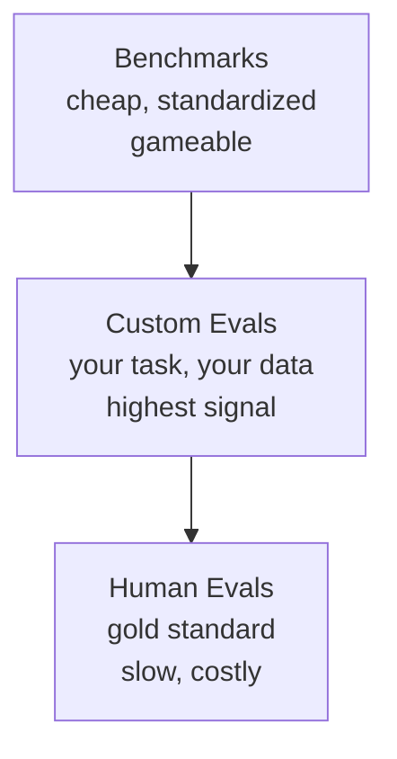
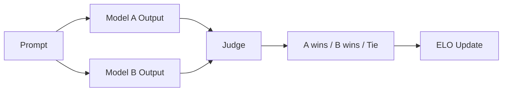

# 평가: Benchmarks, Evals, LM Harness

> Goodhart's Law: measure가 target이 되면 더 이상 좋은 measure가 아닙니다. frontier lab은 benchmark를 game합니다. MMLU score는 오르지만 model은 여전히 "strawberry"의 R 개수를 안정적으로 세지 못합니다. 중요한 eval은 YOUR task, YOUR data 위의 YOUR eval입니다.

**Type:** Build
**Languages:** Python
**Prerequisites:** Phase 10, Lessons 01-05 (LLMs from Scratch)
**Time:** ~90 minutes

## 학습 목표

- multiple-choice와 open-ended benchmark를 language model에 실행하는 custom evaluation harness를 만듭니다
- MMLU, HumanEval 같은 standard benchmark가 saturate되어 frontier model을 구분하지 못하는 이유를 설명합니다
- exact match, F1, BLEU, LLM-as-judge scoring 같은 task-specific eval metric을 구현합니다
- public leaderboard만 의존하지 않고 특정 use case를 겨냥한 custom evaluation suite를 설계합니다

## 문제

MMLU는 2020년에 57개 subject, 15,908개 question으로 발표되었습니다. 3년 안에 frontier model이 포화시켰습니다. GPT-4는 86.4%, Claude 3 Opus는 86.8%, Llama 3 405B는 88.6%를 기록했습니다. leaderboard는 3점 범위로 압축되었고, 이 차이는 실제 capability gap이 아니라 statistical noise에 가깝습니다.

동시에 같은 model들은 10살 아이가 쉽게 하는 task에서 실패합니다. "strawberry"의 글자 수 세기처럼 world knowledge도 reasoning도 필요 없는 character-level iteration에서 실패할 수 있습니다. HumanEval에서 90% 이상을 받아도 edge case에서 crash하는 code를 만듭니다.

benchmark는 model이 benchmark에서 어떻게 동작하는지만 알려 줍니다. customer support bot을 만들고 있다면 MMLU는 거의 무관합니다. code assistant라면 HumanEval은 function-level generation만 다루며 debugging, refactoring, multi-file explanation을 말해 주지 않습니다. 최종 평가는 deployment condition과 같아야 합니다.

## 개념

### Eval 지형

세 종류의 evaluation이 있습니다.

**Benchmarks**는 standardized test suite입니다. MMLU, HumanEval, SWE-bench, MATH, ARC, HellaSwag 등이 있습니다. 같은 test로 model을 비교할 수 있지만, training data contamination과 benchmark-specific optimization 때문에 signal이 약해지고 있습니다.

**Custom evals**는 특정 use case를 위해 직접 만드는 test suite입니다. legal summarizer는 legal document로, SQL generator는 실제 database schema로 평가합니다. 만들기는 비싸지만 production performance를 가장 잘 예측합니다.

**Human evals**는 paid annotator가 helpfulness, correctness, fluency, safety 같은 기준으로 model output을 판단합니다. open-ended task의 gold standard이지만 judgment당 $0.10-$2.00이 들고 느립니다.



### Benchmark가 깨지는 이유

**Data contamination.** training corpus는 internet을 scrape합니다. benchmark question도 internet에 있습니다. model이 training 중 answer를 볼 수 있습니다.

**Teaching to the test.** lab은 benchmark performance에 맞춰 training mixture를 최적화합니다. MMLU-style multiple choice가 training mix에 있으면 model은 format과 answer distribution을 배웁니다.

**Saturation.** 모든 frontier model이 85-90%를 받으면 benchmark는 더 이상 구분하지 못합니다. 남은 10-15%는 ambiguous, mislabeled, 또는 obscure domain knowledge일 수 있습니다.

### Perplexity

perplexity는 model이 token sequence에 얼마나 놀라는지를 측정합니다.

```text
PPL = exp(-1/N * sum(log P(token_i | context)))
```

perplexity 10은 model이 평균적으로 token position마다 10개 option 중 uniform하게 고르는 정도의 uncertainty를 갖는다는 뜻입니다. 낮을수록 좋습니다. 하지만 perplexity는 instruction following, reasoning, factual accuracy를 말해 주지 않습니다. sanity check로 쓰고 final verdict로 쓰지 마세요.

### LLM-as-Judge

강한 model로 약한 model의 output을 평가합니다. GPT-4o나 Claude Sonnet에게 rubric을 주고 correctness, helpfulness, safety를 1-5 scale로 scoring하게 할 수 있습니다. GPT-4o-mini 기준 judgment당 약 $0.01이며 human judgment와 약 80% 일치합니다.

scoring prompt가 중요합니다. "Rate this response" 같은 vague prompt는 noisy합니다. "factual하고 source를 cite하면 5, correct하지만 source가 없으면 4..."처럼 structured rubric을 써야 consistent합니다.

failure mode도 있습니다. judge model은 position bias, verbosity bias, self-preference를 보입니다. 순서를 randomize하고, length를 normalize하고, 평가 대상과 다른 model을 judge로 쓰세요.

### ELO Ratings

Chatbot Arena 방식입니다. 같은 prompt에 대한 두 model response를 보여 주고 human 또는 LLM judge가 더 나은 쪽을 고릅니다. 수천 comparison에서 chess처럼 ELO rating을 계산합니다. relative ranking은 absolute score보다 reliable하고 tie도 다루기 쉽습니다.



### Eval framework

- **lm-evaluation-harness**: EleutherAI의 open-source standard입니다. 200+ benchmark를 지원하며 Open LLM Leaderboard에서 사용됩니다.
- **RAGAS**: RAG pipeline용 evaluation framework입니다. faithfulness, relevance, answer correctness를 측정합니다.
- **promptfoo**: prompt engineering용 config-driven eval입니다. YAML test case를 정의하고 여러 model에 대해 pass/fail report를 냅니다.

### Custom Eval 만들기

1. **Define the task.** "answer questions"가 아니라 "customer complaint email에서 product name, issue category, sentiment를 추출"처럼 정확히 씁니다.
2. **Create test cases.** prototype은 최소 50개, production은 200개 이상입니다. empty input, adversarial input, ambiguous input, multilingual input을 포함하세요.
3. **Define scoring.** structured output은 exact match, text similarity는 BLEU/ROUGE, open-ended quality는 LLM-as-judge, extraction은 F1을 씁니다.
4. **Automate.** 하나의 command로 eval이 돌아가야 합니다.
5. **Track over time.** 단일 score보다 trendline이 중요합니다. prompt와 함께 eval을 versioning하세요.

| Eval 유형 | 판단당 비용 | 사람 판단과의 일치도 | 적합한 용도 |
|-----------|------------------|----------------------|----------|
| Exact match | ~$0 | 100% (when applicable) | Structured output, classification |
| BLEU/ROUGE | ~$0 | ~60% | Translation, summarization |
| LLM-as-judge | ~$0.01 | ~80% | Open-ended generation |
| Human eval | $0.10-$2.00 | N/A | Ambiguous, high-stakes tasks |

```figure
perplexity-loss
```

## 직접 만들기

`code/main.py`는 minimal eval framework를 구현합니다. eval case는 input, expected output, metadata를 갖고 scorer는 prediction과 reference를 받아 0-1 score를 반환합니다.

구현하는 scorer:

- **exact match**: classification 또는 structured output에 사용
- **token F1**: extraction task에서 partial credit 제공
- **BLEU-like score**: n-gram overlap 기반 translation/summarization sanity check
- **multiple-choice scoring**: option별 log likelihood 비교
- **LLM-as-judge stub**: rubric 기반 judge를 simulate해 외부 API 없이 pipeline shape 확인

eval harness는 model function을 받아 모든 case를 실행하고 per-case result, aggregate score, failure breakdown을 JSON-friendly structure로 반환합니다.

## 사용하기

```bash
cd phases/10-llms-from-scratch/10-evaluation/code
python3 main.py
```

demo는 multiple-choice benchmark, extraction eval, open-ended rubric eval을 실행하고 aggregate report를 출력합니다.

## 산출물

이 lesson은 두 artifact를 제공합니다.

- `outputs/prompt-eval-designer.md`: task description을 받아 custom evaluation suite를 설계하는 prompt
- `outputs/skill-llm-evaluation.md`: task type, budget, requirement에 따라 evaluation strategy를 고르는 decision framework

## 연습 문제

1. 새로운 task-specific eval을 50 case 이상으로 설계하세요.
2. exact match만 쓸 때와 F1을 함께 쓸 때 failure interpretation이 어떻게 달라지는지 비교하세요.
3. LLM-as-judge rubric을 세부적으로 바꿔 score variance를 측정하세요.
4. 같은 model을 benchmark와 custom eval에서 비교하고 ranking이 바뀌는지 확인하세요.
5. production failure 하나를 regression case로 추가하고 prompt change마다 gate로 사용하세요.

## 핵심 용어

| 용어 | 의미 |
|------|---------|
| Benchmark | standardized public test suite |
| Custom eval | deployment task와 data에 맞춘 자체 test suite |
| Goodhart's Law | measure가 target이 되면 좋은 measure가 아니게 된다는 법칙 |
| Perplexity | token sequence의 average negative log-likelihood를 exponentiate한 값 |
| LLM-as-judge | 강한 LLM으로 output을 rubric에 따라 scoring하는 방식 |
| ELO | pairwise comparison에서 model relative strength를 추정하는 rating |
| Data contamination | benchmark item이 training data에 포함되어 score가 부풀려지는 현상 |

## 더 읽을거리

- [EleutherAI lm-evaluation-harness](https://github.com/EleutherAI/lm-evaluation-harness)
- [Chatbot Arena / LMSYS](https://chat.lmsys.org/)
- [RAGAS](https://docs.ragas.io/)
- [promptfoo](https://www.promptfoo.dev/)
