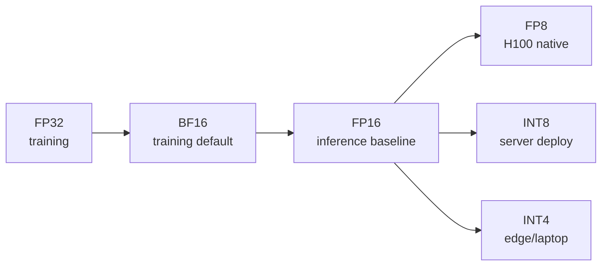

# 양자화: 모델을 메모리에 맞추기

> FP16의 70B model은 140GB가 필요합니다. weight만으로 A100 두 장입니다. FP8로 quantize하면 80GB GPU 한 장, INT4로 가면 MacBook에서도 가능해집니다.

**Type:** Build
**Languages:** Python (with numpy)
**Prerequisites:** Phase 10, Lessons 01-10 (LLMs from Scratch)
**Time:** ~120 minutes

## 학습 목표

- FP16에서 INT8/INT4로 가는 symmetric/asymmetric quantization을 per-tensor와 per-channel scaling까지 포함해 구현합니다
- quantization이 주는 memory saving을 계산하고 특정 GPU VRAM에 맞는 precision을 결정합니다
- post-training quantization(PTQ)과 quantization-aware training(QAT)의 차이를 설명합니다
- GPTQ 또는 AWQ로 real model을 quantize하고 benchmark에서 accuracy-memory tradeoff를 측정합니다

## 문제

Llama 3 70B는 700억 parameter를 갖습니다. parameter 하나가 16-bit floating point면 weight만 140GB입니다. 단일 A100은 80GB VRAM이므로 inference는커녕 weight도 한 장에 올릴 수 없습니다.

하지만 parameter당 16 bit는 낭비입니다. neural network weight는 대부분 0 근처에 몰립니다. FP16의 dynamic range(약 0.000000059부터 65,504까지)는 거의 쓰이지 않습니다. Llama 3 70B의 weight distribution을 보면 95%가 -0.1과 +0.1 사이에 들어갑니다. 4 bit로도 표현 가능한 값을 16 bit로 저장하는 셈입니다.

Quantization은 high-precision number를 lower-precision number로 바꿉니다. FP16에서 FP8로 가면 memory가 절반, INT4로 가면 1/4이 됩니다. 140GB model이 35GB가 되어 consumer GPU에도 들어갑니다. 더 공격적인 2-bit quantization은 일부 task에서 16GB laptop도 가능하게 하지만 quality cost가 큽니다.

핵심 질문은 accuracy를 얼마나 잃는가입니다. 잘 quantize한 INT4 model은 대부분 benchmark에서 원본 quality의 95-99%를 유지합니다. naive INT4 quantization은 model을 망가뜨릴 수 있습니다. 차이는 technique입니다.

## 개념

### 숫자 형식

floating-point number는 sign, exponent, mantissa(significand)로 구성됩니다. sign은 부호, exponent는 range, mantissa는 precision을 결정합니다.

```text
FP32:  [1 sign] [8 exponent] [23 mantissa]  = 32 bits
FP16:  [1 sign] [5 exponent] [10 mantissa]  = 16 bits
BF16:  [1 sign] [8 exponent] [7  mantissa]  = 16 bits
FP8:   [1 sign] [4 exponent] [3  mantissa]  = 8  bits (E4M3)
FP8:   [1 sign] [5 exponent] [2  mantissa]  = 8  bits (E5M2)
INT8:  [1 sign] [7 value]                   = 8  bits (uniform steps)
INT4:  [1 sign] [3 value]                   = 4  bits (16 levels total)
```

**FP32**는 full precision입니다. training의 accumulation에 여전히 쓰입니다.

**FP16**은 bit를 절반으로 줄입니다. weight에는 괜찮지만 activation과 gradient가 spike할 수 있는 training에서는 underflow를 막기 위해 loss scaling이 필요합니다.

**BF16**은 FP32의 8-bit exponent를 유지하고 mantissa만 7 bit로 줄입니다. neural network에서는 range가 precision보다 중요하다는 직관에 맞습니다. 대부분 modern training은 BF16 또는 BF16/FP32 mix를 씁니다.

**FP8**은 E4M3와 E5M2가 있습니다. E4M3는 inference weight/activation에, E5M2는 range가 더 중요한 gradient에 쓰입니다. H100의 FP8 inference는 FP16 대비 30-50% speedup을 거의 quality loss 없이 냅니다.

**INT8**은 exponent와 mantissa가 없는 integer format입니다. floating-point weight를 integer range에 mapping할 scale factor가 필요합니다. integer arithmetic은 더 빠르고 power-efficient합니다.

**INT4**는 가능한 값이 16개뿐입니다. scale 선택과 어떤 tensor를 quantize하는지가 quality를 좌우합니다. GPTQ, AWQ 같은 method는 INT4에서도 원본 quality의 95% 이상을 유지합니다.



### Quantization 작동 방식

core operation은 scale을 찾고, 나누고, round하고, integer와 scale을 저장하는 것입니다.

```text
scale = max(abs(tensor)) / max_int_value
quantized = round(tensor / scale)
reconstructed = quantized * scale
```

INT8 symmetric range(-127 to 127)의 경우:

```text
scale = max(abs(tensor)) / 127
quantized = clamp(round(tensor / scale), -128, 127)
```

error는 rounding error입니다. 각 값은 최대 `scale / 2`만큼 틀릴 수 있습니다.

**Per-tensor quantization**은 weight matrix 전체에 scale factor 하나를 씁니다. 단순하지만 outlier 하나가 전체 precision을 망칠 수 있습니다.

**Per-channel quantization**은 output channel(row 또는 column)마다 scale을 둡니다. scale factor를 더 저장해야 하지만 quality가 훨씬 좋습니다. production quantization method는 per-channel 또는 더 작은 granularity를 사용합니다.

**Asymmetric quantization**은 zero-point offset을 추가합니다.

```text
quantized = round(tensor / scale) + zero_point
```

distribution이 0 중심이 아닐 때 유용합니다. ReLU activation처럼 non-negative 값만 있으면 symmetric quantization은 음수 범위를 낭비합니다.

### 민감도 계층

모든 tensor가 quantization을 같은 정도로 견디지는 않습니다.

| Component | 민감도 | 참고 |
|-----------|-------------|-------|
| Weights | low | 0 근처 Gaussian-like distribution. INT8은 거의 lossless, INT4도 가능 |
| Activations | medium | outlier가 있고 dynamic range가 넓음. LLM.int8(), per-token/channel scale 필요 |
| KV cache | high | long context에서 memory를 지배하며 error가 future attention에 누적 |
| Attention logits | highest | softmax가 작은 error를 증폭하므로 보통 FP16/BF16 유지 |

70B model의 32K context에서 KV cache만 FP16으로 약 40GB가 될 수 있습니다. KV cache를 FP8/INT8로 줄이면 memory saving이 크지만 sequence length가 길수록 quality impact가 커집니다.

### PTQ vs QAT

**Post-Training Quantization (PTQ)**는 이미 학습된 model을 재학습 없이 quantize합니다. 빠르고 cheap합니다. INT8/FP8에서는 잘 동작합니다. INT4에서는 naive PTQ가 실패할 수 있어 GPTQ/AWQ처럼 calibration data를 쓰는 advanced PTQ가 필요합니다.

**Quantization-Aware Training (QAT)**은 training forward pass에 fake quantization을 넣습니다. model은 rounding error가 작은 위치에 weight를 두도록 배웁니다. gradient는 straight-through estimator(STE)로 흐릅니다. QAT는 INT4/INT2 quality가 더 좋지만 full training run이 필요합니다.

| 관점 | PTQ | QAT |
|--------|-----|-----|
| Cost | Minutes to hours | Full training run |
| Quality at INT8 | Excellent (< 0.1% loss) | Excellent |
| Quality at INT4 | Good with GPTQ/AWQ (1-3% loss) | Better (< 1% loss) |
| Quality at INT2 | Poor | Usable for some tasks |
| Calibration data | 128-1024 examples | Full training dataset |
| When to use | Deployment, iteration | Maximum quality at low bit-width |

### GPTQ, AWQ, GGUF

**GPTQ**는 one-shot PTQ method입니다. layer별로 quantize하고 calibration dataset(보통 128 examples)으로 Hessian, 즉 output이 각 weight에 얼마나 민감한지 측정합니다. 중요한 weight는 더 조심스럽게 quantize합니다. GPTQ는 LLM INT4 quantization을 실용화한 첫 method 중 하나입니다.

**AWQ (Activation-Aware Weight Quantization)**는 소수의 weight(약 1%)가 큰 activation과 곱해져 disproportionately important하다는 점을 이용합니다. calibration data로 salient weight를 찾고 quantization 전에 scale을 조정합니다. 보통 GPTQ와 비슷하거나 조금 더 나은 quality를 내고 적용 속도는 1.5-2배 빠릅니다.

**GGUF**는 llama.cpp ecosystem의 file format입니다. layer별로 다른 bit width를 쓰는 mixed quantization을 지원합니다. embedding과 output head는 높은 precision을 유지하고 middle layer는 INT4/INT3를 씁니다. weight, tokenizer, metadata를 한 file에 담아 CPU inference와 Apple Silicon에 적합합니다. Q4_K_M이 가장 널리 쓰이는 quality/size balance variant입니다.

### 품질 측정

quantized model이 여전히 좋은지 확인하려면 다음을 측정합니다.

**Perplexity.** held-out dataset(WikiText-2가 표준)에서 original과 quantized model을 비교합니다. delta < 0.5는 excellent, 0.5-1.0은 good, 1.0-2.0은 대부분 task에서 acceptable, > 2.0은 문제입니다.

**Task-specific benchmarks.** MMLU, HumanEval, GSM8K 또는 custom eval suite를 실행합니다. math와 code는 precision loss에 더 민감합니다.

**Output comparison.** 같은 prompt에서 두 model의 response를 비교하고 LLM-as-judge로 win rate를 계산합니다.

**Latency and throughput.** tokens/sec, time to first token, memory usage를 측정합니다. quantized model이 원본보다 느리면 쓸 이유가 없습니다.

| Model | Format | 크기 | Perplexity(WikiText-2) | MMLU | Tokens/sec(A100) |
|-------|--------|------|------------------------|------|-------------------|
| Llama 3 70B | FP16 | 140GB | 3.12 | 79.5% | 38 |
| Llama 3 70B | FP8 | 70GB | 3.14 | 79.3% | 55 |
| Llama 3 70B | GPTQ INT4 | 35GB | 4.32 | 77.8% | 72 |
| Llama 3 70B | AWQ INT4 | 35GB | 4.18 | 78.1% | 75 |
| Llama 3 70B | GGUF Q4_K_M | 40GB | 4.25 | 77.9% | 28 (CPU) |

pattern은 명확합니다. FP8은 거의 공짜입니다. INT4는 MMLU 1-2 point를 잃지만 throughput을 두 배 가까이 높이고 memory를 1/4로 줄입니다. 대부분 deployment에서 가치가 있습니다.

## 직접 만들기

`code/main.py`는 다음을 구현합니다.

- symmetric INT8/INT4 quantization
- asymmetric quantization with zero point
- per-tensor vs per-channel scaling
- quantization error와 memory saving 측정
- toy linear layer에서 quantized inference 비교

`code/main.rs`는 Rust stdlib만으로 같은 core idea를 단일 file에 구현합니다.

## 사용하기

```bash
cd phases/10-llms-from-scratch/11-quantization/code
python3 main.py
rustc --edition 2021 main.rs && ./main
```

출력은 original tensor, quantized integer, reconstructed tensor, error, compression ratio를 보여 줍니다.

## 산출물

이 lesson은 `outputs/skill-quantization.md`를 제공합니다. model, hardware, latency target, quality floor, serving pattern을 넣으면 적합한 precision과 method(GPTQ, AWQ, GGUF, SmoothQuant)를 고르는 decision framework입니다.

## 연습 문제

1. per-tensor와 per-channel INT4 quantization error를 같은 matrix에서 비교하세요.
2. outlier row를 추가하고 per-tensor scale이 왜 망가지는지 보여 주세요.
3. activation quantization을 추가하고 symmetric vs asymmetric을 비교하세요.
4. KV cache memory calculator를 구현해 model size와 context length별 budget을 계산하세요.
5. 작은 real model에 GPTQ/AWQ를 적용하고 perplexity delta를 보고하세요.

## 핵심 용어

| 용어 | 의미 |
|------|---------|
| Quantization | high-precision number를 low-precision representation으로 mapping |
| Scale | float value와 integer value 사이의 변환 계수 |
| Zero point | asymmetric quantization에서 0을 표현하는 integer offset |
| PTQ | retraining 없이 학습 후 quantize하는 방법 |
| QAT | training 중 quantization을 simulate하는 방법 |
| GPTQ | Hessian-guided one-shot LLM quantization |
| AWQ | activation-aware salient weight scaling method |
| GGUF | llama.cpp ecosystem의 quantized model file format |

## 더 읽을거리

- [GPTQ paper](https://arxiv.org/abs/2210.17323)
- [AWQ paper](https://arxiv.org/abs/2306.00978)
- [LLM.int8() paper](https://arxiv.org/abs/2208.07339)
- [llama.cpp GGUF documentation](https://github.com/ggerganov/llama.cpp)
