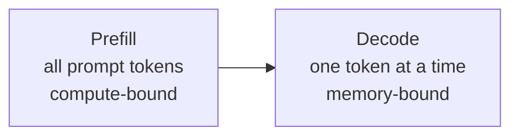

# Inference 최적화

> LLM inference는 두 phase로 나뉩니다. Prefill은 prompt를 병렬로 처리하며 compute-bound입니다. Decode는 token을 하나씩 생성하며 memory-bound입니다. 모든 optimization은 둘 중 하나 또는 둘 다를 겨냥합니다.

**Type:** Build
**Languages:** Python
**Prerequisites:** Phase 10, Lessons 01-08 (Transformer architecture, attention)
**Time:** ~120 minutes

## 학습 목표

- autoregressive token generation 중 redundant computation을 제거하는 KV-cache를 구현합니다
- LLM inference의 prefill vs decode phase와 각 phase의 bottleneck(compute-bound vs memory-bound)을 설명합니다
- concurrent request에서 GPU utilization을 극대화하는 continuous batching과 PagedAttention 개념을 구현합니다
- KV-cache, speculative decoding, flash attention 같은 inference optimization technique의 throughput/latency tradeoff를 비교합니다

## 문제

Llama 3 70B를 4xA100 GPU에 배포했다고 합시다. user 한 명은 약 50 tokens/sec를 받습니다. 빨라 보입니다. 하지만 100명이 동시에 endpoint를 때리면 user당 throughput이 3 tokens/sec로 떨어집니다. 월 $25,000 GPU bill로 사람이 타이핑하는 속도보다 느린 response를 serving하는 상황입니다.

1명과 100명 사이에서 model은 변하지 않습니다. weight, architecture, math는 같습니다. 달라지는 것은 work scheduling입니다. naive inference는 GPU compute의 90% 이상을 낭비합니다. 어떤 user가 token 47을 기다리는 동안 batch slot 하나를 붙들고 있고, GPU memory bus는 matmul 사이에서 idle합니다. 그 사이 새 user의 2,000-token prompt는 useful compute로 그 dead time을 채울 수 있습니다.

이것은 scaling 문제가 아니라 scheduling 문제입니다. KV caching, continuous batching, PagedAttention, speculative decoding, prefix caching은 같은 traffic에서 $25k/month inference bill과 $5k/month bill을 가르는 기술입니다.

vLLM은 Llama 3 70B를 4xA100-80GB에서 serving할 때 low concurrency에서 약 50 tokens/sec/user를 내고, continuous batching과 PagedAttention으로 100 concurrent request에서도 15-25 TPS/user를 유지할 수 있습니다. 최적화가 없으면 같은 hardware에서 5 TPS/user 수준입니다.

## 개념

### Prefill vs decode

LLM inference request는 두 phase가 있습니다.

**Prefill**은 전체 input prompt를 처리합니다. 모든 token이 알려져 있으므로 attention을 full sequence에 대해 병렬 계산할 수 있습니다. 큰 matrix multiplication이므로 GPU core가 바쁩니다. bottleneck은 hardware가 초당 제공하는 FLOPS입니다. A100은 BF16에서 312 TFLOPS를 냅니다. 70B model의 4,096-token prompt prefill은 단일 A100에서 약 400ms가 걸립니다.

**Decode**는 output token을 하나씩 생성합니다. 새 token은 이전 모든 token을 attend하지만 forward pass마다 token 하나만 나옵니다. prefill과 같은 크기의 weight matrix를 읽지만 matrix가 아니라 single vector와 곱합니다. GPU core는 microsecond 안에 끝나고 다음 weight batch가 memory에서 오기를 기다립니다. bottleneck은 HBM에서 compute unit으로 model weight를 stream하는 memory bandwidth입니다. A100은 2 TB/s bandwidth이고 FP16 70B model은 140GB입니다. model 전체를 한 번 읽는 데 70ms가 걸리며, 이것이 single decode step의 floor입니다.



ops:byte ratio(arithmetic intensity)는 memory에서 읽은 byte당 수행하는 operation 수입니다.

```text
ops:byte ratio = FLOPs per token / bytes read from memory
```

prefill에서 4,096 token batch를 처리하면 weight 하나를 읽고 약 4,096 multiply-accumulate를 수행합니다. ratio가 높아 compute-bound입니다. batch size 1 decode에서는 weight 하나를 읽고 operation 하나에 가깝습니다. ratio가 낮아 memory-bound입니다.

핵심 insight: decode는 single token을 만들기 위해 전체 model을 읽기 때문에 memory-bound입니다. 아래 optimization들은 읽는 양을 줄이거나, 한 번 읽을 때 처리하는 token batch를 늘리거나, 읽기를 피합니다.

### KV Cache

attention에서 각 token의 query는 이전 token의 key/value vector를 attend합니다. cache가 없으면 token N을 생성할 때 이전 N-1 token의 key/value projection을 다시 계산합니다. token 1은 token 2 생성 때 projection되고, token 3 때 다시 projection되고, token 1000까지 총 999번 projection됩니다.

KV cache는 이전 token의 key/value projection을 저장합니다. token N을 생성할 때는 token N의 K/V만 계산하고 tokens 1..N-1의 cached K/V와 concatenate합니다.

```text
KV cache size = 2 * num_layers * num_kv_heads * head_dim * seq_len * bytes_per_param
```

Llama 3 70B(80 layers, GQA의 8 KV heads, head_dim=128, BF16):

```text
per token: 2 * 80 * 8 * 128 * 2 bytes = 327,680 bytes = 320 KB
at 4,096 tokens: 320 KB * 4,096 = 1.28 GB
at 128K tokens: 320 KB * 131,072 = 40 GB
```

Llama 3 70B의 128K-context conversation 하나는 KV cache 40GB를 씁니다. A100 memory의 절반입니다. 4K token user 100명이 동시에 있으면 KV cache만 128GB가 필요합니다. 그래서 KV cache management가 inference optimization의 중심입니다.

### Continuous batching

static batching은 N개 request가 모일 때까지 기다리고 함께 처리한 뒤 모두 끝날 때까지 새 request를 받지 않습니다. 한 request가 500 token, 다른 request가 10 token이면 짧은 request는 끝난 뒤 490 decode step 동안 idle slot을 차지합니다.

continuous batching(iteration-level batching)은 request가 끝나는 즉시 새 request를 batch에 넣습니다. batch는 decode step마다 재평가됩니다. 10 token 뒤 끝난 request는 즉시 waiting request로 대체됩니다.

output length가 다양할수록 improvement가 큽니다. uniform length에서는 static batching과 비슷하지만, 일반적인 variable length workload에서는 GPU slot이 비지 않아 2-5배 높은 throughput을 낼 수 있습니다.

### PagedAttention

각 request의 KV cache를 contiguous memory block으로 할당하면 request가 들어오고 나갈 때 memory fragmentation이 생깁니다. 4K-token request가 1.28GB contiguous block을 요구할 때 총 free memory가 2GB여도 contiguous 1.28GB가 없으면 request를 reject하거나 memory를 낭비합니다.

PagedAttention(vLLM)은 KV cache에 OS-style virtual memory를 적용합니다. request마다 하나의 contiguous block을 할당하지 않고 fixed-size page(보통 16 token)를 할당합니다. page는 physical GPU memory 어디에나 있을 수 있고 page table이 logical sequence position을 physical page location에 mapping합니다.

또한 shared prefix에 copy-on-write를 가능하게 합니다. 50개 request가 같은 system prompt를 공유하면 해당 prefix의 KV cache page는 한 번만 저장되고 50개 request가 reference합니다. 각 request가 다른 user message로 diverge할 때만 자기 page를 갖습니다. vLLM은 PagedAttention으로 memory waste를 naive allocation의 60-80%에서 약 4% 수준으로 줄인다고 보고했습니다.

### Speculative Decoding

decode는 sequential이라 느립니다. token 하나를 만들고 다시 넣어 다음 token을 만듭니다. speculative decoding은 작은 fast draft model로 K개 candidate token을 추측하고, 큰 target model이 한 번의 forward pass로 K개를 모두 verify합니다. target model이 draft와 동의하면 K개 token을 거의 한 번의 target step 시간에 accept합니다. position j에서 mismatch가 나면 1..j-1 token을 accept하고 나머지는 버립니다.

speedup은 acceptance rate에 달려 있습니다. Llama 3 8B가 Llama 3 70B를 draft하면 natural language에서 70-85% acceptance rate가 흔하고 decode speedup은 2-3배가 됩니다.

| Method | Draft source | Acceptance rate | Overhead |
|--------|-------------|-----------------|----------|
| Draft-target | separate small model | 70-85% | draft model memory |
| EAGLE | target 위 lightweight head | 75-90% | ~1% extra parameters |
| N-gram lookup | token n-gram table | 40-60% | negligible |

speculative decoding은 mathematically exact합니다. verification step이 target model distribution과 같은 probability로 accepted token을 보장하므로 approximation이 아닙니다.

### Prefix caching

많은 request는 같은 prefix를 공유합니다. chatbot system prompt, RAG context block, few-shot example set이 대표적입니다. prefix caching은 common prefix의 KV cache를 저장하고 새 request에서 재사용합니다. 2,000-token system prompt가 모든 request에 공유되면 request마다 약 400ms prefill을 없앨 수 있습니다. 100 requests/sec에서는 초당 40초의 GPU compute를 절약합니다.

SGLang의 RadixAttention은 token content로 prefix를 index하는 radix tree(trie)를 사용합니다. cached entry와 1,500/2,000 token을 공유하면 1,500 token KV를 재사용하고 500 token만 recompute합니다.

### Inference engine

| Engine | Key innovation | Best for |
|--------|---------------|----------|
| vLLM | PagedAttention, continuous batching | general-purpose serving, highest compatibility |
| SGLang | RadixAttention(prefix caching), structured generation | multi-turn chatbot, constrained decoding |
| TensorRT-LLM | NVIDIA kernel fusion, FP8 quantization | NVIDIA hardware의 maximum single-GPU throughput |

**vLLM**은 default starting point입니다. model support가 넓고 NVIDIA/AMD/Intel GPU에서 돌아가며 OpenAI-compatible API를 제공합니다.

**SGLang**은 prefix caching과 structured LLM program용 DSL을 추가합니다. multi-turn conversation, tool use, constrained decoding(JSON, regex-guided generation)이 많으면 prefix reuse로 vLLM보다 2-5배 빠를 수 있습니다.

**TensorRT-LLM**은 model을 optimized NVIDIA GPU kernel로 compile합니다. attention + linear + activation fusion, H100 FP8, Triton Inference Server integration을 제공합니다. NVIDIA에서 최고 throughput을 내지만 setup이 더 어렵고 NVIDIA GPU에 묶입니다.

## 직접 만들기

`code/main.py`는 다음 개념을 toy implementation으로 보여 줍니다.

- KV cache가 없는 autoregressive generation과 있는 generation의 연산량 비교
- prefill/decode phase별 cost model
- continuous batching scheduler simulation
- PagedAttention-style page allocation simulation
- speculative decoding acceptance-rate simulation

`code/main.rs`는 Rust stdlib로 일부 핵심 simulation을 구현합니다.

## 사용하기

```bash
cd phases/10-llms-from-scratch/12-inference-optimization/code
python3 main.py
rustc --edition 2021 main.rs && ./main
```

출력은 KV cache memory, naive vs cached generation cost, static vs continuous batching throughput, page allocation waste, speculative decoding speedup estimate를 보여 줍니다.

## 산출물

이 lesson은 `outputs/skill-inference-optimization.md`를 제공합니다. workload의 bottleneck을 진단하고 vLLM/SGLang/TensorRT-LLM, KV cache, continuous batching, prefix caching, quantization, speculative decoding을 어떤 순서로 적용할지 정하는 pattern입니다.

## 연습 문제

1. Llama 3 8B, 70B, 405B의 KV cache memory를 context length와 concurrent user 수별로 계산하세요.
2. continuous batching simulator에 variable output length distribution을 넣고 throughput gain을 측정하세요.
3. PagedAttention page size를 8, 16, 32 token으로 바꿔 fragmentation과 metadata overhead를 비교하세요.
4. speculative decoding acceptance rate를 40%, 70%, 90%로 바꿔 latency gain을 계산하세요.
5. shared system prompt가 0%, 50%, 90%일 때 prefix caching savings를 추정하세요.

## 핵심 용어

| 용어 | 의미 |
|------|---------|
| Prefill | prompt token 전체를 병렬 처리하는 compute-bound phase |
| Decode | output token을 하나씩 생성하는 memory-bound phase |
| KV cache | 이전 token의 key/value projection을 저장해 재계산을 피하는 cache |
| Continuous batching | decode step마다 request를 batch에 추가/제거하는 scheduling |
| PagedAttention | KV cache를 fixed-size page로 관리하는 vLLM memory scheme |
| Speculative decoding | 작은 draft model이 token을 제안하고 큰 target model이 병렬 verify하는 exact decoding speedup |
| Prefix caching | shared prefix의 KV cache를 request 사이에서 재사용하는 technique |
| TTFT | time to first token, 주로 prefill latency |
| ITL | inter-token latency, streaming decode speed |

## 더 읽을거리

- [vLLM and PagedAttention](https://arxiv.org/abs/2309.06180)
- [Speculative Decoding](https://arxiv.org/abs/2211.17192)
- [EAGLE](https://arxiv.org/abs/2401.15077)
- [SGLang](https://github.com/sgl-project/sglang)
- [TensorRT-LLM](https://github.com/NVIDIA/TensorRT-LLM)
