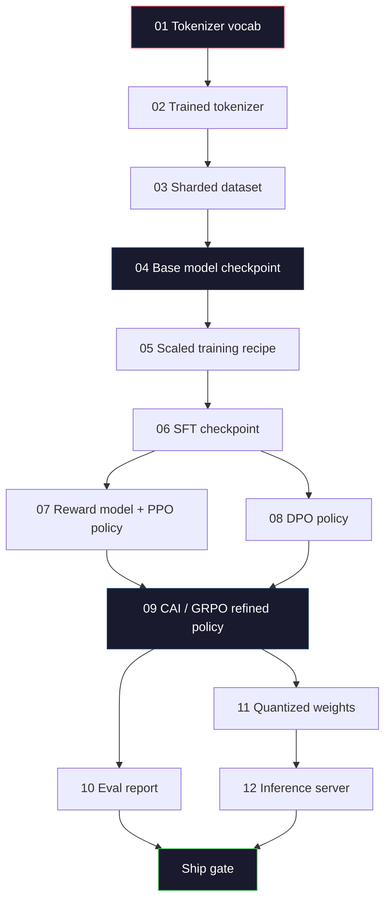
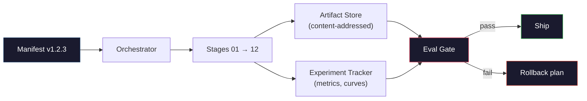

# 완전한 LLM Pipeline 구축

> Lessons 01부터 12까지의 모든 내용은 하나의 pipeline을 이루는 한 단계입니다. 이 lesson은 그 단계들을 tokenize, pre-train, scale, SFT, align, evaluate, quantize, serve로 이어지는 단일 end-to-end 실행으로 바꾸는 scaffold입니다. 노트북에서 70B 모델을 훈련하지는 않습니다. 대신 2026년 frontier team이 무엇을 ship할지 결정할 때 쓰는 orchestration layer, manifest, eval gate, rollback plan을 만들 것입니다. 이것이 capstone입니다.

**Type:** Build
**Languages:** Python (stdlib)
**Prerequisites:** All Phase 10 lessons 01-12
**Time:** ~120 minutes

## 학습 목표

- 이전 열한 lesson(tokenizer, data, pre-training, scaling, SFT, RLHF, DPO, CAI, eval, quantization, inference)을 하나의 재현 가능한 pipeline spec으로 조합하기
- 단계 사이의 artifact contract를 정의하기: 각 단계가 무엇을 소비하고, 무엇을 생성하며, 다음 단계가 입력을 어떻게 검증하는지
- Experiment를 추적하고 artifact를 hash하며 eval threshold에 따라 ship 결정을 gate하는 orchestrator 만들기
- Rollback plan 설계하기: 어떤 artifact는 재실행 비용이 싼지, 어떤 것은 비싼지, 손상된 checkpoint가 얼마의 비용을 만드는지

## 문제

이전 lesson들은 각각 동작합니다. Tokenizer가 훈련되었습니다. 작은 GPT가 pre-training되었습니다. SFT dataset이 조립되었습니다. Reward model이 훈련되었습니다. DPO가 실행되었습니다. Eval이 측정되었습니다. Quantized weights가 export되었습니다. Inference server가 올라갔습니다. 그러나 각각은 notebook입니다. 각각은 자체 convention, 자체 output path, 자체 seed를 갖습니다.

Frontier training run은 notebook이 아닙니다. Llama 3 405B는 대략 54일 동안 3천만 H100 시간을 사용했습니다. DeepSeek-V3는 약 280만 H800 시간을 사용했습니다. 그 기간 동안 손상된 checkpoint 하나, data contamination 하나, eval regression 하나가 팀에 일주일의 wall-clock과 한 달치 GPU budget을 잃게 만들 수 있습니다. 팀이 이를 버티는 방법은 pipeline hygiene입니다. 모든 단계는 deterministic input, deterministic output, manifest, hash, gate를 가져야 합니다.

이것이 capstone입니다. 노트북에서 pipeline을 end-to-end로 실행하지는 않습니다. 단계들을 조율하는 orchestrator, run을 설명하는 manifest, ship 결정을 gate하는 verifier, 제3자가 단일 파일만으로 작업을 재실행하게 해 주는 replay plan을 작성합니다. 코드는 작지만 규율은 큽니다.

이 pattern은 100M에서 1T parameter까지 그대로 확장됩니다. 같은 네 구성 요소, 즉 manifest, orchestrator, eval gate, artifact store가 Llama 3도 실행하고 취미용 GPT도 실행합니다. 차이는 pipeline의 모양이 아니라 각 stage config 안 숫자의 크기입니다.

## 개념

### 열두 단계

Phase 10의 모든 lesson은 하나의 stage입니다. 전체 dependency graph는 다음과 같습니다.



Stage 07과 08은 병렬로 실행할 수 있습니다. 나머지는 모두 hard dependency입니다. Stage 02(tokenizer)의 변경은 모든 downstream artifact를 무효화합니다. Stage 10(eval)의 변경은 ship decision만 무효화합니다.

### Manifest

Manifest는 run을 재현할 수 있을 만큼 완전하게 설명하는 단일 파일입니다. Pipeline이 생성하는 어떤 것도 manifest에 없는 상태에 의존해서는 안 됩니다. 필드는 평범하지만 필수입니다.

```yaml
pipeline_version: 1.2.3
seed: 42
git_commit: a1b2c3d4
stages:
  01_tokenizer:
    recipe: bpe_32k
    input_hash: sha256:...
    output_hash: sha256:...
    wall_clock_sec: 3600
    cost_usd: 12
```

Stage N의 output hash는 stage N+1의 input hash입니다. 조금이라도 어긋나면 pipeline은 멈춥니다. 이것이 data corruption을 일찍 잡는 방법입니다. 또한 다른 대륙에 있는 teammate가 replay로 당신과 같은 artifact를 만들었는지 검증하는 방법이기도 합니다.

실무에서는 작은 YAML schema와 이전 successful run과 diff하는 manifest checker를 함께 씁니다. 예상 가능한 필드(cost, wall clock)를 벗어난 delta는 모두 red flag입니다.

### Artifact typing

각 stage의 output은 typed artifact입니다. Directory blob이나 pickle이 아니라, 알려진 schema를 가진 이름 있는 type입니다.

| Stage | Artifact type | 핵심 field |
|-------|--------------|-----------|
| 01-02 | Tokenizer | vocab.json, merges.txt, config.json, hash |
| 03 | Dataset | shards[], row count, token count, dedup stats |
| 04-05 | Checkpoint | weights.safetensors, config.json, optimizer state, step count |
| 06 | SFT Model | checkpoint + SFT recipe + data mix |
| 07 | Reward Model | RM checkpoint + preference data hash |
| 08-09 | Policy | checkpoint + reference hash + beta + consumed KL budget |
| 10 | Eval Report | benchmark scores + regression diffs + eval data hash |
| 11 | Quantized Model | quantized weights + calibration data + accuracy delta vs FP16 |
| 12 | Server Spec | endpoint + model hash + config + observability hooks |

Typing은 가장 흔한 failure mode를 막습니다. 예를 들어 stage 08 output을 stage 06 input처럼 사용해 DPO-trained model을 SFT path로 ship하는 사고입니다. Typed artifacts와 typed stage signatures는 이런 오류를 day-five failure가 아니라 compile-time failure로 만듭니다.

### Eval Gate

Shipping은 "training finished"가 아닙니다. Shipping은 "training finished and the eval gate passed"입니다. Gate는 run이 시작되기 전에 정의합니다.

```yaml
gates:
  mmlu:      >= baseline + 0.5   # no regression
  humaneval: >= baseline + 1.0
  truthfulqa: >= baseline         # no drop
  safety_refusal_rate: <= 0.05
  kl_from_reference: <= 25.0
  cost_total_usd: <= 50000
```

모든 gate는 숫자 threshold입니다. "looks good" gate도, 주관적 sign-off도 없습니다. 모든 gate가 통과하면 artifact는 shippable로 표시됩니다. 하나라도 실패하면 run은 named reviewer의 명시적 override가 있을 때까지 hold되며, override 자체도 manifest에 기록됩니다.

두 gate가 대부분의 큰 사고를 잡습니다. *Regression* gate(새 모델이 핵심 benchmark에서 이전 모델 이상이어야 함)는 training bug를 잡습니다. *KL budget* gate(aligned policy가 reference에서 X보다 더 멀리 drift하면 안 됨)는 alignment overcooking을 잡습니다. 모든 production pipeline은 둘 다 갖습니다.

### Orchestrator

Manifest를 읽고, stage를 dispatch하고, artifact를 추적하며, contract 위반이 있으면 멈추는 작은 코드 조각입니다. 이것은 Airflow가 아닙니다. Kubeflow도 아닙니다. Pipeline hygiene에는 직접 작성한 지루한 도구가 더 좋습니다.

Orchestrator의 역할은 좁습니다.

1. Manifest에서 DAG를 해석합니다.
2. 각 stage에 대해 기대 output이 정확한 hash로 이미 존재하는지 확인합니다(그렇다면 skip).
3. Stage를 실행하고 stdout/stderr를 capture하며 wall clock과 cost를 측정합니다.
4. Output hash를 downstream stage의 expected input hash와 대조해 검증합니다.
5. 실패 시 정확한 failing stage가 담긴 partial manifest를 쓰고 nonzero로 종료합니다.

이것은 Python 200줄입니다. 이 lesson의 `code/main.py`처럼 보일 것입니다. 실제 pipeline은 내부에서 `torchrun`이나 `ray`로 cluster의 개별 stage를 실행하지만, orchestrator 자체는 단일 box에서 실행됩니다.

### Experiment Tracking과 Artifact Storage

두 외부 시스템이 pipeline을 고정합니다.

**Experiment tracker (wandb, neptune, mlflow).** Stage별 loss curve, eval metric, system telemetry를 기록합니다. 3주 뒤 run A와 run B를 비교해야 할 때 찾아가는 곳입니다. 팀들은 거의 항상 hosted tracker를 씁니다. 직접 만들면 훈련에 써야 할 시간을 잃습니다.

**Artifact store (S3, R2, GCS).** Checkpoint, dataset, tokenizer, eval report를 저장하는 immutable object store입니다. Artifact는 filename이 아니라 hash로 주소가 지정됩니다. `latest.pt` 같은 filename은 foot-gun입니다. `ckpt-7b-step-20000-sha256:abc123.safetensors`는 contract입니다.

Orchestrator는 둘 다에 씁니다. Tracker는 사람이 chart를 보는 곳입니다. Artifact store는 다음 stage가 input을 찾는 곳입니다.

### 비용 산정

Frontier run에는 dollar number가 붙습니다. Budget discipline은 두 곳에서 일어납니다.

**Pre-run estimate.** Manifest에서 expected FLOPs(pre-training: 6 x params x tokens), expected GPU hours(FLOPs / peak throughput / utilization), 현재 rental rate 기준 dollar cost를 계산합니다. 추정치가 budget gate를 넘으면 pipeline은 시작을 거부합니다.

**In-run tracking.** Stage별 wall clock과 cost를 manifest에 기록합니다. 매 stage 뒤에 remaining budget을 확인합니다. 어떤 stage가 초과 실행되면 다음 stage의 gate는 새 remaining budget으로 평가됩니다. VC가 전화할 때 돈이 떨어졌다는 사실을 알게 되어서는 안 됩니다.

Llama 3의 보고 비용은 $61M였습니다. DeepSeek-V3는 main pre-training run에 $5.6M을 보고했습니다. 비율의 대부분은 hardware efficiency와 mixture-of-experts에서 나오지만, 두 팀 모두 run 단위가 아니라 stage 단위로 비용을 추적했기 때문에 구체적 비용이 보이는 것입니다.

### 재현 가능성 vs 결정성

둘은 같지 않습니다. *Reproducible*은 같은 manifest, 같은 code, 같은 infrastructure가 downstream metric이 동등한 checkpoint를 생성한다는 뜻입니다. *Deterministic*은 bit-identical output을 뜻합니다.

현대 LLM training은 reproducible하지만 deterministic하지는 않습니다. Distributed training의 reduce-order, GPU kernel non-determinism(cuBLAS, flash-attn), mixed precision rounding이 결합되어 run 사이에 1e-5 수준으로 다른 float가 만들어집니다. 최종 metric이 움직이지 않는다면 이는 괜찮습니다. 그러나 bit-level diff로 debug하려 한다면 치명적입니다. 처방은 모든 stage의 input hash, output hash, headline metric을 기록하는 것입니다. 그것들이 맞으면 weights가 bit-identical이 아니어도 run은 "reproduced"된 것입니다.



### Rollback plan

Run이 시작되기 전에 각 stage 실패 시 무엇을 할지 적어 둡니다. 세 범주가 있습니다.

- **재실행 비용이 낮음**(hours): tokenizer, eval, quantization, inference server. 그냥 다시 실행합니다.
- **중간**(days): SFT, DPO, CAI. Base model은 유지하고 alignment stage만 다시 실행합니다.
- **비쌈**(weeks and millions of dollars): pre-training. 여기서 rollback plan은 "re-run"이 아닙니다. "마지막 good checkpoint를 사용하고 수정된 data로 더 싼 downstream stage를 다시 실행"하는 것입니다.

Stage dependency가 typed 및 hashed되어 있으므로 orchestrator는 rollback set을 자동으로 계산할 수 있습니다. Stage 06(SFT) 실패는 06, 07, 08, 09, 10, 11, 12를 무효화합니다. Stage 11(quantization) 실패는 11과 12만 무효화합니다. 이를 미리 이름 붙여 두면 팀이 새벽 4시에 지쳐 있을 때 즉흥적으로 결정하지 않아도 됩니다.

### 2026년에 관찰된 Production Recipe

대부분의 frontier team은 같은 skeleton으로 수렴했습니다.

- Tokenizer: byte fallback이 있는 128k BPE. 작고 균형 잡힌 multilingual slice에서 훈련.
- Pre-training: 10-20T tokens, 대부분 web + code + synthetic. Muon 또는 AdamW optimizer. FSDP2 또는 DeepSpeed ZeRO-3. Gradient checkpointing. BF16 weights, FP32 master.
- SFT: 500k-2M instruction pairs, human과 synthetic 혼합, eval set에 대한 엄격한 dedup.
- Alignment: DPO 또는 CAI + GRPO. Preference signal이 DPO에 비해 너무 다차원적일 때만 RLHF.
- Eval: MMLU-Pro, MATH, HumanEval+, GPQA, SWE-Bench Verified, LiveBench, 그리고 공개되지 않는 private held-out set.
- Quantization: Serving에는 4-bit GPTQ 또는 AWQ, accuracy delta가 중요한 safety eval에는 8-bit.
- Serving: vLLM, TensorRT-LLM 또는 in-house. Continuous batching. Speculative decoding. KV cache eviction.

숫자는 6개월마다 바뀝니다. Skeleton은 바뀌지 않습니다.

```figure
beam-search
```

## 직접 만들기

이 lesson의 코드는 열두 개 training script가 아니라 orchestrator와 manifest checker입니다. 각 stage는 올바른 shape와 hash를 가진 output artifact를 생성하는 placeholder로 시뮬레이션됩니다. Orchestrator를 end-to-end로 실행하면 실제 stage에 GPU 비용을 태우기 전에 pipeline plumbing이 작동함을 증명할 수 있습니다.

전체 구현은 `code/main.py`를 보세요. 핵심 구성 요소는 다음과 같습니다.

- `Manifest` dataclass: pipeline version, seed, git commit, stages, gates를 담습니다.
- `Stage` dataclass: name, type, inputs(hashes), output(hash), wall clock, cost를 담습니다.
- `Orchestrator.run()`: DAG를 해석하고, stage를 dispatch하고, hash를 검증하고, manifest를 갱신합니다.
- `EvalGate.check()`: threshold를 읽고 최신 eval report와 비교해 pass/fail을 반환합니다.
- `ArtifactStore`(in-memory stub): hash로 put/get하며 S3를 시뮬레이션합니다.
- `CostTracker`: stage별 및 누적 cost를 추적하고 cap을 넘으면 중단합니다.

`main.py`의 pipeline은 열두 placeholder stage를 실행하고 manifest를 생성하며, 실패하는 eval gate를 연습해 held run이 어떤 모습인지 보여 줍니다. 각 placeholder를 해당 lesson의 실제 training script로 바꾸면 실제 frontier pipeline이 쓰는 skeleton을 갖게 됩니다.

## 활용하기

Canonical workflow는 세 command입니다.

```bash
python code/main.py plan    # validate manifest, compute cost estimate, print DAG
python code/main.py run     # execute stages, writing to manifest.out.yaml
python code/main.py gate    # read manifest.out.yaml, apply eval gates, ship-or-hold
```

항상 먼저 `plan`을 실행하세요. 대부분의 pipeline bug는 plan 시점에 드러납니다. Missing gate thresholds, stale hashes, budget overruns 같은 것들입니다. `plan` 실행은 공짜입니다. `run` 실행은 비쌉니다. 싸게 잡을 수 있는 곳에서 bug를 잡아 돈을 아끼세요.

`gate`의 output은 `SHIP` 또는 `HOLD: <reason>`입니다. Held run은 failure가 아니라 decision point입니다. Named reviewer가 override하거나(그리고 override는 기록됨), rollback을 승인합니다.

## 산출물

이 lesson은 `outputs/skill-llm-pipeline-reviewer.md`를 생성합니다. 제안된 pipeline manifest를 넣으면 stage typing, hash chain, gates, rollback plan, cost estimate 등 모든 contract를 확인합니다. Missing eval gate, unbounded KL budget, eval data와 training data를 섞는 run은 승인하지 않습니다.

## 연습문제

1. Orchestrator를 확장해 stage 07과 08의 병렬 실행을 지원하세요. Stdlib `concurrent.futures` module을 사용하세요. Final manifest가 두 stage의 output을 모두 기록하고 stage 09의 input hash가 둘의 deterministic combination인지 확인하세요.

2. "Contamination check" gate를 추가하세요. Eval dataset hash와 training dataset shard가 주어졌을 때 overlap(exact string match 또는 13-gram match)을 계산하세요. Overlap이 0.1%를 넘으면 gate가 실패해야 합니다. 오염된 training set을 넣고 gate가 run을 hold하는지 확인하세요.

3. First principles에서 cost estimator를 구현하세요. Stage 04(pre-training)에 대해 FLOPs를 6 x params x tokens로 추정하고, H100의 989 TFLOPs BF16에서 40% MFU(model FLOPs utilization), $2.50/GPU-hour를 가정하세요. 2T tokens로 훈련한 7B model의 추정치를 보고하세요. Published Llama 2 수치와 비교하세요.
