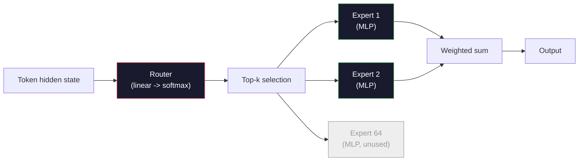

# Open Model 아키텍처 해설

> Lesson 04에서 GPT-2 Small을 처음부터 만들었습니다. 2026년의 frontier open model은 같은 계열에 다섯 여섯 가지 구체적 변경을 더한 것입니다. LayerNorm 대신 RMSNorm. GELU 대신 SwiGLU. Learned positions 대신 RoPE. Full MHA 대신 GQA 또는 MLA. Scale에서의 Mixture-of-Experts. 이미 알고 있는 수학이 그중 95%를 설명합니다. 이 lesson은 Llama 3, DeepSeek-V3, Mixtral, Qwen, Gemma를 나란히 읽고 각 architecture가 갈라지는 정확한 지점을 이름 붙입니다.

**Type:** Learn
**Languages:** Python (stdlib)
**Prerequisites:** Phase 10, Lessons 04, 05, 12 (Pre-training, Scaling, Inference)
**Time:** ~45 minutes

## 학습 목표

- Llama 3, Mistral, Mixtral, Gemma 2, Qwen 2.5, DeepSeek-V3의 config.json을 읽고 모든 field를 설명하기
- 각 model이 GPT-2 Small 대비 만든 구체적 architecture 변경을 이름 붙이고 first principles로 정당화하기
- Config만으로 임의의 open model에 대한 parameter count, KV cache size, activation memory 계산하기
- Latency, memory, capability constraint가 주어졌을 때 deployment target에 맞는 open model 고르기

## 문제

Lesson 04에서 350줄의 numpy로 GPT-2 모양의 model을 만들었습니다. Llama 3 405B에는 200페이지짜리 technical report가 있습니다. 직감적으로 둘은 다른 생물처럼 느껴집니다. 그렇지 않습니다. 그 200페이지는 같은 객체를 잘 동기화된 다섯 여섯 가지 수정과 scaling에 관한 수많은 구현 세부 사항으로 설명합니다. Skeleton, 즉 embedding, transformer blocks, attention, MLP, norm, head는 바뀌지 않았습니다.

이 lesson은 diff입니다. 주요 open model family마다 GPT-2에서 정확히 무엇이 바뀌었는지, 왜 바뀌었는지, 어떤 비용이 들었는지 나열합니다. 끝나면 새 model card를 읽고 그것을 GPT-2 baseline으로 머릿속에서 다시 번역할 수 있습니다.

실용적 이득은 Meta가 Llama 5를 내거나 DeepSeek이 V4를 내도 새 mental model이 필요 없다는 것입니다. Config를 보고 잘 알려진 knob 중 무엇이 움직였는지 파악하면 downstream implication을 알 수 있습니다. 2026 architecture는 유한한 toolbox입니다. 새 model은 그중 다른 subset을 고릅니다.

## 개념

### 변하지 않는 핵심

모든 autoregressive open model은 다음을 공유합니다.

- Token embedding matrix(vocab_size x hidden_dim).
- N개의 decoder block stack: norm, self-attention, residual, norm, MLP, residual.
- Final norm과 vocab_size로 projection하는 linear head(embedding과 weight-tied인 경우가 많음).
- Causal mask와 next-token cross-entropy loss.

이것이 형태입니다. 나머지는 knob입니다.

### 실제로 영향을 주는 여섯 knob

2024-2026년 모든 frontier open model을 가로질러 같은 여섯 가지 design choice가 반복해서 선택됩니다.

1. **Normalization.** LayerNorm -> RMSNorm.
2. **Positional encoding.** Learned absolute -> RoPE(변형: YaRN, NTK).
3. **Activation.** GELU -> SwiGLU(또는 GeGLU).
4. **Attention head sharing.** MHA -> GQA -> MQA -> MLA.
5. **Dense vs sparse MLP.** Dense -> Mixture-of-Experts.
6. **Pre-norm placement.** Pre-norm은 유지됩니다. Post-norm은 사라졌습니다.

그 밖의 것(learning rate schedule, data mix, batch size, context length)은 architecture가 아니라 training config에 있습니다. 여섯 knob입니다.

### Knob 1: RMSNorm

LayerNorm은 mean을 빼고 std로 나눈 뒤 scale과 shift를 적용합니다. RMSNorm은 scale만 남깁니다.

```text
RMSNorm(x) = x / sqrt(mean(x^2) + eps) * gamma
```

Mean subtraction이 없습니다. Bias도 없습니다. Token당 matmul 하나가 줄어듭니다. Zhang and Sennrich(2019)는 machine translation에서 LayerNorm과 맞먹으면서 10% 빠르다고 주장했습니다. 모든 현대 open model이 이를 사용합니다.

비용: 없음. 이점: 작은 throughput 개선, 더 단순한 코드.

### Knob 2: RoPE

Learned position embedding은 GPT-2에서 1024-slot lookup table이었습니다. Context 1025는 table 끝 밖입니다. Model은 training length를 넘어 extrapolate할 수 없습니다.

Rotary Position Embedding(RoPE, Su et al. 2021)은 attention dot product 전에 각 Q와 K vector를 pair 단위로 회전시켜 position을 주입합니다. 회전 각도는 position의 deterministic function이므로 학습되는 것이 없고 고갈될 것도 없습니다. Scaling trick(NTK-aware interpolation, YaRN)을 쓰면 8k context로 훈련한 model도 inference에서 128k까지 modest accuracy loss로 늘릴 수 있습니다.

```text
q_rotated = rotate(q, angle(pos))
k_rotated = rotate(k, angle(pos))
score = q_rotated . k_rotated
```

모든 Llama, Mistral, Qwen, DeepSeek, Gemma가 RoPE를 씁니다. Gemma 2는 hybrid를 사용합니다(대부분의 layer에는 RoPE, 다른 layer에는 local sliding-window attention).

### Knob 3: SwiGLU

GPT-2의 MLP는 `x -> gelu(xW1 + b1) -> (...)W2 + b2`입니다. SwiGLU(Shazeer 2020)는 activation을 gated product로 바꿉니다.

```text
SwiGLU(x) = (xW1) * sigmoid(xW1) * xV
```

하나 대신 두 projection을 병렬로 두고 Swish activation으로 gate합니다. 경험적으로 parameter당 perplexity가 더 좋습니다. Llama 2가 채택했고 모두가 뒤따랐습니다. MLP hidden size는 보통 total parameter count가 원래 dense MLP와 맞도록 설정됩니다. GPT-2가 `ff_dim = 4 * hidden`을 썼다면, SwiGLU는 `ff_dim = (2/3) * 4 * hidden = 8/3 * hidden`을 씁니다.

### Knob 4: Attention head sharing

GPT-2는 **Multi-Head Attention (MHA)** 를 사용했습니다. 모든 head가 자체 Q, K, V projection을 갖습니다.

**Multi-Query Attention (MQA, Shazeer 2019)** 는 모든 head가 하나의 K와 하나의 V를 공유합니다. KV cache가 num_heads만큼 줄어듭니다. 일반적인 model에서는 12x에서 32x 감소입니다. 어려운 benchmark에서는 accuracy가 약간 떨어집니다.

**Grouped-Query Attention (GQA, Ainslie et al. 2023)** 는 중간 지점입니다. G개의 Q head group이 하나의 K와 하나의 V를 공유합니다. Llama 3 8B는 32 Q heads와 8 KV heads(G=8)의 GQA를 사용하므로 full MHA 대비 KV cache가 4x 줄어듭니다.

**Multi-Head Latent Attention (MLA, DeepSeek 2024)** 는 K와 V를 shared low-rank latent로 압축한 뒤 head별로 다시 projection합니다. KV cache를 더 줄이면서 head별 expressiveness를 보존합니다. DeepSeek-V2와 V3는 long-context 성능을 위해 이에 의존합니다.

| Scheme | KV head | KV cache | 정확도 |
|--------|----------|----------|----------|
| MHA    | num_heads | full | best |
| GQA    | num_groups (G < num_heads) | num_heads / G reduction | near-MHA |
| MQA    | 1 | num_heads reduction | small hit |
| MLA    | latent, per-head decompression | smaller than MQA | near-MHA |

약 13B parameter를 넘는 model에서는 GQA 또는 MLA가 사실상 필수입니다. Scale에서 full MHA는 KV cache 재앙입니다.

### Knob 5: Mixture of Experts

Dense MLP는 모든 token에 대해 모든 parameter를 활성화합니다. MoE MLP는 block마다 K개의 expert와 token마다 top-k expert를 고르는 router를 갖습니다(보통 top-2). 그 expert들의 weight만 해당 token의 forward pass를 수행합니다.

```text
router_logits = xW_r
indices, weights = top_k(router_logits, k=2)
output = sum_i weights[i] * expert[indices[i]](x)
```

매력은 이렇습니다. 7B 크기의 expert를 64개 둘 수 있지만(token별로는 2개만 실행), 그래서 total param count는 매우 크고 per-token compute는 dense 7B model과 맞먹습니다. Mixtral 8x7B는 total parameters가 47B지만 token당 13B만 활성화합니다. DeepSeek-V3는 total parameters가 671B지만 token당 37B만 활성화합니다.



장점: 같은 compute, 더 많은 parameter, 더 높은 capacity. 단점: expert memory는 어딘가에 있어야 하므로 serving에는 dense equivalent보다 더 많은 VRAM이 필요하고, router load-balancing은 어렵고, alignment 중 router fine-tuning은 별도 연구 영역입니다.

### Knob 6: Pre-norm 유지

원래 transformer는 각 sublayer 뒤에 layer norm을 적용했습니다. GPT-2 이후 모든 open model은 각 sublayer 앞에 둡니다. Pre-norm은 depth에서 훈련하기 훨씬 쉽습니다. 논쟁의 여지가 없습니다.

### Model별 diff

다음 표가 이 내용을 구체화합니다.

| Model | 연도 | Total params | Active params | Norm | Activation | Position | Attention | MoE | Context |
|-------|------|-------------|---------------|------|-----------|----------|-----------|-----|---------|
| GPT-2 Small | 2019 | 124M | 124M | LayerNorm | GELU | Learned | MHA (12 heads) | no | 1k |
| Llama 3 8B | 2024 | 8B | 8B | RMSNorm | SwiGLU | RoPE | GQA (32/8) | no | 128k |
| Llama 3 70B | 2024 | 70B | 70B | RMSNorm | SwiGLU | RoPE | GQA (64/8) | no | 128k |
| Llama 3 405B | 2024 | 405B | 405B | RMSNorm | SwiGLU | RoPE | GQA (128/16) | no | 128k |
| Mistral 7B | 2023 | 7.2B | 7.2B | RMSNorm | SwiGLU | RoPE | GQA | no | 32k |
| Mixtral 8x7B | 2023 | 47B | 13B | RMSNorm | SwiGLU | RoPE | GQA | yes (8 experts, top-2) | 32k |
| Gemma 2 9B | 2024 | 9B | 9B | RMSNorm (pre+post) | GeGLU | RoPE + sliding | GQA | no | 8k |
| Qwen 2.5 72B | 2024 | 72B | 72B | RMSNorm | SwiGLU | RoPE (YaRN) | GQA (64/8) | no | 128k |
| DeepSeek V2 236B | 2024 | 236B | 21B | RMSNorm | SwiGLU | RoPE | MLA | yes (160 experts, top-6) | 128k |
| DeepSeek V3 | 2024 | 671B | 37B | RMSNorm | SwiGLU | RoPE | MLA | yes (256 experts, top-8) | 128k |

열을 훑어보세요. RMSNorm은 보편적입니다. SwiGLU 또는 그 사촌 GeGLU도 보편적입니다. RoPE도 보편적입니다. 7B를 넘으면 MLA로 대체되지 않는 한 GQA가 보편적입니다. 최상위 영역의 차별점은 MoE입니다.

### config.json 읽기

Llama 3 8B config:

```json
{
  "hidden_size": 4096,
  "intermediate_size": 14336,
  "num_hidden_layers": 32,
  "num_attention_heads": 32,
  "num_key_value_heads": 8,
  "max_position_embeddings": 131072,
  "rope_theta": 500000.0,
  "rms_norm_eps": 1e-5,
  "vocab_size": 128256
}
```

모든 field는 이미 구현해 본 무언가에 대응합니다.

- `hidden_size`: embedding dimension.
- `intermediate_size`: MLP hidden size(3.5x hidden -- SwiGLU math).
- `num_hidden_layers`: stack depth.
- `num_attention_heads`: Q heads.
- `num_key_value_heads`: KV heads(GQA).
- `max_position_embeddings`: training context length.
- `rope_theta`: RoPE base frequency. Meta는 long-context extrapolation을 위해 기본 10k에서 500k로 scale했습니다.
- `rms_norm_eps`: numerical stability.
- `vocab_size`: tokens.

이것만으로 total parameters, KV cache, peak activation memory를 계산합니다. 정확한 공식은 `code/main.py`를 보세요.

### Activation memory budget

수십억 parameter를 넘는 훈련에서는 activation이 training memory를 지배합니다. Pre-training의 경험식(gradient checkpointing 사용)은 다음과 같습니다.

```text
activation_mem ~ batch_size * seq_len * hidden_size * num_layers * bytes_per_element
```

Llama 3 8B에서 batch 1, seq 8192, BF16, 32 layers, hidden 4096이면 checkpointing이 있어도 activation만 대략 8 GB, 없으면 40 GB입니다. 이것이 flash-attention과 ring-attention이 중요한 이유입니다. Attention computation을 다시 써서 activation이 들어가게 만듭니다.

### KV cache budget

Max context inference의 경우:

```text
kv_cache = 2 * num_layers * num_kv_heads * head_dim * max_seq_len * bytes_per_element
```

Llama 3 8B at 128k context, BF16, head_dim = hidden / num_heads = 128:
`2 * 32 * 8 * 128 * 131072 * 2 = 17.2 GB` per sequence.

8B weights는 BF16에서 16 GB입니다. 단일 128k sequence의 KV cache가 weights보다 큽니다. 이것이 GQA, MLA, KV cache quantization 연구를 밀어붙이는 memory pressure입니다.

### 각 model이 유리한 경우

- **Single 80GB GPU, no MoE**: Llama 3 8B, Mistral 7B, Gemma 2 9B. Serving이 쉽고 tooling이 넓습니다.
- **Single node (8x80GB), big capacity**: Llama 3 70B, Qwen 2.5 72B. 가장 높은 dense open capability.
- **Biggest open capability, accept MoE complexity**: DeepSeek V3, Mixtral 8x22B. Active FLOP당 최고의 capability.
- **Long-context needs**: Llama 3(RoPE scaling으로 128k), DeepSeek(MLA 이점).
- **Low-latency serving**: Gemma 2 9B(sliding window가 long-context compute를 줄임).

```figure
rmsnorm-vs-layernorm
```

## 직접 만들기

이 lesson의 코드는 calculator입니다. 임의의 config.json이 주어지면 component별 parameter count, max context에서의 KV cache, SwiGLU MLP ratio, architecture에 대한 짧은 판정(dense / GQA / MLA / MoE)을 출력합니다.

```python
config = {
    "hidden_size": 4096, "intermediate_size": 14336,
    "num_hidden_layers": 32, "num_attention_heads": 32,
    "num_key_value_heads": 8, "vocab_size": 128256,
    "max_position_embeddings": 131072,
}
```

Script는 architecture field를 하나씩 훑으며 embedding, attention(GQA reduction 포함), MLP(SwiGLU expansion 포함), layernorms, head의 parameter count를 계산합니다. 이어서 명시된 context length에서 KV cache를 계산하고 summary를 출력합니다.

구현은 `code/main.py`를 보세요.

## 활용하기

Script에 포함된 Llama 3 8B, Mistral 7B, Mixtral 8x7B, DeepSeek V3 config로 calculator를 실행하세요. Parameter breakdown을 비교하세요. MoE model은 total param count가 dense model을 압도하지만 active param count는 더 작은 경우가 많다는 점을 보세요. DeepSeek V3는 total parameter가 더 많은데도 KV cache가 Llama 3 405B보다 작다는 점을 보세요. 이것이 MLA의 효과입니다.

그다음 로컬에 있는 임의 model의 config를 넣고 summary를 읽은 뒤, 그것이 GPU에 맞는지 판단하세요.

## 산출물

이 lesson은 `outputs/skill-open-model-picker.md`를 생성합니다. Deployment target(GPU type, VRAM, context length, latency budget)과 task profile(chat, code, reasoning, long-context)이 주어지면 open model, Lesson 11의 quantization scheme, Lesson 12의 inference stack을 추천하고 여섯 architecture knob에 대한 명시적 근거를 제공합니다.

## 연습문제

1. HuggingFace에서 Qwen 2.5 72B config를 읽으세요. Total parameters를 처음부터 계산하세요. HF가 보고한 값과 비교하고 차이가 어디서 나오는지 식별하세요(head dim rounding, KV sharing factor 등).

2. DeepSeek V3는 256 experts와 top-8 routing을 사용합니다. Activated experts와 total experts의 비율을 계산하고 Mixtral 8x7B의 top-2 of 8과 비교하세요. Sparse(25%)에서 denser sparse(3%)로 이동한 것이 FLOP당 capacity에 대해 무엇을 의미하나요?

3. Llama 3 405B의 128k context KV cache를 FP8과 BF16에서 계산하세요. FP8에서는 BF16 수치의 절반입니다. 단일 8xH100 node(각 80GB = 총 640GB, weight memory 제외)에서 몇 개의 parallel sequence를 serving할 수 있나요?

4. Gemma 2는 full-attention layer와 sliding-window-attention layer를 번갈아 씁니다. Layer 절반이 full context 대신 4096-token sliding window를 사용할 때 KV cache 수식을 쓰세요. 8k total context에서 memory를 얼마나 절약하나요?

5. 이 lesson이 작성된 뒤 공개된 최신 frontier open model을 찾으세요. 여섯 knob 중 무엇을 선택했는지, 일곱 번째 knob를 도입했는지 식별하세요. 새 architecture가 나오는 순간 curriculum은 낡아 보일 것입니다. 목표는 mental model을 다시 만들지 않고 table을 갱신하는 것입니다.

## 핵심 용어

| 용어 | 사람들이 흔히 말하는 뜻 | 실제 의미 |
|------|----------------|----------------------|
| RMSNorm | "mean 없는 LayerNorm" | Root mean square만으로 normalize하고 learned scale을 적용합니다. LayerNorm과 비슷하면서 더 저렴합니다 |
| RoPE | "Rotary positions" | Position에 따라 정해지는 각도로 각 Q와 K vector를 2D pair 단위로 회전합니다. Scaling trick으로 training length를 넘어 extrapolate합니다 |
| SwiGLU | "새 MLP activation" | Swish를 쓰는 gated linear unit: `(xW1) * sigmoid(xW1) * xV`. 2024+ open model의 표준입니다 |
| GQA | "중간 지점 attention" | Grouped-Query Attention: G개의 Q head group이 하나의 K와 하나의 V head를 공유합니다. MQA의 accuracy hit 없이 KV cache를 줄입니다 |
| MLA | "DeepSeek의 attention" | Multi-Head Latent Attention: K/V를 shared low-rank latent로 압축하고 head별로 decompress합니다. Large model에서 KV cache가 가장 작습니다 |
| MoE | "Sparse experts" | Mixture of Experts: block당 N개의 MLP, router가 token마다 top-k를 고릅니다. Total params는 크고 active params는 작습니다 |
| Top-k routing | "token마다 k개 expert 선택" | Router가 expert별 score를 계산하고 가장 높은 k개를 활성화합니다. 보통 k는 2(Mixtral)에서 8(DeepSeek)입니다 |
| YaRN | "RoPE 늘리기" | Yet another RoPE extension. Rotary angle을 interpolate해 inference context를 8k에서 128k+로 확장합니다 |
| Sliding-window attention | "모든 것에 attend하지 않기" | 각 token이 마지막 W token에만 attend합니다. Token당 attention cost를 O(W)로 제한하며 Gemma 2와 초기 Mistral에 사용됩니다 |
| Active params | "token당 실제 실행되는 것" | MoE model에서 token별 forward pass를 수행하는 parameter count입니다(total params보다 훨씬 작음). Per-token FLOPs를 좌우합니다 |

## 더 읽을거리

- [Dubey et al., 2024 -- "The Llama 3 Herd of Models"](https://arxiv.org/abs/2407.21783) -- dense Llama 3 family의 architecture와 training reference
- [DeepSeek-AI, 2024 -- "DeepSeek-V3 Technical Report"](https://arxiv.org/abs/2412.19437) -- MLA, auxiliary-loss-free load balancing, 671B MoE
- [Jiang et al., 2024 -- "Mixtral of Experts"](https://arxiv.org/abs/2401.04088) -- canonical MoE open model paper
- [Su et al., 2021 -- "RoFormer: Enhanced Transformer with Rotary Position Embedding"](https://arxiv.org/abs/2104.09864) -- RoPE paper
- [Shazeer, 2020 -- "GLU Variants Improve Transformer"](https://arxiv.org/abs/2002.05202) -- SwiGLU, GeGLU 등
- [Ainslie et al., 2023 -- "GQA: Training Generalized Multi-Query Transformer Models"](https://arxiv.org/abs/2305.13245) -- GQA paper
- [Gemma 2 Team, 2024 -- "Gemma 2: Improving Open Language Models at a Practical Size"](https://arxiv.org/abs/2408.00118) -- hybrid full+sliding attention, pre+post-norm
- [Qwen Team, 2024 -- "Qwen 2.5 Technical Report"](https://arxiv.org/abs/2412.15115) -- YaRN context extension과 long-context training recipe
