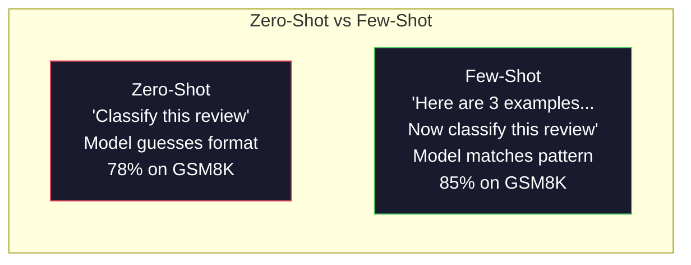
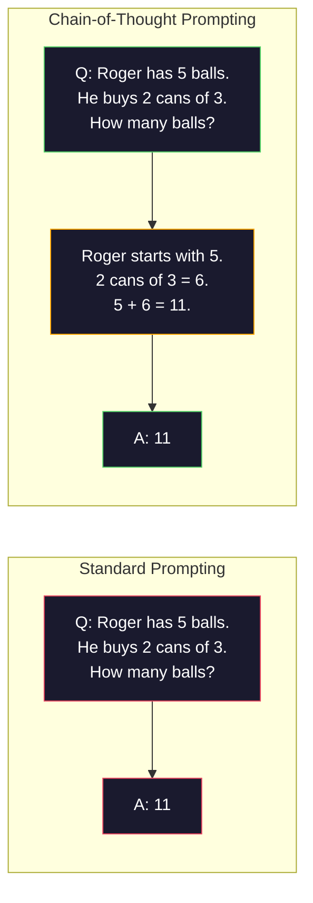
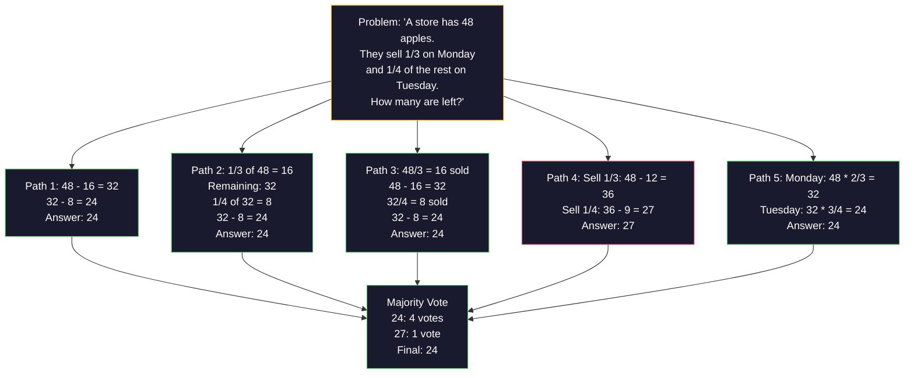
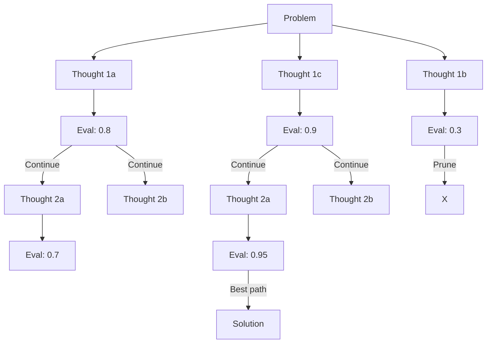
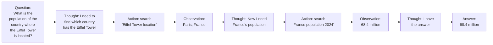
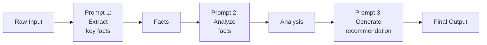

# Few-Shot, Chain-of-Thought, Tree-of-Thought

> 모델에게 무엇을 하라고 말하는 것은 prompting입니다. 어떻게 생각해야 하는지 보여주는 것은 engineering입니다. 같은 모델, 같은 작업, 같은 데이터에서 정확도가 78%에서 91%로 오르는 차이는 더 나은 모델이 아니라 더 나은 reasoning strategy입니다.

**Type:** Build
**Languages:** Python
**Prerequisites:** Lesson 11.01 (Prompt Engineering)
**Time:** ~45 minutes

## 학습 목표

- task accuracy를 최대화하는 example demonstration을 선택하고 formatting해 few-shot prompting을 구현합니다.
- math word problem 같은 multi-step problem에서 chain-of-thought(CoT) reasoning을 적용해 정확도를 높입니다.
- 여러 reasoning path를 탐색하고 가장 좋은 path를 선택하는 tree-of-thought prompt를 만듭니다.
- standard benchmark에서 zero-shot, few-shot, CoT의 accuracy improvement를 측정합니다.

## 문제

수학 튜터링 앱을 만든다고 합시다. prompt는 "Solve this word problem."입니다. GPT-5는 GSM8K라는 표준 초등 수학 benchmark에서 94%를 맞힙니다. 이미 한계에 도달했다고 생각할 수 있습니다. 그렇지 않습니다. chain-of-thought는 여전히 3-4 point를 더합니다.

"Let's think step by step"이라는 다섯 단어를 추가하면 accuracy가 91%까지 뛰는 model도 있습니다. worked example 몇 개를 추가하면 95%까지 올라갑니다. 같은 model, 같은 temperature, 같은 API cost입니다. 차이는 모델에게 scratch paper를 줬다는 것뿐입니다.

이것은 hack이 아닙니다. reasoning이 작동하는 방식입니다. 인간도 multi-step problem을 한 번의 mental leap로 풀지 않습니다. transformer도 마찬가지입니다. 모델이 intermediate token을 생성하도록 강제하면, 그 token은 다음 token을 위한 context가 됩니다. 각 reasoning step이 다음 step을 먹여 살립니다. 모델은 말 그대로 답까지 계산해 갑니다.

하지만 "think step by step"은 시작일 뿐입니다. reasoning path 다섯 개를 sample하고 majority vote를 한다면 어떨까요? 가능성의 tree를 탐색하고 branch를 평가해 prune한다면요? reasoning과 tool use를 섞는다면요? 이것들은 가설이 아니라 measured improvement가 있는 발표된 technique입니다. 이 lesson에서 직접 만듭니다.

## 개념

### Zero-shot vs few-shot: 지시보다 예제가 이길 때

zero-shot prompting은 모델에게 task만 줍니다. few-shot prompting은 먼저 example을 줍니다.

Wei et al. (2022)는 8개 benchmark에서 이를 측정했습니다. sentiment classification 같은 단순 task에서는 zero-shot과 few-shot 차이가 2% 이내였습니다. multi-step arithmetic과 symbolic reasoning 같은 복잡한 task에서는 few-shot이 accuracy를 10-25% 개선했습니다.

직관은 이렇습니다. example은 압축된 instruction입니다. output format을 설명하는 대신 보여줍니다. reasoning process를 설명하는 대신 시연합니다. 모델은 abstract instruction을 해석하는 것보다 example의 pattern을 더 안정적으로 match합니다.



**few-shot이 이기는 경우**: format-sensitive task, classification, structured extraction, domain-specific jargon, 특정 pattern을 정확히 맞춰야 하는 작업.

**zero-shot이 이기는 경우**: 단순 factual question, example이 creativity를 제한하는 creative task, 좋은 example을 찾는 것이 좋은 instruction을 쓰는 것보다 어려운 task.

### 예제 선택: 무작위보다 유사한 예제가 낫다

모든 example이 같지 않습니다. target input과 비슷한 example을 고르는 것은 random selection보다 classification task에서 5-15% 더 좋습니다(Liu et al., 2022). 원칙은 세 가지입니다.

1. **Semantic similarity**: embedding space에서 input과 가장 가까운 example을 고릅니다.
2. **Label diversity**: output category를 모두 덮습니다.
3. **Difficulty matching**: target problem과 complexity level을 맞춥니다.

대부분 task에서 optimal example 수는 3-5개입니다. 3개 미만이면 pattern을 추출할 signal이 부족합니다. 5개를 넘으면 diminishing return이 생기고 context window token을 낭비합니다. label이 많은 classification에서는 label당 example 하나를 사용하세요.

### Chain-of-Thought: 모델에게 풀이 공간 주기

Chain-of-Thought(CoT) prompting은 Wei et al. (2022)이 Google Brain에서 소개했습니다. 아이디어는 단순합니다. 모델에게 답만 요구하지 말고 먼저 reasoning step을 보여 달라고 요구합니다.



왜 기계적으로 작동할까요? transformer가 생성한 각 token은 다음 token을 위한 context가 됩니다. CoT가 없으면 모델은 모든 reasoning을 single forward pass의 hidden state에 압축해야 합니다. CoT가 있으면 intermediate computation을 token으로 externalize합니다. 각 reasoning token이 effective computation depth를 늘립니다.

**GSM8K benchmark(grade-school math, 8.5K problems):**

| 모델 | Zero-Shot | Zero-Shot CoT | Few-Shot CoT |
|-------|-----------|---------------|--------------|
| GPT-4o | 78% | 91% | 95% |
| GPT-5 | 94% | 97% | 98% |
| o4-mini (reasoning) | 97% | — | — |
| Claude Opus 4.7 | 93% | 97% | 98% |
| Gemini 3 Pro | 92% | 96% | 98% |
| Llama 4 70B | 80% | 89% | 94% |
| DeepSeek-V3.1 | 89% | 94% | 96% |

reasoning model에 대한 주의: OpenAI o-series(o3, o4-mini)와 DeepSeek-R1 같은 model은 답을 내기 전에 내부적으로 chain-of-thought를 수행합니다. 이런 model에 "Let's think step by step"을 추가하는 것은 중복이고 때로는 역효과입니다.

CoT에는 두 flavor가 있습니다.

**Zero-shot CoT**: prompt 끝에 "Let's think step by step"을 붙입니다. example이 필요 없습니다. Kojima et al. (2022)은 이 한 문장이 arithmetic, commonsense, symbolic reasoning task 전반에서 accuracy를 높인다는 것을 보였습니다.

**Few-shot CoT**: reasoning step을 포함한 example을 제공합니다. 모델이 기대하는 reasoning format을 정확히 보기 때문에 zero-shot CoT보다 효과적입니다.

**CoT가 해로운 경우**: 단순 factual recall("What is the capital of France?"), single-step classification, accuracy보다 speed가 중요한 task. CoT는 query당 50-200 token의 reasoning overhead를 추가합니다.

### Self-consistency: 많이 샘플링하고 한 번 투표하기

Wang et al. (2023)은 self-consistency를 소개했습니다. 단일 CoT path는 reasoning error를 포함할 수 있습니다. 그러나 temperature > 0으로 N개의 독립 reasoning path를 sample하고 final answer에 majority vote를 하면 error가 상쇄됩니다.



original PaLM 540B 실험에서 self-consistency는 GSM8K accuracy를 single CoT 56.5%에서 N=40 기준 74.4%로 높였습니다. GPT-5에서는 base accuracy가 이미 높아 97%에서 98%로 작은 개선만 납니다. 이 technique은 single-path error가 자주 있지만 systematic하지 않은 60-85% base CoT accuracy model에서 가장 빛납니다.

tradeoff는 명확합니다. N sample은 API cost와 latency가 N배입니다. 실제로는 N=5가 대부분 이득을 포착합니다. 의미 있는 vote의 최소값은 N=3입니다. N > 10은 대부분 task에서 diminishing return이 큽니다.

### Tree-of-Thought: 분기 탐색

Yao et al. (2023)은 Tree-of-Thought(ToT)를 소개했습니다. CoT가 하나의 linear reasoning path를 따르는 반면, ToT는 여러 branch를 탐색하고 어느 것이 유망한지 평가한 뒤 계속합니다.



ToT의 구성요소는 세 가지입니다.

1. **Thought generation**: multiple candidate next-step을 생성합니다.
2. **State evaluation**: 각 candidate를 score합니다. LLM 자체를 evaluator로 쓸 수 있습니다.
3. **Search algorithm**: tree를 BFS 또는 DFS로 탐색하고 low-scoring branch를 prune합니다.

Game of 24 task(숫자 4개를 사칙연산으로 24 만들기)에서 GPT-4 standard prompting은 7.3%를 풉니다. CoT는 4.0%로 오히려 나빠집니다. search space가 넓기 때문입니다. ToT는 74%를 풉니다.

ToT는 비쌉니다. tree의 각 node가 LLM call을 요구합니다. branching factor 3, depth 3이면 최대 39번 호출합니다. search space가 크지만 평가 가능한 문제(planning, puzzle solving, constraint가 있는 creative problem-solving)에만 사용하세요.

### ReAct: 생각하기 + 행동하기

Yao et al. (2022)은 reasoning trace와 action을 결합했습니다. 모델은 thinking(reasoning 생성)과 acting(tool call, search, compute)을 번갈아 수행합니다.



ReAct는 real data에 reasoning을 ground할 수 있기 때문에 knowledge-intensive task에서 pure CoT보다 낫습니다. HotpotQA(multi-hop question answering)에서 ReAct with GPT-4는 exact match 35.1%를 얻었고 CoT alone은 29.4%였습니다. 핵심은 observation이 reasoning error를 교정한다는 점입니다. 모델은 execution 중 plan을 업데이트할 수 있습니다.

ReAct는 modern AI agent의 기반입니다. LangChain, CrewAI, AutoGen 같은 agent framework는 Thought-Action-Observation loop의 변형을 구현합니다. full agent는 Phase 14에서 만들고, 이 lesson은 prompting pattern을 다룹니다.

### 구조화 프롬프팅: XML 태그, 구분자, 헤더

prompt가 복잡해질수록 structure가 section confusion을 막습니다.

**XML tags**는 Claude에서 특히 강하고 다른 모델에서도 잘 작동합니다.

```text
<context>
You are reviewing a pull request.
The codebase uses TypeScript and React.
</context>

<task>
Review the following diff for bugs, security issues, and style violations.
</task>
```

**Markdown headers**는 보편적입니다.

```text
## 역할
Senior security engineer at a fintech company.

## 작업
Analyze this API endpoint for vulnerabilities.
```

**Delimiters**는 최소한이지만 효과적입니다.

```text
---INPUT---
{user_text}
---END INPUT---

---INSTRUCTIONS---
Summarize the above in 3 bullet points.
---END INSTRUCTIONS---
```

### Prompt chaining: 순차 분해

어떤 task는 single prompt로 처리하기에 너무 복잡합니다. prompt chaining은 task를 여러 단계로 나누고, 한 prompt의 output을 다음 prompt의 input으로 사용합니다.



chaining은 세 이유로 single prompt보다 낫습니다. 각 step이 더 단순하고, intermediate output을 inspect/validate할 수 있으며, step별로 다른 model을 사용할 수 있습니다. 예를 들어 extraction은 cheap model, reasoning은 expensive model을 쓸 수 있습니다.

### 성능 비교

| 기법 | 가장 적합한 경우 | GSM8K 정확도(GPT-5) | API 호출 | 토큰 오버헤드 | 복잡도 |
|-----------|----------|------------------------|-----------|----------------|------------|
| Zero-Shot | Simple tasks | 94% | 1 | None | Trivial |
| Few-Shot | Format matching | 96% | 1 | 200-500 tokens | Low |
| Zero-Shot CoT | Quick reasoning boost | 97% | 1 | 50-200 tokens | Trivial |
| Few-Shot CoT | Maximum single-call accuracy | 98% | 1 | 300-600 tokens | Low |
| Self-Consistency (N=5) | 고위험 추론 | 98.5% | 5 | 토큰 비용 5배 | 중간 |
| Reasoning model (o4-mini) | Drop-in CoT replacement | 97% | 1 | hidden (2-10x internal) | Trivial |
| Tree-of-Thought | Search/planning problems | N/A (74% on Game of 24) | 10-40+ | 10-40x token cost | High |
| ReAct | Knowledge-grounded reasoning | N/A (35.1% on HotpotQA) | 3-10+ | Variable | High |
| Prompt Chaining | 복잡한 다단계 작업 | 96% (pipeline) | 2-5 | 토큰 비용 2-5배 | 중간 |

올바른 technique은 accuracy requirement, latency budget, cost tolerance에 따라 달라집니다. 대부분 production system에서는 few-shot CoT와 3-sample self-consistency fallback이 use case의 90%를 덮습니다.

## 직접 만들기

few-shot prompting, chain-of-thought reasoning, self-consistency voting을 하나의 pipeline으로 결합한 math problem solver를 만듭니다. hard problem에는 tree-of-thought를 추가합니다. 전체 구현은 `code/advanced_prompting.py`에 있습니다.

### 1단계: few-shot 예제 저장소

첫 component는 few-shot example을 관리하고 주어진 problem에 가장 관련 있는 example을 선택합니다.

```python
GSM8K_EXAMPLES = [
    {
        "question": "Janet's ducks lay 16 eggs per day...",
        "reasoning": "Janet's ducks lay 16 eggs per day...",
        "answer": "18"
    },
]
```

각 example에는 question, reasoning chain, final answer가 있습니다. reasoning chain이 일반 few-shot example을 CoT few-shot example로 바꿉니다.

### 2단계: CoT 프롬프트 빌더

prompt builder는 system message, reasoning chain이 있는 few-shot example, target question을 하나의 prompt로 조립합니다.

```python
def build_cot_prompt(question, examples, num_examples=3):
    system = (
        "You are a math problem solver. "
        "For each problem, show your step-by-step reasoning, "
        "then give the final numerical answer on the last line "
        "in the format: 'The answer is [number]'."
    )
    ...
```

`"The answer is [number]"` format constraint는 중요합니다. 이 형식이 없으면 self-consistency가 sample 간 answer를 추출하고 비교할 수 없습니다.

### 3단계: self-consistency 투표

N개의 reasoning path를 sample하고 majority answer를 선택합니다.

```python
def self_consistency_solve(question, examples, client, model, n_samples=5):
    system, user = build_cot_prompt(question, examples)
    answers = []
    reasonings = []
    ...
```

temperature 0.7이 중요합니다. temperature 0.0에서는 N개의 sample이 모두 동일해져 목적이 사라집니다. diverse reasoning path를 얻을 만큼 randomness가 필요하지만, gibberish를 만들 만큼 높으면 안 됩니다.

### 4단계: tree-of-thought 풀이기

linear reasoning이 실패하는 문제에서는 ToT가 multiple approach를 탐색하고 어느 방향이 가장 유망한지 평가합니다.

```python
def tree_of_thought_solve(question, client, model, breadth=3, depth=3):
    thoughts = generate_initial_thoughts(question, client, model, breadth)
    scored = [(t, evaluate_thought(t, question, client, model)) for t in thoughts]
    ...
```

evaluator도 LLM call입니다. 모델에게 "이 reasoning path가 문제를 푸는 데 얼마나 유망한가를 0.0부터 1.0까지 평가하라"고 묻습니다. 이것이 ToT의 핵심 통찰입니다. 모델이 자신의 partial solution을 평가합니다.

### 5단계: 전체 파이프라인

pipeline은 escalation strategy로 모든 technique을 결합합니다. cheap single CoT를 먼저 시도하고, self-consistency confidence가 낮으면 ToT로 escalate합니다.

```python
def solve_with_escalation(question, examples, client, model):
    system, user = build_cot_prompt(question, examples)
    single_response = call_llm(client, model, system, user, temperature=0.0)
    ...
```

## 사용하기

### LangChain

LangChain은 prompt template과 output parsing을 지원해 few-shot과 CoT pattern을 단순화합니다.

```python
from langchain_core.prompts import FewShotPromptTemplate, PromptTemplate
from langchain_openai import ChatOpenAI
```

semantic similarity 기반 example selection에는 `ExampleSelector` class를 사용할 수 있습니다.

### DSPy

DSPy는 prompting strategy를 optimizable module로 취급합니다. CoT prompt를 손으로 만드는 대신 signature를 정의하고 DSPy가 prompt를 optimize하게 할 수 있습니다.

```python
import dspy

dspy.configure(lm=dspy.LM("openai/gpt-4o", temperature=0.7))

class MathSolver(dspy.Module):
    def __init__(self):
        self.solve = dspy.ChainOfThought("question -> answer")
```

DSPy의 `ChainOfThought`는 reasoning trace를 자동으로 추가하고, `dspy.majority`는 self-consistency를 구현합니다.

### 직접 구현 vs framework

| 기능 | 직접 구현(이 lesson) | LangChain | DSPy |
|---------|--------------------------|-----------|------|
| 프롬프트 형식 제어 | 전체 제어 | 템플릿 기반 | 자동 |
| Self-consistency | 수동 투표 | 수동 | 내장(`dspy.majority`) |
| 예제 선택 | 커스텀 로직 | `ExampleSelector` | `dspy.BootstrapFewShot` |
| Tree-of-Thought | 커스텀 트리 탐색 | 커뮤니티 chain | 내장 아님 |
| 프롬프트 최적화 | 수동 반복 | 수동 | 자동 컴파일 |
| 가장 적합한 경우 | 학습, 커스텀 파이프라인 | 표준 워크플로 | 연구, 최적화 |

## 결과물

이 lesson은 두 artifact를 만듭니다.

**1. Reasoning Chain Prompt** (`outputs/prompt-reasoning-chain.md`): few-shot CoT와 self-consistency를 위한 production-ready prompt template입니다. example과 problem domain을 끼워 넣어 사용하세요.

**2. CoT Pattern Selection Skill** (`outputs/skill-cot-patterns.md`): task type, accuracy requirement, cost constraint에 따라 올바른 reasoning technique을 고르는 decision framework입니다.

## 연습문제

1. **gap 측정**: GSM8K problem 10개를 zero-shot, few-shot, zero-shot CoT, few-shot CoT로 각각 푸세요. 각 technique의 accuracy를 기록하세요. 어떤 technique이 가장 큰 lift를 주나요?
2. **example selection experiment**: 같은 10개 problem에서 random example selection과 hand-picked similar example을 비교하세요. accuracy difference를 측정하세요. example quality가 example quantity보다 중요해지는 지점은 어디인가요?
3. **self-consistency cost curve**: N=1, 3, 5, 7, 10으로 self-consistency를 실행하세요. accuracy vs cost(total tokens)를 plot하세요. 당신의 model에서 knee of the curve는 어디인가요?
4. **ReAct loop 만들기**: calculator tool을 pipeline에 추가하세요. 모델이 math expression을 만들면 Python `eval()`(sandbox 안에서)을 실행하고 결과를 다시 넣으세요. tool-grounded reasoning이 pure CoT보다 나은지 측정하세요.
5. **creative task용 ToT**: Tree-of-Thought solver를 "Write a 6-word story that is both funny and sad." 같은 creative writing task에 맞게 바꾸세요. LLM을 evaluator로 사용하세요. branching exploration이 single-shot generation보다 더 나은 creative output을 만드나요?

## 핵심 용어

| Term | 사람들이 흔히 말하는 것 | 실제 의미 |
|------|------------------------|----------|
| Few-shot prompting | "예제 몇 개 주기" | prompt에 input-output demonstration을 포함해 model의 output format과 behavior를 anchor하는 방식 |
| Chain-of-Thought | "step by step으로 생각하게 하기" | final answer 전에 intermediate reasoning token을 끌어내 model의 effective computation을 늘리는 방식 |
| Self-Consistency | "여러 번 돌리기" | temperature > 0에서 N개의 diverse reasoning path를 sample하고 majority vote로 final answer를 고르는 방식 |
| Tree-of-Thought | "option을 탐색하게 하기" | partial solution을 평가하고 유망한 path만 확장하는 reasoning branch 위의 structured search |
| ReAct | "thinking + tool use" | Thought-Action-Observation loop에서 reasoning trace와 external action(search, compute, API call)을 섞는 방식 |
| Prompt chaining | "단계로 나누기" | complex task를 sequential prompt로 분해하고 각 output을 다음 input으로 넘기는 방식 |
| Zero-shot CoT | "think step by step만 붙이기" | example 없이 reasoning trigger phrase를 prompt에 추가해 latent reasoning capability를 활용하는 방식 |

## 더 읽을거리

- [Chain-of-Thought Prompting Elicits Reasoning in Large Language Models](https://arxiv.org/abs/2201.11903): Wei et al. 2022. Google Brain의 original CoT paper입니다. 핵심 결과는 section 2-3을 읽으세요.
- [Self-Consistency Improves Chain of Thought Reasoning in Language Models](https://arxiv.org/abs/2203.11171): Wang et al. 2023. self-consistency paper입니다. Table 1에 필요한 수치가 있습니다.
- [Tree of Thoughts: Deliberate Problem Solving with Large Language Models](https://arxiv.org/abs/2305.10601): Yao et al. 2023. ToT paper입니다. Game of 24 결과가 highlight입니다.
- [ReAct: Synergizing Reasoning and Acting in Language Models](https://arxiv.org/abs/2210.03629): Yao et al. 2022. modern AI agent의 기반입니다.
- [Large Language Models are Zero-Shot Reasoners](https://arxiv.org/abs/2205.11916): Kojima et al. 2022. "Let's think step by step" 논문입니다.
- [DSPy: Compiling Declarative Language Model Calls into Self-Improving Pipelines](https://arxiv.org/abs/2310.03714): Khattab et al. 2023. prompting을 compilation problem으로 다룹니다.
- [OpenAI — Reasoning models guide](https://platform.openai.com/docs/guides/reasoning): chain-of-thought가 internal reasoning mode가 되는 시점에 대한 vendor guidance
- [Lightman et al., "Let's Verify Step by Step" (2023)](https://arxiv.org/abs/2305.20050): chain의 각 step을 grade하는 process reward model(PRM)
- [Snell et al., "Scaling LLM Test-Time Compute Optimally" (2024)](https://arxiv.org/abs/2408.03314): CoT length, self-consistency sampling, MCTS를 체계적으로 연구한 논문
