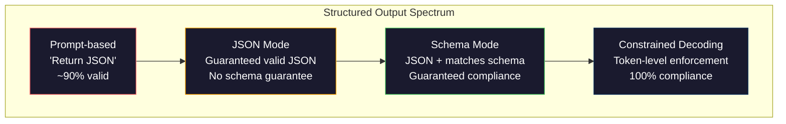
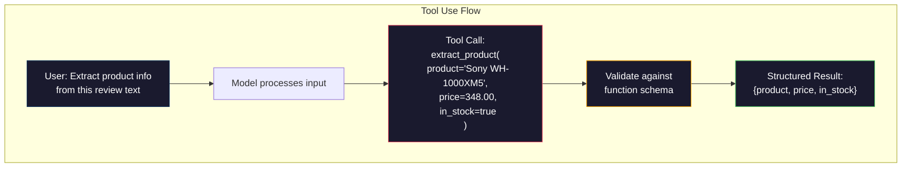

# 구조화 출력: JSON, 스키마 검증, constrained decoding

> LLM은 문자열을 반환합니다. 애플리케이션은 JSON을 필요로 합니다. 이 간극은 model hallucination보다 더 많은 production system을 망가뜨렸습니다. structured output은 자연어와 typed data 사이의 다리입니다. 제대로 만들면 LLM이 신뢰할 수 있는 API가 됩니다. 잘못 만들면 새벽 3시에 free-text를 regex로 파싱하게 됩니다.

**Type:** Build
**Languages:** Python
**Prerequisites:** Phase 10, Lessons 01-05 (LLMs from Scratch)
**Time:** ~90 minutes
**Related:** Phase 5 · 20 (Structured Outputs & Constrained Decoding)는 decoder-level theory(FSM/CFG logit processor, Outlines, XGrammar)를 다룹니다. 이 lesson은 production SDK surface(OpenAI `response_format`, Anthropic tool use, Instructor)에 집중합니다. API 아래에서 무슨 일이 일어나는지 이해하고 싶다면 Phase 5 · 20을 먼저 읽으세요.

## 학습 목표

- OpenAI와 Anthropic API parameter로 JSON-mode와 schema-constrained output을 구현합니다.
- malformed LLM output을 거부하고 error feedback으로 retry하는 Pydantic validation layer를 만듭니다.
- constrained decoding이 post-processing 없이 token level에서 valid JSON을 강제하는 방식을 설명합니다.
- unstructured text를 typed data structure로 안정적으로 변환하는 robust extraction prompt를 설계합니다.

## 문제

LLM에게 "이 텍스트에서 product name, price, availability를 추출해"라고 요청합니다. 모델은 이렇게 답합니다.

```text
The product is the Sony WH-1000XM5 headphones, which cost $348.00 and are currently in stock.
```

완전히 맞는 답입니다. 그러나 애플리케이션에는 쓸모가 없습니다. inventory system은 `{"product": "Sony WH-1000XM5", "price": 348.00, "in_stock": true}`가 필요합니다. 특정 key, type, value constraint를 가진 JSON object가 필요하지 문장이 필요한 것이 아닙니다.

순진한 해결책은 prompt에 "Respond in JSON"을 추가하는 것입니다. 90%는 작동합니다. 나머지 10%에서는 모델이 JSON을 markdown code fence로 감싸거나, "Here's the JSON:" 같은 preamble을 붙이거나, bracket을 일찍 닫아 syntactically invalid JSON을 만듭니다. JSON parser가 crash하고 pipeline이 깨집니다. try/except와 retry loop를 추가하면 retry가 가끔 다른 데이터를 생성합니다. 이제 parsing problem 위에 consistency problem까지 생깁니다.

이것은 prompt engineering 문제가 아니라 decoding 문제입니다. 모델은 token을 왼쪽에서 오른쪽으로 생성합니다. 각 위치에서 100K개 이상의 vocabulary 중 다음 token을 고릅니다. 그중 대부분은 해당 위치에서 invalid JSON을 만듭니다. 모델이 방금 `{"price":`를 출력했다면 다음 token은 digit, quote(string), `null`, `true`, `false`, negative sign 중 하나여야 합니다. 그 외는 syntactically invalid입니다. 제약이 없으면 모델은 영어로 그럴듯하지만 syntax상 치명적인 token을 고를 수 있습니다.

## 개념

### 구조화 출력 스펙트럼

structured output control에는 네 단계가 있으며 뒤로 갈수록 reliability가 높습니다.



**Prompt-based**("Respond in valid JSON"): 강제가 없습니다. 모델은 보통 따르지만 가끔 실패합니다. failure mode는 markdown fence, preamble text, truncated output, wrong structure입니다.

**JSON mode**: API가 output이 valid JSON임을 보장합니다. OpenAI의 `response_format: { type: "json_object" }`가 여기에 해당합니다. parse error는 사라지지만 expected schema와 맞는지는 보장하지 않습니다.

**Schema mode**: API가 JSON Schema를 받고 output이 그 schema와 일치함을 보장합니다. 2026년 현재 주요 provider는 모두 이를 native로 지원합니다. OpenAI는 `response_format: { type: "json_schema", json_schema: {...} }`, Anthropic은 `input_schema`가 있는 tool use, Gemini는 `response_schema`와 `response_mime_type: "application/json"`을 사용합니다.

**Constrained decoding**: generation 중 각 token position에서 invalid output으로 이어지는 token을 mask out합니다. schema가 number를 요구하는데 모델이 letter를 내려고 하면 그 token의 probability가 0이 됩니다. OpenAI structured output mode와 Outlines, Guidance 같은 library가 내부에서 구현하는 방식입니다.

### JSON Schema: 계약 언어

JSON Schema는 output shape를 모델 또는 validation layer에 알려주는 방법입니다. 모든 주요 structured output system이 사용합니다.

```json
{
  "type": "object",
  "properties": {
    "product": { "type": "string" },
    "price": { "type": "number", "minimum": 0 },
    "in_stock": { "type": "boolean" },
    "categories": {
      "type": "array",
      "items": { "type": "string" }
    }
  },
  "required": ["product", "price", "in_stock"]
}
```

이 schema는 output이 string `product`, 0 이상 number `price`, boolean `in_stock`, optional string array `categories`를 가진 object여야 한다고 말합니다. 맞지 않는 output은 거부됩니다. nested object, typed array, enum, regex pattern, `oneOf`/`anyOf`/`allOf` 같은 polymorphic output도 표현할 수 있습니다.

### Pydantic 패턴

Python에서는 JSON Schema를 손으로 쓰지 않습니다. Pydantic model을 정의하면 schema가 자동 생성됩니다.

```python
from pydantic import BaseModel

class Product(BaseModel):
    product: str
    price: float
    in_stock: bool
    categories: list[str] = []
```

Instructor library와 OpenAI SDK는 Pydantic model을 직접 받을 수 있습니다. model class를 넘기면 validated instance를 돌려받습니다. LLM output이 맞지 않으면 Instructor가 자동으로 retry합니다.

### 함수 호출 / 도구 사용

같은 문제의 다른 interface입니다. 모델에게 JSON을 직접 만들라고 하는 대신 typed parameter가 있는 "tool"(function)을 정의합니다. 모델은 structured argument가 있는 function call을 출력합니다. OpenAI는 function calling, Anthropic은 tool use라고 부릅니다. 결과는 같습니다. structured data입니다.



tool use는 모델이 parameter를 채우기만 하는 것이 아니라 어떤 function을 호출할지 선택해야 할 때 선호됩니다. extraction schema가 10개 있고 input에 따라 모델이 하나를 고르게 해야 한다면 tool use가 schema selection과 structured output을 함께 제공합니다.

### 흔한 실패 mode

schema enforcement가 있어도 subtle failure는 남습니다.

**Hallucinated values**: output은 schema와 맞지만 데이터가 invented입니다. text는 $348이라고 말하는데 모델이 `{"price": 299.99}`를 냅니다. type은 맞으므로 schema validation은 잡지 못합니다.

**Enum confusion**: field를 `["in_stock", "out_of_stock", "preorder"]`로 제한했는데 모델이 `"available"`을 냅니다. 의미는 맞지만 allowed set이 아닙니다. constrained decoding은 이를 막지만 prompt-based 접근은 막지 못합니다.

**Nested object depth**: 깊게 nested된 schema(4+ level)는 error를 더 많이 만듭니다. nesting level마다 모델이 structure를 잃을 지점이 늘어납니다.

**Array length**: 모델이 array item을 너무 많이 또는 너무 적게 만들 수 있습니다. schema는 `minItems`, `maxItems`를 지원하지만 모든 provider가 decoding level에서 강제하지는 않습니다.

**Optional field omission**: technically optional이지만 use case상 중요한 field를 모델이 생략합니다. data가 없을 때도 `null`을 명시적으로 내도록 required로 두는 편이 낫습니다.

## 직접 만들기

### 1단계: JSON Schema 검증기

Python object가 JSON Schema와 맞는지 확인하는 validator를 scratch에서 만듭니다. output side에서 compliance를 검증하는 역할입니다.

```python
import json

def validate_schema(data, schema):
    errors = []
    _validate(data, schema, "", errors)
    return errors
```

전체 구현은 `code/main.py`에 있습니다. object, array, string, number, boolean, integer type을 확인하고 required field, enum, min/max, minItems/maxItems를 검증합니다.

### 2단계: Pydantic 스타일 모델에서 스키마로

Python class처럼 field를 정의하고 JSON Schema를 자동 생성하는 최소 converter를 만듭니다.

```python
class SchemaField:
    def __init__(self, field_type, required=True, default=None, enum=None, minimum=None, maximum=None):
        self.field_type = field_type
        self.required = required
        self.default = default
        self.enum = enum
        self.minimum = minimum
        self.maximum = maximum
```

이 layer는 `str`, `int`, `float`, `bool`, `list`를 JSON Schema type으로 바꾸고 required list를 채웁니다. production에서는 Pydantic을 쓰지만, 직접 만들어보면 schema generation이 얼마나 단순한 contract인지 알 수 있습니다.

### 3단계: constrained token 필터

partial JSON string과 schema가 있을 때 현재 위치에서 어떤 token category가 valid한지 계산해 constrained decoding을 simulation합니다.

```python
def next_valid_tokens(partial_json, schema):
    stripped = partial_json.strip()

    if not stripped:
        return ["{"]

    try:
        json.loads(stripped)
        return ["<EOS>"]
    except json.JSONDecodeError:
        pass

    last_char = stripped[-1] if stripped else ""
    ...
```

실제 decoder는 character category가 아니라 tokenizer vocabulary 전체를 mask합니다. 하지만 원리는 같습니다. 현재 prefix가 grammar의 어느 state에 있는지 추적하고, 다음 state로 이어질 수 없는 token을 금지합니다.

### 4단계: 추출 파이프라인

schema를 정의하고, LLM이 structured output을 만드는 과정을 simulation하고, output을 validate하고, 실패하면 retry합니다.

```python
product_schema = {
    "type": "object",
    "properties": {
        "product": {"type": "string"},
        "price": {"type": "number", "minimum": 0},
        "in_stock": {"type": "boolean"},
        "categories": {"type": "array", "items": {"type": "string"}},
    },
    "required": ["product", "price", "in_stock"],
}
```

pipeline은 raw string을 `json.loads()`로 parse하고 `validate_schema()`로 shape를 검사합니다. parse error나 validation error가 있으면 retry합니다. production에서는 이 error를 model context로 다시 보내 "이 오류를 고쳐라"라고 요청합니다.

## 사용하기

### OpenAI 구조화 출력

```python
# from openai import OpenAI
# from pydantic import BaseModel
#
# client = OpenAI()
#
# class Product(BaseModel):
#     product: str
#     price: float
#     in_stock: bool
#
# response = client.beta.chat.completions.parse(
#     model="gpt-5-mini",
#     messages=[
#         {"role": "system", "content": "Extract product information."},
#         {"role": "user", "content": "Sony WH-1000XM5, $348, in stock"},
#     ],
#     response_format=Product,
# )
```

OpenAI structured output mode는 내부적으로 constrained decoding을 사용합니다. 모델이 생성하는 모든 token은 Pydantic schema와 맞는 output으로 이어져야 합니다. retry도 별도 validation도 필요 없습니다. constraint가 decoding process에 baked in되어 있습니다.

### Anthropic tool use

```python
# import anthropic
#
# client = anthropic.Anthropic()
#
# response = client.messages.create(
#     model="claude-opus-4-7",
#     max_tokens=1024,
#     tools=[{
#         "name": "extract_product",
#         "description": "Extract product information from text",
#         "input_schema": {
#             "type": "object",
#             "properties": {
#                 "product": {"type": "string"},
#                 "price": {"type": "number"},
#                 "in_stock": {"type": "boolean"},
#             },
#             "required": ["product", "price", "in_stock"],
#         },
#     }],
#     messages=[{"role": "user", "content": "Extract: Sony WH-1000XM5, $348, in stock"}],
# )
```

Anthropic은 tool use로 structured output을 구현합니다. 모델은 `input_schema`와 맞는 structured argument를 가진 tool call을 냅니다. 같은 결과, 다른 API surface입니다.

### Instructor 라이브러리

```python
# pip install instructor
# import instructor
# from openai import OpenAI
# from pydantic import BaseModel
#
# client = instructor.from_openai(OpenAI())
#
# class Product(BaseModel):
#     product: str
#     price: float
#     in_stock: bool
#
# product = client.chat.completions.create(
#     model="gpt-5-mini",
#     response_model=Product,
#     messages=[{"role": "user", "content": "Sony WH-1000XM5, $348, in stock"}],
# )
```

Instructor는 어떤 LLM client든 감싸서 Pydantic validation과 automatic retry를 추가합니다. 첫 시도가 validation에 실패하면 error를 context로 model에 다시 보내 output을 고치게 합니다. OpenAI뿐 아니라 여러 provider에서 작동합니다.

## 결과물

이 lesson은 `outputs/prompt-structured-extractor.md`를 만듭니다. schema definition과 unstructured text를 넣으면 validated JSON을 돌려주는 reusable prompt template입니다.

또한 `outputs/skill-structured-outputs.md`를 만듭니다. provider, reliability requirement, schema complexity에 따라 올바른 structured output strategy를 고르는 decision framework입니다.

## 연습문제

1. schema validator에 `oneOf` 지원을 추가하세요. data가 여러 schema 중 정확히 하나와 맞아야 합니다. 예를 들어 field가 shape가 다른 `Product` 또는 `Service` object일 수 있는 polymorphic output을 처리합니다.
2. 두 schema를 비교해 breaking change(removed required fields, changed types)와 non-breaking change(added optional fields, relaxed constraints)를 식별하는 "schema diff" tool을 만드세요.
3. 더 현실적인 constrained decoding simulator를 구현하세요. JSON Schema와 100-token vocabulary(letters, digits, punctuation, keywords)가 주어졌을 때 generation을 step by step으로 진행하며 각 위치에서 invalid token을 mask하세요. 각 step에서 vocabulary 중 몇 %가 valid한지 측정하세요.
4. extraction eval suite를 만드세요. hand-labeled JSON output이 있는 product description 50개를 만들고 pipeline을 실행해 exact match, field-level accuracy, type compliance를 측정하세요. 어떤 field가 가장 추출하기 어려운지 찾으세요.
5. extraction pipeline에 "confidence score"를 추가하세요. 각 extracted field에 대해 token probability 또는 3회 extraction consistency를 기반으로 confidence를 추정하고 low-confidence field를 human review 대상으로 표시하세요.

## 핵심 용어

| Term | 사람들이 흔히 말하는 것 | 실제 의미 |
|------|------------------------|----------|
| JSON mode | "JSON을 반환함" | syntactically valid JSON output은 보장하지만 특정 schema는 강제하지 않는 API flag |
| Structured output | "typed JSON" | 올바른 key, type, constraint를 가진 특정 JSON Schema와 일치하는 output |
| Constrained decoding | "guided generation" | 각 token position에서 invalid output으로 이어지는 token을 mask해 schema compliance를 보장하는 방식 |
| JSON Schema | "JSON template" | JSON data의 structure, type, constraint를 선언적으로 설명하는 language |
| Pydantic | "Python dataclasses+" | type validation이 있는 data model을 정의하고 JSON Schema를 생성하는 Python library |
| Function calling | "tool use" | free text 대신 name + typed argument로 구성된 structured function invocation을 LLM이 출력하는 방식 |
| Instructor | "LLM용 Pydantic" | validation failure 시 automatic retry와 함께 validated Pydantic instance를 반환하도록 LLM client를 감싸는 library |
| Token masking | "vocabulary filtering" | generation 중 특정 token probability를 0으로 만들어 모델이 생성하지 못하게 하는 것 |
| Schema compliance | "shape가 맞음" | required field, correct type, constraint 내 value, disallowed extra field 없음 |
| Retry loop | "될 때까지 다시 시도" | validation error를 model에 보내 output을 고치게 하는 방식 |

## 더 읽을거리

- [OpenAI Structured Outputs Guide](https://platform.openai.com/docs/guides/structured-outputs): OpenAI API의 JSON Schema 기반 constrained decoding 공식 문서
- [Willard & Louf, 2023 -- "Efficient Guided Generation for Large Language Models"](https://arxiv.org/abs/2307.09702): JSON Schema를 finite state machine으로 compile해 token-level constraint를 거는 Outlines 논문
- [Instructor documentation](https://python.useinstructor.com/): Pydantic validation과 retry로 structured output을 얻는 표준 Python library
- [Anthropic Tool Use Guide](https://docs.anthropic.com/en/docs/tool-use): Claude가 JSON Schema `input_schema`를 가진 tool use로 structured output을 구현하는 방식
- [JSON Schema specification](https://json-schema.org/): 주요 structured output system이 사용하는 schema language 전체 spec
- [Outlines library](https://github.com/outlines-dev/outlines): regex와 JSON Schema를 FSM으로 compile하는 open-source constrained generation
- [Dong et al., "XGrammar: Flexible and Efficient Structured Generation Engine for Large Language Models" (MLSys 2025)](https://arxiv.org/abs/2411.15100): token mask를 약 100 ns/token에 수행하는 최신 grammar engine
- [Beurer-Kellner et al., "Prompting Is Programming: A Query Language for Large Language Models" (LMQL)](https://arxiv.org/abs/2212.06094): constrained decoding을 type과 value constraint가 있는 query language로 다룬 논문
- [Microsoft Guidance (framework docs)](https://github.com/guidance-ai/guidance): Outlines와 XGrammar를 보완하는 vendor-agnostic template-driven constrained generation framework
